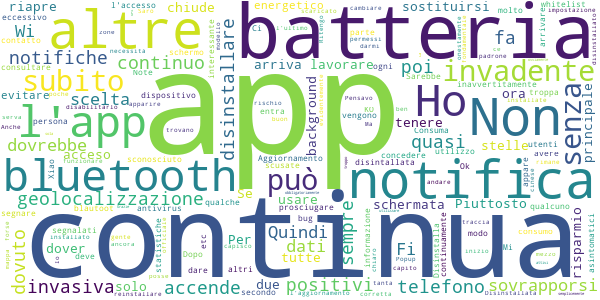

# SM_Covid19
App version ``3.6``

Analyzed with [covid-apps-observer](http://github.com/covid-apps-observer) project, version ``0.1``

## App overview
| | |
|-------------------------|-------------------------| 
| **Name**&nbsp;&nbsp;&nbsp;&nbsp;&nbsp;&nbsp;&nbsp;&nbsp;&nbsp;&nbsp;&nbsp;&nbsp;&nbsp;&nbsp;&nbsp;&nbsp;&nbsp;&nbsp;&nbsp;&nbsp;&nbsp;&nbsp;&nbsp;&nbsp;&nbsp;&nbsp;&nbsp;&nbsp;&nbsp;&nbsp;&nbsp;&nbsp;&nbsp;&nbsp;&nbsp;&nbsp;&nbsp;&nbsp;&nbsp;&nbsp;  | SM_Covid19 |
| **Unique identifier** | it.softmining.projects.covid19.savelifestyle |
| **Link to Google Play** | [https://play.google.com/store/apps/details?id=it.softmining.projects.covid19.savelifestyle](https://play.google.com/store/apps/details?id=it.softmining.projects.covid19.savelifestyle) |
| **Summary**  | Community di contact tracing volontario per la sfida al Covid19. |
| **Privacy policy** | [https://www.softmining.it/index.php/sm-covid19-app/](https://www.softmining.it/index.php/sm-covid19-app/) |
| **Latest version** | 3.6 |
| **Last update** | 2020-05-12 19:58:33 |
| **Recent changes** | Siete in 10.000 attivi... aiutateci ad arrivare a 20.000!  Abbiamo migliorato la calibrazione dei sensori BLE e iniziato le procedure di attivazione dei nuovi ID a 128bit. |
| **Installs**  | 10.000+ |
| **Category** | Salute e fitness |
| **First release** | 12 apr 2020 |
| **Size**  | 4,4M |
| **Supported Android version**  | 5.0 e versioni successive |

### Description
> Questa App è stata sviluppata e viene costantemente aggiornata con l'obiettivo di valutare (attraverso la definizione di modelli statistici e matematici) il rischio di trasmissione (e il comportamento epidemico) del virus attraverso il monitoraggio:
 - del numero dei contatti
 - della durata dei contatti;
 - della distanza presente tra i contatti rilevati rispetto alla durata del contatto.
 Sm-Covid-19 non acquisisce dati personali ne dati sanitari: Ti preghiamo di visualizzare il video introduttivo per avere maggiori dettagli sullo scopo e sul funzionamento di questa App. 
 Se desideri maggiori dettagli tecnici sul funzionamento di Sm-Covid-19 puoi visitare questo link: https://www.smcovid19.org/recover/
 Sm-Covid-19 non acquisisce dati sensibili dell’utente (ne ha bisogno di tali dati per funzionare), salvo nel momento in cui sia l'utente stesso a decidere di utilizzare il modulo di segnalazione per comunicare il suo sospetto di essere infetto. Il modulo di auto-segnalazione non sarà attivo durante la fase di Beta Testing.
 Durante la fase di Beta Testing esteso, in concomitanza con l'avvio della fase 2, ci occorrerà un gran numero di utenti attivi, per poter migliorare i modelli di stima del contagio: Al momento siamo una piccola community di 30.000 volontari, ma per poter eseguire calcoli statistici precisi ti chiediamo di aiutarci a diffondere l'App tra tutti i tuoi contatti, sopratutto quelli con i quali presumibilmente potresti entrare in contatto durante la fase 2.
 Ci teniamo a ricordarti che SOLO le autorità sanitarie possono indicare la positività di un soggetto. I valori di rischio indicati in Sm-Covid-19 NON possono essere considerate diagnosi di positività o negatività al Covid-19: Lo scopo di questa APP è di generare modelli rappresentativi del contagio (modelli matematici) e statistiche accurate.
 L’utente non viene geo-localizzato, né viene reso riconoscibile, salvo nel caso in cui esso stesso decida di condividere di suo spontanea volontà i dati GPS attraverso il menù Impostazioni -> Abilita condivisione dati GPS.  
 I dati GPS verranno registrati SOLO quando verranno rilevati dei contatti. Se nessun utente viene rilevato nei dintorni, nessun dato viene acquisito. È possibile disabilitare in qualsiasi momento l'acquisizione dei dati GPS. 
 Le informazioni acquisite (solo numero, tipo di contatto, distanza e dati GPS se abilitati) saranno condivise con le sole autorità sanitarie. Il codice sorgente sarà condiviso con le autorità competenti e sarà reso disponibile a fine emergenza.
 Sm-Covid-19 è stata sviluppata e viene manutenuta senza fini economici né di acquisizione di dati sensibili. 
 Sm-Covid-19 non può essere considerata sostitutiva di una diagnosi medica.

### User interface
The developers of the app provide the following screenshots in the Google play store.
| | | |
|:-------------------------:|:-------------------------:|:-------------------------:|
 |   |   |   | 
 |   |  

## Development team
In the following we report the main information provided by the development team in the Google play store.

| | |
|-------------------------|-------------------------|
| **Developer**  | Softmining Srl |
| **Website**  | [https://www.smcovid19.org/](https://www.smcovid19.org/) |
| **Email** | smcovid19@softmining.it |
| **Physical address**  | [Via Tenente Corrado 22 - 83100 Avellino - Italia](https://www.google.com/maps/search/Via%20Tenente%20Corrado%2022%20-%2083100%20Avellino%20-%20Italia) (Google Maps) |
| **Other developed apps**  | [https://play.google.com/store/apps/developer?id=Softmining+Srl](https://play.google.com/store/apps/developer?id=Softmining+Srl) |

## Android support

| | |
|-------------------------|-------------------------|
| **Declared target Android version**  | Android10, version 10 (API level 29) |
| **Effective target Android version**  | Android10, version 10 (API level 29) |
| **Minimum supported Android version**  | Lollipop, version 5.0 (API level 21) |
| **Maximum target Android version**  | - |

The larger the difference between the minimum and maximum supported Android versions, the better. A larger difference means a wider audience. For example, old phones have a very low Android version, so a high minimum supported Android version means that the app cannot be used by users with old phones, thus leading to accessibility problems. 

## Requested permissions

In the following we report the complete list of the permissions requested by the app. 

| **Permission** | **Protection level** | **Description** | 
|-------------------------|-------------------------|-------------------------|
 **android.permission ACCESS_BACKGROUND_LOCATION** | :warning:**Dangerous** | Allows an app to access location in the background. 
 **android.permission ACCESS_COARSE_LOCATION** | :warning:**Dangerous** | Allows an app to access approximate location. 
 **android.permission ACCESS_FINE_LOCATION** | :warning:**Dangerous** | Allows an app to access precise location. 
 **android.permission ACCESS_NETWORK_STATE** | Normal | Allows applications to access information about networks. 
 **android.permission BLUETOOTH** | Normal | Allows applications to connect to paired bluetooth devices. 
 **android.permission BLUETOOTH_ADMIN** | Normal | Allows applications to discover and pair bluetooth devices. 
 **android.permission FOREGROUND_SERVICE** | Normal | Allows a regular application to use Service.startForeground. 
 **android.permission INTERNET** | Normal | Allows applications to open network sockets. 
 **android.permission READ_APP_BADGE** | - | - 
 **android.permission READ_EXTERNAL_STORAGE** | :warning:**Dangerous** | Allows an application to read from external storage. 
 **android.permission RECEIVE_BOOT_COMPLETED** | Normal | Allows an application to receive the Intent.ACTION_BOOT_COMPLETED that is broadcast after the system finishes booting. 
 **android.permission REQUEST_IGNORE_BATTERY_OPTIMIZATIONS** | Normal | Permission an application must hold in order to use Settings.ACTION_REQUEST_IGNORE_BATTERY_OPTIMIZATIONS. 
 **android.permission SYSTEM_ALERT_WINDOW** | Signature - preinstalled - appop - pre23 - development | Allows an app to create windows using the type WindowManager.LayoutParams.TYPE_APPLICATION_OVERLAY, shown on top of all other apps. 
 **android.permission USE_FULL_SCREEN_INTENT** | Normal | Required for apps targeting Build.VERSION_CODES.Q that want to use notification full screen intents. 
 **android.permission VIBRATE** | Normal | Allows access to the vibrator. 
 **android.permission WAKE_LOCK** | Normal | Allows using PowerManager WakeLocks to keep processor from sleeping or screen from dimming. 
 **android.permission WRITE_EXTERNAL_STORAGE** | :warning:**Dangerous** | Allows an application to write to external storage. 
 **com.anddoes.launcher.permission UPDATE_COUNT** | - | - 
 **com.google.android.c2dm.permission RECEIVE** | - | - 
 **com.google.android.finsky.permission BIND_GET_INSTALL_REFERRER_SERVICE** | - | - 
 **com.htc.launcher.permission READ_SETTINGS** | - | - 
 **com.htc.launcher.permission UPDATE_SHORTCUT** | - | - 
 **com.huawei.android.launcher.permission CHANGE_BADGE** | - | - 
 **com.huawei.android.launcher.permission READ_SETTINGS** | - | - 
 **com.huawei.android.launcher.permission WRITE_SETTINGS** | - | - 
 **com.huawei.permission.external_app_settings USE_COMPONENT** | - | - 
 **com.majeur.launcher.permission UPDATE_BADGE** | - | - 
 **com.oppo.launcher.permission READ_SETTINGS** | - | - 
 **com.oppo.launcher.permission WRITE_SETTINGS** | - | - 
 **com.sec.android.provider.badge.permission READ** | - | - 
 **com.sec.android.provider.badge.permission WRITE** | - | - 
 **com.sonyericsson.home.permission BROADCAST_BADGE** | - | - 
 **com.sonymobile.home.permission PROVIDER_INSERT_BADGE** | - | - 
 **it.softmining.projects.covid19.savelifestyle.permission C2D_MESSAGE** | - | - 
 **me.everything.badger.permission BADGE_COUNT_READ** | - | - 
 **me.everything.badger.permission BADGE_COUNT_WRITE** | - | - 
 **oppo.permission OPPO_COMPONENT_SAFE** | - | - 

## Mentioned servers

| **Server** | **Registrant** | **Registrant country** | **Creation date** | 
|-------------------------|-------------------------|-------------------------|-------------------------|
 | googlesyndication.com | Google LLC | :us: US | 2003-01-21 06:17:24 |
 | google.com | Google LLC | :us: US | 1997-09-15 04:00:00 |
 | app-measurement.com | Google LLC | :us: US | 2015-06-19 20:13:31 |
 | googleadservices.com | Google LLC | :us: US | 2003-06-19 16:34:53 |
 | onesignal.com | Domains By Proxy, LLC | :us: US | 2011-09-10 18:40:52 |
 | githubusercontent.com | GitHub, Inc. | :us: US | 2014-02-06 21:17:00 |
 | softmining.it | SOFTMINING S.R.L. | :it: IT | 2017-10-16 19:27:28 |
 | smcovid19.org | Data Protected | :canada: CA | 2020-03-31 21:30:24 |
 | governo.it | Presidenza del Consiglio dei Ministri | :it: IT | 2000-01-24 00:00:00 |
 | amazonaws.com | Amazon.com, Inc. | :us: US | 2005-08-18 02:10:45 |
 | crashlytics.com | Google LLC | :us: US | 2011-01-21 15:30:40 |

## Security analysis 

Below we report the main security warnings raised by our execution of the [Androwarn](https://github.com/maaaaz/androwarn) security analysis tool.

**Telephony identifiers leakage**
> - This application reads the numeric name (MCC+MNC) of current registered operator 
> - This application reads the operator name 

**Connection interfaces exfiltration**
> - This application reads details about the currently active data network 

**Telephony services abuse**
> - This application makes phone calls 

**Suspicious connection establishment**
> - This application opens a Socket and connects it to the remote address 'Ld/a/a/a/a;->a(Ljava/lang/String;)Ljava/lang/StringBuilder;' on the 'N/A' port  
> - This application opens a Socket and connects it to the remote address 'Ljava/net/Proxy;->type()Ljava/net/Proxy$Type;' on the 'N/A' port  
> - This application opens a Socket and connects it to the remote address 'hostname == null ' on the 'N/A' port  
> - This application opens a Socket and connects it to the remote address 'timeout' on the 'N/A' port  

**Code execution**
> - This application executes a UNIX command containing this argument: 'Ljava/lang/StringBuilder;->toString()Ljava/lang/String;' 

## User ratings and reviews

Below we provide information about how end users are reacting to the app in terms of ratings and reviews in the Google Play store.

### Ratings

The SM_Covid19 app has been installed by more than **10000** times. At this time, **441** rated the app and its average score is **4.2**. Below we show the distribution of the ratings across the usual star-based rating of Google Play

:star::star::star::star::star:: 269

:star::star::star::star:: 101

:star::star::star:: 4

:star::star:: 22

:star:: 44

### Reviews 

#### 5-star reviews

> Utile  :date: __2020-06-01 21:44:00__

> Appena installato,spero che funzioni adeguatamente e che mi protegga, xchè ho una persona di 70 anni invalido con il morbo di Parkinson e problemi respiratori ecc.ecc. cmq semplice da istallare e da settare io lo consiglio.  :date: __2020-06-01 18:45:30__

> Si presenta bene 👍 vedremo se è valida  :date: __2020-05-30 18:59:50__

> Spero che serva per la mia tranquillita, perche sono in cura per una B.P.C.O  :date: __2020-05-28 19:04:30__

> Ottima  :date: __2020-05-28 06:13:42__

> Ottimo Proviamola  :date: __2020-05-26 12:37:25__

> Fa il suo dovere...  :date: __2020-05-25 19:03:11__

> Utile  :date: __2020-05-23 16:17:59__

> Ottimo!  :date: __2020-05-22 22:17:43__

> Ottima  :date: __2020-05-18 22:36:53__

#### 4-star reviews

> Molto interessante  :date: __2020-05-22 05:46:37__

> Discreta precisione, vedremo in luoghi aperti  :date: __2020-05-18 01:27:06__

> Ottima app.  :date: __2020-05-15 20:54:14__

> Ok  :date: __2020-05-14 13:42:36__

> App installata in fase di controllo  :date: __2020-05-14 10:24:44__

> Ho installato l'app... però io faccio la cassiera in un supermercato...non penso possa definirsi rischio basso...ma non posso scegliere il mio lavoro xchè non c'è! Io aggiungerei più professioni...  :date: __2020-05-11 21:33:23__

> Migliorabile  :date: __2020-05-11 14:33:23__

> La parte sulle statistiche va rivista, quelli che chiamate "positivi totali" sono gli attuali, quelli che chiamate "positivi nuovi" è l'incremento giornaliero sui casi totali, quelli che chiamate "variazione totale" è invece la variazione giornaliera sugli attuali. Aggiungo 2 stelle dopo gli aggiornamenti, stanno sicuramente lavorando, a questo punto mi auguro che abbia una buona diffusione visto che dell'app immuni non se ne parla neanche più (altro che pronta per l'inizio della Fase 2!).  :date: __2020-05-08 20:19:46__

> Faccio l'antennista e mi darebbe più sicurezza sapere che tutti usano una app. come questa  :date: __2020-05-05 08:50:51__

> Sarebbe importante, al fine di capire quanto utile sia l'uso di questa app, avere anche una traccia anonima di quanti altri utenti con la stessa app abbiamo incontrato.  :date: __2020-05-04 13:47:20__

#### 3-star reviews

> Sono un Tsrm sarebbe bello inserire anche profili sanitari non citati dai media...  :date: __2020-06-01 20:22:02__

> Affidabile al50%  :date: __2020-05-22 11:17:59__

> Come faccio a mettere come lingua l'italiano? Nelle impostazioni c'è scritto italiano ma invece nella app compare l'arabo  :date: __2020-05-20 10:31:01__

> è il primo maggio....dove è la versione senza beta test, cioè operativa?! senza la possibilità di segnalarsi che senso ha l app?  :date: __2020-05-01 14:50:45__

> Mi sento più protetta  :date: __2020-04-30 19:36:47__

> Ho dovuto disinstallarla perché mi consumava moltissimo la batteria. Attendo che sia migliorato questo aspetto per installarla di nuovo. Penso possa essere utile se diffusa capillarmente...  :date: __2020-04-25 20:18:11__

> Non posso dare un voto perchè la ho scaricata da qualche ora e fatto una gran fatica ad avvisarla. Ancora adesso continua ogni pochi minuti a chiedere autorizzazione ad avvio automatico ed attività in background. Concesse più volte. In particolare per le attività in background non è capace di raggiungere automaticamente le impostazioni. Però sembra sia tutto in funzione boh .. In ogni caso sto utilizzando uno Xiaomi MI9SE. Saluti  :date: __2020-04-25 17:06:39__

> Dopo l aggiornamento, il telefono ogni tanto si illumina e poi si rispegne  :date: __2020-04-25 13:51:37__

> Da perfezionare. Il bluetooth salta continuamente e a volte sovrasta le altre app. A cosa serva poi se non si sa se si ha il virus o no, resta un mistero  :date: __2020-04-24 14:45:48__

> Discreta  :date: __2020-04-24 10:59:25__

#### 2-star reviews

> la volevo scaricare ma non mi fa andare avanti,boh...  :date: __2020-06-01 20:40:14__

> Ti divora la batteria , Non posso tenere un app che in tre ore sei 13 % energia, scusate anche se togli il Bluetooth e sempre in eseguzione , non voglio dire che non è buona come app ma rimani senza batteria in poche ore se il cellulare a qualche anno la batteria ti saluta  :date: __2020-06-01 17:41:33__

> Durante l'installazione viene chiesto di abilitare 3 funzioni (bluetooth, avvio automatico etc.) ma appena ne seleziono una, passa alla schermata successiva e non da la possibilità di abilitare le altre 2. Inoltre, se entro nelle Impostazioni e spunto "Permetti l'uso del GPS", quando esco e rientro lo trovo ancora non spuntato.  :date: __2020-06-01 10:55:24__

> Per ora due stelle. Piuttosto invadente, è una notifica continua! Se si chiude arriva subito una notifica e si riapre. Non può lavorare in background come tutte le altre senza sostituirsi alla schermata principale? E usare solo la geolocalizzazione senza dover tenere acceso anche il bluetooth, sia per il risparmio energetico della batteria sia per evitare inavvertitamente di concedere l'accesso al telefono ad un dispositivo sconosciuto? Aggiornamento: Ok per le notifiche, non ci sono più ma KO per la whitelist perché non può e non deve prosciugare la batteria.  :date: __2020-05-21 09:34:47__

> Disinstalla quasi subito, mi appare in modo quasi continuo la notifica da parte di questa app di un consumo eccessivo della batteria.  :date: __2020-05-16 16:25:43__

> Invadente e vengono segnalati bug da antivirus disintallata  :date: __2020-05-05 11:23:25__

> Consuma troppa batteria. Sarebbe interessante avere qualche informazione in più da consultare, se si entra in contatto con qualcuno, statistiche di utilizzo degli altri utenti etc... Ho uno Xiao Mi Note 10  :date: __2020-05-04 15:13:22__

> Ci sono sempre gli asintomatici, poi scusate se una persona non accende il blautoot come fa a segnare i positivi??  :date: __2020-04-30 05:35:49__

> Ho dovuto disinstallare perché molto invasiva, continua a dare notifiche e a sovrapporsi alle altre app.  :date: __2020-04-28 18:56:54__

> A me ogni 7 secondo mi fa arrivare lo schermo ...continuamente ...  :date: __2020-04-25 14:22:54__

#### 1-star reviews

> Non ė quella del mInIstero della salute ATTENZIONE!!!  :date: __2020-06-01 22:00:24__

> Non funziona pur avendo abilitato tutto soldi dei contribuenti spesi male.  :date: __2020-06-01 21:22:05__

> Non funziona  :date: __2020-06-01 17:37:40__

> Appena Installata ma al momento non si apre.  :date: __2020-06-01 16:15:11__

> Pessima app  :date: __2020-06-01 16:06:29__

> App inutile  :date: __2020-06-01 15:18:42__

> Fa schifo, rimangono sempre notifiche indecifrabili....  :date: __2020-05-31 10:27:26__

> Non funziona è come se fosse zoomata e non si visualizza tutto  :date: __2020-05-27 08:13:39__

> Questa e' app ufficiale immuni?  :date: __2020-05-25 23:53:42__

> Manca tipologia di utente soccoritore  :date: __2020-05-09 15:39:05__

