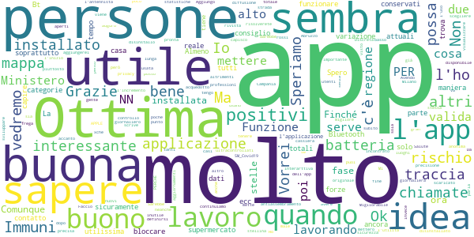
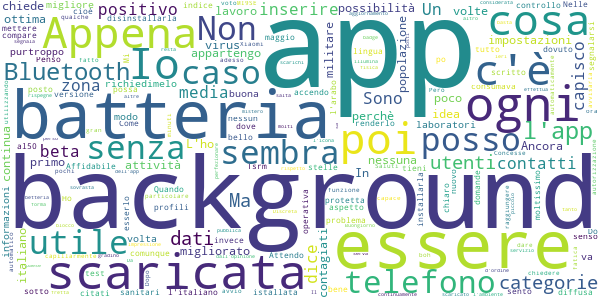
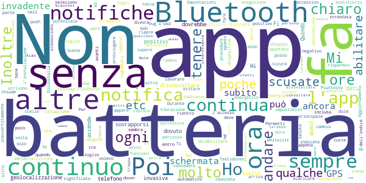
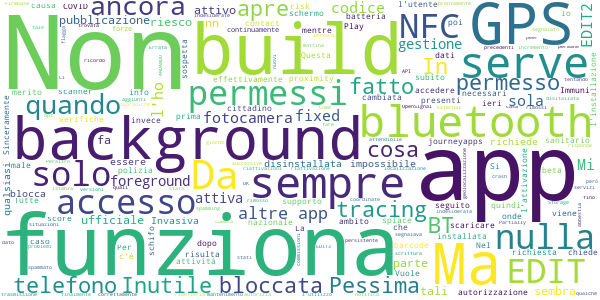

# SM_Covid19
App version ``3.9``

Analyzed with [covid-apps-observer](http://github.com/covid-apps-observer) project, version ``0.1``

## App overview
| | |
|-------------------------|-------------------------| 
| **Name**&nbsp;&nbsp;&nbsp;&nbsp;&nbsp;&nbsp;&nbsp;&nbsp;&nbsp;&nbsp;&nbsp;&nbsp;&nbsp;&nbsp;&nbsp;&nbsp;&nbsp;&nbsp;&nbsp;&nbsp;&nbsp;&nbsp;&nbsp;&nbsp;&nbsp;&nbsp;&nbsp;&nbsp;&nbsp;&nbsp;&nbsp;&nbsp;&nbsp;&nbsp;&nbsp;&nbsp;&nbsp;&nbsp;&nbsp;&nbsp;  | SM_Covid19 |
| **Unique identifier** | it.softmining.projects.covid19.savelifestyle |
| **Link to Google Play** | [https://play.google.com/store/apps/details?id=it.softmining.projects.covid19.savelifestyle](https://play.google.com/store/apps/details?id=it.softmining.projects.covid19.savelifestyle) |
| **Summary**  | Community di Contact Tracing volontario per la sfida al Covid19. |
| **Privacy policy** | [https://www.softmining.it/index.php/sm-covid19-app/](https://www.softmining.it/index.php/sm-covid19-app/) |
| **Latest version** | 3.9 |
| **Last update** | 2020-06-06 12:40:12 |
| **Recent changes** | Abbiamo aggiunto (in versione sperimentale) la funzione Anti assembramento configurabile dal menù &quot;Personalizza l&#39;app&quot;. L&#39;app vi avviserà se rileverà più di N (decidete voi quanti) contati ravvicinati (tra 60cm e 1.20m). Aiutateci a testare la funzione inviandoci eventuali problemi a smcovid19@softmining.it Nella prossima release aggiungeremo i grafici e la possibilità di analizzare analiticamente l&#39;indice dei contatti.  Abbiamo risolto alcuni problemi sulla generazione delle notifiche. |
| **Installs**  | 50.000+ |
| **Category** | Salute e fitness |
| **First release** | 12 apr 2020 |
| **Size**  | 4,9M |
| **Supported Android version**  | 5.0 e versioni successive |

### Description
> Sm-Covid-19 ti permette di tenere sotto controllo il tuo "Indice dei Contatti", ovvero una stima numerica con valori da 0 a 100 che cresce e decresce a seconda del numero (e del tipo) di contatti rilevati nelle ultime 24 ore. Il calcolo dell'indice avviene ogni ora.  Il valore "Indice dei Contatti" è una stima che può aiutarti a capire se durante la fase 2 stai avendo troppi contatti. 
 Questa App è stata sviluppata e viene costantemente aggiornata con l'obiettivo di valutare (attraverso la definizione di modelli statistici e matematici) il rischio di trasmissione (e il comportamento epidemico) del virus attraverso il monitoraggio:
 - del numero dei contatti
 - della durata dei contatti;
 - della distanza presente tra i contatti rilevati rispetto alla durata del contatto.
 Sm-Covid-19 è in grado di rilevare l'App Immuni in modo da aumentare la precisione dei modelli matematici.
 Sm-Covid-19 non acquisisce dati personali ne dati sanitari: Ti preghiamo di visualizzare il video introduttivo per avere maggiori dettagli sullo scopo e sul funzionamento di questa App. 
 Se desideri maggiori dettagli tecnici sul funzionamento di Sm-Covid-19 puoi visitare questo link: https://www.smcovid19.org/recover/
 Sm-Covid-19 non acquisisce dati sensibili dell’utente (ne ha bisogno di tali dati per funzionare).
 Il modulo di auto-segnalazione è stato rimosso in quanto la funzionalità non sarà gestita da Sm-Covid-19.
 Durante la fase 2, cercheremo di acquisire un gran numero di utenti attivi, per poter migliorare i modelli di stima del contagio: Al momento siamo una piccola community di 40.000 volontari, ma per poter eseguire calcoli statistici precisi ti chiediamo di aiutarci a diffondere l'App tra tutti i tuoi contatti, sopratutto quelli con i quali presumibilmente potresti entrare in contatto durante la fase 2.
 Ci teniamo a ricordarti che SOLO le autorità sanitarie possono indicare la positività di un soggetto. Poiché IMMUNI sarà l'app ufficiale di contact tracing Italiana, abbiamo rimosso il modello di calcolo dell'"Indice di Rischio". L'APP mostrerà solo un Indice di Contatto che aumenterà e diminuirà in base al numero di contatti efficaci rilevati. 
 I valori indicati in Sm-Covid-19 NON possono essere considerate diagnosi di positività o negatività al Covid-19: Lo scopo di questa APP è di generare modelli rappresentativi del contagio (modelli matematici) e statistiche accurate.
 L’utente non viene geo-localizzato, né viene reso riconoscibile, salvo nel caso in cui esso stesso decida di condividere di suo spontanea volontà i dati GPS attraverso il menù Impostazioni -> Abilita condivisione dati GPS.  
 I dati GPS verranno registrati SOLO quando verranno rilevati dei contatti. Se nessun utente viene rilevato nei dintorni, nessun dato viene acquisito. È possibile disabilitare in qualsiasi momento l'acquisizione dei dati GPS. 
 Le informazioni acquisite (solo numero, tipo di contatto, distanza e dati GPS se abilitati) saranno condivise con la comunità scientifica e sotto forma di open-data. I dati sono anonimi, tuttavia applichiamo tecniche di shuffle e cifratura degli ID random acquisiti prima di pubblicare open-data.
 Sm-Covid-19 è stata sviluppata e viene manutenuta senza fini economici né di acquisizione di dati sensibili. 
 Sm-Covid-19 non può essere considerata sostitutiva di una diagnosi medica.

### User interface
The developers of the app provide the following screenshots in the Google play store.
| | | |
|:-------------------------:|:-------------------------:|:-------------------------:|
 |   |   |   | 
 |   |  

## Development team
In the following we report the main information provided by the development team in the Google play store.

| | |
|-------------------------|-------------------------|
| **Developer**  | Softmining Srl |
| **Website**  | [https://www.smcovid19.org/](https://www.smcovid19.org/) |
| **Email** | smcovid19@softmining.it |
| **Physical address**  | [Via Tenente Corrado 22 - 83100 Avellino - Italia](https://www.google.com/maps/search/Via%20Tenente%20Corrado%2022%20-%2083100%20Avellino%20-%20Italia) (Google Maps) |
| **Other developed apps**  | [https://play.google.com/store/apps/developer?id=Softmining+Srl](https://play.google.com/store/apps/developer?id=Softmining+Srl) |

## Android support

| | |
|-------------------------|-------------------------|
| **Declared target Android version**  | Android10, version 10 (API level 29) |
| **Effective target Android version**  | Android10, version 10 (API level 29) |
| **Minimum supported Android version**  | Lollipop, version 5.0 (API level 21) |
| **Maximum target Android version**  | - |

The larger the difference between the minimum and maximum supported Android versions, the better. A larger difference means a wider audience. For example, old phones have a very low Android version, so a high minimum supported Android version means that the app cannot be used by users with old phones, thus leading to accessibility problems. 

## Requested permissions

In the following we report the complete list of the permissions requested by the app. 

| **Permission** | **Protection level** | **Description** | 
|-------------------------|-------------------------|-------------------------|
 **android.permission ACCESS_BACKGROUND_LOCATION** | :warning:**Dangerous** | Allows an app to access location in the background. 
 **android.permission ACCESS_COARSE_LOCATION** | :warning:**Dangerous** | Allows an app to access approximate location. 
 **android.permission ACCESS_FINE_LOCATION** | :warning:**Dangerous** | Allows an app to access precise location. 
 **android.permission ACCESS_NETWORK_STATE** | Normal | Allows applications to access information about networks. 
 **android.permission BLUETOOTH** | Normal | Allows applications to connect to paired bluetooth devices. 
 **android.permission BLUETOOTH_ADMIN** | Normal | Allows applications to discover and pair bluetooth devices. 
 **android.permission FOREGROUND_SERVICE** | Normal | Allows a regular application to use Service.startForeground. 
 **android.permission INTERNET** | Normal | Allows applications to open network sockets. 
 **android.permission READ_APP_BADGE** | - | - 
 **android.permission READ_EXTERNAL_STORAGE** | :warning:**Dangerous** | Allows an application to read from external storage. 
 **android.permission RECEIVE_BOOT_COMPLETED** | Normal | Allows an application to receive the Intent.ACTION_BOOT_COMPLETED that is broadcast after the system finishes booting. 
 **android.permission REQUEST_IGNORE_BATTERY_OPTIMIZATIONS** | Normal | Permission an application must hold in order to use Settings.ACTION_REQUEST_IGNORE_BATTERY_OPTIMIZATIONS. 
 **android.permission SYSTEM_ALERT_WINDOW** | Signature - preinstalled - appop - pre23 - development | Allows an app to create windows using the type WindowManager.LayoutParams.TYPE_APPLICATION_OVERLAY, shown on top of all other apps. 
 **android.permission USE_FULL_SCREEN_INTENT** | Normal | Required for apps targeting Build.VERSION_CODES.Q that want to use notification full screen intents. 
 **android.permission VIBRATE** | Normal | Allows access to the vibrator. 
 **android.permission WAKE_LOCK** | Normal | Allows using PowerManager WakeLocks to keep processor from sleeping or screen from dimming. 
 **android.permission WRITE_EXTERNAL_STORAGE** | :warning:**Dangerous** | Allows an application to write to external storage. 
 **com.anddoes.launcher.permission UPDATE_COUNT** | - | - 
 **com.google.android.c2dm.permission RECEIVE** | - | - 
 **com.google.android.finsky.permission BIND_GET_INSTALL_REFERRER_SERVICE** | - | - 
 **com.htc.launcher.permission READ_SETTINGS** | - | - 
 **com.htc.launcher.permission UPDATE_SHORTCUT** | - | - 
 **com.huawei.android.launcher.permission CHANGE_BADGE** | - | - 
 **com.huawei.android.launcher.permission READ_SETTINGS** | - | - 
 **com.huawei.android.launcher.permission WRITE_SETTINGS** | - | - 
 **com.huawei.permission.external_app_settings USE_COMPONENT** | - | - 
 **com.majeur.launcher.permission UPDATE_BADGE** | - | - 
 **com.oppo.launcher.permission READ_SETTINGS** | - | - 
 **com.oppo.launcher.permission WRITE_SETTINGS** | - | - 
 **com.sec.android.provider.badge.permission READ** | - | - 
 **com.sec.android.provider.badge.permission WRITE** | - | - 
 **com.sonyericsson.home.permission BROADCAST_BADGE** | - | - 
 **com.sonymobile.home.permission PROVIDER_INSERT_BADGE** | - | - 
 **it.softmining.projects.covid19.savelifestyle.permission C2D_MESSAGE** | - | - 
 **me.everything.badger.permission BADGE_COUNT_READ** | - | - 
 **me.everything.badger.permission BADGE_COUNT_WRITE** | - | - 
 **oppo.permission OPPO_COMPONENT_SAFE** | - | - 

## Mentioned servers

| **Server** | **Registrant** | **Registrant country** | **Creation date** | 
|-------------------------|-------------------------|-------------------------|-------------------------|
 | googlesyndication.com | Google LLC | :us: US | 2003-01-21 06:17:24 |
 | google.com | Google LLC | :us: US | 1997-09-15 04:00:00 |
 | app-measurement.com | Google LLC | :us: US | 2015-06-19 20:13:31 |
 | googleadservices.com | Google LLC | :us: US | 2003-06-19 16:34:53 |
 | onesignal.com | Domains By Proxy, LLC | :us: US | 2011-09-10 18:40:52 |
 | githubusercontent.com | GitHub, Inc. | :us: US | 2014-02-06 21:17:00 |
 | softmining.it | SOFTMINING S.R.L. | :it: IT | 2017-10-16 19:27:28 |
 | smcovid19.org | Data Protected | :canada: CA | 2020-03-31 21:30:24 |
 | governo.it | Presidenza del Consiglio dei Ministri | :it: IT | 2000-01-24 00:00:00 |
 | amazonaws.com | Amazon.com, Inc. | :us: US | 2005-08-18 02:10:45 |
 | crashlytics.com | Google LLC | :us: US | 2011-01-21 15:30:40 |

## Security analysis 

Below we report the main security warnings raised by our execution of the [Androwarn](https://github.com/maaaaz/androwarn) security analysis tool.

**Telephony identifiers leakage**
> - This application reads the numeric name (MCC+MNC) of current registered operator 
> - This application reads the operator name 

**Connection interfaces exfiltration**
> - This application reads details about the currently active data network 

**Telephony services abuse**
> - This application makes phone calls 

**Suspicious connection establishment**
> - This application opens a Socket and connects it to the remote address 'Ld/a/a/a/a;->a(Ljava/lang/String;)Ljava/lang/StringBuilder;' on the 'N/A' port  
> - This application opens a Socket and connects it to the remote address 'Ljava/net/Proxy;->type()Ljava/net/Proxy$Type;' on the 'N/A' port  
> - This application opens a Socket and connects it to the remote address 'hostname == null ' on the 'N/A' port  
> - This application opens a Socket and connects it to the remote address 'timeout' on the 'N/A' port  

**Code execution**
> - This application executes a UNIX command containing this argument: 'Ljava/lang/StringBuilder;->toString()Ljava/lang/String;' 

## User ratings and reviews

Below we provide information about how end users are reacting to the app in terms of ratings and reviews in the Google Play store.

### Ratings

The SM_Covid19 app has been installed by more than **50000** times. At this time, **614** rated the app and its average score is **3.95**. Below we show the distribution of the ratings across the usual star-based rating of Google Play

:star::star::star::star::star:: 313

:star::star::star::star:: 141

:star::star::star:: 55

:star::star:: 24

:star:: 79

### Reviews 

#### 5-star reviews

> Ottima App  :date: __2020-06-21 12:55:37__

> Funziona bene  :date: __2020-06-20 17:42:45__

> App.eccellentissima,  :date: __2020-06-19 00:17:17__

> Consuma troppo riprovare e controllare... 1 ora e la batteria è giù ....arcano scoperto è incompatibile con immuni l'app governativa ... #veneto1st  :date: __2020-06-17 22:56:28__

> Questa app funziona, al contrario di Immuni che non va....  :date: __2020-06-16 22:48:41__

> Ottima app e facile da usare, veramente molto interessante, consigliata e usatela  :date: __2020-06-16 22:18:40__

> Complimenti ottima app  :date: __2020-06-16 21:43:20__

> Bene sono contenta  :date: __2020-06-15 22:15:01__

> Molto utile lapp e magnifica scaricare l'app  :date: __2020-06-14 22:43:14__

> Ok  :date: __2020-06-14 18:34:04__

#### 4-star reviews

> Molto bella  :date: __2020-06-18 21:12:10__

> Non ho capito se ad oggi, 17.6.2020, la app è attiva e funzionante, con invio di notifiche in caso di contatti a rischio  :date: __2020-06-17 21:37:42__

> Molto utile  :date: __2020-06-17 13:58:09__

> Non sono riuscito a capire quando il n.aumenta cosa devo fare?  :date: __2020-06-12 16:01:33__

> Ancora presto  :date: __2020-06-11 18:49:30__

> Meglio di immuni, che non è nemmeno compatibile con il mio telefono, questa invece è molto semplice come app e molto più completa (ho scaricato l'app immuni con un altro telefono)  :date: __2020-06-08 08:24:29__

> Avendo scaricato e poi disinstallato subito Immuni, sembra che questa app sia di gran lunga migliore. Ma vedremo, io lavorando in strada, a Milano, tra la gente, per acquedotto, sono più a rischio di tanti altri. Mi frega poco della privacy,anche perché siamo già ultracontrollati anche senza app,se mi sarà utile la tengo altrimenti disinstallo. PERCHÉ PER APPLE NN C'È APP? . 👍  :date: __2020-06-07 20:14:41__

> Funzione antiassembramento non molto precisa. App molto valida.  :date: __2020-06-07 08:14:30__

> Ma é l app originale del Ministero?  :date: __2020-06-03 22:26:35__

> Ottima idea  :date: __2020-06-03 20:57:54__

#### 3-star reviews

> Non so quanto sia credibile, al momento non posso dare di + poi si vedra', a me pare + un controllo della persona. E allora W la privacy.  :date: __2020-06-16 11:42:51__

> Do 3 stelle sulla fiducia. Ho un Samsung del 2016 e volendo impostare il mio profilo riesco a vedere solo le prime 2 opzioni. Come mai? So che dovrei cambiare smartphone...  :date: __2020-06-15 16:02:14__

> e una beta comunque  :date: __2020-06-04 11:07:17__

> Appena istallata nessun problema .  :date: __2020-06-04 07:07:56__

> Do 3 stelle, è da renderlo più chiaro... Quando accendo l app mi dice tieni sotto controllo il tuo indice dei contatti, e poi ti dice"tutto bene" non capisco questa cosa, se c'è un positivo in zona? Io posso esserlo o no? Un po di domande mi sono posto  :date: __2020-06-03 22:21:45__

> Sono un Tsrm sarebbe bello inserire anche profili sanitari non citati dai media...  :date: __2020-06-01 20:22:02__

> Affidabile al50%  :date: __2020-05-22 11:17:59__

> Come faccio a mettere come lingua l'italiano? Nelle impostazioni c'è scritto italiano ma invece nella app compare l'arabo  :date: __2020-05-20 10:31:01__

> è il primo maggio....dove è la versione senza beta test, cioè operativa?! senza la possibilità di segnalarsi che senso ha l app?  :date: __2020-05-01 14:50:45__

> Mi sento più protetta  :date: __2020-04-30 19:36:47__

#### 2-star reviews

> Cosa significa quando mette 0,e poi un tot di numeri dopo?  :date: __2020-06-20 18:27:25__

> Qusta app vale 2 stele  :date: __2020-06-17 18:12:17__

> Non riesco a capire in che modo (spero di no) avvisare il medico in caso di positività per poi avvisare chi è stato a contatto con me (principio di funzionamento di immuni). Nell'app non trovo nessuna voce a riguardo  :date: __2020-06-15 21:05:35__

> Mi sembra una stronzata come app come fa a sapere se uno è veramente positivo o negativo senza tampone? Poi se l tocca un altro il cell cambia o no? Sec me na cavolata l altra volta m diceva che ero poco rischioso ora mi dice tutto bene mha  :date: __2020-06-08 13:48:07__

> Non è chiaro il significato dell'indice (e le varie soglie), né sono indicate le procedure da fare in caso indicasse una situazione di potenziale pericolo. Inoltre è molto fastidioso il continuo vibrare delle notifiche push che arrivano più o meno ogni ora, inclusa la notte. Vibrazione che a quanto pare è impossibile disabilitare.  :date: __2020-06-08 11:13:44__

> Non sicura  :date: __2020-06-06 19:22:21__

> la volevo scaricare ma non mi fa andare avanti,boh...  :date: __2020-06-01 20:40:14__

> Ti divora la batteria , Non posso tenere un app che in tre ore sei 13 % energia, scusate anche se togli il Bluetooth e sempre in eseguzione , non voglio dire che non è buona come app ma rimani senza batteria in poche ore se il cellulare a qualche anno la batteria ti saluta  :date: __2020-06-01 17:41:33__

> Durante l'installazione viene chiesto di abilitare 3 funzioni (bluetooth, avvio automatico etc.) ma appena ne seleziono una, passa alla schermata successiva e non da la possibilità di abilitare le altre 2. Inoltre, se entro nelle Impostazioni e spunto "Permetti l'uso del GPS", quando esco e rientro lo trovo ancora non spuntato.  :date: __2020-06-01 10:55:24__

> Per ora due stelle. Piuttosto invadente, è una notifica continua! Se si chiude arriva subito una notifica e si riapre. Non può lavorare in background come tutte le altre senza sostituirsi alla schermata principale? E usare solo la geolocalizzazione senza dover tenere acceso anche il bluetooth, sia per il risparmio energetico della batteria sia per evitare inavvertitamente di concedere l'accesso al telefono ad un dispositivo sconosciuto? Aggiornamento: Ok per le notifiche, non ci sono più ma KO per la whitelist perché non può e non deve prosciugare la batteria.  :date: __2020-05-21 09:34:47__

#### 1-star reviews

> Non buona come app.  :date: __2020-06-10 19:39:46__

> Non la scaricate e un virus  :date: __2020-06-09 09:17:18__

> Non è possibile una notifica ogni 30 secondi  :date: __2020-06-08 16:29:53__

> Non so neanche se è utile!  :date: __2020-06-08 13:10:50__

> Mi spiace ma l'ho disitallata. L'ho avuta per qualche giorno e ieri sono stata a casa da sola dalle 13:00 fino a questa mattina DA SOLA e mi ha segnalato se non ricordo male un incremento di 3.0 quando invece ANDANDO a fare commissioni mi segnalava 0.93. Non l'ho trovata attendibile. Mi spiace.  :date: __2020-06-07 09:22:29__

> - (1). Come per le versioni beta precedenti, permane la richiesta di permessi non necessari, quali accesso a fotocamera e NFC. Peraltro con autorizzazione NFC, questo viene "spammato abbestia"... \*\*EDIT : NFC spamming Fixed in build 2.5 #13 - Permessi camera e NFC ancora presenti causa mantenimento codice barcode scanner journeyapps - EDIT2 : permesso NFC rimosso in build 3.1 #16 - EDIT3 : rimossi (finalmente) codice Journeyapps barcode scanner & permesso fotocamera in build 3.2 #18. In tale build sono stati però aggiunti nuovi permessi lettura&scrittura External Storage...\*\* . - (2). Presenti ancora problemi di riattivazione indesiderata in foreground con situazioni successive di crash / app, che non risponde correttamente/prontamente, tentando di rimetterla in background. . \*\*EDIT : Partially fixed in build 2.5 #13 = cambiata gestione in background & OK supporto notifica persistente / ancora sporadiche riattivazioni indesiderate in foreground - EDIT2 : fixed in build 3.1 #16\*\* . - (3). Errata gestione di richiesta opt-in per l'utilizzo dei servizi di localizzazione, dato che non si attiva quando l'utente effettivamente flagga/autorizza geolocalizzazione e GPS, ma anche per il solo BT peer contact-tracing \*\*EDIT2 : cambiata gestione trasmissione coordinate GPS ad API OpenSignal ed Istanza Firebase in build 3.1 #16\*\*. . - (4). Ci sono precise linee guida - a seguito dell'emergenza - che regolano la pubblicazione sul Play Store di app a tema COVID, che prevedono autorizzazione ufficiale esplicita da parte di Autorità Governative e/o Enti operanti in ambito sanitario. Non si ravvisano esplicitamente tali elementi necessari in relazione alle info di pubblicazione per quest'applicazione. . - Per tali motivi si è proceduto ad inoltrare apposito report per app inappropriata al supporto sviluppatori Google Play, onde effettuare le verifiche preposte. - \*\*EDIT : Inoltrata segnalazione 15/04 a MID (Ministero per l'Innovazione tecnologica e la Digitalizzazione), onde consentire le relative verifiche, anche a seguito delle ufficializzazioni 16/04 in merito all'app nazionale di contact-tracing\*\* - \*\*EDIT-2 : il rilevamento di Immuni, qualora installata & effettivamente attiva, introdotto nella build 3.8 #24 funziona cosmeticamente (ved. cambio riquadro nella UI), ma non introduce nuove reali funzionalità per l'utente & comporta un peggioramento del risk-score dell'app. \*\*EDIT-3 : Tutte le app BT proximity tracing con protezioni per esecuzione in foreground e background evidenziano un risk-score di base superiore. Nel caso specifico di SM_COVID19 risulta più alto rispetto alla media di altre app BT proximity-tracing analizzate in ambito EEA/Single-Market, a causa della combinazione di extra-perms + tecniche di offuscamento del codice (che si applica al 70% dei metodi richiamati dall'app) & evasion/antidebugging + impostazioni listener/receiver (a partire da build 3.4 #20 n.d.r.). In merito a ultima reply dev, si ringrazia per la disponibilità. Visto che tali non sono comunque info riservate / soggette a NDA, riterrei opportuna anche la loro pubblicazione da parte vostra in scheda app e/o sito web, in analogia a quanto fatto per le altre app autorizzate in pannello nazionale covid & associate a publisher privati / non-istituzionali.  :date: __2020-06-05 15:01:14__

> Invadente. Vuole accedere alle mie app personali per funzionare sconsigliato.  :date: __2020-06-05 14:35:10__

> Nn riesco a comilare sembra bloccata  :date: __2020-06-04 13:13:53__

> Inutile  :date: __2020-06-04 12:30:10__

> Non è quella ufficiale del Governo!!  :date: __2020-06-04 07:07:20__

