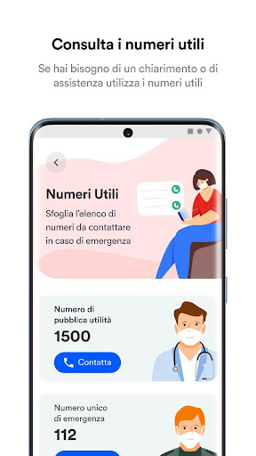
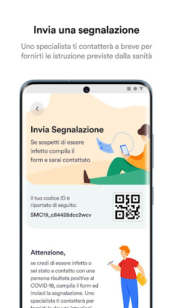
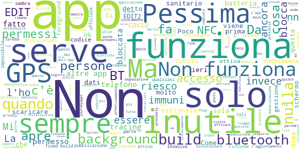

# SM_Covid19
App version ``5.1``

Analyzed with [covid-apps-observer](http://github.com/covid-apps-observer) project, version ``0.1``

## App overview
| | |
|-------------------------|-------------------------| 
| **Name**&nbsp;&nbsp;&nbsp;&nbsp;&nbsp;&nbsp;&nbsp;&nbsp;&nbsp;&nbsp;&nbsp;&nbsp;&nbsp;&nbsp;&nbsp;&nbsp;&nbsp;&nbsp;&nbsp;&nbsp;&nbsp;&nbsp;&nbsp;&nbsp;&nbsp;&nbsp;&nbsp;&nbsp;&nbsp;&nbsp;&nbsp;&nbsp;&nbsp;&nbsp;&nbsp;&nbsp;&nbsp;&nbsp;&nbsp;&nbsp;  | SM_Covid19 |
| **Unique identifier** | it.softmining.projects.covid19.savelifestyle |
| **Link to Google Play** | [https://play.google.com/store/apps/details?id=it.softmining.projects.covid19.savelifestyle](https://play.google.com/store/apps/details?id=it.softmining.projects.covid19.savelifestyle) |
| **Summary**  | Community di Contact Tracing volontario per la sfida al Covid19. |
| **Privacy policy** | [https://www.softmining.it/index.php/sm-covid19-app/](https://www.softmining.it/index.php/sm-covid19-app/) |
| **Latest version** | 5.1 |
| **Last update** | 2020-07-17 16:52:14 |
| **Recent changes** | Bug fix per Huawei |
| **Installs**  | 50.000+ |
| **Category** | Salute e fitness |
| **First release** | 12 apr 2020 |
| **Size**  | 4,8M |
| **Supported Android version**  | 5.0 e versioni successive |

### Description
> Sm-Covid-19 ti permette di tenere sotto controllo il tuo "Indice dei Contatti", ovvero una stima numerica con valori da 0 a 100 che cresce e decresce a seconda del numero (e del tipo) di contatti rilevati nelle ultime 24 ore. Il calcolo dell'indice avviene ogni ora.  Il valore "Indice dei Contatti" è una stima che può aiutarti a capire se durante la fase 2 stai avendo troppi contatti. 
 Questa App è stata sviluppata e viene costantemente aggiornata con l'obiettivo di valutare (attraverso la definizione di modelli statistici e matematici) il rischio di trasmissione (e il comportamento epidemico) del virus attraverso il monitoraggio:
 - del numero dei contatti
 - della durata dei contatti;
 - della distanza presente tra i contatti rilevati rispetto alla durata del contatto.
 Sm-Covid-19 è in grado di rilevare l'App Immuni in modo da aumentare la precisione dei modelli matematici.
 Sm-Covid-19 non acquisisce dati personali ne dati sanitari: Ti preghiamo di visualizzare il video introduttivo per avere maggiori dettagli sullo scopo e sul funzionamento di questa App. 
 Se desideri maggiori dettagli tecnici sul funzionamento di Sm-Covid-19 puoi visitare questo link: https://www.smcovid19.org/recover/
 Sm-Covid-19 non acquisisce dati sensibili dell’utente (ne ha bisogno di tali dati per funzionare).
 Il modulo di auto-segnalazione è stato rimosso in quanto la funzionalità non sarà gestita da Sm-Covid-19.
 Durante la fase 2, cercheremo di acquisire un gran numero di utenti attivi, per poter migliorare i modelli di stima del contagio: Al momento siamo una piccola community di 40.000 volontari, ma per poter eseguire calcoli statistici precisi ti chiediamo di aiutarci a diffondere l'App tra tutti i tuoi contatti, sopratutto quelli con i quali presumibilmente potresti entrare in contatto durante la fase 2.
 Ci teniamo a ricordarti che SOLO le autorità sanitarie possono indicare la positività di un soggetto. Poiché IMMUNI sarà l'app ufficiale di contact tracing Italiana, abbiamo rimosso il modello di calcolo dell'"Indice di Rischio". L'APP mostrerà solo un Indice di Contatto che aumenterà e diminuirà in base al numero di contatti efficaci rilevati. 
 I valori indicati in Sm-Covid-19 NON possono essere considerate diagnosi di positività o negatività al Covid-19: Lo scopo di questa APP è di generare modelli rappresentativi del contagio (modelli matematici) e statistiche accurate.
 L’utente non viene geo-localizzato, né viene reso riconoscibile, salvo nel caso in cui esso stesso decida di condividere di suo spontanea volontà i dati GPS attraverso il menù Impostazioni -> Abilita condivisione dati GPS.  
 I dati GPS verranno registrati SOLO quando verranno rilevati dei contatti. Se nessun utente viene rilevato nei dintorni, nessun dato viene acquisito. È possibile disabilitare in qualsiasi momento l'acquisizione dei dati GPS. 
 Le informazioni acquisite (solo numero, tipo di contatto, distanza e dati GPS se abilitati) saranno condivise con la comunità scientifica e sotto forma di open-data. I dati sono anonimi, tuttavia applichiamo tecniche di shuffle e cifratura degli ID random acquisiti prima di pubblicare open-data.
 Sm-Covid-19 è stata sviluppata e viene manutenuta senza fini economici né di acquisizione di dati sensibili. 
 Sm-Covid-19 non può essere considerata sostitutiva di una diagnosi medica.

### User interface
The developers of the app provide the following screenshots in the Google play store.
| | | |
|:-------------------------:|:-------------------------:|:-------------------------:|
 |   |   |   | 
 |   |  

## Development team
In the following we report the main information provided by the development team in the Google play store.

| | |
|-------------------------|-------------------------|
| **Developer**  | Softmining Srl |
| **Website**  | [https://www.smcovid19.org/](https://www.smcovid19.org/) |
| **Email** | smcovid19@softmining.it |
| **Physical address**  | [Via Tenente Corrado 22 - 83100 Avellino - Italia](https://www.google.com/maps/search/Via%20Tenente%20Corrado%2022%20-%2083100%20Avellino%20-%20Italia) (Google Maps) |
| **Other developed apps**  | [https://play.google.com/store/apps/developer?id=Softmining+Srl](https://play.google.com/store/apps/developer?id=Softmining+Srl) |

## Android support

| | |
|-------------------------|-------------------------|
| **Declared target Android version**  | Android10, version 10 (API level 29) |
| **Effective target Android version**  | Android10, version 10 (API level 29) |
| **Minimum supported Android version**  | Lollipop, version 5.0 (API level 21) |
| **Maximum target Android version**  | - |

The larger the difference between the minimum and maximum supported Android versions, the better. A larger difference means a wider audience. For example, old phones have a very low Android version, so a high minimum supported Android version means that the app cannot be used by users with old phones, thus leading to accessibility problems. 

## Requested permissions

In the following we report the complete list of the permissions requested by the app. 

| **Permission** | **Protection level** | **Description** | 
|-------------------------|-------------------------|-------------------------|
 **android.permission ACCESS_BACKGROUND_LOCATION** | :warning:**Dangerous** | Allows an app to access location in the background. 
 **android.permission ACCESS_COARSE_LOCATION** | :warning:**Dangerous** | Allows an app to access approximate location. 
 **android.permission ACCESS_FINE_LOCATION** | :warning:**Dangerous** | Allows an app to access precise location. 
 **android.permission ACCESS_NETWORK_STATE** | Normal | Allows applications to access information about networks. 
 **android.permission BLUETOOTH** | Normal | Allows applications to connect to paired bluetooth devices. 
 **android.permission BLUETOOTH_ADMIN** | Normal | Allows applications to discover and pair bluetooth devices. 
 **android.permission FOREGROUND_SERVICE** | Normal | Allows a regular application to use Service.startForeground. 
 **android.permission INTERNET** | Normal | Allows applications to open network sockets. 
 **android.permission READ_APP_BADGE** | - | - 
 **android.permission READ_EXTERNAL_STORAGE** | :warning:**Dangerous** | Allows an application to read from external storage. 
 **android.permission RECEIVE_BOOT_COMPLETED** | Normal | Allows an application to receive the Intent.ACTION_BOOT_COMPLETED that is broadcast after the system finishes booting. 
 **android.permission REQUEST_IGNORE_BATTERY_OPTIMIZATIONS** | Normal | Permission an application must hold in order to use Settings.ACTION_REQUEST_IGNORE_BATTERY_OPTIMIZATIONS. 
 **android.permission SYSTEM_ALERT_WINDOW** | Signature - preinstalled - appop - pre23 - development | Allows an app to create windows using the type WindowManager.LayoutParams.TYPE_APPLICATION_OVERLAY, shown on top of all other apps. 
 **android.permission USE_FULL_SCREEN_INTENT** | Normal | Required for apps targeting Build.VERSION_CODES.Q that want to use notification full screen intents. 
 **android.permission VIBRATE** | Normal | Allows access to the vibrator. 
 **android.permission WAKE_LOCK** | Normal | Allows using PowerManager WakeLocks to keep processor from sleeping or screen from dimming. 
 **android.permission WRITE_EXTERNAL_STORAGE** | :warning:**Dangerous** | Allows an application to write to external storage. 
 **com.anddoes.launcher.permission UPDATE_COUNT** | - | - 
 **com.google.android.c2dm.permission RECEIVE** | - | - 
 **com.google.android.finsky.permission BIND_GET_INSTALL_REFERRER_SERVICE** | - | - 
 **com.htc.launcher.permission READ_SETTINGS** | - | - 
 **com.htc.launcher.permission UPDATE_SHORTCUT** | - | - 
 **com.huawei.android.launcher.permission CHANGE_BADGE** | - | - 
 **com.huawei.android.launcher.permission READ_SETTINGS** | - | - 
 **com.huawei.android.launcher.permission WRITE_SETTINGS** | - | - 
 **com.huawei.permission.external_app_settings USE_COMPONENT** | - | - 
 **com.majeur.launcher.permission UPDATE_BADGE** | - | - 
 **com.oppo.launcher.permission READ_SETTINGS** | - | - 
 **com.oppo.launcher.permission WRITE_SETTINGS** | - | - 
 **com.sec.android.provider.badge.permission READ** | - | - 
 **com.sec.android.provider.badge.permission WRITE** | - | - 
 **com.sonyericsson.home.permission BROADCAST_BADGE** | - | - 
 **com.sonymobile.home.permission PROVIDER_INSERT_BADGE** | - | - 
 **it.softmining.projects.covid19.savelifestyle.permission C2D_MESSAGE** | - | - 
 **me.everything.badger.permission BADGE_COUNT_READ** | - | - 
 **me.everything.badger.permission BADGE_COUNT_WRITE** | - | - 
 **oppo.permission OPPO_COMPONENT_SAFE** | - | - 

## Mentioned servers

| **Server** | **Registrant** | **Registrant country** | **Creation date** | 
|-------------------------|-------------------------|-------------------------|-------------------------|
 | googlesyndication.com | Google LLC | :us: US | 2003-01-21 06:17:24 |
 | google.com | Google LLC | :us: US | 1997-09-15 04:00:00 |
 | googleadservices.com | Google LLC | :us: US | 2003-06-19 16:34:53 |
 | app-measurement.com | Google LLC | :us: US | 2015-06-19 20:13:31 |
 | onesignal.com | Domains By Proxy, LLC | :us: US | 2011-09-10 18:40:52 |
 | smcovid19.org | Data Protected | :canada: CA | 2020-03-31 21:30:24 |
 | softmining.it | SOFTMINING S.R.L. | :it: IT | 2017-10-16 19:27:28 |
 | governo.it | Presidenza del Consiglio dei Ministri | :it: IT | 2000-01-24 00:00:00 |
 | githubusercontent.com | GitHub, Inc. | :us: US | 2014-02-06 21:17:00 |
 | amazonaws.com | Amazon.com, Inc. | :us: US | 2005-08-18 02:10:45 |
 | crashlytics.com | Google LLC | :us: US | 2011-01-21 15:30:40 |

## Security analysis 

Below we report the main security warnings raised by our execution of the [Androwarn](https://github.com/maaaaz/androwarn) security analysis tool.

**Telephony identifiers leakage**
> - This application reads the numeric name (MCC+MNC) of current registered operator 
> - This application reads the operator name 

**Connection interfaces exfiltration**
> - This application reads details about the currently active data network 

**Telephony services abuse**
> - This application makes phone calls 

**Suspicious connection establishment**
> - This application opens a Socket and connects it to the remote address 'Ld/a/a/a/a;->f(Ljava/lang/String;)Ljava/lang/StringBuilder;' on the 'N/A' port  
> - This application opens a Socket and connects it to the remote address 'Ljava/net/Proxy;->type()Ljava/net/Proxy$Type;' on the 'N/A' port  
> - This application opens a Socket and connects it to the remote address 'hostname == null ' on the 'N/A' port  
> - This application opens a Socket and connects it to the remote address 'timeout' on the 'N/A' port  

**Code execution**
> - This application executes a UNIX command containing this argument: 'Ljava/lang/StringBuilder;->toString()Ljava/lang/String;' 

## User ratings and reviews

Below we provide information about how end users are reacting to the app in terms of ratings and reviews in the Google Play store.

### Ratings

The SM_Covid19 app has been installed by more than **50000** times. At this time, **764** rated the app and its average score is **4.01**. Below we show the distribution of the ratings across the usual star-based rating of Google Play

:star::star::star::star::star:: 412

:star::star::star::star:: 152

:star::star::star:: 76

:star::star:: 38

:star:: 84

### Reviews 

#### 5-star reviews

> Ottima app  :date: __2021-01-17 03:55:29__

> Affidabile buono  :date: __2020-12-10 12:23:55__

> App molto utile  :date: __2020-11-27 11:04:32__

> Ooooooo my God é molto utile  :date: __2020-11-16 19:30:59__

> Immuni  :date: __2020-11-01 16:23:28__

> Ottima Grazie  :date: __2020-10-26 15:50:55__

> Eccezionale  :date: __2020-10-13 11:33:09__

> Per sapere se qualcuno in casa ha il VIRUS COME faccio a sapere. ?  :date: __2020-10-11 16:34:58__

> Molto interessante  :date: __2020-10-11 10:26:42__

> E utile e ti da una certa sicurezza oltre a livello di prevenzione anche un a livello psicologico e un ottima applicazione  :date: __2020-10-10 23:22:43__

#### 4-star reviews

> Ottimo  :date: __2020-10-17 20:24:12__

> Buona e facile da usare  :date: __2020-10-10 11:21:08__

> Facile  :date: __2020-10-08 13:38:48__

> Non ho avuto ancora esperienze  :date: __2020-08-24 15:38:20__

> Mi dicete come funziona? Mi dice indice contatti 0,00%  :date: __2020-08-23 19:29:43__

> Positiva  :date: __2020-07-31 14:48:10__

> 4Stelle e non 5 perché dopo l'ultimo aggiornamento 5.0 l'applicazione va in crash alla apertura...parte e subito all'istante si chiude.Ho disinstallato e reinstallato l'applicazione e cosí facendo ho risolto il bug. HUAWEI P20 PRO android 10  :date: __2020-07-19 11:54:17__

> Buona  :date: __2020-07-17 20:36:04__

> App molto utili  :date: __2020-07-01 13:08:36__

> Ottima app. Mi piace moltissimo la possibilità di calcolare l'indice di assembramento. Tuttavia riscontro un problema con le notifiche in quanto mi da sempre zero mentre quando apro l'app c'è il corretto valore.  :date: __2020-06-29 14:15:33__

#### 3-star reviews

> Non capisco  :date: __2020-11-10 20:57:14__

> Questa app è sicura come quella governativa?  :date: __2020-10-20 14:31:12__

> Se non attivano tutti, il bluetooth e il gps, l' utilità è solo parziale.  :date: __2020-10-07 17:36:45__

> Aspetto di usarla e vederne il responso per dare una valutazione più attinente. Faccio notare una mancanza tra le categorie indicate... Mancano le forze dell'ordine, forse meno a rischio dei medici/infermieri/OSS ma categoria a rischio per servizio.  :date: __2020-09-16 14:09:22__

> Sembra ok, ma vorrei sapere il calibra BLE quanto deve essere il valore?toccando lo scudo blu non succede nulla.  :date: __2020-09-06 17:57:00__

> Pro:è compatibile anche con dispositivi più datati; è comoda per tenere sotto controllo il numero dei casi. Contro: è un po' troppo invasiva (chiede troppi permessi); troppe notifiche; consuma più batteria dell'altra app (Immuni).  :date: __2020-08-28 18:08:29__

> Dovrebbero installarla tutti per essere più efficace  :date: __2020-07-27 11:38:34__

> Dopo l'aggiornamento del 13 luglio è diventata instabile e si chiude in continuazione  :date: __2020-07-16 14:24:48__

> Ancora in prova  :date: __2020-07-11 09:41:40__

> Nessuna esperinsa  :date: __2020-07-08 21:44:00__

#### 2-star reviews

> Troppi permessi... Non si poteva fare un'applicazione senza tutte ste richieste?  :date: __2020-09-17 22:19:23__

> Per ora va bene, io non ho molti contatti con l'estero comunque  :date: __2020-07-06 11:35:49__

> Non serve a gran che visto che ho incrociato positivi e loro non avevano l'app  :date: __2020-06-26 08:05:34__

> Non buona. Troppo evanescente  :date: __2020-06-22 10:28:01__

> Dam pl v  :date: __2020-06-22 09:47:34__

> Cosa significa quando mette 0,e poi un tot di numeri dopo?  :date: __2020-06-20 18:27:25__

> Qusta app vale 2 stele  :date: __2020-06-17 18:12:17__

> Non riesco a capire in che modo (spero di no) avvisare il medico in caso di positività per poi avvisare chi è stato a contatto con me (principio di funzionamento di immuni). Nell'app non trovo nessuna voce a riguardo  :date: __2020-06-15 21:05:35__

> Mi sembra una stronzata come app come fa a sapere se uno è veramente positivo o negativo senza tampone? Poi se l tocca un altro il cell cambia o no? Sec me na cavolata l altra volta m diceva che ero poco rischioso ora mi dice tutto bene mha  :date: __2020-06-08 13:48:07__

> Non è chiaro il significato dell'indice (e le varie soglie), né sono indicate le procedure da fare in caso indicasse una situazione di potenziale pericolo. Inoltre è molto fastidioso il continuo vibrare delle notifiche push che arrivano più o meno ogni ora, inclusa la notte. Vibrazione che a quanto pare è impossibile disabilitare.  :date: __2020-06-08 11:13:44__

#### 1-star reviews

> Pessima app  :date: __2020-12-27 23:16:46__

> Inutile. Qualunque app di tracciamento al di fuori di immuni è inutile e anzi dannosa in quanto divide gli utenti che vanno tracciati usando4una unica app nazionale unificata.  :date: __2020-12-10 10:44:31__

> Decerebrati  :date: __2020-12-04 11:55:01__

> Opzione anti assembramento.avvisa se ci sono meno di tot persone.dovrebbe segnare il superamento di tot persone.  :date: __2020-11-24 06:34:30__

> Non funziona  :date: __2020-11-17 22:27:14__

> Poco attendibile visto che 2 cell. stessa marca stessa persona stesso ambiente,risultati molto diversi.  :date: __2020-11-11 09:55:51__

> Come faccio entrare se ultimontasto rosso non si ttasforma in verde clicco ok ma non succede nulla cosa è un bidone?  :date: __2020-11-04 16:36:37__

> Ottimo  :date: __2020-10-20 16:15:04__

> Uno perché viene solo il bt e non il gps. Mettete un margine d'incertezza per la privacy. Sarebbe utilissimo sapere che nel raggio di cento metri c'è stato tizio sicuramente positivo (perchè testato).  :date: __2020-10-06 10:57:21__

> La segnalazione solo delle presenze delle persone non da alcuna certezza sulla presenza di eventuali positivi  :date: __2020-10-05 17:08:21__

