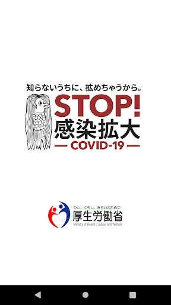
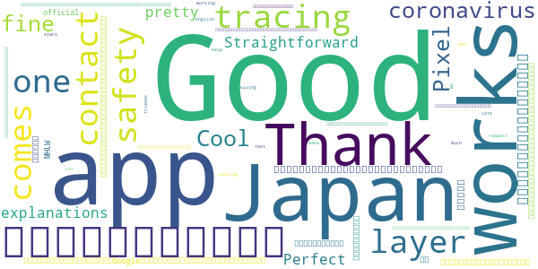
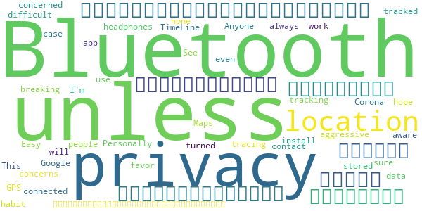
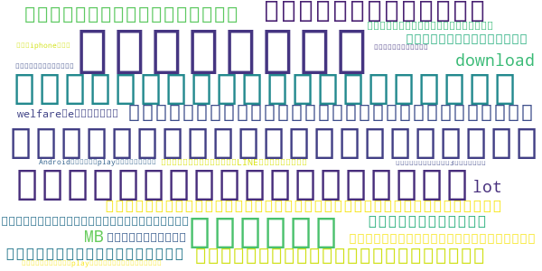
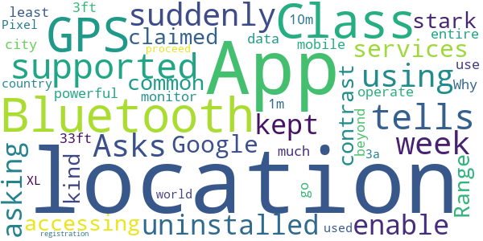

# COCOA - COVID-19 Contact App
App version ``1.1.1``

Analyzed with [covid-apps-observer](http://github.com/covid-apps-observer) project, version ``0.1``

## App overview
| | |
|-------------------------|-------------------------| 
| **Name**&nbsp;&nbsp;&nbsp;&nbsp;&nbsp;&nbsp;&nbsp;&nbsp;&nbsp;&nbsp;&nbsp;&nbsp;&nbsp;&nbsp;&nbsp;&nbsp;&nbsp;&nbsp;&nbsp;&nbsp;&nbsp;&nbsp;&nbsp;&nbsp;&nbsp;&nbsp;&nbsp;&nbsp;&nbsp;&nbsp;&nbsp;&nbsp;&nbsp;&nbsp;&nbsp;&nbsp;&nbsp;&nbsp;&nbsp;&nbsp;  | COCOA - COVID-19 Contact App |
| **Unique identifier** | jp.go.mhlw.covid19radar |
| **Link to Google Play** | [https://play.google.com/store/apps/details?id=jp.go.mhlw.covid19radar](https://play.google.com/store/apps/details?id=jp.go.mhlw.covid19radar) |
| **Summary**  | This app from MHLW notifies you of close contacts with COVID-19 positive users. |
| **Privacy policy** | [https://www.mhlw.go.jp/stf/seisakunitsuite/japanese_pp_00027.html](https://www.mhlw.go.jp/stf/seisakunitsuite/japanese_pp_00027.html) |
| **Latest version** | 1.1.1 |
| **Last update** | 2020-06-30 06:22:28 |
| **Recent changes** | - Fixed how usage start date is displayed |
| **Installs**  | 1,000,000+ |
| **Category** | Medical |
| **First release** | Jun 11, 2020 |
| **Size**  | 100M |
| **Supported Android version**  | 6.0 and up |

### Description
> Officially provided by the Ministry of Health, Labour and Welfare of Japan (MHLW), this app notifies you of close contact with COVID-19 positive users to help the government and healthcare organizations contain the spread of COVID-19.
 The app will be in preview for one month, and functions and design are planned to be updated. Please install the latest version that MHLW will announce on their website and in the app.
 ■ What you can do
 The app recognizes close contacts (within 1 meter, 15 minutes or more) between smartphones running this app. If you test positive for COVID-19, you can register anonymously in this app. If you have been in close contact with a user who tested positive, the app notifies you of potential infection and provides guidance to protect your health.
 ■ Privacy
 No personal information such as your name or phone number is collected. No geolocation data including GPS data is collected.
 All data is encrypted and saved locally on your smartphone. All data is automatically deleted after 14 days. Your movements cannot be seen in any way by anyone including government agencies or third parties.
 You can stop recording close contacts anytime. Turn on recording the settings in the app or delete the app.
 ■ Recording ‘close contact’
 This app records ‘close contact’ across Android and iOS devices by using Bluetooth and Exposure Notification API provided by Google/Apple.
 When you run this app, each smartphone generates a random code. This code changes every 10-20 minutes
 When smartphones running this app are in close contact, they exchange random codes. Received codes are stored only on the devices.
 ■ Close contact notifications
 Users who tested COVID-19 positive, can choose to share the random codes that their devices have sent out. Each device periodically checks if it has previously encountered any of the shared codes. If the code shared by a COVID-19 positive user matches with a code stored on your device, you will be notified that you have been in close contact with COVID-19 positive user and provides guidance to protect your health.
 To receive notifications of close contact with COVID-19 positive users, you need to download this app and enable exposure notification function on OS settings. The app only works with others who have the official app installed.
 ■ Guidance to protect your health
 In the app, you can also check the list of dates you were in close contact with COVID-19 positive users during the last 14 days. If you have more than one close contact, please use the symptom checker provided in the app to receive appropriate guidance such as contact information of healthcare organizations. Depending on the symptoms, you will be advised to take a COVID-19 test. You will also find instructions if you want to reach out healthcare organizations by phone.
 ■ When you tested positive
 When you are tested COVID-19 positive, please voluntarily register so in the app to notify other users of potential infection. When healthcare organization registers your positive test results to “The Health Center Real-time Information-sharing System on COVID-19” (known as HER-SYS) provided by MHLW,  a processing number is issued to you. Entering this processing number in the app will allow you to register your positive test result.
 ■ Stop or delete close contact recording
 You can stop recording close contacts with other users anytime by changing app settings. You can delete close contact history (14 days) anytime by deleting the app.
 ■ Availability
 This application will be available until COVID-19 ends.
 ■ Supported OS versions
 Android 6.0 or higher
 ■ FAQ & Contact
 FAQ (Japanese): https://www.mhlw.go.jp/stf/seisakunitsuite/bunya/kenkou_iryou/covid19_qa_kanrenkigyou_00009.html
 E-mail: appsupport＠cov19.mhlw.go.jp
 ■ Privacy Policy & Terms of Use
 Privacy Policy(English): https://www.mhlw.go.jp/stf/seisakunitsuite/english_pp_00032.html
 利用規約(English): https://www.mhlw.go.jp/stf/seisakunitsuite/english_rk_00031.html

### User interface
The developers of the app provide the following screenshots in the Google play store.
| | | |
|:-------------------------:|:-------------------------:|:-------------------------:|
 |   |   |   | 
 |   |   |   | 
 |   |  

## Development team
In the following we report the main information provided by the development team in the Google play store.

| | |
|-------------------------|-------------------------|
| **Developer**  | 厚生労働省健康局 |
| **Website**  | [https://www.mhlw.go.jp/stf/seisakunitsuite/bunya/cocoa_00138.html](https://www.mhlw.go.jp/stf/seisakunitsuite/bunya/cocoa_00138.html) |
| **Email** | appsupport@cov19.mhlw.go.jp |
| **Physical address**  | - |
| **Other developed apps**  | [https://play.google.com/store/apps/developer?id=%E5%8E%9A%E7%94%9F%E5%8A%B4%E5%83%8D%E7%9C%81%E5%81%A5%E5%BA%B7%E5%B1%80](https://play.google.com/store/apps/developer?id=%E5%8E%9A%E7%94%9F%E5%8A%B4%E5%83%8D%E7%9C%81%E5%81%A5%E5%BA%B7%E5%B1%80) |

## Android support

| | |
|-------------------------|-------------------------|
| **Declared target Android version**  | Android10, version 10 (API level 29) |
| **Effective target Android version**  | Android10, version 10 (API level 29) |
| **Minimum supported Android version**  | Marshmallow, version 6.0 (API level 23) |
| **Maximum target Android version**  | - |

The larger the difference between the minimum and maximum supported Android versions, the better. A larger difference means a wider audience. For example, old phones have a very low Android version, so a high minimum supported Android version means that the app cannot be used by users with old phones, thus leading to accessibility problems. 

## Requested permissions

In the following we report the complete list of the permissions requested by the app. 

| **Permission** | **Protection level** | **Description** | 
|-------------------------|-------------------------|-------------------------|
 **android.permission ACCESS_NETWORK_STATE** | Normal | Allows applications to access information about networks. 
 **android.permission BLUETOOTH** | Normal | Allows applications to connect to paired bluetooth devices. 
 **android.permission FOREGROUND_SERVICE** | Normal | Allows a regular application to use Service.startForeground. 
 **android.permission INTERNET** | Normal | Allows applications to open network sockets. 
 **android.permission RECEIVE_BOOT_COMPLETED** | Normal | Allows an application to receive the Intent.ACTION_BOOT_COMPLETED that is broadcast after the system finishes booting. 
 **android.permission WAKE_LOCK** | Normal | Allows using PowerManager WakeLocks to keep processor from sleeping or screen from dimming. 

## Mentioned servers

| **Server** | **Registrant** | **Registrant country** | **Creation date** | 
|-------------------------|-------------------------|-------------------------|-------------------------|
 | google.com | Google LLC | :us: US | 1997-09-15 04:00:00 |
 | microsoft.com | Microsoft Corporation | :us: US | 1991-05-02 04:00:00 |
 | googleapis.com | Google LLC | :us: US | 2005-01-25 17:52:26 |

## Security analysis 

Below we report the main security warnings raised by our execution of the [Androwarn](https://github.com/maaaaz/androwarn) security analysis tool.

**Telephony identifiers leakage**
> - This application reads the ISO country code equivalent of the current registered operator's MCC (Mobile Country Code) 
> - This application reads the numeric name (MCC+MNC) of current registered operator 
> - This application reads the operator name 

**Connection interfaces exfiltration**
> - This application reads details about the currently active data network 
> - This application tries to find out if the currently active data network is metered 

**Code execution**
> - This application loads a native library: 'monodroid' 
> - This application loads a native library: 'monosgen-2.0' 
> - This application loads a native library: 'xamarin-app' 
> - This application loads a native library: 'xamarin-debug-app-helper' 

## User ratings and reviews

Below we provide information about how end users are reacting to the app in terms of ratings and reviews in the Google Play store.

### Ratings

The COCOA - COVID-19 Contact App app has been installed by more than **1000000** times. At this time, **3252** rated the app and its average score is **3.3217666**. Below we show the distribution of the ratings across the usual star-based rating of Google Play

:star::star::star::star::star:: 1118

:star::star::star::star:: 523

:star::star::star:: 595

:star::star:: 318

:star:: 697

### Reviews 

#### 5-star reviews

> Japan's contact tracing app is one more layer of safety when it comes to the coronavirus. The app works fine on my Pixel 4.  :date: __2020-07-09 07:44:07__

> Cool! Thanks.  :date: __2020-06-25 02:30:49__

> Good. Good. Good.  :date: __2020-06-23 11:15:39__

> Straightforward app, pretty good explanations of how this works, 5/5  :date: __2020-06-22 10:20:41__

> Perfect.  :date: __2020-06-22 04:35:40__

> 個人情報への配慮がよくできています。電話番号など詳細に登録しなくても使えるので安心しました。  :date: __2020-06-21 02:43:31__

> 海外在住で、英語設定の海外スマホと居住国が日本以外のGoogleアカウントを用いてインストールしましたが全てスムーズです。気になる点は(1) 英語版の登録名にある"MHLW official"は日本人の私にもハテナ? です (2) アプリ自体はよく英語化されているのですが、スプラッシュスクリーンとアプリ上部のバナーに日本語が残るのは気になります。特に旅行者にとっては読めない文字で書かれたものは何かしら不安を感じます。厳しい言い方をすればアマビエも日本人の間だけで通じる内輪ネタで英語版のスプラッシュスクリーンには相応しくないです。シンプルな英語のみのスプラッシュとバナーにして、アマビエについては別途アプリ内に紹介ページを設けた方がよいと思います。  :date: __2020-06-20 11:54:17__

> Giving this 5 stars because it is in English. Thank you very much for that  :date: __2020-06-20 02:51:14__

> たくさんの方にインストールしてほしいです。あともし自分がかかったらちゃんと番号を入力してほしいですね。濃厚接触者と分かった時点で他の人が感染しないように行動を変えることもできるし、早期発見早期治療にもつながると思いますので、みんな積極的に捉えてほしいです。友達にも勧めておきます！  :date: __2020-06-19 17:08:24__

> It's working too fast  :date: __2020-06-19 16:05:35__

#### 4-star reviews

> 別アプリで、このアプリの利用者位置人数を計測できたのですが、意外とたくさんいた。病院保育園銀行は異常におおい。心配なんだね。いろいろ欠点もありますが、ないよりましです。危惧されたバッテリーいっぱい減るんじゃないか問題はそんなんでもなかった。  :date: __2020-07-03 03:19:56__

> Easy install. I always have Bluetooth off unless connected to headphones, so breaking that habit will be difficult. This doesn't work unless Bluetooth is on. Anyone with privacy concerns, none here, but I hope you have turned of GPS location tracking. I'm not sure those people who are concerned about privacy are even aware their location data is being tracked and stored. See Google Maps TimeLine, which I use. Personally I would favor a more aggressive contact tracing app for the case of Corona.  :date: __2020-06-19 23:45:33__

#### 3-star reviews

> 英語学習のために、スマートフォンの言語設定を英語にしています。このアプリで は端末の言語設定がそのまま反映されるので、アプリの言語は自動的に英語になります。 感染者と接触があった場合に、保健所などに画面を提示する必要が出てくる場合があるようですが、英語設定のままでも対応してもらえるのでしょうか？ 日本語でないといけないようであれば、アプリ内で簡単に言語設定を変えられるように仕様変更していただけるといいと思います。  :date: __2020-07-08 09:46:08__

> 100 MB download is a lot!  :date: __2020-07-06 14:33:54__

> 問題なくインストールでき、個人情報を登録せず利用開始できました。 機能についてもっと長く使わないと分かりませんが、今までの気づきをまず共有します。 1. ステム言語が英語の場合アプリの表示も英語に変わります。 2. 機能的に問題ないですが、厚生労働省のメイン画面のバナーには英語の...welfareのeが欠けています。 3. 友人にシェアボタンでアプリをLINEで送って見ましたが、Androidアプリなのでplayストアになりますね。友人がiphoneなので、役に立たないリンクでした。アクセスするスマホによって、自動的にアップストアやplayストアにつながるといいと思います。 以上によって総合的にまず3つ星にしました。  :date: __2020-06-20 03:38:56__

#### 2-star reviews

No recent reviews available with 2 stars.

#### 1-star reviews

> App me tells me Bluetooth not supported suddenly after a week of using it!!!!!  :date: __2020-06-29 20:59:45__

> Asks for GPS location. I uninstalled this app because it kept asking me to enable Google location services, therefore accessing my GPS location. This is in stark contrast to what was claimed.  :date: __2020-06-28 08:07:01__

> Bluetooth Range. Class 2 (the most common kind) operate up to 10m (33ft), and class 3 are the least powerful and don't go much beyond 1m (3.3ft). Why not use mobile data to monitor the entire city, country or world?  :date: __2020-06-20 19:52:23__

> Pixel 3a XL cannot be used because it does not proceed from "registration".  :date: __2020-06-20 08:52:54__

