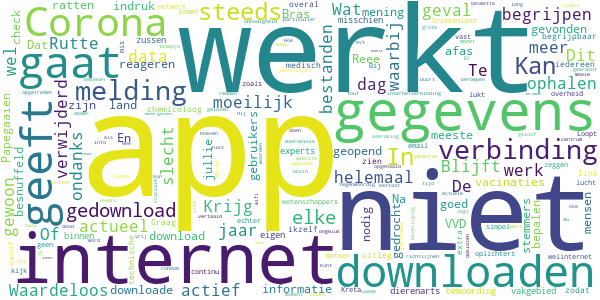
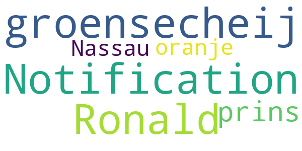
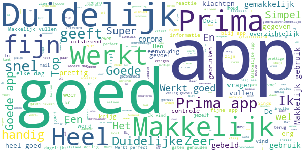
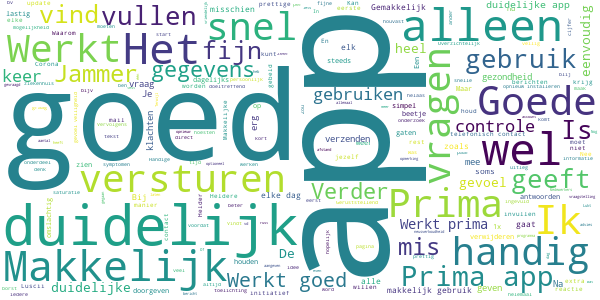
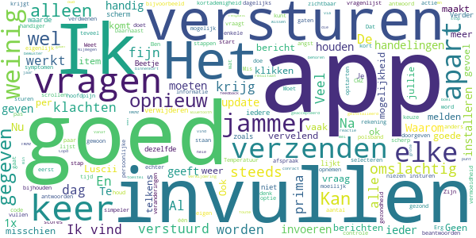
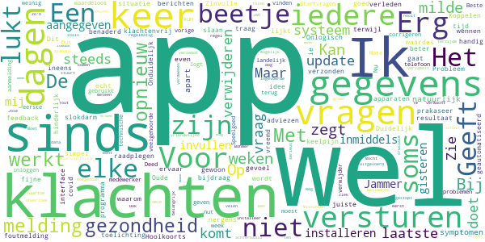
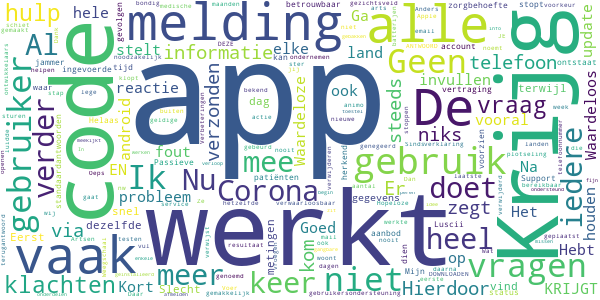
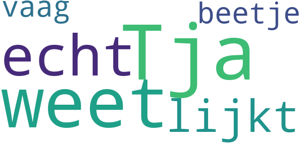
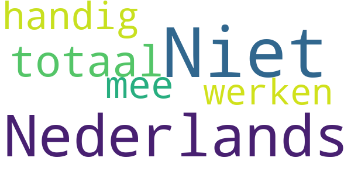

# COVID-related Android apps in the Netherlands

Author: `Ivano Malavolta` (ivanomalavolta@gmail.com)

Created at: `2020/11/8`

Report generated by the [covid-apps-observer](http://github.com/covid-apps-observer) project, version 0.1

# Table of contents 

- [Background](#background)
    * [Data sources and analyses](#data-sources-and-analyses)
        * [App metadata](#app-metadata)
        * [Requested permissions](#requested-permissions)
        * [Mentioned servers](#mentioned_servers)
        * [Security analysis](#security_analysis)
        * [User ratings and reviews](#user-ratings-and-reviews)
    * [Disclaimer](#disclaimer)
- [RIVM LCI-richtlijnen](#rivm-lci-richtlijnen)
- [WHO Info](#who-info)
- [Luscii](#luscii)
- [OpenWHO: Knowledge for Health Emergencies](#openwho-knowledge-for-health-emergencies)
- [CoronaMelder](#coronamelder)

- [Credits](#credits)

# How to read this report

This report has been generated by the [covid-apps-observer](http://github.com/covid-apps-observer) project. The project automatically analyzes the apps by extracting information which is already publicly available either on the web or in the apps binary files. 

Our analysis covers the following apps:
| | |
|-------------------------|-------------------------| 
|  | RIVM LCI-richtlijnen
|  | WHO Info
|  | Luscii
|  | OpenWHO: Knowledge for Health Emergencies
|  | CoronaMelder

The details of our analysis are presented in the remainder of this report.

For independent verification, the raw data and the source code of the project is publicly available in its GitHub repository [http://github.com/covid-apps-observer](http://github.com/covid-apps-observer) and its source code has been thoroughly commented in order to provide all the details about how the information provided in this report has been extracted. 

Any feedback, questions, and improvements about the project are very welcome, feel free to create an issue or pull request directly in its GitHub repository: [http://github.com/covid-apps-observer](http://github.com/covid-apps-observer).

## Data sources and analyses

The analysis of each app is structured around five main dimensions: 
* App metadata  
* Requested permissions
* Mentioned servers
* Androwarn analysis
* User ratings and reviews

In the following we describe the data sources and analysis performed for each dimension.

### App metadata

App metadata includes an overview of the main information about the app (for example, its name, releases, privacy policy, etc.), contact information of the development team, and the various Android versions supported by the app. This information is extracted from two main data sources:
* _Google Play store_: we automatically mined the web page of the Google Play store showing the basic information about the app and we parsed it in order to extract information about the app and development team 
* _Android Manifest file_: in our analysis we decompiled the binary file of the app (it is similar to a Zip archive but it contains the code of the app instead of normal files) and we extracted information about the supported Android versions, as it has been listed by its development team.

The extracted app metadata feeds the _App overview_, _Development team_, and _Android support_ sections of this report.
We make use of the [google-play-scraper](https://github.com/JoMingyu/google-play-scraper) tool for extracting the raw data related to this dimension of the project.

### Requested permissions

The Android operating system has a permission model which allows users to grant access to potentially privacy-related information. Every Android app has to explictly declare the permissions it needs to properly function in the Android Manifest file.  

In this report we also show the protection level of each permission, which is a key information for understanding how the requested permissions related to the user's privacy. We carefully analyzed the [official Android documentation (v. 29)](https://developer.android.com/reference/android/Manifest.permission), and it resulted that a permission requested by an Android app can belong to the following protection levels:
* **Dangerous**: higher-risk permissions that would give a requesting app access to private user data or control over the device that can negatively impact the user. Because this type of permission introduces potential risk, the system usually does not automatically grant it to the requesting app. For example, any dangerous permissions requested by an app may be displayed to the user and require confirmation before proceeding.
* **Normal**: this is the default and most common level in Android; normal permissions are lower-risk and give access to isolated app-level features, with minimal risk to other apps, the system, or the user. 
* **Signature**: permissions granted only if the requesting app is signed with the same certificate as the app that declared the permission
* **Appop**: old permission level, a reminiscence of the App Ops tool that Google introduced in Android 4.3.
* **Development**: optional permissions which can be granted to development-oriented apps.
* **Privileged**: permissions who give higher power to mobile apps w.r.t. other apps, such as binding to incoming calls, interacting via bluetooth with other devices without user interaction, etc.
* **Preinstalled**: reserved only for preinstalled apps
* **Installer**: allow the holder to start the permission usage screen for an app
* **RetailDemo**: permissions related to devices used in demonstrations in shops.
* **Pre23**: permissions automatically granted to apps targeting devices running pre-6.0 Android.
* **Upcoming**: permissions which will be released in the next version of the Android platform. 
* **Deprecated**: permissions belonging to old releases of the Android platform, they should not be used by developers since they will not be supported in the near future.
* **Not for use by third-party applications**: permissions which can be requested only by apps developed by Google.
* **Undefined**: this protection level is not documented by Google.

The permissions dimension of this project is based on the [Androguard](https://github.com/androguard/androguard) static analysis tool.

### Mentioned servers

We decompiled each app in order to look for all possible mentions of remote URLs. The mentioned URLs can refer to remote servers the the app is using for either sending or receiving information, web addresses for directing the user to an information website, and so on. 

:warning: It is important to note that this analysis is not meant to be complete and it is very prone to obfuscation. The servers reported here are simply _mentioned_ somewhere in the code of the app and are meant to just give an indication about the "hooks" of the app towards external resources. For example, for an Android app it is normal to contact Google services in order to send/receive push notifications, or to contact the servers of analytics services for having real-time diagnostics about crashes of the app or bugs.

This part of the analysis is based on the [Androguard](https://github.com/androguard/androguard) static analysis tool for identfying the raw URLs mentioned in the app; then, the information about each mentioned server is collected by performing a _whois_ lookup on the first-level domain present in the URL.

### Security analysis

This dimension is based on the [Androwarn](https://github.com/maaaaz/androwarn) structural and data flow analysis of Android bytecode. Androwarn is developed by the University of Lyon/INSA (France) and it has been used in several academic studies. According to its documentation, Androwarn targets the following categories of potential security issues:
* **Telephony identifiers exfiltration**: IMEI, IMSI, MCC, MNC, LAC, CID, operator's name, etc.
* **Device settings exfiltration**: software version, usage statistics, system settings, logs, etc.
* **Geolocation information leakage**: GPS/WiFi geolocation, etc.
* **Connection interfaces information exfiltration**: WiFi credentials, Bluetooth MAC adress, etc.
* **Telephony services abuse**: premium SMS sending, phone call composition, etc.
* **Audio/video flow interception**: call recording, video capture, etc.
* **Remote connection establishment**: socket open call, Bluetooth pairing, APN settings edit, etc.
* **PIM data leakage**: contacts, calendar, SMS, mails, clipboard, etc.
* **External memory operations**: file access on SD card, etc.
* **PIM data modification**: add/delete contacts, calendar events, etc.
* **Arbitrary code execution**: native code using JNI, UNIX command, privilege escalation, etc.
* **Denial of Service**: event notification deactivation, file deletion, process killing, virtual keyboard disable, terminal shutdown/reboot, etc.

Note: We do not consider this data point in the current version of our analyzers since it is too verbose for our purposes.

:warning: It is important to note that Androwarn is a static analysis tool, and as such it performs a variety of heuristics and approximations in its analyses. Said that, the results shown in this report are meant to provide an indication of _potential_ security issues and should be by no means treated as complete and correct.   

### User ratings and reviews

For this dimension we turn again to the web interface of the Google Play store. Firstly, we automatically mine summary statistics about user ratings from the web page of the app under analysis; then, we automatically download the newest 1000 reviews of the app under analysis. For each level of rating (5 stars, 4 stars, , etc., 1 star) we show:
- a word cloud presenting the main terms used by end users in their reviews in the Google Play store
- the last 10 reviews provided by app users in the Google Play store. 

This purposefully simple analysis is meant to help both future users and the development team of the app in understanding what are the main positive and negative points of the app under analysis.

We make use of the [google-play-scraper](https://github.com/JoMingyu/google-play-scraper) tool for extracting the raw data related to this dimension of the project.

## Disclaimer 

This report has been produced independently of any parties and its only objective is to help anybody in better understanding how COVID-related apps work in practice (and compare to each other). The results of this report are limited to the specific version of the software used for running the analyses and on the various heuristics implemented in there. In other words, the results of the analyzers may differ depending on the time and modalities in which they are executed. We do not guarantee that the results of the analyses and the corresponding contents of this report are fully complete or correct. The analysis software is licensed under the [MIT License](https://github.com/iivanoo/covid-apps-observer/blob/master/LICENSE).

# RIVM LCI-richtlijnen
App version ``1.27.4``

Analyzed with [covid-apps-observer](http://github.com/covid-apps-observer) project, version ``0.1``

## App overview
| | |
|-------------------------|-------------------------| 
| **Name**&nbsp;&nbsp;&nbsp;&nbsp;&nbsp;&nbsp;&nbsp;&nbsp;&nbsp;&nbsp;&nbsp;&nbsp;&nbsp;&nbsp;&nbsp;&nbsp;&nbsp;&nbsp;&nbsp;&nbsp;&nbsp;&nbsp;&nbsp;&nbsp;&nbsp;&nbsp;&nbsp;&nbsp;&nbsp;&nbsp;&nbsp;&nbsp;&nbsp;&nbsp;&nbsp;&nbsp;&nbsp;&nbsp;&nbsp;&nbsp;  | RIVM LCI-richtlijnen |
| **Unique identifier** | nl.rivm.lciapp |
| **Link to Google Play** | [https://play.google.com/store/apps/details?id=nl.rivm.lciapp](https://play.google.com/store/apps/details?id=nl.rivm.lciapp) |
| **Summary**  | Actuele richtlijnen en draaiboeken infectieziektebestrijding |
| **Privacy policy** | [http://www.rivm.nl/Toegankelijkheid/Privacy](http://www.rivm.nl/Toegankelijkheid/Privacy) |
| **Latest version** | 1.27.4 |
| **Last update** | 2020-07-23 09:22:10 |
| **Recent changes** | Bugfixes |
| **Installs**  | 50.000+ |
| **Category** | Medisch |
| **First release** | 16 jul. 2017 |
| **Size**  | 21M |
| **Supported Android version**  | 4.2 en hoger |

### Description
> In de RIVM-app LCI-richtlijnen vindt u -actuele richtlijnen en draaiboeken infectieziektebestrijding. Daarnaast vindt u ook verpleegkundige stappenplannen (VSI’s), publieksinformatie en quizzen in de app.
 De primaire doelgroep van de richtlijnen zijn de artsen en verpleegkundigen infectieziektebestrijding van de afdelingen infectieziektebestrijding van GGD'en, maar ook andere (para)medici. 
 De app bevat de volgende onderdelen:
 -Richtlijnen en Draaiboeken
 -Publieksinformatie
 -Stappenplannen en Quizzen
 -Favorieten, hier kunt u een persoonlijke favorietenlijst maken
 -Meldingsplichtige ziekten
 -Nieuwsover de LCI-richtlijnen
 -Over LCI, informatie over de Landelijke Coördinatie Infectieziektebestrijding
 -Contact
 De informatie in deze app is identiek aan de informatie op www.rivm.nl/richtlijnen.
 Heeft u vragen of tips over de app LCI-richtlijnen? Mail deze dan naar: LCI@rivm.nl

### User interface
The developers of the app provide the following screenshots in the Google play store.
| | | |
|:-------------------------:|:-------------------------:|:-------------------------:|
 |   |   |   | 
 |  

## Development team
In the following we report the main information provided by the development team in the Google play store.

| | |
|-------------------------|-------------------------|
| **Developer**  | rivm-app |
| **Website**  | [http://rivm.nl](http://rivm.nl) |
| **Email** | ict-servicedesk@rivm.nl |
| **Physical address**  | - |
| **Other developed apps**  | [https://play.google.com/store/apps/developer?id=rivm-app](https://play.google.com/store/apps/developer?id=rivm-app) |

## Android support

| | |
|-------------------------|-------------------------|
| **Declared target Android version**  | Pie, version 9 (API level 28) |
| **Effective target Android version**  | Pie, version 9 (API level 28) |
| **Minimum supported Android version**  | Jelly Bean, version 4.2.x (API level 17) |
| **Maximum target Android version**  | - |

The larger the difference between the minimum and maximum supported Android versions, the better. A larger difference means a wider audience. For example, old phones have a very low Android version, so a high minimum supported Android version means that the app cannot be used by users with old phones, thus leading to accessibility problems. 

## Requested permissions

In the following we report the complete list of the permissions requested by the app. 

| **Permission** | **Protection level** | **Description** | 
|-------------------------|-------------------------|-------------------------|
 **android.permission CALL_PHONE** | :warning:**Dangerous** | Allows an application to initiate a phone call without going through the Dialer user interface for the user to confirm the call. 
 **android.permission INTERNET** | Normal | Allows applications to open network sockets. 
 **android.permission READ_PHONE_STATE** | :warning:**Dangerous** | Allows read only access to phone state, including the phone number of the device, current cellular network information, the status of any ongoing calls, and a list of any PhoneAccounts registered on the device. 

## Mentioned servers

| **Server** | **Registrant** | **Registrant country** | **Creation date** | 
|-------------------------|-------------------------|-------------------------|-------------------------|
 | google.com | Google LLC | :us: US | 1997-09-15 04:00:00 |
 | googleapis.com | Google LLC | :us: US | 2005-01-25 17:52:26 |
 | rivm.nl | - | - | 1990-07-17 00:00:00 |
 | dtnr.nl | - | - | 2016-06-07 00:00:00 |
 | apple.com | Apple Inc. | :us: US | 1987-02-19 05:00:00 |
 | xmlpull.org | WhoisGuard, Inc. | PA | 2001-11-26 20:33:08 |

## Security analysis 

Below we report the main security warnings raised by our execution of the [Androwarn](https://github.com/maaaaz/androwarn) security analysis tool.

**Telephony identifiers leakage**
> - This application reads the device phone type value 
> - This application reads the numeric name (MCC+MNC) of current registered operator 
> - This application reads the operator name 

**Connection interfaces exfiltration**
> - This application reads details about the currently active data network 
> - This application tries to find out if the currently active data network is metered 

**Telephony services abuse**
> - This application makes phone calls 

**Code execution**
> - This application loads a native library: 'jniPdfium' 
> - This application loads a native library: 'modft2' 
> - This application loads a native library: 'modpdfium' 
> - This application loads a native library: 'modpng' 

## User ratings and reviews

Below we provide information about how end users are reacting to the app in terms of ratings and reviews in the Google Play store.

### Ratings

The RIVM LCI-richtlijnen app has been installed by more than **50000** times. At this time, **134** rated the app and its average score is **3.21**. Below we show the distribution of the ratings across the usual star-based rating of Google Play

:star::star::star::star::star:: 54

:star::star::star::star:: 18

:star::star::star:: 8

:star::star:: 4

:star:: 48

### Reviews 

#### 5-star reviews

> Goede informatie over corona-virussen  :date: __2020-10-30 20:16:41__

> A must have  :date: __2020-08-25 15:48:08__

> Mooi  :date: __2020-08-24 19:11:01__

> Fijne, duidelijke app  :date: __2020-08-21 05:05:08__

> Even geduld, dat de app alles gedownload heeft.  :date: __2020-08-19 10:31:44__

> Zo blijf je op de hoogte  :date: __2020-07-17 09:57:06__

> Zeer goede en bruikbare informatie  :date: __2020-06-18 17:15:10__

> Geweldige app die het hellaas op een Lenovo tab M10 niet doet..  :date: __2020-06-12 17:52:50__

> Prima 👍 duidelijk.  :date: __2020-06-02 00:35:27__

> Handig die richrlijnen  :date: __2020-05-13 18:57:39__

#### 4-star reviews

> Goed  :date: __2020-08-18 19:37:40__

> Uitstekend  :date: __2020-08-12 11:36:26__

> wel goed  :date: __2020-07-08 23:18:55__

> Heel overzichtelijk.  :date: __2020-07-05 11:03:44__

> Als ik op het startscherm "Publieksinformatie" aanklik vind ik niets over Covid-19. Deze informatie kan ik alleen bereiken via het volgende traject: "Richtlijnen & Draaiboeken - COVID 19 - Gerelateerde informatie - Publieksinformatie RIVM.nl". Een beetje omslachtig. Verder vind ik het een goede en overzichtelijke app.  :date: __2020-06-30 13:02:17__

> Het staat allemaal in goed te begrijpen woord keuze en duidelijk/overzichtelijk Goed uitgelegd  :date: __2020-06-29 09:06:30__

> Meest nodige informatie zit in deze app 🙏 NAMASTE  :date: __2020-04-09 09:55:23__

> In 2020 en de huidige situatie; maak beter gebruik van dit soort tools- wees duidelijker, m.n voor zorgpersoneel! Updates RIVM maatregelen/richtlijnen(te downloaden hygiëne maatregel ed) door n alert via een soort app als deze zal fijn zijn en zal werkdruk bij informatielijnen verminderen. iig content dat er iets is aan app op dit gebied, maar kan denk ik dus beter/effectiever  :date: __2020-03-12 23:47:14__

#### 3-star reviews

> Graag nog de app aanpassen aan corona crisis.  :date: __2020-04-13 11:55:30__

> Het is niet handig dat de tekst van de richtlijnen onder aparte kopjes staan. Snel overzicht krijgen lukt zo niet. Ga toch elke keer weer naar de website.  :date: __2018-04-15 12:23:09__

#### 2-star reviews

> Kan niet eens een telefoonnummer vinden voor het testen van Covid19  :date: __2020-06-30 22:42:16__

> Werkt niet laadt niet geeft aan dat je geen internet hebt terwijl je gewoon internet hebt  :date: __2020-04-21 20:48:56__

#### 1-star reviews

> Reee  :date: __2020-10-26 16:31:39__

> In geen 1000 jaar dat ik dit gedrocht download , zijn jullie helemaal van de ratten besnuffeld .  :date: __2020-10-21 21:24:33__

> Of deze app wel of niet goed is moeilijk om te bepalen. De bewoording is voor experts binnen hun eigen vakgebied misschien te begrijpen, ook al begrijpen mijn zussen die dierenarts en chemicoloog zijn en ikzelf dit niet. Graag zou ik deze app zien zodat deze voor iedereen vanaf 7 jaar begrijpbaar is met overal een link naar extra medisch/technische uitleg voor wetenschappers.  :date: __2020-10-15 22:17:26__

> Downloaden lukt niet.  :date: __2020-10-11 12:21:38__

> Loopt vast in Griekenland. In dit geval Kreta. De app downloaden gaat simpel. Bij het ophalen van gegevens gaat het mis.  :date: __2020-08-17 09:27:25__

> werkt niet geen verbinding met netwerk geeft app aan kijk uit email is ook niet actief oplichters actief  :date: __2020-07-29 18:46:26__

> Werkt niet. Blijft zeggen dat er geen internet verbinding is. Dit is echter wel het geval.  :date: __2020-07-26 20:42:54__

> werkt niet. zoals alles bij de overheid.  :date: __2020-07-25 17:03:50__

> Op dit moment lopen jullie achter met bijwerken van de app! De laatste update is van 21-07-2020 en het is nu Zaterdag 25-07-2020. Voor het belang van jullie gebruikers, GRAAG NIEUWE UPDATES  :date: __2020-07-25 16:54:29__

> Is hij nu al uit de lucht? Krijg de melding dat er geen internet is. Meteen weer verwijderd  :date: __2020-07-25 00:00:59__

# WHO Info
App version ``3.1.1``

Analyzed with [covid-apps-observer](http://github.com/covid-apps-observer) project, version ``0.1``

## App overview
| | |
|-------------------------|-------------------------| 
| **Name**&nbsp;&nbsp;&nbsp;&nbsp;&nbsp;&nbsp;&nbsp;&nbsp;&nbsp;&nbsp;&nbsp;&nbsp;&nbsp;&nbsp;&nbsp;&nbsp;&nbsp;&nbsp;&nbsp;&nbsp;&nbsp;&nbsp;&nbsp;&nbsp;&nbsp;&nbsp;&nbsp;&nbsp;&nbsp;&nbsp;&nbsp;&nbsp;&nbsp;&nbsp;&nbsp;&nbsp;&nbsp;&nbsp;&nbsp;&nbsp;  | WHO Info |
| **Unique identifier** | org.who.infoapp |
| **Link to Google Play** | [https://play.google.com/store/apps/details?id=org.who.infoapp](https://play.google.com/store/apps/details?id=org.who.infoapp) |
| **Summary**  | De officiële informatie-app van de Wereldgezondheidsorganisatie. |
| **Privacy policy** | [https://www.who.int/about/who-we-are/privacy-policy](https://www.who.int/about/who-we-are/privacy-policy) |
| **Latest version** | 3.1.1 |
| **Last update** | 2020-10-30 13:25:32 |
| **Recent changes** | This release addresses an issue related to Covid-19 case numbers reported to WHO. |
| **Installs**  | 100.000+ |
| **Category** | Nieuws en tijdschriften |
| **First release** | 13 apr. 2020 |
| **Size**  | 11M |
| **Supported Android version**  | 4.2 en hoger |

### Description
> Have the latest health information at your fingertips with the official World Health Organization Information App. This app displays the latest news, events, features and breaking updates on outbreaks. 
  
 WHO works worldwide to promote health, keep the world safe, and serve the vulnerable. 
 Our goal is to ensure that a billion more people have universal health coverage, to protect a billion more people from health emergencies, and provide a further billion people with better health and well-being.

### User interface
The developers of the app provide the following screenshots in the Google play store.
| | | |
|:-------------------------:|:-------------------------:|:-------------------------:|
 |   |   |   | 
 |   |   |   | 
 |   |   |   | 
 |   |   |   | 
 |   |   |   | 
 |   |   |   | 
 |   |   |   | 
 |   |   |   | 

## Development team
In the following we report the main information provided by the development team in the Google play store.

| | |
|-------------------------|-------------------------|
| **Developer**  | World Health Organization |
| **Website**  | [https://www.who.int/](https://www.who.int/) |
| **Email** | dcx@who.int |
| **Physical address**  | [Avenu Appia 20 1211 Geneva Switzerland](https://www.google.com/maps/search/Avenu%20Appia%2020%201211%20Geneva%20Switzerland) (Google Maps) |
| **Other developed apps**  | [https://play.google.com/store/apps/developer?id=World+Health+Organization](https://play.google.com/store/apps/developer?id=World+Health+Organization) |

## Android support

| | |
|-------------------------|-------------------------|
| **Declared target Android version**  | - |
| **Effective target Android version**  | - |
| **Minimum supported Android version**  | Jelly Bean, version 4.2.x (API level 17) |
| **Maximum target Android version**  | - |

The larger the difference between the minimum and maximum supported Android versions, the better. A larger difference means a wider audience. For example, old phones have a very low Android version, so a high minimum supported Android version means that the app cannot be used by users with old phones, thus leading to accessibility problems. 

## Requested permissions

In the following we report the complete list of the permissions requested by the app. 

| **Permission** | **Protection level** | **Description** | 
|-------------------------|-------------------------|-------------------------|
 **android.permission ACCESS_NETWORK_STATE** | Normal | Allows applications to access information about networks. 
 **android.permission INTERNET** | Normal | Allows applications to open network sockets. 
 **android.permission READ_CALENDAR** | :warning:**Dangerous** | Allows an application to read the user's calendar data. 
 **android.permission READ_EXTERNAL_STORAGE** | :warning:**Dangerous** | Allows an application to read from external storage. 
 **android.permission WAKE_LOCK** | Normal | Allows using PowerManager WakeLocks to keep processor from sleeping or screen from dimming. 
 **android.permission WRITE_CALENDAR** | :warning:**Dangerous** | Allows an application to write the user's calendar data. 
 **android.permission WRITE_EXTERNAL_STORAGE** | :warning:**Dangerous** | Allows an application to write to external storage. 
 **com.google.android.c2dm.permission RECEIVE** | - | - 
 **com.google.android.finsky.permission BIND_GET_INSTALL_REFERRER_SERVICE** | - | - 

## Mentioned servers

| **Server** | **Registrant** | **Registrant country** | **Creation date** | 
|-------------------------|-------------------------|-------------------------|-------------------------|
 | adobe.com | Adobe Inc. | :us: US | 1986-11-17 05:00:00 |
 | googlesyndication.com | Google LLC | :us: US | 2003-01-21 06:17:24 |
 | google.com | Google LLC | :us: US | 1997-09-15 04:00:00 |
 | app-measurement.com | Google LLC | :us: US | 2015-06-19 20:13:31 |
 | googleapis.com | Google LLC | :us: US | 2005-01-25 17:52:26 |
 | googleadservices.com | Google LLC | :us: US | 2003-06-19 16:34:53 |

## Security analysis 

Below we report the main security warnings raised by our execution of the [Androwarn](https://github.com/maaaaz/androwarn) security analysis tool.

**Connection interfaces exfiltration**
> - This application reads details about the currently active data network 
> - This application tries to find out if the currently active data network is metered 

**Suspicious connection establishment**
> - This application opens a Socket and connects it to the remote address 'Lfi/iki/elonen/NanoHTTPD$ResponseException;' on the 'N/A' port  
> - This application opens a Socket and connects it to the remote address 'NanoHttpd Shutdown' on the 'N/A' port  

**Code execution**
> - This application loads a native library: 'NativeScript' 
> - This application executes a UNIX command containing this argument: '2' 

## User ratings and reviews

Below we provide information about how end users are reacting to the app in terms of ratings and reviews in the Google Play store.

### Ratings

The WHO Info app has been installed by more than **100000** times. At this time, **1023** rated the app and its average score is **3.6470587**. Below we show the distribution of the ratings across the usual star-based rating of Google Play

:star::star::star::star::star:: 562

:star::star::star::star:: 90

:star::star::star:: 70

:star::star:: 50

:star:: 251

### Reviews 

#### 5-star reviews

> Notification  :date: __2020-09-13 04:06:35__

> Ronald groensecheij prins van oranje Nassau  :date: __2020-04-19 03:15:56__

#### 4-star reviews

No recent reviews available with 4 stars.

#### 3-star reviews

No recent reviews available with 3 stars.

#### 2-star reviews

No recent reviews available with 2 stars.

#### 1-star reviews

No recent reviews available with 1 stars.

# Luscii
App version ``4.29.1``

Analyzed with [covid-apps-observer](http://github.com/covid-apps-observer) project, version ``0.1``

## App overview
| | |
|-------------------------|-------------------------| 
| **Name**&nbsp;&nbsp;&nbsp;&nbsp;&nbsp;&nbsp;&nbsp;&nbsp;&nbsp;&nbsp;&nbsp;&nbsp;&nbsp;&nbsp;&nbsp;&nbsp;&nbsp;&nbsp;&nbsp;&nbsp;&nbsp;&nbsp;&nbsp;&nbsp;&nbsp;&nbsp;&nbsp;&nbsp;&nbsp;&nbsp;&nbsp;&nbsp;&nbsp;&nbsp;&nbsp;&nbsp;&nbsp;&nbsp;&nbsp;&nbsp;  | Luscii |
| **Unique identifier** | nl.focuscura.beeldbelapp |
| **Link to Google Play** | [https://play.google.com/store/apps/details?id=nl.focuscura.beeldbelapp](https://play.google.com/store/apps/details?id=nl.focuscura.beeldbelapp) |
| **Summary**  | Welkom bij Luscii, de slimste gezondheidsapp voor zorg thuis of onderweg. |
| **Privacy policy** | [https://luscii.com/privacy-policy/](https://luscii.com/privacy-policy/) |
| **Latest version** | 4.29.1 |
| **Last update** | 2020-11-03 17:27:12 |
| **Recent changes** | In deze update algemene verbeteringen en bugfixes |
| **Installs**  | 100.000+ |
| **Category** | Medisch |
| **First release** | 8 mrt. 2016 |
| **Size**  | 130M |
| **Supported Android version**  | 7.0 en hoger |

### Description
> Wat is Luscii?
 Luscii maakt moderne zorg mogelijk. Met de Luscii app is het op voorschrift van een zorgorganisatie mogelijk om:
 - lichaamswaarden/symptomen in de gaten te houden
 - gerichte educatie te ontvangen over (omgaan met) ziekte of gezondheidsrisico's
 - op afstand te communiceren met zorgverleners
 Hoe werkt het?
 - Mensen dienen zich eerst aan te melden. Dat gaat normaal via een ziekenhuis. In geval van inzet in de corona crisis is aanmelden ook mogelijk op www.olvgcoronacheck.nl
 - De app vraagt dagelijks een aantal lichaamswaarden of symptomen door te geven. Deze zijn gebaseerd op een door zorgverleners voor de gebruiker ingesteld programma. Ook is er educatie in de app en contact op afstand.
 - Achter de app staat een medisch team paraat. Dit beoordeelt de antwoorden die gebruikers geven in de app (ondersteund door de techniek van de app). Als er een medische reden is om contact op te nemen, doen zij dat binnen 24 uur. Dat kan telefonisch of via een bericht. Ook is contact via beeldbellen mogelijk (let op: deze functie gebruikt OLVG corona check nog niet).
 OLVG corona check
 - Door de uitbraak van het coronavirus neemt de zorgvraag toe. Ziekenhuizen bereiden zich hierop voor door nieuwe middelen in te zetten naast de reguliere zorg. Samen met het Amsterdamse ziekenhuis OLVG heeft Luscii daarom de Luscii app hiervoor geschikt gemaakt. We noemen dit OLVG corona check.
 - OLVG corona check is bedoeld om grote groepen mensen met klachten die mogelijk door het coronavirus wordt veroorzaakt op afstand te kunnen begeleiden. Een medisch team beoordeelt de metingen die binnenkomen via de app van Luscii die voor OLVG corona check wordt gebruikt. OLVG corona check is gratis.
 - OLVG corona check is gestart voor mensen in de regio Groot Amsterdam. Er wordt gestreefd de regio's waarin de app beschikbaar is, uit te breiden. Meer informatie is te vinden op www.olvgcoronacheck.nl.
 Medisch hulpmiddel en gegevensverwerking
 Luscii is een CE gemarkeerd medisch hulpmiddel. Gegevens worden verwerkt volgens de Algemene Verordering Gegevensbescherming (AVG). Het privacyreglement en gebruikersvoorwaarden zijn te vinden op www.luscii.com. Luscii is gevestigd in Amsterdam, Nederland.

### User interface
The developers of the app provide the following screenshots in the Google play store.
| | | |
|:-------------------------:|:-------------------------:|:-------------------------:|
 |   |   |   | 
 |   |   |   | 
 |   |  

## Development team
In the following we report the main information provided by the development team in the Google play store.

| | |
|-------------------------|-------------------------|
| **Developer**  | Luscii Healthtech |
| **Website**  | [http://www.luscii.com](http://www.luscii.com) |
| **Email** | support@luscii.com |
| **Physical address**  | [Spuistraat 114A 1012 VA Amsterdam The Netherlands](https://www.google.com/maps/search/Spuistraat%20114A%201012%20VA%20Amsterdam%20The%20Netherlands) (Google Maps) |
| **Other developed apps**  | [https://play.google.com/store/apps/developer?id=Luscii+Healthtech](https://play.google.com/store/apps/developer?id=Luscii+Healthtech) |

## Android support

| | |
|-------------------------|-------------------------|
| **Declared target Android version**  | Android10, version 10 (API level 29) |
| **Effective target Android version**  | Android10, version 10 (API level 29) |
| **Minimum supported Android version**  | Nougat, version 7.0 (API level 24) |
| **Maximum target Android version**  | - |

The larger the difference between the minimum and maximum supported Android versions, the better. A larger difference means a wider audience. For example, old phones have a very low Android version, so a high minimum supported Android version means that the app cannot be used by users with old phones, thus leading to accessibility problems. 

## Requested permissions

In the following we report the complete list of the permissions requested by the app. 

| **Permission** | **Protection level** | **Description** | 
|-------------------------|-------------------------|-------------------------|
 **android.permission ACCESS_BACKGROUND_LOCATION** | :warning:**Dangerous** | Allows an app to access location in the background. 
 **android.permission ACCESS_COARSE_LOCATION** | :warning:**Dangerous** | Allows an app to access approximate location. 
 **android.permission ACCESS_FINE_LOCATION** | :warning:**Dangerous** | Allows an app to access precise location. 
 **android.permission ACCESS_NETWORK_STATE** | Normal | Allows applications to access information about networks. 
 **android.permission ACCESS_NOTIFICATION_POLICY** | Normal | Marker permission for applications that wish to access notification policy. 
 **android.permission ACCESS_WIFI_STATE** | Normal | Allows applications to access information about Wi-Fi networks. 
 **android.permission ACTIVITY_RECOGNITION** | :warning:**Dangerous** | Allows an application to recognize physical activity. 
 **android.permission BLUETOOTH** | Normal | Allows applications to connect to paired bluetooth devices. 
 **android.permission BLUETOOTH_ADMIN** | Normal | Allows applications to discover and pair bluetooth devices. 
 **android.permission CAMERA** | :warning:**Dangerous** | Required to be able to access the camera device. 
 **android.permission DISABLE_KEYGUARD** | Normal | Allows applications to disable the keyguard if it is not secure. 
 **android.permission FOREGROUND_SERVICE** | Normal | Allows a regular application to use Service.startForeground. 
 **android.permission INTERNET** | Normal | Allows applications to open network sockets. 
 **android.permission MODIFY_AUDIO_SETTINGS** | Normal | Allows an application to modify global audio settings. 
 **android.permission RECEIVE_BOOT_COMPLETED** | Normal | Allows an application to receive the Intent.ACTION_BOOT_COMPLETED that is broadcast after the system finishes booting. 
 **android.permission RECORD_AUDIO** | :warning:**Dangerous** | Allows an application to record audio. 
 **android.permission USE_FULL_SCREEN_INTENT** | Normal | Required for apps targeting Build.VERSION_CODES.Q that want to use notification full screen intents. 
 **android.permission VIBRATE** | Normal | Allows access to the vibrator. 
 **android.permission WAKE_LOCK** | Normal | Allows using PowerManager WakeLocks to keep processor from sleeping or screen from dimming. 
 **android.permission WRITE_EXTERNAL_STORAGE** | :warning:**Dangerous** | Allows an application to write to external storage. 
 **com.google.android.c2dm.permission RECEIVE** | - | - 
 **com.google.android.finsky.permission BIND_GET_INSTALL_REFERRER_SERVICE** | - | - 
 **nl.focuscura.beeldbelapp.permission C2D_MESSAGE** | - | - 

## Mentioned servers

| **Server** | **Registrant** | **Registrant country** | **Creation date** | 
|-------------------------|-------------------------|-------------------------|-------------------------|
 | xml.org | OASIS Open | :us: US | 1997-02-03 05:00:00 |
 | xmlpull.org | WhoisGuard, Inc. | PA | 2001-11-26 20:33:08 |
 | w3.org | W3C | :us: US | 1994-07-06 04:00:00 |
 | googlesyndication.com | Google LLC | :us: US | 2003-01-21 06:17:24 |
 | google.com | Google LLC | :us: US | 1997-09-15 04:00:00 |
 | googleapis.com | Google LLC | :us: US | 2005-01-25 17:52:26 |
 | google-analytics.com | Google LLC | :us: US | 2005-07-18 19:24:32 |
 | googleadservices.com | Google LLC | :us: US | 2003-06-19 16:34:53 |
 | app-measurement.com | Google LLC | :us: US | 2015-06-19 20:13:31 |
 | googleapis.com | Google LLC | :us: US | 2005-01-25 17:52:26 |
 | sematext.com | REDACTED FOR PRIVACY | :us: US | 2007-05-01 03:03:08 |
 | apple.com | Apple Inc. | :us: US | 1987-02-19 05:00:00 |
 | aomedia.org | Contact Privacy Inc. Customer 1243324949 | :canada: CA | 2015-08-24 14:07:31 |
 | crashlytics.com | Google LLC | :us: US | 2011-01-21 15:30:40 |
 | amazonaws.com | Amazon.com, Inc. | :us: US | 2005-08-18 02:10:45 |
 | amazonaws.com | Amazon.com, Inc. | :us: US | 2005-08-18 02:10:45 |
 | branch.io | Branch | :us: US | 2011-11-10 13:52:13 |
 | vimeo.com | Vimeo, Inc. | :us: US | 2004-12-15 08:38:55 |
 | bnc.lt | - | - | 2016-11-14 00:00:00 |
 | intercomcdn.com | Whois Privacy Service | :us: US | 2013-04-25 22:04:57 |
 | wistia.net | Wistia | :us: US | 2008-09-02 18:42:09 |
 | useloom.com | Whois Privacy Service | :us: US | 2016-10-03 00:10:39 |
 | wistia.com | Wistia | :us: US | 2007-03-18 21:58:55 |
 | youtube.com | Google LLC | :us: US | 2005-02-15 05:13:12 |
 | twitter.com | Twitter, Inc. | :us: US | 2000-01-21 16:28:17 |
 | focuscura.com | REDACTED FOR PRIVACY | :netherlands: NL | 2010-05-20 14:02:28 |
 | luscii.com | - | :netherlands: NL | 2018-06-21 09:46:19 |
 | focuscura.nl | - | - | 2003-01-30 00:00:00 |
 | intercom.io | Intercom Ops | IE | 2011-08-15 11:52:53 |

## Security analysis 

Below we report the main security warnings raised by our execution of the [Androwarn](https://github.com/maaaaz/androwarn) security analysis tool.

**Telephony identifiers leakage**
> - This application reads the ISO country code equivalent of the current registered operator's MCC (Mobile Country Code) 
> - This application reads the numeric name (MCC+MNC) of current registered operator 
> - This application reads the operator name 

**Connection interfaces exfiltration**
> - This application reads details about the currently active data network 
> - This application tries to find out if the currently active data network is metered 

**Telephony services abuse**
> - This application makes phone calls 

**Suspicious connection establishment**
> - This application opens a Socket and connects it to the remote address '; port is out of range' on the 'N/A' port  
> - This application opens a Socket and connects it to the remote address 'Lb/d/b/a/a;->T(Ljava/lang/String;)Ljava/lang/StringBuilder;' on the 'N/A' port  
> - This application opens a Socket and connects it to the remote address 'Ljava/lang/StringBuilder;->toString()Ljava/lang/String;' on the 'N/A' port  
> - This application opens a Socket and connects it to the remote address 'Ljava/net/Proxy;->type()Ljava/net/Proxy$Type;' on the 'N/A' port  
> - This application opens a Socket and connects it to the remote address 'No route to  ' on the 'N/A' port  
> - This application opens a Socket and connects it to the remote address 'timeout' on the 'N/A' port  

**Code execution**
> - This application loads a native library 
> - This application loads a native library: 'ECGOffline' 
> - This application loads a native library: 'ECGOnline' 
> - This application loads a native library: 'VidyoClient' 
> - This application loads a native library: 'heartbeat-android' 
> - This application loads a native library: 'heartbeat-lib' 
> - This application loads a native library: 'iHealth' 
> - This application loads a native library: 'sodiumjni' 

## User ratings and reviews

Below we provide information about how end users are reacting to the app in terms of ratings and reviews in the Google Play store.

### Ratings

The Luscii app has been installed by more than **100000** times. At this time, **7647** rated the app and its average score is **4.3428946**. Below we show the distribution of the ratings across the usual star-based rating of Google Play

:star::star::star::star::star:: 4318

:star::star::star::star:: 2393

:star::star::star:: 478

:star::star:: 159

:star:: 299

### Reviews 

#### 5-star reviews

> Geruststellend.  :date: __2020-11-07 11:12:10__

> Goed en duidelijke app  :date: __2020-11-06 09:04:47__

> Je wordt op afstand in degaten gehouden  :date: __2020-11-05 18:30:38__

> Duidelijk en het geeft een gevoel van veiligheid dat je op afstand gecontroleerd word.  :date: __2020-11-05 08:21:25__

> Vind super app  :date: __2020-11-03 13:43:50__

> Super ap, veilig gevoel vanuit huis  :date: __2020-11-03 07:38:53__

> Praktisch  :date: __2020-11-02 12:09:16__

> Fijne en praktische app. Makkelijk en doeltreffend in gebruik.  :date: __2020-11-02 08:46:49__

> Lekker simpel, kost weinig tijd.  :date: __2020-10-30 23:36:48__

> De oplossing om met meer mensen iets te bezoeken, sport, cultuur  :date: __2020-10-30 11:02:02__

#### 4-star reviews

> Heldere vragen, duidelijke antwoorden eenvoud in gebruik  :date: __2020-11-05 20:06:31__

> Is een gemakkelijke app.  :date: __2020-11-05 06:42:19__

> Concrete en duidelijke vragen  :date: __2020-11-01 18:14:43__

> Makkelijke en snelle app  :date: __2020-10-30 08:50:59__

> Het geeft mij rust, dat iemand je in de gaten houd.  :date: __2020-10-28 09:13:35__

> Werkt goed en duidelijk het gebruik  :date: __2020-10-27 19:08:59__

> Geeft een gevoel van veiligheid  :date: __2020-10-26 09:11:51__

> Makkelijk en duidelijk te gebruiken. Jammer dat er rond de thuiswedstrijden nu niet getest kan worden. Prima initiatief van Casper.  :date: __2020-10-23 10:05:55__

> Een duidelijke en overzichtelijke app, doe de juiste informatie heeft.  :date: __2020-10-23 08:59:50__

> Goed  :date: __2020-10-19 17:36:09__

#### 3-star reviews

> Jammer dat je geen feedback kan geven, op de reactie die je krijg.  :date: __2020-11-06 14:25:46__

> Vanaf 2 mei elke dag bericht, dat het goed is, maar deze berichten kan ik niet wissen..wat moet ik met al die...182 berichten....een hele grote min punt van deze app, denk dat ik er maar mee stop.  :date: __2020-10-19 18:14:57__

> Werkt niet meer naar behoren, na verwijdering opnieuw geïnstalleerd en: foute boel: code na code wordt niet geaccepteerd!  :date: __2020-10-10 15:27:11__

> Ik vind de app fijn want t maakt mij bewuster hoe om te gaan met mn Copd  :date: __2020-10-07 14:14:15__

> Weinig resultaat  :date: __2020-10-04 12:24:29__

> Luscii vraagt, maar geeft geen respons. Dat is jammer. Ik heb bijvoorbeeld binnenkort een afspraak op het CWZ in Nijmegen en moet gewoon nog de vragenlijst invullen. Luscii zou best kunnen melden dat - als ik een afspraak heb met een arts of het CWZ - ik dat niet meer hoef te doen. Toch 3 Sterren  :date: __2020-10-03 22:17:20__

> De keuze van de eerste vragen worden niet zichtbaar  :date: __2020-09-29 08:09:54__

> Krijg geen rapportje meer. En moest me opnieuw aanmelden omdat er kennelijk ergens wat fout ging. Nu kan ik wel weer doorgeven maar krijg geen terugkoppeling meer. Tja  :date: __2020-09-27 20:41:17__

> Erg goed ik happy dat dat zo kan  :date: __2020-09-26 09:50:19__

> Ik had hulp nodig bij het opstarten. De stappenteller werkt eindelijk, maar geeft een lager aantal weer op de app als dat ok tegelijker tijd afleest van de polsband. Wendy schrijft mij soms bericht dat ik wel kan lezen maar niet beantwoorden. Is polsband waterdicht??? Weet ik niet meer. :( :)  :date: __2020-09-22 23:32:06__

#### 2-star reviews

> Kan in de app geen gegevens meer versturen. Iedere keer foutmelding. Dit sinds 2 weken. Voor die tijd fijne app.  :date: __2020-10-10 09:58:10__

> Probleem met mijn slokdarm, daar prakaseer ik erg over.  :date: __2020-10-08 01:17:14__

> Bij de vragen ook iedere keer de toelichting  :date: __2020-09-25 13:18:12__

> Op dagen dat ik klachten ervaar zegt de app geen klachten. Nu ben ik al 2 dagen klachtenvrij en zegt ie milde klachten. Beetje vreemd. Wel handig systeem maar de berichten slaan nergens op.  :date: __2020-09-18 11:30:36__

> Sinds de laatste update heb ik ineens covid klachten terwijl de waardes gewoon goed zijn....  :date: __2020-09-12 18:58:41__

> Oude gegevens niet meer te raadplegen  :date: __2020-08-21 11:46:47__

> Het is wel even wennen! Het komt wel...  :date: __2020-08-10 20:59:45__

> Zie geen feedback dus geen idee wat ik bijdraag of wat het voor mij doet  :date: __2020-08-10 12:39:02__

> Onlogisch interface  :date: __2020-08-06 17:27:28__

> Zinvolle app, hinderlijk dat na elke vraag resultaat verzonden wordt. Kan ook in 1 keer lijkt me.  :date: __2020-06-06 12:43:48__

#### 1-star reviews

> App werkt niet meer  :date: __2020-10-29 22:52:49__

> Helaas doet hij het niet meer, jammer....  :date: __2020-10-19 17:58:30__

> Corona melding App is niet betrouwbaar. Werkt vaak niet of ingevoerde informatie wordt niet verzonden. Hierdoor worden status van patiënten niet op tijd herkend. Er ontstaat vertraging in zorgbehoefte en aanbod, met alle gevolgen van dien. Support vragen aan Luscii worden vaak van standaardantwoorden voorzien, waar een gebruiker vaak niks mee kan. Passieve gebruikersondersteuning. De gebruiker moet vaak zelf actie ondernemen als de app niet werkt en dat ook testen. Verbeteringen noodzakelijk.  :date: __2020-10-13 15:56:27__

> Sinds ik over ben naar een nw telefoon doet hij het niet meer . Krijg een code via email. Voer deze in en iedere keer zegt hij dat de code niet klopt . Ik kom geen stap verder  :date: __2020-10-11 19:11:43__

> Geen probleem met invullen. Wat er daarna mee gebeurd is buiten mijn gezichtsveld.  :date: __2020-10-09 08:47:10__

> Al de hele week krijg ik de melding: Oeps er gaat iets fout. Daar schiet ik niets mee op.  :date: __2020-10-08 12:51:39__

> Kort en bondig. NU, 06-10-2020 werkt de app al een aantal dagen niet meer. Geen melding, geen verklaring, niets. Ga zo door dan is het animo voor de Corona app verwaarloosbaar. Nu 1 ster. Dank voor uw reactie van 06-10-2020. Er is mij niks bekend van het plotseling stoppen van de app. Anders had ik hier toch niet deze reactie geplaatst???  :date: __2020-10-08 04:42:51__

> Heel gemakkelijk in gebruik  :date: __2020-09-24 08:02:37__

> Krijg een code vul deze in en dan krijg ik door dat deze fout is. Dan vraag ik een nieuwe op met hetzelfde resultaat. Kom dus niet verder.  :date: __2020-09-22 21:13:20__

> Waardeloze app. Vaak niet te openen. Hopeloze service ook.  :date: __2020-09-04 22:13:38__

# OpenWHO: Knowledge for Health Emergencies
App version ``3.6``

Analyzed with [covid-apps-observer](http://github.com/covid-apps-observer) project, version ``0.1``

## App overview
| | |
|-------------------------|-------------------------| 
| **Name**&nbsp;&nbsp;&nbsp;&nbsp;&nbsp;&nbsp;&nbsp;&nbsp;&nbsp;&nbsp;&nbsp;&nbsp;&nbsp;&nbsp;&nbsp;&nbsp;&nbsp;&nbsp;&nbsp;&nbsp;&nbsp;&nbsp;&nbsp;&nbsp;&nbsp;&nbsp;&nbsp;&nbsp;&nbsp;&nbsp;&nbsp;&nbsp;&nbsp;&nbsp;&nbsp;&nbsp;&nbsp;&nbsp;&nbsp;&nbsp;  | OpenWHO: Knowledge for Health Emergencies |
| **Unique identifier** | de.xikolo.openwho |
| **Link to Google Play** | [https://play.google.com/store/apps/details?id=de.xikolo.openwho](https://play.google.com/store/apps/details?id=de.xikolo.openwho) |
| **Summary**  | Levensreddende kennis voor eerstelijnshulpverleners in noodsituaties op gezondheidsgebied. |
| **Privacy policy** | [https://openwho.org/pages/privacy](https://openwho.org/pages/privacy) |
| **Latest version** | 3.6 |
| **Last update** | 2020-10-08 13:10:39 |
| **Recent changes** | - Bug fixes and performance improvements |
| **Installs**  | 1.000.000+ |
| **Category** | Onderwijs |
| **First release** | 17 mei 2017 |
| **Size**  | 18M |
| **Supported Android version**  | 5.0 en hoger |

### Description
> OpenWHO is the World Health Organization's (WHO) interactive knowledge-transfer platform offering online courses to improve the response to health emergencies. OpenWHO enables the Organization and its key partners to transfer life-saving knowledge to large numbers of frontline responders.
 With OpenWHO, you have the flexibility to learn at your convenience. Watch the short video lectures and test your knowledge with self-tests when and where you like. The course forum and the collaboration space allow you to get in touch with other participants and experts around the world.
  
 Designed primarily for health care workers, frontline responders, and decision-makers, the app is also a source of information for those affected by disease outbreaks and health emergencies, or for those with a general interest in WHO's work in health emergencies.
  
 It features 6 channels:
 - The <b>Outbreak</b> channel addresses the management of infectious diseases and provides life-saving, scientific information.
 - The <b>Ready for Response</b> channel helps prepare personnel who are training for deployment to work in disease outbreaks and health emergencies.
 - The <b>Get Social</b> channel focuses on social science-based interventions and helps to communicate with affected communities.
 - The <b>Preparing for Pandemics</b> channel brings together courses on various aspects of preparedness, including surveillance, public health measures and risk communication during a pandemic.
 - The <b>COVID-19</b> channel provides learning resources in WHO's 6 official languages (Arabic, Chinese, English, French, Russian and Spanish) for health professionals, decision-makers and the public for the outbreak of coronavirus disease (COVID-19).
 - The <b>COVID-19 National Languages</b> channel provides the same learning resources as the COVID-19 channel but in national languages, such as Indonesian, Japanese and Portuguese. 
  
 OpenWHO courses are available in many languages, including WHO's 6 official languages. 
  
 Download the app now, and join the OpenWHO community.
 This app is developed in cooperation between the Hasso Plattner Institute and the WHO. The learning content is provided exclusively by the WHO.

### User interface
The developers of the app provide the following screenshots in the Google play store.
| | | |
|:-------------------------:|:-------------------------:|:-------------------------:|
 |   |   |   | 
 |   |   |   | 

## Development team
In the following we report the main information provided by the development team in the Google play store.

| | |
|-------------------------|-------------------------|
| **Developer**  | HPI Knowledge Engineering Team |
| **Website**  | [https://openwho.org/](https://openwho.org/) |
| **Email** | openwho-support@hpi.de |
| **Physical address**  | [Prof.-Dr.-Helmert-Str.2-3 14482 Potsdam](https://www.google.com/maps/search/Prof.-Dr.-Helmert-Str.2-3%2014482%20Potsdam) (Google Maps) |
| **Other developed apps**  | [https://play.google.com/store/apps/developer?id=7185448023325736337](https://play.google.com/store/apps/developer?id=7185448023325736337) |

## Android support

| | |
|-------------------------|-------------------------|
| **Declared target Android version**  | - |
| **Effective target Android version**  | - |
| **Minimum supported Android version**  | Lollipop, version 5.0 (API level 21) |
| **Maximum target Android version**  | - |

The larger the difference between the minimum and maximum supported Android versions, the better. A larger difference means a wider audience. For example, old phones have a very low Android version, so a high minimum supported Android version means that the app cannot be used by users with old phones, thus leading to accessibility problems. 

## Requested permissions

In the following we report the complete list of the permissions requested by the app. 

| **Permission** | **Protection level** | **Description** | 
|-------------------------|-------------------------|-------------------------|
 **android.permission ACCESS_NETWORK_STATE** | Normal | Allows applications to access information about networks. 
 **android.permission ACCESS_WIFI_STATE** | Normal | Allows applications to access information about Wi-Fi networks. 
 **android.permission DOWNLOAD_WITHOUT_NOTIFICATION** | - | - 
 **android.permission FOREGROUND_SERVICE** | Normal | Allows a regular application to use Service.startForeground. 
 **android.permission INTERNET** | Normal | Allows applications to open network sockets. 
 **android.permission RECEIVE_BOOT_COMPLETED** | Normal | Allows an application to receive the Intent.ACTION_BOOT_COMPLETED that is broadcast after the system finishes booting. 
 **android.permission WAKE_LOCK** | Normal | Allows using PowerManager WakeLocks to keep processor from sleeping or screen from dimming. 
 **android.permission WRITE_EXTERNAL_STORAGE** | :warning:**Dangerous** | Allows an application to write to external storage. 
 **com.google.android.c2dm.permission RECEIVE** | - | - 
 **com.google.android.finsky.permission BIND_GET_INSTALL_REFERRER_SERVICE** | - | - 

## Mentioned servers

| **Server** | **Registrant** | **Registrant country** | **Creation date** | 
|-------------------------|-------------------------|-------------------------|-------------------------|
 | googlesyndication.com | Google LLC | :us: US | 2003-01-21 06:17:24 |
 | google.com | Google LLC | :us: US | 1997-09-15 04:00:00 |
 | apple.com | Apple Inc. | :us: US | 1987-02-19 05:00:00 |
 | aomedia.org | Contact Privacy Inc. Customer 1243324949 | :canada: CA | 2015-08-24 14:07:31 |
 | dashif.org | VTM Group | :us: US | 2012-04-27 13:02:46 |
 | app-measurement.com | Google LLC | :us: US | 2015-06-19 20:13:31 |
 | w3.org | W3C | :us: US | 1994-07-06 04:00:00 |
 | googleapis.com | Google LLC | :us: US | 2005-01-25 17:52:26 |
 | psdev.de | - | - | - |
 | xmlpull.org | WhoisGuard, Inc. | PA | 2001-11-26 20:33:08 |
 | someurl.com | WhoisGuard, Inc. | PA | 2000-02-08 15:50:35 |
 | crashlytics.com | Google LLC | :us: US | 2011-01-21 15:30:40 |
 | apache.org | The Apache Software Foundation | :us: US | 1995-04-11 04:00:00 |
 | opensource.org | Open Source Initiative | :us: US | 1998-02-11 05:00:00 |
 | creativecommons.org | Creative Commons Corporation | :canada: CA | 2001-01-15 16:51:44 |
 | eclipse.org | Eclipse.org Foundation, Inc. | :canada: CA | 1997-04-14 04:00:00 |
 | gnu.org | Free Software Foundation | :us: US | 1995-11-24 05:00:00 |
 | mozilla.org | Mozilla Corporation | :us: US | 1998-01-24 05:00:00 |
 | googleadservices.com | Google LLC | :us: US | 2003-06-19 16:34:53 |

## Security analysis 

Below we report the main security warnings raised by our execution of the [Androwarn](https://github.com/maaaaz/androwarn) security analysis tool.

**Telephony identifiers leakage**
> - This application reads the ISO country code equivalent of the current registered operator's MCC (Mobile Country Code) 

**Connection interfaces exfiltration**
> - This application reads details about the currently active data network 
> - This application tries to find out if the currently active data network is metered 

**Suspicious connection establishment**
> - This application opens a Socket and connects it to the remote address ' returned no addresses for  ; port is out of range' on the 'N/A' port  
> - This application opens a Socket and connects it to the remote address '' on the 'N/A' port  
> - This application opens a Socket and connects it to the remote address 'Ljava/lang/StringBuilder;->toString()Ljava/lang/String;' on the 'N/A' port  
> - This application opens a Socket and connects it to the remote address 'Ljava/net/Proxy;->type()Ljava/net/Proxy$Type;' on the 'N/A' port  
> - This application opens a Socket and connects it to the remote address 'timeout' on the 'N/A' port  

**Code execution**
> - This application loads a native library 

## User ratings and reviews

Below we provide information about how end users are reacting to the app in terms of ratings and reviews in the Google Play store.

### Ratings

The OpenWHO: Knowledge for Health Emergencies app has been installed by more than **1000000** times. At this time, **3293** rated the app and its average score is **4.2636366**. Below we show the distribution of the ratings across the usual star-based rating of Google Play

:star::star::star::star::star:: 2297

:star::star::star::star:: 359

:star::star::star:: 169

:star::star:: 149

:star:: 319

### Reviews 

#### 5-star reviews

> KLAAR,DUIDELIJK,UP TO DATE!  :date: __2020-09-29 11:42:07__

> Goed maar in het engels  :date: __2020-09-18 23:22:22__

> Sterf Corona!  :date: __2020-09-18 19:10:33__

> Ronald groensecheij prins van oranje Nassau  :date: __2020-04-20 15:59:15__

> Goed  :date: __2020-03-22 12:10:06__

#### 4-star reviews

> Oke  :date: __2020-10-17 08:51:29__

#### 3-star reviews

> Tja weet het nog niet echt lijkt me beetje vaag  :date: __2020-06-14 19:44:44__

#### 2-star reviews

> Niet Nederlands?  :date: __2020-05-29 19:42:03__

> Niet in Nederlands is totaal niet handig ook niet om mee te werken  :date: __2020-03-27 17:35:23__

#### 1-star reviews

> Waar om moet het in het Engels, is de Nederlandse taal goed genoeg . Ik erger mij er aan .  :date: __2020-04-21 11:28:14__

> Fix the languages, fix the screen aspect, present a guiding tour trough the app, Who made this for f* sake  :date: __2020-03-30 18:15:19__

> Unclear. Chaotic. Unusable. The makers have no idea what an app for a smartphone should be. WHO is losing my confidence. Humanity stands alone in the fight against Covid-19.  :date: __2020-03-28 17:14:47__

# CoronaMelder
App version ``1.0.4``

Analyzed with [covid-apps-observer](http://github.com/covid-apps-observer) project, version ``0.1``

## App overview
| | |
|-------------------------|-------------------------| 
| **Name**&nbsp;&nbsp;&nbsp;&nbsp;&nbsp;&nbsp;&nbsp;&nbsp;&nbsp;&nbsp;&nbsp;&nbsp;&nbsp;&nbsp;&nbsp;&nbsp;&nbsp;&nbsp;&nbsp;&nbsp;&nbsp;&nbsp;&nbsp;&nbsp;&nbsp;&nbsp;&nbsp;&nbsp;&nbsp;&nbsp;&nbsp;&nbsp;&nbsp;&nbsp;&nbsp;&nbsp;&nbsp;&nbsp;&nbsp;&nbsp;  | CoronaMelder |
| **Unique identifier** | nl.rijksoverheid.en |
| **Link to Google Play** | [https://play.google.com/store/apps/details?id=nl.rijksoverheid.en](https://play.google.com/store/apps/details?id=nl.rijksoverheid.en) |
| **Summary**  | Help de verspreiding van het coronavirus in Nederland te stoppen |
| **Privacy policy** | [https://coronamelder.nl/nl/privacy](https://coronamelder.nl/nl/privacy) |
| **Latest version** | 1.0.4 |
| **Last update** | 2020-10-26 10:36:39 |
| **Recent changes** | Dank je wel voor het gebruiken van CoronaMelder. Je helpt daarmee corona in Nederland te stoppen. Deze versie van CoronaMelder bevat tekstaanpassingen en kleine stabiliteitsverbeteringen. |
| **Installs**  | 1.000.000+ |
| **Category** | Medisch |
| **First release** | 10 aug. 2020 |
| **Size**  | 7,1M |
| **Supported Android version**  | 6.0 en hoger |

### Description
> CoronaMelder is de officiële corona notificatie-app van Nederland, ontwikkeld onder het toezicht van het Ministerie van Volksgezondheid, Welzijn en Sport. De app is een digitaal hulpmiddel bij het bron- en contactonderzoek door de GGD. 
 De app waarschuwt je nadat je in de buurt bent geweest van iemand met corona. Zo kun je jezelf en de mensen in je omgeving beschermen. En kunnen we samen het aantal besmettingen in Nederland zo laag mogelijk houden. Het gebruik van de app is vrijwillig. Niemand mag controleren of jij de app op je telefoon hebt. Maar hoe meer mensen de app gebruiken, hoe beter deze werkt. 
 Bij de ontwikkeling van deze app is rekening gehouden met toegankelijkheid, zie voor meer informatie onze toegankelijkheidsverklaring.
 Hoe werkt de app?
 # Je geeft alleen toegang tot je bluetoothgegevens
 CoronaMelder ziet via bluetooth wanneer je in de buurt bent van andere mensen met de app. De app gebruikt geen persoons- of locatiegegevens. De app weet dus niet wie je bent, waar je was en wie je hebt ontmoet.
 # Je krijgt een melding nadat je extra kans op besmetting hebt gelopen
 De app stuurt een melding als je minstens 15 minuten in de buurt bent geweest van iemand die later corona blijkt te hebben. Deze persoon moet ook de app gebruiken.
 # Je kunt anderen waarschuwen als je zelf besmet blijkt te zijn
 Ben je getest door de GGD en blijk je corona te hebben? Dan kun je samen met de GGD via de app een melding sturen naar de mensen bij wie je in de buurt bent geweest - in de periode dat je besmettelijk was. In deze melding staat alleen wanneer ze in de buurt zijn geweest van een besmet persoon. Niet wie of waar dit was.
 Hoe gaat de app met je gegevens om?
 • Je hoeft geen persoonsgegevens zoals je e-mailadres of naam in te voeren.
 • Als je iemand tegenkomt wisselen jullie telefoons via bluetooth willekeurige codes uit. Zo meet de app de duur en de afstand van het contact. In de codes staat niets over wie jullie zijn en waar jullie zijn geweest. 
 • De codes die je via bluetooth uitwisselt worden alleen op je telefoon bewaard en na 14 dagen verwijderd.
 • Gebruikers van de app zijn niet terug te vinden door de makers van de app, de overheid of andere gebruikers.

### User interface
The developers of the app provide the following screenshots in the Google play store.
| | | |
|:-------------------------:|:-------------------------:|:-------------------------:|
 |   |   |   | 
 |   |   |   | 

## Development team
In the following we report the main information provided by the development team in the Google play store.

| | |
|-------------------------|-------------------------|
| **Developer**  | Rijksoverheid |
| **Website**  | [https://coronamelder.nl/](https://coronamelder.nl/) |
| **Email** | helpdesk@coronamelder.nl |
| **Physical address**  | - |
| **Other developed apps**  | [https://play.google.com/store/apps/developer?id=Rijksoverheid](https://play.google.com/store/apps/developer?id=Rijksoverheid) |

## Android support

| | |
|-------------------------|-------------------------|
| **Declared target Android version**  | Android10, version 10 (API level 29) |
| **Effective target Android version**  | Android10, version 10 (API level 29) |
| **Minimum supported Android version**  | Marshmallow, version 6.0 (API level 23) |
| **Maximum target Android version**  | - |

The larger the difference between the minimum and maximum supported Android versions, the better. A larger difference means a wider audience. For example, old phones have a very low Android version, so a high minimum supported Android version means that the app cannot be used by users with old phones, thus leading to accessibility problems. 

## Requested permissions

In the following we report the complete list of the permissions requested by the app. 

| **Permission** | **Protection level** | **Description** | 
|-------------------------|-------------------------|-------------------------|
 **android.permission ACCESS_NETWORK_STATE** | Normal | Allows applications to access information about networks. 
 **android.permission BLUETOOTH** | Normal | Allows applications to connect to paired bluetooth devices. 
 **android.permission FOREGROUND_SERVICE** | Normal | Allows a regular application to use Service.startForeground. 
 **android.permission INTERNET** | Normal | Allows applications to open network sockets. 
 **android.permission RECEIVE_BOOT_COMPLETED** | Normal | Allows an application to receive the Intent.ACTION_BOOT_COMPLETED that is broadcast after the system finishes booting. 
 **android.permission WAKE_LOCK** | Normal | Allows using PowerManager WakeLocks to keep processor from sleeping or screen from dimming. 

## Mentioned servers

| **Server** | **Registrant** | **Registrant country** | **Creation date** | 
|-------------------------|-------------------------|-------------------------|-------------------------|
 | google.com | Google LLC | :us: US | 1997-09-15 04:00:00 |
 | coronamelder-api.nl | - | - | 2020-07-22 00:00:00 |
 | coronamelder-dist.nl | - | - | 2020-07-20 00:00:00 |

## Security analysis 

Below we report the main security warnings raised by our execution of the [Androwarn](https://github.com/maaaaz/androwarn) security analysis tool.

**Connection interfaces exfiltration**
> - This application reads details about the currently active data network 
> - This application tries to find out if the currently active data network is metered 

**Telephony services abuse**
> - This application makes phone calls 

**Suspicious connection establishment**
> - This application opens a Socket and connects it to the remote address '; port is out of range' on the 'N/A' port  
> - This application opens a Socket and connects it to the remote address 'Lj/b/a/a/a;->F(Ljava/lang/String;)Ljava/lang/StringBuilder;' on the 'N/A' port  
> - This application opens a Socket and connects it to the remote address 'Ljava/net/Proxy;->type()Ljava/net/Proxy$Type;' on the 'N/A' port  
> - This application opens a Socket and connects it to the remote address 'timeout' on the 'N/A' port  

## User ratings and reviews

Below we provide information about how end users are reacting to the app in terms of ratings and reviews in the Google Play store.

### Ratings

The CoronaMelder app has been installed by more than **1000000** times. At this time, **5711** rated the app and its average score is **2.99844**. Below we show the distribution of the ratings across the usual star-based rating of Google Play

:star::star::star::star::star:: 1907

:star::star::star::star:: 579

:star::star::star:: 695

:star::star:: 659

:star:: 1871

### Reviews 

#### 5-star reviews

> Veiliger gevoel als je een berichtje krijgt als er iemand uit de buurt corona heeft!!!  :date: __2020-11-08 12:11:32__

> Geweldig  :date: __2020-11-08 07:28:44__

> Helemaal toppie  :date: __2020-11-07 12:37:14__

> Prima app lijkt mij, draait zonder problemen  :date: __2020-11-07 10:26:06__

> Belangrijk om te weten  :date: __2020-11-07 03:10:56__

> Fijn dat dit er is.  :date: __2020-11-06 19:17:05__

> Oke  :date: __2020-11-06 16:37:50__

> 👍🏼  :date: __2020-11-05 21:49:00__

> Ben dankbaar.Lucy Nesse.  :date: __2020-11-05 21:22:31__

> kankergoeie app  :date: __2020-11-05 17:56:18__

#### 4-star reviews

> ik heb al een tijdje geen bericht gehad.ik wilde net de app openen.ging niet valt gelijk weg.  :date: __2020-11-07 11:46:32__

> Werkt fijn  :date: __2020-11-05 21:13:16__

> Geeft mij vertrouwen in deze benauwde wereld  :date: __2020-11-05 19:48:54__

> Gelukkig nog geen ervaring mee opgedaan. Maar wel nuttig dat deze app er is.  :date: __2020-11-05 09:36:22__

> Nog niet grmerkt  :date: __2020-11-04 21:11:17__

> Heel goed  :date: __2020-11-04 17:10:00__

> Ik krijg telkens een melding dat de app de laatste 24 uur de app buiten gebruik is geweest. Hoe kan dat? Op uw advies batterij besparing uitgezet, geen melding meer gehad! Dank u!  :date: __2020-11-04 09:15:03__

> Goed hoor  :date: __2020-11-03 21:37:13__

> Duidelijke makkelijke taal  :date: __2020-11-02 18:52:59__

> Heel raar. Mijn man is positief getest, verstuurt met GGD de sleutel. Pas 5 uur later krijg ik de melding dat ik diezelfde dag 😳 in aanraking ben geweest met iemand met corona. Helemaal NIKS over de afgelopen dagen. Andere mensen bij wie hij in de buurt is geweest zoals collega's hebben de melding nog steeds niet gekregen. Zo heeft de app toch geen zin?  :date: __2020-11-02 09:09:23__

#### 3-star reviews

> Hij kanker stopt me reet in me bek  :date: __2020-11-07 23:49:17__

> Echt een batterij spleurper! Ik kom voor mijn werk op veel adressen en dacht er goed aan te doen met deze app. Maar 1 maal geïnstalleerd en aangezet kan ik het door deze app nog geen dag uithouden zonder tussentijds op te laden. Wel jammer, verder maakt het je toestel niet trager ( Samsung s9 2 jaar oud) heb hem er wel noodgedwongen afgehaald.  :date: __2020-11-07 23:01:53__

> Help elkaar door deze barre tyden heen  :date: __2020-11-07 21:08:45__

> De app valt steeds uit. Zegt dan dat hij de laatste 24 uur geen gegevens kon uitwisselen. Moet dus steeds opnieuw proberen en dan doet hij het weer. Zo heb ik er niets aan.  :date: __2020-11-07 16:06:59__

> Ik kreeg pas na 6 dagen bericht dat ik bij iemand in de buurt was geweest die corona had.  :date: __2020-11-06 15:22:22__

> Elke keer als ik de App open krijg ik wel een melding over een toestemming die niet goed is, ofdat er geen verbinding is. Waarom pas als ik de App open? Ik zou graag bv iedere 48 uur een melding willen zien dat de App actief is en functioneel is.  :date: __2020-11-05 23:49:52__

> Ik krijg steeds bericht dat door een technische storing 24 uur geen melding mogelijk was. Bluetooth en locatie staan aan. Opnieuw installeren helpt niet. Ik gebruik alleen wifi, maar ook als ik een hele dag thuis ben krijg ik die melding. Hoe kan dat? Commentaar op reactie: energiebesparing stond inderdaad aan. Nu even afwachten op resultaat, maar na 2 dagen nog geen probleem gehad. 👍  :date: __2020-11-05 22:16:27__

> Beter  :date: __2020-11-04 19:45:22__

> Jammer Het gebruikt veel batterij, batterij geoptimaliseerd moet uit ik krijg door een melding. Ik heb de Samsung s20 ultra telefoon  :date: __2020-11-04 15:24:55__

> Ik krijg vaak medingen om de app te openen terwijl er niets aan de hand is!! Heel vervelend, er zou toch alleen meldingen komen als je langer dan 15 min contact heb gehad met iemand. En dan ook midden in de nacht!  :date: __2020-11-04 12:49:03__

#### 2-star reviews

> Na 9 dagen kreeg ik een melding dat ik tot de volgende dag thuis moest blijven, mijn vrouw kreeg geen melding, nog steeds geen klachten gelukkig  :date: __2020-11-08 04:23:04__

> Meldingen om 3.00 uur of om 18.30 uur terwijl ik dan thuis ben en er 15 min iemand voor mijn raam gestaan heeft ik absoluut geen contact gehad kan hebben met iemand die oositiefgetedt is. Verder aldoor melding dat afgelopen 24 uur geen controle uitgevoerd kan zijn  :date: __2020-11-07 23:23:32__

> Al 12 uur geleden is de app samen met de ggd geactiveerd dat iemand uit mijn omgeving positief is getest(waar ik intensief contact mee heb gehad) echter heb ik nog steeds geen melding via de app mogen ontvangen. Ik weet niet waar het aan ligt maar wel een gemiste kans denk ik.  :date: __2020-11-07 23:13:10__

> Is het niet wat laat? 5 dagen na mogelijk contact met besmet persoon de melding krijgen?  :date: __2020-11-07 21:05:33__

> Ik zou wel graag zien waar ik mogelijk in contact ben geweest. Dan weet ik of ik op dat moment een mondkapje droeg of niet.  :date: __2020-11-07 19:48:19__

> App verwijderd. Bij kennis kwam pas na 5 dagen door dat hij in contact was geweest met een positief getest iemand. Bleek dat degene pas na 3 positieve testen als besmet werd geregistreerd. Rijkelijk laat, dus app heeft dan geen meerwaarde.  :date: __2020-11-07 10:51:05__

> Meldt ook foutief, werkt niet altijd goed.  :date: __2020-11-06 23:45:21__

> Heb nog niks van gemerkt dat die werkt.  :date: __2020-11-06 21:08:41__

> Heb de app er weer afgegooid, vraagt constant om mijn locatie permanent aan te zetten, mijn batterij is dan binnen een paar uur leeg, normaal zie ik het locatie pictogram alleen als ik bv een weerapp open? Ook gaf de app regelmatig een probleem met mijn Garmin horloge, ondanks dat alle setting OK waren kon ik niet synchroniseren  :date: __2020-11-06 19:49:06__

> Normaal kreeg ik elke week een overzicht... maar nu niet meer. Hoe zit dat  :date: __2020-11-06 16:39:02__

#### 1-star reviews

> Geen ervaringen  :date: __2020-11-08 11:01:28__

> Ik krijg elke keer de melding dat de app me 24 uur niet kon volgen. Met andere woorden, de app werkt niet.  :date: __2020-11-08 08:30:58__

> Doet totaal niets. Werkt niet zoals beloofd, terwijl er hoge verwachtingen waren beloofd. Het doet totaal niets, bovendien heb ik storing als de WiFi van mijn telefoon aanstaat buiten mijn eigen woning.  :date: __2020-11-08 08:26:10__

> Krijg elke avond een melding dat hij 24 uur niet heeft gewerkt omdat ik zogenaamd mijn bluetooth niet aan heb staan maar dat klopt niet. Mijn bluetooth staat atijd aan. Ook kan ik het bericht niet volledig lezen want zodra ik de app open verdwijnt de melding na een paar seconden. Nergens kan ik hier iets over vinden zodat ik er misschien iets aan kan doen. Denk er sterk over de app te verwijderen.  :date: __2020-11-07 20:58:21__

> Heeft tot op heden veel uitval laten zien. Nu weer 24 uur inactief. Nog steeds meldingen inactief. Weinig vertrouwen in op deze manier. Mss app maar verwijderen. De app is een onbruikbaar middel. Ik ga hem verwijderen. Steeds dezelfde melding: heeft 24 uur niet gewerkt. Ik heb er geen vertrouwen in Hugo de Jonge cs.  :date: __2020-11-07 19:49:27__

> Slechte berichtgeving op de app  :date: __2020-11-07 19:25:19__

> Zowel mijn man dochter als ik hebben de app. Mijn man ik en mijn zoon zijn alle 3 positief geweest. Geen melding gehad van elkaar. Ook vrienden die positief waren en de app gebruiken .. zowel ik als zij nóóit melding ontvangen. Dus vraag me echt af...  :date: __2020-11-07 16:17:53__

> Volkomen ruk Ga eerst de app goed ontwikkelen, want ik krijg de meest rare berichten, die niks met coronashitzooi te maken heeft.  :date: __2020-11-07 14:35:33__

> Ik krijg 3 a 4 keer in de week de melding dat de app 24 uur technische problemen heeft gehad en daar door niet goed werkt. Heb hem na 3 week maar weer gewist...  :date: __2020-11-07 11:09:33__

> Opeens verlangd de app van mij mijn locatiegebruik, daardoor wordt mijn mobiel leeggezogen dus ik gebruik hem niet meer (aangezien hij alleen op bluetooth zou moeten werken).  :date: __2020-11-07 07:52:40__

# Credits

This project makes use of the following main third-party projects:
* Androguard: [https://github.com/androguard/androguard](https://github.com/androguard/androguard)
* Androwarn: [https://github.com/maaaaz/androwarn](https://github.com/maaaaz/androwarn)
* google_play_scraper: [https://github.com/JoMingyu/google-play-scraper](https://github.com/JoMingyu/google-play-scraper)
* whois: [https://github.com/DannyCork/python-whois](https://github.com/DannyCork/python-whois)
* BeautifulSoup: [https://www.crummy.com/software/BeautifulSoup](https://www.crummy.com/software/BeautifulSoup)

Other open-source projects used in this project include: 

- androguard==3.3.5
- appnope==0.1.0
- asn1crypto==1.3.0
- backcall==0.1.0
- beautifulsoup4==4.9.0
- bs4==0.0.1
- certifi==2020.4.5.1
- cffi==1.14.0
- chardet==3.0.4
- click==7.1.2
- colorama==0.4.3
- cryptography==2.9.2
- cycler==0.10.0
- decorator==4.4.2
- future==0.18.2
- google-play-scraper==0.1.1
- idna==2.9
- ipython==7.13.0
- ipython-genutils==0.2.0
- jedi==0.17.0
- Jinja2==2.11.2
- joblib==0.14.1
- kiwisolver==1.2.0
- lxml==4.5.0
- MarkupSafe==1.1.1
- matplotlib==3.2.1
- networkx==2.4
- nltk==3.5
- numpy==1.18.3
- parso==0.7.0
- pexpect==4.8.0
- pickleshare==0.7.5
- Pillow==7.1.2
- play-scraper==0.6.0
- prompt-toolkit==3.0.5
- ptyprocess==0.6.0
- pycountry==19.8.18
- pycparser==2.20
- pydot==1.4.1
- Pygments==2.6.1
- pyOpenSSL==19.1.0
- pyparsing==2.4.7
- python-dateutil==2.8.1
- regex==2020.4.4
- requests==2.23.0
- requests-futures==1.0.0
- six==1.14.0
- soupsieve==2.0
- tld==0.12.1
- tqdm==4.45.0
- traitlets==4.3.3
- urllib3==1.25.9
- wcwidth==0.1.9
- wordcloud==1.7.0

