# COVID-related Android apps in the Netherlands

Author: `Ivano Malavolta` (ivanomalavolta@gmail.com)

Created at: `2020/5/23`

Report generated by the [covid-apps-observer](http://github.com/covid-apps-observer) project, version 0.1

# Table of contents 

- [Background](#background)
    * [Data sources and analyses](#data-sources-and-analyses)
        * [App metadata](#app-metadata)
        * [Requested permissions](#requested-permissions)
        * [Mentioned servers](#mentioned_servers)
        * [Security analysis](#security_analysis)
        * [User ratings and reviews](#user-ratings-and-reviews)
    * [Disclaimer](#disclaimer)
- [RIVM LCI-richtlijnen](#rivm-lci-richtlijnen)
- [WHO Info](#who-info)
- [Luscii](#luscii)
- [OpenWHO: Knowledge for Health Emergencies](#openwho-knowledge-for-health-emergencies)

- [Credits](#credits)

# How to read this report

This report has been generated by the [covid-apps-observer](http://github.com/covid-apps-observer) project. The project automatically analyzes the apps by extracting information which is already publicly available either on the web or in the apps binary files. 

Our analysis covers the following apps:
| | |
|-------------------------|-------------------------| 
|  | RIVM LCI-richtlijnen
|  | WHO Info
|  | Luscii
|  | OpenWHO: Knowledge for Health Emergencies

The details of our analysis are presented in the remainder of this report.

For independent verification, the raw data and the source code of the project is publicly available in its GitHub repository [http://github.com/covid-apps-observer](http://github.com/covid-apps-observer) and its source code has been thoroughly commented in order to provide all the details about how the information provided in this report has been extracted. 

Any feedback, questions, and improvements about the project are very welcome, feel free to create an issue or pull request directly in its GitHub repository: [http://github.com/covid-apps-observer](http://github.com/covid-apps-observer).

## Data sources and analyses

The analysis of each app is structured around five main dimensions: 
* App metadata  
* Requested permissions
* Mentioned servers
* Androwarn analysis
* User ratings and reviews

In the following we describe the data sources and analysis performed for each dimension.

### App metadata

App metadata includes an overview of the main information about the app (for example, its name, releases, privacy policy, etc.), contact information of the development team, and the various Android versions supported by the app. This information is extracted from two main data sources:
* _Google Play store_: we automatically mined the web page of the Google Play store showing the basic information about the app and we parsed it in order to extract information about the app and development team 
* _Android Manifest file_: in our analysis we decompiled the binary file of the app (it is similar to a Zip archive but it contains the code of the app instead of normal files) and we extracted information about the supported Android versions, as it has been listed by its development team.

The extracted app metadata feeds the _App overview_, _Development team_, and _Android support_ sections of this report.
We make use of the [google-play-scraper](https://github.com/JoMingyu/google-play-scraper) tool for extracting the raw data related to this dimension of the project.

### Requested permissions

The Android operating system has a permission model which allows users to grant access to potentially privacy-related information. Every Android app has to explictly declare the permissions it needs to properly function in the Android Manifest file.  

In this report we also show the protection level of each permission, which is a key information for understanding how the requested permissions related to the user's privacy. We carefully analyzed the [official Android documentation (v. 29)](https://developer.android.com/reference/android/Manifest.permission), and it resulted that a permission requested by an Android app can belong to the following protection levels:
* **Dangerous**: higher-risk permissions that would give a requesting app access to private user data or control over the device that can negatively impact the user. Because this type of permission introduces potential risk, the system usually does not automatically grant it to the requesting app. For example, any dangerous permissions requested by an app may be displayed to the user and require confirmation before proceeding.
* **Normal**: this is the default and most common level in Android; normal permissions are lower-risk and give access to isolated app-level features, with minimal risk to other apps, the system, or the user. 
* **Signature**: permissions granted only if the requesting app is signed with the same certificate as the app that declared the permission
* **Appop**: old permission level, a reminiscence of the App Ops tool that Google introduced in Android 4.3.
* **Development**: optional permissions which can be granted to development-oriented apps.
* **Privileged**: permissions who give higher power to mobile apps w.r.t. other apps, such as binding to incoming calls, interacting via bluetooth with other devices without user interaction, etc.
* **Preinstalled**: reserved only for preinstalled apps
* **Installer**: allow the holder to start the permission usage screen for an app
* **RetailDemo**: permissions related to devices used in demonstrations in shops.
* **Pre23**: permissions automatically granted to apps targeting devices running pre-6.0 Android.
* **Upcoming**: permissions which will be released in the next version of the Android platform. 
* **Deprecated**: permissions belonging to old releases of the Android platform, they should not be used by developers since they will not be supported in the near future.
* **Not for use by third-party applications**: permissions which can be requested only by apps developed by Google.
* **Undefined**: this protection level is not documented by Google.

The permissions dimension of this project is based on the [Androguard](https://github.com/androguard/androguard) static analysis tool.

### Mentioned servers

We decompiled each app in order to look for all possible mentions of remote URLs. The mentioned URLs can refer to remote servers the the app is using for either sending or receiving information, web addresses for directing the user to an information website, and so on. 

:warning: It is important to note that this analysis is not meant to be complete and it is very prone to obfuscation. The servers reported here are simply _mentioned_ somewhere in the code of the app and are meant to just give an indication about the "hooks" of the app towards external resources. For example, for an Android app it is normal to contact Google services in order to send/receive push notifications, or to contact the servers of analytics services for having real-time diagnostics about crashes of the app or bugs.

This part of the analysis is based on the [Androguard](https://github.com/androguard/androguard) static analysis tool for identfying the raw URLs mentioned in the app; then, the information about each mentioned server is collected by performing a _whois_ lookup on the first-level domain present in the URL.

### Security analysis

This dimension is based on the [Androwarn](https://github.com/maaaaz/androwarn) structural and data flow analysis of Android bytecode. Androwarn is developed by the University of Lyon/INSA (France) and it has been used in several academic studies. According to its documentation, Androwarn targets the following categories of potential security issues:
* **Telephony identifiers exfiltration**: IMEI, IMSI, MCC, MNC, LAC, CID, operator's name, etc.
* **Device settings exfiltration**: software version, usage statistics, system settings, logs, etc.
* **Geolocation information leakage**: GPS/WiFi geolocation, etc.
* **Connection interfaces information exfiltration**: WiFi credentials, Bluetooth MAC adress, etc.
* **Telephony services abuse**: premium SMS sending, phone call composition, etc.
* **Audio/video flow interception**: call recording, video capture, etc.
* **Remote connection establishment**: socket open call, Bluetooth pairing, APN settings edit, etc.
* **PIM data leakage**: contacts, calendar, SMS, mails, clipboard, etc.
* **External memory operations**: file access on SD card, etc.
* **PIM data modification**: add/delete contacts, calendar events, etc.
* **Arbitrary code execution**: native code using JNI, UNIX command, privilege escalation, etc.
* **Denial of Service**: event notification deactivation, file deletion, process killing, virtual keyboard disable, terminal shutdown/reboot, etc.

Note: We do not consider this data point in the current version of our analyzers since it is too verbose for our purposes.

:warning: It is important to note that Androwarn is a static analysis tool, and as such it performs a variety of heuristics and approximations in its analyses. Said that, the results shown in this report are meant to provide an indication of _potential_ security issues and should be by no means treated as complete and correct.   

### User ratings and reviews

For this dimension we turn again to the web interface of the Google Play store. Firstly, we automatically mine summary statistics about user ratings from the web page of the app under analysis; then, we automatically download the newest 1000 reviews of the app under analysis. For each level of rating (5 stars, 4 stars, , etc., 1 star) we show:
- a word cloud presenting the main terms used by end users in their reviews in the Google Play store
- the last 10 reviews provided by app users in the Google Play store. 

This purposefully simple analysis is meant to help both future users and the development team of the app in understanding what are the main positive and negative points of the app under analysis.

We make use of the [google-play-scraper](https://github.com/JoMingyu/google-play-scraper) tool for extracting the raw data related to this dimension of the project.

## Disclaimer 

This report has been produced independently of any parties and its only objective is to help anybody in better understanding how COVID-related apps work in practice (and compare to each other). The results of this report are limited to the specific version of the software used for running the analyses and on the various heuristics implemented in there. In other words, the results of the analyzers may differ depending on the time and modalities in which they are executed. We do not guarantee that the results of the analyses and the corresponding contents of this report are fully complete or correct. The analysis software is licensed under the [MIT License](https://github.com/iivanoo/covid-apps-observer/blob/master/LICENSE).

# RIVM LCI-richtlijnen
App version ``1.2.5``

Analyzed with [covid-apps-observer](http://github.com/covid-apps-observer) project, version ``0.1``

## App overview
| | |
|-------------------------|-------------------------| 
| **Name**&nbsp;&nbsp;&nbsp;&nbsp;&nbsp;&nbsp;&nbsp;&nbsp;&nbsp;&nbsp;&nbsp;&nbsp;&nbsp;&nbsp;&nbsp;&nbsp;&nbsp;&nbsp;&nbsp;&nbsp;&nbsp;&nbsp;&nbsp;&nbsp;&nbsp;&nbsp;&nbsp;&nbsp;&nbsp;&nbsp;&nbsp;&nbsp;&nbsp;&nbsp;&nbsp;&nbsp;&nbsp;&nbsp;&nbsp;&nbsp;  | RIVM LCI-richtlijnen |
| **Unique identifier** | nl.rivm.lciapp |
| **Link to Google Play** | [https://play.google.com/store/apps/details?id=nl.rivm.lciapp](https://play.google.com/store/apps/details?id=nl.rivm.lciapp) |
| **Summary**  | Actuele richtlijnen en draaiboeken infectieziektebestrijding |
| **Privacy policy** | [http://www.rivm.nl/Toegankelijkheid/Privacy](http://www.rivm.nl/Toegankelijkheid/Privacy) |
| **Latest version** | 1.2.5 |
| **Last update** | 2020-03-20 09:29:54 |
| **Recent changes** | Bugfixes |
| **Installs**  | 50.000+ |
| **Category** | Medisch |
| **First release** | 16 jul. 2017 |
| **Size**  | 21M |
| **Supported Android version**  | 4.2 en hoger |

### Description
> In de RIVM-app LCI-richtlijnen vindt u -actuele richtlijnen en draaiboeken infectieziektebestrijding. Daarnaast vindt u ook verpleegkundige stappenplannen (VSI’s), publieksinformatie en quizzen in de app.
 De primaire doelgroep van de richtlijnen zijn de artsen en verpleegkundigen infectieziektebestrijding van de afdelingen infectieziektebestrijding van GGD'en, maar ook andere (para)medici. 
 De app bevat de volgende onderdelen:
 -Richtlijnen en Draaiboeken
 -Publieksinformatie
 -Stappenplannen en Quizzen
 -Favorieten, hier kunt u een persoonlijke favorietenlijst maken
 -Meldingsplichtige ziekten
 -Nieuwsover de LCI-richtlijnen
 -Over LCI, informatie over de Landelijke Coördinatie Infectieziektebestrijding
 -Contact
 De informatie in deze app is identiek aan de informatie op www.rivm.nl/richtlijnen.
 Heeft u vragen of tips over de app LCI-richtlijnen? Mail deze dan naar: LCI@rivm.nl

### User interface
The developers of the app provide the following screenshots in the Google play store.
| | | |
|:-------------------------:|:-------------------------:|:-------------------------:|
 | 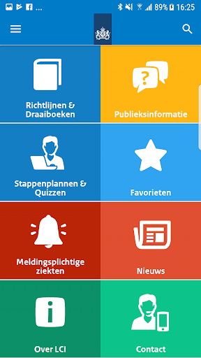  | 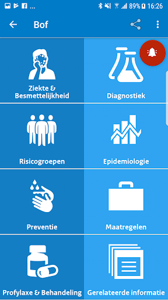  | 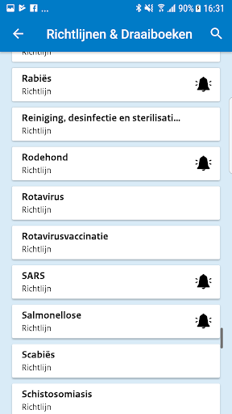  | 
 | 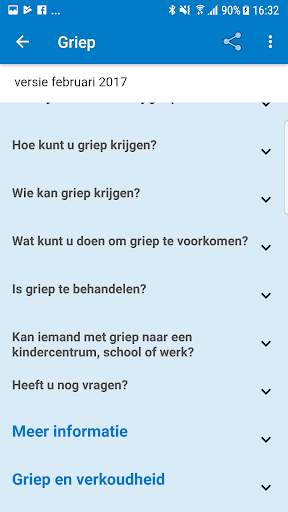 

## Development team
In the following we report the main information provided by the development team in the Google play store.

| | |
|-------------------------|-------------------------|
| **Developer**  | rivm-app |
| **Website**  | [http://rivm.nl](http://rivm.nl) |
| **Email** | ict-servicedesk@rivm.nl |
| **Physical address**  | - |
| **Other developed apps**  | [https://play.google.com/store/apps/developer?id=rivm-app](https://play.google.com/store/apps/developer?id=rivm-app) |

## Android support

| | |
|-------------------------|-------------------------|
| **Declared target Android version**  | Pie, version 9 (API level 28) |
| **Effective target Android version**  | Pie, version 9 (API level 28) |
| **Minimum supported Android version**  | Jelly Bean, version 4.2.x (API level 17) |
| **Maximum target Android version**  | - |

The larger the difference between the minimum and maximum supported Android versions, the better. A larger difference means a wider audience. For example, old phones have a very low Android version, so a high minimum supported Android version means that the app cannot be used by users with old phones, thus leading to accessibility problems. 

## Requested permissions

In the following we report the complete list of the permissions requested by the app. 

| **Permission** | **Protection level** | **Description** | 
|-------------------------|-------------------------|-------------------------|
 **android.permission CALL_PHONE** | :warning:**Dangerous** | Allows an application to initiate a phone call without going through the Dialer user interface for the user to confirm the call. 
 **android.permission INTERNET** | Normal | Allows applications to open network sockets. 
 **android.permission READ_PHONE_STATE** | :warning:**Dangerous** | Allows read only access to phone state, including the phone number of the device, current cellular network information, the status of any ongoing calls, and a list of any PhoneAccounts registered on the device. 

## Mentioned servers

| **Server** | **Registrant** | **Registrant country** | **Creation date** | 
|-------------------------|-------------------------|-------------------------|-------------------------|
 | google.com | Google LLC | :us: US | 1997-09-15 04:00:00 |
 | googleapis.com | Google LLC | :us: US | 2005-01-25 17:52:26 |
 | rivm.nl | - | - | 1990-07-17 00:00:00 |
 | dtnr.nl | - | - | 2016-06-07 00:00:00 |
 | apple.com | Apple Inc. | :us: US | 1987-02-19 05:00:00 |
 | xmlpull.org | WhoisGuard, Inc. | PA | 2001-11-26 20:33:08 |

## Security analysis 

Below we report the main security warnings raised by our execution of the [Androwarn](https://github.com/maaaaz/androwarn) security analysis tool.

**Telephony identifiers leakage**
> - This application reads the device phone type value 
> - This application reads the numeric name (MCC+MNC) of current registered operator 
> - This application reads the operator name 

**Connection interfaces exfiltration**
> - This application reads details about the currently active data network 
> - This application tries to find out if the currently active data network is metered 

**Telephony services abuse**
> - This application makes phone calls 

**Code execution**
> - This application loads a native library: 'jniPdfium' 
> - This application loads a native library: 'modft2' 
> - This application loads a native library: 'modpdfium' 
> - This application loads a native library: 'modpng' 

## User ratings and reviews

Below we provide information about how end users are reacting to the app in terms of ratings and reviews in the Google Play store.

### Ratings

The RIVM LCI-richtlijnen app has been installed by more than **50000** times. At this time, **79** rated the app and its average score is **3.78481**. Below we show the distribution of the ratings across the usual star-based rating of Google Play

:star::star::star::star::star:: 45

:star::star::star::star:: 11

:star::star::star:: 3

:star::star:: 1

:star:: 19

### Reviews 

#### 5-star reviews

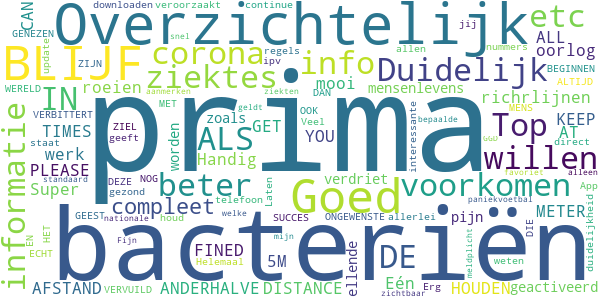

> Handig die richrlijnen  :date: __2020-05-13 18:57:39__

> Goed  :date: __2020-05-11 10:03:41__

> BLIJF. ANDERHALVE .METER . AFSTAND HOUDEN/ PLEASE KEEP 1,5M DISTANCE AT ALL TIMES , otherwise YOU CAN GET FINED €290,--!!!!!!  :date: __2020-05-05 22:02:40__

> Super mooi.werk prima.  :date: __2020-04-30 13:56:43__

> Goed  :date: __2020-04-23 16:47:54__

> Duidelijk  :date: __2020-04-23 10:42:37__

> Top  :date: __2020-04-19 21:12:33__

> Eén oorlog om bacteriën uit te roeien is geactiveerd, het had beter voorkomen kunnen worden.... nu heeft bacteriën zoals corona veel mensenlevens, verdriet, pijn, ellende, etc etc veroorzaakt. Laten we met zijn allen nu ECHT BEGINNEN MET VOORKOMEN, NOG ALTIJD BETER DAN GENEZEN. HET ZIJN ONGEWENSTE BACTERIËN IN DEZE WERELD DIE DE MENS VERVUILD ALS OOK DE GEEST EN ZIEL VERBITTERT. SUCCES  :date: __2020-04-12 06:21:40__

> Helemaal top!!!  :date: __2020-04-09 11:36:44__

> Prima App met veel informatie  :date: __2020-04-08 10:15:50__

#### 4-star reviews

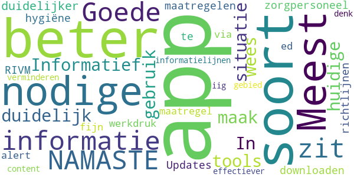

> Meest nodige informatie zit in deze app 🙏 NAMASTE  :date: __2020-04-09 09:55:23__

> Goede app. Informatief en duidelijk. 👍  :date: __2020-04-05 10:16:42__

> In 2020 en de huidige situatie; maak beter gebruik van dit soort tools- wees duidelijker, m.n voor zorgpersoneel! Updates RIVM maatregelen/richtlijnen(te downloaden hygiëne maatregel ed) door n alert via een soort app als deze zal fijn zijn en zal werkdruk bij informatielijnen verminderen. iig content dat er iets is aan app op dit gebied, maar kan denk ik dus beter/effectiever  :date: __2020-03-12 23:47:14__

#### 3-star reviews

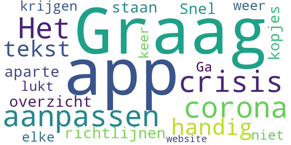

> Graag nog de app aanpassen aan corona crisis.  :date: __2020-04-13 11:55:30__

> Het is niet handig dat de tekst van de richtlijnen onder aparte kopjes staan. Snel overzicht krijgen lukt zo niet. Ga toch elke keer weer naar de website.  :date: __2018-04-15 12:23:09__

#### 2-star reviews

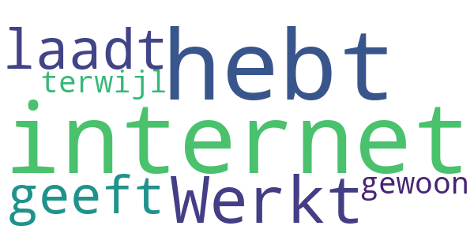

> Werkt niet laadt niet geeft aan dat je geen internet hebt terwijl je gewoon internet hebt  :date: __2020-04-21 20:48:56__

#### 1-star reviews

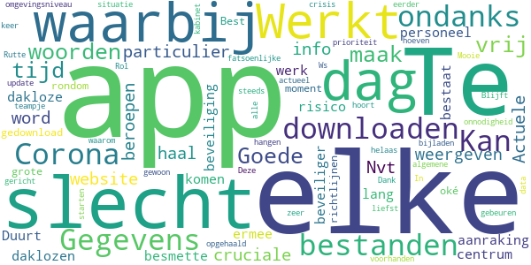

> Te slecht voor woorden hier maak ik geen tijd meer voor vrij.  :date: __2020-05-06 03:31:06__

> Goede app maar niet voor de particulier  :date: __2020-04-27 11:01:02__

> Nvt  :date: __2020-04-21 09:03:25__

> Actuele info haal je van de website  :date: __2020-04-19 17:56:15__

> cruciale beroepen waarbij niet word weergeven over personeel beveiliging die elke dag ermee in aanraking komen ik werk op een dakloze centrum als beveiliger waarbij het elke dag een risico bestaat over besmette daklozen.  :date: __2020-04-15 01:08:30__

> Duurt TE lang voor alles gedownload is  :date: __2020-04-14 19:48:15__

> Best een oké app maar alles rondom de richtlijnen is op dit moment een grote onnodigheid als Rutte en zijn teampje er eerder bij waren geweest had dit niet hoeven gebeuren  :date: __2020-04-14 14:24:32__

> Werkt niet zeer slecht 😈  :date: __2020-04-08 20:18:54__

> Gegevens worden niet opgehaald  :date: __2020-04-08 18:34:58__

> Kan bestanden niet downloaden.  :date: __2020-04-07 19:23:22__

# WHO Info
App version ``2.1.0``

Analyzed with [covid-apps-observer](http://github.com/covid-apps-observer) project, version ``0.1``

## App overview
| | |
|-------------------------|-------------------------| 
| **Name**&nbsp;&nbsp;&nbsp;&nbsp;&nbsp;&nbsp;&nbsp;&nbsp;&nbsp;&nbsp;&nbsp;&nbsp;&nbsp;&nbsp;&nbsp;&nbsp;&nbsp;&nbsp;&nbsp;&nbsp;&nbsp;&nbsp;&nbsp;&nbsp;&nbsp;&nbsp;&nbsp;&nbsp;&nbsp;&nbsp;&nbsp;&nbsp;&nbsp;&nbsp;&nbsp;&nbsp;&nbsp;&nbsp;&nbsp;&nbsp;  | WHO Info |
| **Unique identifier** | org.who.infoapp |
| **Link to Google Play** | [https://play.google.com/store/apps/details?id=org.who.infoapp](https://play.google.com/store/apps/details?id=org.who.infoapp) |
| **Summary**  | De officiële informatie-app van de Wereldgezondheidsorganisatie. |
| **Privacy policy** | [https://www.who.int/about/who-we-are/privacy-policy](https://www.who.int/about/who-we-are/privacy-policy) |
| **Latest version** | 2.1.0 |
| **Last update** | 2020-05-08 13:17:43 |
| **Recent changes** | This release resolves some minor fixes and introduces the latest case numbers reported to WHO. |
| **Installs**  | 100.000+ |
| **Category** | Nieuws en tijdschriften |
| **First release** | 13 apr. 2020 |
| **Size**  | 8,2M |
| **Supported Android version**  | 4.2 en hoger |

### Description
> Have the latest health information at your fingertips with the official World Health Organization Information App. This app displays the latest news, events, features and breaking updates on outbreaks. 
  
 WHO works worldwide to promote health, keep the world safe, and serve the vulnerable. 
 Our goal is to ensure that a billion more people have universal health coverage, to protect a billion more people from health emergencies, and provide a further billion people with better health and well-being.

### User interface
The developers of the app provide the following screenshots in the Google play store.
| | | |
|:-------------------------:|:-------------------------:|:-------------------------:|
 |   |   |   | 
 |   |   |   | 
 |   |   |   | 
 |   |   |   | 
 |   |   |   | 
 |   |   |   | 

## Development team
In the following we report the main information provided by the development team in the Google play store.

| | |
|-------------------------|-------------------------|
| **Developer**  | World Health Organization |
| **Website**  | [https://www.who.int/](https://www.who.int/) |
| **Email** | dcx@who.int |
| **Physical address**  | [Avenu Appia 20 1211 Geneva Switzerland](https://www.google.com/maps/search/Avenu%20Appia%2020%201211%20Geneva%20Switzerland) (Google Maps) |
| **Other developed apps**  | [https://play.google.com/store/apps/developer?id=World+Health+Organization](https://play.google.com/store/apps/developer?id=World+Health+Organization) |

## Android support

| | |
|-------------------------|-------------------------|
| **Declared target Android version**  | Android10, version 10 (API level 29) |
| **Effective target Android version**  | Android10, version 10 (API level 29) |
| **Minimum supported Android version**  | Jelly Bean, version 4.2.x (API level 17) |
| **Maximum target Android version**  | - |

The larger the difference between the minimum and maximum supported Android versions, the better. A larger difference means a wider audience. For example, old phones have a very low Android version, so a high minimum supported Android version means that the app cannot be used by users with old phones, thus leading to accessibility problems. 

## Requested permissions

In the following we report the complete list of the permissions requested by the app. 

| **Permission** | **Protection level** | **Description** | 
|-------------------------|-------------------------|-------------------------|
 **android.permission INTERNET** | Normal | Allows applications to open network sockets. 
 **android.permission READ_EXTERNAL_STORAGE** | :warning:**Dangerous** | Allows an application to read from external storage. 
 **android.permission WRITE_EXTERNAL_STORAGE** | :warning:**Dangerous** | Allows an application to write to external storage. 

## Mentioned servers

| **Server** | **Registrant** | **Registrant country** | **Creation date** | 
|-------------------------|-------------------------|-------------------------|-------------------------|
-

## Security analysis 

Below we report the main security warnings raised by our execution of the [Androwarn](https://github.com/maaaaz/androwarn) security analysis tool.

**Connection interfaces exfiltration**
> - This application reads details about the currently active data network 
> - This application tries to find out if the currently active data network is metered 

**Suspicious connection establishment**
> - This application opens a Socket and connects it to the remote address 'Lfi/iki/elonen/NanoHTTPD$ResponseException;' on the 'N/A' port  
> - This application opens a Socket and connects it to the remote address 'NanoHttpd Shutdown' on the 'N/A' port  

**Code execution**
> - This application loads a native library: 'NativeScript' 
> - This application executes a UNIX command containing this argument: '2' 

## User ratings and reviews

Below we provide information about how end users are reacting to the app in terms of ratings and reviews in the Google Play store.

### Ratings

The WHO Info app has been installed by more than **100000** times. At this time, **306** rated the app and its average score is **3.64**. Below we show the distribution of the ratings across the usual star-based rating of Google Play

:star::star::star::star::star:: 171

:star::star::star::star:: 30

:star::star::star:: 6

:star::star:: 18

:star:: 79

### Reviews 

#### 5-star reviews

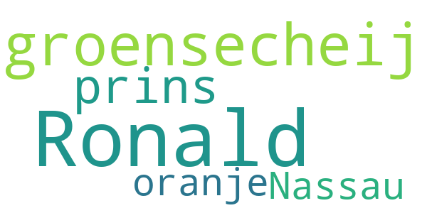

> Ronald groensecheij prins van oranje Nassau  :date: __2020-04-19 03:15:56__

#### 4-star reviews

No recent reviews available with 4 stars.

#### 3-star reviews

No recent reviews available with 3 stars.

#### 2-star reviews

No recent reviews available with 2 stars.

#### 1-star reviews

No recent reviews available with 1 stars.

# Luscii
App version ``4.22.4``

Analyzed with [covid-apps-observer](http://github.com/covid-apps-observer) project, version ``0.1``

## App overview
| | |
|-------------------------|-------------------------| 
| **Name**&nbsp;&nbsp;&nbsp;&nbsp;&nbsp;&nbsp;&nbsp;&nbsp;&nbsp;&nbsp;&nbsp;&nbsp;&nbsp;&nbsp;&nbsp;&nbsp;&nbsp;&nbsp;&nbsp;&nbsp;&nbsp;&nbsp;&nbsp;&nbsp;&nbsp;&nbsp;&nbsp;&nbsp;&nbsp;&nbsp;&nbsp;&nbsp;&nbsp;&nbsp;&nbsp;&nbsp;&nbsp;&nbsp;&nbsp;&nbsp;  | Luscii |
| **Unique identifier** | nl.focuscura.beeldbelapp |
| **Link to Google Play** | [https://play.google.com/store/apps/details?id=nl.focuscura.beeldbelapp](https://play.google.com/store/apps/details?id=nl.focuscura.beeldbelapp) |
| **Summary**  | Welkom bij Luscii, de slimste gezondheidsapp voor zorg thuis of onderweg. |
| **Privacy policy** | [https://luscii.com/privacy-policy/](https://luscii.com/privacy-policy/) |
| **Latest version** | 4.22.4 |
| **Last update** | 2020-05-20 18:10:30 |
| **Recent changes** | In deze update algemene verbeteringen voor de app |
| **Installs**  | 50.000+ |
| **Category** | Medisch |
| **First release** | 8 mrt. 2016 |
| **Size**  | 19M |
| **Supported Android version**  | 7.0 en hoger |

### Description
> Wat is Luscii?
 Luscii maakt moderne zorg mogelijk. Met de Luscii app is het op voorschrift van een zorgorganisatie mogelijk om:
 - lichaamswaarden/symptomen in de gaten te houden
 - gerichte educatie te ontvangen over (omgaan met) ziekte of gezondheidsrisico's
 - op afstand te communiceren met zorgverleners
 Hoe werkt het?
 - Mensen dienen zich eerst aan te melden. Dat gaat normaal via een ziekenhuis. In geval van inzet in de corona crisis is aanmelden ook mogelijk op www.olvgcoronacheck.nl
 - De app vraagt dagelijks een aantal lichaamswaarden of symptomen door te geven. Deze zijn gebaseerd op een door zorgverleners voor de gebruiker ingesteld programma. Ook is er educatie in de app en contact op afstand.
 - Achter de app staat een medisch team paraat. Dit beoordeelt de antwoorden die gebruikers geven in de app (ondersteund door de techniek van de app). Als er een medische reden is om contact op te nemen, doen zij dat binnen 24 uur. Dat kan telefonisch of via een bericht. Ook is contact via beeldbellen mogelijk (let op: deze functie gebruikt OLVG corona check nog niet).
 OLVG corona check
 - Door de uitbraak van het coronavirus neemt de zorgvraag toe. Ziekenhuizen bereiden zich hierop voor door nieuwe middelen in te zetten naast de reguliere zorg. Samen met het Amsterdamse ziekenhuis OLVG heeft Luscii daarom de Luscii app hiervoor geschikt gemaakt. We noemen dit OLVG corona check.
 - OLVG corona check is bedoeld om grote groepen mensen met klachten die mogelijk door het coronavirus wordt veroorzaakt op afstand te kunnen begeleiden. Een medisch team beoordeelt de metingen die binnenkomen via de app van Luscii die voor OLVG corona check wordt gebruikt. OLVG corona check is gratis.
 - OLVG corona check is gestart voor mensen in de regio Groot Amsterdam. Er wordt gestreefd de regio's waarin de app beschikbaar is, uit te breiden. Meer informatie is te vinden op www.olvgcoronacheck.nl.
 Medisch hulpmiddel en gegevensverwerking
 Luscii is een CE gemarkeerd medisch hulpmiddel. Gegevens worden verwerkt volgens de Algemene Verordering Gegevensbescherming (AVG). Het privacyreglement en gebruikersvoorwaarden zijn te vinden op www.luscii.com. Luscii is gevestigd in Amsterdam, Nederland.

### User interface
The developers of the app provide the following screenshots in the Google play store.
| | | |
|:-------------------------:|:-------------------------:|:-------------------------:|
 |   |   |   | 
 |   |   |   | 
 |   |  

## Development team
In the following we report the main information provided by the development team in the Google play store.

| | |
|-------------------------|-------------------------|
| **Developer**  | Luscii Healthtech |
| **Website**  | [http://www.luscii.com](http://www.luscii.com) |
| **Email** | support@luscii.com |
| **Physical address**  | [Spuistraat 114A 1012 VA Amsterdam The Netherlands](https://www.google.com/maps/search/Spuistraat%20114A%201012%20VA%20Amsterdam%20The%20Netherlands) (Google Maps) |
| **Other developed apps**  | [https://play.google.com/store/apps/developer?id=Luscii+Healthtech](https://play.google.com/store/apps/developer?id=Luscii+Healthtech) |

## Android support

| | |
|-------------------------|-------------------------|
| **Declared target Android version**  | Android10, version 10 (API level 29) |
| **Effective target Android version**  | Android10, version 10 (API level 29) |
| **Minimum supported Android version**  | Nougat, version 7.0 (API level 24) |
| **Maximum target Android version**  | - |

The larger the difference between the minimum and maximum supported Android versions, the better. A larger difference means a wider audience. For example, old phones have a very low Android version, so a high minimum supported Android version means that the app cannot be used by users with old phones, thus leading to accessibility problems. 

## Requested permissions

In the following we report the complete list of the permissions requested by the app. 

| **Permission** | **Protection level** | **Description** | 
|-------------------------|-------------------------|-------------------------|
 **android.permission ACCESS_BACKGROUND_LOCATION** | :warning:**Dangerous** | Allows an app to access location in the background. 
 **android.permission ACCESS_COARSE_LOCATION** | :warning:**Dangerous** | Allows an app to access approximate location. 
 **android.permission ACCESS_FINE_LOCATION** | :warning:**Dangerous** | Allows an app to access precise location. 
 **android.permission ACCESS_NETWORK_STATE** | Normal | Allows applications to access information about networks. 
 **android.permission ACCESS_NOTIFICATION_POLICY** | Normal | Marker permission for applications that wish to access notification policy. 
 **android.permission ACCESS_WIFI_STATE** | Normal | Allows applications to access information about Wi-Fi networks. 
 **android.permission ACTIVITY_RECOGNITION** | :warning:**Dangerous** | Allows an application to recognize physical activity. 
 **android.permission BLUETOOTH** | Normal | Allows applications to connect to paired bluetooth devices. 
 **android.permission BLUETOOTH_ADMIN** | Normal | Allows applications to discover and pair bluetooth devices. 
 **android.permission CAMERA** | :warning:**Dangerous** | Required to be able to access the camera device. 
 **android.permission DISABLE_KEYGUARD** | Normal | Allows applications to disable the keyguard if it is not secure. 
 **android.permission FOREGROUND_SERVICE** | Normal | Allows a regular application to use Service.startForeground. 
 **android.permission INTERNET** | Normal | Allows applications to open network sockets. 
 **android.permission MODIFY_AUDIO_SETTINGS** | Normal | Allows an application to modify global audio settings. 
 **android.permission READ_EXTERNAL_STORAGE** | :warning:**Dangerous** | Allows an application to read from external storage. 
 **android.permission READ_PHONE_STATE** | :warning:**Dangerous** | Allows read only access to phone state, including the phone number of the device, current cellular network information, the status of any ongoing calls, and a list of any PhoneAccounts registered on the device. 
 **android.permission RECEIVE_BOOT_COMPLETED** | Normal | Allows an application to receive the Intent.ACTION_BOOT_COMPLETED that is broadcast after the system finishes booting. 
 **android.permission RECORD_AUDIO** | :warning:**Dangerous** | Allows an application to record audio. 
 **android.permission USE_FULL_SCREEN_INTENT** | Normal | Required for apps targeting Build.VERSION_CODES.Q that want to use notification full screen intents. 
 **android.permission VIBRATE** | Normal | Allows access to the vibrator. 
 **android.permission WAKE_LOCK** | Normal | Allows using PowerManager WakeLocks to keep processor from sleeping or screen from dimming. 
 **android.permission WRITE_EXTERNAL_STORAGE** | :warning:**Dangerous** | Allows an application to write to external storage. 
 **com.google.android.c2dm.permission RECEIVE** | - | - 
 **com.google.android.finsky.permission BIND_GET_INSTALL_REFERRER_SERVICE** | - | - 
 **nl.focuscura.beeldbelapp.permission C2D_MESSAGE** | - | - 

## Mentioned servers

| **Server** | **Registrant** | **Registrant country** | **Creation date** | 
|-------------------------|-------------------------|-------------------------|-------------------------|
 | w3.org | W3C | :us: US | 1994-07-06 04:00:00 |
 | xml.org | OASIS Open | :us: US | 1997-02-03 05:00:00 |
 | xmlpull.org | WhoisGuard, Inc. | PA | 2001-11-26 20:33:08 |
 | googlesyndication.com | Google LLC | :us: US | 2003-01-21 06:17:24 |
 | google.com | Google LLC | :us: US | 1997-09-15 04:00:00 |
 | google-analytics.com | Google LLC | :us: US | 2005-07-18 19:24:32 |
 | app-measurement.com | Google LLC | :us: US | 2015-06-19 20:13:31 |
 | googleapis.com | Google LLC | :us: US | 2005-01-25 17:52:26 |
 | ihealthlabs.com | - | cn | 2011-10-13 07:43:43 |
 | sematext.com | REDACTED FOR PRIVACY | :us: US | 2007-05-01 03:03:08 |
 | apple.com | Apple Inc. | :us: US | 1987-02-19 05:00:00 |
 | aomedia.org | Contact Privacy Inc. Customer 1243324949 | :canada: CA | 2015-08-24 14:07:31 |
 | googleapis.com | Google LLC | :us: US | 2005-01-25 17:52:26 |
 | amazonaws.com | Amazon.com, Inc. | :us: US | 2005-08-18 02:10:45 |
 | googleadservices.com | Google LLC | :us: US | 2003-06-19 16:34:53 |
 | vimeo.com | Vimeo, Inc. | :us: US | 2004-12-15 08:38:55 |
 | branch.io | Branch | :us: US | 2011-11-10 13:52:13 |
 | crashlytics.com | Google LLC | :us: US | 2011-01-21 15:30:40 |
 | twitter.com | Twitter, Inc. | :us: US | 2000-01-21 16:28:17 |
 | intercomcdn.com | Whois Privacy Service | :us: US | 2013-04-25 22:04:57 |
 | wistia.net | Wistia | :us: US | 2008-09-02 18:42:09 |
 | useloom.com | Whois Privacy Service | :us: US | 2016-10-03 00:10:39 |
 | wistia.com | Wistia | :us: US | 2007-03-18 21:58:55 |
 | youtube.com | Google LLC | :us: US | 2005-02-15 05:13:12 |
 | focuscura.com | REDACTED FOR PRIVACY | REDACTED FOR PRIVACY | 2010-05-20 14:02:28 |
 | luscii.com | Domains By Proxy, LLC | :us: US | 2018-06-21 09:46:19 |
 | focuscura.nl | - | - | 2003-01-30 00:00:00 |
 | intercom.io | Intercom Ops | IE | 2011-08-15 11:52:53 |

## Security analysis 

Below we report the main security warnings raised by our execution of the [Androwarn](https://github.com/maaaaz/androwarn) security analysis tool.

**Telephony identifiers leakage**
> - This application reads the ISO country code equivalent of the current registered operator's MCC (Mobile Country Code) 
> - This application reads the numeric name (MCC+MNC) of current registered operator 
> - This application reads the operator name 

**Connection interfaces exfiltration**
> - This application reads details about the currently active data network 
> - This application tries to find out if the currently active data network is metered 

**Suspicious connection establishment**
> - This application opens a Socket and connects it to the remote address 'La/d/b/a/a;->a(Ljava/lang/String;)Ljava/lang/StringBuilder;' on the 'N/A' port  
> - This application opens a Socket and connects it to the remote address 'Ljava/lang/StringBuilder;->toString()Ljava/lang/String;' on the 'N/A' port  
> - This application opens a Socket and connects it to the remote address 'Ljava/net/Proxy;->type()Ljava/net/Proxy$Type;' on the 'N/A' port  
> - This application opens a Socket and connects it to the remote address 'No route to  ' on the 'N/A' port  
> - This application opens a Socket and connects it to the remote address 'Proxy.address() is not an InetSocketAddress:   returned no addresses for  Ljava/net/SocketException;' on the 'N/A' port  
> - This application opens a Socket and connects it to the remote address 'timeout' on the 'N/A' port  

**Code execution**
> - This application loads a native library 
> - This application loads a native library: 'ECGOffline' 
> - This application loads a native library: 'ECGOnline' 
> - This application loads a native library: 'VidyoClient' 
> - This application loads a native library: 'heartbeat-android' 
> - This application loads a native library: 'heartbeat-lib' 
> - This application loads a native library: 'iHealth' 
> - This application loads a native library: 'sodiumjni' 

## User ratings and reviews

Below we provide information about how end users are reacting to the app in terms of ratings and reviews in the Google Play store.

### Ratings

The Luscii app has been installed by more than **50000** times. At this time, **6752** rated the app and its average score is **4.4092264**. Below we show the distribution of the ratings across the usual star-based rating of Google Play

:star::star::star::star::star:: 3767

:star::star::star::star:: 2260

:star::star::star:: 522

:star::star:: 120

:star:: 80

### Reviews 

#### 5-star reviews

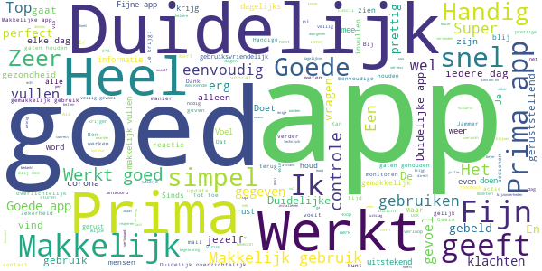

> Prima app  :date: __2020-05-22 12:30:02__

> Ik voel mij veilig en ondersteunt. Mooi actie.  :date: __2020-05-22 11:15:06__

> Overzichtelijk duidelijk interface en laatste verbeteringen staten app sneller op.  :date: __2020-05-22 07:44:21__

> Vandaag op hemelvaartsdag gebeld hoe het met mij gaat! Gaven mij nog tips. Heel fijn en wordt echt gewaardeerd! Top  :date: __2020-05-21 21:31:51__

> Makkelijk in gebruik  :date: __2020-05-21 21:23:41__

> Werkt goed en is simpel  :date: __2020-05-21 19:46:29__

> Heel handig en gemakkelijk in gebruik  :date: __2020-05-21 19:12:26__

> Sinds de update van 20 mei 2020 werkt het allemaal gelukkig weer. Nu weer 5 sterren. Na de update in april moet ik weer een emailadres imvullen. Bij het verzenden krijg ik de melding: "Er ging iets mis. Oops, we hebben een technisch perobleem. Probeer het later opnieuw." Dit is al dagen zo. Daatom slechts 1 ster.  :date: __2020-05-21 17:13:02__

> Fijne app. Je hoeft er niet te lang bij na te denken.  :date: __2020-05-21 15:22:41__

> Sinds kort heb ik ook Luscii net als mijn man. Het fijn dat je iedere dag met je neus op de feiten gedrukt word.  :date: __2020-05-21 10:11:55__

#### 4-star reviews

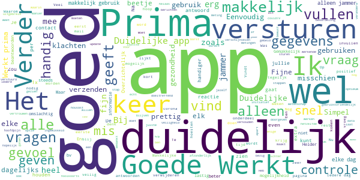

> Deze app is de beste manier om zo vroeg mogelijk in de gaten te hebben dat er een mogelijke besmetting is. De eerste die dat merkt ben je zelf met hulp van deze app. Dit is dus het allervroegste waarschuwingssysteem. Dat is belangrijk bij het voorkomen van een nieuwe uitbraak. Doorgeven van elk getal afzonderlijk is wat omslachtig, maar verhoogt misschien de zorgvuldigheid van elke invoer. Veel meer mensen zouden hier aan mee moeten doen.  :date: __2020-05-23 10:44:43__

> Positief. Verder geen ervaring.  :date: __2020-05-22 23:21:21__

> Blijft vraagteken, hopelijk leerzaam  :date: __2020-05-22 20:30:58__

> Te algemeen  :date: __2020-05-22 15:02:37__

> Ik probeer een zo zuiver mogelijk beeld van de situatie te geven als 'hooikoortslijder' omdat de verschijnselen blijkbaar hetzelfde zijn als die in de vragenlijst. Elke ochtend is het dus een juiste afweging maken.  :date: __2020-05-22 08:55:45__

> Prima app na wat opstartproblemen.  :date: __2020-05-21 10:02:27__

> Goed ,duidelijk ,  :date: __2020-05-21 09:15:50__

> Vragen : prima! Is verzenden in een keer mogelijk?  :date: __2020-05-20 19:46:20__

> Jullie hadden gebeld, maar helaas kon ik niet op tijd opnemen. Was aan het douchen. Vind erg dat ik het niet heb kunnen opnemen.  :date: __2020-05-20 09:36:03__

> Er kunnen meer relevante vragen gesteld worden. Bijv saturatie, vermoeidheid, belastbaarheid.  :date: __2020-05-20 08:25:49__

#### 3-star reviews

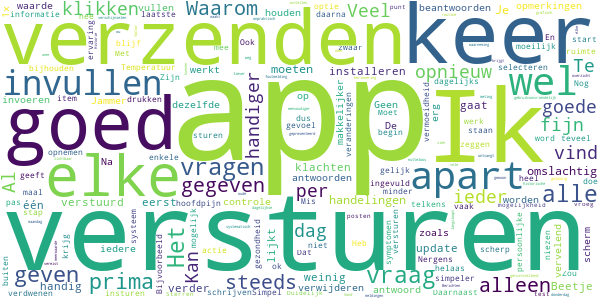

> Historie is verdwenen na de updates. Vond dagelijks bijhouden handiger routine dan alleen maandag en donderdag. Veel liever dagelijkse controle. Temperatuur meting nu ook verdwenen. Jammer, zo heeft een app weinig meerwaarde. Na update is foutmelding weg gelukkig.  :date: __2020-05-21 11:46:16__

> Al dat vele klikken maakt het gebruiksonvriendelijk. Kan dat niet simpeler?  :date: __2020-05-21 06:30:26__

> Het was een goede app, tot de laatste update. Nu kan ik geen waardes meer invoeren of zien. App verwijderen en opnieuw installeren werkt niet.  :date: __2020-05-20 22:53:55__

> Twee opmerkingen: 1. waarom steeds per item versturen en niet alles in een keer? 2. Berichten die je ontvangt zijn niet te verwijderen  :date: __2020-05-20 19:12:45__

> Na update geen historische gegevens meer zichtbaar.  :date: __2020-05-19 19:30:39__

> Ik vind het onpraktisch dat je iedere waarneming apart moet insturen. Dat moet gewoon in één keer kunnen. Daarnaast zou het handig zijn als je een herinnering kon instellen om in te vullen. Het is wel fijn dat je iedere dag systematisch alle verschijnselen langsloopt en in een grafisch overzicht gepresenteerd krijgt. De meldingen of er actie vereist is of niet zijn geruststellend.  :date: __2020-05-18 23:29:44__

> App werkt weer door oude te verwijderen en opnieuw te installeren  :date: __2020-05-18 10:51:30__

> Ik moet na élke factor "versturen". Kan dat niet eenvoudiger?  :date: __2020-05-17 12:08:36__

> Goed  :date: __2020-05-17 07:40:41__

> Lijkt nutteloos als je gezond lijkt  :date: __2020-05-15 19:38:54__

#### 2-star reviews

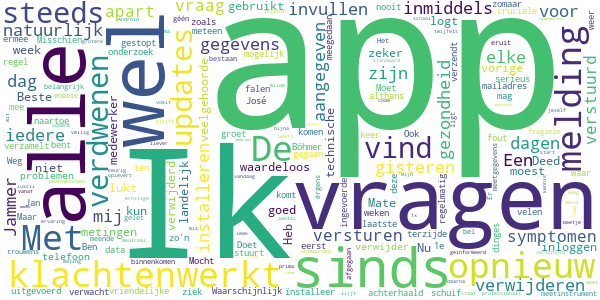

> Nu vind ik de app niet goed meer zeker na de updates,alles is verdwenen alle metingen. Heb nu de app verwijderd.  :date: __2020-05-23 10:58:18__

> Deed wat hij moest doen maar sinds de app landelijk wordt gebruikt waardeloos en de updates van vorige week is het een k..t app moet hem steeds verwijderen en opnieuw installeren want hij logt steeds uit en opnieuw inloggen lukt niet.  :date: __2020-05-19 19:26:43__

> Mate van klachten kun je niet aangegeven. Ik ook andere veelgehoorde klachten. Beste medewerker, De app heeft al dagen technische problemen. Ik verwijder 'm van mijn telefoon. Waarschijnlijk bent u gestopt met uw onderzoek.  Ook uw vragen zijn inmiddels achterhaald. Ben inmiddels al 4 weken ziek, zoals zo velen met mij. Ik had hier meer van verwacht. Jammer dat dit niet serieus wordt uitgevoerd.  Met vriendelijke groet, José ten Böhmer  :date: __2020-05-18 10:11:59__

> Doet het regelmatig niet  :date: __2020-05-18 10:04:06__

> Sinds gisteren kan ik weer niet in de app komen. Moet eerst mijn e mailadres invullen en dan komt de melding, er is iets fout gegaan.  :date: __2020-05-18 09:39:42__

> Een app die niet werkt de-ïnstalleer ik in de regel meteen. Weg ermee! Maar deze, waar je elke dag je gegevens naartoe stuurt, schuif je natuurlijk niet zomaar terzijde. Een app die (mogelijk) cruciale data verzamelt en verzendt mag natuurlijk nooit falen. Misschien zijn nu al mijn ingevoerde gegevens verdwenen en heb ik voor Jan dinges meegedaan. Mocht dat zo zijn, dan was dit de 1e en laatste keer om mee te doen aan zo'n (voor mij althans) toch wel belangrijk meetinstrument, gelet op mijn fragiele gezondheid. Het kan trouwens niet bestaan dat deze app al enkele dagen eruit ligt. Er moet toch érgens een bel zijn afgegaan dat er géén meetgegevens meer binnenkomen? Ik meende dat dit professionals zijn/waren. Ik heb nu toch wel ernstige twijfels  :date: __2020-05-17 15:29:26__

> Mijn ervaring met luscii is prima word keurig geïnformeerd  :date: __2020-05-17 10:02:33__

> Geeft geen melding op Android, en ja melding staat aan  :date: __2020-05-13 08:30:47__

> App moet ik bijna bij iedere meting verwijderen en opnieuw installeren! Na invullen code verschijnt leeg scherm.  :date: __2020-05-07 09:36:52__

> Neutraal geen inzicht wat het op grotere schaal oplevert. Met de ja /nee antwoorden op een aantal vragen mis je de mensen met zeer milde symptomen lijjt mij.  :date: __2020-05-05 12:26:35__

#### 1-star reviews

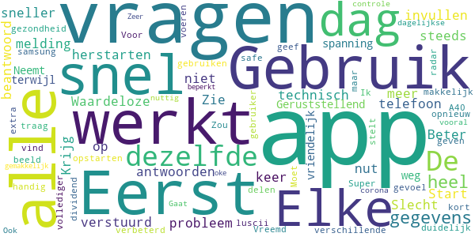

> App werkt niet meer. Krijg steeds de melding dat er een technisch probleem is  :date: __2020-05-18 08:52:21__

> Waardeloze app. Start niet op. Eerst telefoon herstarten.  :date: __2020-05-12 11:39:32__

> Zie het nut niet.  :date: __2020-05-10 13:49:44__

> Beter als je eerst alle vragen beantwoord en dan alle antwoorden in 1 keer verstuurd. Werkt sneller bij invullen  :date: __2020-05-06 15:03:22__

> Slecht  :date: __2020-05-05 09:25:06__

> Geruststellend  :date: __2020-05-04 07:03:06__

> Neemt wat spanning weg!  :date: __2020-05-02 14:37:44__

> Gebruik vriendelijk en snel  :date: __2020-05-02 09:17:22__

> Elke dag dezelfde vragen, terwijl de gezondheid niet verbeterd.  :date: __2020-05-01 09:53:27__

> Moet mijn samsung A40 elke dag opnieuw opstarten om luscii te kunnen gebruiken.  :date: __2020-04-29 15:30:47__

# OpenWHO: Knowledge for Health Emergencies
App version ``3.3.1``

Analyzed with [covid-apps-observer](http://github.com/covid-apps-observer) project, version ``0.1``

## App overview
| | |
|-------------------------|-------------------------| 
| **Name**&nbsp;&nbsp;&nbsp;&nbsp;&nbsp;&nbsp;&nbsp;&nbsp;&nbsp;&nbsp;&nbsp;&nbsp;&nbsp;&nbsp;&nbsp;&nbsp;&nbsp;&nbsp;&nbsp;&nbsp;&nbsp;&nbsp;&nbsp;&nbsp;&nbsp;&nbsp;&nbsp;&nbsp;&nbsp;&nbsp;&nbsp;&nbsp;&nbsp;&nbsp;&nbsp;&nbsp;&nbsp;&nbsp;&nbsp;&nbsp;  | OpenWHO: Knowledge for Health Emergencies |
| **Unique identifier** | de.xikolo.openwho |
| **Link to Google Play** | [https://play.google.com/store/apps/details?id=de.xikolo.openwho](https://play.google.com/store/apps/details?id=de.xikolo.openwho) |
| **Summary**  | Levensreddende kennis voor eerstelijnshulpverleners in noodsituaties op gezondheidsgebied. |
| **Privacy policy** | [https://openwho.org/pages/privacy](https://openwho.org/pages/privacy) |
| **Latest version** | 3.3.1 |
| **Last update** | 2020-05-11 10:06:32 |
| **Recent changes** | - Redesign of some UI elements - Bug fixes and performance improvements |
| **Installs**  | 1.000.000+ |
| **Category** | Onderwijs |
| **First release** | 17 mei 2017 |
| **Size**  | 18M |
| **Supported Android version**  | 5.0 en hoger |

### Description
> OpenWHO is the World Health Organization's (WHO) interactive knowledge-transfer platform offering online courses to improve the response to health emergencies. OpenWHO enables the Organization and its key partners to transfer life-saving knowledge to large numbers of frontline responders.
 With OpenWHO, you have the flexibility to learn at your convenience. Watch the short video lectures and test your knowledge with self-tests when and where you like. The course forum and the collaboration space allow you to get in touch with other participants and experts around the world.
  
 Designed primarily for health care workers, frontline responders, and decision-makers, the app is also a source of information for those affected by disease outbreaks and health emergencies, or for those with a general interest in WHO's work in health emergencies.
  
 It features 6 channels:
 - The <b>Outbreak</b> channel addresses the management of infectious diseases and provides life-saving, scientific information.
 - The <b>Ready for Response</b> channel helps prepare personnel who are training for deployment to work in disease outbreaks and health emergencies.
 - The <b>Get Social</b> channel focuses on social science-based interventions and helps to communicate with affected communities.
 - The <b>Preparing for Pandemics</b> channel brings together courses on various aspects of preparedness, including surveillance, public health measures and risk communication during a pandemic.
 - The <b>COVID-19</b> channel provides learning resources in WHO's 6 official languages (Arabic, Chinese, English, French, Russian and Spanish) for health professionals, decision-makers and the public for the outbreak of coronavirus disease (COVID-19).
 - The <b>COVID-19 National Languages</b> channel provides the same learning resources as the COVID-19 channel but in national languages, such as Indonesian, Japanese and Portuguese. 
  
 OpenWHO courses are available in many languages, including WHO's 6 official languages. 
  
 Download the app now, and join the OpenWHO community.
 This app is developed in cooperation between the Hasso Plattner Institute and the WHO. The learning content is provided exclusively by the WHO.

### User interface
The developers of the app provide the following screenshots in the Google play store.
| | | |
|:-------------------------:|:-------------------------:|:-------------------------:|
 |   |   |   | 
 |   |   |   | 

## Development team
In the following we report the main information provided by the development team in the Google play store.

| | |
|-------------------------|-------------------------|
| **Developer**  | HPI Knowledge Engineering Team |
| **Website**  | [https://openwho.org/](https://openwho.org/) |
| **Email** | openwho-support@hpi.de |
| **Physical address**  | [Prof.-Dr.-Helmert-Str.2-3 14482 Potsdam](https://www.google.com/maps/search/Prof.-Dr.-Helmert-Str.2-3%2014482%20Potsdam) (Google Maps) |
| **Other developed apps**  | [https://play.google.com/store/apps/developer?id=7185448023325736337](https://play.google.com/store/apps/developer?id=7185448023325736337) |

## Android support

| | |
|-------------------------|-------------------------|
| **Declared target Android version**  | Android10, version 10 (API level 29) |
| **Effective target Android version**  | Android10, version 10 (API level 29) |
| **Minimum supported Android version**  | Lollipop, version 5.0 (API level 21) |
| **Maximum target Android version**  | - |

The larger the difference between the minimum and maximum supported Android versions, the better. A larger difference means a wider audience. For example, old phones have a very low Android version, so a high minimum supported Android version means that the app cannot be used by users with old phones, thus leading to accessibility problems. 

## Requested permissions

In the following we report the complete list of the permissions requested by the app. 

| **Permission** | **Protection level** | **Description** | 
|-------------------------|-------------------------|-------------------------|
 **android.permission ACCESS_NETWORK_STATE** | Normal | Allows applications to access information about networks. 
 **android.permission ACCESS_WIFI_STATE** | Normal | Allows applications to access information about Wi-Fi networks. 
 **android.permission FOREGROUND_SERVICE** | Normal | Allows a regular application to use Service.startForeground. 
 **android.permission INTERNET** | Normal | Allows applications to open network sockets. 
 **android.permission READ_EXTERNAL_STORAGE** | :warning:**Dangerous** | Allows an application to read from external storage. 
 **android.permission RECEIVE_BOOT_COMPLETED** | Normal | Allows an application to receive the Intent.ACTION_BOOT_COMPLETED that is broadcast after the system finishes booting. 
 **android.permission WAKE_LOCK** | Normal | Allows using PowerManager WakeLocks to keep processor from sleeping or screen from dimming. 
 **android.permission WRITE_EXTERNAL_STORAGE** | :warning:**Dangerous** | Allows an application to write to external storage. 
 **com.google.android.c2dm.permission RECEIVE** | - | - 
 **com.google.android.finsky.permission BIND_GET_INSTALL_REFERRER_SERVICE** | - | - 

## Mentioned servers

| **Server** | **Registrant** | **Registrant country** | **Creation date** | 
|-------------------------|-------------------------|-------------------------|-------------------------|
 | googlesyndication.com | Google LLC | :us: US | 2003-01-21 06:17:24 |
 | google.com | Google LLC | :us: US | 1997-09-15 04:00:00 |
 | app-measurement.com | Google LLC | :us: US | 2015-06-19 20:13:31 |
 | apple.com | Apple Inc. | :us: US | 1987-02-19 05:00:00 |
 | aomedia.org | Contact Privacy Inc. Customer 1243324949 | :canada: CA | 2015-08-24 14:07:31 |
 | dashif.org | VTM Group | :us: US | 2012-04-27 13:02:46 |
 | w3.org | W3C | :us: US | 1994-07-06 04:00:00 |
 | googleapis.com | Google LLC | :us: US | 2005-01-25 17:52:26 |
 | googleadservices.com | Google LLC | :us: US | 2003-06-19 16:34:53 |
 | psdev.de | - | - | - |
 | xmlpull.org | WhoisGuard, Inc. | PA | 2001-11-26 20:33:08 |
 | someurl.com | WhoisGuard, Inc. | PA | 2000-02-08 15:50:35 |
 | crashlytics.com | Google LLC | :us: US | 2011-01-21 15:30:40 |
 | apache.org | The Apache Software Foundation | :us: US | 1995-04-11 04:00:00 |
 | opensource.org | Open Source Initiative | :us: US | 1998-02-11 05:00:00 |
 | creativecommons.org | Creative Commons Corporation | :canada: CA | 2001-01-15 16:51:44 |
 | eclipse.org | Eclipse.org Foundation, Inc. | :canada: CA | 1997-04-14 04:00:00 |
 | gnu.org | Free Software Foundation | :us: US | 1995-11-24 05:00:00 |
 | mozilla.org | Mozilla Corporation | :us: US | 1998-01-24 05:00:00 |

## Security analysis 

Below we report the main security warnings raised by our execution of the [Androwarn](https://github.com/maaaaz/androwarn) security analysis tool.

**Telephony identifiers leakage**
> - This application reads the ISO country code equivalent of the current registered operator's MCC (Mobile Country Code) 

**Connection interfaces exfiltration**
> - This application reads details about the currently active data network 
> - This application tries to find out if the currently active data network is metered 

**Suspicious connection establishment**
> - This application opens a Socket and connects it to the remote address ' returned no addresses for  ; port is out of range' on the 'N/A' port  
> - This application opens a Socket and connects it to the remote address '' on the 'N/A' port  
> - This application opens a Socket and connects it to the remote address 'Ljava/lang/StringBuilder;->toString()Ljava/lang/String;' on the 'N/A' port  
> - This application opens a Socket and connects it to the remote address 'Ljava/net/Proxy;->type()Ljava/net/Proxy$Type;' on the 'N/A' port  
> - This application opens a Socket and connects it to the remote address 'timeout' on the 'N/A' port  

**Code execution**
> - This application loads a native library 
> - This application loads a native library: 'bypass' 

## User ratings and reviews

Below we provide information about how end users are reacting to the app in terms of ratings and reviews in the Google Play store.

### Ratings

The OpenWHO: Knowledge for Health Emergencies app has been installed by more than **1000000** times. At this time, **2498** rated the app and its average score is **4.2995954**. Below we show the distribution of the ratings across the usual star-based rating of Google Play

:star::star::star::star::star:: 1628

:star::star::star::star:: 394

:star::star::star:: 242

:star::star:: 60

:star:: 171

### Reviews 

#### 5-star reviews

> Ik spreek wel Engels! 😉  :date: __2020-05-14 11:20:10__

> Ronald groensecheij prins van oranje Nassau  :date: __2020-04-20 15:59:15__

> Goed  :date: __2020-03-22 12:10:06__

#### 4-star reviews

No recent reviews available with 4 stars.

#### 3-star reviews

No recent reviews available with 3 stars.

#### 2-star reviews

> Niet in Nederlands is totaal niet handig ook niet om mee te werken  :date: __2020-03-27 17:35:23__

#### 1-star reviews

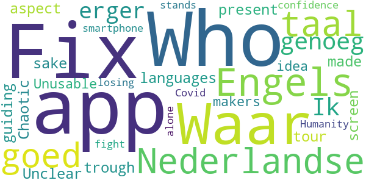

> Waar om moet het in het Engels, is de Nederlandse taal goed genoeg . Ik erger mij er aan .  :date: __2020-04-21 11:28:14__

> Fix the languages, fix the screen aspect, present a guiding tour trough the app, Who made this for f* sake  :date: __2020-03-30 18:15:19__

> Unclear. Chaotic. Unusable. The makers have no idea what an app for a smartphone should be. WHO is losing my confidence. Humanity stands alone in the fight against Covid-19.  :date: __2020-03-28 17:14:47__

# Credits

This project makes use of the following main third-party projects:
* Androguard: [https://github.com/androguard/androguard](https://github.com/androguard/androguard)
* Androwarn: [https://github.com/maaaaz/androwarn](https://github.com/maaaaz/androwarn)
* google_play_scraper: [https://github.com/JoMingyu/google-play-scraper](https://github.com/JoMingyu/google-play-scraper)
* whois: [https://github.com/DannyCork/python-whois](https://github.com/DannyCork/python-whois)
* BeautifulSoup: [https://www.crummy.com/software/BeautifulSoup](https://www.crummy.com/software/BeautifulSoup)

Other open-source projects used in this project include: 

- androguard==3.3.5
- appnope==0.1.0
- asn1crypto==1.3.0
- backcall==0.1.0
- beautifulsoup4==4.9.0
- bs4==0.0.1
- certifi==2020.4.5.1
- cffi==1.14.0
- chardet==3.0.4
- click==7.1.2
- colorama==0.4.3
- cryptography==2.9.2
- cycler==0.10.0
- decorator==4.4.2
- future==0.18.2
- google-play-scraper==0.0.2.3
- idna==2.9
- ipython==7.13.0
- ipython-genutils==0.2.0
- jedi==0.17.0
- Jinja2==2.11.2
- joblib==0.14.1
- kiwisolver==1.2.0
- lxml==4.5.0
- MarkupSafe==1.1.1
- matplotlib==3.2.1
- networkx==2.4
- nltk==3.5
- numpy==1.18.3
- parso==0.7.0
- pexpect==4.8.0
- pickleshare==0.7.5
- Pillow==7.1.2
- play-scraper==0.6.0
- prompt-toolkit==3.0.5
- ptyprocess==0.6.0
- pycountry==19.8.18
- pycparser==2.20
- pydot==1.4.1
- Pygments==2.6.1
- pyOpenSSL==19.1.0
- pyparsing==2.4.7
- python-dateutil==2.8.1
- regex==2020.4.4
- requests==2.23.0
- requests-futures==1.0.0
- six==1.14.0
- soupsieve==2.0
- tld==0.12.1
- tqdm==4.45.0
- traitlets==4.3.3
- urllib3==1.25.9
- wcwidth==0.1.9
- wordcloud==1.7.0

