# COVID-related Android apps in the Netherlands

Author: `Ivano Malavolta` (ivanomalavolta@gmail.com)

Created at: `2021/2/6`

Report generated by the [covid-apps-observer](http://github.com/covid-apps-observer) project, version 0.1

# Table of contents 

- [Background](#background)
    * [Data sources and analyses](#data-sources-and-analyses)
        * [App metadata](#app-metadata)
        * [Requested permissions](#requested-permissions)
        * [Mentioned servers](#mentioned_servers)
        * [Security analysis](#security_analysis)
        * [User ratings and reviews](#user-ratings-and-reviews)
    * [Disclaimer](#disclaimer)
- [RIVM LCI-richtlijnen](#rivm-lci-richtlijnen)
- [WHO Info](#who-info)
- [Luscii](#luscii)
- [OpenWHO: Knowledge for Health Emergencies](#openwho-knowledge-for-health-emergencies)
- [CoronaMelder](#coronamelder)
- [COVID Radar](#covid-radar)
- [COVapp](#covapp)

- [Credits](#credits)

# How to read this report

This report has been generated by the [covid-apps-observer](http://github.com/covid-apps-observer) project. The project automatically analyzes the apps by extracting information which is already publicly available either on the web or in the apps binary files. 

Our analysis covers the following apps:
| | |
|-------------------------|-------------------------| 
|  | RIVM LCI-richtlijnen
|  | WHO Info
|  | Luscii
|  | OpenWHO: Knowledge for Health Emergencies
|  | CoronaMelder
| 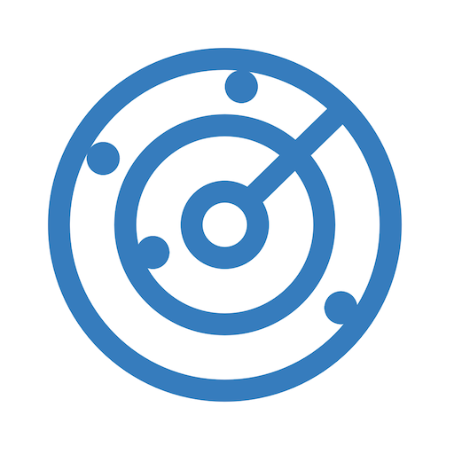 | COVID Radar
|  | COVapp

The details of our analysis are presented in the remainder of this report.

For independent verification, the raw data and the source code of the project is publicly available in its GitHub repository [http://github.com/covid-apps-observer](http://github.com/covid-apps-observer) and its source code has been thoroughly commented in order to provide all the details about how the information provided in this report has been extracted. 

Any feedback, questions, and improvements about the project are very welcome, feel free to create an issue or pull request directly in its GitHub repository: [http://github.com/covid-apps-observer](http://github.com/covid-apps-observer).

## Data sources and analyses

The analysis of each app is structured around five main dimensions: 
* App metadata  
* Requested permissions
* Mentioned servers
* Androwarn analysis
* User ratings and reviews

In the following we describe the data sources and analysis performed for each dimension.

### App metadata

App metadata includes an overview of the main information about the app (for example, its name, releases, privacy policy, etc.), contact information of the development team, and the various Android versions supported by the app. This information is extracted from two main data sources:
* _Google Play store_: we automatically mined the web page of the Google Play store showing the basic information about the app and we parsed it in order to extract information about the app and development team 
* _Android Manifest file_: in our analysis we decompiled the binary file of the app (it is similar to a Zip archive but it contains the code of the app instead of normal files) and we extracted information about the supported Android versions, as it has been listed by its development team.

The extracted app metadata feeds the _App overview_, _Development team_, and _Android support_ sections of this report.
We make use of the [google-play-scraper](https://github.com/JoMingyu/google-play-scraper) tool for extracting the raw data related to this dimension of the project.

### Requested permissions

The Android operating system has a permission model which allows users to grant access to potentially privacy-related information. Every Android app has to explictly declare the permissions it needs to properly function in the Android Manifest file.  

In this report we also show the protection level of each permission, which is a key information for understanding how the requested permissions related to the user's privacy. We carefully analyzed the [official Android documentation (v. 29)](https://developer.android.com/reference/android/Manifest.permission), and it resulted that a permission requested by an Android app can belong to the following protection levels:
* **Dangerous**: higher-risk permissions that would give a requesting app access to private user data or control over the device that can negatively impact the user. Because this type of permission introduces potential risk, the system usually does not automatically grant it to the requesting app. For example, any dangerous permissions requested by an app may be displayed to the user and require confirmation before proceeding.
* **Normal**: this is the default and most common level in Android; normal permissions are lower-risk and give access to isolated app-level features, with minimal risk to other apps, the system, or the user. 
* **Signature**: permissions granted only if the requesting app is signed with the same certificate as the app that declared the permission
* **Appop**: old permission level, a reminiscence of the App Ops tool that Google introduced in Android 4.3.
* **Development**: optional permissions which can be granted to development-oriented apps.
* **Privileged**: permissions who give higher power to mobile apps w.r.t. other apps, such as binding to incoming calls, interacting via bluetooth with other devices without user interaction, etc.
* **Preinstalled**: reserved only for preinstalled apps
* **Installer**: allow the holder to start the permission usage screen for an app
* **RetailDemo**: permissions related to devices used in demonstrations in shops.
* **Pre23**: permissions automatically granted to apps targeting devices running pre-6.0 Android.
* **Upcoming**: permissions which will be released in the next version of the Android platform. 
* **Deprecated**: permissions belonging to old releases of the Android platform, they should not be used by developers since they will not be supported in the near future.
* **Not for use by third-party applications**: permissions which can be requested only by apps developed by Google.
* **Undefined**: this protection level is not documented by Google.

The permissions dimension of this project is based on the [Androguard](https://github.com/androguard/androguard) static analysis tool.

### Mentioned servers

We decompiled each app in order to look for all possible mentions of remote URLs. The mentioned URLs can refer to remote servers the the app is using for either sending or receiving information, web addresses for directing the user to an information website, and so on. 

:warning: It is important to note that this analysis is not meant to be complete and it is very prone to obfuscation. The servers reported here are simply _mentioned_ somewhere in the code of the app and are meant to just give an indication about the "hooks" of the app towards external resources. For example, for an Android app it is normal to contact Google services in order to send/receive push notifications, or to contact the servers of analytics services for having real-time diagnostics about crashes of the app or bugs.

This part of the analysis is based on the [Androguard](https://github.com/androguard/androguard) static analysis tool for identfying the raw URLs mentioned in the app; then, the information about each mentioned server is collected by performing a _whois_ lookup on the first-level domain present in the URL.

### Security analysis

This dimension is based on the [Androwarn](https://github.com/maaaaz/androwarn) structural and data flow analysis of Android bytecode. Androwarn is developed by the University of Lyon/INSA (France) and it has been used in several academic studies. According to its documentation, Androwarn targets the following categories of potential security issues:
* **Telephony identifiers exfiltration**: IMEI, IMSI, MCC, MNC, LAC, CID, operator's name, etc.
* **Device settings exfiltration**: software version, usage statistics, system settings, logs, etc.
* **Geolocation information leakage**: GPS/WiFi geolocation, etc.
* **Connection interfaces information exfiltration**: WiFi credentials, Bluetooth MAC adress, etc.
* **Telephony services abuse**: premium SMS sending, phone call composition, etc.
* **Audio/video flow interception**: call recording, video capture, etc.
* **Remote connection establishment**: socket open call, Bluetooth pairing, APN settings edit, etc.
* **PIM data leakage**: contacts, calendar, SMS, mails, clipboard, etc.
* **External memory operations**: file access on SD card, etc.
* **PIM data modification**: add/delete contacts, calendar events, etc.
* **Arbitrary code execution**: native code using JNI, UNIX command, privilege escalation, etc.
* **Denial of Service**: event notification deactivation, file deletion, process killing, virtual keyboard disable, terminal shutdown/reboot, etc.

Note: We do not consider this data point in the current version of our analyzers since it is too verbose for our purposes.

:warning: It is important to note that Androwarn is a static analysis tool, and as such it performs a variety of heuristics and approximations in its analyses. Said that, the results shown in this report are meant to provide an indication of _potential_ security issues and should be by no means treated as complete and correct.   

### User ratings and reviews

For this dimension we turn again to the web interface of the Google Play store. Firstly, we automatically mine summary statistics about user ratings from the web page of the app under analysis; then, we automatically download the newest 1000 reviews of the app under analysis. For each level of rating (5 stars, 4 stars, , etc., 1 star) we show:
- a word cloud presenting the main terms used by end users in their reviews in the Google Play store
- the last 10 reviews provided by app users in the Google Play store. 

This purposefully simple analysis is meant to help both future users and the development team of the app in understanding what are the main positive and negative points of the app under analysis.

We make use of the [google-play-scraper](https://github.com/JoMingyu/google-play-scraper) tool for extracting the raw data related to this dimension of the project.

## Disclaimer 

This report has been produced independently of any parties and its only objective is to help anybody in better understanding how COVID-related apps work in practice (and compare to each other). The results of this report are limited to the specific version of the software used for running the analyses and on the various heuristics implemented in there. In other words, the results of the analyzers may differ depending on the time and modalities in which they are executed. We do not guarantee that the results of the analyses and the corresponding contents of this report are fully complete or correct. The analysis software is licensed under the [MIT License](https://github.com/iivanoo/covid-apps-observer/blob/master/LICENSE).

# RIVM LCI-richtlijnen
App version ``1.27.4``

Analyzed with [covid-apps-observer](http://github.com/covid-apps-observer) project, version ``0.1``

## App overview
| | |
|-------------------------|-------------------------| 
| **Name**&nbsp;&nbsp;&nbsp;&nbsp;&nbsp;&nbsp;&nbsp;&nbsp;&nbsp;&nbsp;&nbsp;&nbsp;&nbsp;&nbsp;&nbsp;&nbsp;&nbsp;&nbsp;&nbsp;&nbsp;&nbsp;&nbsp;&nbsp;&nbsp;&nbsp;&nbsp;&nbsp;&nbsp;&nbsp;&nbsp;&nbsp;&nbsp;&nbsp;&nbsp;&nbsp;&nbsp;&nbsp;&nbsp;&nbsp;&nbsp;  | RIVM LCI-richtlijnen |
| **Unique identifier** | nl.rivm.lciapp |
| **Link to Google Play** | [https://play.google.com/store/apps/details?id=nl.rivm.lciapp](https://play.google.com/store/apps/details?id=nl.rivm.lciapp) |
| **Summary**  | Actuele richtlijnen en draaiboeken infectieziektebestrijding |
| **Privacy policy** | [http://www.rivm.nl/Toegankelijkheid/Privacy](http://www.rivm.nl/Toegankelijkheid/Privacy) |
| **Latest version** | 1.27.4 |
| **Last update** | 2020-07-23 09:22:10 |
| **Recent changes** | Bugfixes |
| **Installs**  | 50.000+ |
| **Category** | Medisch |
| **First release** | 16 jul. 2017 |
| **Size**  | 21M |
| **Supported Android version**  | 4.2 en hoger |

### Description
> In de RIVM-app LCI-richtlijnen vindt u -actuele richtlijnen en draaiboeken infectieziektebestrijding. Daarnaast vindt u ook verpleegkundige stappenplannen (VSI’s), publieksinformatie en quizzen in de app.
 De primaire doelgroep van de richtlijnen zijn de artsen en verpleegkundigen infectieziektebestrijding van de afdelingen infectieziektebestrijding van GGD'en, maar ook andere (para)medici. 
 De app bevat de volgende onderdelen:
 -Richtlijnen en Draaiboeken
 -Publieksinformatie
 -Stappenplannen en Quizzen
 -Favorieten, hier kunt u een persoonlijke favorietenlijst maken
 -Meldingsplichtige ziekten
 -Nieuwsover de LCI-richtlijnen
 -Over LCI, informatie over de Landelijke Coördinatie Infectieziektebestrijding
 -Contact
 De informatie in deze app is identiek aan de informatie op www.rivm.nl/richtlijnen.
 Heeft u vragen of tips over de app LCI-richtlijnen? Mail deze dan naar: LCI@rivm.nl

### User interface
The developers of the app provide the following screenshots in the Google play store.
| | | |
|:-------------------------:|:-------------------------:|:-------------------------:|
 |   |   |   | 
 |  

## Development team
In the following we report the main information provided by the development team in the Google play store.

| | |
|-------------------------|-------------------------|
| **Developer**  | rivm-app |
| **Website**  | [http://rivm.nl](http://rivm.nl) |
| **Email** | ict-servicedesk@rivm.nl |
| **Physical address**  | - |
| **Other developed apps**  | [https://play.google.com/store/apps/developer?id=rivm-app](https://play.google.com/store/apps/developer?id=rivm-app) |

## Android support

| | |
|-------------------------|-------------------------|
| **Declared target Android version**  | Pie, version 9 (API level 28) |
| **Effective target Android version**  | Pie, version 9 (API level 28) |
| **Minimum supported Android version**  | Jelly Bean, version 4.2.x (API level 17) |
| **Maximum target Android version**  | - |

The larger the difference between the minimum and maximum supported Android versions, the better. A larger difference means a wider audience. For example, old phones have a very low Android version, so a high minimum supported Android version means that the app cannot be used by users with old phones, thus leading to accessibility problems. 

## Requested permissions

In the following we report the complete list of the permissions requested by the app. 

| **Permission** | **Protection level** | **Description** | 
|-------------------------|-------------------------|-------------------------|
 **android.permission CALL_PHONE** | :warning:**Dangerous** | Allows an application to initiate a phone call without going through the Dialer user interface for the user to confirm the call. 
 **android.permission INTERNET** | Normal | Allows applications to open network sockets. 
 **android.permission READ_PHONE_STATE** | :warning:**Dangerous** | Allows read only access to phone state, including the phone number of the device, current cellular network information, the status of any ongoing calls, and a list of any PhoneAccounts registered on the device. 

## Mentioned servers

| **Server** | **Registrant** | **Registrant country** | **Creation date** | 
|-------------------------|-------------------------|-------------------------|-------------------------|
 | google.com | Google LLC | :us: US | 1997-09-15 04:00:00 |
 | googleapis.com | Google LLC | :us: US | 2005-01-25 17:52:26 |
 | rivm.nl | - | - | 1990-07-17 00:00:00 |
 | dtnr.nl | - | - | 2016-06-07 00:00:00 |
 | apple.com | Apple Inc. | :us: US | 1987-02-19 05:00:00 |
 | xmlpull.org | WhoisGuard, Inc. | PA | 2001-11-26 20:33:08 |

## Security analysis 

Below we report the main security warnings raised by our execution of the [Androwarn](https://github.com/maaaaz/androwarn) security analysis tool.

**Telephony identifiers leakage**
> - This application reads the device phone type value 
> - This application reads the numeric name (MCC+MNC) of current registered operator 
> - This application reads the operator name 

**Connection interfaces exfiltration**
> - This application reads details about the currently active data network 
> - This application tries to find out if the currently active data network is metered 

**Telephony services abuse**
> - This application makes phone calls 

**Code execution**
> - This application loads a native library: 'jniPdfium' 
> - This application loads a native library: 'modft2' 
> - This application loads a native library: 'modpdfium' 
> - This application loads a native library: 'modpng' 

## User ratings and reviews

Below we provide information about how end users are reacting to the app in terms of ratings and reviews in the Google Play store.

### Ratings

The RIVM LCI-richtlijnen app has been installed by more than **50000** times. At this time, **134** rated the app and its average score is **3.21**. Below we show the distribution of the ratings across the usual star-based rating of Google Play

:star::star::star::star::star:: 54

:star::star::star::star:: 18

:star::star::star:: 8

:star::star:: 4

:star:: 48

### Reviews 

#### 5-star reviews

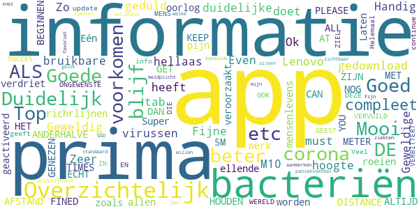

> Geweldig  :date: __2021-01-17 14:06:47__

> Ok  :date: __2020-11-29 11:21:35__

> Goede informatie over corona-virussen  :date: __2020-10-30 20:16:41__

> A must have  :date: __2020-08-25 15:48:08__

> Mooi  :date: __2020-08-24 19:11:01__

> Fijne, duidelijke app  :date: __2020-08-21 05:05:08__

> Even geduld, dat de app alles gedownload heeft.  :date: __2020-08-19 10:31:44__

> Zo blijf je op de hoogte  :date: __2020-07-17 09:57:06__

> Zeer goede en bruikbare informatie  :date: __2020-06-18 17:15:10__

> Geweldige app die het hellaas op een Lenovo tab M10 niet doet..  :date: __2020-06-12 17:52:50__

#### 4-star reviews

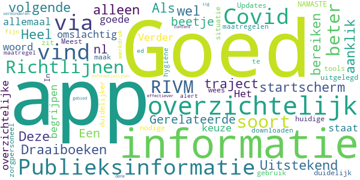

> Goed  :date: __2020-08-18 19:37:40__

> Uitstekend  :date: __2020-08-12 11:36:26__

> wel goed  :date: __2020-07-08 23:18:55__

> Heel overzichtelijk.  :date: __2020-07-05 11:03:44__

> Als ik op het startscherm "Publieksinformatie" aanklik vind ik niets over Covid-19. Deze informatie kan ik alleen bereiken via het volgende traject: "Richtlijnen & Draaiboeken - COVID 19 - Gerelateerde informatie - Publieksinformatie RIVM.nl". Een beetje omslachtig. Verder vind ik het een goede en overzichtelijke app.  :date: __2020-06-30 13:02:17__

> Het staat allemaal in goed te begrijpen woord keuze en duidelijk/overzichtelijk Goed uitgelegd  :date: __2020-06-29 09:06:30__

> Meest nodige informatie zit in deze app 🙏 NAMASTE  :date: __2020-04-09 09:55:23__

> In 2020 en de huidige situatie; maak beter gebruik van dit soort tools- wees duidelijker, m.n voor zorgpersoneel! Updates RIVM maatregelen/richtlijnen(te downloaden hygiëne maatregel ed) door n alert via een soort app als deze zal fijn zijn en zal werkdruk bij informatielijnen verminderen. iig content dat er iets is aan app op dit gebied, maar kan denk ik dus beter/effectiever  :date: __2020-03-12 23:47:14__

#### 3-star reviews

> Ziet er goed uit En is informatief  :date: __2020-11-15 08:59:24__

> Graag nog de app aanpassen aan corona crisis.  :date: __2020-04-13 11:55:30__

> Het is niet handig dat de tekst van de richtlijnen onder aparte kopjes staan. Snel overzicht krijgen lukt zo niet. Ga toch elke keer weer naar de website.  :date: __2018-04-15 12:23:09__

#### 2-star reviews

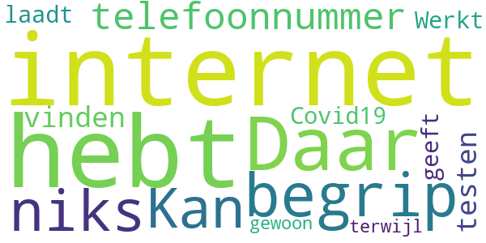

> Daar begrip j p ik niks van  :date: __2021-02-01 14:50:23__

> Kan niet eens een telefoonnummer vinden voor het testen van Covid19  :date: __2020-06-30 22:42:16__

> Werkt niet laadt niet geeft aan dat je geen internet hebt terwijl je gewoon internet hebt  :date: __2020-04-21 20:48:56__

#### 1-star reviews

> Reee  :date: __2020-10-26 16:31:39__

> In geen 1000 jaar dat ik dit gedrocht download , zijn jullie helemaal van de ratten besnuffeld .  :date: __2020-10-21 21:24:33__

> Of deze app wel of niet goed is moeilijk om te bepalen. De bewoording is voor experts binnen hun eigen vakgebied misschien te begrijpen, ook al begrijpen mijn zussen die dierenarts en chemicoloog zijn en ikzelf dit niet. Graag zou ik deze app zien zodat deze voor iedereen vanaf 7 jaar begrijpbaar is met overal een link naar extra medisch/technische uitleg voor wetenschappers.  :date: __2020-10-15 22:17:26__

> Downloaden lukt niet.  :date: __2020-10-11 12:21:38__

> Loopt vast in Griekenland. In dit geval Kreta. De app downloaden gaat simpel. Bij het ophalen van gegevens gaat het mis.  :date: __2020-08-17 09:27:25__

> werkt niet geen verbinding met netwerk geeft app aan kijk uit email is ook niet actief oplichters actief  :date: __2020-07-29 18:46:26__

> Werkt niet. Blijft zeggen dat er geen internet verbinding is. Dit is echter wel het geval.  :date: __2020-07-26 20:42:54__

> werkt niet. zoals alles bij de overheid.  :date: __2020-07-25 17:03:50__

> Op dit moment lopen jullie achter met bijwerken van de app! De laatste update is van 21-07-2020 en het is nu Zaterdag 25-07-2020. Voor het belang van jullie gebruikers, GRAAG NIEUWE UPDATES  :date: __2020-07-25 16:54:29__

> Is hij nu al uit de lucht? Krijg de melding dat er geen internet is. Meteen weer verwijderd  :date: __2020-07-25 00:00:59__

# WHO Info
App version ``4.1.0``

Analyzed with [covid-apps-observer](http://github.com/covid-apps-observer) project, version ``0.1``

## App overview
| | |
|-------------------------|-------------------------| 
| **Name**&nbsp;&nbsp;&nbsp;&nbsp;&nbsp;&nbsp;&nbsp;&nbsp;&nbsp;&nbsp;&nbsp;&nbsp;&nbsp;&nbsp;&nbsp;&nbsp;&nbsp;&nbsp;&nbsp;&nbsp;&nbsp;&nbsp;&nbsp;&nbsp;&nbsp;&nbsp;&nbsp;&nbsp;&nbsp;&nbsp;&nbsp;&nbsp;&nbsp;&nbsp;&nbsp;&nbsp;&nbsp;&nbsp;&nbsp;&nbsp;  | WHO Info |
| **Unique identifier** | org.who.infoapp |
| **Link to Google Play** | [https://play.google.com/store/apps/details?id=org.who.infoapp](https://play.google.com/store/apps/details?id=org.who.infoapp) |
| **Summary**  | De officiële informatie-app van de Wereldgezondheidsorganisatie. |
| **Privacy policy** | [https://www.who.int/about/who-we-are/privacy-policy](https://www.who.int/about/who-we-are/privacy-policy) |
| **Latest version** | 4.1.0 |
| **Last update** | 2021-01-14 10:10:28 |
| **Recent changes** | This release introduces &quot;Health Topics&quot;. &quot;Health Topics&quot; provide additional information about favourite health topics. |
| **Installs**  | 500.000+ |
| **Category** | Nieuws en tijdschriften |
| **First release** | 13 apr. 2020 |
| **Size**  | 12M |
| **Supported Android version**  | 4.2 en hoger |

### Description
> Have the latest health information at your fingertips with the official World Health Organization Information App. This app displays the latest news, events, features and breaking updates on outbreaks. 
  
 WHO works worldwide to promote health, keep the world safe, and serve the vulnerable. 
 Our goal is to ensure that a billion more people have universal health coverage, to protect a billion more people from health emergencies, and provide a further billion people with better health and well-being.

### User interface
The developers of the app provide the following screenshots in the Google play store.
| | | |
|:-------------------------:|:-------------------------:|:-------------------------:|
 |   |   |   | 
 |   |   |   | 
 |   |   |   | 
 |   |   |   | 
 |   |   |   | 
 |   |   |   | 
 |   |   |   | 
 |   |   |   | 

## Development team
In the following we report the main information provided by the development team in the Google play store.

| | |
|-------------------------|-------------------------|
| **Developer**  | World Health Organization |
| **Website**  | [https://www.who.int/](https://www.who.int/) |
| **Email** | dcx@who.int |
| **Physical address**  | [Avenu Appia 20 1211 Geneva Switzerland](https://www.google.com/maps/search/Avenu%20Appia%2020%201211%20Geneva%20Switzerland) (Google Maps) |
| **Other developed apps**  | [https://play.google.com/store/apps/developer?id=World+Health+Organization](https://play.google.com/store/apps/developer?id=World+Health+Organization) |

## Android support

| | |
|-------------------------|-------------------------|
| **Declared target Android version**  | - |
| **Effective target Android version**  | - |
| **Minimum supported Android version**  | Jelly Bean, version 4.2.x (API level 17) |
| **Maximum target Android version**  | - |

The larger the difference between the minimum and maximum supported Android versions, the better. A larger difference means a wider audience. For example, old phones have a very low Android version, so a high minimum supported Android version means that the app cannot be used by users with old phones, thus leading to accessibility problems. 

## Requested permissions

In the following we report the complete list of the permissions requested by the app. 

| **Permission** | **Protection level** | **Description** | 
|-------------------------|-------------------------|-------------------------|
 **android.permission ACCESS_NETWORK_STATE** | Normal | Allows applications to access information about networks. 
 **android.permission INTERNET** | Normal | Allows applications to open network sockets. 
 **android.permission READ_CALENDAR** | :warning:**Dangerous** | Allows an application to read the user's calendar data. 
 **android.permission READ_EXTERNAL_STORAGE** | :warning:**Dangerous** | Allows an application to read from external storage. 
 **android.permission WAKE_LOCK** | Normal | Allows using PowerManager WakeLocks to keep processor from sleeping or screen from dimming. 
 **android.permission WRITE_CALENDAR** | :warning:**Dangerous** | Allows an application to write the user's calendar data. 
 **android.permission WRITE_EXTERNAL_STORAGE** | :warning:**Dangerous** | Allows an application to write to external storage. 
 **com.google.android.c2dm.permission RECEIVE** | - | - 
 **com.google.android.finsky.permission BIND_GET_INSTALL_REFERRER_SERVICE** | - | - 

## Mentioned servers

| **Server** | **Registrant** | **Registrant country** | **Creation date** | 
|-------------------------|-------------------------|-------------------------|-------------------------|
 | adobe.com | Adobe Inc. | :us: US | 1986-11-17 05:00:00 |
 | googlesyndication.com | Google LLC | :us: US | 2003-01-21 06:17:24 |
 | google.com | Google LLC | :us: US | 1997-09-15 04:00:00 |
 | app-measurement.com | Google LLC | :us: US | 2015-06-19 20:13:31 |
 | googleapis.com | Google LLC | :us: US | 2005-01-25 17:52:26 |
 | googleadservices.com | Google LLC | :us: US | 2003-06-19 16:34:53 |

## Security analysis 

Below we report the main security warnings raised by our execution of the [Androwarn](https://github.com/maaaaz/androwarn) security analysis tool.

**Connection interfaces exfiltration**
> - This application reads details about the currently active data network 
> - This application tries to find out if the currently active data network is metered 

**Suspicious connection establishment**
> - This application opens a Socket and connects it to the remote address 'Lfi/iki/elonen/NanoHTTPD$ResponseException;' on the 'N/A' port  
> - This application opens a Socket and connects it to the remote address 'NanoHttpd Shutdown' on the 'N/A' port  

**Code execution**
> - This application loads a native library: 'NativeScript' 
> - This application executes a UNIX command containing this argument: '2' 

## User ratings and reviews

Below we provide information about how end users are reacting to the app in terms of ratings and reviews in the Google Play store.

### Ratings

The WHO Info app has been installed by more than **500000** times. At this time, **1114** rated the app and its average score is **4.108108**. Below we show the distribution of the ratings across the usual star-based rating of Google Play

:star::star::star::star::star:: 754

:star::star::star::star:: 90

:star::star::star:: 60

:star::star:: 60

:star:: 150

### Reviews 

#### 5-star reviews

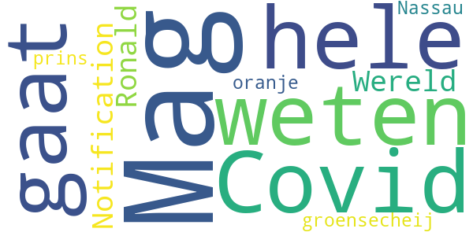

> Mag ik weten hoe het gaat met Covid 19 op de hele Wereld?  :date: __2020-12-11 02:46:57__

> Notification  :date: __2020-09-13 04:06:35__

> Ronald groensecheij prins van oranje Nassau  :date: __2020-04-19 03:15:56__

#### 4-star reviews

No recent reviews available with 4 stars.

#### 3-star reviews

No recent reviews available with 3 stars.

#### 2-star reviews

No recent reviews available with 2 stars.

#### 1-star reviews

No recent reviews available with 1 stars.

# Luscii
App version ``5.5.1``

Analyzed with [covid-apps-observer](http://github.com/covid-apps-observer) project, version ``0.1``

## App overview
| | |
|-------------------------|-------------------------| 
| **Name**&nbsp;&nbsp;&nbsp;&nbsp;&nbsp;&nbsp;&nbsp;&nbsp;&nbsp;&nbsp;&nbsp;&nbsp;&nbsp;&nbsp;&nbsp;&nbsp;&nbsp;&nbsp;&nbsp;&nbsp;&nbsp;&nbsp;&nbsp;&nbsp;&nbsp;&nbsp;&nbsp;&nbsp;&nbsp;&nbsp;&nbsp;&nbsp;&nbsp;&nbsp;&nbsp;&nbsp;&nbsp;&nbsp;&nbsp;&nbsp;  | Luscii |
| **Unique identifier** | nl.focuscura.beeldbelapp |
| **Link to Google Play** | [https://play.google.com/store/apps/details?id=nl.focuscura.beeldbelapp](https://play.google.com/store/apps/details?id=nl.focuscura.beeldbelapp) |
| **Summary**  | Welkom bij Luscii, de slimste gezondheidsapp voor zorg thuis of onderweg. |
| **Privacy policy** | [https://luscii.com/privacy-policy/](https://luscii.com/privacy-policy/) |
| **Latest version** | 5.5.1 |
| **Last update** | 2021-02-05 15:10:08 |
| **Recent changes** | In deze update bug fix voor inlogprobleem. |
| **Installs**  | 100.000+ |
| **Category** | Medisch |
| **First release** | 8 mrt. 2016 |
| **Size**  | 139M |
| **Supported Android version**  | 7.0 en hoger |

### Description
> Wat is Luscii?
 Luscii maakt moderne zorg mogelijk. Met de Luscii app is het op voorschrift van een zorgorganisatie mogelijk om:
 - lichaamswaarden/symptomen in de gaten te houden
 - gerichte educatie te ontvangen over (omgaan met) ziekte of gezondheidsrisico's
 - op afstand te communiceren met zorgverleners
 Hoe werkt het?
 - Mensen dienen zich eerst aan te melden. Dat gaat normaal via een ziekenhuis. In geval van inzet in de corona crisis is aanmelden ook mogelijk op www.olvgcoronacheck.nl
 - De app vraagt dagelijks een aantal lichaamswaarden of symptomen door te geven. Deze zijn gebaseerd op een door zorgverleners voor de gebruiker ingesteld programma. Ook is er educatie in de app en contact op afstand.
 - Achter de app staat een medisch team paraat. Dit beoordeelt de antwoorden die gebruikers geven in de app (ondersteund door de techniek van de app). Als er een medische reden is om contact op te nemen, doen zij dat binnen 24 uur. Dat kan telefonisch of via een bericht. Ook is contact via beeldbellen mogelijk (let op: deze functie gebruikt OLVG corona check nog niet).
 OLVG corona check
 - Door de uitbraak van het coronavirus neemt de zorgvraag toe. Ziekenhuizen bereiden zich hierop voor door nieuwe middelen in te zetten naast de reguliere zorg. Samen met het Amsterdamse ziekenhuis OLVG heeft Luscii daarom de Luscii app hiervoor geschikt gemaakt. We noemen dit OLVG corona check.
 - OLVG corona check is bedoeld om grote groepen mensen met klachten die mogelijk door het coronavirus wordt veroorzaakt op afstand te kunnen begeleiden. Een medisch team beoordeelt de metingen die binnenkomen via de app van Luscii die voor OLVG corona check wordt gebruikt. OLVG corona check is gratis.
 - OLVG corona check is gestart voor mensen in de regio Groot Amsterdam. Er wordt gestreefd de regio's waarin de app beschikbaar is, uit te breiden. Meer informatie is te vinden op www.olvgcoronacheck.nl.
 Medisch hulpmiddel en gegevensverwerking
 Luscii is een CE gemarkeerd medisch hulpmiddel. Gegevens worden verwerkt volgens de Algemene Verordering Gegevensbescherming (AVG). Het privacyreglement en gebruikersvoorwaarden zijn te vinden op www.luscii.com. Luscii is gevestigd in Amsterdam, Nederland.

### User interface
The developers of the app provide the following screenshots in the Google play store.
| | | |
|:-------------------------:|:-------------------------:|:-------------------------:|
 |   |   |   | 
 |   |   |   | 
 |   |  

## Development team
In the following we report the main information provided by the development team in the Google play store.

| | |
|-------------------------|-------------------------|
| **Developer**  | Luscii Healthtech |
| **Website**  | [http://www.luscii.com](http://www.luscii.com) |
| **Email** | support@luscii.com |
| **Physical address**  | [Spuistraat 114A 1012 VA Amsterdam The Netherlands](https://www.google.com/maps/search/Spuistraat%20114A%201012%20VA%20Amsterdam%20The%20Netherlands) (Google Maps) |
| **Other developed apps**  | [https://play.google.com/store/apps/developer?id=Luscii+Healthtech](https://play.google.com/store/apps/developer?id=Luscii+Healthtech) |

## Android support

| | |
|-------------------------|-------------------------|
| **Declared target Android version**  | Android10, version 10 (API level 29) |
| **Effective target Android version**  | Android10, version 10 (API level 29) |
| **Minimum supported Android version**  | Nougat, version 7.0 (API level 24) |
| **Maximum target Android version**  | - |

The larger the difference between the minimum and maximum supported Android versions, the better. A larger difference means a wider audience. For example, old phones have a very low Android version, so a high minimum supported Android version means that the app cannot be used by users with old phones, thus leading to accessibility problems. 

## Requested permissions

In the following we report the complete list of the permissions requested by the app. 

| **Permission** | **Protection level** | **Description** | 
|-------------------------|-------------------------|-------------------------|
 **android.permission ACCESS_COARSE_LOCATION** | :warning:**Dangerous** | Allows an app to access approximate location. 
 **android.permission ACCESS_FINE_LOCATION** | :warning:**Dangerous** | Allows an app to access precise location. 
 **android.permission ACCESS_NETWORK_STATE** | Normal | Allows applications to access information about networks. 
 **android.permission ACCESS_NOTIFICATION_POLICY** | Normal | Marker permission for applications that wish to access notification policy. 
 **android.permission ACCESS_WIFI_STATE** | Normal | Allows applications to access information about Wi-Fi networks. 
 **android.permission ACTIVITY_RECOGNITION** | :warning:**Dangerous** | Allows an application to recognize physical activity. 
 **android.permission BLUETOOTH** | Normal | Allows applications to connect to paired bluetooth devices. 
 **android.permission BLUETOOTH_ADMIN** | Normal | Allows applications to discover and pair bluetooth devices. 
 **android.permission CAMERA** | :warning:**Dangerous** | Required to be able to access the camera device. 
 **android.permission DISABLE_KEYGUARD** | Normal | Allows applications to disable the keyguard if it is not secure. 
 **android.permission FOREGROUND_SERVICE** | Normal | Allows a regular application to use Service.startForeground. 
 **android.permission INTERNET** | Normal | Allows applications to open network sockets. 
 **android.permission MODIFY_AUDIO_SETTINGS** | Normal | Allows an application to modify global audio settings. 
 **android.permission RECEIVE_BOOT_COMPLETED** | Normal | Allows an application to receive the Intent.ACTION_BOOT_COMPLETED that is broadcast after the system finishes booting. 
 **android.permission RECORD_AUDIO** | :warning:**Dangerous** | Allows an application to record audio. 
 **android.permission USE_FULL_SCREEN_INTENT** | Normal | Required for apps targeting Build.VERSION_CODES.Q that want to use notification full screen intents. 
 **android.permission VIBRATE** | Normal | Allows access to the vibrator. 
 **android.permission WAKE_LOCK** | Normal | Allows using PowerManager WakeLocks to keep processor from sleeping or screen from dimming. 
 **android.permission WRITE_EXTERNAL_STORAGE** | :warning:**Dangerous** | Allows an application to write to external storage. 
 **com.android.alarm.permission SET_ALARM** | Normal | Allows an application to broadcast an Intent to set an alarm for the user. 
 **com.google.android.c2dm.permission RECEIVE** | - | - 
 **com.google.android.finsky.permission BIND_GET_INSTALL_REFERRER_SERVICE** | - | - 
 **nl.focuscura.beeldbelapp.permission C2D_MESSAGE** | - | - 

## Mentioned servers

| **Server** | **Registrant** | **Registrant country** | **Creation date** | 
|-------------------------|-------------------------|-------------------------|-------------------------|
 | google.com | Google LLC | :us: US | 1997-09-15 04:00:00 |
 | xml.org | OASIS Open | :us: US | 1997-02-03 05:00:00 |
 | xmlpull.org | WhoisGuard, Inc. | PA | 2001-11-26 20:33:08 |
 | w3.org | W3C | :us: US | 1994-07-06 04:00:00 |
 | googlesyndication.com | Google LLC | :us: US | 2003-01-21 06:17:24 |
 | googleapis.com | Google LLC | :us: US | 2005-01-25 17:52:26 |
 | google-analytics.com | Google LLC | :us: US | 2005-07-18 19:24:32 |
 | googleadservices.com | Google LLC | :us: US | 2003-06-19 16:34:53 |
 | app-measurement.com | Google LLC | :us: US | 2015-06-19 20:13:31 |
 | googleapis.com | Google LLC | :us: US | 2005-01-25 17:52:26 |
 | sematext.com | REDACTED FOR PRIVACY | :us: US | 2007-05-01 03:03:08 |
 | launchdarkly.com | Catamorphic Co. | :us: US | 2014-07-15 17:17:52 |
 | apple.com | Apple Inc. | :us: US | 1987-02-19 05:00:00 |
 | aomedia.org | Contact Privacy Inc. Customer 1243324949 | :canada: CA | 2015-08-24 14:07:31 |
 | crashlytics.com | Google LLC | :us: US | 2011-01-21 15:30:40 |
 | amazonaws.com | Amazon.com, Inc. | :us: US | 2005-08-18 02:10:45 |
 | amazonaws.com | Amazon.com, Inc. | :us: US | 2005-08-18 02:10:45 |
 | branch.io | Branch | :us: US | 2011-11-10 13:52:13 |
 | focuscura.com | REDACTED FOR PRIVACY | :netherlands: NL | 2010-05-20 14:02:28 |
 | luscii.com | Registrant State/Province: Provincie Gelderland | :netherlands: NL | 2018-06-21 09:46:19 |

## Security analysis 

Below we report the main security warnings raised by our execution of the [Androwarn](https://github.com/maaaaz/androwarn) security analysis tool.

**Telephony identifiers leakage**
> - This application reads the ISO country code equivalent of the current registered operator's MCC (Mobile Country Code) 
> - This application reads the numeric name (MCC+MNC) of current registered operator 
> - This application reads the operator name 

**Connection interfaces exfiltration**
> - This application reads details about the currently active data network 
> - This application tries to find out if the currently active data network is metered 

**Suspicious connection establishment**
> - This application opens a Socket and connects it to the remote address '; port is out of range' on the 'N/A' port  
> - This application opens a Socket and connects it to the remote address 'Lb/d/b/a/a;->V(Ljava/lang/String;)Ljava/lang/StringBuilder;' on the 'N/A' port  
> - This application opens a Socket and connects it to the remote address 'Ljava/lang/StringBuilder;->toString()Ljava/lang/String;' on the 'N/A' port  
> - This application opens a Socket and connects it to the remote address 'Ljava/net/Proxy;->type()Ljava/net/Proxy$Type;' on the 'N/A' port  
> - This application opens a Socket and connects it to the remote address 'Method sendUrgentData() is not supported.' on the 'N/A' port  
> - This application opens a Socket and connects it to the remote address 'Method setHandshakeTimeout() is not supported.' on the 'N/A' port  
> - This application opens a Socket and connects it to the remote address 'Method setOOBInline() is not supported.' on the 'N/A' port  
> - This application opens a Socket and connects it to the remote address 'Method setSoWriteTimeout() is not supported.' on the 'N/A' port  
> - This application opens a Socket and connects it to the remote address 'No route to  ' on the 'N/A' port  
> - This application opens a Socket and connects it to the remote address 'Socket closed' on the 'N/A' port  
> - This application opens a Socket and connects it to the remote address 'Socket is closed' on the 'N/A' port  
> - This application opens a Socket and connects it to the remote address 'Socket is closed.' on the 'N/A' port  
> - This application opens a Socket and connects it to the remote address 'Socket is not connected.' on the 'N/A' port  
> - This application opens a Socket and connects it to the remote address 'socket is closed' on the 'N/A' port  
> - This application opens a Socket and connects it to the remote address 'timeout' on the 'N/A' port  

**Code execution**
> - This application loads a native library 
> - This application loads a native library: 'ECGOffline' 
> - This application loads a native library: 'ECGOnline' 
> - This application loads a native library: 'VidyoClient' 
> - This application loads a native library: 'conscrypt_gmscore_jni' 
> - This application loads a native library: 'conscrypt_jni' 
> - This application loads a native library: 'heartbeat-android' 
> - This application loads a native library: 'heartbeat-lib' 
> - This application loads a native library: 'iHealth' 
> - This application loads a native library: 'sodiumjni' 

## User ratings and reviews

Below we provide information about how end users are reacting to the app in terms of ratings and reviews in the Google Play store.

### Ratings

The Luscii app has been installed by more than **100000** times. At this time, **7859** rated the app and its average score is **4.3312263**. Below we show the distribution of the ratings across the usual star-based rating of Google Play

:star::star::star::star::star:: 4502

:star::star::star::star:: 2355

:star::star::star:: 457

:star::star:: 198

:star:: 347

### Reviews 

#### 5-star reviews

> Heel handig!!  :date: __2021-02-06 10:46:37__

> Heel gemakkelijk en overzichtelijk.  :date: __2021-02-06 09:21:58__

> Byzonder goede ervaring met deze app.  :date: __2021-02-05 20:52:09__

> Fijne app en doet wat het moet doen ... top  :date: __2021-02-05 12:38:02__

> Voel geruststeld en hou mij allert naar mijzelf, door mijn gezondheid op deze wijze in de gaten te houden. Ben mantelzorgster en zorg voor mijn vriend, van wie zijn dochter nu niet kan komen 5 februari 2021, Helaas werkt de Luscil app niet meer. Hoop dat dit opgelost kan worden.  :date: __2021-02-05 09:25:08__

> Storingsmelding na update werd goed afgehandeld. App werkt simpel en intuïtief.  :date: __2021-02-01 10:42:37__

> Vind het heel fijn dat je na dat je uit het ziekenhuis bent gekomen in de gaten word gehouden en veel afvies krijgt over wat je allemaal moet doen voor een goed herstel .  :date: __2021-02-01 10:06:52__

> Makkelijk en simpel. Geeft je toch het gevoel dat je in de gaten wordt gehouden en een goede keuze maakt als het fout gaat.  :date: __2021-01-29 13:18:59__

> Prima, snel en duidelijk  :date: __2021-01-29 09:43:43__

> Weet niet of het helpt voor anderen  :date: __2021-01-28 11:33:24__

#### 4-star reviews

> Prettige app. Helaas sinds 2 dg niet te gebruiken omdat hij niet functioneert. Niets helpt on dit te herstellen.  :date: __2021-02-05 17:58:22__

> Niet alles komt overeen, zo heb ik meerdere wondjes en 1 lekt nog de pleister. Ook bij beoordelen pijnscore. Met medicatie is dit te doen. Waarom staat er niet gebruikt nog medicatie erbij.  :date: __2021-01-30 11:20:20__

> Ben tevreden  :date: __2021-01-24 19:23:20__

> Prima.  :date: __2021-01-23 08:39:45__

> Goed hulpmiddel. Goed contact met begeleiding omtrent gegevens die ingevoerd moeten worden om de check van de voortgang van de gezondheid te bewerkstelligen.  :date: __2021-01-22 09:20:52__

> Werkt prima  :date: __2021-01-12 12:19:47__

> Duidelijk en helder  :date: __2021-01-10 09:47:47__

> Goede app. Cijfers haperen soms  :date: __2021-01-06 14:52:27__

> Zorg op afstand werkt goed  :date: __2020-12-29 09:31:24__

> Zo kun je zien hoe hoog je bloeddruk is  :date: __2020-12-27 12:28:20__

#### 3-star reviews

> Ter info...vanaf nu werkt de app niet bij mij. Ook na de update niets...start niet op.Heb de app verwijderd en opnieuw gedownload. Nu krijg ik melding dat hij niet werkt op Android. Hoop op een berichtje van u.  :date: __2021-02-06 10:41:29__

> Het zou handig zijn om alle antwoorden in 1x te verzenden inplaats van per antwoord. Dit probleem is inmiddels opgelost.  :date: __2021-02-06 06:06:54__

> Werk mee aan Corona onderzoek voor Feyenoord maar sinds 3 weken werkt het niet meer, krijg wel meldingen maar app leeg !!!  :date: __2021-01-29 13:14:13__

> Kan na Lang gebruik niet meer openen. De display was leeg. App. Verwijderd en opnieuw geinstalleerd. Mijn gebruikersnaam/email wordt niet herkent.  :date: __2021-01-15 20:20:13__

> Het is goed bedacht. Maar ik heb android versie 11 (oneplus 8) en die antwoorden waarbij je moet scrollen voor de cijfers doen het niet. Dus die had ik niet ingevuld. Kreeg vandaag het verzoek om de rest ook in te vullen maar kan daar dan geen bericht op terugsturen dat het bij mij niet werkt 🙈. Het idee is goed maar de uitvoering werkt niet op mijn mobiel. Ik heb dit probleem niet met andere apps met scrollsystemen.  :date: __2020-12-23 10:35:49__

> Mis een stukje waar je opmerkingen kan plaatsen mbt de lichamelijke klacht  :date: __2020-12-23 08:44:01__

> Geluid van beeldbellen is erg zacht, ook niet harder te krijgen. Jammer dat de app zo verschilt van de luscii Apple app, daar kon ik net iets meer mee (bv plaats nemen in de digitale wachtkamer)  :date: __2020-11-27 07:28:24__

> Goed en overzichtelijk toe te passen  :date: __2020-11-18 08:36:02__

> Het scrollen is wat moeilijk komt misschien door mijn toestel is al 2 jaar oud. Geen conract via Bluetooth. En wat weinig opties bij kortademigheid.  :date: __2020-11-09 09:01:59__

> Jammer dat je geen feedback kan geven, op de reactie die je krijg.  :date: __2020-11-06 14:25:46__

#### 2-star reviews

> Zou soms iets uitgebreider willen kunnen antwoorden. Gaat helaas niet tegelijkertijd:pijncheck en coronacheck  :date: __2021-02-05 10:01:48__

> Na update van gisteren werkt de app niet meer. Jammer  :date: __2021-02-04 23:54:21__

> Ik vond deze app handig. Maar tot voor kort kon ik deze niet meer openen. De app herkende mijn inloggegevens niet meer. Jammer.  :date: __2021-02-03 08:05:34__

> Na update is er geen bluetooth verbinding meer. Blijft om batterijen vragen en wil niet verder. Contact met helpdesk problematisch, veels te druk en terugbellen pas volgende dag.  :date: __2021-01-16 18:53:17__

> Kan in de app geen gegevens meer versturen. Iedere keer foutmelding. Dit sinds 2 weken. Voor die tijd fijne app.  :date: __2020-10-10 09:58:10__

> Probleem met mijn slokdarm, daar prakaseer ik erg over.  :date: __2020-10-08 01:17:14__

> Bij de vragen ook iedere keer de toelichting  :date: __2020-09-25 13:18:12__

> Op dagen dat ik klachten ervaar zegt de app geen klachten. Nu ben ik al 2 dagen klachtenvrij en zegt ie milde klachten. Beetje vreemd. Wel handig systeem maar de berichten slaan nergens op.  :date: __2020-09-18 11:30:36__

> Sinds de laatste update heb ik ineens covid klachten terwijl de waardes gewoon goed zijn....  :date: __2020-09-12 18:58:41__

> Oude gegevens niet meer te raadplegen  :date: __2020-08-21 11:46:47__

#### 1-star reviews

> Werkt na de update niet weer Na opnieuw geïnstalleerd werkt inloggen niet meer  :date: __2021-02-05 08:45:13__

> Kan hem sinds vandaag niet meer openen geheel blanco zeer teleurgesteld was er zo blij mee  :date: __2021-02-04 23:41:18__

> App werkt niet. Vraagt email of gebruikersnaam, maar kan geen gegevens voor account invullen. Kom dus niet verder. Waardeloos  :date: __2021-02-01 21:25:58__

> Waardeloos dat ik de app niet meer kan openen. Alles lijkt gewist na de update. Ik deed mee met een onderzoek van het CWZ ziekenhuis Nijmegen ivm Covid19. En bedankt.  :date: __2021-01-26 01:03:20__

> Ik krijg het niet voor elkaar, op een bepaald moment kan ik via Google artikelen kopen en dat wil ik niet. Maak het eenvoudiger s.v.p.  :date: __2021-01-25 13:14:29__

> 😋  :date: __2021-01-15 13:06:27__

> Snap de nut niet  :date: __2021-01-06 08:15:19__

> Zeer goed  :date: __2020-12-17 10:52:12__

> Het kost me veel moeite  :date: __2020-12-03 10:36:27__

> Werkt niet meer account is beëindigd betje raar maar ja jammer werkte goed dus nu niet meer dus 1 ster  :date: __2020-11-21 19:09:35__

# OpenWHO: Knowledge for Health Emergencies
App version ``3.7``

Analyzed with [covid-apps-observer](http://github.com/covid-apps-observer) project, version ``0.1``

## App overview
| | |
|-------------------------|-------------------------| 
| **Name**&nbsp;&nbsp;&nbsp;&nbsp;&nbsp;&nbsp;&nbsp;&nbsp;&nbsp;&nbsp;&nbsp;&nbsp;&nbsp;&nbsp;&nbsp;&nbsp;&nbsp;&nbsp;&nbsp;&nbsp;&nbsp;&nbsp;&nbsp;&nbsp;&nbsp;&nbsp;&nbsp;&nbsp;&nbsp;&nbsp;&nbsp;&nbsp;&nbsp;&nbsp;&nbsp;&nbsp;&nbsp;&nbsp;&nbsp;&nbsp;  | OpenWHO: Knowledge for Health Emergencies |
| **Unique identifier** | de.xikolo.openwho |
| **Link to Google Play** | [https://play.google.com/store/apps/details?id=de.xikolo.openwho](https://play.google.com/store/apps/details?id=de.xikolo.openwho) |
| **Summary**  | Levensreddende kennis voor eerstelijnshulpverleners in noodsituaties op gezondheidsgebied. |
| **Privacy policy** | [https://openwho.org/pages/privacy](https://openwho.org/pages/privacy) |
| **Latest version** | 3.7 |
| **Last update** | 2020-11-23 13:57:15 |
| **Recent changes** | - Bug fixes and performance improvements |
| **Installs**  | 1.000.000+ |
| **Category** | Onderwijs |
| **First release** | 17 mei 2017 |
| **Size**  | 18M |
| **Supported Android version**  | 5.0 en hoger |

### Description
> OpenWHO is the World Health Organization's (WHO) interactive knowledge-transfer platform offering online courses to improve the response to health emergencies. OpenWHO enables the Organization and its key partners to transfer life-saving knowledge to large numbers of frontline responders.
 With OpenWHO, you have the flexibility to learn at your convenience. Watch the short video lectures and test your knowledge with self-tests when and where you like. The course forum and the collaboration space allow you to get in touch with other participants and experts around the world.
  
 Designed primarily for health care workers, frontline responders, and decision-makers, the app is also a source of information for those affected by disease outbreaks and health emergencies, or for those with a general interest in WHO's work in health emergencies.
  
 It features 6 channels:
 - The <b>Outbreak</b> channel addresses the management of infectious diseases and provides life-saving, scientific information.
 - The <b>Ready for Response</b> channel helps prepare personnel who are training for deployment to work in disease outbreaks and health emergencies.
 - The <b>Get Social</b> channel focuses on social science-based interventions and helps to communicate with affected communities.
 - The <b>Preparing for Pandemics</b> channel brings together courses on various aspects of preparedness, including surveillance, public health measures and risk communication during a pandemic.
 - The <b>COVID-19</b> channel provides learning resources in WHO's 6 official languages (Arabic, Chinese, English, French, Russian and Spanish) for health professionals, decision-makers and the public for the outbreak of coronavirus disease (COVID-19).
 - The <b>COVID-19 National Languages</b> channel provides the same learning resources as the COVID-19 channel but in national languages, such as Indonesian, Japanese and Portuguese. 
  
 OpenWHO courses are available in many languages, including WHO's 6 official languages. 
  
 Download the app now, and join the OpenWHO community.
 This app is developed in cooperation between the Hasso Plattner Institute and the WHO. The learning content is provided exclusively by the WHO.

### User interface
The developers of the app provide the following screenshots in the Google play store.
| | | |
|:-------------------------:|:-------------------------:|:-------------------------:|
 |   |   |   | 
 |   |   |   | 

## Development team
In the following we report the main information provided by the development team in the Google play store.

| | |
|-------------------------|-------------------------|
| **Developer**  | HPI Knowledge Engineering Team |
| **Website**  | [https://openwho.org/](https://openwho.org/) |
| **Email** | openwho-support@hpi.de |
| **Physical address**  | [Prof.-Dr.-Helmert-Str.2-3 14482 Potsdam](https://www.google.com/maps/search/Prof.-Dr.-Helmert-Str.2-3%2014482%20Potsdam) (Google Maps) |
| **Other developed apps**  | [https://play.google.com/store/apps/developer?id=7185448023325736337](https://play.google.com/store/apps/developer?id=7185448023325736337) |

## Android support

| | |
|-------------------------|-------------------------|
| **Declared target Android version**  | - |
| **Effective target Android version**  | - |
| **Minimum supported Android version**  | Lollipop, version 5.0 (API level 21) |
| **Maximum target Android version**  | - |

The larger the difference between the minimum and maximum supported Android versions, the better. A larger difference means a wider audience. For example, old phones have a very low Android version, so a high minimum supported Android version means that the app cannot be used by users with old phones, thus leading to accessibility problems. 

## Requested permissions

In the following we report the complete list of the permissions requested by the app. 

| **Permission** | **Protection level** | **Description** | 
|-------------------------|-------------------------|-------------------------|
 **android.permission ACCESS_NETWORK_STATE** | Normal | Allows applications to access information about networks. 
 **android.permission ACCESS_WIFI_STATE** | Normal | Allows applications to access information about Wi-Fi networks. 
 **android.permission DOWNLOAD_WITHOUT_NOTIFICATION** | - | - 
 **android.permission FOREGROUND_SERVICE** | Normal | Allows a regular application to use Service.startForeground. 
 **android.permission INTERNET** | Normal | Allows applications to open network sockets. 
 **android.permission RECEIVE_BOOT_COMPLETED** | Normal | Allows an application to receive the Intent.ACTION_BOOT_COMPLETED that is broadcast after the system finishes booting. 
 **android.permission WAKE_LOCK** | Normal | Allows using PowerManager WakeLocks to keep processor from sleeping or screen from dimming. 
 **android.permission WRITE_EXTERNAL_STORAGE** | :warning:**Dangerous** | Allows an application to write to external storage. 
 **com.google.android.c2dm.permission RECEIVE** | - | - 
 **com.google.android.finsky.permission BIND_GET_INSTALL_REFERRER_SERVICE** | - | - 

## Mentioned servers

| **Server** | **Registrant** | **Registrant country** | **Creation date** | 
|-------------------------|-------------------------|-------------------------|-------------------------|
 | googlesyndication.com | Google LLC | :us: US | 2003-01-21 06:17:24 |
 | google.com | Google LLC | :us: US | 1997-09-15 04:00:00 |
 | apple.com | Apple Inc. | :us: US | 1987-02-19 05:00:00 |
 | aomedia.org | Contact Privacy Inc. Customer 1243324949 | :canada: CA | 2015-08-24 14:07:31 |
 | dashif.org | VTM Group | :us: US | 2012-04-27 13:02:46 |
 | app-measurement.com | Google LLC | :us: US | 2015-06-19 20:13:31 |
 | w3.org | W3C | :us: US | 1994-07-06 04:00:00 |
 | googleapis.com | Google LLC | :us: US | 2005-01-25 17:52:26 |
 | psdev.de | - | - | - |
 | xmlpull.org | WhoisGuard, Inc. | PA | 2001-11-26 20:33:08 |
 | crashlytics.com | Google LLC | :us: US | 2011-01-21 15:30:40 |
 | apache.org | The Apache Software Foundation | :us: US | 1995-04-11 04:00:00 |
 | opensource.org | Open Source Initiative | :us: US | 1998-02-11 05:00:00 |
 | creativecommons.org | Creative Commons Corporation | :canada: CA | 2001-01-15 16:51:44 |
 | eclipse.org | Eclipse.org Foundation, Inc. | :canada: CA | 1997-04-14 04:00:00 |
 | gnu.org | Free Software Foundation | :us: US | 1995-11-24 05:00:00 |
 | mozilla.org | Mozilla Corporation | :us: US | 1998-01-24 05:00:00 |
 | googleadservices.com | Google LLC | :us: US | 2003-06-19 16:34:53 |

## Security analysis 

Below we report the main security warnings raised by our execution of the [Androwarn](https://github.com/maaaaz/androwarn) security analysis tool.

**Telephony identifiers leakage**
> - This application reads the ISO country code equivalent of the current registered operator's MCC (Mobile Country Code) 
> - This application reads the MCC+MNC of the provider of the SIM 

**Connection interfaces exfiltration**
> - This application reads details about the currently active data network 
> - This application tries to find out if the currently active data network is metered 

**Suspicious connection establishment**
> - This application opens a Socket and connects it to the remote address ' returned no addresses for  ; port is out of range' on the 'N/A' port  
> - This application opens a Socket and connects it to the remote address '' on the 'N/A' port  
> - This application opens a Socket and connects it to the remote address 'Ljava/lang/StringBuilder;->toString()Ljava/lang/String;' on the 'N/A' port  
> - This application opens a Socket and connects it to the remote address 'Ljava/net/Proxy;->type()Ljava/net/Proxy$Type;' on the 'N/A' port  
> - This application opens a Socket and connects it to the remote address 'timeout' on the 'N/A' port  

**Code execution**
> - This application loads a native library 

## User ratings and reviews

Below we provide information about how end users are reacting to the app in terms of ratings and reviews in the Google Play store.

### Ratings

The OpenWHO: Knowledge for Health Emergencies app has been installed by more than **1000000** times. At this time, **3403** rated the app and its average score is **4.2647057**. Below we show the distribution of the ratings across the usual star-based rating of Google Play

:star::star::star::star::star:: 2403

:star::star::star::star:: 370

:star::star::star:: 130

:star::star:: 130

:star:: 370

### Reviews 

#### 5-star reviews

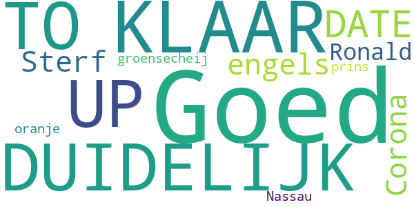

> KLAAR,DUIDELIJK,UP TO DATE!  :date: __2020-09-29 11:42:07__

> Goed maar in het engels  :date: __2020-09-18 23:22:22__

> Sterf Corona!  :date: __2020-09-18 19:10:33__

> Ronald groensecheij prins van oranje Nassau  :date: __2020-04-20 15:59:15__

> Goed  :date: __2020-03-22 12:10:06__

#### 4-star reviews

> Oke  :date: __2020-10-17 08:51:29__

#### 3-star reviews

> Tja weet het nog niet echt lijkt me beetje vaag  :date: __2020-06-14 19:44:44__

#### 2-star reviews

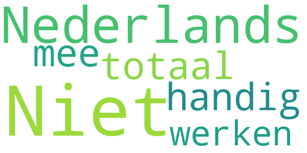

> Niet Nederlands?  :date: __2020-05-29 19:42:03__

> Niet in Nederlands is totaal niet handig ook niet om mee te werken  :date: __2020-03-27 17:35:23__

#### 1-star reviews

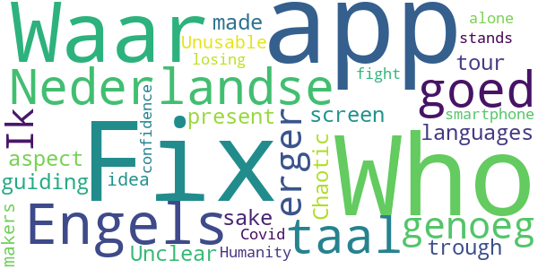

> Waar om moet het in het Engels, is de Nederlandse taal goed genoeg . Ik erger mij er aan .  :date: __2020-04-21 11:28:14__

> Fix the languages, fix the screen aspect, present a guiding tour trough the app, Who made this for f* sake  :date: __2020-03-30 18:15:19__

> Unclear. Chaotic. Unusable. The makers have no idea what an app for a smartphone should be. WHO is losing my confidence. Humanity stands alone in the fight against Covid-19.  :date: __2020-03-28 17:14:47__

# CoronaMelder
App version ``1.2.2``

Analyzed with [covid-apps-observer](http://github.com/covid-apps-observer) project, version ``0.1``

## App overview
| | |
|-------------------------|-------------------------| 
| **Name**&nbsp;&nbsp;&nbsp;&nbsp;&nbsp;&nbsp;&nbsp;&nbsp;&nbsp;&nbsp;&nbsp;&nbsp;&nbsp;&nbsp;&nbsp;&nbsp;&nbsp;&nbsp;&nbsp;&nbsp;&nbsp;&nbsp;&nbsp;&nbsp;&nbsp;&nbsp;&nbsp;&nbsp;&nbsp;&nbsp;&nbsp;&nbsp;&nbsp;&nbsp;&nbsp;&nbsp;&nbsp;&nbsp;&nbsp;&nbsp;  | CoronaMelder |
| **Unique identifier** | nl.rijksoverheid.en |
| **Link to Google Play** | [https://play.google.com/store/apps/details?id=nl.rijksoverheid.en](https://play.google.com/store/apps/details?id=nl.rijksoverheid.en) |
| **Summary**  | Help de verspreiding van het coronavirus in Nederland te stoppen |
| **Privacy policy** | [https://coronamelder.nl/nl/privacy](https://coronamelder.nl/nl/privacy) |
| **Latest version** | 1.2.2 |
| **Last update** | 2021-01-27 12:33:49 |
| **Recent changes** | Dank je wel voor het gebruiken van CoronaMelder. Je helpt daarmee corona in Nederland te stoppen. Deze update bevat de functie om de app te pauzeren. Pauzeer de app alleen in situaties waarin je telefoon dicht bij telefoons van anderen komt, maar er geen kans op besmetting is. |
| **Installs**  | 1.000.000+ |
| **Category** | Medisch |
| **First release** | 10 aug. 2020 |
| **Size**  | 7,1M |
| **Supported Android version**  | 6.0 en hoger |

### Description
> CoronaMelder is de officiële corona notificatie-app van Nederland, ontwikkeld onder het toezicht van het Ministerie van Volksgezondheid, Welzijn en Sport. De app is een digitaal hulpmiddel bij het bron- en contactonderzoek door de GGD. 
 De app waarschuwt je nadat je in de buurt bent geweest van iemand met corona. Zo kun je jezelf en de mensen in je omgeving beschermen. En kunnen we samen het aantal besmettingen in Nederland zo laag mogelijk houden. Het gebruik van de app is vrijwillig. Niemand mag controleren of jij de app op je telefoon hebt. Maar hoe meer mensen de app gebruiken, hoe beter deze werkt. 
 Bij de ontwikkeling van deze app is rekening gehouden met toegankelijkheid, zie voor meer informatie onze toegankelijkheidsverklaring.
 Hoe werkt de app?
 # Je geeft alleen toegang tot je bluetoothgegevens
 CoronaMelder ziet via bluetooth wanneer je in de buurt bent van andere mensen met de app. De app gebruikt geen persoons- of locatiegegevens. De app weet dus niet wie je bent, waar je was en wie je hebt ontmoet.
 # Je krijgt een melding nadat je extra kans op besmetting hebt gelopen
 De app stuurt een melding als je minstens 15 minuten in de buurt bent geweest van iemand die later corona blijkt te hebben. Deze persoon moet ook de app gebruiken.
 # Je kunt anderen waarschuwen als je zelf besmet blijkt te zijn
 Ben je getest door de GGD en blijk je corona te hebben? Dan kun je samen met de GGD via de app een melding sturen naar de mensen bij wie je in de buurt bent geweest - in de periode dat je besmettelijk was. In deze melding staat alleen wanneer ze in de buurt zijn geweest van een besmet persoon. Niet wie of waar dit was.
 Hoe gaat de app met je gegevens om?
 • Je hoeft geen persoonsgegevens zoals je e-mailadres of naam in te voeren.
 • Als je iemand tegenkomt wisselen jullie telefoons via bluetooth willekeurige codes uit. Zo meet de app de duur en de afstand van het contact. In de codes staat niets over wie jullie zijn en waar jullie zijn geweest. 
 • De codes die je via bluetooth uitwisselt worden alleen op je telefoon bewaard en na 14 dagen verwijderd.
 • Gebruikers van de app zijn niet terug te vinden door de makers van de app, de overheid of andere gebruikers.

### User interface
The developers of the app provide the following screenshots in the Google play store.
| | | |
|:-------------------------:|:-------------------------:|:-------------------------:|
 |   |   |   | 
 |   |   |   | 

## Development team
In the following we report the main information provided by the development team in the Google play store.

| | |
|-------------------------|-------------------------|
| **Developer**  | Rijksoverheid |
| **Website**  | [https://coronamelder.nl/](https://coronamelder.nl/) |
| **Email** | helpdesk@coronamelder.nl |
| **Physical address**  | - |
| **Other developed apps**  | [https://play.google.com/store/apps/developer?id=Rijksoverheid](https://play.google.com/store/apps/developer?id=Rijksoverheid) |

## Android support

| | |
|-------------------------|-------------------------|
| **Declared target Android version**  | - |
| **Effective target Android version**  | - |
| **Minimum supported Android version**  | Marshmallow, version 6.0 (API level 23) |
| **Maximum target Android version**  | - |

The larger the difference between the minimum and maximum supported Android versions, the better. A larger difference means a wider audience. For example, old phones have a very low Android version, so a high minimum supported Android version means that the app cannot be used by users with old phones, thus leading to accessibility problems. 

## Requested permissions

In the following we report the complete list of the permissions requested by the app. 

| **Permission** | **Protection level** | **Description** | 
|-------------------------|-------------------------|-------------------------|
 **android.permission ACCESS_NETWORK_STATE** | Normal | Allows applications to access information about networks. 
 **android.permission BLUETOOTH** | Normal | Allows applications to connect to paired bluetooth devices. 
 **android.permission FOREGROUND_SERVICE** | Normal | Allows a regular application to use Service.startForeground. 
 **android.permission INTERNET** | Normal | Allows applications to open network sockets. 
 **android.permission RECEIVE_BOOT_COMPLETED** | Normal | Allows an application to receive the Intent.ACTION_BOOT_COMPLETED that is broadcast after the system finishes booting. 
 **android.permission REQUEST_IGNORE_BATTERY_OPTIMIZATIONS** | Normal | Permission an application must hold in order to use Settings.ACTION_REQUEST_IGNORE_BATTERY_OPTIMIZATIONS. 
 **android.permission WAKE_LOCK** | Normal | Allows using PowerManager WakeLocks to keep processor from sleeping or screen from dimming. 

## Mentioned servers

| **Server** | **Registrant** | **Registrant country** | **Creation date** | 
|-------------------------|-------------------------|-------------------------|-------------------------|
 | google.com | Google LLC | :us: US | 1997-09-15 04:00:00 |
 | coronamelder-dist.nl | - | - | 2020-07-20 00:00:00 |
 | coronamelder-api.nl | - | - | 2020-07-22 00:00:00 |
 | android.com | Google LLC | :us: US | 1997-06-23 04:00:00 |

## Security analysis 

Below we report the main security warnings raised by our execution of the [Androwarn](https://github.com/maaaaz/androwarn) security analysis tool.

**Connection interfaces exfiltration**
> - This application reads details about the currently active data network 
> - This application tries to find out if the currently active data network is metered 

**Telephony services abuse**
> - This application makes phone calls 

**Suspicious connection establishment**
> - This application opens a Socket and connects it to the remote address '; port is out of range' on the 'N/A' port  
> - This application opens a Socket and connects it to the remote address 'Ljava/net/Proxy;->type()Ljava/net/Proxy$Type;' on the 'N/A' port  
> - This application opens a Socket and connects it to the remote address 'Ln/b/a/a/a;->G(Ljava/lang/String;)Ljava/lang/StringBuilder;' on the 'N/A' port  
> - This application opens a Socket and connects it to the remote address 'timeout' on the 'N/A' port  

## User ratings and reviews

Below we provide information about how end users are reacting to the app in terms of ratings and reviews in the Google Play store.

### Ratings

The CoronaMelder app has been installed by more than **1000000** times. At this time, **7218** rated the app and its average score is **3.0555556**. Below we show the distribution of the ratings across the usual star-based rating of Google Play

:star::star::star::star::star:: 2543

:star::star::star::star:: 861

:star::star::star:: 645

:star::star:: 792

:star:: 2377

### Reviews 

#### 5-star reviews

> P.s Bleutooth & CoronaMelder Zoeken ook steeds naar andere Apparaten met Bleutooth. Gevolg Lege accu.❗ -‐--------------------- De meeste gebruikers luisteren muziek in de Trein / Bus. Etc. Dan staat de Smartphone in de ( Slaapmodus ) zodat je niet gestoord wordt omdat je dan naar de muziek luisterd.❗ __Maar_dan_werkt_de____Coronamelder niet, in de slaapmodus❗💫❗  :date: __2021-02-03 22:35:22__

> gewoon goed zonder meer  :date: __2021-02-02 19:53:07__

> De Update van 5 oktober 2020 laat de coronamelder steeds crashen op mijn mobiel hij doet niks meer chrashed meteen. Na de update van december 2020 werkt ie weer.👍 goed bezig. Laatste Update van januari 2021 laat coronamelder weer crashen.  :date: __2021-01-30 20:49:48__

> Ideale app, tot mijn verbazing maar 1 miljoen downloads. Dit zouden er veel meer moeten zijn voor een optimale werking! Geen batterij slurpende app en je heb er geen 'last' van dat hij op de achtergrond draait.  :date: __2021-01-30 10:08:22__

> Deze App is duidelijk  :date: __2021-01-29 16:14:14__

> Als je een 5.000mAh batterij hebt maak dat extra beetje vebruik door bluetooth ook niet veel uit :)  :date: __2021-01-29 00:58:53__

> Zeer belangrijk.  :date: __2021-01-29 00:50:31__

> Duidelijk en simpel, doet wat het moet en doet niet wat het niet mag. Hoe meer gebruikers hoe beter! Installeren dus!! Een beetje meer 'zekerheid' in deze tijden als heel NL deze app actief heeft. Fijn dat je ook kunt pauzeren als dat nodig is!  :date: __2021-01-28 21:25:45__

> Deze app werkt naar behoren en gebruikt je bluetooth functie om te scannen naar andere bluetooth telefoons, mijn ervaring is dat er geen verschil is in batterij verbruik in verloop van tijd. Je hebt er verder geen last van en de app draait op de achtergrond, dus waarom niet deze extra veiligheid van de overheid tegen het COVID-19 virus?  :date: __2021-01-28 17:52:45__

> Geen geluidmelding?  :date: __2021-01-27 11:48:40__

#### 4-star reviews

> Na vele pogingen via een omweg is het toch 🤞 gelukt om de app opnieuw te installeren  :date: __2021-02-05 12:22:01__

> In de eerste variant kon je zien hoeveel mensen om je heen waren gescanned. Nu zie je dat niet meer. Je hebt maar een vinkje dat de app actief is. Ik vond het eigenlijk heel fijn om te zien hoeveel mensen waren er gecheckt. Hoort het nu zo te zijn, zonder aantal gecheckte mensen maar alleen dat vinkje? Verder heb ik geen last van de app, hij werkt in de achtergrond, je krijgt misschien 1keer per week een notificatie over de status van de app en de batterij loopt niet sneller leeg. Top! 👍  :date: __2021-02-04 08:54:11__

> Vraagje: Gaat de coronamelder aangepast worden op de hogere besmettelijkheid van de Britse coronavariant? Hier heb ik Hugo de Jonge nog niets over horen zeggen in de persconferenties.  :date: __2021-02-02 19:32:52__

> Werk,t goed  :date: __2021-02-01 13:55:25__

> 👍🏻  :date: __2021-01-28 17:28:21__

> Werkt probleemloos, maar ook wat onzichtbaar. Zou leuk zijn om een beetje feedback te krijgen, bijvoorbeeld dat hij de afgelopen dag x andere coronamelder Apps heeft gezien.  :date: __2021-01-26 23:04:53__

> We moeten opletten met het covid virus en ons aan de regels houden  :date: __2021-01-24 11:46:17__

> Als je eenmaal begrijpt hoe het werkt is het een prima app. Helaas is hij een paar dagen geleden gestopt te checken met de server. Althans, het lijstje met log van de checks met de server is verdwenen. Ok, de toegang tot de lijst is alleen verplaatst. 🙄  :date: __2021-01-23 12:01:04__

> Nog geen melding gehad gelukkig. Maar meer reclame zou ik fijn vinden want eigenlijk moet iedereen de App downloaden.  :date: __2021-01-22 18:29:47__

> IK WEET HET, WANT IK HtuEB NU EEN APP WAARONDERui STAAT RINGTONE,MAAR HAD HEM ALTIJD AANSTAAN MAAR IK HEB NOOIT EEN ALARM GEKREGEN. (IK WEET DE REGELS).groet uit Leiden😉  :date: __2021-01-22 10:22:30__

#### 3-star reviews

> Negatief getest  :date: __2021-02-06 13:17:28__

> Vind het heel ingewikkeld.....  :date: __2021-02-04 01:05:53__

> Zondag kreeg ik via de app een melding over een contact met een besmet persoon op de woensdag ervoor. Gelukkig meldde de besmette persoon het vrijdag en ben ik gelijk in thuisquarantaine gegaan. Helaas heb ik in de tussentijd wel mijn kwetsbare ouders en collega's op het werk bezocht. Oftewel: ik vind dat de melding nogal laat kwam, op de 4e dag.  :date: __2021-02-01 18:13:49__

> Ik heb een vraag moet je 4G aan hebben als het moet werken in kan het offline?  :date: __2021-01-31 10:59:55__

> Is er geen ruik en test uit slag en mogelijk heden  :date: __2021-01-30 11:56:40__

> Op zich prima dat deze app er is. Maar hoe zit het met registratie als je een ziekenhuisbezoek hebt gebracht. In het ziekenhuis liggen corona patiënten, krijg je dan automatisch de melding dat je in de buurt van mensen met corona bent geweest? Ik twijfel dus onderga maandag een corona test nav deze melding die ik kreeg nadat ik eerder in de week in het ziekenhuis oa ben geweest.. Maar wellicht is deze onrust onnodig? Wie heeft ervaring hiermee.?  :date: __2021-01-29 19:28:54__

> Op de ene telefoon krijg ik een melding dat ik in de buurt van een besmet persoon ben geweest en op de andere niet terwijl ik de telefoons altijd bij me draag  :date: __2021-01-29 09:53:06__

> Zijn de gegevens die lekken via de GGD ook afkomstig van deze app ?? 🤔🤔🤔😠  :date: __2021-01-28 16:56:20__

> Mijn mobiele data staan de hele dag aan.toch krijg ik elke keer bij check van de app de melding dat er geen verbinding is. Ik tik dan op de balk weer verbinden en dan blijkt de app weer wel verbonden te zijn. Geeft toch geen goed gevoel af.  :date: __2021-01-26 23:32:16__

> Nauwelijks doorontwikkeling naar nieuwe en meer functies. En als er een update komt, wordt niet beschreven, wat er veranderd is. Waarom gebruikt men deze methodiek van informatievoorziening niet?  :date: __2021-01-25 11:16:45__

#### 2-star reviews

> Ik ben arts, zie inmiddels wekelijks wel een aantal zieke, bij de GGD positieve geteste coronapatienten, maar zelfs als ik de app op de achtergrond draaiend houd, heb ik nog NOOIT een melding ontvangen... En ik heb een nieuwe smartphone die nog vorig jaar pas uitgebrachts is met de nieuwste android versie erop  :date: __2021-02-04 12:41:20__

> Slechte app, gaat veel te veel uit van de eerlijke en goede wil van de gebruiker.  :date: __2021-02-03 17:37:16__

> In de app staat dat het bijna niet kan dat de bluetooth van een buurman jouw apparaat bereikt door een muur. Dit is toch gebeurt. Daarnaast vind ik het raar dat er geen tijdstip gemeld wordt over het moment, want dan kun je zelf nagaan of het mogelijk is dat je besmet bent. Zal wel met privacy te maken hebben, maar dit zou wel helpen.  :date: __2021-02-03 10:56:01__

> Hij valt voortdurend uit. Elke ochtend melding dat de app de afgelopen 24 uur niet werkte  :date: __2021-02-02 21:19:45__

> Ik werk in supermarkt. Hele week gewoon aan werk krijg ik zaterdagavond app je bent 5 dagen geleden in aanmerking gekomen die meer dan 15 minuten in je buurt was. Lekker op tijd dan zeg, heb hele week gewerkt, iedereen gewoon bij ons ook klanten. Lekker is dat dan. Melding is veel te laat. Moet direct melding hebben als iemand in buurt is niet 5 dagen later  :date: __2021-01-31 00:56:54__

> Blijkbaar werkt de app niet wand heb naast een persoon gezeten die carona had en hij is niet afgegaan ik weet het door dat die het zij dat hij het heeft gehad  :date: __2021-01-29 23:40:16__

> Na de update moet je de app opnieuw activeren lijkt het? Wordt niet gemeld.  :date: __2021-01-29 09:39:01__

> Ik snap de keuze van de party mode (pauze stand) niet helemaal. Wat is dan nog het praktisch nut van deze app als mensen hem op pauze kunnen zetten?  :date: __2021-01-29 02:01:04__

> Melding gehad dat ik 27-01 mogelijk met iemand langer dan 15 minuten un contact ben geweest die corona heeft. De enige die ik heb gezien is mijn moeder die totaal geen klachten heeft, maar ook de app niet! Verder met niemand in contact geweest gisteren. Buren zijn positief, maar daar totaal geen contact mee gehad gisteren, dus dit is erg misleidend allemaal!  :date: __2021-01-28 08:27:34__

> Was 2-12 (ochtend)gaan testen, kreeg 4-12 (avond) de uitslag, ben 6-12 pas gebeld door de ggd (avond) en kreeg toen pas de sleutel. De mensen die in mijn buurt zijn geweest op 30-11/1-12 en 2-12 hebben nooit een melding gekregen! (Heb dit uiteraard zelf wel gedaan via bericht/telefoon). Vraag me dus toch af wat het nut dan is van deze app. Ik twijfel hierdoor aan de betrouwbaarheid.  :date: __2021-01-27 19:09:32__

#### 1-star reviews

> Zinloos  :date: __2021-02-06 08:45:40__

> Men vragenlijst doet het al weken niet  :date: __2021-02-05 17:55:42__

> Iedere dag een melding dat hij geen verbinding kan maken. Op de site staat een korte uitleg die niet werkt. Na reactie: Natuurlijk heb ik bluetooth en internet aan. Andere apps hebben geen enkel probleem met de verbinding. De app is ook uitgezonderd van energiebesparing.  :date: __2021-02-05 15:35:39__

> Mijn man is vanaf 28 januari positief bevonden. Deze app staat doorlopend aan maar IK heb geen melding ontvangen dat ik in de buurt ben geweest van een besmet iemand. Ra ra hoe kan dit. Mijn man heeft de sleutel doorgegeven zodra bekend was dat hij positief was. En ook op de knop gedrukt.  :date: __2021-02-05 14:30:50__

> Ik ben 100% zeker langer dan 15 min in de buurt geweest van iemand met corona, hij is namelijk een huisgenoot van mij, maar heb geen melding gekregen. Deze huisgenoot is getest door de GGD en dus zou je verwachten dat wij een melding zouden krijgen maar nee dus  :date: __2021-02-05 13:41:51__

> Werkt voor geen meter  :date: __2021-02-05 11:04:28__

> Laat voortdurend bluetooth aan, ongewenst.  :date: __2021-02-04 22:26:07__

> Mijn vriendin en ik zijn gisteren de hele dag samen thuis geweest en hebben niemand gezien of gesproken. Toch krijgt zij zojuist een melding dat ze gisteren 15+ min in de buurt is geweest van iemand die besmet is en zich zou moeten testen. Hoe kan dit?  :date: __2021-02-04 14:31:48__

> Kut app  :date: __2021-02-03 23:23:10__

> Waardeloose app  :date: __2021-02-03 19:11:08__

# COVID Radar
App version ``1.1.2``

Analyzed with [covid-apps-observer](http://github.com/covid-apps-observer) project, version ``0.1``

## App overview
| | |
|-------------------------|-------------------------| 
| **Name**&nbsp;&nbsp;&nbsp;&nbsp;&nbsp;&nbsp;&nbsp;&nbsp;&nbsp;&nbsp;&nbsp;&nbsp;&nbsp;&nbsp;&nbsp;&nbsp;&nbsp;&nbsp;&nbsp;&nbsp;&nbsp;&nbsp;&nbsp;&nbsp;&nbsp;&nbsp;&nbsp;&nbsp;&nbsp;&nbsp;&nbsp;&nbsp;&nbsp;&nbsp;&nbsp;&nbsp;&nbsp;&nbsp;&nbsp;&nbsp;  | COVID Radar |
| **Unique identifier** | nl.lumc.covidradar |
| **Link to Google Play** | [https://play.google.com/store/apps/details?id=nl.lumc.covidradar](https://play.google.com/store/apps/details?id=nl.lumc.covidradar) |
| **Summary**  | LUMC verzamelt gegevens voor onderzoek voor het bestrijden van het coronavirus. |
| **Privacy policy** | [https://www.lumc.nl/12367/Deelnemers-wetenschappelijk-onderzoek/](https://www.lumc.nl/12367/Deelnemers-wetenschappelijk-onderzoek/) |
| **Latest version** | 1.1.2 |
| **Last update** | 2020-04-08 18:17:26 |
| **Recent changes** | Kleine verbeteringen naar aanleiding van uw feedback |
| **Installs**  | 50.000+ |
| **Category** | Medisch |
| **First release** | 27 mrt. 2020 |
| **Size**  | 5,5M |
| **Supported Android version**  | 6.0 en hoger |

### Description
> Met deze app verzamelen we gegevens van Nederlanders voor wetenschappelijk onderzoek naar het bestrijden van het coronavirus (COVID-19). We willen beter kunnen gaan voorspellen welke zorgbehoefte er in Nederland straks is: hoeveel corona-patiënten verwachten we waar en wanneer? 
 Dit is een app van het Leids Universitair Medisch Centrum (LUMC). Alle gegevens worden anoniem verwerkt. De geanonimiseerde gegevens worden veilig opgeslagen in Nederland. Lees hierover meer in de disclaimer. 
 In Nederland testen we beperkt of mensen het coronavirus hebben. We testen iemand alleen als hij/zij symptomen heeft en tot een kwetsbare doelgroep behoort. Hierdoor weten we niet precies hoeveel mensen in Nederland besmet zijn met het virus. 
 Door van zoveel mogelijk mensen in Nederland gegevens te verzamelen, kunnen we onderzoeken hoeveel mensen het coronavirus hebben (gehad) en waar zij in Nederland verblijven.
 Met deze gegevens proberen we de toekomstige zorgvraag te voorspellen: hoeveel coronapatiënten verwachten we waar en wanneer? 
 Uw bijdrage aan dit onderzoek is erg belangrijk om de behoefte aan zorg te kunnen voorspellen. 
 Help mee! Samen tegen het coronavirus in Nederland!
 Deze app is een initiatief van het Leids Universitair Medisch Centrum (LUMC), gesteund door het Landelijk Netwerk Acute Zorg (LNAZ).
 Installeer de app en deel regelmatig gegevens over uw fysieke gesteldheid en die van uw huisgenoten voor wetenschappelijk onderzoek. Stimuleer familie, vrienden, kennissen en collega’s om hetzelfde te doen. Samen tegen het coronavirus in Nederland!

### User interface
The developers of the app provide the following screenshots in the Google play store.
| | | |
|:-------------------------:|:-------------------------:|:-------------------------:|
 | 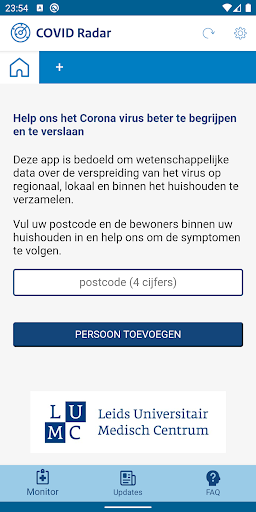  | 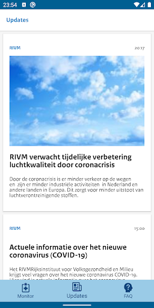  |   | 
 |   |   |   | 
 |   |   |   | 
 |  

## Development team
In the following we report the main information provided by the development team in the Google play store.

| | |
|-------------------------|-------------------------|
| **Developer**  | LUMC Leiden |
| **Website**  | [https://www.lumc.nl](https://www.lumc.nl) |
| **Email** | covidradar@lumc.nl |
| **Physical address**  | - |
| **Other developed apps**  | [https://play.google.com/store/apps/developer?id=LUMC+Leiden](https://play.google.com/store/apps/developer?id=LUMC+Leiden) |

## Android support

| | |
|-------------------------|-------------------------|
| **Declared target Android version**  | Android10, version 10 (API level 29) |
| **Effective target Android version**  | Android10, version 10 (API level 29) |
| **Minimum supported Android version**  | Marshmallow, version 6.0 (API level 23) |
| **Maximum target Android version**  | - |

The larger the difference between the minimum and maximum supported Android versions, the better. A larger difference means a wider audience. For example, old phones have a very low Android version, so a high minimum supported Android version means that the app cannot be used by users with old phones, thus leading to accessibility problems. 

## Requested permissions

In the following we report the complete list of the permissions requested by the app. 

| **Permission** | **Protection level** | **Description** | 
|-------------------------|-------------------------|-------------------------|
 **android.permission ACCESS_NETWORK_STATE** | Normal | Allows applications to access information about networks. 
 **android.permission FOREGROUND_SERVICE** | Normal | Allows a regular application to use Service.startForeground. 
 **android.permission INTERNET** | Normal | Allows applications to open network sockets. 
 **android.permission READ_EXTERNAL_STORAGE** | :warning:**Dangerous** | Allows an application to read from external storage. 
 **android.permission READ_PHONE_STATE** | :warning:**Dangerous** | Allows read only access to phone state, including the phone number of the device, current cellular network information, the status of any ongoing calls, and a list of any PhoneAccounts registered on the device. 
 **android.permission RECEIVE_BOOT_COMPLETED** | Normal | Allows an application to receive the Intent.ACTION_BOOT_COMPLETED that is broadcast after the system finishes booting. 
 **android.permission WAKE_LOCK** | Normal | Allows using PowerManager WakeLocks to keep processor from sleeping or screen from dimming. 
 **android.permission WRITE_EXTERNAL_STORAGE** | :warning:**Dangerous** | Allows an application to write to external storage. 
 **com.google.android.c2dm.permission RECEIVE** | - | - 
 **com.google.android.finsky.permission BIND_GET_INSTALL_REFERRER_SERVICE** | - | - 

## Mentioned servers

| **Server** | **Registrant** | **Registrant country** | **Creation date** | 
|-------------------------|-------------------------|-------------------------|-------------------------|
 | nlinzorg.nl | - | - | 2011-12-23 00:00:00 |
 | googlesyndication.com | Google LLC | :us: US | 2003-01-21 06:17:24 |
 | google.com | Google LLC | :us: US | 1997-09-15 04:00:00 |
 | app-measurement.com | Google LLC | :us: US | 2015-06-19 20:13:31 |
 | googleadservices.com | Google LLC | :us: US | 2003-06-19 16:34:53 |
 | adobe.com | Adobe Inc. | :us: US | 1986-11-17 05:00:00 |

## Security analysis 

Below we report the main security warnings raised by our execution of the [Androwarn](https://github.com/maaaaz/androwarn) security analysis tool.

**Connection interfaces exfiltration**
> - This application reads details about the currently active data network 
> - This application tries to find out if the currently active data network is metered 

**Telephony services abuse**
> - This application makes phone calls 

**Suspicious connection establishment**
> - This application opens a Socket and connects it to the remote address '; port is out of range' on the 'N/A' port  
> - This application opens a Socket and connects it to the remote address 'Le/b/a/a/a;->a(Ljava/lang/String;)Ljava/lang/StringBuilder;' on the 'N/A' port  
> - This application opens a Socket and connects it to the remote address 'Ljava/net/Proxy;->type()Ljava/net/Proxy$Type;' on the 'N/A' port  
> - This application opens a Socket and connects it to the remote address 'timeout' on the 'N/A' port  

## User ratings and reviews

Below we provide information about how end users are reacting to the app in terms of ratings and reviews in the Google Play store.

### Ratings

The COVID Radar app has been installed by more than **50000** times. At this time, **246** rated the app and its average score is **3.2475247**. Below we show the distribution of the ratings across the usual star-based rating of Google Play

:star::star::star::star::star:: 88

:star::star::star::star:: 34

:star::star::star:: 36

:star::star:: 27

:star:: 61

### Reviews 

#### 5-star reviews

> Was al een fijne app, maar is nu nog beter geworden om in te vullen, geeft ook goede en nuttige updates.👌👍  :date: __2020-12-24 04:41:24__

> voor Elk gezin zeker bij ZelfQuarantaine. postcode-gebied kan zo nog beter in de gaten worden gehouden door onzeGGD. . Selecteren van ja/nee = iedereen dan hetzelfde bedoeld. Antwoorden in welke de MILDE-vorm van covid kunnen signaleren en kan de app dit aangeven dat de gebruiker dit heeft? LOGEES ZONDER-deze-app voer ik in en WIL IK NIET-AKTIEF kunnen zetten!!! TraceBack-covid19patient krijgt meerEnMeer vorm. m.i. zal Rivm/OMT eind sep met coronaMelderapp komen, welke ook BuitensHuis actief is.  :date: __2020-12-20 10:20:21__

> Covid Radar Van het Lumc Oke.alles Goed 👍👍😊Prima 👌 Lang blijven nu niet verwijderen  :date: __2020-10-11 08:39:28__

> Gewoon Even invullen tijdens het ontbijt en je draagt bij aan zinvol onderzoek. Werkt prima.  :date: __2020-10-06 17:21:15__

> Kan beter  :date: __2020-10-04 17:54:32__

> Goed  :date: __2020-08-25 19:50:33__

> Fijn om hier aan deel te nemen aan een zéér belangrijk onderzoek.  :date: __2020-06-13 12:04:05__

> Goed veel info over het verloop en anoniem op postcode👍  :date: __2020-06-07 17:01:26__

> Heel goed  :date: __2020-05-23 11:38:51__

> Nummer 2 in de lijst ....!' 💪🏼❣️  :date: __2020-05-23 11:32:42__

#### 4-star reviews

> Goede ervaring, duidelijk  :date: __2021-01-01 14:18:12__

> Bij mogelijk Covid-19Besmetting (bijv. door CoronaMelder app gemeld): Met covid19Radar kan men na een patientstatus-verandering, dit doorgeven. Men zou ook Griep- en Covid19-VACCinnaties-met xxx moeten kunnen registreren, later eventuele bijwerkingen Als men last van HooiKoorts of andere onderliggendeZiektes heeft, kan men wel Zelf beoordelen of iets al-of-niet toch een Covid-19Symptoom is.  :date: __2020-12-03 05:53:58__

> Vind het een interessante app met wetenschappelijk onderzoek die op deze manier in kaart brengt wie het grootste risico loopt en waar de uitbraak het grootste is . Vind deze manier van onderzoek beter dan de los vaste gedwarrel van tegenstrijdigheden van OMT /RIVM . Ben afhankelijk van behandeling bij een gespecialiseerde GGz instelling dus zit niet te wachten op nogmaals sluiting van een zorgverlenende instelling .  :date: __2020-08-13 11:16:59__

> Zinvol. Helpt ons allemaal  :date: __2020-05-20 12:49:53__

> Het lijkt me nuttig als je een opmerking kunt plaatsen. Ik heb nl hooikoorts en vul dus klachten in die daarbij horen, wat een verkeerde indruk kan geven.  :date: __2020-05-06 21:17:49__

> Goed! Dank hiervoor! Vraagje: bij het aangeven hoeveel tijd iemand buiten het huis is geweest, is de schaal alleen in uren en niet in andere tijdseenheden. Wordt dit in de toekomst nog aangepast of bestaat hiervoor geen relevantie?  :date: __2020-05-01 08:34:30__

> Laatste vraag over hoeveel mensen er te dicht bij kwamen invullen lukr niet altijd daar de versturen balk ervoor zit en een antwoord blokkeert.  :date: __2020-04-26 15:25:04__

> Sommige schuiven zijn nogal aanraakgevoelig, geeft onbedoeld verkeerde waarden. Sinds de laatste update valt de Versturen knop over de laatste schuif heen en is niet meer bereikbaar.  :date: __2020-04-24 21:18:13__

> Laatste vraag kan niet worden ingevuld, het veld "Versturen" staat ervoor en dus in de weg. Verder een onzinnige vraag over 5 meter afstand. Als je alleen al aan het fietsen bent, komt iedereen die je tegenkomt binnen die 5 meter....  :date: __2020-04-24 08:12:08__

> Heel makkelijk de app opent direct.  :date: __2020-04-23 19:24:13__

#### 3-star reviews

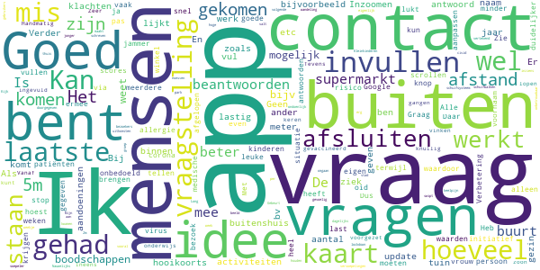

> Handmatig afsluiten is knullig.  :date: __2021-01-31 13:56:39__

> Vanaf nu meerdere keren voor ons gezin ingevuld. Zeer lastig met zoon op voorgezet onderwijs die met meer dan 1000 over de gangen lopen. Tevens werkt het met het "schuifsysteem" erg lastig, als je naar de volgende persoon swipt kunnen er zo maar 39 staan die thuis op bezoek zijn gekomen!  :date: __2020-11-15 10:45:41__

> Kleinkinderen jonger dan 12 jaar komen 2 x per week op bezoek. Afstand houden 1 1/2m ondoenlijk. Nauwelijks risico. Kan een vertekend beeld geven.  :date: __2020-08-25 20:49:05__

> Goed idee maar ik mis de vraag :valt u onder de risico groep? Hoesten en keelpijn bv kan ook iets anders dan civid zijn. Long patiënten, allergie bv En met kinderen kunnen we soepeler omgaan. Geen 1,5m afstand bv Dus, de vraag bent u in contact geweest met kinderen buiten het gezin?  :date: __2020-08-15 12:53:41__

> Het lukt na de versoepelingen van de lockdown niet meer om de waarden in te vullen. Hoeveel mensen binnen 1.5 of 5(!) meter zijn gekomen in de supermarkt of in de stad? Geen idee!  :date: __2020-06-25 20:55:45__

> De vraag hoeveel mensen binnen 5 meter kwamen is niet te beantwoorden als je dagelijks een wandeling in het park maakt. 5 of 50? Ik stop ermee  :date: __2020-06-20 20:29:35__

> Meerdere gebruikers schreven het al : de schuifbalken zijn veel te gevoelig waardoor onbedoeld hoge waarden worden doorgegeven. Gebeurt vooral bij scrollen. Bijvoorbeeld 15 bezoekers gehad terwijl dit eigenlijk 0 had moeten zijn. Mijn inziens worden de uitkomsten dus onbetrouwbaar. Kijk het nog weekje aan, anders stop ik.  :date: __2020-04-29 15:13:12__

> Leek een aardige app. Kap ermee want de 5m regel is niet uitvoerbaar  :date: __2020-04-25 19:37:29__

> goed idee, alleen jammer dat je gelijk 'besmet' ben als je op een vraag ja antwoord, variabelen zoals hooikoorts worden niet meegenomen althans niet toen ik er mee startte, app dus verwijderd!  :date: __2020-04-25 17:44:07__

> Sinds laatste update zitten de navigatie knoppen over de velden in de laatste vraag te beantwoorden.  :date: __2020-04-24 20:54:20__

#### 2-star reviews

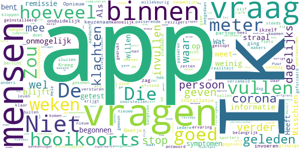

> Beetje onduidelijk dat "persoon" ikzelf ben en je die geen keuzenaam kan geven. Kreeg na installatie geen vragen over "persoon" tot ik partner ging invoeren en daar vragen zag. Opnieuw geīnstalleerd maar. De vraag over 5meter afstsnd doet wat willekeurig aan waar we het standaard hebben over 1,5. Binnen ov en bij passerende sporters kan ik me wel 3m of 5m vragen voorstellen. Niet bij griepige reizigers of hooikoorts-ers.  :date: __2020-10-07 13:09:32__

> Schuifknoppen zijn nauwelijks goed te zetten, app is niet anders te sluiten dan geforceerd, als men klaar is en verder wil gaan.  :date: __2020-10-04 09:28:20__

> Ik stop er mee. Puur omdat je gewoon bij het dagelijks invullen, nog steeds dagelijks de vraag krijgt of de gegevens nog kloppen en het belangrijk is iedere dag in te vullen  :date: __2020-07-09 20:12:11__

> Ik ben gestopt met invullen omdat het onmogelijk is om aan te geven hoeveel mensen binnen een straal van vijf meter zijn gekomen. De makers van de app hebben kennelijk weinig ervaring met de realiteit van het leven.  :date: __2020-05-26 10:22:15__

> Ik vind het heel goed dat de informatie verzameld wordt en heb tot aan vandaag meegedaan voor mij en ook voor mijn man. Ik stop er nu mee omdat het onmogelijk is in te vullen hoeveel mensen binnen een straal van 5 meter komen.  :date: __2020-05-12 20:57:31__

> App blijft hangen. Als ik na het beantwoorden van de vragen op versturen gedrukt heb, blijft de app aangeven dat er een nieuw bericht is.  :date: __2020-04-25 21:46:39__

> Hele rare nieuwe vraag: hoeveel mensen kwamen binnen 5 meter. Daar weet ik echt het antwoord niet op, die vallen buiten mijn aandacht. Die mensen op de fiets, die passeren, in de supermarkt, aan de overkant van de straat. Die tel ik niet. Zal gauw meer dan 20 zijn  :date: __2020-04-25 08:20:27__

> Achterliggende chronische aandoeningen worden niet meegenomen. Zou 1 alg. vraag kunnen zijn. 2. Zou thuis niet beter veranderd kunnen worden in: binnen uw erfgrens?  :date: __2020-04-08 09:28:40__

> Eens met vorige reviews. Zelf heb ik last van hooikoorts. Telkens bij een niesbui, vol lopen van neus, rillerigheid ga ik bij mezelf te raden of het een bekend allergie symptoom is. Misschien hooikoorts ook meenemen in app en combineren met de polleninformatie.  :date: __2020-04-08 08:40:21__

> Crash loop, dus kan nu niks... En waar blijven die dagelijkse meldingen, heb er pas 1 gezien!  :date: __2020-04-07 08:50:17__

#### 1-star reviews

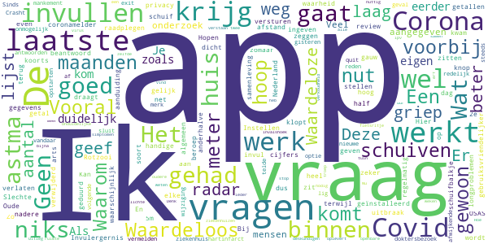

> Het heeft even geduurd maar dan krijg je ook wat. Invulergernis na maanden voorbij. Hopen dat de Corona ook gauw voorbij is............................................... Oude review: . Geen handige app. Vooral het invullen van getallen met die schuiven. Vooral de laatste schuif, die zit heel dicht tegen de knop versturen aan. Waarom niet gewoon cijfers ingeven? Ik hoop niet dat er een 2e uitbraak komt. Komt die er wel dan hoop ik dat de app gebruiksvriendelijker wordt.  :date: __2020-12-24 19:23:49__

> Geen nut  :date: __2020-12-23 11:38:13__

> Werkt voor geen meter  :date: __2020-10-21 14:16:51__

> Rotzooi, net als de coronamelder  :date: __2020-10-12 11:11:35__

> Een app voor een soort griep😂  :date: __2020-09-11 17:22:30__

> Kan veel beter  :date: __2020-06-20 08:45:51__

> Waardeloze app. Schuiven zitten in de weg  :date: __2020-06-16 23:46:00__

> Slechte app. Instellen van gegevens d.m.v schuifbalkje is niet goed in te stellen, en gaat zomaar van een laag naar hoog getal  :date: __2020-06-10 19:16:10__

> Ik heb de app geïnstalleerd en de vragen beantwoord. Er kwam uit dat ik Covid heb zonder koorts. Ik moet gelijk een arts raadplegen en het huis niet verlaten. Ik heb waarschijnlijk zeker geen Covid maar wel astma en longproblemen. En OSAS. Zo kan je van half Nederland zeggen dat ze Covid hebben  :date: __2020-06-06 13:38:25__

> Deze radar draagt niks bij aan de weg terug naar een samenleving zonder 1.5m. Hier geef ik mijn privacy niet voor op. App verwijderd.  :date: __2020-05-17 10:57:47__

# COVapp
App version ``1.9.0``

Analyzed with [covid-apps-observer](http://github.com/covid-apps-observer) project, version ``0.1``

## App overview
| | |
|-------------------------|-------------------------| 
| **Name**&nbsp;&nbsp;&nbsp;&nbsp;&nbsp;&nbsp;&nbsp;&nbsp;&nbsp;&nbsp;&nbsp;&nbsp;&nbsp;&nbsp;&nbsp;&nbsp;&nbsp;&nbsp;&nbsp;&nbsp;&nbsp;&nbsp;&nbsp;&nbsp;&nbsp;&nbsp;&nbsp;&nbsp;&nbsp;&nbsp;&nbsp;&nbsp;&nbsp;&nbsp;&nbsp;&nbsp;&nbsp;&nbsp;&nbsp;&nbsp;  | COVapp |
| **Unique identifier** | com.umcutrecht.covapp |
| **Link to Google Play** | [https://play.google.com/store/apps/details?id=com.umcutrecht.covapp](https://play.google.com/store/apps/details?id=com.umcutrecht.covapp) |
| **Summary**  | This app has been developed to support various COVID-19 research projects. |
| **Privacy policy** | [https://www.researchfollowapp.com/privacy-policy/](https://www.researchfollowapp.com/privacy-policy/) |
| **Latest version** | 1.9.0 |
| **Last update** | 2020-10-06 10:02:59 |
| **Recent changes** | In deze versie zijn enkele verbindingsproblemen opgelost en zijn aanpassingen doorgevoerd aan de titels en subtitels van items in de timeline. |
| **Installs**  | 1.000+ |
| **Category** | Gezondheid en fitness |
| **First release** | 17 apr. 2020 |
| **Size**  | 26M |
| **Supported Android version**  | 4.2 en hoger |

### Description
> COVapp gives you the opportunity to participate in the scientific research into COVID-19. When you have created an account (emailaddres and phonenumber for 2-step verification login), you can login and use the app. The app doesn't collect any personal information. You can fill in a daily diary (list of symptoms) and see information about the virus and see FAQ about it. When you start, you have to give your consent, else you can't fill in the daily diary and the app doesn't collect this data. The app does not collect any other data from your device, other then the you manually enter (symtpoms).

### User interface
The developers of the app provide the following screenshots in the Google play store.
| | | |
|:-------------------------:|:-------------------------:|:-------------------------:|
 |   |   |   | 
 |   |  

## Development team
In the following we report the main information provided by the development team in the Google play store.

| | |
|-------------------------|-------------------------|
| **Developer**  | Your Research |
| **Website**  | [https://researchfollowapp.com/CORONAthuis/instructies](https://researchfollowapp.com/CORONAthuis/instructies) |
| **Email** | umcudevteam@umcutrecht.nl |
| **Physical address**  | - |
| **Other developed apps**  | [https://play.google.com/store/apps/developer?id=Your+Research](https://play.google.com/store/apps/developer?id=Your+Research) |

## Android support

| | |
|-------------------------|-------------------------|
| **Declared target Android version**  | Android10, version 10 (API level 29) |
| **Effective target Android version**  | Android10, version 10 (API level 29) |
| **Minimum supported Android version**  | Jelly Bean, version 4.2.x (API level 17) |
| **Maximum target Android version**  | - |

The larger the difference between the minimum and maximum supported Android versions, the better. A larger difference means a wider audience. For example, old phones have a very low Android version, so a high minimum supported Android version means that the app cannot be used by users with old phones, thus leading to accessibility problems. 

## Requested permissions

In the following we report the complete list of the permissions requested by the app. 

| **Permission** | **Protection level** | **Description** | 
|-------------------------|-------------------------|-------------------------|
 **android.permission ACCESS_FINE_LOCATION** | :warning:**Dangerous** | Allows an app to access precise location. 
 **android.permission ACCESS_NETWORK_STATE** | Normal | Allows applications to access information about networks. 
 **android.permission ACCESS_WIFI_STATE** | Normal | Allows applications to access information about Wi-Fi networks. 
 **android.permission CAMERA** | :warning:**Dangerous** | Required to be able to access the camera device. 
 **android.permission FOREGROUND_SERVICE** | Normal | Allows a regular application to use Service.startForeground. 
 **android.permission INTERNET** | Normal | Allows applications to open network sockets. 
 **android.permission READ_EXTERNAL_STORAGE** | :warning:**Dangerous** | Allows an application to read from external storage. 
 **android.permission RECEIVE_BOOT_COMPLETED** | Normal | Allows an application to receive the Intent.ACTION_BOOT_COMPLETED that is broadcast after the system finishes booting. 
 **android.permission RECORD_AUDIO** | :warning:**Dangerous** | Allows an application to record audio. 
 **android.permission WAKE_LOCK** | Normal | Allows using PowerManager WakeLocks to keep processor from sleeping or screen from dimming. 
 **android.permission WRITE_EXTERNAL_STORAGE** | :warning:**Dangerous** | Allows an application to write to external storage. 
 **com.google.android.c2dm.permission RECEIVE** | - | - 
 **com.google.android.providers.gsf.permission READ_GSERVICES** | - | - 

## Mentioned servers

| **Server** | **Registrant** | **Registrant country** | **Creation date** | 
|-------------------------|-------------------------|-------------------------|-------------------------|
 | google.com | Google LLC | :us: US | 1997-09-15 04:00:00 |
 | googleapis.com | Google LLC | :us: US | 2005-01-25 17:52:26 |

## Security analysis 

Below we report the main security warnings raised by our execution of the [Androwarn](https://github.com/maaaaz/androwarn) security analysis tool.

**Connection interfaces exfiltration**
> - This application reads details about the currently active data network 
> - This application tries to find out if the currently active data network is metered 

**Suspicious connection establishment**
> - This application opens a Socket and connects it to the remote address 'Lfi/iki/elonen/NanoHTTPD$ResponseException;' on the 'N/A' port  
> - This application opens a Socket and connects it to the remote address 'NanoHttpd Shutdown' on the 'N/A' port  

**Pim data leakage**
> - This application accesses the calendar 

**Code execution**
> - This application loads a native library: 'NativeScript' 
> - This application executes a UNIX command containing this argument: '2' 

## User ratings and reviews

Below we provide information about how end users are reacting to the app in terms of ratings and reviews in the Google Play store.

### Ratings

The COVapp app has been installed by more than **1000** times. At this time, **8** rated the app and its average score is **2.625**. Below we show the distribution of the ratings across the usual star-based rating of Google Play

:star::star::star::star::star:: 3

:star::star::star::star:: 0

:star::star::star:: 0

:star::star:: 1

:star:: 4

### Reviews 

#### 5-star reviews

No recent reviews available with 5 stars.

#### 4-star reviews

No recent reviews available with 4 stars.

#### 3-star reviews

No recent reviews available with 3 stars.

#### 2-star reviews

No recent reviews available with 2 stars.

#### 1-star reviews

No recent reviews available with 1 stars.

# Credits

This project makes use of the following main third-party projects:
* Androguard: [https://github.com/androguard/androguard](https://github.com/androguard/androguard)
* Androwarn: [https://github.com/maaaaz/androwarn](https://github.com/maaaaz/androwarn)
* google_play_scraper: [https://github.com/JoMingyu/google-play-scraper](https://github.com/JoMingyu/google-play-scraper)
* whois: [https://github.com/DannyCork/python-whois](https://github.com/DannyCork/python-whois)
* BeautifulSoup: [https://www.crummy.com/software/BeautifulSoup](https://www.crummy.com/software/BeautifulSoup)

Other open-source projects used in this project include: 

- androguard==3.3.5
- appnope==0.1.0
- asn1crypto==1.3.0
- backcall==0.1.0
- beautifulsoup4==4.9.0
- bs4==0.0.1
- certifi==2020.4.5.1
- cffi==1.14.0
- chardet==3.0.4
- click==7.1.2
- colorama==0.4.3
- cryptography==2.9.2
- cycler==0.10.0
- decorator==4.4.2
- future==0.18.2
- google-play-scraper==0.1.1
- idna==2.9
- ipython==7.13.0
- ipython-genutils==0.2.0
- jedi==0.17.0
- Jinja2==2.11.2
- joblib==0.14.1
- kiwisolver==1.2.0
- lxml==4.5.0
- MarkupSafe==1.1.1
- matplotlib==3.2.1
- networkx==2.4
- nltk==3.5
- numpy==1.18.3
- parso==0.7.0
- pexpect==4.8.0
- pickleshare==0.7.5
- Pillow==7.1.2
- play-scraper==0.6.0
- prompt-toolkit==3.0.5
- ptyprocess==0.6.0
- pycountry==19.8.18
- pycparser==2.20
- pydot==1.4.1
- Pygments==2.6.1
- pyOpenSSL==19.1.0
- pyparsing==2.4.7
- python-dateutil==2.8.1
- regex==2020.4.4
- requests==2.23.0
- requests-futures==1.0.0
- six==1.14.0
- soupsieve==2.0
- tld==0.12.1
- tqdm==4.45.0
- traitlets==4.3.3
- urllib3==1.25.9
- wcwidth==0.1.9
- wordcloud==1.7.0

