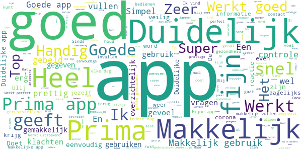
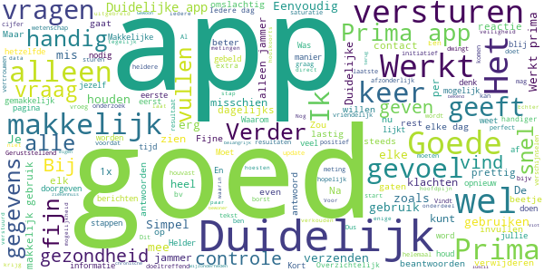
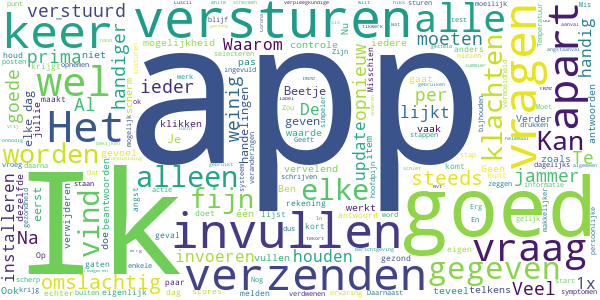
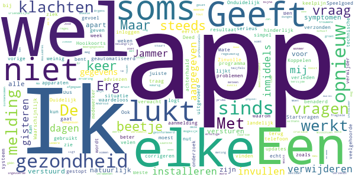
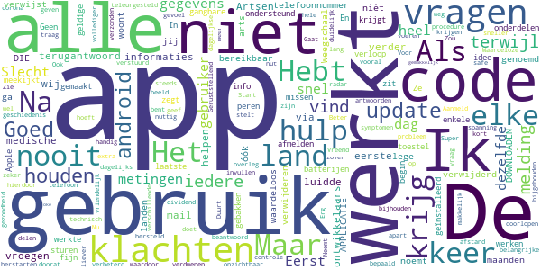

# Luscii
App version ``4.24.0``

Analyzed with [covid-apps-observer](http://github.com/covid-apps-observer) project, version ``0.1``

## App overview
| | |
|-------------------------|-------------------------| 
| **Name**&nbsp;&nbsp;&nbsp;&nbsp;&nbsp;&nbsp;&nbsp;&nbsp;&nbsp;&nbsp;&nbsp;&nbsp;&nbsp;&nbsp;&nbsp;&nbsp;&nbsp;&nbsp;&nbsp;&nbsp;&nbsp;&nbsp;&nbsp;&nbsp;&nbsp;&nbsp;&nbsp;&nbsp;&nbsp;&nbsp;&nbsp;&nbsp;&nbsp;&nbsp;&nbsp;&nbsp;&nbsp;&nbsp;&nbsp;&nbsp;  | Luscii |
| **Unique identifier** | nl.focuscura.beeldbelapp |
| **Link to Google Play** | [https://play.google.com/store/apps/details?id=nl.focuscura.beeldbelapp](https://play.google.com/store/apps/details?id=nl.focuscura.beeldbelapp) |
| **Summary**  | Welkom bij Luscii, de slimste gezondheidsapp voor zorg thuis of onderweg. |
| **Privacy policy** | [https://luscii.com/privacy-policy/](https://luscii.com/privacy-policy/) |
| **Latest version** | 4.24.0 |
| **Last update** | 2020-07-23 10:02:16 |
| **Recent changes** | In deze update, is de detectie van een onregelmatige hartslag toegevoegd. |
| **Installs**  | 50.000+ |
| **Category** | Medisch |
| **First release** | 8 mrt. 2016 |
| **Size**  | 125M |
| **Supported Android version**  | 7.0 en hoger |

### Description
> Wat is Luscii?
 Luscii maakt moderne zorg mogelijk. Met de Luscii app is het op voorschrift van een zorgorganisatie mogelijk om:
 - lichaamswaarden/symptomen in de gaten te houden
 - gerichte educatie te ontvangen over (omgaan met) ziekte of gezondheidsrisico's
 - op afstand te communiceren met zorgverleners
 Hoe werkt het?
 - Mensen dienen zich eerst aan te melden. Dat gaat normaal via een ziekenhuis. In geval van inzet in de corona crisis is aanmelden ook mogelijk op www.olvgcoronacheck.nl
 - De app vraagt dagelijks een aantal lichaamswaarden of symptomen door te geven. Deze zijn gebaseerd op een door zorgverleners voor de gebruiker ingesteld programma. Ook is er educatie in de app en contact op afstand.
 - Achter de app staat een medisch team paraat. Dit beoordeelt de antwoorden die gebruikers geven in de app (ondersteund door de techniek van de app). Als er een medische reden is om contact op te nemen, doen zij dat binnen 24 uur. Dat kan telefonisch of via een bericht. Ook is contact via beeldbellen mogelijk (let op: deze functie gebruikt OLVG corona check nog niet).
 OLVG corona check
 - Door de uitbraak van het coronavirus neemt de zorgvraag toe. Ziekenhuizen bereiden zich hierop voor door nieuwe middelen in te zetten naast de reguliere zorg. Samen met het Amsterdamse ziekenhuis OLVG heeft Luscii daarom de Luscii app hiervoor geschikt gemaakt. We noemen dit OLVG corona check.
 - OLVG corona check is bedoeld om grote groepen mensen met klachten die mogelijk door het coronavirus wordt veroorzaakt op afstand te kunnen begeleiden. Een medisch team beoordeelt de metingen die binnenkomen via de app van Luscii die voor OLVG corona check wordt gebruikt. OLVG corona check is gratis.
 - OLVG corona check is gestart voor mensen in de regio Groot Amsterdam. Er wordt gestreefd de regio's waarin de app beschikbaar is, uit te breiden. Meer informatie is te vinden op www.olvgcoronacheck.nl.
 Medisch hulpmiddel en gegevensverwerking
 Luscii is een CE gemarkeerd medisch hulpmiddel. Gegevens worden verwerkt volgens de Algemene Verordering Gegevensbescherming (AVG). Het privacyreglement en gebruikersvoorwaarden zijn te vinden op www.luscii.com. Luscii is gevestigd in Amsterdam, Nederland.

### User interface
The developers of the app provide the following screenshots in the Google play store.
| | | |
|:-------------------------:|:-------------------------:|:-------------------------:|
 |   |   |   | 
 |   |   |   | 
 |   |  

## Development team
In the following we report the main information provided by the development team in the Google play store.

| | |
|-------------------------|-------------------------|
| **Developer**  | Luscii Healthtech |
| **Website**  | [http://www.luscii.com](http://www.luscii.com) |
| **Email** | support@luscii.com |
| **Physical address**  | [Spuistraat 114A 1012 VA Amsterdam The Netherlands](https://www.google.com/maps/search/Spuistraat%20114A%201012%20VA%20Amsterdam%20The%20Netherlands) (Google Maps) |
| **Other developed apps**  | [https://play.google.com/store/apps/developer?id=Luscii+Healthtech](https://play.google.com/store/apps/developer?id=Luscii+Healthtech) |

## Android support

| | |
|-------------------------|-------------------------|
| **Declared target Android version**  | Android10, version 10 (API level 29) |
| **Effective target Android version**  | Android10, version 10 (API level 29) |
| **Minimum supported Android version**  | Nougat, version 7.0 (API level 24) |
| **Maximum target Android version**  | - |

The larger the difference between the minimum and maximum supported Android versions, the better. A larger difference means a wider audience. For example, old phones have a very low Android version, so a high minimum supported Android version means that the app cannot be used by users with old phones, thus leading to accessibility problems. 

## Requested permissions

In the following we report the complete list of the permissions requested by the app. 

| **Permission** | **Protection level** | **Description** | 
|-------------------------|-------------------------|-------------------------|
 **android.permission ACCESS_BACKGROUND_LOCATION** | :warning:**Dangerous** | Allows an app to access location in the background. 
 **android.permission ACCESS_COARSE_LOCATION** | :warning:**Dangerous** | Allows an app to access approximate location. 
 **android.permission ACCESS_FINE_LOCATION** | :warning:**Dangerous** | Allows an app to access precise location. 
 **android.permission ACCESS_NETWORK_STATE** | Normal | Allows applications to access information about networks. 
 **android.permission ACCESS_NOTIFICATION_POLICY** | Normal | Marker permission for applications that wish to access notification policy. 
 **android.permission ACCESS_WIFI_STATE** | Normal | Allows applications to access information about Wi-Fi networks. 
 **android.permission ACTIVITY_RECOGNITION** | :warning:**Dangerous** | Allows an application to recognize physical activity. 
 **android.permission BLUETOOTH** | Normal | Allows applications to connect to paired bluetooth devices. 
 **android.permission BLUETOOTH_ADMIN** | Normal | Allows applications to discover and pair bluetooth devices. 
 **android.permission CAMERA** | :warning:**Dangerous** | Required to be able to access the camera device. 
 **android.permission DISABLE_KEYGUARD** | Normal | Allows applications to disable the keyguard if it is not secure. 
 **android.permission FOREGROUND_SERVICE** | Normal | Allows a regular application to use Service.startForeground. 
 **android.permission INTERNET** | Normal | Allows applications to open network sockets. 
 **android.permission MODIFY_AUDIO_SETTINGS** | Normal | Allows an application to modify global audio settings. 
 **android.permission READ_EXTERNAL_STORAGE** | :warning:**Dangerous** | Allows an application to read from external storage. 
 **android.permission READ_PHONE_STATE** | :warning:**Dangerous** | Allows read only access to phone state, including the phone number of the device, current cellular network information, the status of any ongoing calls, and a list of any PhoneAccounts registered on the device. 
 **android.permission RECEIVE_BOOT_COMPLETED** | Normal | Allows an application to receive the Intent.ACTION_BOOT_COMPLETED that is broadcast after the system finishes booting. 
 **android.permission RECORD_AUDIO** | :warning:**Dangerous** | Allows an application to record audio. 
 **android.permission USE_FULL_SCREEN_INTENT** | Normal | Required for apps targeting Build.VERSION_CODES.Q that want to use notification full screen intents. 
 **android.permission VIBRATE** | Normal | Allows access to the vibrator. 
 **android.permission WAKE_LOCK** | Normal | Allows using PowerManager WakeLocks to keep processor from sleeping or screen from dimming. 
 **android.permission WRITE_EXTERNAL_STORAGE** | :warning:**Dangerous** | Allows an application to write to external storage. 
 **com.google.android.c2dm.permission RECEIVE** | - | - 
 **com.google.android.finsky.permission BIND_GET_INSTALL_REFERRER_SERVICE** | - | - 
 **nl.focuscura.beeldbelapp.permission C2D_MESSAGE** | - | - 

## Mentioned servers

| **Server** | **Registrant** | **Registrant country** | **Creation date** | 
|-------------------------|-------------------------|-------------------------|-------------------------|
 | xml.org | OASIS Open | :us: US | 1997-02-03 05:00:00 |
 | xmlpull.org | WhoisGuard, Inc. | PA | 2001-11-26 20:33:08 |
 | w3.org | W3C | :us: US | 1994-07-06 04:00:00 |
 | googlesyndication.com | Google LLC | :us: US | 2003-01-21 06:17:24 |
 | google.com | Google LLC | :us: US | 1997-09-15 04:00:00 |
 | googleapis.com | Google LLC | :us: US | 2005-01-25 17:52:26 |
 | google-analytics.com | Google LLC | :us: US | 2005-07-18 19:24:32 |
 | googleadservices.com | Google LLC | :us: US | 2003-06-19 16:34:53 |
 | app-measurement.com | Google LLC | :us: US | 2015-06-19 20:13:31 |
 | googleapis.com | Google LLC | :us: US | 2005-01-25 17:52:26 |
 | ihealthlabs.com | - | cn | 2011-10-13 07:43:43 |
 | sematext.com | REDACTED FOR PRIVACY | :us: US | 2007-05-01 03:03:08 |
 | apple.com | Apple Inc. | :us: US | 1987-02-19 05:00:00 |
 | aomedia.org | Contact Privacy Inc. Customer 1243324949 | :canada: CA | 2015-08-24 14:07:31 |
 | amazonaws.com | Amazon.com, Inc. | :us: US | 2005-08-18 02:10:45 |
 | branch.io | Branch | :us: US | 2011-11-10 13:52:13 |
 | crashlytics.com | Google LLC | :us: US | 2011-01-21 15:30:40 |
 | vimeo.com | Vimeo, Inc. | :us: US | 2004-12-15 08:38:55 |
 | bnc.lt | - | - | 2016-11-14 00:00:00 |
 | intercomcdn.com | Whois Privacy Service | :us: US | 2013-04-25 22:04:57 |
 | wistia.net | Wistia | :us: US | 2008-09-02 18:42:09 |
 | useloom.com | Whois Privacy Service | :us: US | 2016-10-03 00:10:39 |
 | wistia.com | Wistia | :us: US | 2007-03-18 21:58:55 |
 | youtube.com | Google LLC | :us: US | 2005-02-15 05:13:12 |
 | twitter.com | Twitter, Inc. | :us: US | 2000-01-21 16:28:17 |
 | focuscura.com | REDACTED FOR PRIVACY | :netherlands: NL | 2010-05-20 14:02:28 |
 | luscii.com | - | :netherlands: NL | 2018-06-21 09:46:19 |
 | focuscura.nl | - | - | 2003-01-30 00:00:00 |
 | intercom.io | Intercom Ops | IE | 2011-08-15 11:52:53 |

## Security analysis 

Below we report the main security warnings raised by our execution of the [Androwarn](https://github.com/maaaaz/androwarn) security analysis tool.

**Telephony identifiers leakage**
> - This application reads the ISO country code equivalent of the current registered operator's MCC (Mobile Country Code) 
> - This application reads the numeric name (MCC+MNC) of current registered operator 
> - This application reads the operator name 

**Connection interfaces exfiltration**
> - This application reads details about the currently active data network 
> - This application tries to find out if the currently active data network is metered 

**Telephony services abuse**
> - This application makes phone calls 

**Suspicious connection establishment**
> - This application opens a Socket and connects it to the remote address 'Lb/d/b/a/a;->K(Ljava/lang/String;)Ljava/lang/StringBuilder;' on the 'N/A' port  
> - This application opens a Socket and connects it to the remote address 'Ljava/lang/StringBuilder;->toString()Ljava/lang/String;' on the 'N/A' port  
> - This application opens a Socket and connects it to the remote address 'Ljava/net/Proxy;->type()Ljava/net/Proxy$Type;' on the 'N/A' port  
> - This application opens a Socket and connects it to the remote address 'No route to  ' on the 'N/A' port  
> - This application opens a Socket and connects it to the remote address 'Proxy.address() is not an InetSocketAddress:   returned no addresses for  Ljava/net/SocketException;' on the 'N/A' port  
> - This application opens a Socket and connects it to the remote address 'timeout' on the 'N/A' port  

**Code execution**
> - This application loads a native library 
> - This application loads a native library: 'ECGOffline' 
> - This application loads a native library: 'ECGOnline' 
> - This application loads a native library: 'VidyoClient' 
> - This application loads a native library: 'heartbeat-android' 
> - This application loads a native library: 'heartbeat-lib' 
> - This application loads a native library: 'iHealth' 
> - This application loads a native library: 'sodiumjni' 

## User ratings and reviews

Below we provide information about how end users are reacting to the app in terms of ratings and reviews in the Google Play store.

### Ratings

The Luscii app has been installed by more than **50000** times. At this time, **7209** rated the app and its average score is **4.298611**. Below we show the distribution of the ratings across the usual star-based rating of Google Play

:star::star::star::star::star:: 3884

:star::star::star::star:: 2322

:star::star::star:: 540

:star::star:: 190

:star:: 270

### Reviews 

#### 5-star reviews

> Deze app, kan zeer waardevol zijn voor de persoon die hem gebruikt. Bij twijfel word je door een medewerker gebeld. Top, geweldig.  :date: __2020-07-25 19:26:28__

> Goed stukje medisch gereedschap  :date: __2020-07-24 19:06:51__

> De app werkt goed. Echter ik mis de afwijkende klachten die zich kunnen voordoen zoals oogontsteking, bepaalde pijnklachten  :date: __2020-07-23 18:13:13__

> Duidelijke app,snelle communicatie  :date: __2020-07-23 09:07:38__

> heel goed in te vullen niet moeilijk  :date: __2020-07-21 10:03:35__

> Het is fijn bij ongerustheid een beroep te kunnen doen op deze app.  :date: __2020-07-18 21:43:41__

> Eenvoudige app. Meteen reactie  :date: __2020-07-18 11:51:07__

> Goed. Ik dacht eigenlijk dat het de nieuwe App van Min. De Jong was. . .  :date: __2020-07-18 09:22:55__

> Ben er heel tevreden over.  :date: __2020-07-15 20:11:09__

> Overzichtelijk en duidelijk.  :date: __2020-07-15 09:13:33__

#### 4-star reviews

> Heldere aanpak.  :date: __2020-07-28 08:06:11__

> Makkelijk app om je gezondheid in de gaten te houden  :date: __2020-07-27 09:46:44__

> Vlot  :date: __2020-07-25 01:11:08__

> Bijzonderheden die in de aanmeldmail zijn ingevuld, komen niet terug in de app. Lichaamsgesteldheid en chronische aandoeningen zijn denk ik belangrijk voor de analyse of er in een vroeg stadium mondeling contact nodig is. App ondersteunt alleen iHealth apoaraten. Kijk ook eens naar andere merken, zoals BEURER.  :date: __2020-07-24 11:23:06__

> Goede app  :date: __2020-07-23 11:22:31__

> Moet mijn samsung A40 elke dag opnieuw opstarten om luscii te kunnen gebruiken.  :date: __2020-07-21 20:46:23__

> Duidelijk.  :date: __2020-07-20 10:35:08__

> Prima. Ga zo door.  :date: __2020-07-14 09:28:17__

> Eenvoudig te gebruiken en goede response.  :date: __2020-07-12 11:14:03__

> Alleen was in ziekenhuis CWZ niets bekend van deze uitslagen. Ik ging als begeleidster mee met een bewoner voor onderzoek. Van bewoner was ook niets bekend. Vraag me af waarom we dit dan invullen?  :date: __2020-07-06 19:49:03__

#### 3-star reviews

> Vraag over angstaanval moet anders gesteld worden. De angst komt pas NA de aanval als je geen lucht meer krijgt.  :date: __2020-07-27 13:36:31__

> Ik kan helemaal niks met de app. Alleen mijn eigen gegevens bekijken, de anderen schermen melden dat ik ze niet gebruiken kan. Na ee paar uur doet hij het. Nu een paar keer gebruikt.. Ik vind het errg veel onnodig tikwerk..32 keer sls je alles wilt invullen.  :date: __2020-07-06 15:06:06__

> Goed.  :date: __2020-07-05 17:42:13__

> Te vaak moet je de gegevens met de hand invullen. Misschien doe ik zelf iets niet goed, maar dat komt dan omdat de handleiding tekort schiet.  :date: __2020-06-29 13:55:22__

> Ik vind de vragen summier en vrij algemeen. Ook is het jammer dat jullie de app niet white label aanbieden zodat jullie klanten er hun eigen merk overheen kunnen leggen.  :date: __2020-06-24 14:56:37__

> Tot voor kort uitstekend en gedetailleerde vragen. Nu veel te oppervlakkig.  :date: __2020-06-22 09:47:55__

> Ben niet negatief of positief. App houd weinig rekening met andere klachten of ziektes  :date: __2020-06-19 17:37:44__

> Het zou fijn zijn als je de scores in 1x kunt verzenden ipv per item. Het nieuwe bericht staat onder dus dan moet je scrollen, beter is bovenaan  :date: __2020-06-13 14:05:49__

> Hulpje om mijn longen conditie in de gaten te houden.  :date: __2020-06-10 06:18:17__

> Ik vind het vervelend dat na elk antwoord deze verstuurd moet worden. Kost extra tijd en maakt dat ik niet elke dag deze lijst wil invullen.  :date: __2020-06-06 08:37:06__

#### 2-star reviews

> Zinvolle app, hinderlijk dat na elke vraag resultaat verzonden wordt. Kan ook in 1 keer lijkt me.  :date: __2020-06-06 12:43:48__

> Een beetje, meer of veel keelpijn? Hooikoorts verleden?  :date: __2020-06-04 05:11:30__

> Duidelijk dat het een geautomatiseerd systeem is. Geeft niet echt juiste adviezen. Maar beter iets dan niets.  :date: __2020-05-31 23:14:55__

> Koppelen aan apparaten gaat traag en soms niet. Onduidelijk waarom het dan niet lukt, soms lukt het wel, soms niet  :date: __2020-05-28 07:23:13__

> Erg simpel programma. Geeft niet het gevoel dat het je situatie ook maar benaderd. Startvragen over gezondheid (bij eerste aanmelding op te geven) zijn niet terug te vinden. Dus ook niet te corrigeren. Ik zie er weinig nut van in. Speelgoed.  :date: __2020-05-23 13:23:27__

> Deed wat hij moest doen maar sinds de app landelijk wordt gebruikt waardeloos en de updates van vorige week is het een k..t app moet hem steeds verwijderen en opnieuw installeren want hij logt steeds uit en opnieuw inloggen lukt niet.  :date: __2020-05-19 19:26:43__

> Mate van klachten kun je niet aangegeven. Ik ook andere veelgehoorde klachten. Beste medewerker, De app heeft al dagen technische problemen. Ik verwijder 'm van mijn telefoon. Waarschijnlijk bent u gestopt met uw onderzoek.  Ook uw vragen zijn inmiddels achterhaald. Ben inmiddels al 4 weken ziek, zoals zo velen met mij. Ik had hier meer van verwacht. Jammer dat dit niet serieus wordt uitgevoerd.  Met vriendelijke groet, José ten Böhmer  :date: __2020-05-18 10:11:59__

> Doet het regelmatig niet  :date: __2020-05-18 10:04:06__

> Sinds gisteren kan ik weer niet in de app komen. Moet eerst mijn e mailadres invullen en dan komt de melding, er is iets fout gegaan.  :date: __2020-05-18 09:39:42__

> Een app die niet werkt de-ïnstalleer ik in de regel meteen. Weg ermee! Maar deze, waar je elke dag je gegevens naartoe stuurt, schuif je natuurlijk niet zomaar terzijde. Een app die (mogelijk) cruciale data verzamelt en verzendt mag natuurlijk nooit falen. Misschien zijn nu al mijn ingevoerde gegevens verdwenen en heb ik voor Jan dinges meegedaan. Mocht dat zo zijn, dan was dit de 1e en laatste keer om mee te doen aan zo'n (voor mij althans) toch wel belangrijk meetinstrument, gelet op mijn fragiele gezondheid. Het kan trouwens niet bestaan dat deze app al enkele dagen eruit ligt. Er moet toch érgens een bel zijn afgegaan dat er géén meetgegevens meer binnenkomen? Ik meende dat dit professionals zijn/waren. Ik heb nu toch wel ernstige twijfels  :date: __2020-05-17 15:29:26__

#### 1-star reviews

> Hebt als een van de eerste de app in gebruik. Artsen vroegen mij via mail om meer medische informaties. Het terugantwoord luidde, wij zijn slechts de ontwikkelaars en kunnen u niet verder helpen. Het telefoonnummer verwijst naar een arts. Maar die is nooit bereikbaar. Na 8 maanden gebruik heb ik de app verwijderd óók omdat de app maar 4 landen noemt voor hulp. Als jij niét in een genoemd land woont krijg je nooit hulp. NIET DOWNLOADEN DIE APPLICATIE 😱 😭  :date: __2020-07-25 14:39:39__

> App werkt niet meer  :date: __2020-07-11 10:16:02__

> Ik ga de app verwijderen, waardeloos  :date: __2020-07-05 01:01:49__

> Weegschaal werkt niet lege batterijen  :date: __2020-06-29 09:36:25__

> Ze sturen je een code maar de app zegt elke keer dat het geen geldige code is!!!  :date: __2020-06-17 08:01:41__

> Na de laatste update werkte de app niet meer  :date: __2020-06-11 21:41:36__

> Goed  :date: __2020-06-10 17:22:00__

> De app is gemaakt voor Apple gebruikers. Als je het al geïnstalleerd krijgt op je gangbare android toestel, worden de onderdelen niet ondersteund!  :date: __2020-06-10 10:36:27__

> Geen land info en kan je niet afmelden. Codes werken niet. En zo zit je met gebakken peren.  :date: __2020-06-09 13:02:03__

> In het begin fijn om het idee te hebben dat er iemand meekijkt en dat je het verloop van klachten bij kan houden, ook al missen enkele belangrijke symptomen. - Erg teleurgesteld dat iemand op afstand, zonder overleg, bepaald dat je zover hersteld bent dat je niet meer dagelijks klachten bij hoeft te houden (terwijl er wel nog klachten zijn), waardoor je ze ook niet meer kan bijhouden. De hele geschiedenis die je hebt bijgehouden wordt hierdoor ook onzichtbaar.  :date: __2020-06-08 14:04:52__

