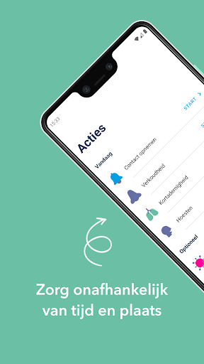
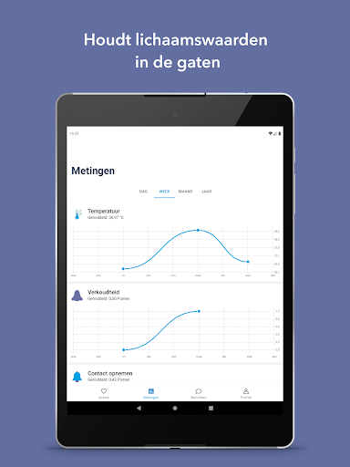
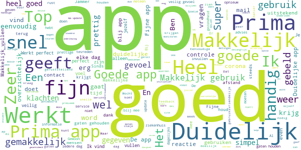
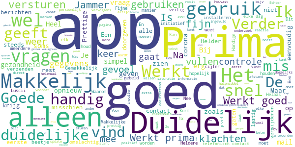
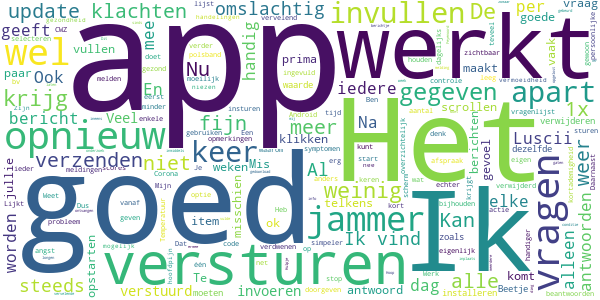
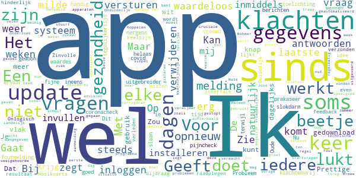
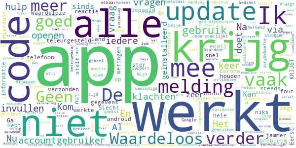

# Luscii
App version ``5.5.1``

Analyzed with [covid-apps-observer](http://github.com/covid-apps-observer) project, version ``0.1``

## App overview
| | |
|-------------------------|-------------------------| 
| **Name**                                          | Luscii |
| **Unique identifier** | nl.focuscura.beeldbelapp |
| **Link to Google Play** | [https://play.google.com/store/apps/details?id=nl.focuscura.beeldbelapp](https://play.google.com/store/apps/details?id=nl.focuscura.beeldbelapp) |
| **Summary**  | Welkom bij Luscii, de slimste gezondheidsapp voor zorg thuis of onderweg. |
| **Privacy policy** | [https://luscii.com/privacy-policy/](https://luscii.com/privacy-policy/) |
| **Latest version** | 5.5.1 |
| **Last update** | 2021-02-05 15:10:08 |
| **Recent changes** | In deze update bug fix voor inlogprobleem. |
| **Installs**  | 100.000+ |
| **Category** | Medisch |
| **First release** | 8 mrt. 2016 |
| **Size**  | 139M |
| **Supported Android version**  | 7.0 en hoger |

### Description
> Wat is Luscii?
 Luscii maakt moderne zorg mogelijk. Met de Luscii app is het op voorschrift van een zorgorganisatie mogelijk om:
 - lichaamswaarden/symptomen in de gaten te houden
 - gerichte educatie te ontvangen over (omgaan met) ziekte of gezondheidsrisico's
 - op afstand te communiceren met zorgverleners
 Hoe werkt het?
 - Mensen dienen zich eerst aan te melden. Dat gaat normaal via een ziekenhuis. In geval van inzet in de corona crisis is aanmelden ook mogelijk op www.olvgcoronacheck.nl
 - De app vraagt dagelijks een aantal lichaamswaarden of symptomen door te geven. Deze zijn gebaseerd op een door zorgverleners voor de gebruiker ingesteld programma. Ook is er educatie in de app en contact op afstand.
 - Achter de app staat een medisch team paraat. Dit beoordeelt de antwoorden die gebruikers geven in de app (ondersteund door de techniek van de app). Als er een medische reden is om contact op te nemen, doen zij dat binnen 24 uur. Dat kan telefonisch of via een bericht. Ook is contact via beeldbellen mogelijk (let op: deze functie gebruikt OLVG corona check nog niet).
 OLVG corona check
 - Door de uitbraak van het coronavirus neemt de zorgvraag toe. Ziekenhuizen bereiden zich hierop voor door nieuwe middelen in te zetten naast de reguliere zorg. Samen met het Amsterdamse ziekenhuis OLVG heeft Luscii daarom de Luscii app hiervoor geschikt gemaakt. We noemen dit OLVG corona check.
 - OLVG corona check is bedoeld om grote groepen mensen met klachten die mogelijk door het coronavirus wordt veroorzaakt op afstand te kunnen begeleiden. Een medisch team beoordeelt de metingen die binnenkomen via de app van Luscii die voor OLVG corona check wordt gebruikt. OLVG corona check is gratis.
 - OLVG corona check is gestart voor mensen in de regio Groot Amsterdam. Er wordt gestreefd de regio's waarin de app beschikbaar is, uit te breiden. Meer informatie is te vinden op www.olvgcoronacheck.nl.
 Medisch hulpmiddel en gegevensverwerking
 Luscii is een CE gemarkeerd medisch hulpmiddel. Gegevens worden verwerkt volgens de Algemene Verordering Gegevensbescherming (AVG). Het privacyreglement en gebruikersvoorwaarden zijn te vinden op www.luscii.com. Luscii is gevestigd in Amsterdam, Nederland.

### User interface
The developers of the app provide the following screenshots in the Google play store.
| | | |
|:-------------------------:|:-------------------------:|:-------------------------:|
 |   |   |   | 
 |   |   |   | 
 |   |  

## Development team
In the following we report the main information provided by the development team in the Google play store.

| | |
|-------------------------|-------------------------|
| **Developer**  | Luscii Healthtech |
| **Website**  | [http://www.luscii.com](http://www.luscii.com) |
| **Email** | support@luscii.com |
| **Physical address**  | [Spuistraat 114A 1012 VA Amsterdam The Netherlands](https://www.google.com/maps/search/Spuistraat%20114A%201012%20VA%20Amsterdam%20The%20Netherlands) (Google Maps) |
| **Other developed apps**  | [https://play.google.com/store/apps/developer?id=Luscii+Healthtech](https://play.google.com/store/apps/developer?id=Luscii+Healthtech) |

## Android support

| | |
|-------------------------|-------------------------|
| **Declared target Android version**  | Android10, version 10 (API level 29) |
| **Effective target Android version**  | Android10, version 10 (API level 29) |
| **Minimum supported Android version**  | Nougat, version 7.0 (API level 24) |
| **Maximum target Android version**  | - |

The larger the difference between the minimum and maximum supported Android versions, the better. A larger difference means a wider audience. For example, old phones have a very low Android version, so a high minimum supported Android version means that the app cannot be used by users with old phones, thus leading to accessibility problems. 

## Requested permissions

In the following we report the complete list of the permissions requested by the app. 

| **Permission** | **Protection level** | **Description** | 
|-------------------------|-------------------------|-------------------------|
 **android.permission ACCESS_COARSE_LOCATION** | :warning:**Dangerous** | Allows an app to access approximate location. 
 **android.permission ACCESS_FINE_LOCATION** | :warning:**Dangerous** | Allows an app to access precise location. 
 **android.permission ACCESS_NETWORK_STATE** | Normal | Allows applications to access information about networks. 
 **android.permission ACCESS_NOTIFICATION_POLICY** | Normal | Marker permission for applications that wish to access notification policy. 
 **android.permission ACCESS_WIFI_STATE** | Normal | Allows applications to access information about Wi-Fi networks. 
 **android.permission ACTIVITY_RECOGNITION** | :warning:**Dangerous** | Allows an application to recognize physical activity. 
 **android.permission BLUETOOTH** | Normal | Allows applications to connect to paired bluetooth devices. 
 **android.permission BLUETOOTH_ADMIN** | Normal | Allows applications to discover and pair bluetooth devices. 
 **android.permission CAMERA** | :warning:**Dangerous** | Required to be able to access the camera device. 
 **android.permission DISABLE_KEYGUARD** | Normal | Allows applications to disable the keyguard if it is not secure. 
 **android.permission FOREGROUND_SERVICE** | Normal | Allows a regular application to use Service.startForeground. 
 **android.permission INTERNET** | Normal | Allows applications to open network sockets. 
 **android.permission MODIFY_AUDIO_SETTINGS** | Normal | Allows an application to modify global audio settings. 
 **android.permission RECEIVE_BOOT_COMPLETED** | Normal | Allows an application to receive the Intent.ACTION_BOOT_COMPLETED that is broadcast after the system finishes booting. 
 **android.permission RECORD_AUDIO** | :warning:**Dangerous** | Allows an application to record audio. 
 **android.permission USE_FULL_SCREEN_INTENT** | Normal | Required for apps targeting Build.VERSION_CODES.Q that want to use notification full screen intents. 
 **android.permission VIBRATE** | Normal | Allows access to the vibrator. 
 **android.permission WAKE_LOCK** | Normal | Allows using PowerManager WakeLocks to keep processor from sleeping or screen from dimming. 
 **android.permission WRITE_EXTERNAL_STORAGE** | :warning:**Dangerous** | Allows an application to write to external storage. 
 **com.android.alarm.permission SET_ALARM** | Normal | Allows an application to broadcast an Intent to set an alarm for the user. 
 **com.google.android.c2dm.permission RECEIVE** | - | - 
 **com.google.android.finsky.permission BIND_GET_INSTALL_REFERRER_SERVICE** | - | - 
 **nl.focuscura.beeldbelapp.permission C2D_MESSAGE** | - | - 

## Mentioned servers

| **Server** | **Registrant** | **Registrant country** | **Creation date** | 
|-------------------------|-------------------------|-------------------------|-------------------------|
 | google.com | Google LLC | :us: US | 1997-09-15 04:00:00 |
 | xml.org | OASIS Open | :us: US | 1997-02-03 05:00:00 |
 | xmlpull.org | WhoisGuard, Inc. | PA | 2001-11-26 20:33:08 |
 | w3.org | W3C | :us: US | 1994-07-06 04:00:00 |
 | googlesyndication.com | Google LLC | :us: US | 2003-01-21 06:17:24 |
 | googleapis.com | Google LLC | :us: US | 2005-01-25 17:52:26 |
 | google-analytics.com | Google LLC | :us: US | 2005-07-18 19:24:32 |
 | googleadservices.com | Google LLC | :us: US | 2003-06-19 16:34:53 |
 | app-measurement.com | Google LLC | :us: US | 2015-06-19 20:13:31 |
 | googleapis.com | Google LLC | :us: US | 2005-01-25 17:52:26 |
 | sematext.com | REDACTED FOR PRIVACY | :us: US | 2007-05-01 03:03:08 |
 | launchdarkly.com | Catamorphic Co. | :us: US | 2014-07-15 17:17:52 |
 | apple.com | Apple Inc. | :us: US | 1987-02-19 05:00:00 |
 | aomedia.org | Contact Privacy Inc. Customer 1243324949 | :canada: CA | 2015-08-24 14:07:31 |
 | crashlytics.com | Google LLC | :us: US | 2011-01-21 15:30:40 |
 | amazonaws.com | Amazon.com, Inc. | :us: US | 2005-08-18 02:10:45 |
 | amazonaws.com | Amazon.com, Inc. | :us: US | 2005-08-18 02:10:45 |
 | branch.io | Branch | :us: US | 2011-11-10 13:52:13 |
 | focuscura.com | REDACTED FOR PRIVACY | :netherlands: NL | 2010-05-20 14:02:28 |
 | luscii.com | Registrant State/Province: Provincie Gelderland | :netherlands: NL | 2018-06-21 09:46:19 |

## Security analysis 

Below we report the main security warnings raised by our execution of the [Androwarn](https://github.com/maaaaz/androwarn) security analysis tool.

**Telephony identifiers leakage**
> - This application reads the ISO country code equivalent of the current registered operator's MCC (Mobile Country Code) 
> - This application reads the numeric name (MCC+MNC) of current registered operator 
> - This application reads the operator name 

**Connection interfaces exfiltration**
> - This application reads details about the currently active data network 
> - This application tries to find out if the currently active data network is metered 

**Suspicious connection establishment**
> - This application opens a Socket and connects it to the remote address '; port is out of range' on the 'N/A' port  
> - This application opens a Socket and connects it to the remote address 'Lb/d/b/a/a;->V(Ljava/lang/String;)Ljava/lang/StringBuilder;' on the 'N/A' port  
> - This application opens a Socket and connects it to the remote address 'Ljava/lang/StringBuilder;->toString()Ljava/lang/String;' on the 'N/A' port  
> - This application opens a Socket and connects it to the remote address 'Ljava/net/Proxy;->type()Ljava/net/Proxy$Type;' on the 'N/A' port  
> - This application opens a Socket and connects it to the remote address 'Method sendUrgentData() is not supported.' on the 'N/A' port  
> - This application opens a Socket and connects it to the remote address 'Method setHandshakeTimeout() is not supported.' on the 'N/A' port  
> - This application opens a Socket and connects it to the remote address 'Method setOOBInline() is not supported.' on the 'N/A' port  
> - This application opens a Socket and connects it to the remote address 'Method setSoWriteTimeout() is not supported.' on the 'N/A' port  
> - This application opens a Socket and connects it to the remote address 'No route to  ' on the 'N/A' port  
> - This application opens a Socket and connects it to the remote address 'Socket closed' on the 'N/A' port  
> - This application opens a Socket and connects it to the remote address 'Socket is closed' on the 'N/A' port  
> - This application opens a Socket and connects it to the remote address 'Socket is closed.' on the 'N/A' port  
> - This application opens a Socket and connects it to the remote address 'Socket is not connected.' on the 'N/A' port  
> - This application opens a Socket and connects it to the remote address 'socket is closed' on the 'N/A' port  
> - This application opens a Socket and connects it to the remote address 'timeout' on the 'N/A' port  

**Code execution**
> - This application loads a native library 
> - This application loads a native library: 'ECGOffline' 
> - This application loads a native library: 'ECGOnline' 
> - This application loads a native library: 'VidyoClient' 
> - This application loads a native library: 'conscrypt_gmscore_jni' 
> - This application loads a native library: 'conscrypt_jni' 
> - This application loads a native library: 'heartbeat-android' 
> - This application loads a native library: 'heartbeat-lib' 
> - This application loads a native library: 'iHealth' 
> - This application loads a native library: 'sodiumjni' 

## User ratings and reviews

Below we provide information about how end users are reacting to the app in terms of ratings and reviews in the Google Play store.

### Ratings

The Luscii app has been installed by more than **100000** times. At this time, **7859** rated the app and its average score is **4.3312263**. Below we show the distribution of the ratings across the usual star-based rating of Google Play

:star::star::star::star::star:: 4502

:star::star::star::star:: 2355

:star::star::star:: 457

:star::star:: 198

:star:: 347

### Reviews 

#### 5-star reviews

> Al drie weken kan ik de app niet meer openen en dus geen gegevens doorgeven. Zelfs verwijderd en opnieuw gedownload. Nee dus. Lex.  :date: __2021-02-24 12:04:49__

> De app werkt weer perfect  :date: __2021-02-22 09:04:16__

> Monitoring okay. Reactie op ernstige klachten en nieuwe medicijnen op moet eerder, vind ik.  :date: __2021-02-18 18:28:51__

> Uitstekend altijd duidelijk en snelle reactie prima geregeld door jullie dank dank dank  :date: __2021-02-18 12:28:46__

> Makkelijk te gebruiken app  :date: __2021-02-18 11:25:57__

> Het helpt ons alert te blijven. Ook graag optie om temp op te slaan inbouwen mèt grafiek.  :date: __2021-02-18 09:17:42__

> Top  :date: __2021-02-18 08:37:39__

> makkelijk en snel.alleen onlangs werkte hij niet. toen verwijderd en opnieuw geinstalleerd. toen weer prima  :date: __2021-02-18 08:24:08__

> Fijn dat dezecontrole online kan. Heel prettig deze kans  :date: __2021-02-17 12:16:31__

> Een mooie overzichtelijke app en functioneerd goed fijne uitleg over bv bloeddruk enz enz mooie filmpjes goed geluid ook heel belangrijk  :date: __2021-02-17 09:17:55__

#### 4-star reviews

> Goed  :date: __2021-02-23 09:39:51__

> de vragenlijsten zijn hetzelfde.  :date: __2021-02-22 12:03:45__

> Handmatig waarden door sturen gaat prima  :date: __2021-02-22 11:27:16__

> Kort, bondig en duidelijke vragen.  :date: __2021-02-19 09:49:42__

> App heeft vanaf oktober 2020 goed gewerkt. Vrijdag 11 februari. 2021 wil hij niet meer opstarten Zag dat er 5 feb. een upgraden is geweest, kan dat misschien de oorzaak zijn ?  :date: __2021-02-15 16:30:59__

> De vragen vangen niet alle restklachten af. Vragen wel goed gesteld.  :date: __2021-02-15 11:21:52__

> Dit is mijn tweede app. De eerste haperde steeds meer en er kwam ook geen replay meer. Uiteindelijk opnieuw geïnstalleerd en deze werkt weer prima.  :date: __2021-02-15 04:46:45__

> Prettige app. Helaas sinds 2 dg niet te gebruiken omdat hij niet functioneert. Niets helpt on dit te herstellen. App nu verwijderd maar kan niet meer installeren. Na veel adviezen en geregel opnieuw geïnstalleerd en gelukt.  :date: __2021-02-12 10:14:11__

> Ik vind dit een handige app. Probleem was snel opgelost.  :date: __2021-02-11 10:18:22__

> Prettige app. Snel. Maar inderdaad 3 dagen geleden opende hij niet meer op mijn tablet. Heb hem opnieuw geïnstalleerd op mijn smartphone. Daar werkt ie weer als vanouds.  :date: __2021-02-10 13:31:01__

#### 3-star reviews

> Het vervelende is dat de meerdere keren zomaar ineens niet te gebruiken is! Moet alles weer opnieuw opstarten. Als het weer gebeurd stop ik ermee!!  :date: __2021-02-27 08:54:24__

> App werkt al een paar weken niet meer, jammer want ik vulde hem iedere week in  :date: __2021-02-22 08:37:34__

> Hulpje om mijn longen conditie in de gaten te houden.  :date: __2021-02-17 07:17:31__

> Een ding minder laten niets of ze het ontvangen hebben  :date: __2021-02-14 09:56:24__

> Ter info...vanaf nu werkt de app niet bij mij. Ook na de update niets...start niet op.Heb de app verwijderd en opnieuw gedownload. Nu krijg ik melding dat hij niet werkt op Android. Hoop op een berichtje van u.  :date: __2021-02-06 10:41:29__

> Het zou handig zijn om alle antwoorden in 1x te verzenden inplaats van per antwoord. Dit probleem is inmiddels opgelost.  :date: __2021-02-06 06:06:54__

> Werk mee aan Corona onderzoek voor Feyenoord maar sinds 3 weken werkt het niet meer, krijg wel meldingen maar app leeg !!!  :date: __2021-01-29 13:14:13__

> Kan na Lang gebruik niet meer openen. De display was leeg. App. Verwijderd en opnieuw geinstalleerd. Mijn gebruikersnaam/email wordt niet herkent.  :date: __2021-01-15 20:20:13__

> Het is goed bedacht. Maar ik heb android versie 11 (oneplus 8) en die antwoorden waarbij je moet scrollen voor de cijfers doen het niet. Dus die had ik niet ingevuld. Kreeg vandaag het verzoek om de rest ook in te vullen maar kan daar dan geen bericht op terugsturen dat het bij mij niet werkt 🙈. Het idee is goed maar de uitvoering werkt niet op mijn mobiel. Ik heb dit probleem niet met andere apps met scrollsystemen.  :date: __2020-12-23 10:35:49__

> Mis een stukje waar je opmerkingen kan plaatsen mbt de lichamelijke klacht  :date: __2020-12-23 08:44:01__

#### 2-star reviews

> Prettige app maar sinds de update werkt hij niet meer . Je kunt niet uit of inloggen . Krijg een wit vlak....... Ik heb de app gedownload en dan doet hij het weer ..  :date: __2021-02-11 11:27:37__

> Sinds de update werkt de app niet meer. Dat is knap waardeloos want ik gebruik de app dagelijks  :date: __2021-02-06 17:52:47__

> Zou soms iets uitgebreider willen kunnen antwoorden. Gaat helaas niet tegelijkertijd:pijncheck en coronacheck  :date: __2021-02-05 10:01:48__

> Kan in de app geen gegevens meer versturen. Iedere keer foutmelding. Dit sinds 2 weken. Voor die tijd fijne app.  :date: __2020-10-10 09:58:10__

> Probleem met mijn slokdarm, daar prakaseer ik erg over.  :date: __2020-10-08 01:17:14__

> Bij de vragen ook iedere keer de toelichting  :date: __2020-09-25 13:18:12__

> Op dagen dat ik klachten ervaar zegt de app geen klachten. Nu ben ik al 2 dagen klachtenvrij en zegt ie milde klachten. Beetje vreemd. Wel handig systeem maar de berichten slaan nergens op.  :date: __2020-09-18 11:30:36__

> Sinds de laatste update heb ik ineens covid klachten terwijl de waardes gewoon goed zijn....  :date: __2020-09-12 18:58:41__

> Oude gegevens niet meer te raadplegen  :date: __2020-08-21 11:46:47__

> Het is wel even wennen! Het komt wel...  :date: __2020-08-10 20:59:45__

#### 1-star reviews

> Werkt niet meer na update  :date: __2021-02-12 23:55:01__

> Het kost me veel moeite  :date: __2021-02-11 10:33:47__

> Werkt na de update niet weer Na opnieuw geïnstalleerd werkt inloggen niet meer  :date: __2021-02-05 08:45:13__

> Kan hem sinds vandaag niet meer openen geheel blanco zeer teleurgesteld was er zo blij mee  :date: __2021-02-04 23:41:18__

> App werkt niet. Vraagt email of gebruikersnaam, maar kan geen gegevens voor account invullen. Kom dus niet verder. Waardeloos  :date: __2021-02-01 21:25:58__

> Waardeloos dat ik de app niet meer kan openen. Alles lijkt gewist na de update. Ik deed mee met een onderzoek van het CWZ ziekenhuis Nijmegen ivm Covid19. En bedankt.  :date: __2021-01-26 01:03:20__

> Ik krijg het niet voor elkaar, op een bepaald moment kan ik via Google artikelen kopen en dat wil ik niet. Maak het eenvoudiger s.v.p.  :date: __2021-01-25 13:14:29__

> 😋  :date: __2021-01-15 13:06:27__

> Snap de nut niet  :date: __2021-01-06 08:15:19__

> Zeer goed  :date: __2020-12-17 10:52:12__

