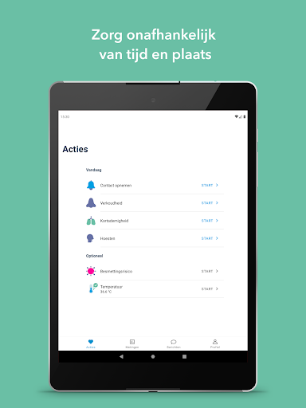
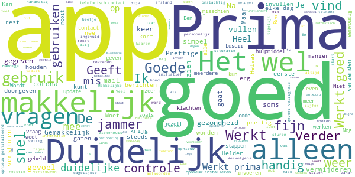
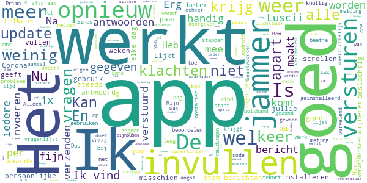
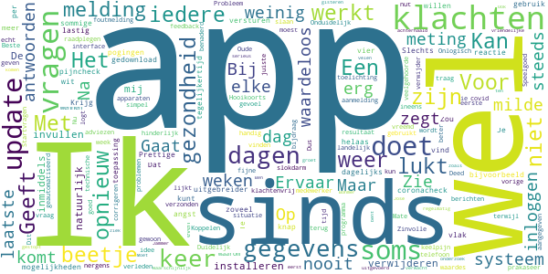
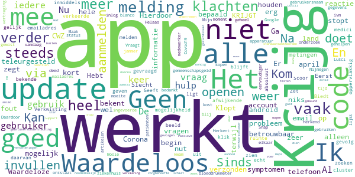

# Luscii
App version ``5.9.1``

Analyzed with [covid-apps-observer](http://github.com/covid-apps-observer) project, version ``0.1``

## App overview
| | |
|-------------------------|-------------------------| 
| **Name**&nbsp;&nbsp;&nbsp;&nbsp;&nbsp;&nbsp;&nbsp;&nbsp;&nbsp;&nbsp;&nbsp;&nbsp;&nbsp;&nbsp;&nbsp;&nbsp;&nbsp;&nbsp;&nbsp;&nbsp;&nbsp;&nbsp;&nbsp;&nbsp;&nbsp;&nbsp;&nbsp;&nbsp;&nbsp;&nbsp;&nbsp;&nbsp;&nbsp;&nbsp;&nbsp;&nbsp;&nbsp;&nbsp;&nbsp;&nbsp;  | Luscii |
| **Unique identifier** | nl.focuscura.beeldbelapp |
| **Link to Google Play** | [https://play.google.com/store/apps/details?id=nl.focuscura.beeldbelapp](https://play.google.com/store/apps/details?id=nl.focuscura.beeldbelapp) |
| **Summary**  | Welkom bij Luscii, de slimste gezondheidsapp voor zorg thuis of onderweg. |
| **Privacy policy** | [https://luscii.com/privacy-policy/](https://luscii.com/privacy-policy/) |
| **Latest version** | 5.9.1 |
| **Last update** | 2021-04-15 13:33:04 |
| **Recent changes** | In deze update algemene verbeteringen en bugfixes. |
| **Installs**  | 100.000+ |
| **Category** | Medisch |
| **First release** | 8 mrt. 2016 |
| **Size**  | 140M |
| **Supported Android version**  | 7.0 en hoger |

### Description
> Wat is Luscii?
 Luscii maakt moderne zorg mogelijk. Met de Luscii app is het op voorschrift van een zorgorganisatie mogelijk om:
 - lichaamswaarden/symptomen in de gaten te houden
 - gerichte educatie te ontvangen over (omgaan met) ziekte of gezondheidsrisico's
 - op afstand te communiceren met zorgverleners
 Hoe werkt het?
 - Mensen dienen zich eerst aan te melden. Dat gaat normaal via een ziekenhuis. In geval van inzet in de corona crisis is aanmelden ook mogelijk op www.olvgcoronacheck.nl
 - De app vraagt dagelijks een aantal lichaamswaarden of symptomen door te geven. Deze zijn gebaseerd op een door zorgverleners voor de gebruiker ingesteld programma. Ook is er educatie in de app en contact op afstand.
 - Achter de app staat een medisch team paraat. Dit beoordeelt de antwoorden die gebruikers geven in de app (ondersteund door de techniek van de app). Als er een medische reden is om contact op te nemen, doen zij dat binnen 24 uur. Dat kan telefonisch of via een bericht. Ook is contact via beeldbellen mogelijk (let op: deze functie gebruikt OLVG corona check nog niet).
 OLVG corona check
 - Door de uitbraak van het coronavirus neemt de zorgvraag toe. Ziekenhuizen bereiden zich hierop voor door nieuwe middelen in te zetten naast de reguliere zorg. Samen met het Amsterdamse ziekenhuis OLVG heeft Luscii daarom de Luscii app hiervoor geschikt gemaakt. We noemen dit OLVG corona check.
 - OLVG corona check is bedoeld om grote groepen mensen met klachten die mogelijk door het coronavirus wordt veroorzaakt op afstand te kunnen begeleiden. Een medisch team beoordeelt de metingen die binnenkomen via de app van Luscii die voor OLVG corona check wordt gebruikt. OLVG corona check is gratis.
 - OLVG corona check is gestart voor mensen in de regio Groot Amsterdam. Er wordt gestreefd de regio's waarin de app beschikbaar is, uit te breiden. Meer informatie is te vinden op www.olvgcoronacheck.nl.
 Medisch hulpmiddel en gegevensverwerking
 Luscii is een CE gemarkeerd medisch hulpmiddel. Gegevens worden verwerkt volgens de Algemene Verordering Gegevensbescherming (AVG). Het privacyreglement en gebruikersvoorwaarden zijn te vinden op www.luscii.com. Luscii is gevestigd in Amsterdam, Nederland.

### User interface
The developers of the app provide the following screenshots in the Google play store.
| | | |
|:-------------------------:|:-------------------------:|:-------------------------:|
 |   |   |   | 
 |   |   |   | 
 |   |   |   | 

## Development team
In the following we report the main information provided by the development team in the Google play store.

| | |
|-------------------------|-------------------------|
| **Developer**  | Luscii Healthtech |
| **Website**  | [http://www.luscii.com](http://www.luscii.com) |
| **Email** | support@luscii.com |
| **Physical address**  | [Spuistraat 114A 1012 VA Amsterdam The Netherlands](https://www.google.com/maps/search/Spuistraat%20114A%201012%20VA%20Amsterdam%20The%20Netherlands) (Google Maps) |
| **Other developed apps**  | [https://play.google.com/store/apps/developer?id=Luscii+Healthtech](https://play.google.com/store/apps/developer?id=Luscii+Healthtech) |

## Android support

| | |
|-------------------------|-------------------------|
| **Declared target Android version**  | - |
| **Effective target Android version**  | - |
| **Minimum supported Android version**  | Nougat, version 7.0 (API level 24) |
| **Maximum target Android version**  | - |

The larger the difference between the minimum and maximum supported Android versions, the better. A larger difference means a wider audience. For example, old phones have a very low Android version, so a high minimum supported Android version means that the app cannot be used by users with old phones, thus leading to accessibility problems. 

## Requested permissions

In the following we report the complete list of the permissions requested by the app. 

| **Permission** | **Protection level** | **Description** | 
|-------------------------|-------------------------|-------------------------|
 **android.permission ACCESS_COARSE_LOCATION** | :warning:**Dangerous** | Allows an app to access approximate location. 
 **android.permission ACCESS_FINE_LOCATION** | :warning:**Dangerous** | Allows an app to access precise location. 
 **android.permission ACCESS_NETWORK_STATE** | Normal | Allows applications to access information about networks. 
 **android.permission ACCESS_NOTIFICATION_POLICY** | Normal | Marker permission for applications that wish to access notification policy. 
 **android.permission ACCESS_WIFI_STATE** | Normal | Allows applications to access information about Wi-Fi networks. 
 **android.permission ACTIVITY_RECOGNITION** | :warning:**Dangerous** | Allows an application to recognize physical activity. 
 **android.permission BLUETOOTH** | Normal | Allows applications to connect to paired bluetooth devices. 
 **android.permission BLUETOOTH_ADMIN** | Normal | Allows applications to discover and pair bluetooth devices. 
 **android.permission CAMERA** | :warning:**Dangerous** | Required to be able to access the camera device. 
 **android.permission DISABLE_KEYGUARD** | Normal | Allows applications to disable the keyguard if it is not secure. 
 **android.permission FOREGROUND_SERVICE** | Normal | Allows a regular application to use Service.startForeground. 
 **android.permission INTERNET** | Normal | Allows applications to open network sockets. 
 **android.permission MODIFY_AUDIO_SETTINGS** | Normal | Allows an application to modify global audio settings. 
 **android.permission READ_EXTERNAL_STORAGE** | :warning:**Dangerous** | Allows an application to read from external storage. 
 **android.permission RECEIVE_BOOT_COMPLETED** | Normal | Allows an application to receive the Intent.ACTION_BOOT_COMPLETED that is broadcast after the system finishes booting. 
 **android.permission RECORD_AUDIO** | :warning:**Dangerous** | Allows an application to record audio. 
 **android.permission REORDER_TASKS** | Normal | Allows an application to change the Z-order of tasks. 
 **android.permission USE_FULL_SCREEN_INTENT** | Normal | Required for apps targeting Build.VERSION_CODES.Q that want to use notification full screen intents. 
 **android.permission VIBRATE** | Normal | Allows access to the vibrator. 
 **android.permission WAKE_LOCK** | Normal | Allows using PowerManager WakeLocks to keep processor from sleeping or screen from dimming. 
 **android.permission WRITE_EXTERNAL_STORAGE** | :warning:**Dangerous** | Allows an application to write to external storage. 
 **com.google.android.c2dm.permission RECEIVE** | - | - 
 **com.google.android.finsky.permission BIND_GET_INSTALL_REFERRER_SERVICE** | - | - 
 **nl.focuscura.beeldbelapp.permission C2D_MESSAGE** | - | - 

## Mentioned servers

| **Server** | **Registrant** | **Registrant country** | **Creation date** | 
|-------------------------|-------------------------|-------------------------|-------------------------|
 | google.com | Google LLC | :us: US | 1997-09-15 04:00:00 |
 | xml.org | OASIS Open | :us: US | 1997-02-03 05:00:00 |
 | xmlpull.org | Privacy service provided by Withheld for Privacy ehf | :iceland: IS | 2001-11-26 20:33:08 |
 | w3.org | W3C | :us: US | 1994-07-06 04:00:00 |
 | googlesyndication.com | Google LLC | :us: US | 2003-01-21 06:17:24 |
 | googleapis.com | Google LLC | :us: US | 2005-01-25 17:52:26 |
 | google-analytics.com | Google LLC | :us: US | 2005-07-18 19:24:32 |
 | googleadservices.com | Google LLC | :us: US | 2003-06-19 16:34:53 |
 | app-measurement.com | Google LLC | :us: US | 2015-06-19 20:13:31 |
 | branch.io | Branch | :us: US | 2011-11-10 13:52:13 |
 | googleapis.com | Google LLC | :us: US | 2005-01-25 17:52:26 |
 | ihealthlabs.com | REDACTED FOR PRIVACY | cn | 2011-10-13 07:43:43 |
 | sematext.com | REDACTED FOR PRIVACY | :us: US | 2007-05-01 03:03:08 |
 | launchdarkly.com | Catamorphic Co. | :us: US | 2014-07-15 17:17:52 |
 | adobe.com | Adobe Inc. | :us: US | 1986-11-17 05:00:00 |
 | apple.com | Apple Inc. | :us: US | 1987-02-19 05:00:00 |
 | aomedia.org | Contact Privacy Inc. Customer 1243324949 | :canada: CA | 2015-08-24 14:07:31 |
 | crashlytics.com | Google LLC | :us: US | 2011-01-21 15:30:40 |
 | amazonaws.com | Amazon.com, Inc. | :us: US | 2005-08-18 02:10:45 |
 | amazonaws.com | Amazon.com, Inc. | :us: US | 2005-08-18 02:10:45 |
 | focuscura.com | REDACTED FOR PRIVACY | :netherlands: NL | 2010-05-20 14:02:28 |
 | luscii.com | Registrant State/Province: Provincie Gelderland | :netherlands: NL | 2018-06-21 09:46:19 |

## Security analysis 

Below we report the main security warnings raised by our execution of the [Androwarn](https://github.com/maaaaz/androwarn) security analysis tool.

**Telephony identifiers leakage**
> - This application reads the ISO country code equivalent of the current registered operator's MCC (Mobile Country Code) 
> - This application reads the MCC+MNC of the provider of the SIM 
> - This application reads the numeric name (MCC+MNC) of current registered operator 
> - This application reads the operator name 

**Connection interfaces exfiltration**
> - This application reads details about the currently active data network 
> - This application tries to find out if the currently active data network is metered 

**Suspicious connection establishment**
> - This application opens a Socket and connects it to the remote address '; port is out of range' on the 'N/A' port  
> - This application opens a Socket and connects it to the remote address 'Lb/d/b/a/a;->U(Ljava/lang/String;)Ljava/lang/StringBuilder;' on the 'N/A' port  
> - This application opens a Socket and connects it to the remote address 'Ljava/lang/StringBuilder;->toString()Ljava/lang/String;' on the 'N/A' port  
> - This application opens a Socket and connects it to the remote address 'Ljava/net/Proxy;->type()Ljava/net/Proxy$Type;' on the 'N/A' port  
> - This application opens a Socket and connects it to the remote address 'Method sendUrgentData() is not supported.' on the 'N/A' port  
> - This application opens a Socket and connects it to the remote address 'Method setHandshakeTimeout() is not supported.' on the 'N/A' port  
> - This application opens a Socket and connects it to the remote address 'Method setOOBInline() is not supported.' on the 'N/A' port  
> - This application opens a Socket and connects it to the remote address 'Method setSoWriteTimeout() is not supported.' on the 'N/A' port  
> - This application opens a Socket and connects it to the remote address 'No route to  ' on the 'N/A' port  
> - This application opens a Socket and connects it to the remote address 'Socket closed' on the 'N/A' port  
> - This application opens a Socket and connects it to the remote address 'Socket is closed' on the 'N/A' port  
> - This application opens a Socket and connects it to the remote address 'Socket is closed.' on the 'N/A' port  
> - This application opens a Socket and connects it to the remote address 'Socket is not connected.' on the 'N/A' port  
> - This application opens a Socket and connects it to the remote address 'socket is closed' on the 'N/A' port  
> - This application opens a Socket and connects it to the remote address 'timeout' on the 'N/A' port  

**Code execution**
> - This application loads a native library 
> - This application loads a native library: 'ECGOffline' 
> - This application loads a native library: 'ECGOnline' 
> - This application loads a native library: 'VidyoClient' 
> - This application loads a native library: 'conscrypt_gmscore_jni' 
> - This application loads a native library: 'conscrypt_jni' 
> - This application loads a native library: 'heartbeat-android' 
> - This application loads a native library: 'heartbeat-lib' 
> - This application loads a native library: 'iHealth' 
> - This application loads a native library: 'sodiumjni' 

## User ratings and reviews

Below we provide information about how end users are reacting to the app in terms of ratings and reviews in the Google Play store.

### Ratings

The Luscii app has been installed by more than **100000** times. At this time, **8069** rated the app and its average score is **4.302843**. Below we show the distribution of the ratings across the usual star-based rating of Google Play

:star::star::star::star::star:: 4509

:star::star::star::star:: 2404

:star::star::star:: 618

:star::star:: 169

:star:: 369

### Reviews 

#### 5-star reviews

> Goed,waar kun je je afmelden als je bent gevaccineerd?  :date: __2021-05-22 09:20:40__

> Ben heel blij met deze app ga zo door!!  :date: __2021-05-21 08:33:01__

> Werkt prima kleine moeite het invullen.  :date: __2021-05-20 15:08:54__

> Makkelijk, duidelijk en snelle reactie.  :date: __2021-05-20 09:19:02__

> Deze app is aan te raden om de natte macula tijdig te herkennen !  :date: __2021-05-17 09:51:45__

> Is oké.  :date: __2021-05-13 09:52:23__

> Heel gebruiks vriendelijk  :date: __2021-05-13 09:25:35__

> Prima app om je situatie realistisch te zien.  :date: __2021-05-10 11:29:44__

> Ik vind het op deze manier heel mooi. Ze kunnen je in de gaten houden terwijl je thuis bent. Zo blijft je toch onder controle. Geweldig.👍  :date: __2021-05-09 09:08:23__

> goeie app, makkelijk om mee te werken.  :date: __2021-05-08 08:02:42__

#### 4-star reviews

> Handig en snel!  :date: __2021-05-21 09:43:02__

> Goed en duidelijk  :date: __2021-05-18 10:26:57__

> Oke  :date: __2021-05-13 11:03:36__

> Makkelijk  :date: __2021-05-12 08:36:09__

> Gewoon heel duidelijk  :date: __2021-05-10 09:23:38__

> Fijn dat er iemand met me mee kijkt.  :date: __2021-05-09 07:49:50__

> Na update met code via email werkt de app niet meer op m,n tablet. Helaas niet meer te gebruiken nu. Naar opnieuw installeren werkt de code via snelkop nog niet maar de code zelf invullen weer wel. Wordt er niet gebruiksvriendelijker op.  :date: __2021-05-05 09:30:57__

> Prima app  :date: __2021-05-05 06:58:52__

> Het is fijn dat de arts op deze wijze controle kan hebben op je medische toestand, het is wel jammer dat je elke dag het zelfde filmpje moet bekijken  :date: __2021-05-02 15:19:43__

> Veel vragen, wel terzake doende  :date: __2021-04-27 11:34:03__

#### 3-star reviews

> Erg gemakkelijk  :date: __2021-05-16 09:39:45__

> Communicatie storingen  :date: __2021-05-12 14:37:50__

> Beoordeling komt nog te vroeg. Heb m net geïnstalleerd. Wanneer ik persoonlijke instellingen wil aanvullen kan ik vervolgens niet opslaan omdat invullen blijft hangen op adres en dan landnaam. Er staat daar pijltje maar dat reageert niet.  :date: __2021-05-06 20:03:33__

> Is nog tekort in gebruik om er iets over te zeggen.Tot nu toe is die erg goed en leuk in gebruik.Is toch fijne iemand te kunnen spreken die er meer verstand van longproblemen heeft.  :date: __2021-05-03 18:19:37__

> De hartslagmeting die werkt niet maakt niet uit hoe je zit of ligt  :date: __2021-05-03 10:37:52__

> Kan kwaliteit niet echt intrinsiek beoordelen. "Lijkt" een beetje knullig.  :date: __2021-04-25 12:40:37__

> Sinds de ochtend van 15 april werkt de App bij mij niet meer.  :date: __2021-04-15 14:05:21__

> Prima te doen  :date: __2021-04-07 06:19:08__

> Handige app  :date: __2021-03-29 13:28:49__

> Correct en tijdig melding voor de meting  :date: __2021-03-25 11:43:57__

#### 2-star reviews

> Te weinig reactie mogelijkheden Slechts 1 meting per dag  :date: __2021-04-21 08:24:21__

> Ik vind sommige vragen op mij niet van toepassing. Ik heb bijvoorbeeld nooit angst. Ervaar alles als lastig dat ik niet meer zoveel kan.  :date: __2021-04-19 13:10:12__

> Na vier pogingen doet hij het weer  :date: __2021-04-15 16:48:43__

> Prettige app maar sinds de update werkt hij niet meer . Je kunt niet uit of inloggen . Krijg een wit vlak....... Ik heb de app gedownload en dan doet hij het weer ..  :date: __2021-02-11 11:27:37__

> Sinds de update werkt de app niet meer. Dat is knap waardeloos want ik gebruik de app dagelijks  :date: __2021-02-06 17:52:47__

> Zou soms iets uitgebreider willen kunnen antwoorden. Gaat helaas niet tegelijkertijd:pijncheck en coronacheck  :date: __2021-02-05 10:01:48__

> Kan in de app geen gegevens meer versturen. Iedere keer foutmelding. Dit sinds 2 weken. Voor die tijd fijne app.  :date: __2020-10-10 09:58:10__

> Probleem met mijn slokdarm, daar prakaseer ik erg over.  :date: __2020-10-08 01:17:14__

> Bij de vragen ook iedere keer de toelichting  :date: __2020-09-25 13:18:12__

> Op dagen dat ik klachten ervaar zegt de app geen klachten. Nu ben ik al 2 dagen klachtenvrij en zegt ie milde klachten. Beetje vreemd. Wel handig systeem maar de berichten slaan nergens op.  :date: __2020-09-18 11:30:36__

#### 1-star reviews

> Sinds kort wordt alleen het cluster bekende klachten gevraagd. Scoor je daar niet op stopt het ook gelijk weer. Geen ruimte voor afwijkende symptomen, heel erg oppervlakkig en dus absoluut niet betrouwbaar.  :date: __2021-05-13 10:05:17__

> Steeds ligt de app er uit. Geeft niets door  :date: __2021-04-19 21:11:47__

> Klopt niets van  :date: __2021-04-18 07:22:56__

> Het is niet mogelijk om me aan te melden na de update van 14 april 22 . Het werkt inmiddels weer!  :date: __2021-04-15 22:18:51__

> Na de update van 14 april kan ik me niet meer aanmelden.  :date: __2021-04-15 07:11:35__

> Kan me niet aanmelden na de update  :date: __2021-04-15 06:55:28__

> Waardeloos, Krijg steeds te zien emailadres niet bekent, terwijl dat wel bekent is bij CWZ dan klik ik op aanmelden, dan blijft hij alleen maar zoeken..  :date: __2021-04-12 12:42:45__

> Biedt geen mogelijkheid een echt beeld weer te geven. Zet als gevolg daarvan de medici mogelijk op het verkeerde been. Verkwisting van gemeenschapsgeld  :date: __2021-04-08 09:14:19__

> Het werkt heel goed. Mooie apparatuur en in het begin kwam ik niet uit de bloeddrukmeter en ben ik door een medewerker van Lusci heel goed geholpen.  :date: __2021-03-19 08:12:03__

> Werkt niet meer na update  :date: __2021-02-12 23:55:01__

