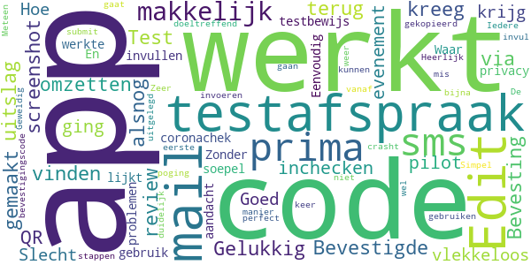
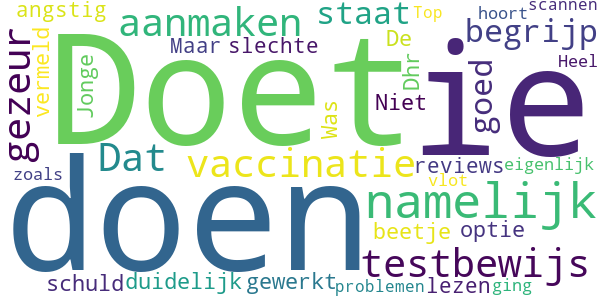

# CoronaCheck
App version ``1.3.0``

Analyzed with [covid-apps-observer](http://github.com/covid-apps-observer) project, version ``0.1``

## App overview
| | |
|-------------------------|-------------------------| 
| **Name**&nbsp;&nbsp;&nbsp;&nbsp;&nbsp;&nbsp;&nbsp;&nbsp;&nbsp;&nbsp;&nbsp;&nbsp;&nbsp;&nbsp;&nbsp;&nbsp;&nbsp;&nbsp;&nbsp;&nbsp;&nbsp;&nbsp;&nbsp;&nbsp;&nbsp;&nbsp;&nbsp;&nbsp;&nbsp;&nbsp;&nbsp;&nbsp;&nbsp;&nbsp;&nbsp;&nbsp;&nbsp;&nbsp;&nbsp;&nbsp;  | CoronaCheck |
| **Unique identifier** | nl.rijksoverheid.ctr.holder |
| **Link to Google Play** | [https://play.google.com/store/apps/details?id=nl.rijksoverheid.ctr.holder](https://play.google.com/store/apps/details?id=nl.rijksoverheid.ctr.holder) |
| **Summary**  | Krijg toegang na testen |
| **Privacy policy** | [https://coronacheck.nl/nl/privacy](https://coronacheck.nl/nl/privacy) |
| **Latest version** | 1.3.0 |
| **Last update** | 2021-05-08 09:06:00 |
| **Recent changes** | - De app is nu ook beschikbaar in het Engels - Er is een scherm met informatie over toegankelijkheid toegevoegd - Diverse verbeteringen op het gebied van toegankelijkheid - Diverse bugs zijn opgelost |
| **Installs**  | 50.000+ |
| **Category** | Tools |
| **First release** | 17 mrt. 2021 |
| **Size**  | 37M |
| **Supported Android version**  | 6.0 en hoger |

### Description
> CoronaCheck is de officiële testbewijs-app van Nederland, ontwikkeld door het Ministerie van Volksgezondheid, Welzijn en Sport. Het is een digitaal hulpmiddel om toegang te krijgen tot bepaalde sociale, culturele of sportieve locaties in Nederland. Dat kan alleen als je op het moment van testen geen corona had.
 CoronaCheck kan worden gebruikt bij vooraf aangekondigde evenementen, zoals de interland Nederland - Letland op 27 maart.
  
 Hoe werkt de app?
 Belangrijk: maak eerst een afspraak voor een coronatest bij een testlocatie.
  
 - Haal je testresultaat op in de app
 Als het resultaat van jouw coronatest bekend is, haal je het testresultaat op in de app. Je vult daarvoor een code in die je van de testlocatie hebt gekregen.
  
 - Maak van je testresultaat een QR-code
 De app maakt van jouw negatieve testresultaat een QR-code. In deze QR-code staat alleen of en wanneer je negatief getest bent.
  
 - Laat jouw QR-code zien bij de ingang
 Bij de ingang wordt deze QR-code gescand - als bewijs dat je geen corona had op het moment van de test.
  
 - Testresultaat is 40 uur geldig
 Een negatief testresultaat is geldig tot 40 uur na het moment van testen. Zorg dus dat jouw QR-code binnen die tijd gescand is aan de deur. Als je testbewijs verloopt verdwijnt de QR-code uit de app. Nieuwe QR-code nodig? Laat je opnieuw testen.

### User interface
The developers of the app provide the following screenshots in the Google play store.
| | | |
|:-------------------------:|:-------------------------:|:-------------------------:|
 |   |   |   | 
 |   |  

## Development team
In the following we report the main information provided by the development team in the Google play store.

| | |
|-------------------------|-------------------------|
| **Developer**  | Rijksoverheid |
| **Website**  | [https://coronacheck.nl](https://coronacheck.nl) |
| **Email** | helpdesk@coronacheck.nl |
| **Physical address**  | - |
| **Other developed apps**  | [https://play.google.com/store/apps/developer?id=Rijksoverheid](https://play.google.com/store/apps/developer?id=Rijksoverheid) |

## Android support

| | |
|-------------------------|-------------------------|
| **Declared target Android version**  | - |
| **Effective target Android version**  | - |
| **Minimum supported Android version**  | Marshmallow, version 6.0 (API level 23) |
| **Maximum target Android version**  | - |

The larger the difference between the minimum and maximum supported Android versions, the better. A larger difference means a wider audience. For example, old phones have a very low Android version, so a high minimum supported Android version means that the app cannot be used by users with old phones, thus leading to accessibility problems. 

## Requested permissions

In the following we report the complete list of the permissions requested by the app. 

| **Permission** | **Protection level** | **Description** | 
|-------------------------|-------------------------|-------------------------|
 **android.permission ACCESS_NETWORK_STATE** | Normal | Allows applications to access information about networks. 
 **android.permission INTERNET** | Normal | Allows applications to open network sockets. 

## Mentioned servers

| **Server** | **Registrant** | **Registrant country** | **Creation date** | 
|-------------------------|-------------------------|-------------------------|-------------------------|
 | google.com | Google LLC | :us: US | 1997-09-15 04:00:00 |
 | googleapis.com | Google LLC | :us: US | 2005-01-25 17:52:26 |
 | ggdghor.nl | - | - | 2014-03-06 00:00:00 |
 | coronacheck.nl | - | - | 2020-02-25 00:00:00 |

## Security analysis 

Below we report the main security warnings raised by our execution of the [Androwarn](https://github.com/maaaaz/androwarn) security analysis tool.

**Telephony identifiers leakage**
> - This application reads the MCC+MNC of the provider of the SIM 

**Connection interfaces exfiltration**
> - This application reads details about the currently active data network 
> - This application tries to find out if the currently active data network is metered 

**Suspicious connection establishment**
> - This application opens a Socket and connects it to the remote address ' returned no addresses for  ; port is out of range' on the 'N/A' port  
> - This application opens a Socket and connects it to the remote address '' on the 'N/A' port  
> - This application opens a Socket and connects it to the remote address 'Ljava/lang/StringBuilder;->toString()Ljava/lang/String;' on the 'N/A' port  
> - This application opens a Socket and connects it to the remote address 'Ljava/net/Proxy;->type()Ljava/net/Proxy$Type;' on the 'N/A' port  
> - This application opens a Socket and connects it to the remote address 'timeout' on the 'N/A' port  

**Code execution**
> - This application loads a native library: 'barhopper_v2' 
> - This application loads a native library: 'gojni' 

## User ratings and reviews

Below we provide information about how end users are reacting to the app in terms of ratings and reviews in the Google Play store.

### Ratings

The CoronaCheck app has been installed by more than **50000** times. At this time, **75** rated the app and its average score is **2.9733334**. Below we show the distribution of the ratings across the usual star-based rating of Google Play

:star::star::star::star::star:: 28

:star::star::star::star:: 9

:star::star::star:: 3

:star::star:: 3

:star:: 32

### Reviews 

#### 5-star reviews

> Bevestigde testafspraak is niet terug te vinden in de app. Gelukkig had ik een screenshot gemaakt. Edit: Bevesting testafspraak kreeg ik alsnog na mijn review via de mail. Test uitslag omzetten naar QR en inchecken voor het pilot evenement ging vlekkeloos, prima app.  :date: __2021-04-27 09:33:27__

> Goed  :date: __2021-04-24 14:26:11__

> Slecht!!!!! Hoe krijg ik het testbewijs met coronachek. Waar de code invullen?  :date: __2021-04-24 11:12:47__

> App werkte soepel. Eenvoudig in gebruik. En lijkt ook aandacht voor privacy.  :date: __2021-04-23 17:11:49__

> Prima app. Zonder problemen code uit de mail gekopieerd en bevestigingscode uit sms kunnen invoeren. Simpel en doeltreffend. Heerlijk om er op deze manier weer op uit te kunnen.  :date: __2021-04-16 16:06:36__

> Zeer makkelijk te gebruiken. De stappen worden duidelijk uitgelegd, kan bijna niet mis gaan.  :date: __2021-04-14 19:04:07__

> Meteen vanaf de eerste poging werkt alles perfect.  :date: __2021-04-14 15:57:18__

> Geweldig dat het zo makkelijk gaat  :date: __2021-04-07 17:18:39__

> App werkt niet. Iedere keer als ik de SMS code invul en submit crasht de app... [edit: werkt nu wel!]  :date: __2021-03-27 12:24:35__

#### 4-star reviews

> Doet wat ie moet doen, namelijk het testbewijs aanmaken. Dat gezeur over de vaccinatie begrijp ik niet zo goed; staat toch duidelijk vermeld dat aan die optie nog wordt gewerkt?! Niet alles is de schuld van Dhr. De Jonge.  :date: __2021-05-29 12:06:39__

> Was een beetje angstig na het lezen van wat slechte reviews. Maar eigenlijk ging alles zoals het hoort. Heel vlot, geen problemen met scannen. Top!  :date: __2021-04-25 20:09:22__

#### 3-star reviews

> Wanneer zie ik hier mijn vaccinatie status terug?  :date: __2021-05-03 07:20:50__

> Jammer dat er maar voor 1 persoon een QR code kan worden aangemaakt. Zou handig zijn als een heel gezin erin gezet kan worden. Dan hoeft niet iedereen de app te hebben en te tonen. En kan ook een mobielloze partner gewoon een code krijgen.  :date: __2021-04-19 15:55:14__

#### 2-star reviews

> Waardeloze app, er wordt nieteens de vaccinatie in mee genomen  :date: __2021-05-28 22:55:00__

> Werkt één keer goed, daarna niet meer. Donderdag negatieve test, omgezet in qr code, vrijdag verdwenen. Gister negatieve test, vanochtend omgezet in qr code, vanavond verdwenen en niet opnieuw om te zetten. Gelukkig werd de email ook geaccepteerd  :date: __2021-04-19 23:29:00__

> Werkt dus weer niet op Android 10 met tablet samsung galaxy tab 9.helaas maar waar.  :date: __2021-04-10 08:56:30__

#### 1-star reviews

> Een aflevering die je aan het kijken bent, herstart (met de benodigde reclames) regelmatig midden in de aflevering. Doorspoelen naar waar je gebleven was duurt ook weer een eeuwigheid omdat daar ook reclames aan voorafgaan.  :date: __2021-05-28 20:32:34__

> Hier heb je niks aan.. ben je gevaccineerd moet je nog testen..  :date: __2021-05-28 19:38:08__

> Dat eeuwige gezeur over privacy Ik wil deze app gewoon gebruiken zonder die tests. Heb al corona gehad...  :date: __2021-05-28 13:43:14__

> 2x gevaccineerd. Kan geen code krijgen.Volslagen nutteloze app.  :date: __2021-05-26 19:30:23__

> Ben tweemaal gevaccineerd en heel voorzichtig geweest het afgelopen anderhalf jaar. Voel mij top met mijn 72e jaar. Dus wil gewoon kunnen inloggen met mijn vaccinatiebewijs van het Rode Kruis.  :date: __2021-05-26 19:20:11__

> Belachelijk dat je vaccinatie er nog steeds niet in kan staan. Al dat gezeur over privacy. Laat mensen gewoon wel of geen toestemming geven.  :date: __2021-05-25 22:53:48__

> Alleen geschikt voor test nog niet voor vaccinatie. Maar weer verwijderd  :date: __2021-05-24 12:44:09__

> Kan nog niet bij vaccinatiegegevens.  :date: __2021-05-24 12:04:07__

> Ik ben 2 keer gevaccineerd en nu ??? Kan ik nu ook een af code krijgen? Deze app is van Hugo het als hij werkt het natuurlijk niet Ik zal deze app verwijderen, het enige wat deze app doet is nutteloze ruimte in nemen, net als Hugo  :date: __2021-05-22 12:25:56__

> Vraag me af de overheid kennende of de vacinatie op tijd er bij staat voor zo lang 1 ster  :date: __2021-05-22 10:51:01__

