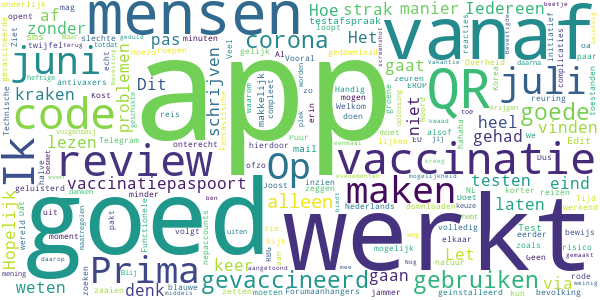
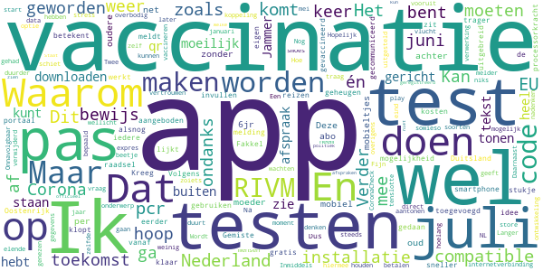
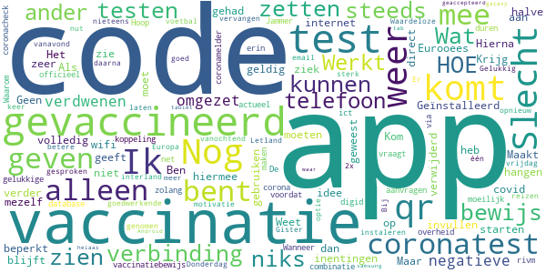

# CoronaCheck
App version ``1.4.0``

Analyzed with [covid-apps-observer](http://github.com/covid-apps-observer) project, version ``0.1``

## App overview
| | |
|-------------------------|-------------------------| 
| **Name**                                          | CoronaCheck |
| **Unique identifier** | nl.rijksoverheid.ctr.holder |
| **Link to Google Play** | [https://play.google.com/store/apps/details?id=nl.rijksoverheid.ctr.holder](https://play.google.com/store/apps/details?id=nl.rijksoverheid.ctr.holder) |
| **Summary**  | Krijg toegang na testen |
| **Privacy policy** | [https://coronacheck.nl/nl/privacy](https://coronacheck.nl/nl/privacy) |
| **Latest version** | 1.4.0 |
| **Last update** | 2021-05-30 09:17:23 |
| **Recent changes** | * Enkele teksten zijn aangepast * Het scherm “Waar ben je getest†is verwijderd |
| **Installs**  | 100.000+ |
| **Category** | Tools |
| **First release** | 17 mrt. 2021 |
| **Size**  | 37M |
| **Supported Android version**  | 6.0 en hoger |

### Description
> CoronaCheck is de officiële testbewijs-app van Nederland, ontwikkeld door het Ministerie van Volksgezondheid, Welzijn en Sport. Het is een digitaal hulpmiddel om toegang te krijgen tot bepaalde sociale, culturele of sportieve locaties in Nederland. Dat kan alleen als je op het moment van testen geen corona had.
  
 Hoe werkt de app?
 Belangrijk: maak eerst een afspraak voor een coronatest bij een testlocatie.
  
 - Haal je testresultaat op in de app
 Als het resultaat van jouw coronatest bekend is, haal je het testresultaat op in de app. Je vult daarvoor een code in die je van de testlocatie hebt gekregen.
  
 - Maak van je testresultaat een QR-code
 De app maakt van jouw negatieve testresultaat een QR-code. In deze QR-code staat alleen of en wanneer je negatief getest bent.
  
 - Laat jouw QR-code zien bij de ingang
 Bij de ingang wordt deze QR-code gescand - als bewijs dat je geen corona had op het moment van de test.
  
 - Testresultaat is 40 uur geldig
 Een negatief testresultaat is geldig tot 40 uur na het moment van testen. Zorg dus dat jouw QR-code binnen die tijd gescand is aan de deur. Als je testbewijs verloopt verdwijnt de QR-code uit de app. Nieuwe QR-code nodig? Laat je opnieuw testen.

### User interface
The developers of the app provide the following screenshots in the Google play store.
| | | |
|:-------------------------:|:-------------------------:|:-------------------------:|
 |   |   |   | 
 |   |  

## Development team
In the following we report the main information provided by the development team in the Google play store.

| | |
|-------------------------|-------------------------|
| **Developer**  | Rijksoverheid |
| **Website**  | [https://coronacheck.nl](https://coronacheck.nl) |
| **Email** | helpdesk@coronacheck.nl |
| **Physical address**  | - |
| **Other developed apps**  | [https://play.google.com/store/apps/developer?id=Rijksoverheid](https://play.google.com/store/apps/developer?id=Rijksoverheid) |

## Android support

| | |
|-------------------------|-------------------------|
| **Declared target Android version**  | - |
| **Effective target Android version**  | - |
| **Minimum supported Android version**  | Marshmallow, version 6.0 (API level 23) |
| **Maximum target Android version**  | - |

The larger the difference between the minimum and maximum supported Android versions, the better. A larger difference means a wider audience. For example, old phones have a very low Android version, so a high minimum supported Android version means that the app cannot be used by users with old phones, thus leading to accessibility problems. 

## Requested permissions

In the following we report the complete list of the permissions requested by the app. 

| **Permission** | **Protection level** | **Description** | 
|-------------------------|-------------------------|-------------------------|
 **android.permission ACCESS_NETWORK_STATE** | Normal | Allows applications to access information about networks. 
 **android.permission INTERNET** | Normal | Allows applications to open network sockets. 

## Mentioned servers

| **Server** | **Registrant** | **Registrant country** | **Creation date** | 
|-------------------------|-------------------------|-------------------------|-------------------------|
 | google.com | Google LLC | :us: US | 1997-09-15 04:00:00 |
 | googleapis.com | Google LLC | :us: US | 2005-01-25 17:52:26 |
 | ggdghor.nl | - | - | 2014-03-06 00:00:00 |
 | coronacheck.nl | - | - | 2020-02-25 00:00:00 |

## Security analysis 

Below we report the main security warnings raised by our execution of the [Androwarn](https://github.com/maaaaz/androwarn) security analysis tool.

**Telephony identifiers leakage**
> - This application reads the MCC+MNC of the provider of the SIM 

**Connection interfaces exfiltration**
> - This application reads details about the currently active data network 
> - This application tries to find out if the currently active data network is metered 

**Suspicious connection establishment**
> - This application opens a Socket and connects it to the remote address ' returned no addresses for  ; port is out of range' on the 'N/A' port  
> - This application opens a Socket and connects it to the remote address '' on the 'N/A' port  
> - This application opens a Socket and connects it to the remote address 'Ljava/lang/StringBuilder;->toString()Ljava/lang/String;' on the 'N/A' port  
> - This application opens a Socket and connects it to the remote address 'Ljava/net/Proxy;->type()Ljava/net/Proxy$Type;' on the 'N/A' port  
> - This application opens a Socket and connects it to the remote address 'timeout' on the 'N/A' port  

**Code execution**
> - This application loads a native library: 'barhopper_v2' 
> - This application loads a native library: 'gojni' 

## User ratings and reviews

Below we provide information about how end users are reacting to the app in terms of ratings and reviews in the Google Play store.

### Ratings

The CoronaCheck app has been installed by more than **100000** times. At this time, **163** rated the app and its average score is **2.54**. Below we show the distribution of the ratings across the usual star-based rating of Google Play

:star::star::star::star::star:: 48

:star::star::star::star:: 11

:star::star::star:: 9

:star::star:: 8

:star:: 87

### Reviews 

#### 5-star reviews

> Werkt goed! Iedereen zou de app moeten gebruiken.  :date: __2021-06-05 19:49:38__

> Ik zie heel veel reacties van waarom je je nog moet laten testen. Ik denk dat het als volgt is: Op dit moment kunnen de mensen na 1987 (volgensmij) nog besmet worden, ook als jij een vaccinatie hebt gehad want corona gaat niet weg. Dit is een goede oplossing totdat iedereen de keuze heeft gehad voor een vaccinatie, als er daarna nog mensen heftige corona krijgen is het aan hun zelf te danken. Maar tot nu toe is dit even een goede manier denk ik.  :date: __2021-06-05 11:55:40__

> Mensen gebruiken de reviews om hun mening te uiten over de corona maatregelen. Dit is daar niet de geschikte plek voor en heeft ook niets met de app te maken. Blij dat de app de mogelijkheid biedt mij naar evenementen te laten gaan middels testen. Hopelijk, als ik eenmaal zelf gevaccineerd ben, kunnen die ook worden aangetoond met de app :) beetje geduld daarop kan geen kwaad.  :date: __2021-06-05 09:56:44__

> Nog weinig mee  :date: __2021-06-04 17:35:36__

> Vakantie  :date: __2021-05-31 15:02:52__

> Bevestigde testafspraak is niet terug te vinden in de app. Gelukkig had ik een screenshot gemaakt. Edit: Bevesting testafspraak kreeg ik alsnog na mijn review via de mail. Test uitslag omzetten naar QR en inchecken voor het pilot evenement ging vlekkeloos, prima app.  :date: __2021-04-27 09:33:27__

> Goed  :date: __2021-04-24 14:26:11__

> Slecht!!!!! Hoe krijg ik het testbewijs met coronachek. Waar de code invullen?  :date: __2021-04-24 11:12:47__

> App werkte soepel. Eenvoudig in gebruik. En lijkt ook aandacht voor privacy.  :date: __2021-04-23 17:11:49__

> Prima app. Zonder problemen code uit de mail gekopieerd en bevestigingscode uit sms kunnen invoeren. Simpel en doeltreffend. Heerlijk om er op deze manier weer op uit te kunnen.  :date: __2021-04-16 16:06:36__

#### 4-star reviews

> Doet wat ie moet doen, namelijk het testbewijs aanmaken. Dat gezeur over de vaccinatie begrijp ik niet zo goed; staat toch duidelijk vermeld dat aan die optie nog wordt gewerkt?! Niet alles is de schuld van Dhr. De Jonge.  :date: __2021-05-29 12:06:39__

> Was een beetje angstig na het lezen van wat slechte reviews. Maar eigenlijk ging alles zoals het hoort. Heel vlot, geen problemen met scannen. Top!  :date: __2021-04-25 20:09:22__

#### 3-star reviews

> Hoop wel dat de vaccinatie er eind JUNI in kunnen staan zoals in EU bepaald. Maar in NL is alles veel te traag dus zal wel met een of andere smoes weer veel later worden. We zijn tenslotte in januari gaan vaccineren en dan ga je in mei pas over zoiets nadenken Een beetje meer toekomst gericht vooruit denken kan de politiek hier niet  :date: __2021-06-06 13:16:45__

> Jammer dat je niet kunt zien welke afspraken je hebt. Verder wel een makkelijk app.  :date: __2021-06-06 00:10:11__

> Als ik bij het maken van een afspraak voor testen kom, bij testen voor toegang. Word heel de tekst samengeknepen op mijn scherm. En sommige tekst blokjes vallen buiten beeld.  :date: __2021-06-04 21:50:21__

> *Doet wat hij moet doen: een qr code aanmaken en tonen. *Maar: de routing in de app is voor verbetering vatbaar. Ik moet vier (!) keer klikken op 'maak een afspraak' in even zo veel verschillende schermen voordat ik daadwerkelijk een afspraak kán maken. Én daarvoor wordt ik dan ook nog doorgeleid naar een website buiten de app. Dat kan (véél) beter..  :date: __2021-06-03 14:02:21__

> Puur gericht op testen, nog niet voór vaccinatie.  :date: __2021-06-01 12:59:50__

> Wanneer zie ik hier mijn vaccinatie status terug?  :date: __2021-05-03 07:20:50__

> Jammer dat er maar voor 1 persoon een QR code kan worden aangemaakt. Zou handig zijn als een heel gezin erin gezet kan worden. Dan hoeft niet iedereen de app te hebben en te tonen. En kan ook een mobielloze partner gewoon een code krijgen.  :date: __2021-04-19 15:55:14__

#### 2-star reviews

> Bij mij komt een app niet zo sterk over als er over voetbal wordt gesproken. (interland Letland....😕). Er is toch een veel veel betere motivatie aan te geven?  :date: __2021-06-06 08:38:50__

> Nog steeds geen optie voor reizen in Europa!  :date: __2021-06-04 13:17:01__

> Waardeloze app, er wordt nieteens de vaccinatie in mee genomen  :date: __2021-05-28 22:55:00__

> Werkt één keer goed, daarna niet meer. Donderdag negatieve test, omgezet in qr code, vrijdag verdwenen. Gister negatieve test, vanochtend omgezet in qr code, vanavond verdwenen en niet opnieuw om te zetten. Gelukkig werd de email ook geaccepteerd  :date: __2021-04-19 23:29:00__

> Werkt dus weer niet op Android 10 met tablet samsung galaxy tab 9.helaas maar waar.  :date: __2021-04-10 08:56:30__

#### 1-star reviews

> Hahaha  :date: __2021-06-05 18:22:52__

> totale hysterie. ophaalcode, toegangscode verificatie code. ben en er vast nog wel een paar vergeten. onze overheid is volledig verbelastingdiensted. burofascisme  :date: __2021-06-05 15:07:44__

> Zolang vaccinaties niet meetellen een ronduit waardeloze app  :date: __2021-06-05 13:48:13__

> Absurd dat je met vaccinatie of na besmetting alsnog moet laten testen. En dan zeuren over de kosten. En voor reizen zijn deze wél goed. Bah.  :date: __2021-06-05 11:37:04__

> Kijk het is zoals het al 17 maanden gaat, chaotisch, ongenuanceerd en een hoop ruttedoctrine. Doodziek van deze prutsers uit de ministeries en de Politiek. Laat het echt aan medici over en qua apps aan techneuten  :date: __2021-06-05 00:03:48__

> Prachtige app waar Xi Jingpin en Kim Jong-Un jaloers op zullen zijn. Uitstekend om een tweedeling in de maatschappij te bouwen. Iedereen die een andere mening if geweten heeft dan de Grote Leiders zullen prima als tweederangs burgers kunnen worden weggezet. Ik ben zelf wel gevaccineerd maar ik gun ieder het vrije recht op een eigen echt vrije keuze.  :date: __2021-06-04 23:59:33__

> Nog steeds geen duidelijkheid over mensen die al corona hebben gehad, en of 1 prik dan volstaat als volledige vaccinatie. Daarnaast is leven via een app belachelijke manier van een 'samen'leving. De overheid moet zich kapotschamen.  :date: __2021-06-04 23:54:40__

> Een puin app, zorg eerst maar eens dat die gaat doen wat die moet doen voordat je zo'n app online gooit. En dan bedoel ik wanneer je al gevac bent, je dat dan kan aan geven pruts werk van de bovenste plank iets uitbrengen wat nog niet voor 25% werkt. Heeft Hugo dit bedacht? Ja ik denk het wel.  :date: __2021-06-04 23:31:57__

> Werkt alleen als je een test hebt gehad.  :date: __2021-06-04 23:25:06__

> Zeer zeer slechte app al 2 maal gevaccineerd en onze overheid heeft hun bende weer niet op orde. Pas juli, kunnen jullie wel iets fatsoenlijk bouwen of is 1,1 miljard te weinig om een fatsoenlijke app te bouwen.  :date: __2021-06-04 22:18:58__

