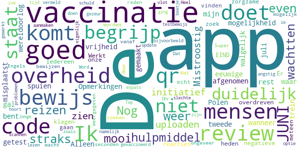
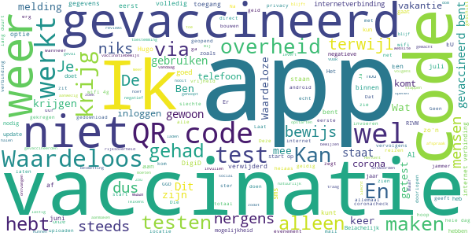

# CoronaCheck
App version ``1.4.0``

Analyzed with [covid-apps-observer](http://github.com/covid-apps-observer) project, version ``0.1``

## App overview
| | |
|-------------------------|-------------------------| 
| **Name**&nbsp;&nbsp;&nbsp;&nbsp;&nbsp;&nbsp;&nbsp;&nbsp;&nbsp;&nbsp;&nbsp;&nbsp;&nbsp;&nbsp;&nbsp;&nbsp;&nbsp;&nbsp;&nbsp;&nbsp;&nbsp;&nbsp;&nbsp;&nbsp;&nbsp;&nbsp;&nbsp;&nbsp;&nbsp;&nbsp;&nbsp;&nbsp;&nbsp;&nbsp;&nbsp;&nbsp;&nbsp;&nbsp;&nbsp;&nbsp;  | CoronaCheck |
| **Unique identifier** | nl.rijksoverheid.ctr.holder |
| **Link to Google Play** | [https://play.google.com/store/apps/details?id=nl.rijksoverheid.ctr.holder](https://play.google.com/store/apps/details?id=nl.rijksoverheid.ctr.holder) |
| **Summary**  | Krijg toegang na testen |
| **Privacy policy** | [https://coronacheck.nl/nl/privacy](https://coronacheck.nl/nl/privacy) |
| **Latest version** | 1.4.0 |
| **Last update** | 2021-05-30 09:17:23 |
| **Recent changes** | * Enkele teksten zijn aangepast * Het scherm “Waar ben je getest” is verwijderd |
| **Installs**  | 100.000+ |
| **Category** | Tools |
| **First release** | 17 mrt. 2021 |
| **Size**  | 37M |
| **Supported Android version**  | 6.0 en hoger |

### Description
> CoronaCheck is de officiële testbewijs-app van Nederland, ontwikkeld door het Ministerie van Volksgezondheid, Welzijn en Sport. Het is een digitaal hulpmiddel om toegang te krijgen tot bepaalde sociale, culturele of sportieve locaties in Nederland. Dat kan alleen als je op het moment van testen geen corona had.
  
 Hoe werkt de app?
 Belangrijk: maak eerst een afspraak voor een coronatest bij een testlocatie.
  
 - Haal je testresultaat op in de app
 Als het resultaat van jouw coronatest bekend is, haal je het testresultaat op in de app. Je vult daarvoor een code in die je van de testlocatie hebt gekregen.
  
 - Maak van je testresultaat een QR-code
 De app maakt van jouw negatieve testresultaat een QR-code. In deze QR-code staat alleen of en wanneer je negatief getest bent.
  
 - Laat jouw QR-code zien bij de ingang
 Bij de ingang wordt deze QR-code gescand - als bewijs dat je geen corona had op het moment van de test.
  
 - Testresultaat is 40 uur geldig
 Een negatief testresultaat is geldig tot 40 uur na het moment van testen. Zorg dus dat jouw QR-code binnen die tijd gescand is aan de deur. Als je testbewijs verloopt verdwijnt de QR-code uit de app. Nieuwe QR-code nodig? Laat je opnieuw testen.

### User interface
The developers of the app provide the following screenshots in the Google play store.
| | | |
|:-------------------------:|:-------------------------:|:-------------------------:|
 |   |   |   | 
 |   |  

## Development team
In the following we report the main information provided by the development team in the Google play store.

| | |
|-------------------------|-------------------------|
| **Developer**  | Rijksoverheid |
| **Website**  | [https://coronacheck.nl](https://coronacheck.nl) |
| **Email** | helpdesk@coronacheck.nl |
| **Physical address**  | - |
| **Other developed apps**  | [https://play.google.com/store/apps/developer?id=Rijksoverheid](https://play.google.com/store/apps/developer?id=Rijksoverheid) |

## Android support

| | |
|-------------------------|-------------------------|
| **Declared target Android version**  | - |
| **Effective target Android version**  | - |
| **Minimum supported Android version**  | Marshmallow, version 6.0 (API level 23) |
| **Maximum target Android version**  | - |

The larger the difference between the minimum and maximum supported Android versions, the better. A larger difference means a wider audience. For example, old phones have a very low Android version, so a high minimum supported Android version means that the app cannot be used by users with old phones, thus leading to accessibility problems. 

## Requested permissions

In the following we report the complete list of the permissions requested by the app. 

| **Permission** | **Protection level** | **Description** | 
|-------------------------|-------------------------|-------------------------|
 **android.permission ACCESS_NETWORK_STATE** | Normal | Allows applications to access information about networks. 
 **android.permission INTERNET** | Normal | Allows applications to open network sockets. 

## Mentioned servers

| **Server** | **Registrant** | **Registrant country** | **Creation date** | 
|-------------------------|-------------------------|-------------------------|-------------------------|
 | google.com | Google LLC | :us: US | 1997-09-15 04:00:00 |
 | googleapis.com | Google LLC | :us: US | 2005-01-25 17:52:26 |
 | ggdghor.nl | - | - | 2014-03-06 00:00:00 |
 | coronacheck.nl | - | - | 2020-02-25 00:00:00 |

## Security analysis 

Below we report the main security warnings raised by our execution of the [Androwarn](https://github.com/maaaaz/androwarn) security analysis tool.

**Telephony identifiers leakage**
> - This application reads the MCC+MNC of the provider of the SIM 

**Connection interfaces exfiltration**
> - This application reads details about the currently active data network 
> - This application tries to find out if the currently active data network is metered 

**Suspicious connection establishment**
> - This application opens a Socket and connects it to the remote address ' returned no addresses for  ; port is out of range' on the 'N/A' port  
> - This application opens a Socket and connects it to the remote address '' on the 'N/A' port  
> - This application opens a Socket and connects it to the remote address 'Ljava/lang/StringBuilder;->toString()Ljava/lang/String;' on the 'N/A' port  
> - This application opens a Socket and connects it to the remote address 'Ljava/net/Proxy;->type()Ljava/net/Proxy$Type;' on the 'N/A' port  
> - This application opens a Socket and connects it to the remote address 'timeout' on the 'N/A' port  

**Code execution**
> - This application loads a native library: 'barhopper_v2' 
> - This application loads a native library: 'gojni' 

## User ratings and reviews

Below we provide information about how end users are reacting to the app in terms of ratings and reviews in the Google Play store.

### Ratings

The CoronaCheck app has been installed by more than **100000** times. At this time, **163** rated the app and its average score is **2.54**. Below we show the distribution of the ratings across the usual star-based rating of Google Play

:star::star::star::star::star:: 48

:star::star::star::star:: 11

:star::star::star:: 9

:star::star:: 8

:star:: 87

### Reviews 

#### 5-star reviews

> Al gedownload en vanaf 25 juni kun je de QR downloaden voor NL en vanaf 1 juli voor o.a. de EU  :date: __2021-06-21 09:11:30__

> App werkt zoals hij moet.  :date: __2021-06-21 02:14:34__

> Veel Forumaanhangers en antivaxers hebben de app alleen geinstalleerd om de app en het vaccinatiepaspoort af te kraken. Op Telegram roepen ze elkaar op om oa met nepaccounts veel reuring en twijfel te zaaien. Het moet dan lijken alsof de halve bevolking tegen het vaccinatiepaspoort is. Handig om te weten bij het lezen van de reviews...  :date: __2021-06-20 21:26:35__

> Prima dat het via deze app straks mogelijk is te reizen. Overheid pakt het goed aan,alleen mensen lezen niet en kraken deze app gelijk af ..zo jammer.  :date: __2021-06-20 08:41:08__

> Doet wat het moet doen, en de mensen die zeuren over dat ze nog geen vaccinatie QR kunnen maken/inzien: dit kan pas eind Juni! (Kost je echt maar een paar minuten zoeken, korter dan het schrijven van een onterecht slechte review hahaha).  :date: __2021-06-19 16:33:43__

> Hoe kan k mijn vaccinatie erin zetten?  :date: __2021-06-18 21:23:57__

> Goed  :date: __2021-06-18 19:30:50__

> Let op: ben je volledig gevaccineerd en wil je een Nederlands bewijs maken? Dat kan vanaf eind juni!!!  :date: __2021-06-18 19:28:15__

> LET EROP: een QR-code voor gevaccineerde werkt pas op 1 juli. Dus wat andere schrijven, dat het niet werkt, hebben niet goed geluisterd naar Het Rijk.  :date: __2021-06-18 13:51:48__

> Fantastische app! Vooral heel goed dat hij nog niet werkt. Ik ben zelf al 2 keer gevaccineerd, maar zou het oneerlijk vinden als ik hierdoor (zonder toestanden en tests) eerder op reis zou kunnen dan iemand die minder risico loopt op complicaties.  :date: __2021-06-16 09:53:22__

#### 4-star reviews

> De app is een mooi hulpmiddel om straks weer te kunnen reizen. Nog even wachtten en dan ook je vaccinatie bewijs uploaden. Goed initiatief. Mistroostig om te zien hoe mensen de mogelijkheid tot review op de app ook hier hun eeuwige gal over de overheid moet spuien. Opmerkingen als "tweede wereldoorlog", "mijn vrijheid wordt me afgenomen", "trein naar Polen" zijn walgelijk en misplaatst.  :date: __2021-06-21 08:20:23__

> De app doet waar hij voor gemaakt is. Alleen qr code wanneer je getest bent. De rest komt op 1 juli.  :date: __2021-06-20 17:37:44__

> Ik begrijp die negatieve reacties niet. Er staat toch duidelijk EIND JUNI..  :date: __2021-06-19 22:59:02__

> Werkt goed tot op heden.  :date: __2021-06-19 12:18:45__

> Iedereen maar klagen over onze overdreven zorgzame overheid maar als ze zelf iets niet meteen kunnen vinden gaan ze echt niet zelf op zoek! Vaccinatie bewijzen vanaf 23 juni (was ongeveer 5 seconden zoeken)  :date: __2021-06-18 21:21:42__

> Ik wacht op bewijs van vaccinatie.  :date: __2021-06-17 07:23:36__

> Super dat dit mogelijk is. Wat is de reden dat de app niet in het Engels weergegeven kan worden, bijvoorbeeld voor expats?  :date: __2021-06-16 15:18:12__

> Word tijd dat er een update komt ivm de qr code voor mensen die gevaccineerd zijn.  :date: __2021-06-08 14:33:14__

> Doet wat ie moet doen, namelijk het testbewijs aanmaken. Dat gezeur over de vaccinatie begrijp ik niet zo goed; staat toch duidelijk vermeld dat aan die optie nog wordt gewerkt?! Niet alles is de schuld van Dhr. De Jonge.  :date: __2021-05-29 12:06:39__

> Was een beetje angstig na het lezen van wat slechte reviews. Maar eigenlijk ging alles zoals het hoort. Heel vlot, geen problemen met scannen. Top!  :date: __2021-04-25 20:09:22__

#### 3-star reviews

> Deze app kan niet compatible zijn voor de wat oudere mobieltjes... zo komt mijn moeder er net achter dat haar mobiel (zonder abo) van 5 a 6jr oud, niet compatible is met deze app.  :date: __2021-06-20 16:51:35__

> Ik kan er niet veel mee. Pas per 1 juli zal de mogelijkheid voor reizen worden toegevoegd. Waarom dat niet eerder wordt gedaan zoals in Duitsland en Oostenrijk is mij een raadsel. Het EU portaal meldt dat Nederland er klaar voor is. Dit betekent dus dat ik alsnog een pcr test moet doen. Op eigen kosten, want ook pcr tests worden pas vanaf 1 juli gratis aangeboden. Gemiste kans dus  :date: __2021-06-20 09:41:40__

> Ik heb het idee dat mijn smartphone trager is geworden na installatie van de app. Het lijkt veel geheugen of processorkracht te gebruiken. Na de-installatie werd hij weer een stukje sneller.  :date: __2021-06-20 07:14:50__

> Volgens mij is er gecommuniceerd dat de app 23 juni wordt uitgebreid met vaccinatie bewijs. Dus als dit nu nog niet werkt, klopt dit. Fakkel de app daar nu dan nog niet op af  :date: __2021-06-19 10:18:35__

> En hoe zit het als je gevaccineerd bent? Dat kan je niet invullen, dan moet je ondanks de vaccinatie nog iedere keer testen.  :date: __2021-06-18 19:50:26__

> Kreeg de melding dat ik geen internetverbinding zou hebben. Inmiddels start het wel op. Onnavolgbaar én het geeft weinig vertrouwen voor de toekomst. Verder is het wachten tot 1 juli, dan zou meer moeten kunnen. Dat hoop ik dan maar.  :date: __2021-06-18 19:35:50__

> Fijn dat de App er is. Ik neem aan dat de Corona melder App hiermee overbodig is geworden en direct verwijderd kan worden. Twee apps voor een zelfde onderwerp ga ik sowieso niet doen.  :date: __2021-06-18 19:21:32__

> Kan er nu niet veel mee. Hoe moeilijk is het om een koppeling te maken naar de data van het rivm. Wordt het expres uitgesteld om de mensen in Nederland te houden? Langer dan een jaar in de stress en elende en nog kunnen we niks. Nog steeds moeten we een test betalen ondanks dat je 2 vaccinaties hebt gehad. Test is overigens duurder dan de vlucht zelf. Hopelijk schiet de ontwikkeling van de app op.  :date: __2021-06-17 16:38:14__

> Is het wellicht mogelijk dat er een optie bij komt dat je ook kunt aantonen dat je genezen bent van corona?  :date: __2021-06-14 19:57:52__

> Ik vraag me af hoelang het duurt van moment van vaccinatie en verwerking van de gegevens in de CoronaCheck app. Daarnaast zie ik in de play store 2 soorten staan ?  :date: __2021-06-11 13:50:32__

#### 2-star reviews

> Ik zie mijn inentingen niet  :date: __2021-06-20 11:22:40__

> Geïnstalleerd maar je kan niet aan geven dat je volledig gevaccineerd bent. Het is maar een halve app en alleen te gebruiken bij een covid-19 test die maar zeer beperkt geldig is. Geen idee wat ik hier mee aan moet.  :date: __2021-06-18 20:10:56__

> Kom niet verder dan het invullen van de code van de coronatest. Maar ik heb geen coronatest gehad. Ben ook niet ziek geweest.  :date: __2021-06-18 19:24:27__

> Maakt niet eens verbinding met de wifi. Slecht direct verwijderd.  :date: __2021-06-18 19:23:55__

> Weet het nog niet, blijft bij mij hangen op "we starten de app voor je op" Hierna geeft hij aan dat ik geen internet verbinding heb..  :date: __2021-06-18 19:17:49__

> Krijg te zien dat mijn vaccinatie bewijs ook zou moeten kunnen. HOE?  :date: __2021-06-18 12:15:20__

> Wat moet je hiermee doen dan, ik kan niks van mezelf zien of komt dat nog? Als je gevaccineerd bent heb je hier nog niks aan.  :date: __2021-06-18 02:53:32__

> Slecht. Ik wil een Eurooees vaccinatiebewijs en geen corona test.  :date: __2021-06-18 01:04:36__

> Nog niet actueel, vraagt nog steeds alleen naar testen. 2 x gevaccineerd kan nog geen qr code aanvragen  :date: __2021-06-17 17:42:55__

> Waarom moet het zolang duren voordat je vaccinaties er in kunnen? Hoe moeilijk kan het zijn om via digid een koppeling te maken naar de database van rivm. De overheid en ict, geen gelukkige combinatie.  :date: __2021-06-16 00:33:45__

#### 1-star reviews

> Ik wil ook mijn recente besmetting toe kunnen voegen, ik wil namelijk geen vaccin.  :date: __2021-06-21 09:08:05__

> Totalitairian social credit trojan horse  :date: __2021-06-21 07:50:11__

> Ik zie geen gelegenheid mijn vaccinatiegegevens op te halen  :date: __2021-06-20 23:33:13__

> Kan niet inloggenet DigiD, laat staan vaccinatie laden. Waardeloos dus.  :date: __2021-06-20 20:20:37__

> Vreselijk dat het tot dit is gekomen  :date: __2021-06-20 18:42:46__

> NSB'ers  :date: __2021-06-20 17:30:06__

> Je moet eerst getest zijn wil verder gaan in de app maar ik hoef niet getest te worden .jammer hoor ik doe het wel ouderwets via papier. Ik ga de app weghalen  :date: __2021-06-20 14:02:27__

> Deze app is,geldig als je getest bent,dus niet geldig voor als je bent ingeënt. Waardeloze app.  :date: __2021-06-20 13:36:56__

> Slecht dat vaccinatie geen voordelen op levert  :date: __2021-06-20 10:47:14__

> Toch waardeloos zo'n app, vakantie komt eraan en we code voor gevaccineerden is er nog steeds niet. Waardeloos  :date: __2021-06-20 10:38:44__

