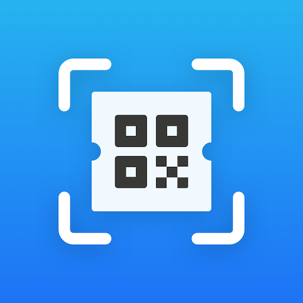
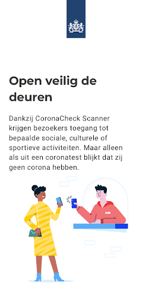
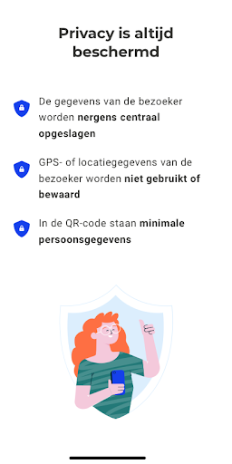
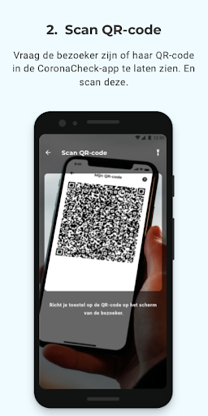
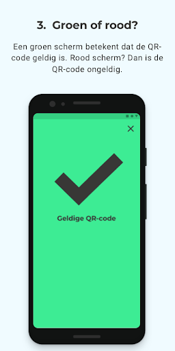

# CoronaCheck Scanner
App version ``1.2.0``

Analyzed with [covid-apps-observer](http://github.com/covid-apps-observer) project, version ``0.1``

## App overview
| | |
|-------------------------|-------------------------| 
| **Name**&nbsp;&nbsp;&nbsp;&nbsp;&nbsp;&nbsp;&nbsp;&nbsp;&nbsp;&nbsp;&nbsp;&nbsp;&nbsp;&nbsp;&nbsp;&nbsp;&nbsp;&nbsp;&nbsp;&nbsp;&nbsp;&nbsp;&nbsp;&nbsp;&nbsp;&nbsp;&nbsp;&nbsp;&nbsp;&nbsp;&nbsp;&nbsp;&nbsp;&nbsp;&nbsp;&nbsp;&nbsp;&nbsp;&nbsp;&nbsp;  | CoronaCheck Scanner |
| **Unique identifier** | nl.rijksoverheid.ctr.verifier |
| **Link to Google Play** | [https://play.google.com/store/apps/details?id=nl.rijksoverheid.ctr.verifier](https://play.google.com/store/apps/details?id=nl.rijksoverheid.ctr.verifier) |
| **Summary**  | Open veilig de deuren |
| **Privacy policy** | [https://coronacheck.nl/nl/gebruikersvoorwaarden](https://coronacheck.nl/nl/gebruikersvoorwaarden) |
| **Latest version** | 1.2.0 |
| **Last update** | 2021-05-01 08:29:57 |
| **Recent changes** | - Verbeteringen op het QR gescand scherm - Diverse bugs zijn opgelost |
| **Installs**  | 1.000+ |
| **Category** | Zakelijk |
| **First release** | 17 mrt. 2021 |
| **Size**  | 36M |
| **Supported Android version**  | 6.0 en hoger |

### Description
> CoronaCheck Scanner is de officiële testbewijs scanner van Nederland, ontwikkeld door het Ministerie van Volksgezondheid, Welzijn en Sport. Het is een digitaal hulpmiddel om te controleren of bezoekers van bepaalde sociale, culturele of sportieve locaties in Nederland op het moment van testen geen corona hadden.
 CoronaCheck kan worden gebruikt bij vooraf aangekondigde evenementen, zoals de interland Nederland - Letland op 27 maart.
 Hoe werkt de app?
  
 - Vraag de bezoeker een testresultaat te laten zien
 Bij de ingang moet de bezoeker bewijzen dat hij of zij op het moment van testen geen corona had. Dit testresultaat – in de vorm van een QR-code - staat in de CoronaCheck-app. De QR-code kan veilig op afstand gecontroleerd worden. De telefoons hoeven elkaar niet te raken.
  
 - Scan QR-code voor toegang
 Met deze app scan je de QR-code van de bezoeker. Let op: je mag alleen bezoekers met een geldige QR-code toegang geven.
  
 - Check of de QR-code geldig is
 Een groen scherm betekent dat de QR-code geldig is. Oftewel: de bezoeker is in de afgelopen 40 uur negatief getest (geen corona). Zie je een rood scherm op je toestel? Dan heeft de bezoeker geen geldig negatief testbewijs.
  
 Zo gebruikt de app gegevens
 De gegevens van de bezoeker worden nergens centraal opgeslagen
 GPS- of locatiegegevens van de bezoeker worden niet gebruikt of bewaard
 In de QR-code staat alleen wanneer de bezoeker negatief getest is

### User interface
The developers of the app provide the following screenshots in the Google play store.
| | | |
|:-------------------------:|:-------------------------:|:-------------------------:|
 |   |   |   | 
 |   |  

## Development team
In the following we report the main information provided by the development team in the Google play store.

| | |
|-------------------------|-------------------------|
| **Developer**  | Rijksoverheid |
| **Website**  | [https://www.coronacheck.nl](https://www.coronacheck.nl) |
| **Email** | helpdesk@coronacheck.nl |
| **Physical address**  | - |
| **Other developed apps**  | [https://play.google.com/store/apps/developer?id=Rijksoverheid](https://play.google.com/store/apps/developer?id=Rijksoverheid) |

## Android support

| | |
|-------------------------|-------------------------|
| **Declared target Android version**  | - |
| **Effective target Android version**  | - |
| **Minimum supported Android version**  | Marshmallow, version 6.0 (API level 23) |
| **Maximum target Android version**  | - |

The larger the difference between the minimum and maximum supported Android versions, the better. A larger difference means a wider audience. For example, old phones have a very low Android version, so a high minimum supported Android version means that the app cannot be used by users with old phones, thus leading to accessibility problems. 

## Requested permissions

In the following we report the complete list of the permissions requested by the app. 

| **Permission** | **Protection level** | **Description** | 
|-------------------------|-------------------------|-------------------------|
 **android.permission ACCESS_NETWORK_STATE** | Normal | Allows applications to access information about networks. 
 **android.permission CAMERA** | :warning:**Dangerous** | Required to be able to access the camera device. 
 **android.permission INTERNET** | Normal | Allows applications to open network sockets. 

## Mentioned servers

| **Server** | **Registrant** | **Registrant country** | **Creation date** | 
|-------------------------|-------------------------|-------------------------|-------------------------|
 | google.com | Google LLC | :us: US | 1997-09-15 04:00:00 |
 | googleapis.com | Google LLC | :us: US | 2005-01-25 17:52:26 |
 | coronacheck.nl | - | - | 2020-02-25 00:00:00 |

## Security analysis 

Below we report the main security warnings raised by our execution of the [Androwarn](https://github.com/maaaaz/androwarn) security analysis tool.

**Telephony identifiers leakage**
> - This application reads the MCC+MNC of the provider of the SIM 

**Connection interfaces exfiltration**
> - This application reads details about the currently active data network 
> - This application tries to find out if the currently active data network is metered 

**Suspicious connection establishment**
> - This application opens a Socket and connects it to the remote address ' returned no addresses for  ; port is out of range' on the 'N/A' port  
> - This application opens a Socket and connects it to the remote address '' on the 'N/A' port  
> - This application opens a Socket and connects it to the remote address 'Ljava/lang/StringBuilder;->toString()Ljava/lang/String;' on the 'N/A' port  
> - This application opens a Socket and connects it to the remote address 'Ljava/net/Proxy;->type()Ljava/net/Proxy$Type;' on the 'N/A' port  
> - This application opens a Socket and connects it to the remote address 'timeout' on the 'N/A' port  

**Code execution**
> - This application loads a native library: 'barhopper_v2' 
> - This application loads a native library: 'gojni' 

## User ratings and reviews

Below we provide information about how end users are reacting to the app in terms of ratings and reviews in the Google Play store.

### Ratings

The CoronaCheck Scanner app has been installed by more than **1000** times. At this time, **-** rated the app and its average score is **0**. Below we show the distribution of the ratings across the usual star-based rating of Google Play

:star::star::star::star::star:: 0

:star::star::star::star:: 0

:star::star::star:: 0

:star::star:: 0

:star:: 0

### Reviews 

#### 5-star reviews

No recent reviews available with 5 stars.

#### 4-star reviews

No recent reviews available with 4 stars.

#### 3-star reviews

No recent reviews available with 3 stars.

#### 2-star reviews

No recent reviews available with 2 stars.

#### 1-star reviews

No recent reviews available with 1 stars.
