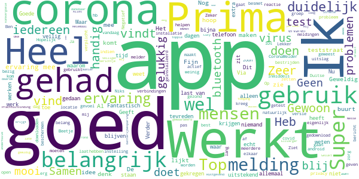
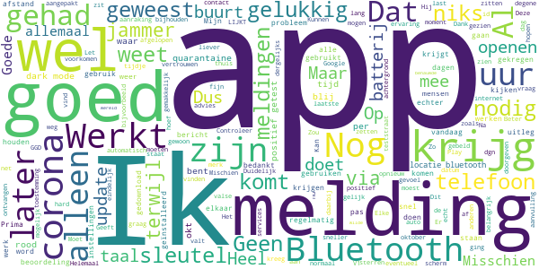
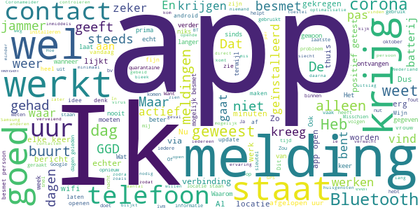
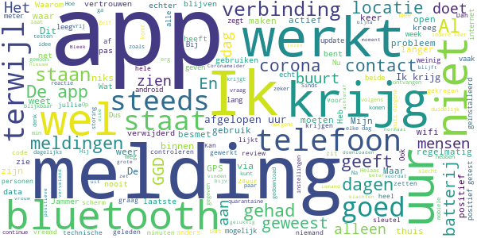
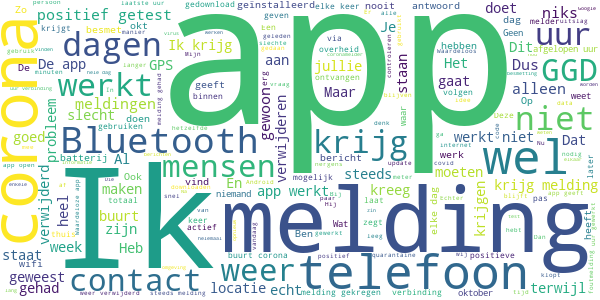

# CoronaMelder
App version ``1.0.4``

Analyzed with [covid-apps-observer](http://github.com/covid-apps-observer) project, version ``0.1``

## App overview
| | |
|-------------------------|-------------------------| 
| **Name**&nbsp;&nbsp;&nbsp;&nbsp;&nbsp;&nbsp;&nbsp;&nbsp;&nbsp;&nbsp;&nbsp;&nbsp;&nbsp;&nbsp;&nbsp;&nbsp;&nbsp;&nbsp;&nbsp;&nbsp;&nbsp;&nbsp;&nbsp;&nbsp;&nbsp;&nbsp;&nbsp;&nbsp;&nbsp;&nbsp;&nbsp;&nbsp;&nbsp;&nbsp;&nbsp;&nbsp;&nbsp;&nbsp;&nbsp;&nbsp;  | CoronaMelder |
| **Unique identifier** | nl.rijksoverheid.en |
| **Link to Google Play** | [https://play.google.com/store/apps/details?id=nl.rijksoverheid.en](https://play.google.com/store/apps/details?id=nl.rijksoverheid.en) |
| **Summary**  | Help de verspreiding van het coronavirus in Nederland te stoppen |
| **Privacy policy** | [https://coronamelder.nl/nl/privacy](https://coronamelder.nl/nl/privacy) |
| **Latest version** | 1.0.4 |
| **Last update** | 2020-10-26 10:36:39 |
| **Recent changes** | Dank je wel voor het gebruiken van CoronaMelder. Je helpt daarmee corona in Nederland te stoppen. Deze versie van CoronaMelder bevat tekstaanpassingen en kleine stabiliteitsverbeteringen. |
| **Installs**  | 1.000.000+ |
| **Category** | Medisch |
| **First release** | 10 aug. 2020 |
| **Size**  | 7,1M |
| **Supported Android version**  | 6.0 en hoger |

### Description
> CoronaMelder is de officiële corona notificatie-app van Nederland, ontwikkeld onder het toezicht van het Ministerie van Volksgezondheid, Welzijn en Sport. De app is een digitaal hulpmiddel bij het bron- en contactonderzoek door de GGD. 
 De app waarschuwt je nadat je in de buurt bent geweest van iemand met corona. Zo kun je jezelf en de mensen in je omgeving beschermen. En kunnen we samen het aantal besmettingen in Nederland zo laag mogelijk houden. Het gebruik van de app is vrijwillig. Niemand mag controleren of jij de app op je telefoon hebt. Maar hoe meer mensen de app gebruiken, hoe beter deze werkt. 
 Bij de ontwikkeling van deze app is rekening gehouden met toegankelijkheid, zie voor meer informatie onze toegankelijkheidsverklaring.
 Hoe werkt de app?
 # Je geeft alleen toegang tot je bluetoothgegevens
 CoronaMelder ziet via bluetooth wanneer je in de buurt bent van andere mensen met de app. De app gebruikt geen persoons- of locatiegegevens. De app weet dus niet wie je bent, waar je was en wie je hebt ontmoet.
 # Je krijgt een melding nadat je extra kans op besmetting hebt gelopen
 De app stuurt een melding als je minstens 15 minuten in de buurt bent geweest van iemand die later corona blijkt te hebben. Deze persoon moet ook de app gebruiken.
 # Je kunt anderen waarschuwen als je zelf besmet blijkt te zijn
 Ben je getest door de GGD en blijk je corona te hebben? Dan kun je samen met de GGD via de app een melding sturen naar de mensen bij wie je in de buurt bent geweest - in de periode dat je besmettelijk was. In deze melding staat alleen wanneer ze in de buurt zijn geweest van een besmet persoon. Niet wie of waar dit was.
 Hoe gaat de app met je gegevens om?
 • Je hoeft geen persoonsgegevens zoals je e-mailadres of naam in te voeren.
 • Als je iemand tegenkomt wisselen jullie telefoons via bluetooth willekeurige codes uit. Zo meet de app de duur en de afstand van het contact. In de codes staat niets over wie jullie zijn en waar jullie zijn geweest. 
 • De codes die je via bluetooth uitwisselt worden alleen op je telefoon bewaard en na 14 dagen verwijderd.
 • Gebruikers van de app zijn niet terug te vinden door de makers van de app, de overheid of andere gebruikers.

### User interface
The developers of the app provide the following screenshots in the Google play store.
| | | |
|:-------------------------:|:-------------------------:|:-------------------------:|
 |   |   |   | 
 |   |   |   | 

## Development team
In the following we report the main information provided by the development team in the Google play store.

| | |
|-------------------------|-------------------------|
| **Developer**  | Rijksoverheid |
| **Website**  | [https://coronamelder.nl/](https://coronamelder.nl/) |
| **Email** | helpdesk@coronamelder.nl |
| **Physical address**  | - |
| **Other developed apps**  | [https://play.google.com/store/apps/developer?id=Rijksoverheid](https://play.google.com/store/apps/developer?id=Rijksoverheid) |

## Android support

| | |
|-------------------------|-------------------------|
| **Declared target Android version**  | Android10, version 10 (API level 29) |
| **Effective target Android version**  | Android10, version 10 (API level 29) |
| **Minimum supported Android version**  | Marshmallow, version 6.0 (API level 23) |
| **Maximum target Android version**  | - |

The larger the difference between the minimum and maximum supported Android versions, the better. A larger difference means a wider audience. For example, old phones have a very low Android version, so a high minimum supported Android version means that the app cannot be used by users with old phones, thus leading to accessibility problems. 

## Requested permissions

In the following we report the complete list of the permissions requested by the app. 

| **Permission** | **Protection level** | **Description** | 
|-------------------------|-------------------------|-------------------------|
 **android.permission ACCESS_NETWORK_STATE** | Normal | Allows applications to access information about networks. 
 **android.permission BLUETOOTH** | Normal | Allows applications to connect to paired bluetooth devices. 
 **android.permission FOREGROUND_SERVICE** | Normal | Allows a regular application to use Service.startForeground. 
 **android.permission INTERNET** | Normal | Allows applications to open network sockets. 
 **android.permission RECEIVE_BOOT_COMPLETED** | Normal | Allows an application to receive the Intent.ACTION_BOOT_COMPLETED that is broadcast after the system finishes booting. 
 **android.permission WAKE_LOCK** | Normal | Allows using PowerManager WakeLocks to keep processor from sleeping or screen from dimming. 

## Mentioned servers

| **Server** | **Registrant** | **Registrant country** | **Creation date** | 
|-------------------------|-------------------------|-------------------------|-------------------------|
 | google.com | Google LLC | :us: US | 1997-09-15 04:00:00 |
 | coronamelder-api.nl | - | - | 2020-07-22 00:00:00 |
 | coronamelder-dist.nl | - | - | 2020-07-20 00:00:00 |

## Security analysis 

Below we report the main security warnings raised by our execution of the [Androwarn](https://github.com/maaaaz/androwarn) security analysis tool.

**Connection interfaces exfiltration**
> - This application reads details about the currently active data network 
> - This application tries to find out if the currently active data network is metered 

**Telephony services abuse**
> - This application makes phone calls 

**Suspicious connection establishment**
> - This application opens a Socket and connects it to the remote address '; port is out of range' on the 'N/A' port  
> - This application opens a Socket and connects it to the remote address 'Lj/b/a/a/a;->F(Ljava/lang/String;)Ljava/lang/StringBuilder;' on the 'N/A' port  
> - This application opens a Socket and connects it to the remote address 'Ljava/net/Proxy;->type()Ljava/net/Proxy$Type;' on the 'N/A' port  
> - This application opens a Socket and connects it to the remote address 'timeout' on the 'N/A' port  

## User ratings and reviews

Below we provide information about how end users are reacting to the app in terms of ratings and reviews in the Google Play store.

### Ratings

The CoronaMelder app has been installed by more than **1000000** times. At this time, **5711** rated the app and its average score is **2.99844**. Below we show the distribution of the ratings across the usual star-based rating of Google Play

:star::star::star::star::star:: 1907

:star::star::star::star:: 579

:star::star::star:: 695

:star::star:: 659

:star:: 1871

### Reviews 

#### 5-star reviews

> Veiliger gevoel als je een berichtje krijgt als er iemand uit de buurt corona heeft!!!  :date: __2020-11-08 12:11:32__

> Geweldig  :date: __2020-11-08 07:28:44__

> Helemaal toppie  :date: __2020-11-07 12:37:14__

> Prima app lijkt mij, draait zonder problemen  :date: __2020-11-07 10:26:06__

> Belangrijk om te weten  :date: __2020-11-07 03:10:56__

> Fijn dat dit er is.  :date: __2020-11-06 19:17:05__

> Oke  :date: __2020-11-06 16:37:50__

> 👍🏼  :date: __2020-11-05 21:49:00__

> Ben dankbaar.Lucy Nesse.  :date: __2020-11-05 21:22:31__

> kankergoeie app  :date: __2020-11-05 17:56:18__

#### 4-star reviews

> ik heb al een tijdje geen bericht gehad.ik wilde net de app openen.ging niet valt gelijk weg.  :date: __2020-11-07 11:46:32__

> Werkt fijn  :date: __2020-11-05 21:13:16__

> Geeft mij vertrouwen in deze benauwde wereld  :date: __2020-11-05 19:48:54__

> Gelukkig nog geen ervaring mee opgedaan. Maar wel nuttig dat deze app er is.  :date: __2020-11-05 09:36:22__

> Nog niet grmerkt  :date: __2020-11-04 21:11:17__

> Heel goed  :date: __2020-11-04 17:10:00__

> Ik krijg telkens een melding dat de app de laatste 24 uur de app buiten gebruik is geweest. Hoe kan dat? Op uw advies batterij besparing uitgezet, geen melding meer gehad! Dank u!  :date: __2020-11-04 09:15:03__

> Goed hoor  :date: __2020-11-03 21:37:13__

> Duidelijke makkelijke taal  :date: __2020-11-02 18:52:59__

> Heel raar. Mijn man is positief getest, verstuurt met GGD de sleutel. Pas 5 uur later krijg ik de melding dat ik diezelfde dag 😳 in aanraking ben geweest met iemand met corona. Helemaal NIKS over de afgelopen dagen. Andere mensen bij wie hij in de buurt is geweest zoals collega's hebben de melding nog steeds niet gekregen. Zo heeft de app toch geen zin?  :date: __2020-11-02 09:09:23__

#### 3-star reviews

> Hij kanker stopt me reet in me bek  :date: __2020-11-07 23:49:17__

> Echt een batterij spleurper! Ik kom voor mijn werk op veel adressen en dacht er goed aan te doen met deze app. Maar 1 maal geïnstalleerd en aangezet kan ik het door deze app nog geen dag uithouden zonder tussentijds op te laden. Wel jammer, verder maakt het je toestel niet trager ( Samsung s9 2 jaar oud) heb hem er wel noodgedwongen afgehaald.  :date: __2020-11-07 23:01:53__

> Help elkaar door deze barre tyden heen  :date: __2020-11-07 21:08:45__

> De app valt steeds uit. Zegt dan dat hij de laatste 24 uur geen gegevens kon uitwisselen. Moet dus steeds opnieuw proberen en dan doet hij het weer. Zo heb ik er niets aan.  :date: __2020-11-07 16:06:59__

> Ik kreeg pas na 6 dagen bericht dat ik bij iemand in de buurt was geweest die corona had.  :date: __2020-11-06 15:22:22__

> Elke keer als ik de App open krijg ik wel een melding over een toestemming die niet goed is, ofdat er geen verbinding is. Waarom pas als ik de App open? Ik zou graag bv iedere 48 uur een melding willen zien dat de App actief is en functioneel is.  :date: __2020-11-05 23:49:52__

> Ik krijg steeds bericht dat door een technische storing 24 uur geen melding mogelijk was. Bluetooth en locatie staan aan. Opnieuw installeren helpt niet. Ik gebruik alleen wifi, maar ook als ik een hele dag thuis ben krijg ik die melding. Hoe kan dat? Commentaar op reactie: energiebesparing stond inderdaad aan. Nu even afwachten op resultaat, maar na 2 dagen nog geen probleem gehad. 👍  :date: __2020-11-05 22:16:27__

> Beter  :date: __2020-11-04 19:45:22__

> Jammer Het gebruikt veel batterij, batterij geoptimaliseerd moet uit ik krijg door een melding. Ik heb de Samsung s20 ultra telefoon  :date: __2020-11-04 15:24:55__

> Ik krijg vaak medingen om de app te openen terwijl er niets aan de hand is!! Heel vervelend, er zou toch alleen meldingen komen als je langer dan 15 min contact heb gehad met iemand. En dan ook midden in de nacht!  :date: __2020-11-04 12:49:03__

#### 2-star reviews

> Na 9 dagen kreeg ik een melding dat ik tot de volgende dag thuis moest blijven, mijn vrouw kreeg geen melding, nog steeds geen klachten gelukkig  :date: __2020-11-08 04:23:04__

> Meldingen om 3.00 uur of om 18.30 uur terwijl ik dan thuis ben en er 15 min iemand voor mijn raam gestaan heeft ik absoluut geen contact gehad kan hebben met iemand die oositiefgetedt is. Verder aldoor melding dat afgelopen 24 uur geen controle uitgevoerd kan zijn  :date: __2020-11-07 23:23:32__

> Al 12 uur geleden is de app samen met de ggd geactiveerd dat iemand uit mijn omgeving positief is getest(waar ik intensief contact mee heb gehad) echter heb ik nog steeds geen melding via de app mogen ontvangen. Ik weet niet waar het aan ligt maar wel een gemiste kans denk ik.  :date: __2020-11-07 23:13:10__

> Is het niet wat laat? 5 dagen na mogelijk contact met besmet persoon de melding krijgen?  :date: __2020-11-07 21:05:33__

> Ik zou wel graag zien waar ik mogelijk in contact ben geweest. Dan weet ik of ik op dat moment een mondkapje droeg of niet.  :date: __2020-11-07 19:48:19__

> App verwijderd. Bij kennis kwam pas na 5 dagen door dat hij in contact was geweest met een positief getest iemand. Bleek dat degene pas na 3 positieve testen als besmet werd geregistreerd. Rijkelijk laat, dus app heeft dan geen meerwaarde.  :date: __2020-11-07 10:51:05__

> Meldt ook foutief, werkt niet altijd goed.  :date: __2020-11-06 23:45:21__

> Heb nog niks van gemerkt dat die werkt.  :date: __2020-11-06 21:08:41__

> Heb de app er weer afgegooid, vraagt constant om mijn locatie permanent aan te zetten, mijn batterij is dan binnen een paar uur leeg, normaal zie ik het locatie pictogram alleen als ik bv een weerapp open? Ook gaf de app regelmatig een probleem met mijn Garmin horloge, ondanks dat alle setting OK waren kon ik niet synchroniseren  :date: __2020-11-06 19:49:06__

> Normaal kreeg ik elke week een overzicht... maar nu niet meer. Hoe zit dat  :date: __2020-11-06 16:39:02__

#### 1-star reviews

> Geen ervaringen  :date: __2020-11-08 11:01:28__

> Ik krijg elke keer de melding dat de app me 24 uur niet kon volgen. Met andere woorden, de app werkt niet.  :date: __2020-11-08 08:30:58__

> Doet totaal niets. Werkt niet zoals beloofd, terwijl er hoge verwachtingen waren beloofd. Het doet totaal niets, bovendien heb ik storing als de WiFi van mijn telefoon aanstaat buiten mijn eigen woning.  :date: __2020-11-08 08:26:10__

> Krijg elke avond een melding dat hij 24 uur niet heeft gewerkt omdat ik zogenaamd mijn bluetooth niet aan heb staan maar dat klopt niet. Mijn bluetooth staat atijd aan. Ook kan ik het bericht niet volledig lezen want zodra ik de app open verdwijnt de melding na een paar seconden. Nergens kan ik hier iets over vinden zodat ik er misschien iets aan kan doen. Denk er sterk over de app te verwijderen.  :date: __2020-11-07 20:58:21__

> Heeft tot op heden veel uitval laten zien. Nu weer 24 uur inactief. Nog steeds meldingen inactief. Weinig vertrouwen in op deze manier. Mss app maar verwijderen. De app is een onbruikbaar middel. Ik ga hem verwijderen. Steeds dezelfde melding: heeft 24 uur niet gewerkt. Ik heb er geen vertrouwen in Hugo de Jonge cs.  :date: __2020-11-07 19:49:27__

> Slechte berichtgeving op de app  :date: __2020-11-07 19:25:19__

> Zowel mijn man dochter als ik hebben de app. Mijn man ik en mijn zoon zijn alle 3 positief geweest. Geen melding gehad van elkaar. Ook vrienden die positief waren en de app gebruiken .. zowel ik als zij nóóit melding ontvangen. Dus vraag me echt af...  :date: __2020-11-07 16:17:53__

> Volkomen ruk Ga eerst de app goed ontwikkelen, want ik krijg de meest rare berichten, die niks met coronashitzooi te maken heeft.  :date: __2020-11-07 14:35:33__

> Ik krijg 3 a 4 keer in de week de melding dat de app 24 uur technische problemen heeft gehad en daar door niet goed werkt. Heb hem na 3 week maar weer gewist...  :date: __2020-11-07 11:09:33__

> Opeens verlangd de app van mij mijn locatiegebruik, daardoor wordt mijn mobiel leeggezogen dus ik gebruik hem niet meer (aangezien hij alleen op bluetooth zou moeten werken).  :date: __2020-11-07 07:52:40__

