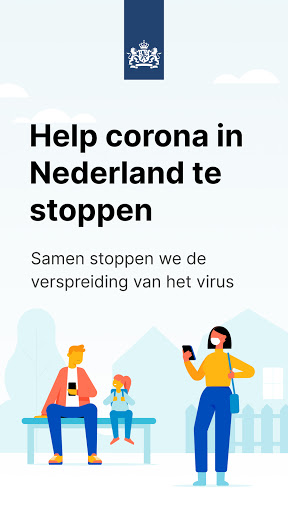
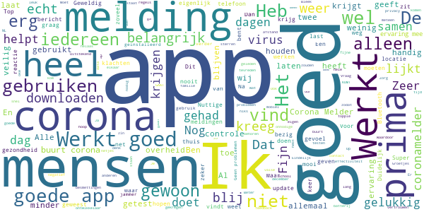
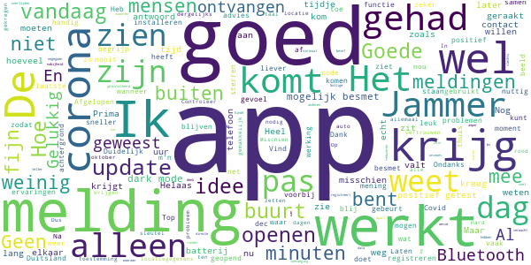
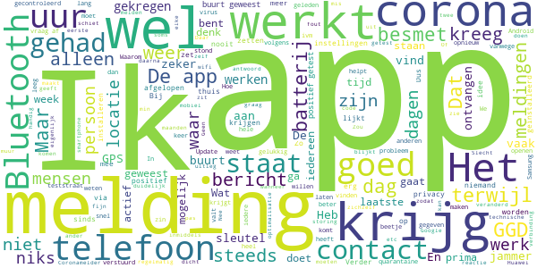
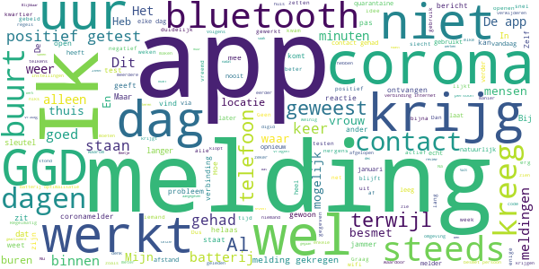

# CoronaMelder
App version ``1.1.2``

Analyzed with [covid-apps-observer](http://github.com/covid-apps-observer) project, version ``0.1``

## App overview
| | |
|-------------------------|-------------------------| 
| **Name**&nbsp;&nbsp;&nbsp;&nbsp;&nbsp;&nbsp;&nbsp;&nbsp;&nbsp;&nbsp;&nbsp;&nbsp;&nbsp;&nbsp;&nbsp;&nbsp;&nbsp;&nbsp;&nbsp;&nbsp;&nbsp;&nbsp;&nbsp;&nbsp;&nbsp;&nbsp;&nbsp;&nbsp;&nbsp;&nbsp;&nbsp;&nbsp;&nbsp;&nbsp;&nbsp;&nbsp;&nbsp;&nbsp;&nbsp;&nbsp;  | CoronaMelder |
| **Unique identifier** | nl.rijksoverheid.en |
| **Link to Google Play** | [https://play.google.com/store/apps/details?id=nl.rijksoverheid.en](https://play.google.com/store/apps/details?id=nl.rijksoverheid.en) |
| **Summary**  | Help de verspreiding van het coronavirus in Nederland te stoppen |
| **Privacy policy** | [https://coronamelder.nl/nl/privacy](https://coronamelder.nl/nl/privacy) |
| **Latest version** | 1.1.2 |
| **Last update** | 2020-12-14 14:51:12 |
| **Recent changes** | Dank je wel voor het gebruiken van CoronaMelder. Je helpt daarmee corona in Nederland te stoppen. Deze versie van CoronaMelder bevat tekstaanpassingen en kleine stabiliteitsverbeteringen. |
| **Installs**  | 1.000.000+ |
| **Category** | Medisch |
| **First release** | 10 aug. 2020 |
| **Size**  | 7,1M |
| **Supported Android version**  | 6.0 en hoger |

### Description
> CoronaMelder is de officiële corona notificatie-app van Nederland, ontwikkeld onder het toezicht van het Ministerie van Volksgezondheid, Welzijn en Sport. De app is een digitaal hulpmiddel bij het bron- en contactonderzoek door de GGD. 
 De app waarschuwt je nadat je in de buurt bent geweest van iemand met corona. Zo kun je jezelf en de mensen in je omgeving beschermen. En kunnen we samen het aantal besmettingen in Nederland zo laag mogelijk houden. Het gebruik van de app is vrijwillig. Niemand mag controleren of jij de app op je telefoon hebt. Maar hoe meer mensen de app gebruiken, hoe beter deze werkt. 
 Bij de ontwikkeling van deze app is rekening gehouden met toegankelijkheid, zie voor meer informatie onze toegankelijkheidsverklaring.
 Hoe werkt de app?
 # Je geeft alleen toegang tot je bluetoothgegevens
 CoronaMelder ziet via bluetooth wanneer je in de buurt bent van andere mensen met de app. De app gebruikt geen persoons- of locatiegegevens. De app weet dus niet wie je bent, waar je was en wie je hebt ontmoet.
 # Je krijgt een melding nadat je extra kans op besmetting hebt gelopen
 De app stuurt een melding als je minstens 15 minuten in de buurt bent geweest van iemand die later corona blijkt te hebben. Deze persoon moet ook de app gebruiken.
 # Je kunt anderen waarschuwen als je zelf besmet blijkt te zijn
 Ben je getest door de GGD en blijk je corona te hebben? Dan kun je samen met de GGD via de app een melding sturen naar de mensen bij wie je in de buurt bent geweest - in de periode dat je besmettelijk was. In deze melding staat alleen wanneer ze in de buurt zijn geweest van een besmet persoon. Niet wie of waar dit was.
 Hoe gaat de app met je gegevens om?
 • Je hoeft geen persoonsgegevens zoals je e-mailadres of naam in te voeren.
 • Als je iemand tegenkomt wisselen jullie telefoons via bluetooth willekeurige codes uit. Zo meet de app de duur en de afstand van het contact. In de codes staat niets over wie jullie zijn en waar jullie zijn geweest. 
 • De codes die je via bluetooth uitwisselt worden alleen op je telefoon bewaard en na 14 dagen verwijderd.
 • Gebruikers van de app zijn niet terug te vinden door de makers van de app, de overheid of andere gebruikers.

### User interface
The developers of the app provide the following screenshots in the Google play store.
| | | |
|:-------------------------:|:-------------------------:|:-------------------------:|
 |   |   |   | 
 |   |   |   | 

## Development team
In the following we report the main information provided by the development team in the Google play store.

| | |
|-------------------------|-------------------------|
| **Developer**  | Rijksoverheid |
| **Website**  | [https://coronamelder.nl/](https://coronamelder.nl/) |
| **Email** | helpdesk@coronamelder.nl |
| **Physical address**  | - |
| **Other developed apps**  | [https://play.google.com/store/apps/developer?id=Rijksoverheid](https://play.google.com/store/apps/developer?id=Rijksoverheid) |

## Android support

| | |
|-------------------------|-------------------------|
| **Declared target Android version**  | - |
| **Effective target Android version**  | - |
| **Minimum supported Android version**  | Marshmallow, version 6.0 (API level 23) |
| **Maximum target Android version**  | - |

The larger the difference between the minimum and maximum supported Android versions, the better. A larger difference means a wider audience. For example, old phones have a very low Android version, so a high minimum supported Android version means that the app cannot be used by users with old phones, thus leading to accessibility problems. 

## Requested permissions

In the following we report the complete list of the permissions requested by the app. 

| **Permission** | **Protection level** | **Description** | 
|-------------------------|-------------------------|-------------------------|
 **android.permission ACCESS_NETWORK_STATE** | Normal | Allows applications to access information about networks. 
 **android.permission BLUETOOTH** | Normal | Allows applications to connect to paired bluetooth devices. 
 **android.permission FOREGROUND_SERVICE** | Normal | Allows a regular application to use Service.startForeground. 
 **android.permission INTERNET** | Normal | Allows applications to open network sockets. 
 **android.permission RECEIVE_BOOT_COMPLETED** | Normal | Allows an application to receive the Intent.ACTION_BOOT_COMPLETED that is broadcast after the system finishes booting. 
 **android.permission REQUEST_IGNORE_BATTERY_OPTIMIZATIONS** | Normal | Permission an application must hold in order to use Settings.ACTION_REQUEST_IGNORE_BATTERY_OPTIMIZATIONS. 
 **android.permission WAKE_LOCK** | Normal | Allows using PowerManager WakeLocks to keep processor from sleeping or screen from dimming. 

## Mentioned servers

| **Server** | **Registrant** | **Registrant country** | **Creation date** | 
|-------------------------|-------------------------|-------------------------|-------------------------|
 | google.com | Google LLC | :us: US | 1997-09-15 04:00:00 |
 | coronamelder-dist.nl | - | - | 2020-07-20 00:00:00 |
 | coronamelder-api.nl | - | - | 2020-07-22 00:00:00 |
 | android.com | Google LLC | :us: US | 1997-06-23 04:00:00 |

## Security analysis 

Below we report the main security warnings raised by our execution of the [Androwarn](https://github.com/maaaaz/androwarn) security analysis tool.

**Connection interfaces exfiltration**
> - This application reads details about the currently active data network 
> - This application tries to find out if the currently active data network is metered 

**Telephony services abuse**
> - This application makes phone calls 

**Suspicious connection establishment**
> - This application opens a Socket and connects it to the remote address '; port is out of range' on the 'N/A' port  
> - This application opens a Socket and connects it to the remote address 'Ljava/net/Proxy;->type()Ljava/net/Proxy$Type;' on the 'N/A' port  
> - This application opens a Socket and connects it to the remote address 'Ln/b/a/a/a;->F(Ljava/lang/String;)Ljava/lang/StringBuilder;' on the 'N/A' port  
> - This application opens a Socket and connects it to the remote address 'timeout' on the 'N/A' port  

## User ratings and reviews

Below we provide information about how end users are reacting to the app in terms of ratings and reviews in the Google Play store.

### Ratings

The CoronaMelder app has been installed by more than **1000000** times. At this time, **6616** rated the app and its average score is **3.0706923**. Below we show the distribution of the ratings across the usual star-based rating of Google Play

:star::star::star::star::star:: 2349

:star::star::star::star:: 779

:star::star::star:: 662

:star::star:: 643

:star:: 2183

### Reviews 

#### 5-star reviews

> De beste app  :date: __2021-01-16 13:36:08__

> Super handig dat je nu hier ook iets voor hebt je ziet nu hoe ver we al met de technologie zijn  :date: __2021-01-15 07:01:21__

> Ik merk er niks van  :date: __2021-01-14 19:49:05__

> TOPPIE!!!!!!  :date: __2021-01-14 15:12:05__

> Het blijft altijd leermomenten voor iedereen  :date: __2021-01-14 10:18:39__

> Wees voorzichtig.  :date: __2021-01-11 16:38:46__

> Je voelt je veilig als je je aan de regels en afspraken houd.  :date: __2021-01-10 20:01:25__

> Ik kreeg melding en wat te dien zeer duidelijk  :date: __2021-01-09 10:44:35__

> Werk goed  :date: __2021-01-07 13:44:40__

> Schade doet het niet.  :date: __2021-01-07 01:05:34__

#### 4-star reviews

> Duidelijk  :date: __2021-01-15 12:58:18__

> Ik heb een melding gehad dat ik bij iemand met corona in de buurt ben geweest. Op die dag echter alleen vrijwel uitgesloten dat ik 15 minuten aaneengesloten te dicht bij wie dan ook ben geweest die besmet is. Nu in afwachting van de uitslag van de test binnen uiteraard, maar heb wel vragen hoe exact het algoritme is dat bepaalt of je 15 minuten aaneengesloten op een dag te dicht bij iemand bent geweest...  :date: __2021-01-15 10:23:03__

> Heel goed dat het zo kan mijn dank.  :date: __2021-01-13 12:30:23__

> Weet ik nog niet  :date: __2021-01-13 08:39:22__

> In Zeeland zijn veel Duitse toeristen. Werkt deze App ook samen met die van het Robert Koch instituut of is het beter te wisselen naar de Duitse App?  :date: __2021-01-12 15:27:04__

> De melder werkt goed, ik heb 2 dagen geleden een corona-test gehad en moest wel 20 minuten wachten, mijn uitslag was negatief, ik krijg nu 2 dagen later een melding dat ik meer dan 15 minuten bij iemand in de buurt met corona ben geweest (dat was dus degene die voor of achter mij stond) Nu nog de mogelijkheid om dit in de app aan te geven ❤  :date: __2021-01-06 19:09:18__

> Nog geen verdere ervaring.  :date: __2021-01-05 19:16:30__

> De app stoort niet het functioneren van mijn telefoon, computer programma's, gsm of tablet. Gebruiksvriendelijk! Prettig idee dat je weet waar je aan toe bent qua gezondheid in deze Coronatijd.  :date: __2021-01-05 08:37:57__

> Geen ervaring  :date: __2020-12-30 20:38:28__

> Kan altijd beter.  :date: __2020-12-29 13:59:32__

#### 3-star reviews

> Deze app heeft het probleem dat hij uitvalt voor 24-uur terwijl ik wel goede verbinding heb niet constant maar wel vaak genoeg om de app weer automatisch te laten starten Deze app is up to date ben zeer streng in het updaten  :date: __2021-01-14 18:55:59__

> Kreeg zojuist een melding dat de app 24 uur lang niet actief was! De app heb ik niet bewust uitgezet. Waarom krijg k dan deze melding pas na 24 uur en niet al na een uur?  :date: __2021-01-13 22:04:22__

> Enkele weken geleden kon ik ergens bij Instellingen zien met hoeveel mensen ik in contact was geweest die de app ook gebruikten. Nu kan ik het niet meer vinden. Jammer, ik vond die functie wel goed.  :date: __2021-01-13 20:02:10__

> Vandaag een melding gekregen dat ik vandaag mogelijk in contact ben geweest met iemand die positief is getest. Ik ben vandaag alleen helemaal niet de deur uit geweest. En met niemand contact gehad. Mijn buurman rechts heeft de,elfde melding gehad. Nu blijkt mijn buurvrouw links besmet te zijn. Tussen haar en mijn buurman l Rechts zit minimaal 6 meter en twee dikke betonmuren. Tikje overgevoelig deze app lijkt me.  :date: __2021-01-11 21:36:05__

> Wat zegt dit nou. Mijn mobieltje heeft misschien bij iemand in de buurt gelegen die dat heeft.  :date: __2021-01-10 21:22:18__

> Ik krijg vaak de melding dat de app niet actief is. Maar als ik hem dan opent staat er dat hij wel actief is. Alles staat aan. Wifi, mobiele data, Bluetooth. Locatie gegevens.  :date: __2021-01-09 14:14:35__

> Ik heb de app, dat ik een melding krijg. In het begin diverse meldingen gehad, over aantal sleutels, waar ik dicht bij in de buurt was geweest. de laatst 2 maanden totaal niets meer. Blijkt dat hij al 2 maanden niet actief stond, zichzelf uitgeschakeld  :date: __2021-01-06 13:12:05__

> Theorie lijkt goed, maar ik krijg steeds de melding dat er niet gecontroleerd jan worden. Laatste controle is inmiddels van 22 oktober. Zo schiet het niet op. Het probleem dat er niet gecontroleerd kon worden leek opgelost, maar sinds 1 januari krijg ik telkens weer de melding dat er 24 uur niet gecontroleerd kon worden en dat terwijl de batterijbesparing gewoon uit staat en ik geen instellingen heb veranderd.  :date: __2021-01-06 10:41:40__

> Nog geen melding gehad na de invoer erg slecht  :date: __2021-01-04 09:07:02__

> Vervelend dat de app zichzelf uitschakeld, ik heb hem al diverse keren opnieuw aan moeten zetten.  :date: __2021-01-03 18:33:08__

#### 2-star reviews

> Jammer dat je niet kunt zien of de app überhaupt iets doet. Krijg een melding over batterijoptimalisatie, maar die heb ik handmatig uitgezet (niet via de app) Op advies Coronalijn app opnieuw geïnstalleerd. Helaas blijft melding over optimalisatie aanwezig. Ook bijzonder dat je blijkbaar 10 minuten bij op iemand op visite kunt gaan die Corona heeft of in een volle lift kunt staan met besmette mensen. Ik lees namelijk dat je pas na 15 minuten besmet kunt raken . Heel vreemd allemaal.  :date: __2021-01-16 15:40:51__

> Veel uitvallen.  :date: __2021-01-14 20:35:33__

> Hoe kun je op de app instellen dat je klachtenvrij bent? Ik kan daar nergens iets over vinden. Hoelang geeft de coronamelder het signaal dat je besmet bent?  :date: __2021-01-14 08:04:36__

> Blijkbaar was de app inactief, maar hoewel alle notificaties aan staan, kreeg ik daar geen melding over. Erg jammer. Doet heel erg af aan de functionaliteit. Ik kwam er nu toevallig achter, maar dat had ook pas over een week kunnen zijn.  :date: __2021-01-12 11:00:48__

> Steeds foutmeldingen.  :date: __2021-01-11 13:46:48__

> Ik heb hem van begin en nooit een melding terwijl een collega het heeft  :date: __2021-01-11 11:49:43__

> App gaat vaak op non actief.24 uur niet actief melding.bijna elke dag.  :date: __2021-01-10 21:28:19__

> Valt vaak (1× pd) uit.  :date: __2021-01-08 14:01:27__

> 6 januari een melding dat ik €een kwartier of langer in de buurt ben geweest bij iemand bij wie corona zou zijn vastgesteld. Naar mijn mening onmogelijk omdat ik alleen 1 uur buitenshuis ben geweest voor een wandeling naar de apotheek. Wel mensen gepasseerd maar afstand gehouden en geen kwartier bij iemand in de nabijheid geweest. Zou denken dat het bluetooth verbinding met één van de buren moet zijn geweest. Heb er wel begrip voor dat het onmogelijk is om een onfeilbaar systeem te maken.  :date: __2021-01-07 22:20:45__

> Ik ben positief getest. In overleg met de ggd de sleutel van mijn app door gegeven. Nu kregen diverse mensen in mijn omgeving een melding. Al deze mensen zijn ruim korter dan 15 minuten in mijn omgeving geweest. En de afstand was ruim meer dan 1.5 meter. Sterker nog, 1 persoon is op minimaal 3 meter afstand van mij geweest. Mijn eigen vrouw kreeg trouwens geen melding..... Iedereen is negatief getest. Paniek om niets. Ik heb de app nu gedelete.  :date: __2021-01-07 22:13:42__

#### 1-star reviews

> Ik krijg een melding omdat mijn buurvrouw corona heeft. Mijn zoon ook. Leuk. Voor niets in quarantaine. Los dit op!!!  :date: __2021-01-16 16:00:34__

> Werkt zeer slecht. Geeft niet goed aan als je bij iemand in de buurt bent geweest met Covid-19 en ook nog een verkeerde datum!  :date: __2021-01-16 14:18:36__

> Ik ben service monteur.heb in een half jaar tijd gewerkt bij mensen die corona hadden.heb het dan over 11 gevallen waarvan ik weet dat er patiënten bij me in de buurt zijn geweest maar in een half jaar tijd geen enkele melding van de app gekregen  :date: __2021-01-15 11:32:47__

> Elke dag melding krijgen ,dat de app niet kon controleren ,dus ik weet niet wat daar de bedoeling van is ,dus nul waarde voor mij  :date: __2021-01-14 18:57:23__

> Ik ben ruim 40 minuten met een positief getest persoon in aanraking geweest geen melding gehad. Deze persoon besloot om positief te gaan werken.  :date: __2021-01-14 17:42:51__

> Lange tijd bij iemand geweest die corona heeft app gaf geen melding  :date: __2021-01-14 10:40:47__

> Allemaal leugens, niks privacy #plandemic  :date: __2021-01-14 00:07:26__

> Werkt. Weer niet weer iets wat hugo niet goed kan  :date: __2021-01-13 23:56:34__

> Heel jammer, had ik eindelijk de app echt nodig, gaf mijn sleutelcode telkens een foutmelding bij de GGD. Dus ik kon geen meldingen sturen. Gemiste kans!  :date: __2021-01-13 23:30:02__

> Ik krijg bijna elke dag een foutmelding. Tot nu toe geen enkele melding van iemand met COVID-19 in de buurt. Op zich goed maar je gaat wel twijfelen door de foutmeldingen of ik daadwerkelijk niets gemist heb.  :date: __2021-01-13 11:35:43__

