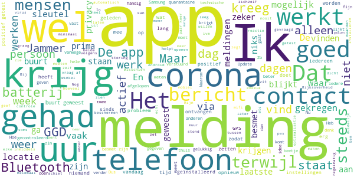

# CoronaMelder
App version ``1.1.2``

Analyzed with [covid-apps-observer](http://github.com/covid-apps-observer) project, version ``0.1``

## App overview
| | |
|-------------------------|-------------------------| 
| **Name**&nbsp;&nbsp;&nbsp;&nbsp;&nbsp;&nbsp;&nbsp;&nbsp;&nbsp;&nbsp;&nbsp;&nbsp;&nbsp;&nbsp;&nbsp;&nbsp;&nbsp;&nbsp;&nbsp;&nbsp;&nbsp;&nbsp;&nbsp;&nbsp;&nbsp;&nbsp;&nbsp;&nbsp;&nbsp;&nbsp;&nbsp;&nbsp;&nbsp;&nbsp;&nbsp;&nbsp;&nbsp;&nbsp;&nbsp;&nbsp;  | CoronaMelder |
| **Unique identifier** | nl.rijksoverheid.en |
| **Link to Google Play** | [https://play.google.com/store/apps/details?id=nl.rijksoverheid.en](https://play.google.com/store/apps/details?id=nl.rijksoverheid.en) |
| **Summary**  | Help de verspreiding van het coronavirus in Nederland te stoppen |
| **Privacy policy** | [https://coronamelder.nl/nl/privacy](https://coronamelder.nl/nl/privacy) |
| **Latest version** | 1.1.2 |
| **Last update** | 2020-12-14 14:51:12 |
| **Recent changes** | Dank je wel voor het gebruiken van CoronaMelder. Je helpt daarmee corona in Nederland te stoppen. Deze versie van CoronaMelder bevat tekstaanpassingen en kleine stabiliteitsverbeteringen. |
| **Installs**  | 1.000.000+ |
| **Category** | Medisch |
| **First release** | 10 aug. 2020 |
| **Size**  | 7,1M |
| **Supported Android version**  | 6.0 en hoger |

### Description
> CoronaMelder is de officiële corona notificatie-app van Nederland, ontwikkeld onder het toezicht van het Ministerie van Volksgezondheid, Welzijn en Sport. De app is een digitaal hulpmiddel bij het bron- en contactonderzoek door de GGD. 
 De app waarschuwt je nadat je in de buurt bent geweest van iemand met corona. Zo kun je jezelf en de mensen in je omgeving beschermen. En kunnen we samen het aantal besmettingen in Nederland zo laag mogelijk houden. Het gebruik van de app is vrijwillig. Niemand mag controleren of jij de app op je telefoon hebt. Maar hoe meer mensen de app gebruiken, hoe beter deze werkt. 
 Bij de ontwikkeling van deze app is rekening gehouden met toegankelijkheid, zie voor meer informatie onze toegankelijkheidsverklaring.
 Hoe werkt de app?
 # Je geeft alleen toegang tot je bluetoothgegevens
 CoronaMelder ziet via bluetooth wanneer je in de buurt bent van andere mensen met de app. De app gebruikt geen persoons- of locatiegegevens. De app weet dus niet wie je bent, waar je was en wie je hebt ontmoet.
 # Je krijgt een melding nadat je extra kans op besmetting hebt gelopen
 De app stuurt een melding als je minstens 15 minuten in de buurt bent geweest van iemand die later corona blijkt te hebben. Deze persoon moet ook de app gebruiken.
 # Je kunt anderen waarschuwen als je zelf besmet blijkt te zijn
 Ben je getest door de GGD en blijk je corona te hebben? Dan kun je samen met de GGD via de app een melding sturen naar de mensen bij wie je in de buurt bent geweest - in de periode dat je besmettelijk was. In deze melding staat alleen wanneer ze in de buurt zijn geweest van een besmet persoon. Niet wie of waar dit was.
 Hoe gaat de app met je gegevens om?
 • Je hoeft geen persoonsgegevens zoals je e-mailadres of naam in te voeren.
 • Als je iemand tegenkomt wisselen jullie telefoons via bluetooth willekeurige codes uit. Zo meet de app de duur en de afstand van het contact. In de codes staat niets over wie jullie zijn en waar jullie zijn geweest. 
 • De codes die je via bluetooth uitwisselt worden alleen op je telefoon bewaard en na 14 dagen verwijderd.
 • Gebruikers van de app zijn niet terug te vinden door de makers van de app, de overheid of andere gebruikers.

### User interface
The developers of the app provide the following screenshots in the Google play store.
| | | |
|:-------------------------:|:-------------------------:|:-------------------------:|
 |   |   |   | 
 |   |   |   | 

## Development team
In the following we report the main information provided by the development team in the Google play store.

| | |
|-------------------------|-------------------------|
| **Developer**  | Rijksoverheid |
| **Website**  | [https://coronamelder.nl/](https://coronamelder.nl/) |
| **Email** | helpdesk@coronamelder.nl |
| **Physical address**  | - |
| **Other developed apps**  | [https://play.google.com/store/apps/developer?id=Rijksoverheid](https://play.google.com/store/apps/developer?id=Rijksoverheid) |

## Android support

| | |
|-------------------------|-------------------------|
| **Declared target Android version**  | - |
| **Effective target Android version**  | - |
| **Minimum supported Android version**  | Marshmallow, version 6.0 (API level 23) |
| **Maximum target Android version**  | - |

The larger the difference between the minimum and maximum supported Android versions, the better. A larger difference means a wider audience. For example, old phones have a very low Android version, so a high minimum supported Android version means that the app cannot be used by users with old phones, thus leading to accessibility problems. 

## Requested permissions

In the following we report the complete list of the permissions requested by the app. 

| **Permission** | **Protection level** | **Description** | 
|-------------------------|-------------------------|-------------------------|
 **android.permission ACCESS_NETWORK_STATE** | Normal | Allows applications to access information about networks. 
 **android.permission BLUETOOTH** | Normal | Allows applications to connect to paired bluetooth devices. 
 **android.permission FOREGROUND_SERVICE** | Normal | Allows a regular application to use Service.startForeground. 
 **android.permission INTERNET** | Normal | Allows applications to open network sockets. 
 **android.permission RECEIVE_BOOT_COMPLETED** | Normal | Allows an application to receive the Intent.ACTION_BOOT_COMPLETED that is broadcast after the system finishes booting. 
 **android.permission REQUEST_IGNORE_BATTERY_OPTIMIZATIONS** | Normal | Permission an application must hold in order to use Settings.ACTION_REQUEST_IGNORE_BATTERY_OPTIMIZATIONS. 
 **android.permission WAKE_LOCK** | Normal | Allows using PowerManager WakeLocks to keep processor from sleeping or screen from dimming. 

## Mentioned servers

| **Server** | **Registrant** | **Registrant country** | **Creation date** | 
|-------------------------|-------------------------|-------------------------|-------------------------|
 | google.com | Google LLC | :us: US | 1997-09-15 04:00:00 |
 | coronamelder-dist.nl | - | - | 2020-07-20 00:00:00 |
 | coronamelder-api.nl | - | - | 2020-07-22 00:00:00 |
 | android.com | Google LLC | :us: US | 1997-06-23 04:00:00 |

## Security analysis 

Below we report the main security warnings raised by our execution of the [Androwarn](https://github.com/maaaaz/androwarn) security analysis tool.

**Connection interfaces exfiltration**
> - This application reads details about the currently active data network 
> - This application tries to find out if the currently active data network is metered 

**Telephony services abuse**
> - This application makes phone calls 

**Suspicious connection establishment**
> - This application opens a Socket and connects it to the remote address '; port is out of range' on the 'N/A' port  
> - This application opens a Socket and connects it to the remote address 'Ljava/net/Proxy;->type()Ljava/net/Proxy$Type;' on the 'N/A' port  
> - This application opens a Socket and connects it to the remote address 'Ln/b/a/a/a;->F(Ljava/lang/String;)Ljava/lang/StringBuilder;' on the 'N/A' port  
> - This application opens a Socket and connects it to the remote address 'timeout' on the 'N/A' port  

## User ratings and reviews

Below we provide information about how end users are reacting to the app in terms of ratings and reviews in the Google Play store.

### Ratings

The CoronaMelder app has been installed by more than **1000000** times. At this time, **6616** rated the app and its average score is **3.0706923**. Below we show the distribution of the ratings across the usual star-based rating of Google Play

:star::star::star::star::star:: 2349

:star::star::star::star:: 779

:star::star::star:: 662

:star::star:: 643

:star:: 2183

### Reviews 

#### 5-star reviews

> Ik kreeg melding en wat te dien zeer duidelijk  :date: __2021-01-09 10:44:35__

> Werk goed  :date: __2021-01-07 13:44:40__

> Schade doet het niet.  :date: __2021-01-07 01:05:34__

> Good  :date: __2021-01-05 19:43:21__

> Samen zijn we sterk  :date: __2021-01-05 11:08:09__

> UPDATE: "App stopt steeds..." Na contact met support de tip gekregen om de app uit te schakelen en dan weer in te schakelen. Dit was de oplossing. De app werkt nu probleemloos. Hulde aan het team achter de app.  :date: __2021-01-04 22:41:28__

> Goed  :date: __2021-01-03 00:38:22__

> Vriend heeft melding gehad. Blijkt positief  :date: __2021-01-02 20:15:42__

> Gebruik de app al een hele tijd en tot nu toe geen meldingen en ook geen klachten. Houd afstand en gebruik de voorschriften. Blijf gezond, help de zorg.  :date: __2021-01-02 14:36:31__

> Gelukkig nog geen melding  :date: __2021-01-01 16:00:10__

#### 4-star reviews

> De melder werkt goed, ik heb 2 dagen geleden een corona-test gehad en moest wel 20 minuten wachten, mijn uitslag was negatief, ik krijg nu 2 dagen later een melding dat ik meer dan 15 minuten bij iemand in de buurt met corona ben geweest (dat was dus degene die voor of achter mij stond) Nu nog de mogelijkheid om dit in de app aan te geven ❤  :date: __2021-01-06 19:09:18__

> Nog geen verdere ervaring.  :date: __2021-01-05 19:16:30__

> De app stoort niet het functioneren van mijn telefoon, computer programma's, gsm of tablet. Gebruiksvriendelijk! Prettig idee dat je weet waar je aan toe bent qua gezondheid in deze Coronatijd.  :date: __2021-01-05 08:37:57__

> Geen ervaring  :date: __2020-12-30 20:38:28__

> Kan altijd beter.  :date: __2020-12-29 13:59:32__

> Kreeg melding, ben in quarantaine gegaan en kwam de deur niet uit. Bleef melding krijgen. Gebeld met info nummer en kreeg bericht dat Bluetooth w.s. door de muur heen werkt ivm besmetting buren.  :date: __2020-12-29 11:08:16__

> Hij gaat de laatste tijd regelnatig zonaar opeens uit. Maar zo weer aan te klikken.wat kan ik daaraan doen? Dat uitgaan zou met piepen gemeld kunnen worden. Verder gelykkig nog geen meldingen  :date: __2020-12-29 09:42:08__

> Krijg regelmatig de melding dat er 24 uur niet gecontroleerd kon worden of iets dergelijks. Is de app op de een of andere manier niet actief. Géén idee waardoor. Nog geen andere melding gehad dus geen idee hoe de app functioneert maar dat zal verder best goed zijn.  :date: __2020-12-28 19:09:42__

> Heel overzichtelijk.  :date: __2020-12-28 07:40:46__

> Ik heb 3 december 2020 een melding gehad van een mogelijke besmetting op 25 november. Dus na 8 dagen. Ik heb me laten testen op 4 december,.om 10.12, omdat ik plasma zou geven op 5 december 14.00. De uitslag was er zaterdag morgen en negatief, dus kon ik in de middag plasma geven. Nu heb ik nog steeds de melding inzake 25 november op mojn app staan Kan een nieuwe melding nu wel binnen komen. Of m oiet ik de oude melding verwijderen.  :date: __2020-12-27 09:52:10__

#### 3-star reviews

> Ik krijg vaak de melding dat de app niet actief is. Maar als ik hem dan opent staat er dat hij wel actief is. Alles staat aan. Wifi, mobiele data, Bluetooth. Locatie gegevens.  :date: __2021-01-09 14:14:35__

> Ik heb de app, dat ik een melding krijg. In het begin diverse meldingen gehad, over aantal sleutels, waar ik dicht bij in de buurt was geweest. de laatst 2 maanden totaal niets meer. Blijkt dat hij al 2 maanden niet actief stond, zichzelf uitgeschakeld  :date: __2021-01-06 13:12:05__

> Theorie lijkt goed, maar ik krijg steeds de melding dat er niet gecontroleerd jan worden. Laatste controle is inmiddels van 22 oktober. Zo schiet het niet op. Het probleem dat er niet gecontroleerd kon worden leek opgelost, maar sinds 1 januari krijg ik telkens weer de melding dat er 24 uur niet gecontroleerd kon worden en dat terwijl de batterijbesparing gewoon uit staat en ik geen instellingen heb veranderd.  :date: __2021-01-06 10:41:40__

> Nog geen melding gehad na de invoer erg slecht  :date: __2021-01-04 09:07:02__

> Vervelend dat de app zichzelf uitschakeld, ik heb hem al diverse keren opnieuw aan moeten zetten.  :date: __2021-01-03 18:33:08__

> Mis installatie focumentatie op apparaat niveau zosls Galaxy S9, etc  :date: __2021-01-02 20:16:36__

> Tevreden  :date: __2020-12-30 19:03:36__

> ik geef 3 omdat het is aleen bei mensen dat dit app ook heben  :date: __2020-12-30 18:44:20__

> Geen GGD sleutel ontvangen omdat GGD het te druk heeft om bron- en contactonderzoek te doen. Ik zou het handig vinden als bij de positieve uitslag automatisch een sleutel + uitleg voor invoer in de app gegeven wordt. Het is nu erg omslachtig, en daar zit je niet op te wachten als je in quarantaine moet en veel moet regelen (of te ziek bent, wat wij gelukkig niet zijn geweest). Inmiddels hier volledig klachtenvrij, maar de app niet kunnen inzetten om anderen te beschermen.  :date: __2020-12-30 11:12:48__

> Ik heb het virus en ik zal het in de app zetten  :date: __2020-12-29 21:02:36__

#### 2-star reviews

> Valt vaak (1× pd) uit.  :date: __2021-01-08 14:01:27__

> 6 januari een melding dat ik €een kwartier of langer in de buurt ben geweest bij iemand bij wie corona zou zijn vastgesteld. Naar mijn mening onmogelijk omdat ik alleen 1 uur buitenshuis ben geweest voor een wandeling naar de apotheek. Wel mensen gepasseerd maar afstand gehouden en geen kwartier bij iemand in de nabijheid geweest. Zou denken dat het bluetooth verbinding met één van de buren moet zijn geweest. Heb er wel begrip voor dat het onmogelijk is om een onfeilbaar systeem te maken.  :date: __2021-01-07 22:20:45__

> Ik ben positief getest. In overleg met de ggd de sleutel van mijn app door gegeven. Nu kregen diverse mensen in mijn omgeving een melding. Al deze mensen zijn ruim korter dan 15 minuten in mijn omgeving geweest. En de afstand was ruim meer dan 1.5 meter. Sterker nog, 1 persoon is op minimaal 3 meter afstand van mij geweest. Mijn eigen vrouw kreeg trouwens geen melding..... Iedereen is negatief getest. Paniek om niets. Ik heb de app nu gedelete.  :date: __2021-01-07 22:13:42__

> Hoi, Ik heb de app vanaf 't begin en 1x de melding 1week te laat gehad(telefoon op werk in kluisje op 12 dec half uur binnen 1,5m van collega geweest)en melding gehad op 19 dec! Nu is mijn man positief getest (samen in quarantaine)en zie ik toevallig de melding nadat ik de app ge-opend heb(dus niet bij notificaties) dat ik op 7 januari bij hem in de buurt ben geweest terwijl hij 5 januari positief getest is en onze telefoons altijd naast elkaar aan de oplader liggen.  :date: __2021-01-07 21:47:01__

> Natuurlijk was de afstand klein, maar tussen mij en mijn buren zit nog altijd een dikke muur. Beetje jammer dat ik daardoor thuis zit nu.  :date: __2021-01-06 13:36:20__

> Meerdere keren langere tijd bij iemand in de buurt geweest die later positief is getest, geen melding ontvangen. Hoe kan dat? Geen idee of ze een sleutel hebben gekregen. Maar het valt me op dat dat nu al bij 2 mensen zo is gegaan. Dringt de GGD wel aan op het gebruik van de app? En vragen zij wel actief naar de sleutel??  :date: __2021-01-05 21:14:00__

> 2 x een melding gekregen, maar allebei de keren pas na 10 dagen na het contact. 🤔  :date: __2021-01-04 07:36:51__

> Vrouw positief, test 1 januari. Uitslag avond 2 januari, vandaag gebeld door GGD. (3 januari) we zijn uren verder en ik heb nog geen melding terwijl we in het zelfde huis zitten. Edit: de stappen zijn allemaal met de medewerker doorlopen dus zou moeten werken. Zelf vandaag instellingen veranderd op telefoon van mijn vrouw die met batterij besparingsmodus te maken hadden. Wat later kwam alsnog de melding binnen. De tijd tussen positief testen en melding vind ik persoonlijk te lang  :date: __2021-01-03 16:40:02__

> Praktijk "Ontwerp fout" met meldingen. In theorie werkt het maar niet in de praktijk. Als je de app melding niet ziet in de berichten stroom dan kom je 20 dagen later erachter bij het openen van de app dat er een melding is. Snel aanpakken dit, namelijk dat de melding vaker komt of niet zo makkelijk weggedrukt kan worden !!! Ik had dit ook gemaild 10 dagen geleden maar geen enkele reactie gehad. Blijkbaar is daar wel vakantie. Helaas heeft Corona geen kerstvakantie.... 03-01-2021 Volgens reactie worden alle mails beantwoord. Dit klopt niet, geen reactie gehad op de mail helaas. Waarom adviseert de overheid om de app elke dag te openen? Dat is toch geen gebruikersvriendelijke methode? (dit word zelfs als advies gegeven in reactie op een review. (schermafdruk op te vragen).  :date: __2021-01-03 16:10:20__

> Ben al dagen samen met mijn vrouw die corona heeft maar geen melding ontvangen.?  :date: __2021-01-02 14:56:43__

#### 1-star reviews

> Al 2x een waarschuwing gehad terwijl ik die dag thuis was en niemand ontmoet had. Links en rechts heb ik geen buren.  :date: __2021-01-09 14:25:14__

> Het best is natuurlijk dat je geen bericht krijgt via de app, maar die stilte geeft dan ook geen inzicht of die überhaupt wel werkt: laat in overzicht/kaartje meldingen zien van dag, week en maand, hierdoor krijg je allerlei bruikbare inzichten!  :date: __2021-01-09 11:19:05__

> Ik krijg iedere morgen de melding dat de app 24 uur niet heeft gewerkt wat moet ik hier aan doen?  :date: __2021-01-09 09:22:59__

> Zeker een voorstander van zo'n soort app. Helaas is er bij het ontwikkelen totaal niet goed nagedacht over de veilige werking. Onbegrijpelijk dat men niet in staat is om een goed doordachte app te ontwikkelen. In de praktijk ervaren dat het niet sluitend werkt. Het kost een vermogen en het verbaasd me dan ook dat deze app in de basis situatie te laat melding geeft zodat de besmettingsbron al met meerdere mensen in aanraking kan zijn geweest.  :date: __2021-01-08 23:41:23__

> Aan deze app heb je dus 3x NIKS. Staat al weken geïnstalleerd op mijn telefoon maar doet geen k*t en het enige wat ie wél doet is je batterij als een malle leeg trekken. Je moet het echt weer aan de overheid over laten om iets op de markt brengen wat 0,0 bij draagt aan een oplossing, dáár zijn ze goed in.  :date: __2021-01-08 21:57:34__

> 06-01-2021: Nog steeds negeren jullie false-positive meldingen. Ik moet bekennen dat ik steeds minder geloof dat deze app een positieve bijdrage levert. Uit nieuwsbronnen blijkt dat er dagelijks meer dan 10.000 contactmeldingen gegeven worden (NOS 29/10). Maar op 30 dec waren er in totaal maar 6400 positieve tests (NRC 30/12). Dat betekent dat het overgrote merendeel van de meldingen vals is geweest :-( 30-12-2020: het valt me op dat er best veel false-positives gemeld worden waar jullie niet op in gaan. Is dat bewust? 27-12-2020: Op 24dec kreeg ik een melding dat ik de dag ervoor (23dec) in de buurt van iemand met corona ben geweest. Echter de 23e heb ik de hele dag thuisgewerkt en alleen 's avonds even kort naar een supermarkt waar ik zeker niet 15 minuten lang dichtbij iemand ben geweest.  :date: __2021-01-08 11:51:29__

> Opkankeren  :date: __2021-01-08 10:58:45__

> App blijft direct crashen na update. Heb een melding gekregen dat ik blootgesteld ben maar kan dit dus niet zien.  :date: __2021-01-08 07:44:39__

> 🕊️  :date: __2021-01-07 17:19:01__

> Heb de app al sinds het begin, maar kwam er gisteren per toeval achter dat de Bluetooth aperatuur van mijn buren met mijn telefoon willen communiceren. Zelfs als ik aan de andere kant in mijn woning ga staan. Dit is niet de bedoeling. Verwijder de app weer.  :date: __2021-01-07 15:48:54__

