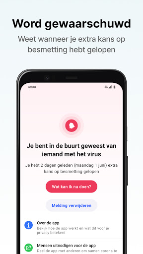
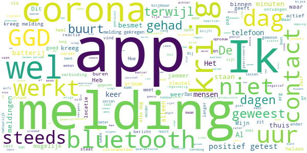

# CoronaMelder
App version ``1.1.2``

Analyzed with [covid-apps-observer](http://github.com/covid-apps-observer) project, version ``0.1``

## App overview
| | |
|-------------------------|-------------------------| 
| **Name**                                          | CoronaMelder |
| **Unique identifier** | nl.rijksoverheid.en |
| **Link to Google Play** | [https://play.google.com/store/apps/details?id=nl.rijksoverheid.en](https://play.google.com/store/apps/details?id=nl.rijksoverheid.en) |
| **Summary**  | Help de verspreiding van het coronavirus in Nederland te stoppen |
| **Privacy policy** | [https://coronamelder.nl/nl/privacy](https://coronamelder.nl/nl/privacy) |
| **Latest version** | 1.1.2 |
| **Last update** | 2020-12-14 14:51:12 |
| **Recent changes** | Dank je wel voor het gebruiken van CoronaMelder. Je helpt daarmee corona in Nederland te stoppen. Deze versie van CoronaMelder bevat tekstaanpassingen en kleine stabiliteitsverbeteringen. |
| **Installs**  | 1.000.000+ |
| **Category** | Medisch |
| **First release** | 10 aug. 2020 |
| **Size**  | 7,1M |
| **Supported Android version**  | 6.0 en hoger |

### Description
> CoronaMelder is de officiële corona notificatie-app van Nederland, ontwikkeld onder het toezicht van het Ministerie van Volksgezondheid, Welzijn en Sport. De app is een digitaal hulpmiddel bij het bron- en contactonderzoek door de GGD. 
 De app waarschuwt je nadat je in de buurt bent geweest van iemand met corona. Zo kun je jezelf en de mensen in je omgeving beschermen. En kunnen we samen het aantal besmettingen in Nederland zo laag mogelijk houden. Het gebruik van de app is vrijwillig. Niemand mag controleren of jij de app op je telefoon hebt. Maar hoe meer mensen de app gebruiken, hoe beter deze werkt. 
 Bij de ontwikkeling van deze app is rekening gehouden met toegankelijkheid, zie voor meer informatie onze toegankelijkheidsverklaring.
 Hoe werkt de app?
 # Je geeft alleen toegang tot je bluetoothgegevens
 CoronaMelder ziet via bluetooth wanneer je in de buurt bent van andere mensen met de app. De app gebruikt geen persoons- of locatiegegevens. De app weet dus niet wie je bent, waar je was en wie je hebt ontmoet.
 # Je krijgt een melding nadat je extra kans op besmetting hebt gelopen
 De app stuurt een melding als je minstens 15 minuten in de buurt bent geweest van iemand die later corona blijkt te hebben. Deze persoon moet ook de app gebruiken.
 # Je kunt anderen waarschuwen als je zelf besmet blijkt te zijn
 Ben je getest door de GGD en blijk je corona te hebben? Dan kun je samen met de GGD via de app een melding sturen naar de mensen bij wie je in de buurt bent geweest - in de periode dat je besmettelijk was. In deze melding staat alleen wanneer ze in de buurt zijn geweest van een besmet persoon. Niet wie of waar dit was.
 Hoe gaat de app met je gegevens om?
 • Je hoeft geen persoonsgegevens zoals je e-mailadres of naam in te voeren.
 • Als je iemand tegenkomt wisselen jullie telefoons via bluetooth willekeurige codes uit. Zo meet de app de duur en de afstand van het contact. In de codes staat niets over wie jullie zijn en waar jullie zijn geweest. 
 • De codes die je via bluetooth uitwisselt worden alleen op je telefoon bewaard en na 14 dagen verwijderd.
 • Gebruikers van de app zijn niet terug te vinden door de makers van de app, de overheid of andere gebruikers.

### User interface
The developers of the app provide the following screenshots in the Google play store.
| | | |
|:-------------------------:|:-------------------------:|:-------------------------:|
 |   |   |   | 
 |   |   |   | 

## Development team
In the following we report the main information provided by the development team in the Google play store.

| | |
|-------------------------|-------------------------|
| **Developer**  | Rijksoverheid |
| **Website**  | [https://coronamelder.nl/](https://coronamelder.nl/) |
| **Email** | helpdesk@coronamelder.nl |
| **Physical address**  | - |
| **Other developed apps**  | [https://play.google.com/store/apps/developer?id=Rijksoverheid](https://play.google.com/store/apps/developer?id=Rijksoverheid) |

## Android support

| | |
|-------------------------|-------------------------|
| **Declared target Android version**  | - |
| **Effective target Android version**  | - |
| **Minimum supported Android version**  | Marshmallow, version 6.0 (API level 23) |
| **Maximum target Android version**  | - |

The larger the difference between the minimum and maximum supported Android versions, the better. A larger difference means a wider audience. For example, old phones have a very low Android version, so a high minimum supported Android version means that the app cannot be used by users with old phones, thus leading to accessibility problems. 

## Requested permissions

In the following we report the complete list of the permissions requested by the app. 

| **Permission** | **Protection level** | **Description** | 
|-------------------------|-------------------------|-------------------------|
 **android.permission ACCESS_NETWORK_STATE** | Normal | Allows applications to access information about networks. 
 **android.permission BLUETOOTH** | Normal | Allows applications to connect to paired bluetooth devices. 
 **android.permission FOREGROUND_SERVICE** | Normal | Allows a regular application to use Service.startForeground. 
 **android.permission INTERNET** | Normal | Allows applications to open network sockets. 
 **android.permission RECEIVE_BOOT_COMPLETED** | Normal | Allows an application to receive the Intent.ACTION_BOOT_COMPLETED that is broadcast after the system finishes booting. 
 **android.permission REQUEST_IGNORE_BATTERY_OPTIMIZATIONS** | Normal | Permission an application must hold in order to use Settings.ACTION_REQUEST_IGNORE_BATTERY_OPTIMIZATIONS. 
 **android.permission WAKE_LOCK** | Normal | Allows using PowerManager WakeLocks to keep processor from sleeping or screen from dimming. 

## Mentioned servers

| **Server** | **Registrant** | **Registrant country** | **Creation date** | 
|-------------------------|-------------------------|-------------------------|-------------------------|
 | google.com | Google LLC | :us: US | 1997-09-15 04:00:00 |
 | coronamelder-dist.nl | - | - | 2020-07-20 00:00:00 |
 | coronamelder-api.nl | - | - | 2020-07-22 00:00:00 |
 | android.com | Google LLC | :us: US | 1997-06-23 04:00:00 |

## Security analysis 

Below we report the main security warnings raised by our execution of the [Androwarn](https://github.com/maaaaz/androwarn) security analysis tool.

**Connection interfaces exfiltration**
> - This application reads details about the currently active data network 
> - This application tries to find out if the currently active data network is metered 

**Telephony services abuse**
> - This application makes phone calls 

**Suspicious connection establishment**
> - This application opens a Socket and connects it to the remote address '; port is out of range' on the 'N/A' port  
> - This application opens a Socket and connects it to the remote address 'Ljava/net/Proxy;->type()Ljava/net/Proxy$Type;' on the 'N/A' port  
> - This application opens a Socket and connects it to the remote address 'Ln/b/a/a/a;->F(Ljava/lang/String;)Ljava/lang/StringBuilder;' on the 'N/A' port  
> - This application opens a Socket and connects it to the remote address 'timeout' on the 'N/A' port  

## User ratings and reviews

Below we provide information about how end users are reacting to the app in terms of ratings and reviews in the Google Play store.

### Ratings

The CoronaMelder app has been installed by more than **1000000** times. At this time, **6616** rated the app and its average score is **3.0706923**. Below we show the distribution of the ratings across the usual star-based rating of Google Play

:star::star::star::star::star:: 2349

:star::star::star::star:: 779

:star::star::star:: 662

:star::star:: 643

:star:: 2183

### Reviews 

#### 5-star reviews

> Goed  :date: __2021-01-03 00:38:22__

> Vriend heeft melding gehad. Blijkt positief  :date: __2021-01-02 20:15:42__

> Gebruik de app al een hele tijd en tot nu toe geen meldingen en ook geen klachten. Houd afstand en gebruik de voorschriften. Blijf gezond, help de zorg.  :date: __2021-01-02 14:36:31__

> Gelukkig nog geen melding  :date: __2021-01-01 16:00:10__

> Het is een goede app  :date: __2020-12-31 16:19:20__

> Why is it in english? Not everyone understands that.  :date: __2020-12-31 00:20:20__

> Goed bedacht  :date: __2020-12-30 21:55:24__

> Niet leuk maar wel noodzakelijk  :date: __2020-12-30 20:32:17__

> Geweldig  :date: __2020-12-30 20:09:27__

> ik vind het een goede oplossing om de corona te stoppen terwijl ik nog 8 jaar ben ik doe ook mee om het COVID19 te stoppen ik ben nog een kind! ik ben 8 jaar maar ik doe toch mee want ik will dat dat... stomme coronavirus stopt!! ik ik...... draag toch een mondkapje ik luister altijd naar de coronaregels!! ik doe mee!!!!!!!!  :date: __2020-12-30 19:48:32__

#### 4-star reviews

> Geen ervaring  :date: __2020-12-30 20:38:28__

> Kan altijd beter.  :date: __2020-12-29 13:59:32__

> Kreeg melding, ben in quarantaine gegaan en kwam de deur niet uit. Bleef melding krijgen. Gebeld met info nummer en kreeg bericht dat Bluetooth w.s. door de muur heen werkt ivm besmetting buren.  :date: __2020-12-29 11:08:16__

> Hij gaat de laatste tijd regelnatig zonaar opeens uit. Maar zo weer aan te klikken.wat kan ik daaraan doen? Dat uitgaan zou met piepen gemeld kunnen worden. Verder gelykkig nog geen meldingen  :date: __2020-12-29 09:42:08__

> Krijg regelmatig de melding dat er 24 uur niet gecontroleerd kon worden of iets dergelijks. Is de app op de een of andere manier niet actief. Géén idee waardoor. Nog geen andere melding gehad dus geen idee hoe de app functioneert maar dat zal verder best goed zijn.  :date: __2020-12-28 19:09:42__

> Heel overzichtelijk.  :date: __2020-12-28 07:40:46__

> Ik heb 3 december 2020 een melding gehad van een mogelijke besmetting op 25 november. Dus na 8 dagen. Ik heb me laten testen op 4 december,.om 10.12, omdat ik plasma zou geven op 5 december 14.00. De uitslag was er zaterdag morgen en negatief, dus kon ik in de middag plasma geven. Nu heb ik nog steeds de melding inzake 25 november op mojn app staan Kan een nieuwe melding nu wel binnen komen. Of m oiet ik de oude melding verwijderen.  :date: __2020-12-27 09:52:10__

> Ik heb de aap wel maar volgens mij werkt het niet zo goed omdat ik 3 keer in de maand melding kreeg en ik ben 3x ziek geweest maar ik heb laten testen en ik heb geen COVID19 huh? Hoe dan ? kan iemand me uitleggen. @rijksoverheid? Ik nie snap  :date: __2020-12-27 00:42:36__

> Ik vind prima en handige om zo meld te krijgen  :date: __2020-12-24 12:44:28__

> Prima app. Alleen vraag ik mij af of de informatie bij 'Corona test aanvragen' nog wel actueel is?  :date: __2020-12-24 10:46:20__

#### 3-star reviews

> Mis installatie focumentatie op apparaat niveau zosls Galaxy S9, etc  :date: __2021-01-02 20:16:36__

> Tevreden  :date: __2020-12-30 19:03:36__

> ik geef 3 omdat het is aleen bei mensen dat dit app ook heben  :date: __2020-12-30 18:44:20__

> Geen GGD sleutel ontvangen omdat GGD het te druk heeft om bron- en contactonderzoek te doen. Ik zou het handig vinden als bij de positieve uitslag automatisch een sleutel + uitleg voor invoer in de app gegeven wordt. Het is nu erg omslachtig, en daar zit je niet op te wachten als je in quarantaine moet en veel moet regelen (of te ziek bent, wat wij gelukkig niet zijn geweest). Inmiddels hier volledig klachtenvrij, maar de app niet kunnen inzetten om anderen te beschermen.  :date: __2020-12-30 11:12:48__

> Ik heb het virus en ik zal het in de app zetten  :date: __2020-12-29 21:02:36__

> Het is wat er werd gezegd door een persoon. 'Ik vind het niet prettig dat IK door Jan en allemens gescand word. Nee, dat soort apps vind ik een inbreuk op de privacy. Ik kreeg een soort wake up moment. 🤔 Zélf vind ik het schande dat die Bluetooth aan moet, plus de ander(lees: iedereen!) de app 'ook moet'. Dat Bluetooth is zo'n onveilig gat in de vuurmuur van je O.S. Dat moet over de frequentie van de betreffende telefoon. Zoals in, wat was het, 1994, dat ADSL (safe.) over de nullijn  :date: __2020-12-29 02:18:24__

> Jammer dat je niet ziet in welk gebied er besmette mensen zijn zo dat je dat gebied juist kan vermijden zodat het virus niet weer verder gaat  :date: __2020-12-28 19:36:43__

> Misschien niet de juiste plek om een vraag te stellen, maar toch. Krijg melding dat ik eerste kerstdag in contact ben geweest, hebben echter met het gezin thuis kerst gevierd, alle gezinsleden hebben de app, niemand was/is positief en ik ben de enige die een melding krijgt.  :date: __2020-12-28 18:33:42__

> Hoewel hij waarschijnlijk doet wat hij moet doen, te weinig coole grafieken/data om zelf te bekijken. Maak het zichtbaar wat de app op een dag doet! 📊  :date: __2020-12-28 18:21:47__

> Ik weet zeker ivm werk, zorg. Dat meerdere collega's positief zijn gebleken achteraf en de app hebben. Dat deze app meerdere keren geen seintje door gaf. Terwijl je op kantoor of pauze toch redelijk dicht bij bent, zelfs langer dan 15 minuten. Dus wat de bedoeling van deze app nu precies is, ik weet het niet. Maar hier vertrouw ik maar niet op.  :date: __2020-12-27 11:40:17__

#### 2-star reviews

> Ben al dagen samen met mijn vrouw die corona heeft maar geen melding ontvangen.?  :date: __2021-01-02 14:56:43__

> Valt steeds uit  :date: __2021-01-02 09:48:23__

> Praktijk "Ontwerp fout" met meldingen. In theorie werkt het maar niet in de praktijk. Als je de app melding niet ziet in de berichten stroom dan kom je 20 dagen later erachter bij het openen van de app dat er een melding is. Snel aanpakken dit, namelijk dat de melding vaker komt of niet zo makkelijk weggedrukt kan worden !!! Ik had dit ook gemaild 10 dagen geleden maar geen enkele reactie gehad. Blijkbaar is daar wel vakantie. Helaas heeft Corona geen kerstvakantie....  :date: __2021-01-01 16:12:33__

> Krijg steeds de melding dat de app 24 uur geen controle kon uitvoeren en als ik de app open moet deze weer geactiveerd worden  :date: __2021-01-01 13:26:17__

> Het is nu meerdere keren gebeurt dat ik een melding heb gekregen van de app met dat ik mogelijk corona heb doordat ik langer dan 15 minuten naast iemand zou hebben gezeten met corona. Vind ik knap aangezien ik op de dag bij iemand was die nergens last van heeft. Bij een andere melding had ik niet eens met iemand contact gehad. Hoe groot is dan wel niet het bereik van deze app? Kleine edit: ik kreeg dit als notificatie maar het stond ook aangegeven in de app zelf.  :date: __2020-12-31 14:01:44__

> Je kan na alle buren meldingen toch niet volhouden dat er een kleine kans is dat het door muren werkt. Zowel mijn melder als die van mijn vriendin ging af. Door eliminatie is de enige mogelijkheid de besmette buurvrouw. (Beterschap!)  :date: __2020-12-31 09:56:05__

> Zelf vind ik deze app niet zo heel fijn, omdat je je locatie aan moet zetten en dan gaat je batterij sneller leeg. Ik heb de app al een paar weken en hij geeft geen meldingen als ik bij iemand in de buurt ben geweest dat bsn ik namelijk wel dus ja erg jammer  :date: __2020-12-30 23:17:14__

> In februari was de kans zeer gering dat corona naar Europa kwam en nu lees ik dat de kans klein is dat de app door muren heen een connectie maakt. Ik kan vertellen dat dit zeker is dat dit kan. Ik kreeg een melding dat ik op een bepaalde dag in contact was geweest met iemand met corona terwijl ik die gehele dag binnen was geweest. Uit navraag blijken onze buren toen in de app te hebben aan gegeven corona te hebben. Het zou verstandig zijn als jullie onderzoek doen en niet maar zomaar wat roepen.  :date: __2020-12-30 20:55:57__

> Regelmatig géén verbinding met internet. Dat ligt niet aan mijn onbeperkt 5G abonnement. December 2020 Helaas nog steeds elke dag de melding dat de app niet gewerkt heeft. Werkt het nu wel of niet. Hopelijk dat het in 2021 opgelost gaat worden (of covid weg natuurlijk)  :date: __2020-12-29 12:26:19__

> Doe er niets mee, want ik sta buiten met niemand een kwartier te praten of id.  :date: __2020-12-28 17:10:37__

#### 1-star reviews

> Vrouw positief, test 1 januari. Uitslag avond 2 januari, vandaag gebeld door GGD. (3 januari) we zijn uren verder en ik heb nog geen melding terwijl we in het zelfde huis zitten. Tot heden nog nooit een melding gehad.  :date: __2021-01-03 13:29:05__

> Had al meerdere malen een melding moeten hebben Werkt niet echt volgens mij  :date: __2021-01-03 12:09:37__

> Op 30 december laten testen ivm klachten samen met echtgenote op 31 december uitslag ik blijk positief en zij negatief. Mijn corona app heeft niets doorgeven ben eerder besmet dan 30 december. Echtgenote heeft geen corona melder. Kijk ik vandaag in de app u bent op 31 december minimaal 15 minuten in contact geweest met iemand die besmet is. Ben op 31 december zeker niet in contact geweest met iemand omdat ik in quarantaine ben.!!!!!!!!!  :date: __2021-01-03 05:01:42__

> Je hebt er helemaal niks aan, je krijgt geen meldingen. Ik heb gebeld met de vraag waarom niet, het antwoord: Ja wanneer er geen duidelijke symptomen zijn (ookal ben je positief getest) sturen ze geen melding.... Dus het hele nut is weg! Alsof dragers, die dus minder symptomen hebben, geen covid kunnen overdragen! Edit: Ik heb gebeld met de GGD, die hebben mij dit vertelt. Hetzelfde verhaal hoor ik van meer verontwaardigde mensen en is te lezen in de reviews  :date: __2021-01-02 21:11:37__

> Hele tijd krijg ik melding dat de app niet actief is, maar heb Bluetooth en locatie en mobiele gegevens 24/7 aan staan  :date: __2021-01-02 13:14:49__

> Huisgenoten zijn positief en ik krijg geen melding. Waardeloze app.  :date: __2021-01-02 11:30:05__

> Waarom alles in het Engels we zijn in Nederland  :date: __2021-01-02 10:43:59__

> Hoewel iemand in mijn omgeving het heeft, krijg ik geen melding hierover. Kan dus gewoon door gaan met iedereen besmetten  :date: __2021-01-02 10:17:28__

> Werkt niet naar behoren. Ik kreeg na een maand een melding dat ik mogelijk met iemand in aanrakig was geweest. Beetje te laat.  :date: __2021-01-02 09:50:30__

> Werk echt heel slecht. Ik bekijk het nog even..en dan verwijderd ik Deze app.  :date: __2021-01-02 09:35:56__

