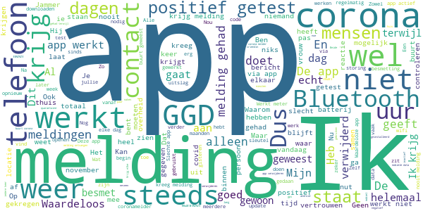

# CoronaMelder
App version ``1.2.2``

Analyzed with [covid-apps-observer](http://github.com/covid-apps-observer) project, version ``0.1``

## App overview
| | |
|-------------------------|-------------------------| 
| **Name**&nbsp;&nbsp;&nbsp;&nbsp;&nbsp;&nbsp;&nbsp;&nbsp;&nbsp;&nbsp;&nbsp;&nbsp;&nbsp;&nbsp;&nbsp;&nbsp;&nbsp;&nbsp;&nbsp;&nbsp;&nbsp;&nbsp;&nbsp;&nbsp;&nbsp;&nbsp;&nbsp;&nbsp;&nbsp;&nbsp;&nbsp;&nbsp;&nbsp;&nbsp;&nbsp;&nbsp;&nbsp;&nbsp;&nbsp;&nbsp;  | CoronaMelder |
| **Unique identifier** | nl.rijksoverheid.en |
| **Link to Google Play** | [https://play.google.com/store/apps/details?id=nl.rijksoverheid.en](https://play.google.com/store/apps/details?id=nl.rijksoverheid.en) |
| **Summary**  | Help de verspreiding van het coronavirus in Nederland te stoppen |
| **Privacy policy** | [https://coronamelder.nl/nl/privacy](https://coronamelder.nl/nl/privacy) |
| **Latest version** | 1.2.2 |
| **Last update** | 2021-01-27 12:33:49 |
| **Recent changes** | Dank je wel voor het gebruiken van CoronaMelder. Je helpt daarmee corona in Nederland te stoppen. Deze update bevat de functie om de app te pauzeren. Pauzeer de app alleen in situaties waarin je telefoon dicht bij telefoons van anderen komt, maar er geen kans op besmetting is. |
| **Installs**  | 1.000.000+ |
| **Category** | Medisch |
| **First release** | 10 aug. 2020 |
| **Size**  | 7,1M |
| **Supported Android version**  | 6.0 en hoger |

### Description
> CoronaMelder is de officiële corona notificatie-app van Nederland, ontwikkeld onder het toezicht van het Ministerie van Volksgezondheid, Welzijn en Sport. De app is een digitaal hulpmiddel bij het bron- en contactonderzoek door de GGD. 
 De app waarschuwt je nadat je in de buurt bent geweest van iemand met corona. Zo kun je jezelf en de mensen in je omgeving beschermen. En kunnen we samen het aantal besmettingen in Nederland zo laag mogelijk houden. Het gebruik van de app is vrijwillig. Niemand mag controleren of jij de app op je telefoon hebt. Maar hoe meer mensen de app gebruiken, hoe beter deze werkt. 
 Bij de ontwikkeling van deze app is rekening gehouden met toegankelijkheid, zie voor meer informatie onze toegankelijkheidsverklaring.
 Hoe werkt de app?
 # Je geeft alleen toegang tot je bluetoothgegevens
 CoronaMelder ziet via bluetooth wanneer je in de buurt bent van andere mensen met de app. De app gebruikt geen persoons- of locatiegegevens. De app weet dus niet wie je bent, waar je was en wie je hebt ontmoet.
 # Je krijgt een melding nadat je extra kans op besmetting hebt gelopen
 De app stuurt een melding als je minstens 15 minuten in de buurt bent geweest van iemand die later corona blijkt te hebben. Deze persoon moet ook de app gebruiken.
 # Je kunt anderen waarschuwen als je zelf besmet blijkt te zijn
 Ben je getest door de GGD en blijk je corona te hebben? Dan kun je samen met de GGD via de app een melding sturen naar de mensen bij wie je in de buurt bent geweest - in de periode dat je besmettelijk was. In deze melding staat alleen wanneer ze in de buurt zijn geweest van een besmet persoon. Niet wie of waar dit was.
 Hoe gaat de app met je gegevens om?
 • Je hoeft geen persoonsgegevens zoals je e-mailadres of naam in te voeren.
 • Als je iemand tegenkomt wisselen jullie telefoons via bluetooth willekeurige codes uit. Zo meet de app de duur en de afstand van het contact. In de codes staat niets over wie jullie zijn en waar jullie zijn geweest. 
 • De codes die je via bluetooth uitwisselt worden alleen op je telefoon bewaard en na 14 dagen verwijderd.
 • Gebruikers van de app zijn niet terug te vinden door de makers van de app, de overheid of andere gebruikers.

### User interface
The developers of the app provide the following screenshots in the Google play store.
| | | |
|:-------------------------:|:-------------------------:|:-------------------------:|
 |   |   |   | 
 |   |   |   | 

## Development team
In the following we report the main information provided by the development team in the Google play store.

| | |
|-------------------------|-------------------------|
| **Developer**  | Rijksoverheid |
| **Website**  | [https://coronamelder.nl/](https://coronamelder.nl/) |
| **Email** | helpdesk@coronamelder.nl |
| **Physical address**  | - |
| **Other developed apps**  | [https://play.google.com/store/apps/developer?id=Rijksoverheid](https://play.google.com/store/apps/developer?id=Rijksoverheid) |

## Android support

| | |
|-------------------------|-------------------------|
| **Declared target Android version**  | - |
| **Effective target Android version**  | - |
| **Minimum supported Android version**  | Marshmallow, version 6.0 (API level 23) |
| **Maximum target Android version**  | - |

The larger the difference between the minimum and maximum supported Android versions, the better. A larger difference means a wider audience. For example, old phones have a very low Android version, so a high minimum supported Android version means that the app cannot be used by users with old phones, thus leading to accessibility problems. 

## Requested permissions

In the following we report the complete list of the permissions requested by the app. 

| **Permission** | **Protection level** | **Description** | 
|-------------------------|-------------------------|-------------------------|
 **android.permission ACCESS_NETWORK_STATE** | Normal | Allows applications to access information about networks. 
 **android.permission BLUETOOTH** | Normal | Allows applications to connect to paired bluetooth devices. 
 **android.permission FOREGROUND_SERVICE** | Normal | Allows a regular application to use Service.startForeground. 
 **android.permission INTERNET** | Normal | Allows applications to open network sockets. 
 **android.permission RECEIVE_BOOT_COMPLETED** | Normal | Allows an application to receive the Intent.ACTION_BOOT_COMPLETED that is broadcast after the system finishes booting. 
 **android.permission REQUEST_IGNORE_BATTERY_OPTIMIZATIONS** | Normal | Permission an application must hold in order to use Settings.ACTION_REQUEST_IGNORE_BATTERY_OPTIMIZATIONS. 
 **android.permission WAKE_LOCK** | Normal | Allows using PowerManager WakeLocks to keep processor from sleeping or screen from dimming. 

## Mentioned servers

| **Server** | **Registrant** | **Registrant country** | **Creation date** | 
|-------------------------|-------------------------|-------------------------|-------------------------|
 | google.com | Google LLC | :us: US | 1997-09-15 04:00:00 |
 | coronamelder-dist.nl | - | - | 2020-07-20 00:00:00 |
 | coronamelder-api.nl | - | - | 2020-07-22 00:00:00 |
 | android.com | Google LLC | :us: US | 1997-06-23 04:00:00 |

## Security analysis 

Below we report the main security warnings raised by our execution of the [Androwarn](https://github.com/maaaaz/androwarn) security analysis tool.

**Connection interfaces exfiltration**
> - This application reads details about the currently active data network 
> - This application tries to find out if the currently active data network is metered 

**Telephony services abuse**
> - This application makes phone calls 

**Suspicious connection establishment**
> - This application opens a Socket and connects it to the remote address '; port is out of range' on the 'N/A' port  
> - This application opens a Socket and connects it to the remote address 'Ljava/net/Proxy;->type()Ljava/net/Proxy$Type;' on the 'N/A' port  
> - This application opens a Socket and connects it to the remote address 'Ln/b/a/a/a;->G(Ljava/lang/String;)Ljava/lang/StringBuilder;' on the 'N/A' port  
> - This application opens a Socket and connects it to the remote address 'timeout' on the 'N/A' port  

## User ratings and reviews

Below we provide information about how end users are reacting to the app in terms of ratings and reviews in the Google Play store.

### Ratings

The CoronaMelder app has been installed by more than **1000000** times. At this time, **7218** rated the app and its average score is **3.0555556**. Below we show the distribution of the ratings across the usual star-based rating of Google Play

:star::star::star::star::star:: 2543

:star::star::star::star:: 861

:star::star::star:: 645

:star::star:: 792

:star:: 2377

### Reviews 

#### 5-star reviews

> Blij met deze extra bescherming  :date: __2021-02-13 14:32:17__

> Vindt het goed maar zou het ook melding komt en de telefoon gaat is die melding weg en zou daar ook terug kunnen kijken die mis ik want ik kreeg een melding ik ging kijken en toen ging de telefoon die nam ik op maar de melding kon ik niet meer terug kijken wat er aan de hand is  :date: __2021-02-12 09:17:26__

> Alle beetjes helpen elkaar er door heen  :date: __2021-02-08 13:02:12__

> Zeer fyn  :date: __2021-02-06 20:59:07__

> P.s Bleutooth & CoronaMelder Zoeken ook steeds naar andere Apparaten met Bleutooth. Gevolg Lege accu.❗ -‐--------------------- De meeste gebruikers luisteren muziek in de Trein / Bus. Etc. Dan staat de Smartphone in de ( Slaapmodus ) zodat je niet gestoord wordt omdat je dan naar de muziek luisterd.❗ __Maar_dan_werkt_de____Coronamelder niet, in de slaapmodus❗💫❗  :date: __2021-02-03 22:35:22__

> De Update van 5 oktober 2020 laat de coronamelder steeds crashen op mijn mobiel hij doet niks meer chrashed meteen. Na de update van december 2020 werkt ie weer.👍 goed bezig. Laatste Update van januari 2021 laat coronamelder weer crashen.  :date: __2021-01-30 20:49:48__

> Ideale app, tot mijn verbazing maar 1 miljoen downloads. Dit zouden er veel meer moeten zijn voor een optimale werking! Geen batterij slurpende app en je heb er geen 'last' van dat hij op de achtergrond draait.  :date: __2021-01-30 10:08:22__

> Deze App is duidelijk  :date: __2021-01-29 16:14:14__

> Als je een 5.000mAh batterij hebt maak dat extra beetje vebruik door bluetooth ook niet veel uit :)  :date: __2021-01-29 00:58:53__

> Zeer belangrijk.  :date: __2021-01-29 00:50:31__

#### 4-star reviews

> gewoon goed  :date: __2021-02-12 14:12:43__

> Haha beste prank ooit  :date: __2021-02-11 12:04:38__

> Geeft soms aan niet actief te zijn geweest de afgelopen dag. Ik weet niet wat dat betekent en hoe dat voorkomen kan worden.  :date: __2021-02-10 14:30:47__

> Prima, maar door Google Play is deze natuurlijk niet te vertrouwen qua privacy. India, Duitsland en de V.S. hebben hun app ook in F-Droid beschikbaar gemaakt. Waarom deze niet?  :date: __2021-02-10 11:47:53__

> Tja app is goed. Heb hem al n hele tijd  :date: __2021-02-06 18:19:23__

> Na vele pogingen via een omweg is het toch 🤞 gelukt om de app opnieuw te installeren  :date: __2021-02-05 12:22:01__

> In de eerste variant kon je zien hoeveel mensen om je heen waren gescanned. Nu zie je dat niet meer. Je hebt maar een vinkje dat de app actief is. Ik vond het eigenlijk heel fijn om te zien hoeveel mensen waren er gecheckt. Hoort het nu zo te zijn, zonder aantal gecheckte mensen maar alleen dat vinkje? Verder heb ik geen last van de app, hij werkt in de achtergrond, je krijgt misschien 1keer per week een notificatie over de status van de app en de batterij loopt niet sneller leeg. Top! 👍  :date: __2021-02-04 08:54:11__

> Vraagje: Gaat de coronamelder aangepast worden op de hogere besmettelijkheid van de Britse coronavariant? Hier heb ik Hugo de Jonge nog niets over horen zeggen in de persconferenties.  :date: __2021-02-02 19:32:52__

> Werk,t goed  :date: __2021-02-01 13:55:25__

> 👍🏻  :date: __2021-01-28 17:28:21__

#### 3-star reviews

> Het is goed hij gaat zelf op pauze en zegt dat hij geen 24 uur controle uit kan voeren en het is al 2 keer gebeurd  :date: __2021-02-09 17:41:03__

> Negatief getest  :date: __2021-02-06 13:17:28__

> Vind het heel ingewikkeld.....  :date: __2021-02-04 01:05:53__

> Zondag kreeg ik via de app een melding over een contact met een besmet persoon op de woensdag ervoor. Gelukkig meldde de besmette persoon het vrijdag en ben ik gelijk in thuisquarantaine gegaan. Helaas heb ik in de tussentijd wel mijn kwetsbare ouders en collega's op het werk bezocht. Oftewel: ik vind dat de melding nogal laat kwam, op de 4e dag.  :date: __2021-02-01 18:13:49__

> Ik heb een vraag moet je 4G aan hebben als het moet werken in kan het offline?  :date: __2021-01-31 10:59:55__

> Is er geen ruik en test uit slag en mogelijk heden  :date: __2021-01-30 11:56:40__

> Op zich prima dat deze app er is. Maar hoe zit het met registratie als je een ziekenhuisbezoek hebt gebracht. In het ziekenhuis liggen corona patiënten, krijg je dan automatisch de melding dat je in de buurt van mensen met corona bent geweest? Ik twijfel dus onderga maandag een corona test nav deze melding die ik kreeg nadat ik eerder in de week in het ziekenhuis oa ben geweest.. Maar wellicht is deze onrust onnodig? Wie heeft ervaring hiermee.?  :date: __2021-01-29 19:28:54__

> Op de ene telefoon krijg ik een melding dat ik in de buurt van een besmet persoon ben geweest en op de andere niet terwijl ik de telefoons altijd bij me draag  :date: __2021-01-29 09:53:06__

> Zijn de gegevens die lekken via de GGD ook afkomstig van deze app ?? 🤔🤔🤔😠  :date: __2021-01-28 16:56:20__

> Mijn mobiele data staan de hele dag aan.toch krijg ik elke keer bij check van de app de melding dat er geen verbinding is. Ik tik dan op de balk weer verbinden en dan blijkt de app weer wel verbonden te zijn. Geeft toch geen goed gevoel af.  :date: __2021-01-26 23:32:16__

#### 2-star reviews

> Moet hem bijna elke dag opnieuw starten, minder leuk .  :date: __2021-02-12 14:13:54__

> Moet bijna dagelijks de app opnieuw aanzetten omdat ik de melding krijg dat hij niet actief is.  :date: __2021-02-11 09:44:52__

> Ik ben arts, zie inmiddels wekelijks wel een aantal zieke, bij de GGD positieve geteste coronapatienten, maar zelfs als ik de app op de achtergrond draaiend houd, heb ik nog NOOIT een melding ontvangen... En ik heb een nieuwe smartphone die nog vorig jaar pas uitgebrachts is met de nieuwste android versie erop  :date: __2021-02-04 12:41:20__

> Slechte app, gaat veel te veel uit van de eerlijke en goede wil van de gebruiker.  :date: __2021-02-03 17:37:16__

> In de app staat dat het bijna niet kan dat de bluetooth van een buurman jouw apparaat bereikt door een muur. Dit is toch gebeurt. Daarnaast vind ik het raar dat er geen tijdstip gemeld wordt over het moment, want dan kun je zelf nagaan of het mogelijk is dat je besmet bent. Zal wel met privacy te maken hebben, maar dit zou wel helpen.  :date: __2021-02-03 10:56:01__

> Hij valt voortdurend uit. Elke ochtend melding dat de app de afgelopen 24 uur niet werkte  :date: __2021-02-02 21:19:45__

> Ik werk in supermarkt. Hele week gewoon aan werk krijg ik zaterdagavond app je bent 5 dagen geleden in aanmerking gekomen die meer dan 15 minuten in je buurt was. Lekker op tijd dan zeg, heb hele week gewerkt, iedereen gewoon bij ons ook klanten. Lekker is dat dan. Melding is veel te laat. Moet direct melding hebben als iemand in buurt is niet 5 dagen later  :date: __2021-01-31 00:56:54__

> Blijkbaar werkt de app niet wand heb naast een persoon gezeten die carona had en hij is niet afgegaan ik weet het door dat die het zij dat hij het heeft gehad  :date: __2021-01-29 23:40:16__

> Na de update moet je de app opnieuw activeren lijkt het? Wordt niet gemeld.  :date: __2021-01-29 09:39:01__

> Ik snap de keuze van de party mode (pauze stand) niet helemaal. Wat is dan nog het praktisch nut van deze app als mensen hem op pauze kunnen zetten?  :date: __2021-01-29 02:01:04__

#### 1-star reviews

> Werkt totaal niet!  :date: __2021-02-13 08:55:42__

> Wel slecht deze app Werkt door muren heen Want idd bluetooth gaat makelijk door de muur Is het niet zo dat julie graag hebben dat we thuis blijven Nog iets mijn vriendin is gestest Negatief Maar hou is op met je onzin En liegen Mensen bedriegen mensen stuipen op het lijf jagen Tuurlijk gaat bluetooth door de muur Korte golf tjonge tjonge Steletje bij elkaar geraapt zooitje  :date: __2021-02-12 21:00:29__

> Ik krijg regelmatig het ronde logo van de app boven in beeld. Als ik deze naar beneden scroll om te openen, is de melding weg en heb ik niet kunnen zien waar de melding over ging. Als ik de app open dan staat er dat hij niet actief is. Kan dit de melding zijn? Ik neem aan dat een melding van contact met een corona patiënt duidelijk te zien is en blijft...?  :date: __2021-02-12 20:23:13__

> Als je wilt dat je batterij snel opgaat aan en app die niet werkt download deze app  :date: __2021-02-12 16:50:27__

> Werkt voor geen meter, krijg op meerdere telefoons geen melding van mogelijke besmetting. Toestellen hebben een dag naast elkaar gelegen. Ja ggd code is geactiveerd en Bluetooth staat aan. Na doorgifte code aan ggd de vervolgstappen uitgevoerd om het te delen.  :date: __2021-02-12 13:43:18__

> De app schakelt steeds uit omdat mijn mobiel een batterijoptalisatie heeft aanstaan, maar hoe ik uitzet. God mag het weten. Waarom kan ik vanaf de app niet doorklikken of de app zet het zelf uit. Op deze manier kan ik de app beter verwijderen. Hij staat toch uit!  :date: __2021-02-11 09:36:48__

> Krijg bijna iedere dag de melding dat de app 24 uur geen verbinding heeft kunnen maken. Als ik er op tik gaat hij wel verder  :date: __2021-02-10 13:35:04__

> Dagelijks in ziekenhuis.Ook bij verschillende besmette (aangemeld in deze app) patiënten geweest. Geen melding van deze app ontvangen. FAKE!  :date: __2021-02-09 19:39:28__

> Kloten app  :date: __2021-02-09 16:09:58__

> Slecht .. Hoor ..  :date: __2021-02-09 12:22:21__

