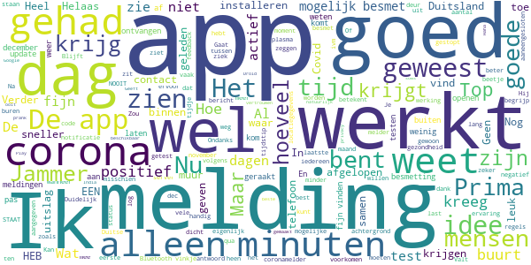
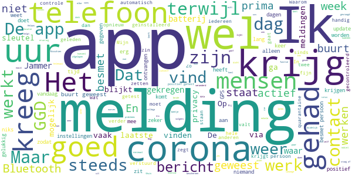

# CoronaMelder
App version ``1.2.2``

Analyzed with [covid-apps-observer](http://github.com/covid-apps-observer) project, version ``0.1``

## App overview
| | |
|-------------------------|-------------------------| 
| **Name**&nbsp;&nbsp;&nbsp;&nbsp;&nbsp;&nbsp;&nbsp;&nbsp;&nbsp;&nbsp;&nbsp;&nbsp;&nbsp;&nbsp;&nbsp;&nbsp;&nbsp;&nbsp;&nbsp;&nbsp;&nbsp;&nbsp;&nbsp;&nbsp;&nbsp;&nbsp;&nbsp;&nbsp;&nbsp;&nbsp;&nbsp;&nbsp;&nbsp;&nbsp;&nbsp;&nbsp;&nbsp;&nbsp;&nbsp;&nbsp;  | CoronaMelder |
| **Unique identifier** | nl.rijksoverheid.en |
| **Link to Google Play** | [https://play.google.com/store/apps/details?id=nl.rijksoverheid.en](https://play.google.com/store/apps/details?id=nl.rijksoverheid.en) |
| **Summary**  | Help de verspreiding van het coronavirus in Nederland te stoppen |
| **Privacy policy** | [https://coronamelder.nl/nl/privacy](https://coronamelder.nl/nl/privacy) |
| **Latest version** | 1.2.2 |
| **Last update** | 2021-01-27 12:33:49 |
| **Recent changes** | Dank je wel voor het gebruiken van CoronaMelder. Je helpt daarmee corona in Nederland te stoppen. Deze update bevat de functie om de app te pauzeren. Pauzeer de app alleen in situaties waarin je telefoon dicht bij telefoons van anderen komt, maar er geen kans op besmetting is. |
| **Installs**  | 1.000.000+ |
| **Category** | Medisch |
| **First release** | 10 aug. 2020 |
| **Size**  | 7,1M |
| **Supported Android version**  | 6.0 en hoger |

### Description
> CoronaMelder is de officiële corona notificatie-app van Nederland, ontwikkeld onder het toezicht van het Ministerie van Volksgezondheid, Welzijn en Sport. De app is een digitaal hulpmiddel bij het bron- en contactonderzoek door de GGD. 
 De app waarschuwt je nadat je in de buurt bent geweest van iemand met corona. Zo kun je jezelf en de mensen in je omgeving beschermen. En kunnen we samen het aantal besmettingen in Nederland zo laag mogelijk houden. Het gebruik van de app is vrijwillig. Niemand mag controleren of jij de app op je telefoon hebt. Maar hoe meer mensen de app gebruiken, hoe beter deze werkt. 
 Bij de ontwikkeling van deze app is rekening gehouden met toegankelijkheid, zie voor meer informatie onze toegankelijkheidsverklaring.
 Hoe werkt de app?
 # Je geeft alleen toegang tot je bluetoothgegevens
 CoronaMelder ziet via bluetooth wanneer je in de buurt bent van andere mensen met de app. De app gebruikt geen persoons- of locatiegegevens. De app weet dus niet wie je bent, waar je was en wie je hebt ontmoet.
 # Je krijgt een melding nadat je extra kans op besmetting hebt gelopen
 De app stuurt een melding als je minstens 15 minuten in de buurt bent geweest van iemand die later corona blijkt te hebben. Deze persoon moet ook de app gebruiken.
 # Je kunt anderen waarschuwen als je zelf besmet blijkt te zijn
 Ben je getest door de GGD en blijk je corona te hebben? Dan kun je samen met de GGD via de app een melding sturen naar de mensen bij wie je in de buurt bent geweest - in de periode dat je besmettelijk was. In deze melding staat alleen wanneer ze in de buurt zijn geweest van een besmet persoon. Niet wie of waar dit was.
 Hoe gaat de app met je gegevens om?
 • Je hoeft geen persoonsgegevens zoals je e-mailadres of naam in te voeren.
 • Als je iemand tegenkomt wisselen jullie telefoons via bluetooth willekeurige codes uit. Zo meet de app de duur en de afstand van het contact. In de codes staat niets over wie jullie zijn en waar jullie zijn geweest. 
 • De codes die je via bluetooth uitwisselt worden alleen op je telefoon bewaard en na 14 dagen verwijderd.
 • Gebruikers van de app zijn niet terug te vinden door de makers van de app, de overheid of andere gebruikers.

### User interface
The developers of the app provide the following screenshots in the Google play store.
| | | |
|:-------------------------:|:-------------------------:|:-------------------------:|
 |   |   |   | 
 |   |   |   | 

## Development team
In the following we report the main information provided by the development team in the Google play store.

| | |
|-------------------------|-------------------------|
| **Developer**  | Rijksoverheid |
| **Website**  | [https://coronamelder.nl/](https://coronamelder.nl/) |
| **Email** | helpdesk@coronamelder.nl |
| **Physical address**  | - |
| **Other developed apps**  | [https://play.google.com/store/apps/developer?id=Rijksoverheid](https://play.google.com/store/apps/developer?id=Rijksoverheid) |

## Android support

| | |
|-------------------------|-------------------------|
| **Declared target Android version**  | - |
| **Effective target Android version**  | - |
| **Minimum supported Android version**  | Marshmallow, version 6.0 (API level 23) |
| **Maximum target Android version**  | - |

The larger the difference between the minimum and maximum supported Android versions, the better. A larger difference means a wider audience. For example, old phones have a very low Android version, so a high minimum supported Android version means that the app cannot be used by users with old phones, thus leading to accessibility problems. 

## Requested permissions

In the following we report the complete list of the permissions requested by the app. 

| **Permission** | **Protection level** | **Description** | 
|-------------------------|-------------------------|-------------------------|
 **android.permission ACCESS_NETWORK_STATE** | Normal | Allows applications to access information about networks. 
 **android.permission BLUETOOTH** | Normal | Allows applications to connect to paired bluetooth devices. 
 **android.permission FOREGROUND_SERVICE** | Normal | Allows a regular application to use Service.startForeground. 
 **android.permission INTERNET** | Normal | Allows applications to open network sockets. 
 **android.permission RECEIVE_BOOT_COMPLETED** | Normal | Allows an application to receive the Intent.ACTION_BOOT_COMPLETED that is broadcast after the system finishes booting. 
 **android.permission REQUEST_IGNORE_BATTERY_OPTIMIZATIONS** | Normal | Permission an application must hold in order to use Settings.ACTION_REQUEST_IGNORE_BATTERY_OPTIMIZATIONS. 
 **android.permission WAKE_LOCK** | Normal | Allows using PowerManager WakeLocks to keep processor from sleeping or screen from dimming. 

## Mentioned servers

| **Server** | **Registrant** | **Registrant country** | **Creation date** | 
|-------------------------|-------------------------|-------------------------|-------------------------|
 | google.com | Google LLC | :us: US | 1997-09-15 04:00:00 |
 | coronamelder-dist.nl | - | - | 2020-07-20 00:00:00 |
 | coronamelder-api.nl | - | - | 2020-07-22 00:00:00 |
 | android.com | Google LLC | :us: US | 1997-06-23 04:00:00 |

## Security analysis 

Below we report the main security warnings raised by our execution of the [Androwarn](https://github.com/maaaaz/androwarn) security analysis tool.

**Connection interfaces exfiltration**
> - This application reads details about the currently active data network 
> - This application tries to find out if the currently active data network is metered 

**Telephony services abuse**
> - This application makes phone calls 

**Suspicious connection establishment**
> - This application opens a Socket and connects it to the remote address '; port is out of range' on the 'N/A' port  
> - This application opens a Socket and connects it to the remote address 'Ljava/net/Proxy;->type()Ljava/net/Proxy$Type;' on the 'N/A' port  
> - This application opens a Socket and connects it to the remote address 'Ln/b/a/a/a;->G(Ljava/lang/String;)Ljava/lang/StringBuilder;' on the 'N/A' port  
> - This application opens a Socket and connects it to the remote address 'timeout' on the 'N/A' port  

## User ratings and reviews

Below we provide information about how end users are reacting to the app in terms of ratings and reviews in the Google Play store.

### Ratings

The CoronaMelder app has been installed by more than **1000000** times. At this time, **7218** rated the app and its average score is **3.0555556**. Below we show the distribution of the ratings across the usual star-based rating of Google Play

:star::star::star::star::star:: 2543

:star::star::star::star:: 861

:star::star::star:: 645

:star::star:: 792

:star:: 2377

### Reviews 

#### 5-star reviews

> Deze App is duidelijk  :date: __2021-01-29 16:14:14__

> Als je een 5.000mAh batterij hebt maak dat extra beetje vebruik door bluetooth ook niet veel uit :)  :date: __2021-01-29 00:58:53__

> Zeer belangrijk.  :date: __2021-01-29 00:50:31__

> Duidelijk en simpel, doet wat het moet en doet niet wat het niet mag. Hoe meer gebruikers hoe beter! Installeren dus!! Een beetje meer 'zekerheid' in deze tijden als heel NL deze app actief heeft. Fijn dat je ook kunt pauzeren als dat nodig is!  :date: __2021-01-28 21:25:45__

> De meeste gebruikers luisteren muziek in de Trein / Bus. Etc. Dan staat de Smartphone in de ( Slaapmodus ) zodat je niet gestoord wordt omdat je dan naar de muziek luisterd.❗ __Maar_dan_werkt_de____Coronamelder niet, in de slaapmodus❗💫❗  :date: __2021-01-28 20:47:35__

> Deze app werkt naar behoren en gebruikt je bluetooth functie om te scannen naar andere bluetooth telefoons, mijn ervaring is dat er geen verschil is in batterij verbruik in verloop van tijd. Je hebt er verder geen last van en de app draait op de achtergrond, dus waarom niet deze extra veiligheid van de overheid tegen het COVID-19 virus?  :date: __2021-01-28 17:52:45__

> Geen geluidmelding?  :date: __2021-01-27 11:48:40__

> Top! Gewaarschuwd in de app. Meteen een testafspraak gemaakt. Uitslag gelukkig negatief, maar het is goed om er bewust bij te staan hoe snel en makkelijk je al risico loopt op besmetting. Fijn dat de app zo scherp is!  :date: __2021-01-26 23:07:03__

> Gebruik het vanaf het eerste uur, geeft me toch een beetje goed gevoel.  :date: __2021-01-25 21:49:23__

> Goed  :date: __2021-01-24 16:32:17__

#### 4-star reviews

> 👍🏻  :date: __2021-01-28 17:28:21__

> Werkt probleemloos, maar ook wat onzichtbaar. Zou leuk zijn om een beetje feedback te krijgen, bijvoorbeeld dat hij de afgelopen dag x andere coronamelder Apps heeft gezien.  :date: __2021-01-26 23:04:53__

> We moeten opletten met het covid virus en ons aan de regels houden  :date: __2021-01-24 11:46:17__

> Als je eenmaal begrijpt hoe het werkt is het een prima app. Helaas is hij een paar dagen geleden gestopt te checken met de server. Althans, het lijstje met log van de checks met de server is verdwenen. Ok, de toegang tot de lijst is alleen verplaatst. 🙄  :date: __2021-01-23 12:01:04__

> Nog geen melding gehad gelukkig. Maar meer reclame zou ik fijn vinden want eigenlijk moet iedereen de App downloaden.  :date: __2021-01-22 18:29:47__

> IK WEET HET, WANT IK HtuEB NU EEN APP WAARONDERui STAAT RINGTONE,MAAR HAD HEM ALTIJD AANSTAAN MAAR IK HEB NOOIT EEN ALARM GEKREGEN. (IK WEET DE REGELS).groet uit Leiden😉  :date: __2021-01-22 10:22:30__

> Gisteren mijn eerste melding van de app gehad dat ik de dag ervoor langer dan 15 minuten in contact ben geweest. Die dag niet de deur uit geweest. Achteraf blijkt de bron bij de buren te liggen. Positief dat de registratie goed werkt. Wat minder dat een signaal door de muur tussen 2 woningen ook nog wordt opgepikt. Blijft lastig om met Bluetooth een goede afstand te bepalen.  :date: __2021-01-21 10:07:55__

> Ik heb geen corona dus ik vind het top  :date: __2021-01-18 16:46:49__

> Wat een top app!  :date: __2021-01-17 00:19:03__

> Duidelijk  :date: __2021-01-15 12:58:18__

#### 3-star reviews

> Op de ene telefoon krijg ik een melding dat ik in de buurt van een besmet persoon ben geweest en op de andere niet terwijl ik de telefoons altijd bij me draag  :date: __2021-01-29 09:53:06__

> Zijn de gegevens die lekken via de GGD ook afkomstig van deze app ?? 🤔🤔🤔😠  :date: __2021-01-28 16:56:20__

> Mijn mobiele data staan de hele dag aan.toch krijg ik elke keer bij check van de app de melding dat er geen verbinding is. Ik tik dan op de balk weer verbinden en dan blijkt de app weer wel verbonden te zijn. Geeft toch geen goed gevoel af.  :date: __2021-01-26 23:32:16__

> Nauwelijks doorontwikkeling naar nieuwe en meer functies. En als er een update komt, wordt niet beschreven, wat er veranderd is. Waarom gebruikt men deze methodiek van informatievoorziening niet?  :date: __2021-01-25 11:16:45__

> Net geïnstalleerd, ga er vanuit dat het goed functioneert. 😁👍rbed86  :date: __2021-01-23 20:20:24__

> Benieuwd naar vaccine 75+  :date: __2021-01-23 17:24:04__

> matige app, die 15min heeft geen nut, dat moet 1min worden, als ik iemand praat in winkel of opstraat 10min en dr na knuffel geef en uitelkaar zegt de app niets als blijkt dat een van beide n week later besmet blijkt. klopt ma gezien weinig dit doen zou een aanpassing in de app wel es meer effect kunnen gaan geven, dan de 1500 die nu maar gevonden zijn en cijfers nog steeds omhoog gaan. tevens worden mensen dan ook waakzame, mijn app heeft nog nooit wat getoond, bij ja maar ook twijfelend  :date: __2021-01-21 14:00:06__

> Van familieleden die Corona hebben gehad weet ik dat de app prima werkt. (Dit voor iedereen die twijfelt aan de app) Helaas krijg ik zelf steeds de foutmelding dat de app 24 uur niet actief is geweest omdat mijn telefoon een "batterij besparing programma" heeft. Hoe ik de instelling ook aanpas. Hij blijft deze boodschap geven. Ik heb zojuist de app verwijderd en opnieuw geïnstalleerd. Wellicht helpt dat.  :date: __2021-01-21 11:07:20__

> Nog geen enkele melding gehad, op zich gelukkig maar, maar zou het wel fijn vinden af en toe een controle bericht te krijgen zodat ik weet dat die nog wel actief is. (benieuwd of ik ook een bericht terug krijg over baterij besparing) die staat nooi aan bij mij 😂  :date: __2021-01-20 13:48:40__

> Matige app, zou een optie moeten zijn om via GPS te werken, hoezo krijgen mensen niet de optie tot een betere app via de Rijksoverheid? Ik kan zelf wel bepalen wat ik met m'n privacy wil doen, ik vind specifieke informatie belangrijker.  :date: __2021-01-20 07:31:06__

#### 2-star reviews

> Na de update moet je de app opnieuw activeren lijkt het? Wordt niet gemeld.  :date: __2021-01-29 09:39:01__

> Ik snap de keuze van de party mode (pauze stand) niet helemaal. Wat is dan nog het praktisch nut van deze app als mensen hem op pauze kunnen zetten?  :date: __2021-01-29 02:01:04__

> Melding gehad dat ik 27-01 mogelijk met iemand langer dan 15 minuten un contact ben geweest die corona heeft. De enige die ik heb gezien is mijn moeder die totaal geen klachten heeft, maar ook de app niet! Verder met niemand in contact geweest gisteren. Buren zijn positief, maar daar totaal geen contact mee gehad gisteren, dus dit is erg misleidend allemaal!  :date: __2021-01-28 08:27:34__

> Was 2-12 (ochtend)gaan testen, kreeg 4-12 (avond) de uitslag, ben 6-12 pas gebeld door de ggd (avond) en kreeg toen pas de sleutel. De mensen die in mijn buurt zijn geweest op 30-11/1-12 en 2-12 hebben nooit een melding gekregen! (Heb dit uiteraard zelf wel gedaan via bericht/telefoon). Vraag me dus toch af wat het nut dan is van deze app. Ik twijfel hierdoor aan de betrouwbaarheid.  :date: __2021-01-27 19:09:32__

> Krijg elke keer de melding dat hij door technische storing niet verbonden is. Dat gebeurt iedere dag. Weet echt niet of het betrouwbaar is!!!  :date: __2021-01-27 11:58:35__

> Ik zet wel mijn vraagtekens bij de update van 26 januari. We krijgen de mogelijkheid om het anoniem traceren van telefoons te pauzeren.... Wat is dan nog het nut van de héle app? Ik dacht dat de app was bedoeld om het contactonderzoek makkelijker te maken, maar nu de burger de mogelijkheid heeft de tracking te pauzeren maakt men het contactonderzoek weer moeilijker!  :date: __2021-01-26 15:06:29__

> Geeft de hele tijd een melding van technisch probleem met dat de app niks bij kan houden  :date: __2021-01-24 21:06:16__

> Vandaag een melding dat ik vandaag risico heb gelopen door meer dan 15 minuten contact met een Corona patient... ik ben de hele dag alleen thuis geweest op een wandeling met de hond na (alleen in het bos, zonder andere mensen te spreken). Enige in de omgeving (aan de andere kant van de muur) zijn buren die meer dan een week geleden uit quarantaine zijn gekomen...  :date: __2021-01-23 17:09:51__

> Ik merk dat achter een VPN verbinding dat ik elke dag een melding krijg dat 24 uur lang geen gegevens uitgewisseld kunnen worden.  :date: __2021-01-22 11:54:39__

> Constant krijg ik een melding dat de app niet actief is terwijl mijn bluetooth gewoon aan staat. Daarnaast moet ik mijn batterij spaarstand uit zetten anders geeft het aan dat de app niet goed functioneert. Je zou denken dat je er zo min mogelijk omkijken naar hebt tot je in contact bent geweest. Graag zo snel mogelijk oplossen.  :date: __2021-01-21 12:31:47__

#### 1-star reviews

> Krijg dagelijks de mededeling dat de app niet heeft gewerkt..🙄😬☹  :date: __2021-01-29 18:42:17__

> Informatie gevoelig. Onbetrouwbaar  :date: __2021-01-29 14:18:54__

> Groot Stroom verbruiker  :date: __2021-01-29 13:47:21__

> Op 15 november 2020 kreeg ik de melding dat ik op 5 november 2020 in contact was geweest met iemand met Covid-19 en ik moest tot 15 november 2020 binnen blijven!  :date: __2021-01-29 11:49:20__

> Ik schijn ook een probleem te hebben, alleen al omdat ik een bespaarfunctie op mijn smartphone heb?? Logica ?? Even spellen dan maar: HEEFT NOOIT AANGESTAAN, STAAT NIET AAN, ZAL IK NOOIT AANZETTEN.......maar het 'probleem' blijft bestaan. Je blijft lachen om de overheid, blij dat ik daar straks vanaf ben.  :date: __2021-01-28 23:50:36__

> Ik heb hem verwijderd de overheid heeft wederom laten zien niet in staat te zijn om zowel privacy als burgers te beschermen deze app is van de overheid en kan behoorlijk diep in het Android systeem  :date: __2021-01-28 22:13:37__

> Na de data lek van de ggd heb ik de app verwijderd .  :date: __2021-01-28 20:06:16__

> Verwijderd uit nijd. Omdat de ggd mijn privacy niet weet te waarborgen.  :date: __2021-01-28 19:53:04__

> Inmiddels de app verwijderd. Op basis van de zeer gebrekkige databescherming bij de GGD, heb ik totaal geen vertrouwen meer in allerlei in de haast opgezette projecten bij onze overheid. Ik besef mij dat de problematiek bij de GGD wellicht los staat van deze app, maar mijn vertrouwen is tot een dieptepunt gezakt.  :date: __2021-01-28 19:18:30__

> Na het datalek vertrouw ik het niet meer...  :date: __2021-01-28 19:12:19__

