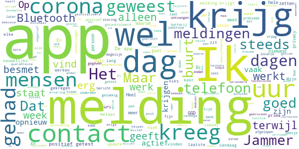

# CoronaMelder
App version ``1.3.0``

Analyzed with [covid-apps-observer](http://github.com/covid-apps-observer) project, version ``0.1``

## App overview
| | |
|-------------------------|-------------------------| 
| **Name**                                          | CoronaMelder |
| **Unique identifier** | nl.rijksoverheid.en |
| **Link to Google Play** | [https://play.google.com/store/apps/details?id=nl.rijksoverheid.en](https://play.google.com/store/apps/details?id=nl.rijksoverheid.en) |
| **Summary**  | Help de verspreiding van het coronavirus in Nederland te stoppen |
| **Privacy policy** | [https://coronamelder.nl/nl/privacy](https://coronamelder.nl/nl/privacy) |
| **Latest version** | 1.3.0 |
| **Last update** | 2021-03-23 09:28:00 |
| **Recent changes** | Dank je wel voor het gebruiken van CoronaMelder. Je helpt daarmee corona in Nederland te stoppen. Deze update bevat de functie om de app te pauzeren. Pauzeer de app alleen in situaties waarin je telefoon dicht bij telefoons van anderen komt, maar er geen kans op besmetting is. |
| **Installs**  | 1.000.000+ |
| **Category** | Medisch |
| **First release** | 10 aug. 2020 |
| **Size**  | 7,9M |
| **Supported Android version**  | 6.0 en hoger |

### Description
> CoronaMelder is de officiële corona notificatie-app van Nederland, ontwikkeld onder het toezicht van het Ministerie van Volksgezondheid, Welzijn en Sport. De app is een digitaal hulpmiddel bij het bron- en contactonderzoek door de GGD. 
 De app waarschuwt je nadat je in de buurt bent geweest van iemand met corona. Zo kun je jezelf en de mensen in je omgeving beschermen. En kunnen we samen het aantal besmettingen in Nederland zo laag mogelijk houden. Het gebruik van de app is vrijwillig. Niemand mag controleren of jij de app op je telefoon hebt. Maar hoe meer mensen de app gebruiken, hoe beter deze werkt. 
 Bij de ontwikkeling van deze app is rekening gehouden met toegankelijkheid, zie voor meer informatie onze toegankelijkheidsverklaring.
 Hoe werkt de app?
 # Je geeft alleen toegang tot je bluetoothgegevens
 CoronaMelder ziet via bluetooth wanneer je in de buurt bent van andere mensen met de app. De app gebruikt geen persoons- of locatiegegevens. De app weet dus niet wie je bent, waar je was en wie je hebt ontmoet.
 # Je krijgt een melding nadat je extra kans op besmetting hebt gelopen
 De app stuurt een melding als je minstens 15 minuten in de buurt bent geweest van iemand die later corona blijkt te hebben. Deze persoon moet ook de app gebruiken.
 # Je kunt anderen waarschuwen als je zelf besmet blijkt te zijn
 Ben je getest door de GGD en blijk je corona te hebben? Dan kun je samen met de GGD via de app een melding sturen naar de mensen bij wie je in de buurt bent geweest - in de periode dat je besmettelijk was. In deze melding staat alleen wanneer ze in de buurt zijn geweest van een besmet persoon. Niet wie of waar dit was.
 Hoe gaat de app met je gegevens om?
 • Je hoeft geen persoonsgegevens zoals je e-mailadres of naam in te voeren.
 • Als je iemand tegenkomt wisselen jullie telefoons via bluetooth willekeurige codes uit. Zo meet de app de duur en de afstand van het contact. In de codes staat niets over wie jullie zijn en waar jullie zijn geweest. 
 • De codes die je via bluetooth uitwisselt worden alleen op je telefoon bewaard en na 14 dagen verwijderd.
 • Gebruikers van de app zijn niet terug te vinden door de makers van de app, de overheid of andere gebruikers.

### User interface
The developers of the app provide the following screenshots in the Google play store.
| | | |
|:-------------------------:|:-------------------------:|:-------------------------:|
 |   |   |   | 
 |   |   |   | 

## Development team
In the following we report the main information provided by the development team in the Google play store.

| | |
|-------------------------|-------------------------|
| **Developer**  | Rijksoverheid |
| **Website**  | [https://coronamelder.nl/](https://coronamelder.nl/) |
| **Email** | helpdesk@coronamelder.nl |
| **Physical address**  | - |
| **Other developed apps**  | [https://play.google.com/store/apps/developer?id=Rijksoverheid](https://play.google.com/store/apps/developer?id=Rijksoverheid) |

## Android support

| | |
|-------------------------|-------------------------|
| **Declared target Android version**  | - |
| **Effective target Android version**  | - |
| **Minimum supported Android version**  | Marshmallow, version 6.0 (API level 23) |
| **Maximum target Android version**  | - |

The larger the difference between the minimum and maximum supported Android versions, the better. A larger difference means a wider audience. For example, old phones have a very low Android version, so a high minimum supported Android version means that the app cannot be used by users with old phones, thus leading to accessibility problems. 

## Requested permissions

In the following we report the complete list of the permissions requested by the app. 

| **Permission** | **Protection level** | **Description** | 
|-------------------------|-------------------------|-------------------------|
 **android.permission ACCESS_NETWORK_STATE** | Normal | Allows applications to access information about networks. 
 **android.permission BLUETOOTH** | Normal | Allows applications to connect to paired bluetooth devices. 
 **android.permission FOREGROUND_SERVICE** | Normal | Allows a regular application to use Service.startForeground. 
 **android.permission INTERNET** | Normal | Allows applications to open network sockets. 
 **android.permission RECEIVE_BOOT_COMPLETED** | Normal | Allows an application to receive the Intent.ACTION_BOOT_COMPLETED that is broadcast after the system finishes booting. 
 **android.permission REQUEST_IGNORE_BATTERY_OPTIMIZATIONS** | Normal | Permission an application must hold in order to use Settings.ACTION_REQUEST_IGNORE_BATTERY_OPTIMIZATIONS. 
 **android.permission WAKE_LOCK** | Normal | Allows using PowerManager WakeLocks to keep processor from sleeping or screen from dimming. 

## Mentioned servers

| **Server** | **Registrant** | **Registrant country** | **Creation date** | 
|-------------------------|-------------------------|-------------------------|-------------------------|
 | google.com | Google LLC | :us: US | 1997-09-15 04:00:00 |
 | coronamelder-dist.nl | - | - | 2020-07-20 00:00:00 |
 | coronamelder-api.nl | - | - | 2020-07-22 00:00:00 |

## Security analysis 

Below we report the main security warnings raised by our execution of the [Androwarn](https://github.com/maaaaz/androwarn) security analysis tool.

**Connection interfaces exfiltration**
> - This application reads details about the currently active data network 
> - This application tries to find out if the currently active data network is metered 

**Telephony services abuse**
> - This application makes phone calls 

**Suspicious connection establishment**
> - This application opens a Socket and connects it to the remote address '; port is out of range' on the 'N/A' port  
> - This application opens a Socket and connects it to the remote address 'Ljava/net/Proxy;->type()Ljava/net/Proxy$Type;' on the 'N/A' port  
> - This application opens a Socket and connects it to the remote address 'Lm/b/a/a/a;->H(Ljava/lang/String;)Ljava/lang/StringBuilder;' on the 'N/A' port  
> - This application opens a Socket and connects it to the remote address 'timeout' on the 'N/A' port  

**Pim data leakage**
> - This application accesses data stored in the clipboard 

## User ratings and reviews

Below we provide information about how end users are reacting to the app in terms of ratings and reviews in the Google Play store.

### Ratings

The CoronaMelder app has been installed by more than **1000000** times. At this time, **7750** rated the app and its average score is **3.0152285**. Below we show the distribution of the ratings across the usual star-based rating of Google Play

:star::star::star::star::star:: 2725

:star::star::star::star:: 796

:star::star::star:: 816

:star::star:: 698

:star:: 2715

### Reviews 

#### 5-star reviews

> Wie zet hem nou weer uit?  :date: __2021-03-31 01:13:29__

> Fantastisch  :date: __2021-03-30 22:05:20__

> Goed  :date: __2021-03-30 03:06:57__

> 😀  :date: __2021-03-29 14:06:35__

> Fantastische app!  :date: __2021-03-28 10:58:26__

> Zeer blij met dit initiatief, raadt iedereen aan deze te installeren.  :date: __2021-03-27 09:49:26__

> Nog geen ervaring  :date: __2021-03-26 09:13:20__

> Perfecte app!  :date: __2021-03-25 20:20:35__

> Alfonssoudant  :date: __2021-03-24 13:06:12__

> Allemaal de app gaan gebruiken, hoe eerder we van het virus af zijn en de maatregelen weer vermindert kunnen worden. 👻  :date: __2021-03-24 11:18:48__

#### 4-star reviews

> Goed voor z'n doel, mits goed gebruikt.  :date: __2021-04-03 19:47:20__

> Bet zou mooi zijn als de app ook het aantal besmettingen aan gaat geven. Voorbeeld, zie de duitse app.  :date: __2021-03-28 21:09:37__

> Als je gaat testen uit doen je krijgt de volgende dag een melding van test straat  :date: __2021-03-26 12:25:05__

> Werkt goed  :date: __2021-03-25 17:31:52__

> Is goed  :date: __2021-03-24 16:49:29__

> Werkt goed en duidelijk. Miss. is het handig om de beschrijving v pauzeknop nog iets uit te breiden. Tekst is op meerdere manieren te lezen en roept mogelijk vragen op.  :date: __2021-03-18 21:42:59__

> t meeste vanmijn advies, zit nu in CoronaCHECK/Luscii-app. PAUZE-stand= toon ook in Luscii als blauw lampje met kruis erdoor ipv groene. Maak mij betatester of maak een feedback optie (zoals in ZEPP-app). Met CoronaCHECK/Luscii kun jij, na een covid19-besmetting en/of -VACcinatie, eventuele bijwerkingen doorgeven, jij krijgt dan advies. en CoronaCHECK/Luscii kan nog veel meer.  :date: __2021-03-15 02:25:22__

> Prima, maar stop met de maandelijkse meldingen met het rode virusicoon. Schrik me steeds een apennootje...  :date: __2021-03-14 21:04:45__

> Ik heb nog geen meldingen gehad. Maar gelukkig heb ik geen snijbonen van het virus gr. Henk  :date: __2021-03-13 23:40:14__

> Ik snap iets niet ik krijg 3 maart een melding dat ik mij moet laten testen omdat ik 1 maart in de beurt ben geweest van iemand met corona heb een afspraak gemaakt voor 5 maart blijkt dat ik me nu de 5e dag of daarna nog een keer moet laten testen waarom maakt men dan niet meteen een afspraak op de 5e dag of daarna dat scheelt toch 1 x testen en vergroot toch de capaciteit en scheelt mij 1x testen  :date: __2021-03-05 11:23:09__

#### 3-star reviews

> Ik lees hier voortdurend dat broek-/jaszak of tas veel invloed kunnen hebben. Dat geeft geen vertrouwen in de app. We lopen/zitten toch niet voortdurend met de telefoon in de hand?  :date: __2021-04-02 14:54:38__

> Ik was zaterdag de hele dag alleen thuis en toen kreeg ik carona waarschuwing dat kan niet wand ik hep niemand gezien dus werkt niet storing vrij  :date: __2021-03-29 21:48:45__

> Jammer dat wanneer je een melding krijgt er niet aangegeven wordt rond welk tijdstip. Dat het op een bepaalde dag was is wel heel erg ruim.  :date: __2021-03-28 14:32:33__

> Ik kreeg een melding dat ik vrijdag 15min met iemand met corona in contact ben geweest. Ik heb die dag niemand gezien en de hele dag binnen aan m'n administratie gewerkt. 🤔 Werk deze app ook voor een computer virus? Reactie op de reactie: De hele voorgaande week ben ik buiten aan het werk geweest op een plek waar geen andere mensen mogen komen. Ik werk alleen ben ook niet in winkels of andere plekken geweest. Ik kan met 100% zekerheid zeggen dat er geen contact is geweest met andere.  :date: __2021-03-24 09:58:18__

> Waarom zijn de meldingen (dat je Bluetooth uit staat) opeens in het Engels? Heel raar en onnodig.  :date: __2021-03-23 21:01:57__

> Helaas gebruik ik de app nooit omdat ik hem steeds vergeet aan te zetten als ik (eens per 2 weken) de deur uit ga. Constant aanhouden is geen optie: dan moet GPS non-stop aan staan, en dat slurpt batterij. Daarnaast geloof ik best dat de corona app geen GPS locatie gebruikt, maar andere apps doen dat wel. Onvermijdelijk dat indirect veel partijen dan 24/7 op de hoogte zullen zijn van mijn locatie. Jammer dat de app op Android 10 en lager niet 'bruikbaar' is als je om batterij en privacy geeft.  :date: __2021-03-23 13:13:24__

> Ik kreeg 9 dagen te laat een melding of ik mij voor 1 maart wilde testen terwijl het al 5 maart was. Alles negatief maar je gaat twijfelen terwijl dit niet zo behoord te zijn. Heel naar als je veel te laat een melding krijgt.  :date: __2021-03-23 10:07:53__

> Heb 2 gsm's 24/7 bij me 1 slaat aan andere niet, heb in andere ruimte gezeten toch een alarm, de bt gaat ook door glas waarom dan 1 melding en niet op 2 ???? Veel paniek voor niets en de melding komt ook nog eens 3 dagen na de contact.????????  :date: __2021-03-21 13:47:05__

> jammer dat niet iedereen de app gebruikt en dat de app geen totalen geeft vh aantal besmettingen per dag zoals in de krant verschijnt de duitse versie doet dit wel vandaar de 3 sterren  :date: __2021-03-21 12:07:57__

> Goed nieuw  :date: __2021-03-19 22:25:09__

#### 2-star reviews

> Aanvulling: İk krijg iedere dag een bericht dat de app de afgelopen 24 uur niets heeft gedaan door technische problemen. Zo werkt het dus niet. İk kom er achter dat de coronamelder inactief was omdat ik batterij besparng aan had staan. Bijzonder dat dit niet wordt aangegeven door de app. ik zag het omdat ik de app opende. Zou goed zijn dit bekend te maken want wellicht zijn hierdoor meer inactief  :date: __2021-04-02 19:41:10__

> Al lange tijd ontvang ik geen meldingen meer. Hoe komt dat? Ik heb deze app al een aantal maanden in het begin deed hij het goed.  :date: __2021-04-01 22:21:08__

> Vorig jaar begin van de zomer leek de app meer actief als momenteel. Lijkt nu tamelijk nutteloos.  :date: __2021-03-31 18:08:54__

> Ik heb de app verwijderd. Wordt er helemaal crazy van. Gaat vaak af op momenten wanneer ik alleen thuis ben of ik krijg s nachts een melding of tijdens het bezorgen van de kranten . Ik kom tijdens mn krantenwijk route bijna niemand tegen . Af en toe iemand die een hond uitlaten of naar hun werk gaan die rijden mij voorbij met de auto en ik ben gemiddeld 1 minuut bij de brievenbussen.en de bezorgadressen staan ver uit elkaar.  :date: __2021-03-31 07:43:06__

> App start niet automatisch op bij herstart telefoon, instelling voor batterijbesparing in niet remanent (is weer vergeten bij herstart)  :date: __2021-03-26 19:30:28__

> Ik heb melding gekregen dat ik bij besmet persoon ben geweest maar dat kan niet kloppen ben die bewuste dag niet weggeweest, ben de gehele dag thuis geweest rara hoe kan dit  :date: __2021-03-26 07:20:58__

> Regelmatig krijg ik bericht dat deze app niet meer werkt. Dan moet ik hem weer aanzetten. Vreemd!!  :date: __2021-03-22 11:57:34__

> Nouik moet bericht krijgen want mijn man is positief getest maar krijg geen melding  :date: __2021-03-19 11:46:07__

> App kan worden gestopt door energie besparing. En dan weet je als gebruiker dus niet dat de app niet meer actief is.... En daardoor niet meer z'n doel bereikt  :date: __2021-03-18 15:19:04__

> Sinds ik de corona melder heb geinstalleerd is mijn smartphone niet meer voorruit te branden en in no time is de accu leeg. App verwijderd en telefoon loopt weer als voorheen, met lange accu duur  :date: __2021-03-18 10:39:31__

#### 1-star reviews

> Ik heb in al die tijd dat de app bestaat nog nooit 1 melding gehad, ik twijfel dus sterk of deze app wel werkt, want ik kan mij niet voorstellen dat ik nog nooit in contact ben geweest met iemand die positief is getest.  :date: __2021-04-03 15:05:42__

> Heel irritant dat hij keer op keer een melding geeft dat GPS of bluetooth uitstaan wanneer ik thuis ben.  :date: __2021-04-02 15:19:56__

> Als je pas 6 dagen na de besmetting een melding krijgt, werk hij natuurlijk niet goed!!!  :date: __2021-04-02 08:35:43__

> Ik ben nu voor de tweede keer besmet geraakt maar die stomme app heeft niets doorgegeven. Mijn gezin heeft ook de en zij hebben nog steeds geen meldin gekrijgen. Hoe kan dat.  :date: __2021-04-01 07:54:12__

> Maakt nooit verbinding  :date: __2021-03-31 11:27:01__

> Ik snap er niets van en heb het idee dat de app niet werkt.  :date: __2021-03-31 09:53:39__

> Ik blijf maar swipen maar geen enkele match. Tinder is toch beter  :date: __2021-03-30 11:24:39__

> Zet zichzelf om de haverklap uit. Wat heb je er dan aan?  :date: __2021-03-29 21:07:25__

> Geen melding of wat dan ook ontvangen en toch corona. Hoe kan dat!!!  :date: __2021-03-29 16:28:35__

> De opvolging van een GGD medewerker om de unieke sleutel te activeren is niet gebeurd. Werd ook in het telefoongesprek niet naar gevraagd nav test die dus positief was. Dus vandaar dat mijn huisgenoot ook geen melding kreeg op haar smartphone tot nu toe. De app is dus op waardeloos als de GGD de sleutel niet open zet?  :date: __2021-03-29 12:42:20__

