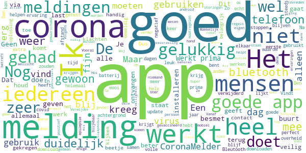

# CoronaMelder
App version ``1.3.0``

Analyzed with [covid-apps-observer](http://github.com/covid-apps-observer) project, version ``0.1``

## App overview
| | |
|-------------------------|-------------------------| 
| **Name**&nbsp;&nbsp;&nbsp;&nbsp;&nbsp;&nbsp;&nbsp;&nbsp;&nbsp;&nbsp;&nbsp;&nbsp;&nbsp;&nbsp;&nbsp;&nbsp;&nbsp;&nbsp;&nbsp;&nbsp;&nbsp;&nbsp;&nbsp;&nbsp;&nbsp;&nbsp;&nbsp;&nbsp;&nbsp;&nbsp;&nbsp;&nbsp;&nbsp;&nbsp;&nbsp;&nbsp;&nbsp;&nbsp;&nbsp;&nbsp;  | CoronaMelder |
| **Unique identifier** | nl.rijksoverheid.en |
| **Link to Google Play** | [https://play.google.com/store/apps/details?id=nl.rijksoverheid.en](https://play.google.com/store/apps/details?id=nl.rijksoverheid.en) |
| **Summary**  | Help de verspreiding van het coronavirus in Nederland te stoppen |
| **Privacy policy** | [https://coronamelder.nl/nl/privacy](https://coronamelder.nl/nl/privacy) |
| **Latest version** | 1.3.0 |
| **Last update** | 2021-03-23 09:28:00 |
| **Recent changes** | Dank je wel voor het gebruiken van CoronaMelder. Je helpt daarmee corona in Nederland te stoppen. Deze update bevat de functie om de app te pauzeren. Pauzeer de app alleen in situaties waarin je telefoon dicht bij telefoons van anderen komt, maar er geen kans op besmetting is. |
| **Installs**  | 1.000.000+ |
| **Category** | Medisch |
| **First release** | 10 aug. 2020 |
| **Size**  | 7,9M |
| **Supported Android version**  | 6.0 en hoger |

### Description
> CoronaMelder is de officiële corona notificatie-app van Nederland, ontwikkeld onder het toezicht van het Ministerie van Volksgezondheid, Welzijn en Sport. De app is een digitaal hulpmiddel bij het bron- en contactonderzoek door de GGD. 
 De app waarschuwt je nadat je in de buurt bent geweest van iemand met corona. Zo kun je jezelf en de mensen in je omgeving beschermen. En kunnen we samen het aantal besmettingen in Nederland zo laag mogelijk houden. Het gebruik van de app is vrijwillig. Niemand mag controleren of jij de app op je telefoon hebt. Maar hoe meer mensen de app gebruiken, hoe beter deze werkt. 
 Bij de ontwikkeling van deze app is rekening gehouden met toegankelijkheid, zie voor meer informatie onze toegankelijkheidsverklaring.
 Hoe werkt de app?
 # Je geeft alleen toegang tot je bluetoothgegevens
 CoronaMelder ziet via bluetooth wanneer je in de buurt bent van andere mensen met de app. De app gebruikt geen persoons- of locatiegegevens. De app weet dus niet wie je bent, waar je was en wie je hebt ontmoet.
 # Je krijgt een melding nadat je extra kans op besmetting hebt gelopen
 De app stuurt een melding als je minstens 15 minuten in de buurt bent geweest van iemand die later corona blijkt te hebben. Deze persoon moet ook de app gebruiken.
 # Je kunt anderen waarschuwen als je zelf besmet blijkt te zijn
 Ben je getest door de GGD en blijk je corona te hebben? Dan kun je samen met de GGD via de app een melding sturen naar de mensen bij wie je in de buurt bent geweest - in de periode dat je besmettelijk was. In deze melding staat alleen wanneer ze in de buurt zijn geweest van een besmet persoon. Niet wie of waar dit was.
 Hoe gaat de app met je gegevens om?
 • Je hoeft geen persoonsgegevens zoals je e-mailadres of naam in te voeren.
 • Als je iemand tegenkomt wisselen jullie telefoons via bluetooth willekeurige codes uit. Zo meet de app de duur en de afstand van het contact. In de codes staat niets over wie jullie zijn en waar jullie zijn geweest. 
 • De codes die je via bluetooth uitwisselt worden alleen op je telefoon bewaard en na 14 dagen verwijderd.
 • Gebruikers van de app zijn niet terug te vinden door de makers van de app, de overheid of andere gebruikers.

### User interface
The developers of the app provide the following screenshots in the Google play store.
| | | |
|:-------------------------:|:-------------------------:|:-------------------------:|
 |   |   |   | 
 |   |   |   | 

## Development team
In the following we report the main information provided by the development team in the Google play store.

| | |
|-------------------------|-------------------------|
| **Developer**  | Rijksoverheid |
| **Website**  | [https://coronamelder.nl/](https://coronamelder.nl/) |
| **Email** | helpdesk@coronamelder.nl |
| **Physical address**  | - |
| **Other developed apps**  | [https://play.google.com/store/apps/developer?id=Rijksoverheid](https://play.google.com/store/apps/developer?id=Rijksoverheid) |

## Android support

| | |
|-------------------------|-------------------------|
| **Declared target Android version**  | - |
| **Effective target Android version**  | - |
| **Minimum supported Android version**  | Marshmallow, version 6.0 (API level 23) |
| **Maximum target Android version**  | - |

The larger the difference between the minimum and maximum supported Android versions, the better. A larger difference means a wider audience. For example, old phones have a very low Android version, so a high minimum supported Android version means that the app cannot be used by users with old phones, thus leading to accessibility problems. 

## Requested permissions

In the following we report the complete list of the permissions requested by the app. 

| **Permission** | **Protection level** | **Description** | 
|-------------------------|-------------------------|-------------------------|
 **android.permission ACCESS_NETWORK_STATE** | Normal | Allows applications to access information about networks. 
 **android.permission BLUETOOTH** | Normal | Allows applications to connect to paired bluetooth devices. 
 **android.permission FOREGROUND_SERVICE** | Normal | Allows a regular application to use Service.startForeground. 
 **android.permission INTERNET** | Normal | Allows applications to open network sockets. 
 **android.permission RECEIVE_BOOT_COMPLETED** | Normal | Allows an application to receive the Intent.ACTION_BOOT_COMPLETED that is broadcast after the system finishes booting. 
 **android.permission REQUEST_IGNORE_BATTERY_OPTIMIZATIONS** | Normal | Permission an application must hold in order to use Settings.ACTION_REQUEST_IGNORE_BATTERY_OPTIMIZATIONS. 
 **android.permission WAKE_LOCK** | Normal | Allows using PowerManager WakeLocks to keep processor from sleeping or screen from dimming. 

## Mentioned servers

| **Server** | **Registrant** | **Registrant country** | **Creation date** | 
|-------------------------|-------------------------|-------------------------|-------------------------|
 | google.com | Google LLC | :us: US | 1997-09-15 04:00:00 |
 | coronamelder-dist.nl | - | - | 2020-07-20 00:00:00 |
 | coronamelder-api.nl | - | - | 2020-07-22 00:00:00 |

## Security analysis 

Below we report the main security warnings raised by our execution of the [Androwarn](https://github.com/maaaaz/androwarn) security analysis tool.

**Connection interfaces exfiltration**
> - This application reads details about the currently active data network 
> - This application tries to find out if the currently active data network is metered 

**Telephony services abuse**
> - This application makes phone calls 

**Suspicious connection establishment**
> - This application opens a Socket and connects it to the remote address '; port is out of range' on the 'N/A' port  
> - This application opens a Socket and connects it to the remote address 'Ljava/net/Proxy;->type()Ljava/net/Proxy$Type;' on the 'N/A' port  
> - This application opens a Socket and connects it to the remote address 'Lm/b/a/a/a;->H(Ljava/lang/String;)Ljava/lang/StringBuilder;' on the 'N/A' port  
> - This application opens a Socket and connects it to the remote address 'timeout' on the 'N/A' port  

**Pim data leakage**
> - This application accesses data stored in the clipboard 

## User ratings and reviews

Below we provide information about how end users are reacting to the app in terms of ratings and reviews in the Google Play store.

### Ratings

The CoronaMelder app has been installed by more than **1000000** times. At this time, **7750** rated the app and its average score is **3.0152285**. Below we show the distribution of the ratings across the usual star-based rating of Google Play

:star::star::star::star::star:: 2725

:star::star::star::star:: 796

:star::star::star:: 816

:star::star:: 698

:star:: 2715

### Reviews 

#### 5-star reviews

> Doet wat het moet doen.  :date: __2021-04-16 16:30:01__

> De app doet gewoon zijn werk. Je hoeft niet besmet te zijn als je een melding krijgt. Alleen heb je een kans om besmet te zijn.  :date: __2021-04-15 07:20:26__

> Werkt gewoon goed.  :date: __2021-04-14 23:21:43__

> Wij zijn zeer tevreden,zeker na de eerste melding, wij blijven deze app. Gebruiken.  :date: __2021-04-13 14:59:44__

> Geen behoefte aan  :date: __2021-04-11 18:26:21__

> Een goed werkende waarschuwende app die je als verantwoord burger gewoon moet hebben in de strijd tegen corona.  :date: __2021-04-10 22:14:51__

> Makkelijk te gebruiken en duidelijk  :date: __2021-04-10 14:18:11__

> Veilig idee  :date: __2021-04-07 22:18:51__

> Bij. Ju v ç. Ö . .ky fjğ öh öh mv. H uy ..  :date: __2021-04-06 13:43:01__

> Ik krijg meldingen dat de app mijn tel. leegtrekt. Lastig.  :date: __2021-04-06 08:46:08__

#### 4-star reviews

> Kreeg een melding ,dus laten testen .  :date: __2021-04-16 15:14:51__

> openstaan voor realiteit is moedig 💉🧘‍♂️  :date: __2021-04-16 10:49:39__

> onlangs alert ontvangen dat ik langer als 15 minuten contact heb gehad met iemand die besmet is......die gehele dag echter met NIEMAND (persoonlijk) contact gehad... 》》 mijn buurman kreeg die dag wél zijn uitslag PCR test....onze telefoons dus in elkaars BlueTooth bereik.  :date: __2021-04-15 15:03:13__

> 211s1  :date: __2021-04-13 15:50:11__

> Deze app is een must voor iedereen. Veel mensen hebben de app nog steeds niet.  :date: __2021-04-12 22:53:52__

> Geen meeninggeen melding  :date: __2021-04-05 20:54:10__

> Helaas is het voor mijn niet meer mogelijk om naar de coronatest.nl te gaan, steeds de melding ERROR 1020.  :date: __2021-04-04 13:47:26__

> Goed voor z'n doel, mits goed gebruikt.  :date: __2021-04-03 19:47:20__

> Bet zou mooi zijn als de app ook het aantal besmettingen aan gaat geven. Voorbeeld, zie de duitse app.  :date: __2021-03-28 21:09:37__

> Als je gaat testen uit doen je krijgt de volgende dag een melding van test straat  :date: __2021-03-26 12:25:05__

#### 3-star reviews

> Ik heb nu voor de 2e keer een melding gekregen van een besmetting van iemand waarbij ik 15 minuten dichtbij zou zijn geweest. Beide keren onmogelijk omdat ik het huis niet ben uit geweest op die dagen. Heel jammer dat de app deze "valse" meldingen geeft.  :date: __2021-04-17 11:22:22__

> Op zich prima app. Tot nu toe geen valse meldingen gehad zoals anderen hier wel zeggen gehad te hebben. Enige vervelende is dat ik sinds een week of wat elke avond een waarschuwingsmelding krijg dat de app 24 uur niet heeft kunnen controleren door een technisch probleem. Het enige dat ik kan doen, is kiezen voor opnieuw proberen. Daarna gaat de boel weer op groen tot de volgende avond. Dan krijg ik weer die melding. Bij laatste check staat een datum van een dag of 7 geleden. Schiet niet op zo.  :date: __2021-04-15 20:33:25__

> Krijg steeds de melding dat ik Bluetooth moet aanzetten. Ook als ik gewoon thuis ben. Heel irritant.  :date: __2021-04-15 16:45:48__

> Ik vind de vorige beter  :date: __2021-04-15 09:27:26__

> Ik wil naar een evenement maar ik zie geen CoronaCheck app in de play store, kunt u daarmee helpen  :date: __2021-04-12 15:06:15__

> Ik heb de app gedownload en wou hem verwijderen alleen het lukte gwn niet  :date: __2021-04-10 13:48:21__

> Is er geen ruik en test uit slag en mogelijk heden  :date: __2021-04-06 19:21:50__

> Ik lees hier voortdurend dat broek-/jaszak of tas veel invloed kunnen hebben. Dat geeft geen vertrouwen in de app. We lopen/zitten toch niet voortdurend met de telefoon in de hand?  :date: __2021-04-02 14:54:38__

> Ik was zaterdag de hele dag alleen thuis en toen kreeg ik carona waarschuwing dat kan niet wand ik hep niemand gezien dus werkt niet storing vrij  :date: __2021-03-29 21:48:45__

> Jammer dat wanneer je een melding krijgt er niet aangegeven wordt rond welk tijdstip. Dat het op een bepaalde dag was is wel heel erg ruim.  :date: __2021-03-28 14:32:33__

#### 2-star reviews

> Geeft inderdaad aan wanneer je contact met iemand had, maar niet hoelaat ofzo. Dus kan ook zijn dat je thuis in je flatje zit en dat de onderbuurman jouw melding veroorzaakt. Heel onhandig dat er dan geen tijdsindicatie bij staat of iets.  :date: __2021-04-16 18:06:10__

> Ik kreeg veel te laat een melding. Dinsdagavond en dan moest ik me voor maandag testen.  :date: __2021-04-15 14:49:47__

> Onduidelijk of het aanstaat en slurpt m'n batterij leeg. De UX mag echt om hoog  :date: __2021-04-12 15:41:05__

> Ondanks dat het niet zou kunnen een melding omdat mijn buurman corona heeft. Gelukkig blijven we nuchter en gaan we op zoek. Maar bijna een zorgmedewerker in quarantaine ivm deze melding. Dit zou niet mogen gebeuren en maakt deze app onbetrouwbaar. Jammer.  :date: __2021-04-11 14:09:38__

> Bij het installeren meldt de app eerst dat je locatie niet wordt gebruikt omdat hij via Bluetooth werkt. Even later moet je je locatiebepaling aanzetten ...  :date: __2021-04-10 20:59:52__

> Ik krijg steeds een melding maar als ik hem dan open zie ik niks?????? 🤨 🤔  :date: __2021-04-07 18:08:41__

> Allemaal nep  :date: __2021-04-05 08:38:02__

> Aanvulling: İk krijg iedere dag een bericht dat de app de afgelopen 24 uur niets heeft gedaan door technische problemen. Zo werkt het dus niet. İk kom er achter dat de coronamelder inactief was omdat ik batterij besparng aan had staan. Bijzonder dat dit niet wordt aangegeven door de app. ik zag het omdat ik de app opende. Zou goed zijn dit bekend te maken want wellicht zijn hierdoor meer inactief  :date: __2021-04-02 19:41:10__

> Al lange tijd ontvang ik geen meldingen meer. Hoe komt dat? Ik heb deze app al een aantal maanden in het begin deed hij het goed.  :date: __2021-04-01 22:21:08__

> Vorig jaar begin van de zomer leek de app meer actief als momenteel. Lijkt nu tamelijk nutteloos.  :date: __2021-03-31 18:08:54__

#### 1-star reviews

> Zie dit niet al meerwaarde ben in buurt van positief iemand geweest zelf negatief...dus  :date: __2021-04-16 22:14:28__

> Werkt niet  :date: __2021-04-16 15:53:16__

> Valt elke dag uit zichzelf uit en daardoor vergeet men hem aan te zetten .. en werkt hij niet. Dat is erg lastig.. 1x aanzetten zou voldoende moeten zijn tot je hem zelf uitzet  :date: __2021-04-16 15:41:57__

> Valt regelmatig uit  :date: __2021-04-16 12:03:01__

> Waardeloze app, door de totale afhankelijkheid van Bluetooth. Afspraken maken voor een test heb ik een aantal keren geprobeerd, maar wordt keer op keer afgebroken en krijg dan de melding dat ik telefonisch contact op moet nemen met de GGD. Nutteloze app! Doodzonde van ons belastinggeld.  :date: __2021-04-16 08:40:53__

> To close to call and unreliable. The worldwide answer to this pandemic is everybody at least three weeks in quarantaine, only primarily basic needs shopping has a green light. The last digid of birth year allows you to go out for basic needs shopping. For example: Evendigit 0,2,4,6 and 8 on Monday, Wednesday, Friday, Sunday,Tuesday. Odddigit 1,3,5,7 and 9 on Tuesday, Thursday, Saturday,Monday and Wednesday. This way mankind can find a better answer for solving this problem.  :date: __2021-04-15 22:54:22__

> Als.niemand zijn eigen laat testen is corona binnen 1 week weg en is het gewoon weer de griep terug wat ze nu corona noemen  :date: __2021-04-15 12:29:23__

> Coronamelder ging bij mij niet af toen ik in mijn omgeving corona patiënten had. Het werkt niet!  :date: __2021-04-15 09:55:11__

> Niet de testdag maar contactdag is belangrijk. In mijn geval was contact op zondag. De testdag op dinsdag. U houdt de testdag aan, dit is dus onjuist.  :date: __2021-04-14 23:31:05__

> Ik werk al vanaf dat de app bestaat door heel de benelux en duitsland, ik ben dagelijks in aanraking met mensen en houd geen afstand dus dat betekend dus dat tussen die duizenden mensen waarmee ik in contact ben geweest niemand corona had? 🤣🤣 1 grote poppenkast!!  :date: __2021-04-14 16:40:19__

