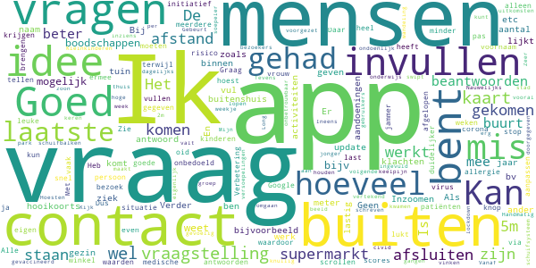

# COVID-related Android apps - custom search for the Dutch store

Author: `Ivano Malavolta` (ivanomalavolta@gmail.com)

Created at: `2020/7/20`

Report generated by the [covid-apps-observer](http://github.com/covid-apps-observer) project, version 0.1

# Table of contents 

- [Background](#background)
    * [Data sources and analyses](#data-sources-and-analyses)
        * [App metadata](#app-metadata)
        * [Requested permissions](#requested-permissions)
        * [Mentioned servers](#mentioned_servers)
        * [Security analysis](#security_analysis)
        * [User ratings and reviews](#user-ratings-and-reviews)
    * [Disclaimer](#disclaimer)
- [eRouška – součást chytré karantény](#erouška-–-součást-chytré-karantény)
- [Stopp Corona](#stopp-corona)
- [RIVM LCI-richtlijnen](#rivm-lci-richtlijnen)
- [WHO Info](#who-info)
- [Luscii](#luscii)
- [OpenWHO: Knowledge for Health Emergencies](#openwho-knowledge-for-health-emergencies)
- [COVID Symptom Study](#covid-symptom-study)
- [COVID Radar](#covid-radar)
- [COVID Control - A Johns Hopkins University Study](#covid-control---a-johns-hopkins-university-study)

- [Credits](#credits)

# How to read this report

This report has been generated by the [covid-apps-observer](http://github.com/covid-apps-observer) project. The project automatically analyzes the apps by extracting information which is already publicly available either on the web or in the apps binary files. 

Our analysis covers the following apps:
| | |
|-------------------------|-------------------------| 
|  | eRouška – součást chytré karantény
|  | Stopp Corona
|  | RIVM LCI-richtlijnen
|  | WHO Info
|  | Luscii
|  | OpenWHO: Knowledge for Health Emergencies
|  | COVID Symptom Study
|  | COVID Radar
|  | COVID Control - A Johns Hopkins University Study

The details of our analysis are presented in the remainder of this report.

For independent verification, the raw data and the source code of the project is publicly available in its GitHub repository [http://github.com/covid-apps-observer](http://github.com/covid-apps-observer) and its source code has been thoroughly commented in order to provide all the details about how the information provided in this report has been extracted. 

Any feedback, questions, and improvements about the project are very welcome, feel free to create an issue or pull request directly in its GitHub repository: [http://github.com/covid-apps-observer](http://github.com/covid-apps-observer).

## Data sources and analyses

The analysis of each app is structured around five main dimensions: 
* App metadata  
* Requested permissions
* Mentioned servers
* Androwarn analysis
* User ratings and reviews

In the following we describe the data sources and analysis performed for each dimension.

### App metadata

App metadata includes an overview of the main information about the app (for example, its name, releases, privacy policy, etc.), contact information of the development team, and the various Android versions supported by the app. This information is extracted from two main data sources:
* _Google Play store_: we automatically mined the web page of the Google Play store showing the basic information about the app and we parsed it in order to extract information about the app and development team 
* _Android Manifest file_: in our analysis we decompiled the binary file of the app (it is similar to a Zip archive but it contains the code of the app instead of normal files) and we extracted information about the supported Android versions, as it has been listed by its development team.

The extracted app metadata feeds the _App overview_, _Development team_, and _Android support_ sections of this report.
We make use of the [google-play-scraper](https://github.com/JoMingyu/google-play-scraper) tool for extracting the raw data related to this dimension of the project.

### Requested permissions

The Android operating system has a permission model which allows users to grant access to potentially privacy-related information. Every Android app has to explictly declare the permissions it needs to properly function in the Android Manifest file.  

In this report we also show the protection level of each permission, which is a key information for understanding how the requested permissions related to the user's privacy. We carefully analyzed the [official Android documentation (v. 29)](https://developer.android.com/reference/android/Manifest.permission), and it resulted that a permission requested by an Android app can belong to the following protection levels:
* **Dangerous**: higher-risk permissions that would give a requesting app access to private user data or control over the device that can negatively impact the user. Because this type of permission introduces potential risk, the system usually does not automatically grant it to the requesting app. For example, any dangerous permissions requested by an app may be displayed to the user and require confirmation before proceeding.
* **Normal**: this is the default and most common level in Android; normal permissions are lower-risk and give access to isolated app-level features, with minimal risk to other apps, the system, or the user. 
* **Signature**: permissions granted only if the requesting app is signed with the same certificate as the app that declared the permission
* **Appop**: old permission level, a reminiscence of the App Ops tool that Google introduced in Android 4.3.
* **Development**: optional permissions which can be granted to development-oriented apps.
* **Privileged**: permissions who give higher power to mobile apps w.r.t. other apps, such as binding to incoming calls, interacting via bluetooth with other devices without user interaction, etc.
* **Preinstalled**: reserved only for preinstalled apps
* **Installer**: allow the holder to start the permission usage screen for an app
* **RetailDemo**: permissions related to devices used in demonstrations in shops.
* **Pre23**: permissions automatically granted to apps targeting devices running pre-6.0 Android.
* **Upcoming**: permissions which will be released in the next version of the Android platform. 
* **Deprecated**: permissions belonging to old releases of the Android platform, they should not be used by developers since they will not be supported in the near future.
* **Not for use by third-party applications**: permissions which can be requested only by apps developed by Google.
* **Undefined**: this protection level is not documented by Google.

The permissions dimension of this project is based on the [Androguard](https://github.com/androguard/androguard) static analysis tool.

### Mentioned servers

We decompiled each app in order to look for all possible mentions of remote URLs. The mentioned URLs can refer to remote servers the the app is using for either sending or receiving information, web addresses for directing the user to an information website, and so on. 

:warning: It is important to note that this analysis is not meant to be complete and it is very prone to obfuscation. The servers reported here are simply _mentioned_ somewhere in the code of the app and are meant to just give an indication about the "hooks" of the app towards external resources. For example, for an Android app it is normal to contact Google services in order to send/receive push notifications, or to contact the servers of analytics services for having real-time diagnostics about crashes of the app or bugs.

This part of the analysis is based on the [Androguard](https://github.com/androguard/androguard) static analysis tool for identfying the raw URLs mentioned in the app; then, the information about each mentioned server is collected by performing a _whois_ lookup on the first-level domain present in the URL.

### Security analysis

This dimension is based on the [Androwarn](https://github.com/maaaaz/androwarn) structural and data flow analysis of Android bytecode. Androwarn is developed by the University of Lyon/INSA (France) and it has been used in several academic studies. According to its documentation, Androwarn targets the following categories of potential security issues:
* **Telephony identifiers exfiltration**: IMEI, IMSI, MCC, MNC, LAC, CID, operator's name, etc.
* **Device settings exfiltration**: software version, usage statistics, system settings, logs, etc.
* **Geolocation information leakage**: GPS/WiFi geolocation, etc.
* **Connection interfaces information exfiltration**: WiFi credentials, Bluetooth MAC adress, etc.
* **Telephony services abuse**: premium SMS sending, phone call composition, etc.
* **Audio/video flow interception**: call recording, video capture, etc.
* **Remote connection establishment**: socket open call, Bluetooth pairing, APN settings edit, etc.
* **PIM data leakage**: contacts, calendar, SMS, mails, clipboard, etc.
* **External memory operations**: file access on SD card, etc.
* **PIM data modification**: add/delete contacts, calendar events, etc.
* **Arbitrary code execution**: native code using JNI, UNIX command, privilege escalation, etc.
* **Denial of Service**: event notification deactivation, file deletion, process killing, virtual keyboard disable, terminal shutdown/reboot, etc.

Note: We do not consider this data point in the current version of our analyzers since it is too verbose for our purposes.

:warning: It is important to note that Androwarn is a static analysis tool, and as such it performs a variety of heuristics and approximations in its analyses. Said that, the results shown in this report are meant to provide an indication of _potential_ security issues and should be by no means treated as complete and correct.   

### User ratings and reviews

For this dimension we turn again to the web interface of the Google Play store. Firstly, we automatically mine summary statistics about user ratings from the web page of the app under analysis; then, we automatically download the newest 1000 reviews of the app under analysis. For each level of rating (5 stars, 4 stars, , etc., 1 star) we show:
- a word cloud presenting the main terms used by end users in their reviews in the Google Play store
- the last 10 reviews provided by app users in the Google Play store. 

This purposefully simple analysis is meant to help both future users and the development team of the app in understanding what are the main positive and negative points of the app under analysis.

We make use of the [google-play-scraper](https://github.com/JoMingyu/google-play-scraper) tool for extracting the raw data related to this dimension of the project.

## Disclaimer 

This report has been produced independently of any parties and its only objective is to help anybody in better understanding how COVID-related apps work in practice (and compare to each other). The results of this report are limited to the specific version of the software used for running the analyses and on the various heuristics implemented in there. In other words, the results of the analyzers may differ depending on the time and modalities in which they are executed. We do not guarantee that the results of the analyses and the corresponding contents of this report are fully complete or correct. The analysis software is licensed under the [MIT License](https://github.com/iivanoo/covid-apps-observer/blob/master/LICENSE).

# eRouška – součást chytré karantény
App version ``1.0.437``

Analyzed with [covid-apps-observer](http://github.com/covid-apps-observer) project, version ``0.1``

## App overview
| | |
|-------------------------|-------------------------| 
| **Name**&nbsp;&nbsp;&nbsp;&nbsp;&nbsp;&nbsp;&nbsp;&nbsp;&nbsp;&nbsp;&nbsp;&nbsp;&nbsp;&nbsp;&nbsp;&nbsp;&nbsp;&nbsp;&nbsp;&nbsp;&nbsp;&nbsp;&nbsp;&nbsp;&nbsp;&nbsp;&nbsp;&nbsp;&nbsp;&nbsp;&nbsp;&nbsp;&nbsp;&nbsp;&nbsp;&nbsp;&nbsp;&nbsp;&nbsp;&nbsp;  | eRouška – součást chytré karantény |
| **Unique identifier** | cz.covid19cz.erouska |
| **Link to Google Play** | [https://play.google.com/store/apps/details?id=cz.covid19cz.erouska](https://play.google.com/store/apps/details?id=cz.covid19cz.erouska) |
| **Summary**  | Dankzij eRouche beschermt u uzelf en anderen in uw omgeving |
| **Privacy policy** | [https://erouska.cz/gdpr](https://erouska.cz/gdpr) |
| **Latest version** | 1.0.437 |
| **Last update** | 2020-05-22 10:49:39 |
| **Recent changes** | V aplikaci najdete Anežku - podporu eRoušky.  Také jsme opravili chybu s posíláním notifikací při vypnutém Bluetooth. |
| **Installs**  | 100.000+ |
| **Category** | Gezondheid en fitness |
| **First release** | 10 apr. 2020 |
| **Size**  | 3,7M |
| **Supported Android version**  | 5.0 en hoger |

### Description
> Aplikace eRouška si díky Bluetooth pamatuje ostatní eRoušky, které jste potkali. Usnadní tak pracovníkům hygienické stanice dohledávání rizikových kontaktů.
 Přispějte i vy k tomu, aby nakažených koronavirem přibývalo méně.
 <b>Když jste nakaženého potkali:</b>
 Když potkáte někoho, u koho se později prokáže koronavirus, hygienická stanice vás bude moci telefonicky kontaktovat. I když jste spolu třeba jen stáli ve frontě v obchodě.
 <b>Když se nakazíte vy:</b>
 Pokud se u vás koronavirus prokáže, pracovník hygienické stanice  vás požádá o přehled lidí, které jste v posledních dnech potkali. Vy mu jednoduše na jeden klik odešlete anonymní seznam uživatelů eRoušky, se kterými jste byli v rizikovém kontaktu. Včetně těch, které osobně neznáte, jen jste s nimi třeba jeli autobusem. 
 Nikdo se nedozví, že jste je mohl nakazit zrovna vy. Více na webu erouska.cz

### User interface
The developers of the app provide the following screenshots in the Google play store.
| | | |
|:-------------------------:|:-------------------------:|:-------------------------:|
 |   |   |   | 
 |   |   |   | 
 |  

## Development team
In the following we report the main information provided by the development team in the Google play store.

| | |
|-------------------------|-------------------------|
| **Developer**  | Ministerstvo zdravotnictví České republiky |
| **Website**  | [https://erouska.cz](https://erouska.cz) |
| **Email** | info@erouska.cz |
| **Physical address**  | [Palackého náměstí 375/4 128 01 Praha 2 Česká republika](https://www.google.com/maps/search/Palackého%20náměstí%20375/4%20128%2001%20Praha%202%20Česká%20republika) (Google Maps) |
| **Other developed apps**  | [https://play.google.com/store/apps/developer?id=Ministerstvo+zdravotnictv%C3%AD+%C4%8Cesk%C3%A9+republiky](https://play.google.com/store/apps/developer?id=Ministerstvo+zdravotnictv%C3%AD+%C4%8Cesk%C3%A9+republiky) |

## Android support

| | |
|-------------------------|-------------------------|
| **Declared target Android version**  | Android10, version 10 (API level 29) |
| **Effective target Android version**  | Android10, version 10 (API level 29) |
| **Minimum supported Android version**  | Lollipop, version 5.0 (API level 21) |
| **Maximum target Android version**  | - |

The larger the difference between the minimum and maximum supported Android versions, the better. A larger difference means a wider audience. For example, old phones have a very low Android version, so a high minimum supported Android version means that the app cannot be used by users with old phones, thus leading to accessibility problems. 

## Requested permissions

In the following we report the complete list of the permissions requested by the app. 

| **Permission** | **Protection level** | **Description** | 
|-------------------------|-------------------------|-------------------------|
 **android.permission ACCESS_COARSE_LOCATION** | :warning:**Dangerous** | Allows an app to access approximate location. 
 **android.permission ACCESS_FINE_LOCATION** | :warning:**Dangerous** | Allows an app to access precise location. 
 **android.permission ACCESS_NETWORK_STATE** | Normal | Allows applications to access information about networks. 
 **android.permission BLUETOOTH** | Normal | Allows applications to connect to paired bluetooth devices. 
 **android.permission BLUETOOTH_ADMIN** | Normal | Allows applications to discover and pair bluetooth devices. 
 **android.permission FOREGROUND_SERVICE** | Normal | Allows a regular application to use Service.startForeground. 
 **android.permission INTERNET** | Normal | Allows applications to open network sockets. 
 **android.permission RECEIVE_BOOT_COMPLETED** | Normal | Allows an application to receive the Intent.ACTION_BOOT_COMPLETED that is broadcast after the system finishes booting. 
 **android.permission WAKE_LOCK** | Normal | Allows using PowerManager WakeLocks to keep processor from sleeping or screen from dimming. 
 **com.google.android.c2dm.permission RECEIVE** | - | - 

## Mentioned servers

| **Server** | **Registrant** | **Registrant country** | **Creation date** | 
|-------------------------|-------------------------|-------------------------|-------------------------|
 | google.com | Google LLC | :us: US | 1997-09-15 04:00:00 |
 | googleapis.com | Google LLC | :us: US | 2005-01-25 17:52:26 |
 | googleapis.com | Google LLC | :us: US | 2005-01-25 17:52:26 |
 | crashlytics.com | Google LLC | :us: US | 2011-01-21 15:30:40 |

## Security analysis 

Below we report the main security warnings raised by our execution of the [Androwarn](https://github.com/maaaaz/androwarn) security analysis tool.

**Connection interfaces exfiltration**
> - This application reads details about the currently active data network 

**Suspicious connection establishment**
> - This application opens a Socket and connects it to the remote address '' on the 'N/A' port  
> - This application opens a Socket and connects it to the remote address 'Ljava/lang/StringBuilder;->toString()Ljava/lang/String;' on the 'N/A' port  
> - This application opens a Socket and connects it to the remote address 'Ljava/net/Proxy;->type()Ljava/net/Proxy$Type;' on the 'N/A' port  
> - This application opens a Socket and connects it to the remote address 'Network subsystem is unavailable' on the 'N/A' port  
> - This application opens a Socket and connects it to the remote address 'timeout' on the 'N/A' port  

## User ratings and reviews

Below we provide information about how end users are reacting to the app in terms of ratings and reviews in the Google Play store.

### Ratings

The eRouška – součást chytré karantény app has been installed by more than **100000** times. At this time, **1689** rated the app and its average score is **3.9464285**. Below we show the distribution of the ratings across the usual star-based rating of Google Play

:star::star::star::star::star:: 955

:star::star::star::star:: 261

:star::star::star:: 120

:star::star:: 130

:star:: 221

### Reviews 

#### 5-star reviews

No recent reviews available with 5 stars.

#### 4-star reviews

No recent reviews available with 4 stars.

#### 3-star reviews

No recent reviews available with 3 stars.

#### 2-star reviews

No recent reviews available with 2 stars.

#### 1-star reviews

No recent reviews available with 1 stars.

# Stopp Corona
App version ``2.0.3.1057-QA_245``

Analyzed with [covid-apps-observer](http://github.com/covid-apps-observer) project, version ``0.1``

## App overview
| | |
|-------------------------|-------------------------| 
| **Name**&nbsp;&nbsp;&nbsp;&nbsp;&nbsp;&nbsp;&nbsp;&nbsp;&nbsp;&nbsp;&nbsp;&nbsp;&nbsp;&nbsp;&nbsp;&nbsp;&nbsp;&nbsp;&nbsp;&nbsp;&nbsp;&nbsp;&nbsp;&nbsp;&nbsp;&nbsp;&nbsp;&nbsp;&nbsp;&nbsp;&nbsp;&nbsp;&nbsp;&nbsp;&nbsp;&nbsp;&nbsp;&nbsp;&nbsp;&nbsp;  | Stopp Corona |
| **Unique identifier** | at.roteskreuz.stopcorona |
| **Link to Google Play** | [https://play.google.com/store/apps/details?id=at.roteskreuz.stopcorona](https://play.google.com/store/apps/details?id=at.roteskreuz.stopcorona) |
| **Summary**  | De Corona-waarschuwing-app van Oostenrijk |
| **Privacy policy** | [https://www.roteskreuz.at/site/faq-app-stopp-corona/datenschutzinformation-zur-stopp-corona-app/](https://www.roteskreuz.at/site/faq-app-stopp-corona/datenschutzinformation-zur-stopp-corona-app/) |
| **Latest version** | 2.0.3.1057-QA_245 |
| **Last update** | 2020-06-28 11:21:18 |
| **Recent changes** | Fixed crash on update |
| **Installs**  | 100.000+ |
| **Category** | Medisch |
| **First release** | 25 jun. 2020 |
| **Size**  | 5,3M |
| **Supported Android version**  | 6.0 en hoger |

### Description
> The Austrian Red Cross publishes the “Stopp Corona” app on behalf of the Federal Ministry of Health as the responsible authority of the Austrian Federal Government.
 „Stopp Corona“ helps you to keep track of encounters with friends, family or co-workers and save them anonymously. Should you contract the corona virus all your encounters of the last two days will be informed automatically and anonymously. 
 You too will be notified instantly and anonymously should one of your saved encounters report to have contracted the virus. Helping all of you to take appropriate measures such as.
  
 - Keep a safe distance (1–2 meters) from others
 - Avoid social contacts
 - Self-quarantine as a precaution 
  
 Together we can break the chain of infection. Not only by protecting ourselves, but also by preventing others from being infected. 
  
 Say hello with a digital handshake
  
 It will definitely be a while before we’ll actually shake each others hands again. In the meantime: use “Stopp Corona”s digital handshake. 
 If you and the person you encounter have installed Stopp Corona the app will anonymously save your meeting. Should one of you fall sick with the corona virus the other will receive an instant notification. 
  
  
 Self-check your corona status
  
 How are you feeling today? Just answer the clinically proven questionnaire to check yourself for corona symptoms daily. 
  
 Report suspected infections
  
 Should your symptoms match those of a corona infection, you can choose to inform your encounters. This is extremely important so stop the virus from spreading. Everyone you saved in the last two days will get an anonymous notification. So don’t you worry: your personal data is safe with us. 
  
 If you suspect to have contracted the corona virus, please stay at home and contact your attending physician via telephone. If that is not possible, call the Corona-Hotline 1450. Please do not visit your doctors office or a hospital in person!
  
 Medical confirmation
  
 If you are officially tested for the corona virus and your test comes back positive, please notify your encounters immediately. Of course the notification will also be anonymous. 
  
 This app was developed in cooperation with the UNIQA foundation. 
  
 App concept and implementation was created with the support of Accenture Austria. 
 The Stopp Corona App is based on the Google/Apple Framework. 
  
 Care for you. Care for me. That’s how we protect ourselves. 
 Open Source Software Project: https://github.com/austrianredcross/stopp-corona-android

### User interface
The developers of the app provide the following screenshots in the Google play store.
| | | |
|:-------------------------:|:-------------------------:|:-------------------------:|
 |   |   |   | 
 |   |   |   | 
 |   |  

## Development team
In the following we report the main information provided by the development team in the Google play store.

| | |
|-------------------------|-------------------------|
| **Developer**  | Österreichisches Rotes Kreuz |
| **Website**  | [https://www.roteskreuz.at](https://www.roteskreuz.at) |
| **Email** | service@roteskreuz.at |
| **Physical address**  | [Wiedner Hauptstrasse 32 1040 Wien Österreich](https://www.google.com/maps/search/Wiedner%20Hauptstrasse%2032%201040%20Wien%20Österreich) (Google Maps) |
| **Other developed apps**  | [https://play.google.com/store/apps/developer?id=%C3%96sterreichisches+Rotes+Kreuz](https://play.google.com/store/apps/developer?id=%C3%96sterreichisches+Rotes+Kreuz) |

## Android support

| | |
|-------------------------|-------------------------|
| **Declared target Android version**  | Pie, version 9 (API level 28) |
| **Effective target Android version**  | Pie, version 9 (API level 28) |
| **Minimum supported Android version**  | Marshmallow, version 6.0 (API level 23) |
| **Maximum target Android version**  | - |

The larger the difference between the minimum and maximum supported Android versions, the better. A larger difference means a wider audience. For example, old phones have a very low Android version, so a high minimum supported Android version means that the app cannot be used by users with old phones, thus leading to accessibility problems. 

## Requested permissions

In the following we report the complete list of the permissions requested by the app. 

| **Permission** | **Protection level** | **Description** | 
|-------------------------|-------------------------|-------------------------|
 **android.permission ACCESS_NETWORK_STATE** | Normal | Allows applications to access information about networks. 
 **android.permission BLUETOOTH** | Normal | Allows applications to connect to paired bluetooth devices. 
 **android.permission FOREGROUND_SERVICE** | Normal | Allows a regular application to use Service.startForeground. 
 **android.permission INTERNET** | Normal | Allows applications to open network sockets. 
 **android.permission RECEIVE_BOOT_COMPLETED** | Normal | Allows an application to receive the Intent.ACTION_BOOT_COMPLETED that is broadcast after the system finishes booting. 
 **android.permission WAKE_LOCK** | Normal | Allows using PowerManager WakeLocks to keep processor from sleeping or screen from dimming. 

## Mentioned servers

| **Server** | **Registrant** | **Registrant country** | **Creation date** | 
|-------------------------|-------------------------|-------------------------|-------------------------|
 | google.com | Google LLC | :us: US | 1997-09-15 04:00:00 |
 | prod-rca-coronaapp-fd.net | Domains By Proxy, LLC | :us: US | 2020-04-20 20:16:19 |

## Security analysis 

Below we report the main security warnings raised by our execution of the [Androwarn](https://github.com/maaaaz/androwarn) security analysis tool.

**Connection interfaces exfiltration**
> - This application reads details about the currently active data network 
> - This application tries to find out if the currently active data network is metered 

**Telephony services abuse**
> - This application makes phone calls 

**Suspicious connection establishment**
> - This application opens a Socket and connects it to the remote address '; port is out of range' on the 'N/A' port  
> - This application opens a Socket and connects it to the remote address 'Ljava/net/Proxy;->type()Ljava/net/Proxy$Type;' on the 'N/A' port  
> - This application opens a Socket and connects it to the remote address 'Lo/b/a/a/a;->i(Ljava/lang/String;)Ljava/lang/StringBuilder;' on the 'N/A' port  
> - This application opens a Socket and connects it to the remote address 'timeout' on the 'N/A' port  

## User ratings and reviews

Below we provide information about how end users are reacting to the app in terms of ratings and reviews in the Google Play store.

### Ratings

The Stopp Corona app has been installed by more than **100000** times. At this time, **2580** rated the app and its average score is **3.0544746**. Below we show the distribution of the ratings across the usual star-based rating of Google Play

:star::star::star::star::star:: 923

:star::star::star::star:: 261

:star::star::star:: 311

:star::star:: 200

:star:: 883

### Reviews 

#### 5-star reviews

No recent reviews available with 5 stars.

#### 4-star reviews

No recent reviews available with 4 stars.

#### 3-star reviews

No recent reviews available with 3 stars.

#### 2-star reviews

No recent reviews available with 2 stars.

#### 1-star reviews

No recent reviews available with 1 stars.

# RIVM LCI-richtlijnen
App version ``1.2.5``

Analyzed with [covid-apps-observer](http://github.com/covid-apps-observer) project, version ``0.1``

## App overview
| | |
|-------------------------|-------------------------| 
| **Name**&nbsp;&nbsp;&nbsp;&nbsp;&nbsp;&nbsp;&nbsp;&nbsp;&nbsp;&nbsp;&nbsp;&nbsp;&nbsp;&nbsp;&nbsp;&nbsp;&nbsp;&nbsp;&nbsp;&nbsp;&nbsp;&nbsp;&nbsp;&nbsp;&nbsp;&nbsp;&nbsp;&nbsp;&nbsp;&nbsp;&nbsp;&nbsp;&nbsp;&nbsp;&nbsp;&nbsp;&nbsp;&nbsp;&nbsp;&nbsp;  | RIVM LCI-richtlijnen |
| **Unique identifier** | nl.rivm.lciapp |
| **Link to Google Play** | [https://play.google.com/store/apps/details?id=nl.rivm.lciapp](https://play.google.com/store/apps/details?id=nl.rivm.lciapp) |
| **Summary**  | Actuele richtlijnen en draaiboeken infectieziektebestrijding |
| **Privacy policy** | [http://www.rivm.nl/Toegankelijkheid/Privacy](http://www.rivm.nl/Toegankelijkheid/Privacy) |
| **Latest version** | 1.2.5 |
| **Last update** | 2020-03-20 09:29:54 |
| **Recent changes** | Bugfixes |
| **Installs**  | 50.000+ |
| **Category** | Medisch |
| **First release** | 16 jul. 2017 |
| **Size**  | 21M |
| **Supported Android version**  | 4.2 en hoger |

### Description
> In de RIVM-app LCI-richtlijnen vindt u -actuele richtlijnen en draaiboeken infectieziektebestrijding. Daarnaast vindt u ook verpleegkundige stappenplannen (VSI’s), publieksinformatie en quizzen in de app.
 De primaire doelgroep van de richtlijnen zijn de artsen en verpleegkundigen infectieziektebestrijding van de afdelingen infectieziektebestrijding van GGD'en, maar ook andere (para)medici. 
 De app bevat de volgende onderdelen:
 -Richtlijnen en Draaiboeken
 -Publieksinformatie
 -Stappenplannen en Quizzen
 -Favorieten, hier kunt u een persoonlijke favorietenlijst maken
 -Meldingsplichtige ziekten
 -Nieuwsover de LCI-richtlijnen
 -Over LCI, informatie over de Landelijke Coördinatie Infectieziektebestrijding
 -Contact
 De informatie in deze app is identiek aan de informatie op www.rivm.nl/richtlijnen.
 Heeft u vragen of tips over de app LCI-richtlijnen? Mail deze dan naar: LCI@rivm.nl

### User interface
The developers of the app provide the following screenshots in the Google play store.
| | | |
|:-------------------------:|:-------------------------:|:-------------------------:|
 |   |   |   | 
 |  

## Development team
In the following we report the main information provided by the development team in the Google play store.

| | |
|-------------------------|-------------------------|
| **Developer**  | rivm-app |
| **Website**  | [http://rivm.nl](http://rivm.nl) |
| **Email** | ict-servicedesk@rivm.nl |
| **Physical address**  | - |
| **Other developed apps**  | [https://play.google.com/store/apps/developer?id=rivm-app](https://play.google.com/store/apps/developer?id=rivm-app) |

## Android support

| | |
|-------------------------|-------------------------|
| **Declared target Android version**  | Pie, version 9 (API level 28) |
| **Effective target Android version**  | Pie, version 9 (API level 28) |
| **Minimum supported Android version**  | Jelly Bean, version 4.2.x (API level 17) |
| **Maximum target Android version**  | - |

The larger the difference between the minimum and maximum supported Android versions, the better. A larger difference means a wider audience. For example, old phones have a very low Android version, so a high minimum supported Android version means that the app cannot be used by users with old phones, thus leading to accessibility problems. 

## Requested permissions

In the following we report the complete list of the permissions requested by the app. 

| **Permission** | **Protection level** | **Description** | 
|-------------------------|-------------------------|-------------------------|
 **android.permission CALL_PHONE** | :warning:**Dangerous** | Allows an application to initiate a phone call without going through the Dialer user interface for the user to confirm the call. 
 **android.permission INTERNET** | Normal | Allows applications to open network sockets. 
 **android.permission READ_PHONE_STATE** | :warning:**Dangerous** | Allows read only access to phone state, including the phone number of the device, current cellular network information, the status of any ongoing calls, and a list of any PhoneAccounts registered on the device. 

## Mentioned servers

| **Server** | **Registrant** | **Registrant country** | **Creation date** | 
|-------------------------|-------------------------|-------------------------|-------------------------|
 | google.com | Google LLC | :us: US | 1997-09-15 04:00:00 |
 | googleapis.com | Google LLC | :us: US | 2005-01-25 17:52:26 |
 | rivm.nl | - | - | 1990-07-17 00:00:00 |
 | dtnr.nl | - | - | 2016-06-07 00:00:00 |
 | apple.com | Apple Inc. | :us: US | 1987-02-19 05:00:00 |
 | xmlpull.org | WhoisGuard, Inc. | PA | 2001-11-26 20:33:08 |

## Security analysis 

Below we report the main security warnings raised by our execution of the [Androwarn](https://github.com/maaaaz/androwarn) security analysis tool.

**Telephony identifiers leakage**
> - This application reads the device phone type value 
> - This application reads the numeric name (MCC+MNC) of current registered operator 
> - This application reads the operator name 

**Connection interfaces exfiltration**
> - This application reads details about the currently active data network 
> - This application tries to find out if the currently active data network is metered 

**Telephony services abuse**
> - This application makes phone calls 

**Code execution**
> - This application loads a native library: 'jniPdfium' 
> - This application loads a native library: 'modft2' 
> - This application loads a native library: 'modpdfium' 
> - This application loads a native library: 'modpng' 

## User ratings and reviews

Below we provide information about how end users are reacting to the app in terms of ratings and reviews in the Google Play store.

### Ratings

The RIVM LCI-richtlijnen app has been installed by more than **50000** times. At this time, **89** rated the app and its average score is **3.6966293**. Below we show the distribution of the ratings across the usual star-based rating of Google Play

:star::star::star::star::star:: 49

:star::star::star::star:: 11

:star::star::star:: 5

:star::star:: 1

:star:: 23

### Reviews 

#### 5-star reviews

> Zo blijf je op de hoogte  :date: __2020-07-17 09:57:06__

> Zeer goede en bruikbare informatie  :date: __2020-06-18 17:15:10__

> Geweldige app die het hellaas op een Lenovo tab M10 niet doet..  :date: __2020-06-12 17:52:50__

> Prima 👍 duidelijk.  :date: __2020-06-02 00:35:27__

> Handig die richrlijnen  :date: __2020-05-13 18:57:39__

> Goed  :date: __2020-05-11 10:03:41__

> BLIJF. ANDERHALVE .METER . AFSTAND HOUDEN/ PLEASE KEEP 1,5M DISTANCE AT ALL TIMES , otherwise YOU CAN GET FINED €290,--!!!!!!  :date: __2020-05-05 22:02:40__

> Super mooi.werk prima.  :date: __2020-04-30 13:56:43__

> Goed  :date: __2020-04-23 16:47:54__

> Duidelijk  :date: __2020-04-23 10:42:37__

#### 4-star reviews

> wel goed  :date: __2020-07-08 23:18:55__

> Heel overzichtelijk.  :date: __2020-07-05 11:03:44__

> Als ik op het startscherm "Publieksinformatie" aanklik vind ik niets over Covid-19. Deze informatie kan ik alleen bereiken via het volgende traject: "Richtlijnen & Draaiboeken - COVID 19 - Gerelateerde informatie - Publieksinformatie RIVM.nl". Een beetje omslachtig. Verder vind ik het een goede en overzichtelijke app.  :date: __2020-06-30 13:02:17__

> Het staat allemaal in goed te begrijpen woord keuze en duidelijk/overzichtelijk Goed uitgelegd  :date: __2020-06-29 09:06:30__

> Meest nodige informatie zit in deze app 🙏 NAMASTE  :date: __2020-04-09 09:55:23__

> In 2020 en de huidige situatie; maak beter gebruik van dit soort tools- wees duidelijker, m.n voor zorgpersoneel! Updates RIVM maatregelen/richtlijnen(te downloaden hygiëne maatregel ed) door n alert via een soort app als deze zal fijn zijn en zal werkdruk bij informatielijnen verminderen. iig content dat er iets is aan app op dit gebied, maar kan denk ik dus beter/effectiever  :date: __2020-03-12 23:47:14__

#### 3-star reviews

> Graag nog de app aanpassen aan corona crisis.  :date: __2020-04-13 11:55:30__

> Het is niet handig dat de tekst van de richtlijnen onder aparte kopjes staan. Snel overzicht krijgen lukt zo niet. Ga toch elke keer weer naar de website.  :date: __2018-04-15 12:23:09__

#### 2-star reviews

> Kan niet eens een telefoonnummer vinden voor het testen van Covid19  :date: __2020-06-30 22:42:16__

> Werkt niet laadt niet geeft aan dat je geen internet hebt terwijl je gewoon internet hebt  :date: __2020-04-21 20:48:56__

#### 1-star reviews

> Waardeloos, zegt steeds geen internet verbinding 😖  :date: __2020-07-20 11:10:20__

> "Er is een fout opgetreden bij het ophalen van de gegevens"  :date: __2020-07-19 01:18:47__

> Hij werkt niet?  :date: __2020-07-17 14:17:24__

> Ziet geen internet. Werkt zo totaal niet.  :date: __2020-07-16 20:37:57__

> de app geeft aan geen verbinding met internet te hebben  :date: __2020-07-15 11:13:16__

> Kunt er niets in doen, geen internet???? Melding  :date: __2020-07-14 20:17:30__

> Was goede app, maar gegevens verversen lukt niet meer. Want ik ben niet verbonden met internet? De App functioneerde altijd goed, dus daar klopt dus niets van, want ik heb wél internet. Fixen graag alstublieft. Helaas verwijderd... Nogmaals ik betreur deze stap, maar voor nu is het niet anders.😠  :date: __2020-07-13 18:06:05__

> Niet actueel meer...  :date: __2020-07-03 23:32:50__

> Wat een waardeloze onzin. Hoe kun je nou iets geloven als er niet eens data naar buiten wordt gebracht. Ik geloof hier helemaal niks van. Als je tegenwoordig dood gaat aan een of ander ongeluk, wordt het gewoon vertaald als corona. Nee dit gaat er bij mij niet in  :date: __2020-06-19 21:20:43__

> Gedownload,bekeken en verwijderd  :date: __2020-06-08 05:33:41__

# WHO Info
App version ``2.2.0``

Analyzed with [covid-apps-observer](http://github.com/covid-apps-observer) project, version ``0.1``

## App overview
| | |
|-------------------------|-------------------------| 
| **Name**&nbsp;&nbsp;&nbsp;&nbsp;&nbsp;&nbsp;&nbsp;&nbsp;&nbsp;&nbsp;&nbsp;&nbsp;&nbsp;&nbsp;&nbsp;&nbsp;&nbsp;&nbsp;&nbsp;&nbsp;&nbsp;&nbsp;&nbsp;&nbsp;&nbsp;&nbsp;&nbsp;&nbsp;&nbsp;&nbsp;&nbsp;&nbsp;&nbsp;&nbsp;&nbsp;&nbsp;&nbsp;&nbsp;&nbsp;&nbsp;  | WHO Info |
| **Unique identifier** | org.who.infoapp |
| **Link to Google Play** | [https://play.google.com/store/apps/details?id=org.who.infoapp](https://play.google.com/store/apps/details?id=org.who.infoapp) |
| **Summary**  | De officiële informatie-app van de Wereldgezondheidsorganisatie. |
| **Privacy policy** | [https://www.who.int/about/who-we-are/privacy-policy](https://www.who.int/about/who-we-are/privacy-policy) |
| **Latest version** | 2.2.0 |
| **Last update** | 2020-06-25 08:10:20 |
| **Recent changes** | Version 2.2.0 adds the Russian, Spanish, French and Chinese content produced by the World Health Organization global multi-lingual team. Arabic and regional content will be coming soon. |
| **Installs**  | 100.000+ |
| **Category** | Nieuws en tijdschriften |
| **First release** | 13 apr. 2020 |
| **Size**  | 8,0M |
| **Supported Android version**  | 4.2 en hoger |

### Description
> Have the latest health information at your fingertips with the official World Health Organization Information App. This app displays the latest news, events, features and breaking updates on outbreaks. 
  
 WHO works worldwide to promote health, keep the world safe, and serve the vulnerable. 
 Our goal is to ensure that a billion more people have universal health coverage, to protect a billion more people from health emergencies, and provide a further billion people with better health and well-being.

### User interface
The developers of the app provide the following screenshots in the Google play store.
| | | |
|:-------------------------:|:-------------------------:|:-------------------------:|
 |   |   |   | 
 |   |   |   | 
 |   |   |   | 
 |   |   |   | 
 |   |   |   | 
 |   |   |   | 
 |   |   |   | 
 |   |   |   | 

## Development team
In the following we report the main information provided by the development team in the Google play store.

| | |
|-------------------------|-------------------------|
| **Developer**  | World Health Organization |
| **Website**  | [https://www.who.int/](https://www.who.int/) |
| **Email** | dcx@who.int |
| **Physical address**  | [Avenu Appia 20 1211 Geneva Switzerland](https://www.google.com/maps/search/Avenu%20Appia%2020%201211%20Geneva%20Switzerland) (Google Maps) |
| **Other developed apps**  | [https://play.google.com/store/apps/developer?id=World+Health+Organization](https://play.google.com/store/apps/developer?id=World+Health+Organization) |

## Android support

| | |
|-------------------------|-------------------------|
| **Declared target Android version**  | Android10, version 10 (API level 29) |
| **Effective target Android version**  | Android10, version 10 (API level 29) |
| **Minimum supported Android version**  | Jelly Bean, version 4.2.x (API level 17) |
| **Maximum target Android version**  | - |

The larger the difference between the minimum and maximum supported Android versions, the better. A larger difference means a wider audience. For example, old phones have a very low Android version, so a high minimum supported Android version means that the app cannot be used by users with old phones, thus leading to accessibility problems. 

## Requested permissions

In the following we report the complete list of the permissions requested by the app. 

| **Permission** | **Protection level** | **Description** | 
|-------------------------|-------------------------|-------------------------|
 **android.permission INTERNET** | Normal | Allows applications to open network sockets. 
 **android.permission READ_CALENDAR** | :warning:**Dangerous** | Allows an application to read the user's calendar data. 
 **android.permission READ_EXTERNAL_STORAGE** | :warning:**Dangerous** | Allows an application to read from external storage. 
 **android.permission WRITE_CALENDAR** | :warning:**Dangerous** | Allows an application to write the user's calendar data. 
 **android.permission WRITE_EXTERNAL_STORAGE** | :warning:**Dangerous** | Allows an application to write to external storage. 

## Mentioned servers

| **Server** | **Registrant** | **Registrant country** | **Creation date** | 
|-------------------------|-------------------------|-------------------------|-------------------------|
-

## Security analysis 

Below we report the main security warnings raised by our execution of the [Androwarn](https://github.com/maaaaz/androwarn) security analysis tool.

**Connection interfaces exfiltration**
> - This application reads details about the currently active data network 
> - This application tries to find out if the currently active data network is metered 

**Suspicious connection establishment**
> - This application opens a Socket and connects it to the remote address 'Lfi/iki/elonen/NanoHTTPD$ResponseException;' on the 'N/A' port  
> - This application opens a Socket and connects it to the remote address 'NanoHttpd Shutdown' on the 'N/A' port  

**Code execution**
> - This application loads a native library: 'NativeScript' 
> - This application executes a UNIX command containing this argument: '2' 

## User ratings and reviews

Below we provide information about how end users are reacting to the app in terms of ratings and reviews in the Google Play store.

### Ratings

The WHO Info app has been installed by more than **100000** times. At this time, **698** rated the app and its average score is **3.63**. Below we show the distribution of the ratings across the usual star-based rating of Google Play

:star::star::star::star::star:: 411

:star::star::star::star:: 27

:star::star::star:: 34

:star::star:: 34

:star:: 188

### Reviews 

#### 5-star reviews

> Ronald groensecheij prins van oranje Nassau  :date: __2020-04-19 03:15:56__

#### 4-star reviews

No recent reviews available with 4 stars.

#### 3-star reviews

No recent reviews available with 3 stars.

#### 2-star reviews

No recent reviews available with 2 stars.

#### 1-star reviews

No recent reviews available with 1 stars.

# Luscii
App version ``4.23.1``

Analyzed with [covid-apps-observer](http://github.com/covid-apps-observer) project, version ``0.1``

## App overview
| | |
|-------------------------|-------------------------| 
| **Name**&nbsp;&nbsp;&nbsp;&nbsp;&nbsp;&nbsp;&nbsp;&nbsp;&nbsp;&nbsp;&nbsp;&nbsp;&nbsp;&nbsp;&nbsp;&nbsp;&nbsp;&nbsp;&nbsp;&nbsp;&nbsp;&nbsp;&nbsp;&nbsp;&nbsp;&nbsp;&nbsp;&nbsp;&nbsp;&nbsp;&nbsp;&nbsp;&nbsp;&nbsp;&nbsp;&nbsp;&nbsp;&nbsp;&nbsp;&nbsp;  | Luscii |
| **Unique identifier** | nl.focuscura.beeldbelapp |
| **Link to Google Play** | [https://play.google.com/store/apps/details?id=nl.focuscura.beeldbelapp](https://play.google.com/store/apps/details?id=nl.focuscura.beeldbelapp) |
| **Summary**  | Welkom bij Luscii, de slimste gezondheidsapp voor zorg thuis of onderweg. |
| **Privacy policy** | [https://luscii.com/privacy-policy/](https://luscii.com/privacy-policy/) |
| **Latest version** | 4.23.1 |
| **Last update** | 2020-07-15 16:19:37 |
| **Recent changes** | In deze update een verbetering voor de profielpagina. |
| **Installs**  | 50.000+ |
| **Category** | Medisch |
| **First release** | 8 mrt. 2016 |
| **Size**  | 121M |
| **Supported Android version**  | 7.0 en hoger |

### Description
> Wat is Luscii?
 Luscii maakt moderne zorg mogelijk. Met de Luscii app is het op voorschrift van een zorgorganisatie mogelijk om:
 - lichaamswaarden/symptomen in de gaten te houden
 - gerichte educatie te ontvangen over (omgaan met) ziekte of gezondheidsrisico's
 - op afstand te communiceren met zorgverleners
 Hoe werkt het?
 - Mensen dienen zich eerst aan te melden. Dat gaat normaal via een ziekenhuis. In geval van inzet in de corona crisis is aanmelden ook mogelijk op www.olvgcoronacheck.nl
 - De app vraagt dagelijks een aantal lichaamswaarden of symptomen door te geven. Deze zijn gebaseerd op een door zorgverleners voor de gebruiker ingesteld programma. Ook is er educatie in de app en contact op afstand.
 - Achter de app staat een medisch team paraat. Dit beoordeelt de antwoorden die gebruikers geven in de app (ondersteund door de techniek van de app). Als er een medische reden is om contact op te nemen, doen zij dat binnen 24 uur. Dat kan telefonisch of via een bericht. Ook is contact via beeldbellen mogelijk (let op: deze functie gebruikt OLVG corona check nog niet).
 OLVG corona check
 - Door de uitbraak van het coronavirus neemt de zorgvraag toe. Ziekenhuizen bereiden zich hierop voor door nieuwe middelen in te zetten naast de reguliere zorg. Samen met het Amsterdamse ziekenhuis OLVG heeft Luscii daarom de Luscii app hiervoor geschikt gemaakt. We noemen dit OLVG corona check.
 - OLVG corona check is bedoeld om grote groepen mensen met klachten die mogelijk door het coronavirus wordt veroorzaakt op afstand te kunnen begeleiden. Een medisch team beoordeelt de metingen die binnenkomen via de app van Luscii die voor OLVG corona check wordt gebruikt. OLVG corona check is gratis.
 - OLVG corona check is gestart voor mensen in de regio Groot Amsterdam. Er wordt gestreefd de regio's waarin de app beschikbaar is, uit te breiden. Meer informatie is te vinden op www.olvgcoronacheck.nl.
 Medisch hulpmiddel en gegevensverwerking
 Luscii is een CE gemarkeerd medisch hulpmiddel. Gegevens worden verwerkt volgens de Algemene Verordering Gegevensbescherming (AVG). Het privacyreglement en gebruikersvoorwaarden zijn te vinden op www.luscii.com. Luscii is gevestigd in Amsterdam, Nederland.

### User interface
The developers of the app provide the following screenshots in the Google play store.
| | | |
|:-------------------------:|:-------------------------:|:-------------------------:|
 |   |   |   | 
 |   |   |   | 
 |   |  

## Development team
In the following we report the main information provided by the development team in the Google play store.

| | |
|-------------------------|-------------------------|
| **Developer**  | Luscii Healthtech |
| **Website**  | [http://www.luscii.com](http://www.luscii.com) |
| **Email** | support@luscii.com |
| **Physical address**  | [Spuistraat 114A 1012 VA Amsterdam The Netherlands](https://www.google.com/maps/search/Spuistraat%20114A%201012%20VA%20Amsterdam%20The%20Netherlands) (Google Maps) |
| **Other developed apps**  | [https://play.google.com/store/apps/developer?id=Luscii+Healthtech](https://play.google.com/store/apps/developer?id=Luscii+Healthtech) |

## Android support

| | |
|-------------------------|-------------------------|
| **Declared target Android version**  | Android10, version 10 (API level 29) |
| **Effective target Android version**  | Android10, version 10 (API level 29) |
| **Minimum supported Android version**  | Nougat, version 7.0 (API level 24) |
| **Maximum target Android version**  | - |

The larger the difference between the minimum and maximum supported Android versions, the better. A larger difference means a wider audience. For example, old phones have a very low Android version, so a high minimum supported Android version means that the app cannot be used by users with old phones, thus leading to accessibility problems. 

## Requested permissions

In the following we report the complete list of the permissions requested by the app. 

| **Permission** | **Protection level** | **Description** | 
|-------------------------|-------------------------|-------------------------|
 **android.permission ACCESS_BACKGROUND_LOCATION** | :warning:**Dangerous** | Allows an app to access location in the background. 
 **android.permission ACCESS_COARSE_LOCATION** | :warning:**Dangerous** | Allows an app to access approximate location. 
 **android.permission ACCESS_FINE_LOCATION** | :warning:**Dangerous** | Allows an app to access precise location. 
 **android.permission ACCESS_NETWORK_STATE** | Normal | Allows applications to access information about networks. 
 **android.permission ACCESS_NOTIFICATION_POLICY** | Normal | Marker permission for applications that wish to access notification policy. 
 **android.permission ACCESS_WIFI_STATE** | Normal | Allows applications to access information about Wi-Fi networks. 
 **android.permission ACTIVITY_RECOGNITION** | :warning:**Dangerous** | Allows an application to recognize physical activity. 
 **android.permission BLUETOOTH** | Normal | Allows applications to connect to paired bluetooth devices. 
 **android.permission BLUETOOTH_ADMIN** | Normal | Allows applications to discover and pair bluetooth devices. 
 **android.permission CAMERA** | :warning:**Dangerous** | Required to be able to access the camera device. 
 **android.permission DISABLE_KEYGUARD** | Normal | Allows applications to disable the keyguard if it is not secure. 
 **android.permission FOREGROUND_SERVICE** | Normal | Allows a regular application to use Service.startForeground. 
 **android.permission INTERNET** | Normal | Allows applications to open network sockets. 
 **android.permission MODIFY_AUDIO_SETTINGS** | Normal | Allows an application to modify global audio settings. 
 **android.permission READ_EXTERNAL_STORAGE** | :warning:**Dangerous** | Allows an application to read from external storage. 
 **android.permission READ_PHONE_STATE** | :warning:**Dangerous** | Allows read only access to phone state, including the phone number of the device, current cellular network information, the status of any ongoing calls, and a list of any PhoneAccounts registered on the device. 
 **android.permission RECEIVE_BOOT_COMPLETED** | Normal | Allows an application to receive the Intent.ACTION_BOOT_COMPLETED that is broadcast after the system finishes booting. 
 **android.permission RECORD_AUDIO** | :warning:**Dangerous** | Allows an application to record audio. 
 **android.permission USE_FULL_SCREEN_INTENT** | Normal | Required for apps targeting Build.VERSION_CODES.Q that want to use notification full screen intents. 
 **android.permission VIBRATE** | Normal | Allows access to the vibrator. 
 **android.permission WAKE_LOCK** | Normal | Allows using PowerManager WakeLocks to keep processor from sleeping or screen from dimming. 
 **android.permission WRITE_EXTERNAL_STORAGE** | :warning:**Dangerous** | Allows an application to write to external storage. 
 **com.google.android.c2dm.permission RECEIVE** | - | - 
 **com.google.android.finsky.permission BIND_GET_INSTALL_REFERRER_SERVICE** | - | - 
 **nl.focuscura.beeldbelapp.permission C2D_MESSAGE** | - | - 

## Mentioned servers

| **Server** | **Registrant** | **Registrant country** | **Creation date** | 
|-------------------------|-------------------------|-------------------------|-------------------------|
 | xml.org | OASIS Open | :us: US | 1997-02-03 05:00:00 |
 | xmlpull.org | WhoisGuard, Inc. | PA | 2001-11-26 20:33:08 |
 | w3.org | W3C | :us: US | 1994-07-06 04:00:00 |
 | googlesyndication.com | Google LLC | :us: US | 2003-01-21 06:17:24 |
 | google.com | Google LLC | :us: US | 1997-09-15 04:00:00 |
 | googleapis.com | Google LLC | :us: US | 2005-01-25 17:52:26 |
 | google-analytics.com | Google LLC | :us: US | 2005-07-18 19:24:32 |
 | googleadservices.com | Google LLC | :us: US | 2003-06-19 16:34:53 |
 | app-measurement.com | Google LLC | :us: US | 2015-06-19 20:13:31 |
 | googleapis.com | Google LLC | :us: US | 2005-01-25 17:52:26 |
 | ihealthlabs.com | - | cn | 2011-10-13 07:43:43 |
 | sematext.com | REDACTED FOR PRIVACY | :us: US | 2007-05-01 03:03:08 |
 | apple.com | Apple Inc. | :us: US | 1987-02-19 05:00:00 |
 | aomedia.org | Contact Privacy Inc. Customer 1243324949 | :canada: CA | 2015-08-24 14:07:31 |
 | amazonaws.com | Amazon.com, Inc. | :us: US | 2005-08-18 02:10:45 |
 | branch.io | Branch | :us: US | 2011-11-10 13:52:13 |
 | crashlytics.com | Google LLC | :us: US | 2011-01-21 15:30:40 |
 | vimeo.com | Vimeo, Inc. | :us: US | 2004-12-15 08:38:55 |
 | bnc.lt | - | - | 2016-11-14 00:00:00 |
 | intercomcdn.com | Whois Privacy Service | :us: US | 2013-04-25 22:04:57 |
 | wistia.net | Wistia | :us: US | 2008-09-02 18:42:09 |
 | useloom.com | Whois Privacy Service | :us: US | 2016-10-03 00:10:39 |
 | wistia.com | Wistia | :us: US | 2007-03-18 21:58:55 |
 | youtube.com | Google LLC | :us: US | 2005-02-15 05:13:12 |
 | twitter.com | Twitter, Inc. | :us: US | 2000-01-21 16:28:17 |
 | focuscura.com | REDACTED FOR PRIVACY | :netherlands: NL | 2010-05-20 14:02:28 |
 | luscii.com | - | :netherlands: NL | 2018-06-21 09:46:19 |
 | focuscura.nl | - | - | 2003-01-30 00:00:00 |
 | intercom.io | Intercom Ops | IE | 2011-08-15 11:52:53 |

## Security analysis 

Below we report the main security warnings raised by our execution of the [Androwarn](https://github.com/maaaaz/androwarn) security analysis tool.

**Telephony identifiers leakage**
> - This application reads the ISO country code equivalent of the current registered operator's MCC (Mobile Country Code) 
> - This application reads the numeric name (MCC+MNC) of current registered operator 
> - This application reads the operator name 

**Connection interfaces exfiltration**
> - This application reads details about the currently active data network 
> - This application tries to find out if the currently active data network is metered 

**Suspicious connection establishment**
> - This application opens a Socket and connects it to the remote address 'Lb/d/b/a/a;->K(Ljava/lang/String;)Ljava/lang/StringBuilder;' on the 'N/A' port  
> - This application opens a Socket and connects it to the remote address 'Ljava/lang/StringBuilder;->toString()Ljava/lang/String;' on the 'N/A' port  
> - This application opens a Socket and connects it to the remote address 'Ljava/net/Proxy;->type()Ljava/net/Proxy$Type;' on the 'N/A' port  
> - This application opens a Socket and connects it to the remote address 'No route to  ' on the 'N/A' port  
> - This application opens a Socket and connects it to the remote address 'Proxy.address() is not an InetSocketAddress:   returned no addresses for  Ljava/net/SocketException;' on the 'N/A' port  
> - This application opens a Socket and connects it to the remote address 'timeout' on the 'N/A' port  

**Code execution**
> - This application loads a native library 
> - This application loads a native library: 'ECGOffline' 
> - This application loads a native library: 'ECGOnline' 
> - This application loads a native library: 'VidyoClient' 
> - This application loads a native library: 'heartbeat-android' 
> - This application loads a native library: 'heartbeat-lib' 
> - This application loads a native library: 'iHealth' 
> - This application loads a native library: 'sodiumjni' 

## User ratings and reviews

Below we provide information about how end users are reacting to the app in terms of ratings and reviews in the Google Play store.

### Ratings

The Luscii app has been installed by more than **50000** times. At this time, **7166** rated the app and its average score is **4.304469**. Below we show the distribution of the ratings across the usual star-based rating of Google Play

:star::star::star::star::star:: 3843

:star::star::star::star:: 2341

:star::star::star:: 540

:star::star:: 200

:star:: 240

### Reviews 

#### 5-star reviews

> Het is fijn bij ongerustheid een beroep te kunnen doen op deze app.  :date: __2020-07-18 21:43:41__

> Eenvoudige app. Meteen reactie  :date: __2020-07-18 11:51:07__

> Goed. Ik dacht eigenlijk dat het de nieuwe App van Min. De Jong was. . .  :date: __2020-07-18 09:22:55__

> Prima app. De applicatie heeft 2 meldpunten en één meldpunt in Kenia. Ik woon, werk, verblijf in Marokko. In de app wordt je doorgeleid aan het kisumu meldpunt. In Marokko kan ik hier niks mee. Overigens is in Casablanca een centraal meldpunt waar je in meerdere talen kan praten, Arabische, Frans maar ook Duits, Engels, Italiaans, Spaan. Mag ik de app ontwikkelaars adviseren om de app in meerdere talen aan de passen, óók de meldpunten toe tevoegen en interne mailadres om te antwoorden.....  :date: __2020-07-16 12:35:11__

> Ben er heel tevreden over.  :date: __2020-07-15 20:11:09__

> Overzichtelijk en duidelijk.  :date: __2020-07-15 09:13:33__

> Goede app mbt corona  :date: __2020-07-14 10:35:37__

> Handig en veilig  :date: __2020-07-14 10:13:11__

> Prima aandacht  :date: __2020-07-13 23:46:55__

> Makkelijk in Gebruik. Helder wat me te doen staat.  :date: __2020-07-13 08:18:42__

#### 4-star reviews

> Duidelijk.  :date: __2020-07-20 10:35:08__

> Prima. Ga zo door.  :date: __2020-07-14 09:28:17__

> Eenvoudig te gebruiken en goede response.  :date: __2020-07-12 11:14:03__

> Alleen was in ziekenhuis CWZ niets bekend van deze uitslagen. Ik ging als begeleidster mee met een bewoner voor onderzoek. Van bewoner was ook niets bekend. Vraag me af waarom we dit dan invullen?  :date: __2020-07-06 19:49:03__

> Duidelijk  :date: __2020-07-06 08:28:22__

> Werkt prima!  :date: __2020-07-03 20:13:45__

> Goed en handig  :date: __2020-06-25 13:44:31__

> Je houd jezelf op deze manier goed in de gaten  :date: __2020-06-24 10:06:15__

> Gewoon goed!  :date: __2020-06-22 18:16:43__

> Prima, ook bij geen klachten twee keer per week een melding  :date: __2020-06-22 17:45:17__

#### 3-star reviews

> Ik kan helemaal niks met de app. Alleen mijn eigen gegevens bekijken, de anderen schermen melden dat ik ze niet gebruiken kan. Na ee paar uur doet hij het. Nu een paar keer gebruikt.. Ik vind het errg veel onnodig tikwerk..32 keer sls je alles wilt invullen.  :date: __2020-07-06 15:06:06__

> Goed.  :date: __2020-07-05 17:42:13__

> Te vaak moet je de gegevens met de hand invullen. Misschien doe ik zelf iets niet goed, maar dat komt dan omdat de handleiding tekort schiet.  :date: __2020-06-29 13:55:22__

> Ik vind de vragen summier en vrij algemeen. Ook is het jammer dat jullie de app niet white label aanbieden zodat jullie klanten er hun eigen merk overheen kunnen leggen.  :date: __2020-06-24 14:56:37__

> Tot voor kort uitstekend en gedetailleerde vragen. Nu veel te oppervlakkig.  :date: __2020-06-22 09:47:55__

> Ben niet negatief of positief. App houd weinig rekening met andere klachten of ziektes  :date: __2020-06-19 17:37:44__

> Het zou fijn zijn als je de scores in 1x kunt verzenden ipv per item. Het nieuwe bericht staat onder dus dan moet je scrollen, beter is bovenaan  :date: __2020-06-13 14:05:49__

> Hulpje om mijn longen conditie in de gaten te houden.  :date: __2020-06-10 06:18:17__

> Ik vind het vervelend dat na elk antwoord deze verstuurd moet worden. Kost extra tijd en maakt dat ik niet elke dag deze lijst wil invullen.  :date: __2020-06-06 08:37:06__

> Covid bevat veel meer symptomen die niet in jullie vragenlijst zijn opgenomen  :date: __2020-06-05 10:08:00__

#### 2-star reviews

> Zinvolle app, hinderlijk dat na elke vraag resultaat verzonden wordt. Kan ook in 1 keer lijkt me.  :date: __2020-06-06 12:43:48__

> Een beetje, meer of veel keelpijn? Hooikoorts verleden?  :date: __2020-06-04 05:11:30__

> Duidelijk dat het een geautomatiseerd systeem is. Geeft niet echt juiste adviezen. Maar beter iets dan niets.  :date: __2020-05-31 23:14:55__

> Koppelen aan apparaten gaat traag en soms niet. Onduidelijk waarom het dan niet lukt, soms lukt het wel, soms niet  :date: __2020-05-28 07:23:13__

> Erg simpel programma. Geeft niet het gevoel dat het je situatie ook maar benaderd. Startvragen over gezondheid (bij eerste aanmelding op te geven) zijn niet terug te vinden. Dus ook niet te corrigeren. Ik zie er weinig nut van in. Speelgoed.  :date: __2020-05-23 13:23:27__

> Deed wat hij moest doen maar sinds de app landelijk wordt gebruikt waardeloos en de updates van vorige week is het een k..t app moet hem steeds verwijderen en opnieuw installeren want hij logt steeds uit en opnieuw inloggen lukt niet.  :date: __2020-05-19 19:26:43__

> Mate van klachten kun je niet aangegeven. Ik ook andere veelgehoorde klachten. Beste medewerker, De app heeft al dagen technische problemen. Ik verwijder 'm van mijn telefoon. Waarschijnlijk bent u gestopt met uw onderzoek.  Ook uw vragen zijn inmiddels achterhaald. Ben inmiddels al 4 weken ziek, zoals zo velen met mij. Ik had hier meer van verwacht. Jammer dat dit niet serieus wordt uitgevoerd.  Met vriendelijke groet, José ten Böhmer  :date: __2020-05-18 10:11:59__

> Doet het regelmatig niet  :date: __2020-05-18 10:04:06__

> Sinds gisteren kan ik weer niet in de app komen. Moet eerst mijn e mailadres invullen en dan komt de melding, er is iets fout gegaan.  :date: __2020-05-18 09:39:42__

> Een app die niet werkt de-ïnstalleer ik in de regel meteen. Weg ermee! Maar deze, waar je elke dag je gegevens naartoe stuurt, schuif je natuurlijk niet zomaar terzijde. Een app die (mogelijk) cruciale data verzamelt en verzendt mag natuurlijk nooit falen. Misschien zijn nu al mijn ingevoerde gegevens verdwenen en heb ik voor Jan dinges meegedaan. Mocht dat zo zijn, dan was dit de 1e en laatste keer om mee te doen aan zo'n (voor mij althans) toch wel belangrijk meetinstrument, gelet op mijn fragiele gezondheid. Het kan trouwens niet bestaan dat deze app al enkele dagen eruit ligt. Er moet toch érgens een bel zijn afgegaan dat er géén meetgegevens meer binnenkomen? Ik meende dat dit professionals zijn/waren. Ik heb nu toch wel ernstige twijfels  :date: __2020-05-17 15:29:26__

#### 1-star reviews

> App werkt niet meer  :date: __2020-07-11 10:16:02__

> Ik ga de app verwijderen, waardeloos  :date: __2020-07-05 01:01:49__

> Weegschaal werkt niet lege batterijen  :date: __2020-06-29 09:36:25__

> Ze sturen je een code maar de app zegt elke keer dat het geen geldige code is!!!  :date: __2020-06-17 08:01:41__

> Na de laatste update werkte de app niet meer  :date: __2020-06-11 21:41:36__

> Goed  :date: __2020-06-10 17:22:00__

> De app is gemaakt voor Apple gebruikers. Als je het al geïnstalleerd krijgt op je gangbare android toestel, worden de onderdelen niet ondersteund!  :date: __2020-06-10 10:36:27__

> Geen land info en kan je niet afmelden. Codes werken niet. En zo zit je met gebakken peren.  :date: __2020-06-09 13:02:03__

> In het begin fijn om het idee te hebben dat er iemand meekijkt en dat je het verloop van klachten bij kan houden, ook al missen enkele belangrijke symptomen. - Erg teleurgesteld dat iemand op afstand, zonder overleg, bepaald dat je zover hersteld bent dat je niet meer dagelijks klachten bij hoeft te houden (terwijl er wel nog klachten zijn), waardoor je ze ook niet meer kan bijhouden. De hele geschiedenis die je hebt bijgehouden wordt hierdoor ook onzichtbaar.  :date: __2020-06-08 14:04:52__

> Duurt te lang doorat iedere vraag apart verzonden moet worden  :date: __2020-05-29 10:45:18__

# OpenWHO: Knowledge for Health Emergencies
App version ``3.3.2``

Analyzed with [covid-apps-observer](http://github.com/covid-apps-observer) project, version ``0.1``

## App overview
| | |
|-------------------------|-------------------------| 
| **Name**&nbsp;&nbsp;&nbsp;&nbsp;&nbsp;&nbsp;&nbsp;&nbsp;&nbsp;&nbsp;&nbsp;&nbsp;&nbsp;&nbsp;&nbsp;&nbsp;&nbsp;&nbsp;&nbsp;&nbsp;&nbsp;&nbsp;&nbsp;&nbsp;&nbsp;&nbsp;&nbsp;&nbsp;&nbsp;&nbsp;&nbsp;&nbsp;&nbsp;&nbsp;&nbsp;&nbsp;&nbsp;&nbsp;&nbsp;&nbsp;  | OpenWHO: Knowledge for Health Emergencies |
| **Unique identifier** | de.xikolo.openwho |
| **Link to Google Play** | [https://play.google.com/store/apps/details?id=de.xikolo.openwho](https://play.google.com/store/apps/details?id=de.xikolo.openwho) |
| **Summary**  | Levensreddende kennis voor eerstelijnshulpverleners in noodsituaties op gezondheidsgebied. |
| **Privacy policy** | [https://openwho.org/pages/privacy](https://openwho.org/pages/privacy) |
| **Latest version** | 3.3.2 |
| **Last update** | 2020-06-16 10:47:56 |
| **Recent changes** | - Bug fixes and performance improvements |
| **Installs**  | 1.000.000+ |
| **Category** | Onderwijs |
| **First release** | 17 mei 2017 |
| **Size**  | 18M |
| **Supported Android version**  | 5.0 en hoger |

### Description
> OpenWHO is the World Health Organization's (WHO) interactive knowledge-transfer platform offering online courses to improve the response to health emergencies. OpenWHO enables the Organization and its key partners to transfer life-saving knowledge to large numbers of frontline responders.
 With OpenWHO, you have the flexibility to learn at your convenience. Watch the short video lectures and test your knowledge with self-tests when and where you like. The course forum and the collaboration space allow you to get in touch with other participants and experts around the world.
  
 Designed primarily for health care workers, frontline responders, and decision-makers, the app is also a source of information for those affected by disease outbreaks and health emergencies, or for those with a general interest in WHO's work in health emergencies.
  
 It features 6 channels:
 - The <b>Outbreak</b> channel addresses the management of infectious diseases and provides life-saving, scientific information.
 - The <b>Ready for Response</b> channel helps prepare personnel who are training for deployment to work in disease outbreaks and health emergencies.
 - The <b>Get Social</b> channel focuses on social science-based interventions and helps to communicate with affected communities.
 - The <b>Preparing for Pandemics</b> channel brings together courses on various aspects of preparedness, including surveillance, public health measures and risk communication during a pandemic.
 - The <b>COVID-19</b> channel provides learning resources in WHO's 6 official languages (Arabic, Chinese, English, French, Russian and Spanish) for health professionals, decision-makers and the public for the outbreak of coronavirus disease (COVID-19).
 - The <b>COVID-19 National Languages</b> channel provides the same learning resources as the COVID-19 channel but in national languages, such as Indonesian, Japanese and Portuguese. 
  
 OpenWHO courses are available in many languages, including WHO's 6 official languages. 
  
 Download the app now, and join the OpenWHO community.
 This app is developed in cooperation between the Hasso Plattner Institute and the WHO. The learning content is provided exclusively by the WHO.

### User interface
The developers of the app provide the following screenshots in the Google play store.
| | | |
|:-------------------------:|:-------------------------:|:-------------------------:|
 |   |   |   | 
 |   |   |   | 

## Development team
In the following we report the main information provided by the development team in the Google play store.

| | |
|-------------------------|-------------------------|
| **Developer**  | HPI Knowledge Engineering Team |
| **Website**  | [https://openwho.org/](https://openwho.org/) |
| **Email** | openwho-support@hpi.de |
| **Physical address**  | [Prof.-Dr.-Helmert-Str.2-3 14482 Potsdam](https://www.google.com/maps/search/Prof.-Dr.-Helmert-Str.2-3%2014482%20Potsdam) (Google Maps) |
| **Other developed apps**  | [https://play.google.com/store/apps/developer?id=7185448023325736337](https://play.google.com/store/apps/developer?id=7185448023325736337) |

## Android support

| | |
|-------------------------|-------------------------|
| **Declared target Android version**  | Android10, version 10 (API level 29) |
| **Effective target Android version**  | Android10, version 10 (API level 29) |
| **Minimum supported Android version**  | Lollipop, version 5.0 (API level 21) |
| **Maximum target Android version**  | - |

The larger the difference between the minimum and maximum supported Android versions, the better. A larger difference means a wider audience. For example, old phones have a very low Android version, so a high minimum supported Android version means that the app cannot be used by users with old phones, thus leading to accessibility problems. 

## Requested permissions

In the following we report the complete list of the permissions requested by the app. 

| **Permission** | **Protection level** | **Description** | 
|-------------------------|-------------------------|-------------------------|
 **android.permission ACCESS_NETWORK_STATE** | Normal | Allows applications to access information about networks. 
 **android.permission ACCESS_WIFI_STATE** | Normal | Allows applications to access information about Wi-Fi networks. 
 **android.permission FOREGROUND_SERVICE** | Normal | Allows a regular application to use Service.startForeground. 
 **android.permission INTERNET** | Normal | Allows applications to open network sockets. 
 **android.permission READ_EXTERNAL_STORAGE** | :warning:**Dangerous** | Allows an application to read from external storage. 
 **android.permission RECEIVE_BOOT_COMPLETED** | Normal | Allows an application to receive the Intent.ACTION_BOOT_COMPLETED that is broadcast after the system finishes booting. 
 **android.permission WAKE_LOCK** | Normal | Allows using PowerManager WakeLocks to keep processor from sleeping or screen from dimming. 
 **android.permission WRITE_EXTERNAL_STORAGE** | :warning:**Dangerous** | Allows an application to write to external storage. 
 **com.google.android.c2dm.permission RECEIVE** | - | - 
 **com.google.android.finsky.permission BIND_GET_INSTALL_REFERRER_SERVICE** | - | - 

## Mentioned servers

| **Server** | **Registrant** | **Registrant country** | **Creation date** | 
|-------------------------|-------------------------|-------------------------|-------------------------|
 | googlesyndication.com | Google LLC | :us: US | 2003-01-21 06:17:24 |
 | google.com | Google LLC | :us: US | 1997-09-15 04:00:00 |
 | app-measurement.com | Google LLC | :us: US | 2015-06-19 20:13:31 |
 | apple.com | Apple Inc. | :us: US | 1987-02-19 05:00:00 |
 | aomedia.org | Contact Privacy Inc. Customer 1243324949 | :canada: CA | 2015-08-24 14:07:31 |
 | dashif.org | VTM Group | :us: US | 2012-04-27 13:02:46 |
 | w3.org | W3C | :us: US | 1994-07-06 04:00:00 |
 | googleapis.com | Google LLC | :us: US | 2005-01-25 17:52:26 |
 | googleadservices.com | Google LLC | :us: US | 2003-06-19 16:34:53 |
 | psdev.de | - | - | - |
 | xmlpull.org | WhoisGuard, Inc. | PA | 2001-11-26 20:33:08 |
 | someurl.com | WhoisGuard, Inc. | PA | 2000-02-08 15:50:35 |
 | crashlytics.com | Google LLC | :us: US | 2011-01-21 15:30:40 |
 | apache.org | The Apache Software Foundation | :us: US | 1995-04-11 04:00:00 |
 | opensource.org | Open Source Initiative | :us: US | 1998-02-11 05:00:00 |
 | creativecommons.org | Creative Commons Corporation | :canada: CA | 2001-01-15 16:51:44 |
 | eclipse.org | Eclipse.org Foundation, Inc. | :canada: CA | 1997-04-14 04:00:00 |
 | gnu.org | Free Software Foundation | :us: US | 1995-11-24 05:00:00 |
 | mozilla.org | Mozilla Corporation | :us: US | 1998-01-24 05:00:00 |

## Security analysis 

Below we report the main security warnings raised by our execution of the [Androwarn](https://github.com/maaaaz/androwarn) security analysis tool.

**Telephony identifiers leakage**
> - This application reads the ISO country code equivalent of the current registered operator's MCC (Mobile Country Code) 

**Connection interfaces exfiltration**
> - This application reads details about the currently active data network 
> - This application tries to find out if the currently active data network is metered 

**Suspicious connection establishment**
> - This application opens a Socket and connects it to the remote address ' returned no addresses for  ; port is out of range' on the 'N/A' port  
> - This application opens a Socket and connects it to the remote address '' on the 'N/A' port  
> - This application opens a Socket and connects it to the remote address 'Ljava/lang/StringBuilder;->toString()Ljava/lang/String;' on the 'N/A' port  
> - This application opens a Socket and connects it to the remote address 'Ljava/net/Proxy;->type()Ljava/net/Proxy$Type;' on the 'N/A' port  
> - This application opens a Socket and connects it to the remote address 'timeout' on the 'N/A' port  

**Code execution**
> - This application loads a native library 
> - This application loads a native library: 'bypass' 

## User ratings and reviews

Below we provide information about how end users are reacting to the app in terms of ratings and reviews in the Google Play store.

### Ratings

The OpenWHO: Knowledge for Health Emergencies app has been installed by more than **1000000** times. At this time, **2899** rated the app and its average score is **4.2229967**. Below we show the distribution of the ratings across the usual star-based rating of Google Play

:star::star::star::star::star:: 1959

:star::star::star::star:: 353

:star::star::star:: 171

:star::star:: 101

:star:: 313

### Reviews 

#### 5-star reviews

> Ronald groensecheij prins van oranje Nassau  :date: __2020-04-20 15:59:15__

> Goed  :date: __2020-03-22 12:10:06__

#### 4-star reviews

No recent reviews available with 4 stars.

#### 3-star reviews

> Tja weet het nog niet echt lijkt me beetje vaag  :date: __2020-06-14 19:44:44__

#### 2-star reviews

> Niet Nederlands?  :date: __2020-05-29 19:42:03__

> Niet in Nederlands is totaal niet handig ook niet om mee te werken  :date: __2020-03-27 17:35:23__

#### 1-star reviews

> Waar om moet het in het Engels, is de Nederlandse taal goed genoeg . Ik erger mij er aan .  :date: __2020-04-21 11:28:14__

> Fix the languages, fix the screen aspect, present a guiding tour trough the app, Who made this for f* sake  :date: __2020-03-30 18:15:19__

> Unclear. Chaotic. Unusable. The makers have no idea what an app for a smartphone should be. WHO is losing my confidence. Humanity stands alone in the fight against Covid-19.  :date: __2020-03-28 17:14:47__

# COVID Symptom Study
App version ``0.14``

Analyzed with [covid-apps-observer](http://github.com/covid-apps-observer) project, version ``0.1``

## App overview
| | |
|-------------------------|-------------------------| 
| **Name**&nbsp;&nbsp;&nbsp;&nbsp;&nbsp;&nbsp;&nbsp;&nbsp;&nbsp;&nbsp;&nbsp;&nbsp;&nbsp;&nbsp;&nbsp;&nbsp;&nbsp;&nbsp;&nbsp;&nbsp;&nbsp;&nbsp;&nbsp;&nbsp;&nbsp;&nbsp;&nbsp;&nbsp;&nbsp;&nbsp;&nbsp;&nbsp;&nbsp;&nbsp;&nbsp;&nbsp;&nbsp;&nbsp;&nbsp;&nbsp;  | COVID Symptom Study |
| **Unique identifier** | com.joinzoe.covid_zoe |
| **Link to Google Play** | [https://play.google.com/store/apps/details?id=com.joinzoe.covid_zoe](https://play.google.com/store/apps/details?id=com.joinzoe.covid_zoe) |
| **Summary**  | Help COVID-19 te vertragen door uw symptomen dagelijks zelf te melden, zelfs als u zich goed voelt. |
| **Privacy policy** | [https://predict.study/covid-privacy-notice/](https://predict.study/covid-privacy-notice/) |
| **Latest version** | 0.14 |
| **Last update** | 2020-06-10 09:47:22 |
| **Recent changes** | Add Medical Study application Add Hayfever questions Add Atopy questions Make Isolation frequency questions optional, and appear weekly Add vitamin supplement question Fix yesterday/today issues with last updated profile dates Add offline and server-outage error handling Overhaul Covid tests screen to support multiple tests Update thank you / confirmation screen |
| **Installs**  | 1.000.000+ |
| **Category** | Gezondheid en fitness |
| **First release** | - |
| **Size**  | 51M |
| **Supported Android version**  | 5.0 en hoger |

### Description
> Help slow the spread of COVID-19 by self-reporting your symptoms daily, even if you feel well.
 Join millions of people supporting scientists at King’s College London to help our health services by identifying:
 * How fast the virus is spreading in your area
 * High-risk areas in the UK
 * Who is most at risk, by better understanding symptoms linked to underlying health conditions
 You will contribute to advance research on COVID-19 in partnership with leading scientific institutions like King’s College London and TwinsUK, one of the most clinically detailed studies in the world.
 This app allows you to help others, but does not give health advice. If you need health advice please visit the NHS website at: https://www.nhs.uk/conditions/coronavirus-covid-19/
 This app (formerly known as the Covid Symptom Tracker) is designed by doctors and scientists at King's College London, Guys and St Thomas’ Hospitals and Zoe Global Limited, a health technology company.
 If you would like to help out in this difficult time, then you can. Download the app and share daily your own status, even if you are well. With your help we can understand much better the situation up and down the country, how the disease presents itself to different people, and how it progresses.
 This is a new virus which the UK has never seen before. There are a wide range of symptoms, which differ between people. With your help we can understand better how the disease presents itself depending upon individual factors such as health and age.
 No information you share will be used for commercial purposes.
 There are two parts to the app:
 HEALTH INFORMATION
 You will be asked to share some general information, such as your age and some health information, such as whether you have certain diseases.
 SYMPTOM TRACKING
 We will ask you every day to let us know how you feel, so you can share your symptoms. We will also ask whether you have visited the hospital, what treatment you received there, and whether you have been tested for COVID-19 (Coronavirus).

### User interface
The developers of the app provide the following screenshots in the Google play store.
| | | |
|:-------------------------:|:-------------------------:|:-------------------------:|
 |   |   |   | 
 |   |   |   | 
 |   |   |   | 
 |   |   |   | 
 |   |   |   | 

## Development team
In the following we report the main information provided by the development team in the Google play store.

| | |
|-------------------------|-------------------------|
| **Developer**  | Zoe Global Limited |
| **Website**  | [http://covid.joinzoe.com/](http://covid.joinzoe.com/) |
| **Email** | covid@joinzoe.com |
| **Physical address**  | [164 Westminster Bridge Road London SE1 7RW United Kingdom](https://www.google.com/maps/search/164%20Westminster%20Bridge%20Road%20London%20SE1%207RW%20United%20Kingdom) (Google Maps) |
| **Other developed apps**  | [https://play.google.com/store/apps/developer?id=Zoe+Global+Limited](https://play.google.com/store/apps/developer?id=Zoe+Global+Limited) |

## Android support

| | |
|-------------------------|-------------------------|
| **Declared target Android version**  | Pie, version 9 (API level 28) |
| **Effective target Android version**  | Pie, version 9 (API level 28) |
| **Minimum supported Android version**  | Lollipop, version 5.0 (API level 21) |
| **Maximum target Android version**  | - |

The larger the difference between the minimum and maximum supported Android versions, the better. A larger difference means a wider audience. For example, old phones have a very low Android version, so a high minimum supported Android version means that the app cannot be used by users with old phones, thus leading to accessibility problems. 

## Requested permissions

In the following we report the complete list of the permissions requested by the app. 

| **Permission** | **Protection level** | **Description** | 
|-------------------------|-------------------------|-------------------------|
 **android.permission ACCESS_NETWORK_STATE** | Normal | Allows applications to access information about networks. 
 **android.permission ACCESS_WIFI_STATE** | Normal | Allows applications to access information about Wi-Fi networks. 
 **android.permission FOREGROUND_SERVICE** | Normal | Allows a regular application to use Service.startForeground. 
 **android.permission INTERNET** | Normal | Allows applications to open network sockets. 
 **android.permission MODIFY_AUDIO_SETTINGS** | Normal | Allows an application to modify global audio settings. 
 **android.permission RECEIVE_BOOT_COMPLETED** | Normal | Allows an application to receive the Intent.ACTION_BOOT_COMPLETED that is broadcast after the system finishes booting. 
 **android.permission REQUEST_INSTALL_PACKAGES** | Signature | Allows an application to request installing packages. 
 **android.permission STORAGE** | - | - 
 **android.permission SYSTEM_ALERT_WINDOW** | Signature - preinstalled - appop - pre23 - development | Allows an app to create windows using the type WindowManager.LayoutParams.TYPE_APPLICATION_OVERLAY, shown on top of all other apps. 
 **android.permission WAKE_LOCK** | Normal | Allows using PowerManager WakeLocks to keep processor from sleeping or screen from dimming. 
 **com.google.android.c2dm.permission RECEIVE** | - | - 
 **com.google.android.finsky.permission BIND_GET_INSTALL_REFERRER_SERVICE** | - | - 
 **com.joinzoe.covid_zoe.permission C2D_MESSAGE** | - | - 
 **host.exp.exponent.permission C2D_MESSAGE** | - | - 

## Mentioned servers

| **Server** | **Registrant** | **Registrant country** | **Creation date** | 
|-------------------------|-------------------------|-------------------------|-------------------------|
 | amplitude.com | Amplitude | :us: US | 1996-05-09 04:00:00 |
 | facebook.com | Facebook, Inc. | :us: US | 1997-03-29 05:00:00 |
 | google.com | Google LLC | :us: US | 1997-09-15 04:00:00 |
 | android.com | Google LLC | :us: US | 1997-06-23 04:00:00 |
 | googlesyndication.com | Google LLC | :us: US | 2003-01-21 06:17:24 |
 | googleapis.com | Google LLC | :us: US | 2005-01-25 17:52:26 |
 | w3.org | W3C | :us: US | 1994-07-06 04:00:00 |
 | doubleclick.net | Google Inc. | :us: US | 1996-01-16 05:00:00 |
 | gstatic.com | Google LLC | :us: US | 2008-02-11 15:31:25 |
 | googleapis.com | Google LLC | :us: US | 2005-01-25 17:52:26 |
 | app-measurement.com | Google LLC | :us: US | 2015-06-19 20:13:31 |
 | google-analytics.com | Google LLC | :us: US | 2005-07-18 19:24:32 |
 | segment.com | Domains By Proxy, LLC | :us: US | 1998-07-06 04:00:00 |
 | segment.io | Segment.io, Inc. | :us: US | 2011-10-01 04:10:05 |
 | expo.io | See PrivacyGuardian.org | :us: US | 2011-05-01 21:26:50 |
 | crashlytics.com | Google LLC | :us: US | 2011-01-21 15:30:40 |
 | cloudfront.net | Amazon.com, Inc. | :us: US | 2008-04-25 18:25:49 |
 | cloudfront.net | Amazon.com, Inc. | :us: US | 2008-04-25 18:25:49 |
 | googleadservices.com | Google LLC | :us: US | 2003-06-19 16:34:53 |

## Security analysis 

Below we report the main security warnings raised by our execution of the [Androwarn](https://github.com/maaaaz/androwarn) security analysis tool.

**Telephony identifiers leakage**
> - This application reads the ISO country code equivalent for the SIM provider's country code 
> - This application reads the ISO country code equivalent of the current registered operator's MCC (Mobile Country Code) 
> - This application reads the MCC+MNC of the provider of the SIM 
> - This application reads the Service Provider Name (SPN) 
> - This application reads the constant indicating the state of the device SIM card 
> - This application reads the device phone type value 
> - This application reads the numeric name (MCC+MNC) of current registered operator 
> - This application reads the operator name 
> - This application reads the radio technology (network type) currently in use on the device for data transmission 
> - This application reads the unique device ID, i.e the IMEI for GSM and the MEID or ESN for CDMA phones 

**Location lookup**
> - This application reads location information from all available providers (WiFi, GPS etc.) 

**Connection interfaces exfiltration**
> - This application reads details about the currently active data network 
> - This application tries to find out if the currently active data network is metered 

**Telephony services abuse**
> - This application makes phone calls 

**Audio video eavesdropping**
> - This application records audio from the 'CAMCORDER' source  
> - This application records audio from the 'DEFAULT' source  
> - This application records audio from the 'MIC' source  
> - This application captures video from the 'CAMERA' source 
> - This application captures video from the 'SURFACE' source 

**Suspicious connection establishment**
> - This application opens a Socket and connects it to the remote address '' on the 'N/A' port  
> - This application opens a Socket and connects it to the remote address 'Ljava/lang/StringBuilder;->toString()Ljava/lang/String;' on the ': connect, resolve' port  
> - This application opens a Socket and connects it to the remote address 'Ljava/lang/StringBuilder;->toString()Ljava/lang/String;' on the 'N/A' port  
> - This application opens a Socket and connects it to the remote address 'Ljava/net/Proxy;->type()Ljava/net/Proxy$Type;' on the 'N/A' port  
> - This application opens a Socket and connects it to the remote address 'timeout' on the 'N/A' port  

**Pim data leakage**
> - This application accesses data stored in the clipboard 

**Code execution**
> - This application loads a native library 
> - This application executes a UNIX command containing this argument: '2' 

## User ratings and reviews

Below we provide information about how end users are reacting to the app in terms of ratings and reviews in the Google Play store.

### Ratings

The COVID Symptom Study app has been installed by more than **1000000** times. At this time, **92979** rated the app and its average score is **4.682509**. Below we show the distribution of the ratings across the usual star-based rating of Google Play

:star::star::star::star::star:: 68890

:star::star::star::star:: 20251

:star::star::star:: 2815

:star::star:: 450

:star:: 571

### Reviews 

#### 5-star reviews

> Super simpel to use, will provide a wealth of info and knowledge for the medical world.  :date: __2020-04-10 13:14:11__

#### 4-star reviews

No recent reviews available with 4 stars.

#### 3-star reviews

> Jag saknar möjlighet att notera vilka symptom jag har kvar och inte bara frågan om " finns symptom kvar?"  :date: __2020-05-04 10:47:27__

#### 2-star reviews

No recent reviews available with 2 stars.

#### 1-star reviews

No recent reviews available with 1 stars.

# COVID Radar
App version ``1.1.2``

Analyzed with [covid-apps-observer](http://github.com/covid-apps-observer) project, version ``0.1``

## App overview
| | |
|-------------------------|-------------------------| 
| **Name**&nbsp;&nbsp;&nbsp;&nbsp;&nbsp;&nbsp;&nbsp;&nbsp;&nbsp;&nbsp;&nbsp;&nbsp;&nbsp;&nbsp;&nbsp;&nbsp;&nbsp;&nbsp;&nbsp;&nbsp;&nbsp;&nbsp;&nbsp;&nbsp;&nbsp;&nbsp;&nbsp;&nbsp;&nbsp;&nbsp;&nbsp;&nbsp;&nbsp;&nbsp;&nbsp;&nbsp;&nbsp;&nbsp;&nbsp;&nbsp;  | COVID Radar |
| **Unique identifier** | nl.lumc.covidradar |
| **Link to Google Play** | [https://play.google.com/store/apps/details?id=nl.lumc.covidradar](https://play.google.com/store/apps/details?id=nl.lumc.covidradar) |
| **Summary**  | LUMC verzamelt gegevens voor onderzoek voor het bestrijden van het coronavirus. |
| **Privacy policy** | [https://www.lumc.nl/12367/Deelnemers-wetenschappelijk-onderzoek/](https://www.lumc.nl/12367/Deelnemers-wetenschappelijk-onderzoek/) |
| **Latest version** | 1.1.2 |
| **Last update** | 2020-04-08 18:17:26 |
| **Recent changes** | Kleine verbeteringen naar aanleiding van uw feedback |
| **Installs**  | 50.000+ |
| **Category** | Medisch |
| **First release** | 27 mrt. 2020 |
| **Size**  | 5,5M |
| **Supported Android version**  | 6.0 en hoger |

### Description
> Met deze app verzamelen we gegevens van Nederlanders voor wetenschappelijk onderzoek naar het bestrijden van het coronavirus (COVID-19). We willen beter kunnen gaan voorspellen welke zorgbehoefte er in Nederland straks is: hoeveel corona-patiënten verwachten we waar en wanneer? 
 Dit is een app van het Leids Universitair Medisch Centrum (LUMC). Alle gegevens worden anoniem verwerkt. De geanonimiseerde gegevens worden veilig opgeslagen in Nederland. Lees hierover meer in de disclaimer. 
 In Nederland testen we beperkt of mensen het coronavirus hebben. We testen iemand alleen als hij/zij symptomen heeft en tot een kwetsbare doelgroep behoort. Hierdoor weten we niet precies hoeveel mensen in Nederland besmet zijn met het virus. 
 Door van zoveel mogelijk mensen in Nederland gegevens te verzamelen, kunnen we onderzoeken hoeveel mensen het coronavirus hebben (gehad) en waar zij in Nederland verblijven.
 Met deze gegevens proberen we de toekomstige zorgvraag te voorspellen: hoeveel coronapatiënten verwachten we waar en wanneer? 
 Uw bijdrage aan dit onderzoek is erg belangrijk om de behoefte aan zorg te kunnen voorspellen. 
 Help mee! Samen tegen het coronavirus in Nederland!
 Deze app is een initiatief van het Leids Universitair Medisch Centrum (LUMC), gesteund door het Landelijk Netwerk Acute Zorg (LNAZ).
 Installeer de app en deel regelmatig gegevens over uw fysieke gesteldheid en die van uw huisgenoten voor wetenschappelijk onderzoek. Stimuleer familie, vrienden, kennissen en collega’s om hetzelfde te doen. Samen tegen het coronavirus in Nederland!

### User interface
The developers of the app provide the following screenshots in the Google play store.
| | | |
|:-------------------------:|:-------------------------:|:-------------------------:|
 |   |   |   | 
 |   |   |   | 
 |   |   |   | 
 |  

## Development team
In the following we report the main information provided by the development team in the Google play store.

| | |
|-------------------------|-------------------------|
| **Developer**  | LUMC Leiden |
| **Website**  | [https://www.lumc.nl](https://www.lumc.nl) |
| **Email** | covidradar@lumc.nl |
| **Physical address**  | - |
| **Other developed apps**  | [https://play.google.com/store/apps/developer?id=LUMC+Leiden](https://play.google.com/store/apps/developer?id=LUMC+Leiden) |

## Android support

| | |
|-------------------------|-------------------------|
| **Declared target Android version**  | Android10, version 10 (API level 29) |
| **Effective target Android version**  | Android10, version 10 (API level 29) |
| **Minimum supported Android version**  | Marshmallow, version 6.0 (API level 23) |
| **Maximum target Android version**  | - |

The larger the difference between the minimum and maximum supported Android versions, the better. A larger difference means a wider audience. For example, old phones have a very low Android version, so a high minimum supported Android version means that the app cannot be used by users with old phones, thus leading to accessibility problems. 

## Requested permissions

In the following we report the complete list of the permissions requested by the app. 

| **Permission** | **Protection level** | **Description** | 
|-------------------------|-------------------------|-------------------------|
 **android.permission ACCESS_NETWORK_STATE** | Normal | Allows applications to access information about networks. 
 **android.permission FOREGROUND_SERVICE** | Normal | Allows a regular application to use Service.startForeground. 
 **android.permission INTERNET** | Normal | Allows applications to open network sockets. 
 **android.permission READ_EXTERNAL_STORAGE** | :warning:**Dangerous** | Allows an application to read from external storage. 
 **android.permission READ_PHONE_STATE** | :warning:**Dangerous** | Allows read only access to phone state, including the phone number of the device, current cellular network information, the status of any ongoing calls, and a list of any PhoneAccounts registered on the device. 
 **android.permission RECEIVE_BOOT_COMPLETED** | Normal | Allows an application to receive the Intent.ACTION_BOOT_COMPLETED that is broadcast after the system finishes booting. 
 **android.permission WAKE_LOCK** | Normal | Allows using PowerManager WakeLocks to keep processor from sleeping or screen from dimming. 
 **android.permission WRITE_EXTERNAL_STORAGE** | :warning:**Dangerous** | Allows an application to write to external storage. 
 **com.google.android.c2dm.permission RECEIVE** | - | - 
 **com.google.android.finsky.permission BIND_GET_INSTALL_REFERRER_SERVICE** | - | - 

## Mentioned servers

| **Server** | **Registrant** | **Registrant country** | **Creation date** | 
|-------------------------|-------------------------|-------------------------|-------------------------|
 | nlinzorg.nl | - | - | 2011-12-23 00:00:00 |
 | googlesyndication.com | Google LLC | :us: US | 2003-01-21 06:17:24 |
 | google.com | Google LLC | :us: US | 1997-09-15 04:00:00 |
 | app-measurement.com | Google LLC | :us: US | 2015-06-19 20:13:31 |
 | googleadservices.com | Google LLC | :us: US | 2003-06-19 16:34:53 |
 | adobe.com | Adobe Inc. | :us: US | 1986-11-17 05:00:00 |

## Security analysis 

Below we report the main security warnings raised by our execution of the [Androwarn](https://github.com/maaaaz/androwarn) security analysis tool.

**Connection interfaces exfiltration**
> - This application reads details about the currently active data network 
> - This application tries to find out if the currently active data network is metered 

**Telephony services abuse**
> - This application makes phone calls 

**Suspicious connection establishment**
> - This application opens a Socket and connects it to the remote address '; port is out of range' on the 'N/A' port  
> - This application opens a Socket and connects it to the remote address 'Le/b/a/a/a;->a(Ljava/lang/String;)Ljava/lang/StringBuilder;' on the 'N/A' port  
> - This application opens a Socket and connects it to the remote address 'Ljava/net/Proxy;->type()Ljava/net/Proxy$Type;' on the 'N/A' port  
> - This application opens a Socket and connects it to the remote address 'timeout' on the 'N/A' port  

## User ratings and reviews

Below we provide information about how end users are reacting to the app in terms of ratings and reviews in the Google Play store.

### Ratings

The COVID Radar app has been installed by more than **50000** times. At this time, **178** rated the app and its average score is **3.28**. Below we show the distribution of the ratings across the usual star-based rating of Google Play

:star::star::star::star::star:: 42

:star::star::star::star:: 42

:star::star::star:: 46

:star::star:: 14

:star:: 32

### Reviews 

#### 5-star reviews

> Fijn om hier aan deel te nemen aan een zéér belangrijk onderzoek.  :date: __2020-06-13 12:04:05__

> Goed veel info over het verloop en anoniem op postcode👍  :date: __2020-06-07 17:01:26__

> Heel goed  :date: __2020-05-23 11:38:51__

> Nummer 2 in de lijst ....!' 💪🏼❣️  :date: __2020-05-23 11:32:42__

> Mooie verbeteringen zichtbaar, maar zou nog specifieker kunnen, bv beroepsgroep toevoegen van personen bv zorg medewerker, of kapper straks dat wordt spannend als men weer in contact komt dicht op de klant hoe verhouden de klachten symptomen, zich dan ?  :date: __2020-05-06 23:20:12__

> Nuttig  :date: __2020-04-30 15:40:43__

> Duidelijke makkelijk invullen  :date: __2020-04-22 20:45:44__

> Sinds de nieuwe update kan ik de laatste vraag niet meer goed invullen omdat de knop versturen er voor staat. Probeer ik een getal aan te geven zijn de gegevens al verstuurd.  :date: __2020-04-22 19:55:02__

> Wetenschap is alles  :date: __2020-04-18 22:30:28__

> Zeer goed initiatief voor onderzoek. Doe mee, en help in de strijd tegen corona!  :date: __2020-04-16 11:43:49__

#### 4-star reviews

> Zinvol. Helpt ons allemaal  :date: __2020-05-20 12:49:53__

> Het lijkt me nuttig als je een opmerking kunt plaatsen. Ik heb nl hooikoorts en vul dus klachten in die daarbij horen, wat een verkeerde indruk kan geven.  :date: __2020-05-06 21:17:49__

> Goed! Dank hiervoor! Vraagje: bij het aangeven hoeveel tijd iemand buiten het huis is geweest, is de schaal alleen in uren en niet in andere tijdseenheden. Wordt dit in de toekomst nog aangepast of bestaat hiervoor geen relevantie?  :date: __2020-05-01 08:34:30__

> Laatste vraag over hoeveel mensen er te dicht bij kwamen invullen lukr niet altijd daar de versturen balk ervoor zit en een antwoord blokkeert.  :date: __2020-04-26 15:25:04__

> Sommige schuiven zijn nogal aanraakgevoelig, geeft onbedoeld verkeerde waarden. Sinds de laatste update valt de Versturen knop over de laatste schuif heen en is niet meer bereikbaar.  :date: __2020-04-24 21:18:13__

> Laatste vraag kan niet worden ingevuld, het veld "Versturen" staat ervoor en dus in de weg. Verder een onzinnige vraag over 5 meter afstand. Als je alleen al aan het fietsen bent, komt iedereen die je tegenkomt binnen die 5 meter....  :date: __2020-04-24 08:12:08__

> Heel makkelijk de app opent direct.  :date: __2020-04-23 19:24:13__

> Op mijn telefoon staan de 2 knoppen annuleren en bevestigen voor het balkje beroep, waardoor ik het beroep niet kan aanpassen. Ik heb het antwoord nu gelaten wat er al stond maar dit klopt in mijn geval niet.  :date: __2020-04-19 18:11:48__

> Ik ontvang niemand thuis en toch val ik ongunstiger uit tov het Nederlands gemiddelde in de uitslag. Dat kan beter.  :date: __2020-04-17 22:17:31__

> Ik werk op een PG afdeling. We hebben 21 bewoners die gewoon verzorgd moeten worden dus 1,,5 meter, onmogelijk. Tevens werk je ook als collega's dicht op elkaar. Dus het aantal mensen is meer als 20. Maar dat kan je niet invullen. Dus vraag ik me af, moet je dat nu wel of niet invullen? Want dan kom ik elke dag boven de 20 uit en vertekend dit het beeld wellicht en merk ik dat ik dus waanzinnig veel risico loop.  :date: __2020-04-14 20:02:38__

#### 3-star reviews

> Het lukt na de versoepelingen van de lockdown niet meer om de waarden in te vullen. Hoeveel mensen binnen 1.5 of 5(!) meter zijn gekomen in de supermarkt of in de stad? Geen idee!  :date: __2020-06-25 20:55:45__

> De vraag hoeveel mensen binnen 5 meter kwamen is niet te beantwoorden als je dagelijks een wandeling in het park maakt. 5 of 50? Ik stop ermee  :date: __2020-06-20 20:29:35__

> Meerdere gebruikers schreven het al : de schuifbalken zijn veel te gevoelig waardoor onbedoeld hoge waarden worden doorgegeven. Gebeurt vooral bij scrollen. Bijvoorbeeld 15 bezoekers gehad terwijl dit eigenlijk 0 had moeten zijn. Mijn inziens worden de uitkomsten dus onbetrouwbaar. Kijk het nog weekje aan, anders stop ik.  :date: __2020-04-29 15:13:12__

> Leek een aardige app. Kap ermee want de 5m regel is niet uitvoerbaar  :date: __2020-04-25 19:37:29__

> goed idee, alleen jammer dat je gelijk 'besmet' ben als je op een vraag ja antwoord, variabelen zoals hooikoorts worden niet meegenomen althans niet toen ik er mee startte, app dus verwijderd!  :date: __2020-04-25 17:44:07__

> Sinds laatste update zitten de navigatie knoppen over de velden in de laatste vraag te beantwoorden.  :date: __2020-04-24 20:54:20__

> Na de wijziging in de vraagstelling kan ik de laatste vraag niet meer beantwoorden omdat de knop 'versturen' er overheen ligt. Verder werkt het prima.  :date: __2020-04-23 07:21:18__

> Kan na de update/ aanpassing de laatste schuif niet gebruiken voor de laatste vraag, want daar zit de knop versturen voor  :date: __2020-04-22 21:24:49__

> Goed initiatief. Bij scrollen verschuiven de scores soms onbedoeld. Verbetering is noodzakelijk om geen foute scores te krijgen. Ik heb vragen die ook door anderen zijn gesteld en hoop dat antwoorden komen. In winkel en buiten let niet iedereen even goed op de 1,5 mtr. en het lukt niet altijd om zo iemand te ontwijken. Ik schat in hoe vaak dat is geweest en vul dat in. Is dat juist? Als je hoest door allergie, vul je dan "ja" in?  :date: __2020-04-14 09:09:26__

> mooie app. leuke update tip:. via gps als iemand in buurt komt gaat app rinkelen blijf uit buurt. of houd afstand. of meld ik was / ben ziek / ziek in buurt pas op. dit helpt  :date: __2020-04-14 08:29:17__

#### 2-star reviews

> Ik stop er mee. Puur omdat je gewoon bij het dagelijks invullen, nog steeds dagelijks de vraag krijgt of de gegevens nog kloppen en het belangrijk is iedere dag in te vullen  :date: __2020-07-09 20:12:11__

> Ik ben gestopt met invullen omdat het onmogelijk is om aan te geven hoeveel mensen binnen een straal van vijf meter zijn gekomen. De makers van de app hebben kennelijk weinig ervaring met de realiteit van het leven.  :date: __2020-05-26 10:22:15__

> Ik vind het heel goed dat de informatie verzameld wordt en heb tot aan vandaag meegedaan voor mij en ook voor mijn man. Ik stop er nu mee omdat het onmogelijk is in te vullen hoeveel mensen binnen een straal van 5 meter komen.  :date: __2020-05-12 20:57:31__

> App blijft hangen. Als ik na het beantwoorden van de vragen op versturen gedrukt heb, blijft de app aangeven dat er een nieuw bericht is.  :date: __2020-04-25 21:46:39__

> Hele rare nieuwe vraag: hoeveel mensen kwamen binnen 5 meter. Daar weet ik echt het antwoord niet op, die vallen buiten mijn aandacht. Die mensen op de fiets, die passeren, in de supermarkt, aan de overkant van de straat. Die tel ik niet. Zal gauw meer dan 20 zijn  :date: __2020-04-25 08:20:27__

> Achterliggende chronische aandoeningen worden niet meegenomen. Zou 1 alg. vraag kunnen zijn. 2. Zou thuis niet beter veranderd kunnen worden in: binnen uw erfgrens?  :date: __2020-04-08 09:28:40__

> Eens met vorige reviews. Zelf heb ik last van hooikoorts. Telkens bij een niesbui, vol lopen van neus, rillerigheid ga ik bij mezelf te raden of het een bekend allergie symptoom is. Misschien hooikoorts ook meenemen in app en combineren met de polleninformatie.  :date: __2020-04-08 08:40:21__

> Crash loop, dus kan nu niks... En waar blijven die dagelijkse meldingen, heb er pas 1 gezien!  :date: __2020-04-07 08:50:17__

> Vragen zijn gedateerd en veel te beperkt. Ik werd namelijk 4 weken geleden ziek en had alle symptomen, na een bezoekje aan Noord Italië. Lijkt me interessante informatie maar kan dat nergens in de app kwijt. De App heeft weinig meerwaarde... Niet installeren.  :date: __2020-04-06 16:03:56__

> Erg summier. Ik zou juist graag de klachten over de afgelopen periode willen omschrijven. Die begonnen op 9 maart, maar zijn nu vrijwel over. Voor mij dus niet zo zinvol deze app.  :date: __2020-04-04 12:57:31__

#### 1-star reviews

> Kan veel beter  :date: __2020-06-20 08:45:51__

> Waardeloze app. Schuiven zitten in de weg  :date: __2020-06-16 23:46:00__

> Slechte app. Instellen van gegevens d.m.v schuifbalkje is niet goed in te stellen, en gaat zomaar van een laag naar hoog getal  :date: __2020-06-10 19:16:10__

> Ik heb de app geïnstalleerd en de vragen beantwoord. Er kwam uit dat ik Covid heb zonder koorts. Ik moet gelijk een arts raadplegen en het huis niet verlaten. Ik heb waarschijnlijk zeker geen Covid maar wel astma en longproblemen. En OSAS. Zo kan je van half Nederland zeggen dat ze Covid hebben  :date: __2020-06-06 13:38:25__

> Deze radar draagt niks bij aan de weg terug naar een samenleving zonder 1.5m. Hier geef ik mijn privacy niet voor op. App verwijderd.  :date: __2020-05-17 10:57:47__

> De vragen kan ik niet naar waarheid invullen. Krijg ook regelmatig de vraag of mijn lijst nog klopt terwijl ik elke dag de lijst invul. De vragen zijn te algemeen en ik kan geen nadere aanduiding geven waarom iemand binnen anderhalve meter afstand van mij is. Bij doktersbezoek is dat redelijk onmogelijk in mijn geval.  :date: __2020-05-16 23:34:28__

> Crasht steeds bij opstarten.  :date: __2020-05-16 20:44:23__

> Geen handige app. Vooral het invullen van getallen met die schuiven. Vooral de laatste schuif, die zit heel dicht tegen de knop versturen aan. Waarom niet gewoon cijfers ingeven? Ik hoop niet dat er een 2e uitbraak komt. Komt die er wel dan hoop ik dat de app gebruiksvriendelijker wordt.  :date: __2020-05-13 14:20:31__

> App sluit niet af en heeft ook geen exit of quit optie  :date: __2020-05-08 19:17:30__

> Ik merk het volgende mankement op bij de COVID Radar: Ik lig in het ziekenhuis voor een hartinfarct en vandaar geef ik afwijkende antwoorden, maar ik kan de reden niet vermelden......  :date: __2020-05-01 21:07:48__

# COVID Control - A Johns Hopkins University Study
App version ``3.0``

Analyzed with [covid-apps-observer](http://github.com/covid-apps-observer) project, version ``0.1``

## App overview
| | |
|-------------------------|-------------------------| 
| **Name**&nbsp;&nbsp;&nbsp;&nbsp;&nbsp;&nbsp;&nbsp;&nbsp;&nbsp;&nbsp;&nbsp;&nbsp;&nbsp;&nbsp;&nbsp;&nbsp;&nbsp;&nbsp;&nbsp;&nbsp;&nbsp;&nbsp;&nbsp;&nbsp;&nbsp;&nbsp;&nbsp;&nbsp;&nbsp;&nbsp;&nbsp;&nbsp;&nbsp;&nbsp;&nbsp;&nbsp;&nbsp;&nbsp;&nbsp;&nbsp;  | COVID Control - A Johns Hopkins University Study |
| **Unique identifier** | jhu.edu.JohnsHopkinsCOVIDControl |
| **Link to Google Play** | [https://play.google.com/store/apps/details?id=jhu.edu.JohnsHopkinsCOVIDControl](https://play.google.com/store/apps/details?id=jhu.edu.JohnsHopkinsCOVIDControl) |
| **Summary**  | Deze app gebruikt de lichaamstemperatuur van gebruikers om het risico op COVID-19-uitbraken te voorspellen |
| **Privacy policy** | [https://covidcontrol.jhu.edu/wp-content/uploads/Consent-Form_Clean_30Apr2020.pdf](https://covidcontrol.jhu.edu/wp-content/uploads/Consent-Form_Clean_30Apr2020.pdf) |
| **Latest version** | 3.0 |
| **Last update** | 2020-06-26 12:47:46 |
| **Recent changes** | COVID Control - A Johns Hopkins University Study presents a new modern design while keeping its user-friendly interface. You can also now enter the experience of other symptoms. |
| **Installs**  | 1.000+ |
| **Category** | Medisch |
| **First release** | - |
| **Size**  | 16M |
| **Supported Android version**  | 5.0 en hoger |

### Description
> Johns Hopkins COVID Control is a fast, user-friendly tool for controlling the spread of COVID-19 based on self-reported body temperatures and, optionally, other symptoms, from users around the country. 
 Designed by doctors, epidemiologists, and engineers at the Johns Hopkins University (a collaborative endeavour between the Bloomberg School of Public Health, School of Medicine and the Whiting School of Engineering, all at the John Hopkins University), this app was born out of a desire for us as individuals to make an impactful contribution in this worldwide effort to contain the spread COVID-19. 
 In these difficult times, while we may feel helpless as individuals, the real-time insights gained from the information entered in this app will equip our frontline healthcare workers to make more informed decisions. By downloading and using this app regularly you would be contributing to a rapidly growing collaborative effort to monitor the spread of COVID-19. 
 Note that submitting your data directly greatly reduces the delay experienced in hospitals/laboratories in identifying new outbreaks of the disease, and expands basic monitoring of our health.
 We do not collect any personally identifiable information. No information you share will be used for commercial purposes.
 This app allows you to help researchers and government agencies to monitor and control the spread of COVID-19 but does not give health advice. If you need health advice please visit the CDC website at: https://www.cdc.gov/coronavirus/2019-ncov/index.html
 This temperature information entered in this app by users across the country will be used to detect influenza-like illness (ILI) activity in a region. By using spatial science analytics applied to these data and by comparing the observed trends against the historical data we have,  we will identify anomalous emerging activity in ILI and generate real-time, pre-clinical, risk estimates of potential COVID-19 outbreaks. 
 For more information about the project and this app, please visit our website https://covidcontrol.jhu.edu/

### User interface
The developers of the app provide the following screenshots in the Google play store.
| | | |
|:-------------------------:|:-------------------------:|:-------------------------:|
 |   |   |   | 
 |  

## Development team
In the following we report the main information provided by the development team in the Google play store.

| | |
|-------------------------|-------------------------|
| **Developer**  | Johns Hopkins Technology Transfer |
| **Website**  | [https://covidcontrol.jhu.edu/](https://covidcontrol.jhu.edu/) |
| **Email** | contactcovidcontrol@jh.edu |
| **Physical address**  | - |
| **Other developed apps**  | [https://play.google.com/store/apps/developer?id=Johns+Hopkins+Technology+Transfer](https://play.google.com/store/apps/developer?id=Johns+Hopkins+Technology+Transfer) |

## Android support

| | |
|-------------------------|-------------------------|
| **Declared target Android version**  | Android10, version 10 (API level 29) |
| **Effective target Android version**  | Android10, version 10 (API level 29) |
| **Minimum supported Android version**  | Lollipop, version 5.0 (API level 21) |
| **Maximum target Android version**  | - |

The larger the difference between the minimum and maximum supported Android versions, the better. A larger difference means a wider audience. For example, old phones have a very low Android version, so a high minimum supported Android version means that the app cannot be used by users with old phones, thus leading to accessibility problems. 

## Requested permissions

In the following we report the complete list of the permissions requested by the app. 

| **Permission** | **Protection level** | **Description** | 
|-------------------------|-------------------------|-------------------------|
 **android.permission ACCESS_COARSE_LOCATION** | :warning:**Dangerous** | Allows an app to access approximate location. 
 **android.permission ACCESS_FINE_LOCATION** | :warning:**Dangerous** | Allows an app to access precise location. 
 **android.permission INTERNET** | Normal | Allows applications to open network sockets. 
 **android.permission RECEIVE_BOOT_COMPLETED** | Normal | Allows an application to receive the Intent.ACTION_BOOT_COMPLETED that is broadcast after the system finishes booting. 
 **android.permission VIBRATE** | Normal | Allows access to the vibrator. 
 **android.permission WAKE_LOCK** | Normal | Allows using PowerManager WakeLocks to keep processor from sleeping or screen from dimming. 

## Mentioned servers

| **Server** | **Registrant** | **Registrant country** | **Creation date** | 
|-------------------------|-------------------------|-------------------------|-------------------------|
 | google.com | Google LLC | :us: US | 1997-09-15 04:00:00 |
 | jhu.edu | Johns Hopkins University | - | 1987-03-19 00:00:00 |
 | azurewebsites.net | Microsoft Corporation | :us: US | 2012-01-24 18:43:51 |
 | googleapis.com | Google LLC | :us: US | 2005-01-25 17:52:26 |

## Security analysis 

Below we report the main security warnings raised by our execution of the [Androwarn](https://github.com/maaaaz/androwarn) security analysis tool.

**Connection interfaces exfiltration**
> - This application reads details about the currently active data network 
> - This application tries to find out if the currently active data network is metered 

**Suspicious connection establishment**
> - This application opens a Socket and connects it to the remote address '' on the 'N/A' port  
> - This application opens a Socket and connects it to the remote address 'Ljava/lang/StringBuilder;->toString()Ljava/lang/String;' on the 'N/A' port  
> - This application opens a Socket and connects it to the remote address 'Ljava/net/Proxy;->type()Ljava/net/Proxy$Type;' on the 'N/A' port  
> - This application opens a Socket and connects it to the remote address 'timeout' on the 'N/A' port  

## User ratings and reviews

Below we provide information about how end users are reacting to the app in terms of ratings and reviews in the Google Play store.

### Ratings

The COVID Control - A Johns Hopkins University Study app has been installed by more than **1000** times. At this time, **9** rated the app and its average score is **4.2222223**. Below we show the distribution of the ratings across the usual star-based rating of Google Play

:star::star::star::star::star:: 7

:star::star::star::star:: 0

:star::star::star:: 0

:star::star:: 1

:star:: 1

### Reviews 

#### 5-star reviews

No recent reviews available with 5 stars.

#### 4-star reviews

No recent reviews available with 4 stars.

#### 3-star reviews

No recent reviews available with 3 stars.

#### 2-star reviews

No recent reviews available with 2 stars.

#### 1-star reviews

No recent reviews available with 1 stars.

# Credits

This project makes use of the following main third-party projects:
* Androguard: [https://github.com/androguard/androguard](https://github.com/androguard/androguard)
* Androwarn: [https://github.com/maaaaz/androwarn](https://github.com/maaaaz/androwarn)
* google_play_scraper: [https://github.com/JoMingyu/google-play-scraper](https://github.com/JoMingyu/google-play-scraper)
* whois: [https://github.com/DannyCork/python-whois](https://github.com/DannyCork/python-whois)
* BeautifulSoup: [https://www.crummy.com/software/BeautifulSoup](https://www.crummy.com/software/BeautifulSoup)

Other open-source projects used in this project include: 

- androguard==3.3.5
- appnope==0.1.0
- asn1crypto==1.3.0
- backcall==0.1.0
- beautifulsoup4==4.9.0
- bs4==0.0.1
- certifi==2020.4.5.1
- cffi==1.14.0
- chardet==3.0.4
- click==7.1.2
- colorama==0.4.3
- cryptography==2.9.2
- cycler==0.10.0
- decorator==4.4.2
- future==0.18.2
- google-play-scraper==0.0.3.0
- idna==2.9
- ipython==7.13.0
- ipython-genutils==0.2.0
- jedi==0.17.0
- Jinja2==2.11.2
- joblib==0.14.1
- kiwisolver==1.2.0
- lxml==4.5.0
- MarkupSafe==1.1.1
- matplotlib==3.2.1
- networkx==2.4
- nltk==3.5
- numpy==1.18.3
- parso==0.7.0
- pexpect==4.8.0
- pickleshare==0.7.5
- Pillow==7.1.2
- play-scraper==0.6.0
- prompt-toolkit==3.0.5
- ptyprocess==0.6.0
- pycountry==19.8.18
- pycparser==2.20
- pydot==1.4.1
- Pygments==2.6.1
- pyOpenSSL==19.1.0
- pyparsing==2.4.7
- python-dateutil==2.8.1
- regex==2020.4.4
- requests==2.23.0
- requests-futures==1.0.0
- six==1.14.0
- soupsieve==2.0
- tld==0.12.1
- tqdm==4.45.0
- traitlets==4.3.3
- urllib3==1.25.9
- wcwidth==0.1.9
- wordcloud==1.7.0

