# COVID-related Android apps - custom search for the Dutch store

Author: `Ivano Malavolta` (ivanomalavolta@gmail.com)

Created at: `2021/7/23`

Report generated by the [covid-apps-observer](http://github.com/covid-apps-observer) project, version 0.1

# Table of contents 

- [Background](#background)
    * [Data sources and analyses](#data-sources-and-analyses)
        * [App metadata](#app-metadata)
        * [Requested permissions](#requested-permissions)
        * [Mentioned servers](#mentioned_servers)
        * [Security analysis](#security_analysis)
        * [User ratings and reviews](#user-ratings-and-reviews)
    * [Disclaimer](#disclaimer)
- [eRouška - Part of Smart Quarantine](#erouška---part-of-smart-quarantine)
- [Stopp Corona](#stopp-corona)
- [RIVM LCI-richtlijnen](#rivm-lci-richtlijnen)
- [WHO Info](#who-info)
- [Thuismeten - zorg op afstand](#thuismeten---zorg-op-afstand)
- [OpenWHO: Knowledge for Health Emergencies](#openwho-knowledge-for-health-emergencies)
- [COVID Symptom Study](#covid-symptom-study)
- [COVID Radar](#covid-radar)
- [COVID Control - A Johns Hopkins University Study](#covid-control---a-johns-hopkins-university-study)
- [CoronaMelder](#coronamelder)

- [Credits](#credits)

# How to read this report

This report has been generated by the [covid-apps-observer](http://github.com/covid-apps-observer) project. The project automatically analyzes the apps by extracting information which is already publicly available either on the web or in the apps binary files. 

Our analysis covers the following apps:
| | |
|-------------------------|-------------------------| 
|  | eRouška - Part of Smart Quarantine
|  | Stopp Corona
|  | RIVM LCI-richtlijnen
|  | WHO Info
|  | Thuismeten - zorg op afstand
|  | OpenWHO: Knowledge for Health Emergencies
|  | COVID Symptom Study
|  | COVID Radar
|  | COVID Control - A Johns Hopkins University Study
|  | CoronaMelder

The details of our analysis are presented in the remainder of this report.

For independent verification, the raw data and the source code of the project is publicly available in its GitHub repository [http://github.com/covid-apps-observer](http://github.com/covid-apps-observer) and its source code has been thoroughly commented in order to provide all the details about how the information provided in this report has been extracted. 

Any feedback, questions, and improvements about the project are very welcome, feel free to create an issue or pull request directly in its GitHub repository: [http://github.com/covid-apps-observer](http://github.com/covid-apps-observer).

## Data sources and analyses

The analysis of each app is structured around five main dimensions: 
* App metadata  
* Requested permissions
* Mentioned servers
* Androwarn analysis
* User ratings and reviews

In the following we describe the data sources and analysis performed for each dimension.

### App metadata

App metadata includes an overview of the main information about the app (for example, its name, releases, privacy policy, etc.), contact information of the development team, and the various Android versions supported by the app. This information is extracted from two main data sources:
* _Google Play store_: we automatically mined the web page of the Google Play store showing the basic information about the app and we parsed it in order to extract information about the app and development team 
* _Android Manifest file_: in our analysis we decompiled the binary file of the app (it is similar to a Zip archive but it contains the code of the app instead of normal files) and we extracted information about the supported Android versions, as it has been listed by its development team.

The extracted app metadata feeds the _App overview_, _Development team_, and _Android support_ sections of this report.
We make use of the [google-play-scraper](https://github.com/JoMingyu/google-play-scraper) tool for extracting the raw data related to this dimension of the project.

### Requested permissions

The Android operating system has a permission model which allows users to grant access to potentially privacy-related information. Every Android app has to explictly declare the permissions it needs to properly function in the Android Manifest file.  

In this report we also show the protection level of each permission, which is a key information for understanding how the requested permissions related to the user's privacy. We carefully analyzed the [official Android documentation (v. 29)](https://developer.android.com/reference/android/Manifest.permission), and it resulted that a permission requested by an Android app can belong to the following protection levels:
* **Dangerous**: higher-risk permissions that would give a requesting app access to private user data or control over the device that can negatively impact the user. Because this type of permission introduces potential risk, the system usually does not automatically grant it to the requesting app. For example, any dangerous permissions requested by an app may be displayed to the user and require confirmation before proceeding.
* **Normal**: this is the default and most common level in Android; normal permissions are lower-risk and give access to isolated app-level features, with minimal risk to other apps, the system, or the user. 
* **Signature**: permissions granted only if the requesting app is signed with the same certificate as the app that declared the permission
* **Appop**: old permission level, a reminiscence of the App Ops tool that Google introduced in Android 4.3.
* **Development**: optional permissions which can be granted to development-oriented apps.
* **Privileged**: permissions who give higher power to mobile apps w.r.t. other apps, such as binding to incoming calls, interacting via bluetooth with other devices without user interaction, etc.
* **Preinstalled**: reserved only for preinstalled apps
* **Installer**: allow the holder to start the permission usage screen for an app
* **RetailDemo**: permissions related to devices used in demonstrations in shops.
* **Pre23**: permissions automatically granted to apps targeting devices running pre-6.0 Android.
* **Upcoming**: permissions which will be released in the next version of the Android platform. 
* **Deprecated**: permissions belonging to old releases of the Android platform, they should not be used by developers since they will not be supported in the near future.
* **Not for use by third-party applications**: permissions which can be requested only by apps developed by Google.
* **Undefined**: this protection level is not documented by Google.

The permissions dimension of this project is based on the [Androguard](https://github.com/androguard/androguard) static analysis tool.

### Mentioned servers

We decompiled each app in order to look for all possible mentions of remote URLs. The mentioned URLs can refer to remote servers the the app is using for either sending or receiving information, web addresses for directing the user to an information website, and so on. 

:warning: It is important to note that this analysis is not meant to be complete and it is very prone to obfuscation. The servers reported here are simply _mentioned_ somewhere in the code of the app and are meant to just give an indication about the "hooks" of the app towards external resources. For example, for an Android app it is normal to contact Google services in order to send/receive push notifications, or to contact the servers of analytics services for having real-time diagnostics about crashes of the app or bugs.

This part of the analysis is based on the [Androguard](https://github.com/androguard/androguard) static analysis tool for identfying the raw URLs mentioned in the app; then, the information about each mentioned server is collected by performing a _whois_ lookup on the first-level domain present in the URL.

### Security analysis

This dimension is based on the [Androwarn](https://github.com/maaaaz/androwarn) structural and data flow analysis of Android bytecode. Androwarn is developed by the University of Lyon/INSA (France) and it has been used in several academic studies. According to its documentation, Androwarn targets the following categories of potential security issues:
* **Telephony identifiers exfiltration**: IMEI, IMSI, MCC, MNC, LAC, CID, operator's name, etc.
* **Device settings exfiltration**: software version, usage statistics, system settings, logs, etc.
* **Geolocation information leakage**: GPS/WiFi geolocation, etc.
* **Connection interfaces information exfiltration**: WiFi credentials, Bluetooth MAC adress, etc.
* **Telephony services abuse**: premium SMS sending, phone call composition, etc.
* **Audio/video flow interception**: call recording, video capture, etc.
* **Remote connection establishment**: socket open call, Bluetooth pairing, APN settings edit, etc.
* **PIM data leakage**: contacts, calendar, SMS, mails, clipboard, etc.
* **External memory operations**: file access on SD card, etc.
* **PIM data modification**: add/delete contacts, calendar events, etc.
* **Arbitrary code execution**: native code using JNI, UNIX command, privilege escalation, etc.
* **Denial of Service**: event notification deactivation, file deletion, process killing, virtual keyboard disable, terminal shutdown/reboot, etc.

Note: We do not consider this data point in the current version of our analyzers since it is too verbose for our purposes.

:warning: It is important to note that Androwarn is a static analysis tool, and as such it performs a variety of heuristics and approximations in its analyses. Said that, the results shown in this report are meant to provide an indication of _potential_ security issues and should be by no means treated as complete and correct.   

### User ratings and reviews

For this dimension we turn again to the web interface of the Google Play store. Firstly, we automatically mine summary statistics about user ratings from the web page of the app under analysis; then, we automatically download the newest 1000 reviews of the app under analysis. For each level of rating (5 stars, 4 stars, , etc., 1 star) we show:
- a word cloud presenting the main terms used by end users in their reviews in the Google Play store
- the last 10 reviews provided by app users in the Google Play store. 

This purposefully simple analysis is meant to help both future users and the development team of the app in understanding what are the main positive and negative points of the app under analysis.

We make use of the [google-play-scraper](https://github.com/JoMingyu/google-play-scraper) tool for extracting the raw data related to this dimension of the project.

## Disclaimer 

This report has been produced independently of any parties and its only objective is to help anybody in better understanding how COVID-related apps work in practice (and compare to each other). The results of this report are limited to the specific version of the software used for running the analyses and on the various heuristics implemented in there. In other words, the results of the analyzers may differ depending on the time and modalities in which they are executed. We do not guarantee that the results of the analyses and the corresponding contents of this report are fully complete or correct. The analysis software is licensed under the [MIT License](https://github.com/iivanoo/covid-apps-observer/blob/master/LICENSE).

# eRouška - Part of Smart Quarantine
App version ``2.3.752``

Analyzed with [covid-apps-observer](http://github.com/covid-apps-observer) project, version ``0.1``

## App overview
| | |
|-------------------------|-------------------------| 
| **Name**&nbsp;&nbsp;&nbsp;&nbsp;&nbsp;&nbsp;&nbsp;&nbsp;&nbsp;&nbsp;&nbsp;&nbsp;&nbsp;&nbsp;&nbsp;&nbsp;&nbsp;&nbsp;&nbsp;&nbsp;&nbsp;&nbsp;&nbsp;&nbsp;&nbsp;&nbsp;&nbsp;&nbsp;&nbsp;&nbsp;&nbsp;&nbsp;&nbsp;&nbsp;&nbsp;&nbsp;&nbsp;&nbsp;&nbsp;&nbsp;  | eRouška - Part of Smart Quarantine |
| **Unique identifier** | cz.covid19cz.erouska |
| **Link to Google Play** | [https://play.google.com/store/apps/details?id=cz.covid19cz.erouska](https://play.google.com/store/apps/details?id=cz.covid19cz.erouska) |
| **Summary**  | eRouška helpt u om uzelf en ook anderen te beschermen |
| **Privacy policy** | [https://erouska.cz/gdpr](https://erouska.cz/gdpr) |
| **Latest version** | 2.3.752 |
| **Last update** | 2021-03-25 21:51:07 |
| **Recent changes** | - Integration with other EU tracing apps (EFGS) - Option to input first symptoms date when notifying others - Vaccination stats in News section - Bugfixes |
| **Installs**  | 1.000.000+ |
| **Category** | Gezondheid en fitness |
| **First release** | 10 apr. 2020 |
| **Size**  | 6,9M |
| **Supported Android version**  | 6.0 en hoger |

### Description
> Protect yourself, protect others. eRouška remembers other eRouška apps you have met. When a user is infected, they can easily and anonymously warn others about the risk of infection.
 eRouška is the official Czech application with exposure notifications developed by the Ministry of Health and NAKIT (National Agency for Information and Communication Technology). Fighting against the COVID-19 epidemic, the app aims to notify users who are at risk of transmitting the virus. Based on the history of exposure to other potentially contagious users, the app gives instructions how to proceed to minimize the spread of the epidemic. However, the app is not a diagnostic or medical tool.
 The app uses Bluetooth Low Energy technology which minimizes energy consumption, and it does not collect any geolocation data, including GPS data. The app is developed and released in full compliance with Exposure Notification API Policy requirements, is fully GDPR compliant, and does not collect or directly process any personal data which would identify the user or their mobile device, such as their name, address or telephone number. eRouška is able to determine that two users were in contact without knowing who those users are and where the encounter occurred.
 The app is part of the Smart Quarantine concept and a valuable tool in the fight against COVID-19 epidemic. Every single user increases its overall effectiveness. It is strongly recommended to install the app and encourage others to do likewise.

### User interface
The developers of the app provide the following screenshots in the Google play store.
| | | |
|:-------------------------:|:-------------------------:|:-------------------------:|
 | 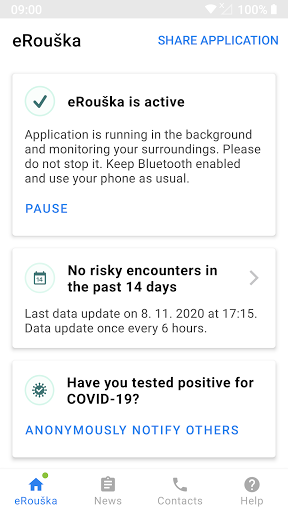  | 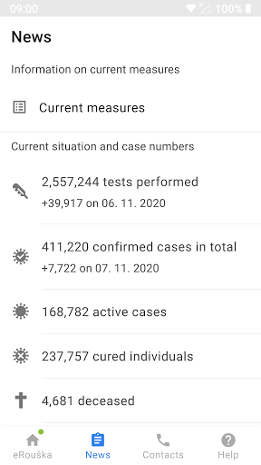  | 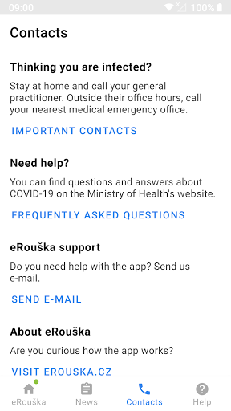  | 
 | 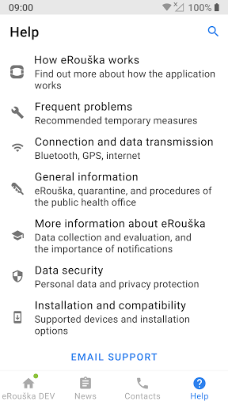  | 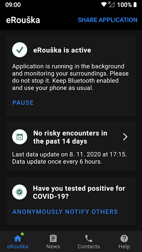  | 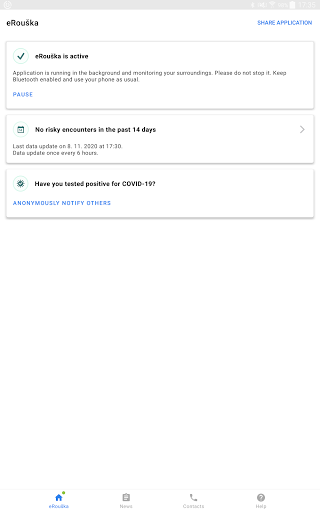  | 

## Development team
In the following we report the main information provided by the development team in the Google play store.

| | |
|-------------------------|-------------------------|
| **Developer**  | Ministerstvo zdravotnictví České republiky |
| **Website**  | [https://erouska.cz](https://erouska.cz) |
| **Email** | info@erouska.cz |
| **Physical address**  | [Palackého náměstí 375/4 128 01 Praha 2 Česká republika](https://www.google.com/maps/search/Palackého%20náměstí%20375/4%20128%2001%20Praha%202%20Česká%20republika) (Google Maps) |
| **Other developed apps**  | [https://play.google.com/store/apps/developer?id=6973241785916756870](https://play.google.com/store/apps/developer?id=6973241785916756870) |

## Android support

| | |
|-------------------------|-------------------------|
| **Declared target Android version**  | - |
| **Effective target Android version**  | - |
| **Minimum supported Android version**  | Marshmallow, version 6.0 (API level 23) |
| **Maximum target Android version**  | - |

The larger the difference between the minimum and maximum supported Android versions, the better. A larger difference means a wider audience. For example, old phones have a very low Android version, so a high minimum supported Android version means that the app cannot be used by users with old phones, thus leading to accessibility problems. 

## Requested permissions

In the following we report the complete list of the permissions requested by the app. 

| **Permission** | **Protection level** | **Description** | 
|-------------------------|-------------------------|-------------------------|
 **android.permission ACCESS_NETWORK_STATE** | Normal | Allows applications to access information about networks. 
 **android.permission BLUETOOTH** | Normal | Allows applications to connect to paired bluetooth devices. 
 **android.permission FOREGROUND_SERVICE** | Normal | Allows a regular application to use Service.startForeground. 
 **android.permission INTERNET** | Normal | Allows applications to open network sockets. 
 **android.permission RECEIVE_BOOT_COMPLETED** | Normal | Allows an application to receive the Intent.ACTION_BOOT_COMPLETED that is broadcast after the system finishes booting. 
 **android.permission WAKE_LOCK** | Normal | Allows using PowerManager WakeLocks to keep processor from sleeping or screen from dimming. 
 **com.google.android.c2dm.permission RECEIVE** | - | - 
 **com.google.android.finsky.permission BIND_GET_INSTALL_REFERRER_SERVICE** | - | - 

## Mentioned servers

| **Server** | **Registrant** | **Registrant country** | **Creation date** | 
|-------------------------|-------------------------|-------------------------|-------------------------|
 | googlesyndication.com | Google LLC | :us: US | 2003-01-21 06:17:24 |
 | google.com | Google LLC | :us: US | 1997-09-15 04:00:00 |
 | app-measurement.com | Google LLC | :us: US | 2015-06-19 20:13:31 |
 | android.com | Google LLC | :us: US | 1997-06-23 04:00:00 |
 | googleapis.com | Google LLC | :us: US | 2005-01-25 17:52:26 |
 | crashlytics.com | Google LLC | :us: US | 2011-01-21 15:30:40 |
 | googleadservices.com | Google LLC | :us: US | 2003-06-19 16:34:53 |
 | erouska.cz | SB:MZCR | - | 2020-03-18 17:41:18 |

## Security analysis 

Below we report the main security warnings raised by our execution of the [Androwarn](https://github.com/maaaaz/androwarn) security analysis tool.

**Connection interfaces exfiltration**
> - This application reads details about the currently active data network 
> - This application tries to find out if the currently active data network is metered 

**Suspicious connection establishment**
> - This application opens a Socket and connects it to the remote address ' returned no addresses for  ; port is out of range' on the 'N/A' port  
> - This application opens a Socket and connects it to the remote address '' on the 'N/A' port  
> - This application opens a Socket and connects it to the remote address 'Ljava/net/Proxy;->type()Ljava/net/Proxy$Type;' on the 'N/A' port  
> - This application opens a Socket and connects it to the remote address 'timeout' on the 'N/A' port  

## User ratings and reviews

Below we provide information about how end users are reacting to the app in terms of ratings and reviews in the Google Play store.

### Ratings

The eRouška - Part of Smart Quarantine app has been installed by more than **1000000** times. At this time, **9904** rated the app and its average score is **3.875124**. Below we show the distribution of the ratings across the usual star-based rating of Google Play

:star::star::star::star::star:: 5694

:star::star::star::star:: 1374

:star::star::star:: 589

:star::star:: 402

:star:: 1845

### Reviews 

#### 5-star reviews

No recent reviews available with 5 stars.

#### 4-star reviews

No recent reviews available with 4 stars.

#### 3-star reviews

No recent reviews available with 3 stars.

#### 2-star reviews

No recent reviews available with 2 stars.

#### 1-star reviews

No recent reviews available with 1 stars.

# Stopp Corona
App version ``2.1.4.1247-QA_266``

Analyzed with [covid-apps-observer](http://github.com/covid-apps-observer) project, version ``0.1``

## App overview
| | |
|-------------------------|-------------------------| 
| **Name**&nbsp;&nbsp;&nbsp;&nbsp;&nbsp;&nbsp;&nbsp;&nbsp;&nbsp;&nbsp;&nbsp;&nbsp;&nbsp;&nbsp;&nbsp;&nbsp;&nbsp;&nbsp;&nbsp;&nbsp;&nbsp;&nbsp;&nbsp;&nbsp;&nbsp;&nbsp;&nbsp;&nbsp;&nbsp;&nbsp;&nbsp;&nbsp;&nbsp;&nbsp;&nbsp;&nbsp;&nbsp;&nbsp;&nbsp;&nbsp;  | Stopp Corona |
| **Unique identifier** | at.roteskreuz.stopcorona |
| **Link to Google Play** | [https://play.google.com/store/apps/details?id=at.roteskreuz.stopcorona](https://play.google.com/store/apps/details?id=at.roteskreuz.stopcorona) |
| **Summary**  | De Corona-waarschuwing-app van Oostenrijk |
| **Privacy policy** | [https://www.roteskreuz.at/site/faq-app-stopp-corona/datenschutzinformation-zur-stopp-corona-app/](https://www.roteskreuz.at/site/faq-app-stopp-corona/datenschutzinformation-zur-stopp-corona-app/) |
| **Latest version** | 2.1.4.1247-QA_266 |
| **Last update** | 2021-05-28 22:10:38 |
| **Recent changes** | Dark mode support Dairy functionality added  |
| **Installs**  | 100.000+ |
| **Category** | Medisch |
| **First release** | 25 jun. 2020 |
| **Size**  | 7,0M |
| **Supported Android version**  | 6.0 en hoger |

### Description
> The Austrian Red Cross publishes the “Stopp Corona” app on behalf of the Federal Ministry of Health as the responsible authority of the Austrian Federal Government.
 „Stopp Corona“ helps you to keep track of encounters with friends, family or co-workers and save them anonymously. Should you contract the corona virus all your encounters of the last two days will be informed automatically and anonymously. 
 You too will be notified instantly and anonymously should one of your saved encounters report to have contracted the virus. Helping all of you to take appropriate measures such as.
  
 - Keep a safe distance (1–2 meters) from others
 - Avoid social contacts
 - Self-quarantine as a precaution 
  
 Together we can break the chain of infection. Not only by protecting ourselves, but also by preventing others from being infected. 
  
 Say hello with a digital handshake
  
 It will definitely be a while before we’ll actually shake each others hands again. In the meantime: use “Stopp Corona”s digital handshake. 
 If you and the person you encounter have installed Stopp Corona the app will anonymously save your meeting. Should one of you fall sick with the corona virus the other will receive an instant notification. 
  
  
 Self-check your corona status
  
 How are you feeling today? Just answer the clinically proven questionnaire to check yourself for corona symptoms daily. 
  
 Report suspected infections
  
 Should your symptoms match those of a corona infection, you can choose to inform your encounters. This is extremely important so stop the virus from spreading. Everyone you saved in the last two days will get an anonymous notification. So don’t you worry: your personal data is safe with us. 
  
 If you suspect to have contracted the corona virus, please stay at home and contact your attending physician via telephone. If that is not possible, call the Corona-Hotline 1450. Please do not visit your doctors office or a hospital in person!
  
 Medical confirmation
  
 If you are officially tested for the corona virus and your test comes back positive, please notify your encounters immediately. Of course the notification will also be anonymous. 
  
 This app was developed in cooperation with the UNIQA foundation. 
  
 App concept and implementation was created with the support of Accenture Austria. 
 The Stopp Corona App is based on the Google/Apple Framework. 
  
 Care for you. Care for me. That’s how we protect ourselves. 
 Open Source Software Project: https://github.com/austrianredcross/stopp-corona-android

### User interface
The developers of the app provide the following screenshots in the Google play store.
| | | |
|:-------------------------:|:-------------------------:|:-------------------------:|
 | 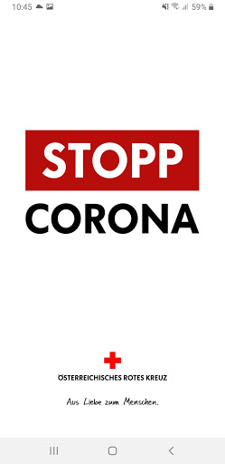  | 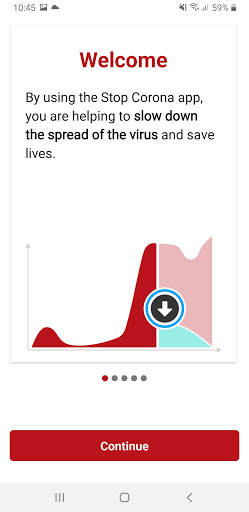  | 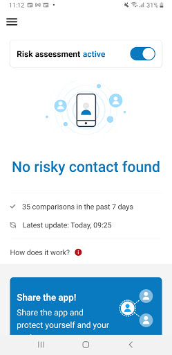  | 
 | 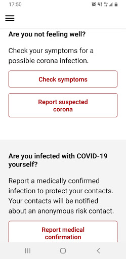  | 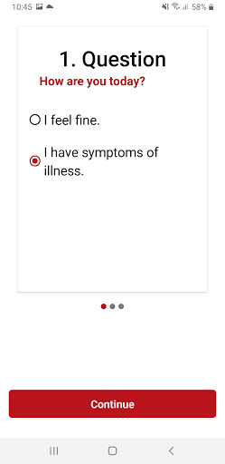  | 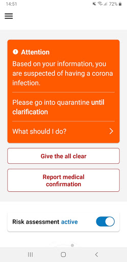  | 
 | 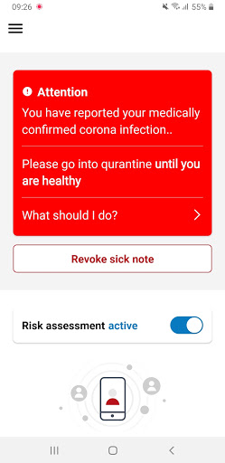  |  

## Development team
In the following we report the main information provided by the development team in the Google play store.

| | |
|-------------------------|-------------------------|
| **Developer**  | Österreichisches Rotes Kreuz |
| **Website**  | [https://www.roteskreuz.at](https://www.roteskreuz.at) |
| **Email** | service@roteskreuz.at |
| **Physical address**  | [Wiedner Hauptstrasse 32 1040 Wien Österreich](https://www.google.com/maps/search/Wiedner%20Hauptstrasse%2032%201040%20Wien%20Österreich) (Google Maps) |
| **Other developed apps**  | [https://play.google.com/store/apps/developer?id=%C3%96sterreichisches+Rotes+Kreuz](https://play.google.com/store/apps/developer?id=%C3%96sterreichisches+Rotes+Kreuz) |

## Android support

| | |
|-------------------------|-------------------------|
| **Declared target Android version**  | Android10, version 10 (API level 29) |
| **Effective target Android version**  | Android10, version 10 (API level 29) |
| **Minimum supported Android version**  | Marshmallow, version 6.0 (API level 23) |
| **Maximum target Android version**  | - |

The larger the difference between the minimum and maximum supported Android versions, the better. A larger difference means a wider audience. For example, old phones have a very low Android version, so a high minimum supported Android version means that the app cannot be used by users with old phones, thus leading to accessibility problems. 

## Requested permissions

In the following we report the complete list of the permissions requested by the app. 

| **Permission** | **Protection level** | **Description** | 
|-------------------------|-------------------------|-------------------------|
 **android.permission ACCESS_NETWORK_STATE** | Normal | Allows applications to access information about networks. 
 **android.permission BLUETOOTH** | Normal | Allows applications to connect to paired bluetooth devices. 
 **android.permission FOREGROUND_SERVICE** | Normal | Allows a regular application to use Service.startForeground. 
 **android.permission INTERNET** | Normal | Allows applications to open network sockets. 
 **android.permission RECEIVE_BOOT_COMPLETED** | Normal | Allows an application to receive the Intent.ACTION_BOOT_COMPLETED that is broadcast after the system finishes booting. 
 **android.permission REQUEST_IGNORE_BATTERY_OPTIMIZATIONS** | Normal | Permission an application must hold in order to use Settings.ACTION_REQUEST_IGNORE_BATTERY_OPTIMIZATIONS. 
 **android.permission WAKE_LOCK** | Normal | Allows using PowerManager WakeLocks to keep processor from sleeping or screen from dimming. 

## Mentioned servers

| **Server** | **Registrant** | **Registrant country** | **Creation date** | 
|-------------------------|-------------------------|-------------------------|-------------------------|
 | google.com | Google LLC | :us: US | 1997-09-15 04:00:00 |
 | prod-rca-coronaapp-fd.net | Domains By Proxy, LLC | :us: US | 2020-04-20 20:16:19 |

## Security analysis 

Below we report the main security warnings raised by our execution of the [Androwarn](https://github.com/maaaaz/androwarn) security analysis tool.

**Connection interfaces exfiltration**
> - This application reads details about the currently active data network 
> - This application tries to find out if the currently active data network is metered 

**Telephony services abuse**
> - This application makes phone calls 

**Suspicious connection establishment**
> - This application opens a Socket and connects it to the remote address '; port is out of range' on the 'N/A' port  
> - This application opens a Socket and connects it to the remote address 'Lcom/android/tools/r8/GeneratedOutlineSupport;->outline17(Ljava/lang/String;)Ljava/lang/StringBuilder;' on the 'N/A' port  
> - This application opens a Socket and connects it to the remote address 'Ljava/net/Proxy;->type()Ljava/net/Proxy$Type;' on the 'N/A' port  
> - This application opens a Socket and connects it to the remote address 'timeout' on the 'N/A' port  

## User ratings and reviews

Below we provide information about how end users are reacting to the app in terms of ratings and reviews in the Google Play store.

### Ratings

The Stopp Corona app has been installed by more than **100000** times. At this time, **3798** rated the app and its average score is **3.5953002**. Below we show the distribution of the ratings across the usual star-based rating of Google Play

:star::star::star::star::star:: 1855

:star::star::star::star:: 535

:star::star::star:: 307

:star::star:: 218

:star:: 883

### Reviews 

#### 5-star reviews

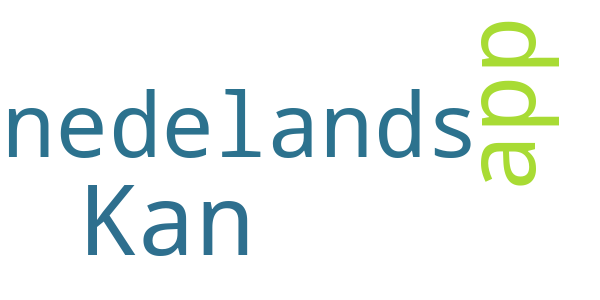

> Kan de app ook in het nedelands  :date: __2020-08-18 22:41:38__

#### 4-star reviews

No recent reviews available with 4 stars.

#### 3-star reviews

No recent reviews available with 3 stars.

#### 2-star reviews

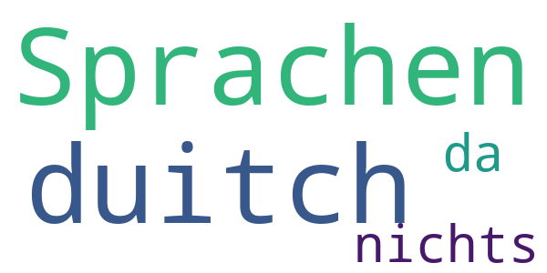

> Sprachen duitch nichts da  :date: __2020-09-22 12:29:59__

#### 1-star reviews

No recent reviews available with 1 stars.

# RIVM LCI-richtlijnen
App version ``1.27.4``

Analyzed with [covid-apps-observer](http://github.com/covid-apps-observer) project, version ``0.1``

## App overview
| | |
|-------------------------|-------------------------| 
| **Name**&nbsp;&nbsp;&nbsp;&nbsp;&nbsp;&nbsp;&nbsp;&nbsp;&nbsp;&nbsp;&nbsp;&nbsp;&nbsp;&nbsp;&nbsp;&nbsp;&nbsp;&nbsp;&nbsp;&nbsp;&nbsp;&nbsp;&nbsp;&nbsp;&nbsp;&nbsp;&nbsp;&nbsp;&nbsp;&nbsp;&nbsp;&nbsp;&nbsp;&nbsp;&nbsp;&nbsp;&nbsp;&nbsp;&nbsp;&nbsp;  | RIVM LCI-richtlijnen |
| **Unique identifier** | nl.rivm.lciapp |
| **Link to Google Play** | [https://play.google.com/store/apps/details?id=nl.rivm.lciapp](https://play.google.com/store/apps/details?id=nl.rivm.lciapp) |
| **Summary**  | Actuele richtlijnen en draaiboeken infectieziektebestrijding |
| **Privacy policy** | [http://www.rivm.nl/Toegankelijkheid/Privacy](http://www.rivm.nl/Toegankelijkheid/Privacy) |
| **Latest version** | 1.27.4 |
| **Last update** | 2020-07-23 09:22:10 |
| **Recent changes** | Bugfixes |
| **Installs**  | 50.000+ |
| **Category** | Medisch |
| **First release** | 16 jul. 2017 |
| **Size**  | 21M |
| **Supported Android version**  | 4.2 en hoger |

### Description
> In de RIVM-app LCI-richtlijnen vindt u -actuele richtlijnen en draaiboeken infectieziektebestrijding. Daarnaast vindt u ook verpleegkundige stappenplannen (VSI’s), publieksinformatie en quizzen in de app.
 De primaire doelgroep van de richtlijnen zijn de artsen en verpleegkundigen infectieziektebestrijding van de afdelingen infectieziektebestrijding van GGD'en, maar ook andere (para)medici. 
 De app bevat de volgende onderdelen:
 -Richtlijnen en Draaiboeken
 -Publieksinformatie
 -Stappenplannen en Quizzen
 -Favorieten, hier kunt u een persoonlijke favorietenlijst maken
 -Meldingsplichtige ziekten
 -Nieuwsover de LCI-richtlijnen
 -Over LCI, informatie over de Landelijke Coördinatie Infectieziektebestrijding
 -Contact
 De informatie in deze app is identiek aan de informatie op www.rivm.nl/richtlijnen.
 Heeft u vragen of tips over de app LCI-richtlijnen? Mail deze dan naar: LCI@rivm.nl

### User interface
The developers of the app provide the following screenshots in the Google play store.
| | | |
|:-------------------------:|:-------------------------:|:-------------------------:|
 |   |   |   | 
 |  

## Development team
In the following we report the main information provided by the development team in the Google play store.

| | |
|-------------------------|-------------------------|
| **Developer**  | rivm-app |
| **Website**  | [http://rivm.nl](http://rivm.nl) |
| **Email** | ict-servicedesk@rivm.nl |
| **Physical address**  | - |
| **Other developed apps**  | [https://play.google.com/store/apps/developer?id=rivm-app](https://play.google.com/store/apps/developer?id=rivm-app) |

## Android support

| | |
|-------------------------|-------------------------|
| **Declared target Android version**  | Pie, version 9 (API level 28) |
| **Effective target Android version**  | Pie, version 9 (API level 28) |
| **Minimum supported Android version**  | Jelly Bean, version 4.2.x (API level 17) |
| **Maximum target Android version**  | - |

The larger the difference between the minimum and maximum supported Android versions, the better. A larger difference means a wider audience. For example, old phones have a very low Android version, so a high minimum supported Android version means that the app cannot be used by users with old phones, thus leading to accessibility problems. 

## Requested permissions

In the following we report the complete list of the permissions requested by the app. 

| **Permission** | **Protection level** | **Description** | 
|-------------------------|-------------------------|-------------------------|
 **android.permission CALL_PHONE** | :warning:**Dangerous** | Allows an application to initiate a phone call without going through the Dialer user interface for the user to confirm the call. 
 **android.permission INTERNET** | Normal | Allows applications to open network sockets. 
 **android.permission READ_PHONE_STATE** | :warning:**Dangerous** | Allows read only access to phone state, including the phone number of the device, current cellular network information, the status of any ongoing calls, and a list of any PhoneAccounts registered on the device. 

## Mentioned servers

| **Server** | **Registrant** | **Registrant country** | **Creation date** | 
|-------------------------|-------------------------|-------------------------|-------------------------|
 | google.com | Google LLC | :us: US | 1997-09-15 04:00:00 |
 | googleapis.com | Google LLC | :us: US | 2005-01-25 17:52:26 |
 | rivm.nl | - | - | 1990-07-17 00:00:00 |
 | dtnr.nl | - | - | 2016-06-07 00:00:00 |
 | apple.com | Apple Inc. | :us: US | 1987-02-19 05:00:00 |
 | xmlpull.org | WhoisGuard, Inc. | PA | 2001-11-26 20:33:08 |

## Security analysis 

Below we report the main security warnings raised by our execution of the [Androwarn](https://github.com/maaaaz/androwarn) security analysis tool.

**Telephony identifiers leakage**
> - This application reads the device phone type value 
> - This application reads the numeric name (MCC+MNC) of current registered operator 
> - This application reads the operator name 

**Connection interfaces exfiltration**
> - This application reads details about the currently active data network 
> - This application tries to find out if the currently active data network is metered 

**Telephony services abuse**
> - This application makes phone calls 

**Code execution**
> - This application loads a native library: 'jniPdfium' 
> - This application loads a native library: 'modft2' 
> - This application loads a native library: 'modpdfium' 
> - This application loads a native library: 'modpng' 

## User ratings and reviews

Below we provide information about how end users are reacting to the app in terms of ratings and reviews in the Google Play store.

### Ratings

The RIVM LCI-richtlijnen app has been installed by more than **50000** times. At this time, **134** rated the app and its average score is **3.21**. Below we show the distribution of the ratings across the usual star-based rating of Google Play

:star::star::star::star::star:: 54

:star::star::star::star:: 18

:star::star::star:: 8

:star::star:: 4

:star:: 48

### Reviews 

#### 5-star reviews

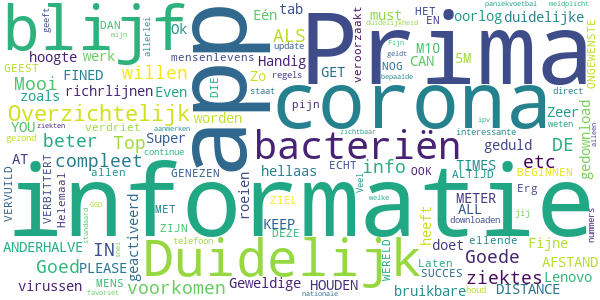

> Geweldig  :date: __2021-01-17 14:06:47__

> Ok  :date: __2020-11-29 11:21:35__

> Goede informatie over corona-virussen  :date: __2020-10-30 20:16:41__

> A must have  :date: __2020-08-25 15:48:08__

> Mooi  :date: __2020-08-24 19:11:01__

> Fijne, duidelijke app  :date: __2020-08-21 05:05:08__

> Even geduld, dat de app alles gedownload heeft.  :date: __2020-08-19 10:31:44__

> Zo blijf je op de hoogte  :date: __2020-07-17 09:57:06__

> Zeer goede en bruikbare informatie  :date: __2020-06-18 17:15:10__

> Geweldige app die het hellaas op een Lenovo tab M10 niet doet..  :date: __2020-06-12 17:52:50__

#### 4-star reviews

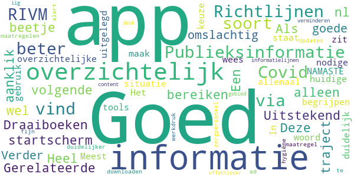

> Goed  :date: __2020-08-18 19:37:40__

> Uitstekend  :date: __2020-08-12 11:36:26__

> wel goed  :date: __2020-07-08 23:18:55__

> Heel overzichtelijk.  :date: __2020-07-05 11:03:44__

> Als ik op het startscherm "Publieksinformatie" aanklik vind ik niets over Covid-19. Deze informatie kan ik alleen bereiken via het volgende traject: "Richtlijnen & Draaiboeken - COVID 19 - Gerelateerde informatie - Publieksinformatie RIVM.nl". Een beetje omslachtig. Verder vind ik het een goede en overzichtelijke app.  :date: __2020-06-30 13:02:17__

> Het staat allemaal in goed te begrijpen woord keuze en duidelijk/overzichtelijk Goed uitgelegd  :date: __2020-06-29 09:06:30__

> Meest nodige informatie zit in deze app 🙏 NAMASTE  :date: __2020-04-09 09:55:23__

> In 2020 en de huidige situatie; maak beter gebruik van dit soort tools- wees duidelijker, m.n voor zorgpersoneel! Updates RIVM maatregelen/richtlijnen(te downloaden hygiëne maatregel ed) door n alert via een soort app als deze zal fijn zijn en zal werkdruk bij informatielijnen verminderen. iig content dat er iets is aan app op dit gebied, maar kan denk ik dus beter/effectiever  :date: __2020-03-12 23:47:14__

#### 3-star reviews

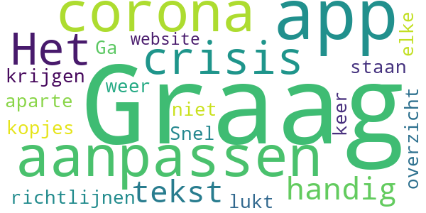

> Graag nog de app aanpassen aan corona crisis.  :date: __2020-04-13 11:55:30__

> Het is niet handig dat de tekst van de richtlijnen onder aparte kopjes staan. Snel overzicht krijgen lukt zo niet. Ga toch elke keer weer naar de website.  :date: __2018-04-15 12:23:09__

#### 2-star reviews

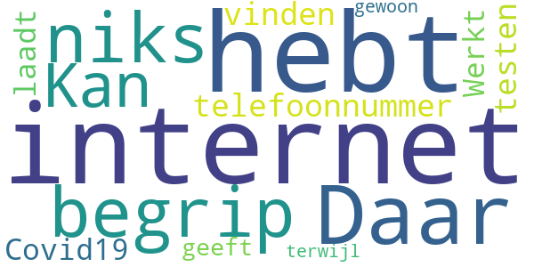

> Daar begrip j p ik niks van  :date: __2021-02-01 14:50:23__

> Kan niet eens een telefoonnummer vinden voor het testen van Covid19  :date: __2020-06-30 22:42:16__

> Werkt niet laadt niet geeft aan dat je geen internet hebt terwijl je gewoon internet hebt  :date: __2020-04-21 20:48:56__

#### 1-star reviews

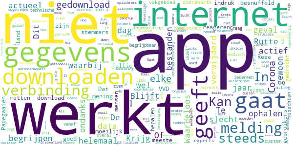

> Corona check geopend en geen informatie gevonden over mijn vacinaties  :date: __2021-07-15 14:18:57__

> W Bras veel te moeilijk  :date: __2021-07-03 17:59:58__

> Wat een k.t app Na dat ik hem downloade werkt mijn afas app niet meer. En die heb ik nodig voor mijn werk.  :date: __2021-06-29 22:20:22__

> Dit zijn nu de mensen die het land reageren en Rutte is het Papegaaien. Dat is mijn mening.  :date: __2021-04-10 09:39:46__

> Krijg de indruk dat meeste gebruikers van deze App VVD stemmers zijn.  :date: __2021-03-16 11:21:58__

> Reee  :date: __2020-10-26 16:31:39__

> In geen 1000 jaar dat ik dit gedrocht download , zijn jullie helemaal van de ratten besnuffeld .  :date: __2020-10-21 21:24:33__

> Of deze app wel of niet goed is moeilijk om te bepalen. De bewoording is voor experts binnen hun eigen vakgebied misschien te begrijpen, ook al begrijpen mijn zussen die dierenarts en chemicoloog zijn en ikzelf dit niet. Graag zou ik deze app zien zodat deze voor iedereen vanaf 7 jaar begrijpbaar is met overal een link naar extra medisch/technische uitleg voor wetenschappers.  :date: __2020-10-15 22:17:26__

> Downloaden lukt niet.  :date: __2020-10-11 12:21:38__

> Loopt vast in Griekenland. In dit geval Kreta. De app downloaden gaat simpel. Bij het ophalen van gegevens gaat het mis.  :date: __2020-08-17 09:27:25__

# OpenWHO: Knowledge for Health Emergencies
App version ``3.7``

Analyzed with [covid-apps-observer](http://github.com/covid-apps-observer) project, version ``0.1``

## App overview
| | |
|-------------------------|-------------------------| 
| **Name**&nbsp;&nbsp;&nbsp;&nbsp;&nbsp;&nbsp;&nbsp;&nbsp;&nbsp;&nbsp;&nbsp;&nbsp;&nbsp;&nbsp;&nbsp;&nbsp;&nbsp;&nbsp;&nbsp;&nbsp;&nbsp;&nbsp;&nbsp;&nbsp;&nbsp;&nbsp;&nbsp;&nbsp;&nbsp;&nbsp;&nbsp;&nbsp;&nbsp;&nbsp;&nbsp;&nbsp;&nbsp;&nbsp;&nbsp;&nbsp;  | OpenWHO: Knowledge for Health Emergencies |
| **Unique identifier** | de.xikolo.openwho |
| **Link to Google Play** | [https://play.google.com/store/apps/details?id=de.xikolo.openwho](https://play.google.com/store/apps/details?id=de.xikolo.openwho) |
| **Summary**  | Levensreddende kennis voor eerstelijnshulpverleners in noodsituaties op gezondheidsgebied. |
| **Privacy policy** | [https://openwho.org/pages/privacy](https://openwho.org/pages/privacy) |
| **Latest version** | 3.7 |
| **Last update** | 2020-11-23 13:57:15 |
| **Recent changes** | - Bug fixes and performance improvements |
| **Installs**  | 1.000.000+ |
| **Category** | Onderwijs |
| **First release** | 17 mei 2017 |
| **Size**  | 18M |
| **Supported Android version**  | 5.0 en hoger |

### Description
> OpenWHO is the World Health Organization's (WHO) interactive knowledge-transfer platform offering online courses to improve the response to health emergencies. OpenWHO enables the Organization and its key partners to transfer life-saving knowledge to large numbers of frontline responders.
 With OpenWHO, you have the flexibility to learn at your convenience. Watch the short video lectures and test your knowledge with self-tests when and where you like. The course forum and the collaboration space allow you to get in touch with other participants and experts around the world.
  
 Designed primarily for health care workers, frontline responders, and decision-makers, the app is also a source of information for those affected by disease outbreaks and health emergencies, or for those with a general interest in WHO's work in health emergencies.
  
 It features 6 channels:
 - The <b>Outbreak</b> channel addresses the management of infectious diseases and provides life-saving, scientific information.
 - The <b>Ready for Response</b> channel helps prepare personnel who are training for deployment to work in disease outbreaks and health emergencies.
 - The <b>Get Social</b> channel focuses on social science-based interventions and helps to communicate with affected communities.
 - The <b>Preparing for Pandemics</b> channel brings together courses on various aspects of preparedness, including surveillance, public health measures and risk communication during a pandemic.
 - The <b>COVID-19</b> channel provides learning resources in WHO's 6 official languages (Arabic, Chinese, English, French, Russian and Spanish) for health professionals, decision-makers and the public for the outbreak of coronavirus disease (COVID-19).
 - The <b>COVID-19 National Languages</b> channel provides the same learning resources as the COVID-19 channel but in national languages, such as Indonesian, Japanese and Portuguese. 
  
 OpenWHO courses are available in many languages, including WHO's 6 official languages. 
  
 Download the app now, and join the OpenWHO community.
 This app is developed in cooperation between the Hasso Plattner Institute and the WHO. The learning content is provided exclusively by the WHO.

### User interface
The developers of the app provide the following screenshots in the Google play store.
| | | |
|:-------------------------:|:-------------------------:|:-------------------------:|
 |   |   |   | 
 | 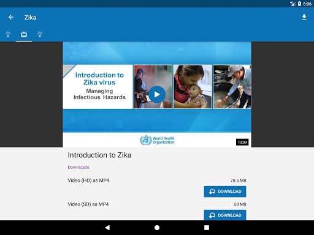  |   |   | 

## Development team
In the following we report the main information provided by the development team in the Google play store.

| | |
|-------------------------|-------------------------|
| **Developer**  | HPI Knowledge Engineering Team |
| **Website**  | [https://openwho.org/](https://openwho.org/) |
| **Email** | openwho-support@hpi.de |
| **Physical address**  | [Prof.-Dr.-Helmert-Str.2-3 14482 Potsdam](https://www.google.com/maps/search/Prof.-Dr.-Helmert-Str.2-3%2014482%20Potsdam) (Google Maps) |
| **Other developed apps**  | [https://play.google.com/store/apps/developer?id=7185448023325736337](https://play.google.com/store/apps/developer?id=7185448023325736337) |

## Android support

| | |
|-------------------------|-------------------------|
| **Declared target Android version**  | - |
| **Effective target Android version**  | - |
| **Minimum supported Android version**  | Lollipop, version 5.0 (API level 21) |
| **Maximum target Android version**  | - |

The larger the difference between the minimum and maximum supported Android versions, the better. A larger difference means a wider audience. For example, old phones have a very low Android version, so a high minimum supported Android version means that the app cannot be used by users with old phones, thus leading to accessibility problems. 

## Requested permissions

In the following we report the complete list of the permissions requested by the app. 

| **Permission** | **Protection level** | **Description** | 
|-------------------------|-------------------------|-------------------------|
 **android.permission ACCESS_NETWORK_STATE** | Normal | Allows applications to access information about networks. 
 **android.permission ACCESS_WIFI_STATE** | Normal | Allows applications to access information about Wi-Fi networks. 
 **android.permission DOWNLOAD_WITHOUT_NOTIFICATION** | - | - 
 **android.permission FOREGROUND_SERVICE** | Normal | Allows a regular application to use Service.startForeground. 
 **android.permission INTERNET** | Normal | Allows applications to open network sockets. 
 **android.permission RECEIVE_BOOT_COMPLETED** | Normal | Allows an application to receive the Intent.ACTION_BOOT_COMPLETED that is broadcast after the system finishes booting. 
 **android.permission WAKE_LOCK** | Normal | Allows using PowerManager WakeLocks to keep processor from sleeping or screen from dimming. 
 **android.permission WRITE_EXTERNAL_STORAGE** | :warning:**Dangerous** | Allows an application to write to external storage. 
 **com.google.android.c2dm.permission RECEIVE** | - | - 
 **com.google.android.finsky.permission BIND_GET_INSTALL_REFERRER_SERVICE** | - | - 

## Mentioned servers

| **Server** | **Registrant** | **Registrant country** | **Creation date** | 
|-------------------------|-------------------------|-------------------------|-------------------------|
 | googlesyndication.com | Google LLC | :us: US | 2003-01-21 06:17:24 |
 | google.com | Google LLC | :us: US | 1997-09-15 04:00:00 |
 | apple.com | Apple Inc. | :us: US | 1987-02-19 05:00:00 |
 | aomedia.org | Contact Privacy Inc. Customer 1243324949 | :canada: CA | 2015-08-24 14:07:31 |
 | dashif.org | VTM Group | :us: US | 2012-04-27 13:02:46 |
 | app-measurement.com | Google LLC | :us: US | 2015-06-19 20:13:31 |
 | w3.org | W3C | :us: US | 1994-07-06 04:00:00 |
 | googleapis.com | Google LLC | :us: US | 2005-01-25 17:52:26 |
 | psdev.de | - | - | - |
 | xmlpull.org | WhoisGuard, Inc. | PA | 2001-11-26 20:33:08 |
 | crashlytics.com | Google LLC | :us: US | 2011-01-21 15:30:40 |
 | apache.org | The Apache Software Foundation | :us: US | 1995-04-11 04:00:00 |
 | opensource.org | Open Source Initiative | :us: US | 1998-02-11 05:00:00 |
 | creativecommons.org | Creative Commons Corporation | :canada: CA | 2001-01-15 16:51:44 |
 | eclipse.org | Eclipse.org Foundation, Inc. | :canada: CA | 1997-04-14 04:00:00 |
 | gnu.org | Free Software Foundation | :us: US | 1995-11-24 05:00:00 |
 | mozilla.org | Mozilla Corporation | :us: US | 1998-01-24 05:00:00 |
 | googleadservices.com | Google LLC | :us: US | 2003-06-19 16:34:53 |

## Security analysis 

Below we report the main security warnings raised by our execution of the [Androwarn](https://github.com/maaaaz/androwarn) security analysis tool.

**Telephony identifiers leakage**
> - This application reads the ISO country code equivalent of the current registered operator's MCC (Mobile Country Code) 
> - This application reads the MCC+MNC of the provider of the SIM 

**Connection interfaces exfiltration**
> - This application reads details about the currently active data network 
> - This application tries to find out if the currently active data network is metered 

**Suspicious connection establishment**
> - This application opens a Socket and connects it to the remote address ' returned no addresses for  ; port is out of range' on the 'N/A' port  
> - This application opens a Socket and connects it to the remote address '' on the 'N/A' port  
> - This application opens a Socket and connects it to the remote address 'Ljava/lang/StringBuilder;->toString()Ljava/lang/String;' on the 'N/A' port  
> - This application opens a Socket and connects it to the remote address 'Ljava/net/Proxy;->type()Ljava/net/Proxy$Type;' on the 'N/A' port  
> - This application opens a Socket and connects it to the remote address 'timeout' on the 'N/A' port  

**Code execution**
> - This application loads a native library 

## User ratings and reviews

Below we provide information about how end users are reacting to the app in terms of ratings and reviews in the Google Play store.

### Ratings

The OpenWHO: Knowledge for Health Emergencies app has been installed by more than **1000000** times. At this time, **3403** rated the app and its average score is **4.271137**. Below we show the distribution of the ratings across the usual star-based rating of Google Play

:star::star::star::star::star:: 2411

:star::star::star::star:: 367

:star::star::star:: 129

:star::star:: 129

:star:: 367

### Reviews 

#### 5-star reviews

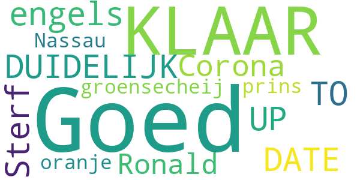

> KLAAR,DUIDELIJK,UP TO DATE!  :date: __2020-09-29 11:42:07__

> Goed maar in het engels  :date: __2020-09-18 23:22:22__

> Sterf Corona!  :date: __2020-09-18 19:10:33__

> Ronald groensecheij prins van oranje Nassau  :date: __2020-04-20 15:59:15__

> Goed  :date: __2020-03-22 12:10:06__

#### 4-star reviews

> Oke  :date: __2020-10-17 08:51:29__

#### 3-star reviews

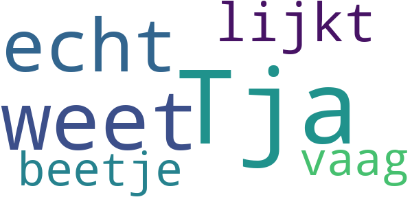

> Tja weet het nog niet echt lijkt me beetje vaag  :date: __2020-06-14 19:44:44__

#### 2-star reviews

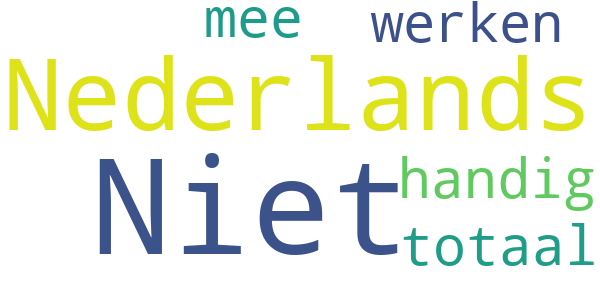

> Niet Nederlands?  :date: __2020-05-29 19:42:03__

> Niet in Nederlands is totaal niet handig ook niet om mee te werken  :date: __2020-03-27 17:35:23__

#### 1-star reviews

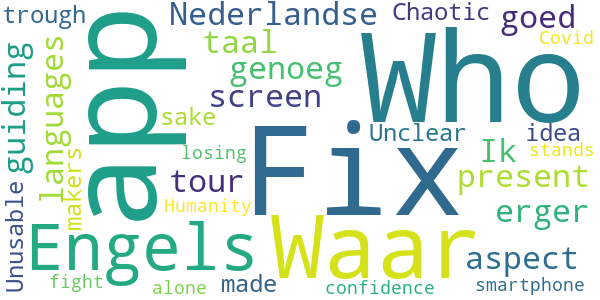

> Waar om moet het in het Engels, is de Nederlandse taal goed genoeg . Ik erger mij er aan .  :date: __2020-04-21 11:28:14__

> Fix the languages, fix the screen aspect, present a guiding tour trough the app, Who made this for f* sake  :date: __2020-03-30 18:15:19__

> Unclear. Chaotic. Unusable. The makers have no idea what an app for a smartphone should be. WHO is losing my confidence. Humanity stands alone in the fight against Covid-19.  :date: __2020-03-28 17:14:47__

# COVID Symptom Study
App version ``2.5.0``

Analyzed with [covid-apps-observer](http://github.com/covid-apps-observer) project, version ``0.1``

## App overview
| | |
|-------------------------|-------------------------| 
| **Name**&nbsp;&nbsp;&nbsp;&nbsp;&nbsp;&nbsp;&nbsp;&nbsp;&nbsp;&nbsp;&nbsp;&nbsp;&nbsp;&nbsp;&nbsp;&nbsp;&nbsp;&nbsp;&nbsp;&nbsp;&nbsp;&nbsp;&nbsp;&nbsp;&nbsp;&nbsp;&nbsp;&nbsp;&nbsp;&nbsp;&nbsp;&nbsp;&nbsp;&nbsp;&nbsp;&nbsp;&nbsp;&nbsp;&nbsp;&nbsp;  | COVID Symptom Study |
| **Unique identifier** | com.joinzoe.covid_zoe |
| **Link to Google Play** | [https://play.google.com/store/apps/details?id=com.joinzoe.covid_zoe](https://play.google.com/store/apps/details?id=com.joinzoe.covid_zoe) |
| **Summary**  | Help COVID-19 te vertragen door uw symptomen dagelijks zelf te melden, zelfs als u zich goed voelt. |
| **Privacy policy** | [https://predict.study/covid-privacy-notice/](https://predict.study/covid-privacy-notice/) |
| **Latest version** | 2.5.0 |
| **Last update** | 2021-05-13 15:07:39 |
| **Recent changes** | Improved support for screen readers. Add support for deep links / universal links.  |
| **Installs**  | 1.000.000+ |
| **Category** | Gezondheid en fitness |
| **First release** | - |
| **Size**  | 38M |
| **Supported Android version**  | 5.0 en hoger |

### Description
> Help slow the spread of COVID-19 by self-reporting your symptoms daily, even if you feel well.
 Join millions of people supporting scientists at King’s College London to help our health services by identifying:
 * How fast the virus is spreading in your area
 * High-risk areas in the UK
 * Who is most at risk, by better understanding symptoms linked to underlying health conditions
 You will contribute to advance research on COVID-19 in partnership with leading scientific institutions like King’s College London and TwinsUK, one of the most clinically detailed studies in the world.
 This app allows you to help others, but does not give health advice. If you need health advice please visit the NHS website at: https://www.nhs.uk/conditions/coronavirus-covid-19/
 This app (formerly known as the Covid Symptom Tracker) is designed by doctors and scientists at King's College London, Guys and St Thomas’ Hospitals and Zoe Global Limited, a health technology company.
 If you would like to help out in this difficult time, then you can. Download the app and share daily your own status, even if you are well. With your help we can understand much better the situation up and down the country, how the disease presents itself to different people, and how it progresses.
 This is a new virus which the UK has never seen before. There are a wide range of symptoms, which differ between people. With your help we can understand better how the disease presents itself depending upon individual factors such as health and age.
 No information you share will be used for commercial purposes.
 There are two parts to the app:
 HEALTH INFORMATION
 You will be asked to share some general information, such as your age and some health information, such as whether you have certain diseases.
 SYMPTOM TRACKING
 We will ask you every day to let us know how you feel, so you can share your symptoms. We will also ask whether you have visited the hospital, what treatment you received there, and whether you have been tested for COVID-19 (Coronavirus).

### User interface
The developers of the app provide the following screenshots in the Google play store.
| | | |
|:-------------------------:|:-------------------------:|:-------------------------:|
 |   |   | 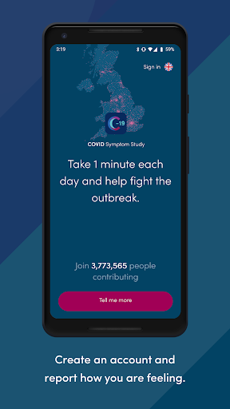  | 
 |   |   | 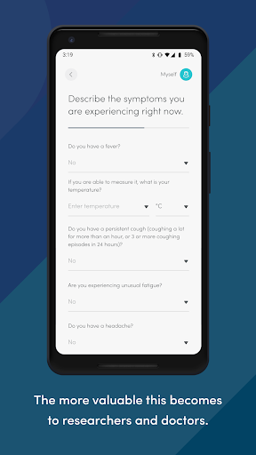  | 
 | 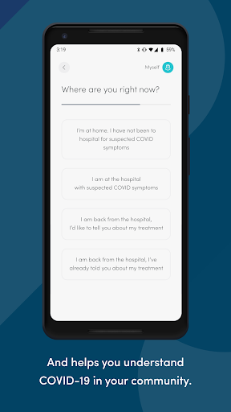  | 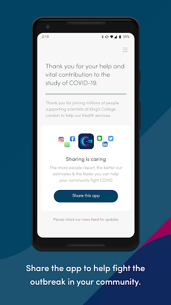  |   | 
 | 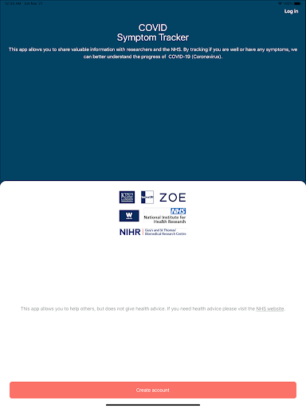  | 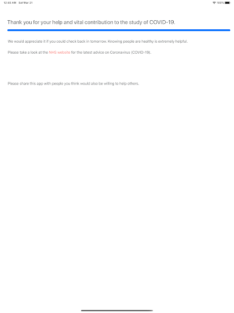  | 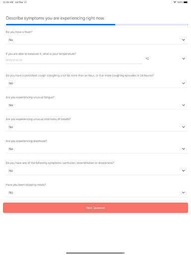  | 
 | 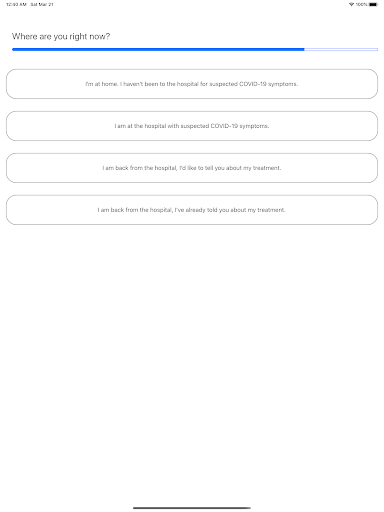  | 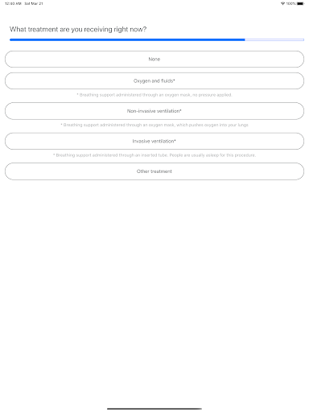  |   | 

## Development team
In the following we report the main information provided by the development team in the Google play store.

| | |
|-------------------------|-------------------------|
| **Developer**  | Zoe Global Limited |
| **Website**  | [http://covid.joinzoe.com/](http://covid.joinzoe.com/) |
| **Email** | covid@joinzoe.com |
| **Physical address**  | [164 Westminster Bridge Road London SE1 7RW United Kingdom](https://www.google.com/maps/search/164%20Westminster%20Bridge%20Road%20London%20SE1%207RW%20United%20Kingdom) (Google Maps) |
| **Other developed apps**  | [https://play.google.com/store/apps/developer?id=Zoe+Global+Limited](https://play.google.com/store/apps/developer?id=Zoe+Global+Limited) |

## Android support

| | |
|-------------------------|-------------------------|
| **Declared target Android version**  | Android10, version 10 (API level 29) |
| **Effective target Android version**  | Android10, version 10 (API level 29) |
| **Minimum supported Android version**  | Lollipop, version 5.0 (API level 21) |
| **Maximum target Android version**  | - |

The larger the difference between the minimum and maximum supported Android versions, the better. A larger difference means a wider audience. For example, old phones have a very low Android version, so a high minimum supported Android version means that the app cannot be used by users with old phones, thus leading to accessibility problems. 

## Requested permissions

In the following we report the complete list of the permissions requested by the app. 

| **Permission** | **Protection level** | **Description** | 
|-------------------------|-------------------------|-------------------------|
 **android.permission ACCESS_NETWORK_STATE** | Normal | Allows applications to access information about networks. 
 **android.permission ACCESS_WIFI_STATE** | Normal | Allows applications to access information about Wi-Fi networks. 
 **android.permission INTERNET** | Normal | Allows applications to open network sockets. 
 **android.permission READ_APP_BADGE** | - | - 
 **android.permission READ_EXTERNAL_STORAGE** | :warning:**Dangerous** | Allows an application to read from external storage. 
 **android.permission RECEIVE_BOOT_COMPLETED** | Normal | Allows an application to receive the Intent.ACTION_BOOT_COMPLETED that is broadcast after the system finishes booting. 
 **android.permission WAKE_LOCK** | Normal | Allows using PowerManager WakeLocks to keep processor from sleeping or screen from dimming. 
 **android.permission WRITE_EXTERNAL_STORAGE** | :warning:**Dangerous** | Allows an application to write to external storage. 
 **com.anddoes.launcher.permission UPDATE_COUNT** | - | - 
 **com.google.android.c2dm.permission RECEIVE** | - | - 
 **com.google.android.finsky.permission BIND_GET_INSTALL_REFERRER_SERVICE** | - | - 
 **com.htc.launcher.permission READ_SETTINGS** | - | - 
 **com.htc.launcher.permission UPDATE_SHORTCUT** | - | - 
 **com.huawei.android.launcher.permission CHANGE_BADGE** | - | - 
 **com.huawei.android.launcher.permission READ_SETTINGS** | - | - 
 **com.huawei.android.launcher.permission WRITE_SETTINGS** | - | - 
 **com.majeur.launcher.permission UPDATE_BADGE** | - | - 
 **com.oppo.launcher.permission READ_SETTINGS** | - | - 
 **com.oppo.launcher.permission WRITE_SETTINGS** | - | - 
 **com.sec.android.provider.badge.permission READ** | - | - 
 **com.sec.android.provider.badge.permission WRITE** | - | - 
 **com.sonyericsson.home.permission BROADCAST_BADGE** | - | - 
 **com.sonymobile.home.permission PROVIDER_INSERT_BADGE** | - | - 
 **me.everything.badger.permission BADGE_COUNT_READ** | - | - 
 **me.everything.badger.permission BADGE_COUNT_WRITE** | - | - 

## Mentioned servers

| **Server** | **Registrant** | **Registrant country** | **Creation date** | 
|-------------------------|-------------------------|-------------------------|-------------------------|
 | amplitude.com | Amplitude | :us: US | 1996-05-09 04:00:00 |
 | android.com | Google LLC | :us: US | 1997-06-23 04:00:00 |
 | google.com | Google LLC | :us: US | 1997-09-15 04:00:00 |
 | microsoft.com | Microsoft Corporation | :us: US | 1991-05-02 04:00:00 |
 | googleapis.com | Google LLC | :us: US | 2005-01-25 17:52:26 |
 | cloudfront.net | Amazon.com, Inc. | :us: US | 2008-04-25 18:25:49 |
 | expo.io | See PrivacyGuardian.org | :us: US | 2011-05-01 21:26:50 |

## Security analysis 

Below we report the main security warnings raised by our execution of the [Androwarn](https://github.com/maaaaz/androwarn) security analysis tool.

**Telephony identifiers leakage**
> - This application reads the ISO country code equivalent of the current registered operator's MCC (Mobile Country Code) 
> - This application reads the device phone type value 
> - This application reads the numeric name (MCC+MNC) of current registered operator 
> - This application reads the operator name 

**Location lookup**
> - This application reads location information from all available providers (WiFi, GPS etc.) 

**Connection interfaces exfiltration**
> - This application reads details about the currently active data network 
> - This application tries to find out if the currently active data network is metered 

**Suspicious connection establishment**
> - This application opens a Socket and connects it to the remote address '' on the 'N/A' port  
> - This application opens a Socket and connects it to the remote address 'Ljava/lang/StringBuilder;->toString()Ljava/lang/String;' on the ': connect, resolve' port  
> - This application opens a Socket and connects it to the remote address 'Ljava/lang/StringBuilder;->toString()Ljava/lang/String;' on the 'N/A' port  
> - This application opens a Socket and connects it to the remote address 'Ljava/net/Proxy;->type()Ljava/net/Proxy$Type;' on the 'N/A' port  
> - This application opens a Socket and connects it to the remote address 'timeout' on the 'N/A' port  

**Pim data leakage**
> - This application accesses data stored in the clipboard 

**Code execution**
> - This application loads a native library 
> - This application loads a native library: 'log' 
> - This application loads a native library: 'sentry' 
> - This application loads a native library: 'sentry-android' 
> - This application executes a UNIX command 

## User ratings and reviews

Below we provide information about how end users are reacting to the app in terms of ratings and reviews in the Google Play store.

### Ratings

The COVID Symptom Study app has been installed by more than **1000000** times. At this time, **-** rated the app and its average score is **0**. Below we show the distribution of the ratings across the usual star-based rating of Google Play

:star::star::star::star::star:: 0

:star::star::star::star:: 0

:star::star::star:: 0

:star::star:: 0

:star:: 0

### Reviews 

#### 5-star reviews

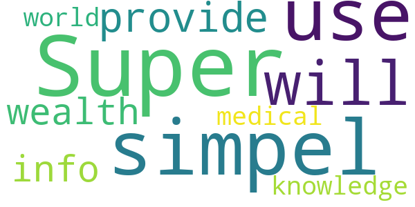

> Super simpel to use, will provide a wealth of info and knowledge for the medical world.  :date: __2020-04-10 13:14:11__

#### 4-star reviews

No recent reviews available with 4 stars.

#### 3-star reviews

> Jag saknar möjlighet att notera vilka symptom jag har kvar och inte bara frågan om " finns symptom kvar?"  :date: __2020-05-04 10:47:27__

#### 2-star reviews

No recent reviews available with 2 stars.

#### 1-star reviews

No recent reviews available with 1 stars.

# COVID Radar
App version ``1.1.2``

Analyzed with [covid-apps-observer](http://github.com/covid-apps-observer) project, version ``0.1``

## App overview
| | |
|-------------------------|-------------------------| 
| **Name**&nbsp;&nbsp;&nbsp;&nbsp;&nbsp;&nbsp;&nbsp;&nbsp;&nbsp;&nbsp;&nbsp;&nbsp;&nbsp;&nbsp;&nbsp;&nbsp;&nbsp;&nbsp;&nbsp;&nbsp;&nbsp;&nbsp;&nbsp;&nbsp;&nbsp;&nbsp;&nbsp;&nbsp;&nbsp;&nbsp;&nbsp;&nbsp;&nbsp;&nbsp;&nbsp;&nbsp;&nbsp;&nbsp;&nbsp;&nbsp;  | COVID Radar |
| **Unique identifier** | nl.lumc.covidradar |
| **Link to Google Play** | [https://play.google.com/store/apps/details?id=nl.lumc.covidradar](https://play.google.com/store/apps/details?id=nl.lumc.covidradar) |
| **Summary**  | LUMC verzamelt gegevens voor onderzoek voor het bestrijden van het coronavirus. |
| **Privacy policy** | [https://www.lumc.nl/12367/Deelnemers-wetenschappelijk-onderzoek/](https://www.lumc.nl/12367/Deelnemers-wetenschappelijk-onderzoek/) |
| **Latest version** | 1.1.2 |
| **Last update** | 2020-04-08 18:17:26 |
| **Recent changes** | Kleine verbeteringen naar aanleiding van uw feedback |
| **Installs**  | 50.000+ |
| **Category** | Medisch |
| **First release** | 27 mrt. 2020 |
| **Size**  | 5,5M |
| **Supported Android version**  | 6.0 en hoger |

### Description
> Met deze app verzamelen we gegevens van Nederlanders voor wetenschappelijk onderzoek naar het bestrijden van het coronavirus (COVID-19). We willen beter kunnen gaan voorspellen welke zorgbehoefte er in Nederland straks is: hoeveel corona-patiënten verwachten we waar en wanneer? 
 Dit is een app van het Leids Universitair Medisch Centrum (LUMC). Alle gegevens worden anoniem verwerkt. De geanonimiseerde gegevens worden veilig opgeslagen in Nederland. Lees hierover meer in de disclaimer. 
 In Nederland testen we beperkt of mensen het coronavirus hebben. We testen iemand alleen als hij/zij symptomen heeft en tot een kwetsbare doelgroep behoort. Hierdoor weten we niet precies hoeveel mensen in Nederland besmet zijn met het virus. 
 Door van zoveel mogelijk mensen in Nederland gegevens te verzamelen, kunnen we onderzoeken hoeveel mensen het coronavirus hebben (gehad) en waar zij in Nederland verblijven.
 Met deze gegevens proberen we de toekomstige zorgvraag te voorspellen: hoeveel coronapatiënten verwachten we waar en wanneer? 
 Uw bijdrage aan dit onderzoek is erg belangrijk om de behoefte aan zorg te kunnen voorspellen. 
 Help mee! Samen tegen het coronavirus in Nederland!
 Deze app is een initiatief van het Leids Universitair Medisch Centrum (LUMC), gesteund door het Landelijk Netwerk Acute Zorg (LNAZ).
 Installeer de app en deel regelmatig gegevens over uw fysieke gesteldheid en die van uw huisgenoten voor wetenschappelijk onderzoek. Stimuleer familie, vrienden, kennissen en collega’s om hetzelfde te doen. Samen tegen het coronavirus in Nederland!

### User interface
The developers of the app provide the following screenshots in the Google play store.
| | | |
|:-------------------------:|:-------------------------:|:-------------------------:|
 |   |   |   | 
 |   |   |   | 
 |   |   |   | 
 |  

## Development team
In the following we report the main information provided by the development team in the Google play store.

| | |
|-------------------------|-------------------------|
| **Developer**  | LUMC Leiden |
| **Website**  | [https://www.lumc.nl](https://www.lumc.nl) |
| **Email** | covidradar@lumc.nl |
| **Physical address**  | - |
| **Other developed apps**  | [https://play.google.com/store/apps/developer?id=LUMC+Leiden](https://play.google.com/store/apps/developer?id=LUMC+Leiden) |

## Android support

| | |
|-------------------------|-------------------------|
| **Declared target Android version**  | Android10, version 10 (API level 29) |
| **Effective target Android version**  | Android10, version 10 (API level 29) |
| **Minimum supported Android version**  | Marshmallow, version 6.0 (API level 23) |
| **Maximum target Android version**  | - |

The larger the difference between the minimum and maximum supported Android versions, the better. A larger difference means a wider audience. For example, old phones have a very low Android version, so a high minimum supported Android version means that the app cannot be used by users with old phones, thus leading to accessibility problems. 

## Requested permissions

In the following we report the complete list of the permissions requested by the app. 

| **Permission** | **Protection level** | **Description** | 
|-------------------------|-------------------------|-------------------------|
 **android.permission ACCESS_NETWORK_STATE** | Normal | Allows applications to access information about networks. 
 **android.permission FOREGROUND_SERVICE** | Normal | Allows a regular application to use Service.startForeground. 
 **android.permission INTERNET** | Normal | Allows applications to open network sockets. 
 **android.permission READ_EXTERNAL_STORAGE** | :warning:**Dangerous** | Allows an application to read from external storage. 
 **android.permission READ_PHONE_STATE** | :warning:**Dangerous** | Allows read only access to phone state, including the phone number of the device, current cellular network information, the status of any ongoing calls, and a list of any PhoneAccounts registered on the device. 
 **android.permission RECEIVE_BOOT_COMPLETED** | Normal | Allows an application to receive the Intent.ACTION_BOOT_COMPLETED that is broadcast after the system finishes booting. 
 **android.permission WAKE_LOCK** | Normal | Allows using PowerManager WakeLocks to keep processor from sleeping or screen from dimming. 
 **android.permission WRITE_EXTERNAL_STORAGE** | :warning:**Dangerous** | Allows an application to write to external storage. 
 **com.google.android.c2dm.permission RECEIVE** | - | - 
 **com.google.android.finsky.permission BIND_GET_INSTALL_REFERRER_SERVICE** | - | - 

## Mentioned servers

| **Server** | **Registrant** | **Registrant country** | **Creation date** | 
|-------------------------|-------------------------|-------------------------|-------------------------|
 | nlinzorg.nl | - | - | 2011-12-23 00:00:00 |
 | googlesyndication.com | Google LLC | :us: US | 2003-01-21 06:17:24 |
 | google.com | Google LLC | :us: US | 1997-09-15 04:00:00 |
 | app-measurement.com | Google LLC | :us: US | 2015-06-19 20:13:31 |
 | googleadservices.com | Google LLC | :us: US | 2003-06-19 16:34:53 |
 | adobe.com | Adobe Inc. | :us: US | 1986-11-17 05:00:00 |

## Security analysis 

Below we report the main security warnings raised by our execution of the [Androwarn](https://github.com/maaaaz/androwarn) security analysis tool.

**Connection interfaces exfiltration**
> - This application reads details about the currently active data network 
> - This application tries to find out if the currently active data network is metered 

**Telephony services abuse**
> - This application makes phone calls 

**Suspicious connection establishment**
> - This application opens a Socket and connects it to the remote address '; port is out of range' on the 'N/A' port  
> - This application opens a Socket and connects it to the remote address 'Le/b/a/a/a;->a(Ljava/lang/String;)Ljava/lang/StringBuilder;' on the 'N/A' port  
> - This application opens a Socket and connects it to the remote address 'Ljava/net/Proxy;->type()Ljava/net/Proxy$Type;' on the 'N/A' port  
> - This application opens a Socket and connects it to the remote address 'timeout' on the 'N/A' port  

## User ratings and reviews

Below we provide information about how end users are reacting to the app in terms of ratings and reviews in the Google Play store.

### Ratings

The COVID Radar app has been installed by more than **50000** times. At this time, **178** rated the app and its average score is **3.28**. Below we show the distribution of the ratings across the usual star-based rating of Google Play

:star::star::star::star::star:: 42

:star::star::star::star:: 42

:star::star::star:: 46

:star::star:: 14

:star:: 32

### Reviews 

#### 5-star reviews

> voor Elk gezin zeker bij ZelfQuarantaine en/of VACcinatie: jullie en postcode-gebied kunnen zo nog beter in de gaten worden gehouden door onzeGGD. 1) MILDE-vorm van covid kunnen signaleren 2) VACcin bijwerkingen. TraceBack-covid19patient bij CoronaCHECK app.  :date: __2021-07-13 13:00:17__

> Geweldig idee om Corona mee te kunnen in kaart brengen  :date: __2021-04-07 14:43:18__

> Was al een fijne app, maar is nu nog beter geworden om in te vullen, geeft ook goede en nuttige updates.👌👍  :date: __2020-12-24 04:41:24__

> Covid Radar Van het Lumc Oke.alles Goed 👍👍😊Prima 👌 Lang blijven nu niet verwijderen  :date: __2020-10-11 08:39:28__

> Gewoon Even invullen tijdens het ontbijt en je draagt bij aan zinvol onderzoek. Werkt prima.  :date: __2020-10-06 17:21:15__

> Kan beter  :date: __2020-10-04 17:54:32__

> Goed  :date: __2020-08-25 19:50:33__

> Fijn om hier aan deel te nemen aan een zéér belangrijk onderzoek.  :date: __2020-06-13 12:04:05__

> Goed veel info over het verloop en anoniem op postcode👍  :date: __2020-06-07 17:01:26__

> Heel goed  :date: __2020-05-23 11:38:51__

#### 4-star reviews

> Vind dat zolang corona nog niet onder controle is ,se radar essentieel blijft  :date: __2021-05-25 19:02:23__

> Bij mogelijk Covid-19Besmetting (bijv. door CoronaMelder app gemeld): Met covid19Radar kan men na een patientstatus-verandering, dit doorgeven. Men zou ook Griep- en Covid19-VACCinnaties-met xxx moeten kunnen registreren, later eventuele bijwerkingen Als men last van HooiKoorts of andere onderliggendeZiektes heeft, kan men wel Zelf beoordelen of iets al-of-niet toch een Covid-19Symptoom is. CovidRadar en CoronaCheck (Luscii OLVG): Incontinentie (via hersensignaal al-of-niet telaat)?  :date: __2021-04-09 10:34:36__

> Goed.  :date: __2021-03-05 01:50:28__

> Goede ervaring, duidelijk  :date: __2021-01-01 14:18:12__

> Vind het een interessante app met wetenschappelijk onderzoek die op deze manier in kaart brengt wie het grootste risico loopt en waar de uitbraak het grootste is . Vind deze manier van onderzoek beter dan de los vaste gedwarrel van tegenstrijdigheden van OMT /RIVM . Ben afhankelijk van behandeling bij een gespecialiseerde GGz instelling dus zit niet te wachten op nogmaals sluiting van een zorgverlenende instelling .  :date: __2020-08-13 11:16:59__

> Zinvol. Helpt ons allemaal  :date: __2020-05-20 12:49:53__

> Het lijkt me nuttig als je een opmerking kunt plaatsen. Ik heb nl hooikoorts en vul dus klachten in die daarbij horen, wat een verkeerde indruk kan geven.  :date: __2020-05-06 21:17:49__

> Goed! Dank hiervoor! Vraagje: bij het aangeven hoeveel tijd iemand buiten het huis is geweest, is de schaal alleen in uren en niet in andere tijdseenheden. Wordt dit in de toekomst nog aangepast of bestaat hiervoor geen relevantie?  :date: __2020-05-01 08:34:30__

> Laatste vraag over hoeveel mensen er te dicht bij kwamen invullen lukr niet altijd daar de versturen balk ervoor zit en een antwoord blokkeert.  :date: __2020-04-26 15:25:04__

> Sommige schuiven zijn nogal aanraakgevoelig, geeft onbedoeld verkeerde waarden. Sinds de laatste update valt de Versturen knop over de laatste schuif heen en is niet meer bereikbaar.  :date: __2020-04-24 21:18:13__

#### 3-star reviews

> Ineens werkt de app niet meer  :date: __2021-03-16 21:50:53__

> Ik mis dat je aan kunt vinken dat je gevaccineerd bent!!!!  :date: __2021-02-10 20:12:11__

> Handmatig afsluiten is knullig.  :date: __2021-01-31 13:56:39__

> Vanaf nu meerdere keren voor ons gezin ingevuld. Zeer lastig met zoon op voorgezet onderwijs die met meer dan 1000 over de gangen lopen. Tevens werkt het met het "schuifsysteem" erg lastig, als je naar de volgende persoon swipt kunnen er zo maar 39 staan die thuis op bezoek zijn gekomen!  :date: __2020-11-15 10:45:41__

> Kleinkinderen jonger dan 12 jaar komen 2 x per week op bezoek. Afstand houden 1 1/2m ondoenlijk. Nauwelijks risico. Kan een vertekend beeld geven.  :date: __2020-08-25 20:49:05__

> Goed idee maar ik mis de vraag :valt u onder de risico groep? Hoesten en keelpijn bv kan ook iets anders dan civid zijn. Long patiënten, allergie bv En met kinderen kunnen we soepeler omgaan. Geen 1,5m afstand bv Dus, de vraag bent u in contact geweest met kinderen buiten het gezin?  :date: __2020-08-15 12:53:41__

> Het lukt na de versoepelingen van de lockdown niet meer om de waarden in te vullen. Hoeveel mensen binnen 1.5 of 5(!) meter zijn gekomen in de supermarkt of in de stad? Geen idee!  :date: __2020-06-25 20:55:45__

> De vraag hoeveel mensen binnen 5 meter kwamen is niet te beantwoorden als je dagelijks een wandeling in het park maakt. 5 of 50? Ik stop ermee  :date: __2020-06-20 20:29:35__

> Meerdere gebruikers schreven het al : de schuifbalken zijn veel te gevoelig waardoor onbedoeld hoge waarden worden doorgegeven. Gebeurt vooral bij scrollen. Bijvoorbeeld 15 bezoekers gehad terwijl dit eigenlijk 0 had moeten zijn. Mijn inziens worden de uitkomsten dus onbetrouwbaar. Kijk het nog weekje aan, anders stop ik.  :date: __2020-04-29 15:13:12__

> Leek een aardige app. Kap ermee want de 5m regel is niet uitvoerbaar  :date: __2020-04-25 19:37:29__

#### 2-star reviews

> Beetje onduidelijk dat "persoon" ikzelf ben en je die geen keuzenaam kan geven. Kreeg na installatie geen vragen over "persoon" tot ik partner ging invoeren en daar vragen zag. Opnieuw geīnstalleerd maar. De vraag over 5meter afstsnd doet wat willekeurig aan waar we het standaard hebben over 1,5. Binnen ov en bij passerende sporters kan ik me wel 3m of 5m vragen voorstellen. Niet bij griepige reizigers of hooikoorts-ers.  :date: __2020-10-07 13:09:32__

> Schuifknoppen zijn nauwelijks goed te zetten, app is niet anders te sluiten dan geforceerd, als men klaar is en verder wil gaan.  :date: __2020-10-04 09:28:20__

> Ik stop er mee. Puur omdat je gewoon bij het dagelijks invullen, nog steeds dagelijks de vraag krijgt of de gegevens nog kloppen en het belangrijk is iedere dag in te vullen  :date: __2020-07-09 20:12:11__

> Ik ben gestopt met invullen omdat het onmogelijk is om aan te geven hoeveel mensen binnen een straal van vijf meter zijn gekomen. De makers van de app hebben kennelijk weinig ervaring met de realiteit van het leven.  :date: __2020-05-26 10:22:15__

> Ik vind het heel goed dat de informatie verzameld wordt en heb tot aan vandaag meegedaan voor mij en ook voor mijn man. Ik stop er nu mee omdat het onmogelijk is in te vullen hoeveel mensen binnen een straal van 5 meter komen.  :date: __2020-05-12 20:57:31__

> App blijft hangen. Als ik na het beantwoorden van de vragen op versturen gedrukt heb, blijft de app aangeven dat er een nieuw bericht is.  :date: __2020-04-25 21:46:39__

> Hele rare nieuwe vraag: hoeveel mensen kwamen binnen 5 meter. Daar weet ik echt het antwoord niet op, die vallen buiten mijn aandacht. Die mensen op de fiets, die passeren, in de supermarkt, aan de overkant van de straat. Die tel ik niet. Zal gauw meer dan 20 zijn  :date: __2020-04-25 08:20:27__

> Achterliggende chronische aandoeningen worden niet meegenomen. Zou 1 alg. vraag kunnen zijn. 2. Zou thuis niet beter veranderd kunnen worden in: binnen uw erfgrens?  :date: __2020-04-08 09:28:40__

> Eens met vorige reviews. Zelf heb ik last van hooikoorts. Telkens bij een niesbui, vol lopen van neus, rillerigheid ga ik bij mezelf te raden of het een bekend allergie symptoom is. Misschien hooikoorts ook meenemen in app en combineren met de polleninformatie.  :date: __2020-04-08 08:40:21__

> Crash loop, dus kan nu niks... En waar blijven die dagelijkse meldingen, heb er pas 1 gezien!  :date: __2020-04-07 08:50:17__

#### 1-star reviews

> Waardeloos, kan beroep niet invullen,dus werkt niet  :date: __2021-06-15 10:57:32__

> Het heeft even geduurd maar dan krijg je ook wat. Invulergernis na maanden voorbij. Hopen dat de Corona ook gauw voorbij is............................................... Oude review: . Geen handige app. Vooral het invullen van getallen met die schuiven. Vooral de laatste schuif, die zit heel dicht tegen de knop versturen aan. Waarom niet gewoon cijfers ingeven? Ik hoop niet dat er een 2e uitbraak komt. Komt die er wel dan hoop ik dat de app gebruiksvriendelijker wordt.  :date: __2020-12-24 19:23:49__

> Geen nut  :date: __2020-12-23 11:38:13__

> Werkt voor geen meter  :date: __2020-10-21 14:16:51__

> Rotzooi, net als de coronamelder  :date: __2020-10-12 11:11:35__

> Een app voor een soort griep😂  :date: __2020-09-11 17:22:30__

> Kan veel beter  :date: __2020-06-20 08:45:51__

> Waardeloze app. Schuiven zitten in de weg  :date: __2020-06-16 23:46:00__

> Slechte app. Instellen van gegevens d.m.v schuifbalkje is niet goed in te stellen, en gaat zomaar van een laag naar hoog getal  :date: __2020-06-10 19:16:10__

> Ik heb de app geïnstalleerd en de vragen beantwoord. Er kwam uit dat ik Covid heb zonder koorts. Ik moet gelijk een arts raadplegen en het huis niet verlaten. Ik heb waarschijnlijk zeker geen Covid maar wel astma en longproblemen. En OSAS. Zo kan je van half Nederland zeggen dat ze Covid hebben  :date: __2020-06-06 13:38:25__

# COVID Control - A Johns Hopkins University Study
App version ``3.3``

Analyzed with [covid-apps-observer](http://github.com/covid-apps-observer) project, version ``0.1``

## App overview
| | |
|-------------------------|-------------------------| 
| **Name**&nbsp;&nbsp;&nbsp;&nbsp;&nbsp;&nbsp;&nbsp;&nbsp;&nbsp;&nbsp;&nbsp;&nbsp;&nbsp;&nbsp;&nbsp;&nbsp;&nbsp;&nbsp;&nbsp;&nbsp;&nbsp;&nbsp;&nbsp;&nbsp;&nbsp;&nbsp;&nbsp;&nbsp;&nbsp;&nbsp;&nbsp;&nbsp;&nbsp;&nbsp;&nbsp;&nbsp;&nbsp;&nbsp;&nbsp;&nbsp;  | COVID Control - A Johns Hopkins University Study |
| **Unique identifier** | jhu.edu.JohnsHopkinsCOVIDControl |
| **Link to Google Play** | [https://play.google.com/store/apps/details?id=jhu.edu.JohnsHopkinsCOVIDControl](https://play.google.com/store/apps/details?id=jhu.edu.JohnsHopkinsCOVIDControl) |
| **Summary**  | Deze app gebruikt de lichaamstemperatuur van gebruikers om het risico op COVID-19-uitbraken te voorspellen |
| **Privacy policy** | [https://covidcontrol.jhu.edu/wp-content/uploads/Consent-Form_Clean_30Apr2020.pdf](https://covidcontrol.jhu.edu/wp-content/uploads/Consent-Form_Clean_30Apr2020.pdf) |
| **Latest version** | 3.3 |
| **Last update** | 2020-08-14 18:02:43 |
| **Recent changes** | You can now add extra profiles and submit for other people of your household. It is also possible for you to check the impact of your daily submissions, and get badges as you keep using the COVID Control app. |
| **Installs**  | 1.000+ |
| **Category** | Medisch |
| **First release** | - |
| **Size**  | 15M |
| **Supported Android version**  | 5.0 en hoger |

### Description
> Johns Hopkins COVID Control is a fast, user-friendly tool for controlling the spread of COVID-19 based on self-reported body temperatures and, optionally, other symptoms, from users around the country. 
 Designed by doctors, epidemiologists, and engineers at the Johns Hopkins University (a collaborative endeavour between the Bloomberg School of Public Health, School of Medicine and the Whiting School of Engineering, all at the John Hopkins University), this app was born out of a desire for us as individuals to make an impactful contribution in this worldwide effort to contain the spread COVID-19. 
 In these difficult times, while we may feel helpless as individuals, the real-time insights gained from the information entered in this app will equip our frontline healthcare workers to make more informed decisions. By downloading and using this app regularly you would be contributing to a rapidly growing collaborative effort to monitor the spread of COVID-19. 
 Note that submitting your data directly greatly reduces the delay experienced in hospitals/laboratories in identifying new outbreaks of the disease, and expands basic monitoring of our health.
 We do not collect any personally identifiable information. No information you share will be used for commercial purposes.
 This app allows you to help researchers and government agencies to monitor and control the spread of COVID-19 but does not give health advice. If you need health advice please visit the CDC website at: https://www.cdc.gov/coronavirus/2019-ncov/index.html
 This temperature information entered in this app by users across the country will be used to detect influenza-like illness (ILI) activity in a region. By using spatial science analytics applied to these data and by comparing the observed trends against the historical data we have,  we will identify anomalous emerging activity in ILI and generate real-time, pre-clinical, risk estimates of potential COVID-19 outbreaks. 
 For more information about the project and this app, please visit our website https://covidcontrol.jhu.edu/

### User interface
The developers of the app provide the following screenshots in the Google play store.
| | | |
|:-------------------------:|:-------------------------:|:-------------------------:|
 | 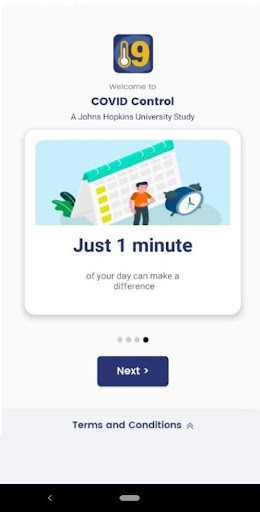  | 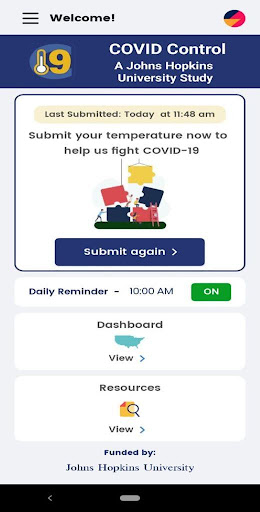  | 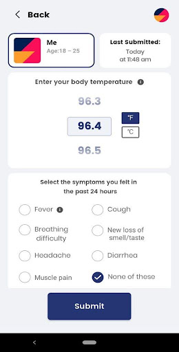  | 
 | 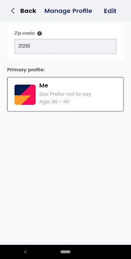 

## Development team
In the following we report the main information provided by the development team in the Google play store.

| | |
|-------------------------|-------------------------|
| **Developer**  | Johns Hopkins Technology Transfer |
| **Website**  | [https://covidcontrol.jhu.edu/](https://covidcontrol.jhu.edu/) |
| **Email** | contactcovidcontrol@jh.edu |
| **Physical address**  | - |
| **Other developed apps**  | [https://play.google.com/store/apps/developer?id=Johns+Hopkins+Technology+Transfer](https://play.google.com/store/apps/developer?id=Johns+Hopkins+Technology+Transfer) |

## Android support

| | |
|-------------------------|-------------------------|
| **Declared target Android version**  | Android10, version 10 (API level 29) |
| **Effective target Android version**  | Android10, version 10 (API level 29) |
| **Minimum supported Android version**  | Lollipop, version 5.0 (API level 21) |
| **Maximum target Android version**  | - |

The larger the difference between the minimum and maximum supported Android versions, the better. A larger difference means a wider audience. For example, old phones have a very low Android version, so a high minimum supported Android version means that the app cannot be used by users with old phones, thus leading to accessibility problems. 

## Requested permissions

In the following we report the complete list of the permissions requested by the app. 

| **Permission** | **Protection level** | **Description** | 
|-------------------------|-------------------------|-------------------------|
 **android.permission ACCESS_COARSE_LOCATION** | :warning:**Dangerous** | Allows an app to access approximate location. 
 **android.permission ACCESS_FINE_LOCATION** | :warning:**Dangerous** | Allows an app to access precise location. 
 **android.permission INTERNET** | Normal | Allows applications to open network sockets. 
 **android.permission RECEIVE_BOOT_COMPLETED** | Normal | Allows an application to receive the Intent.ACTION_BOOT_COMPLETED that is broadcast after the system finishes booting. 
 **android.permission VIBRATE** | Normal | Allows access to the vibrator. 
 **android.permission WAKE_LOCK** | Normal | Allows using PowerManager WakeLocks to keep processor from sleeping or screen from dimming. 

## Mentioned servers

| **Server** | **Registrant** | **Registrant country** | **Creation date** | 
|-------------------------|-------------------------|-------------------------|-------------------------|
 | google.com | Google LLC | :us: US | 1997-09-15 04:00:00 |
 | jhu.edu | Johns Hopkins University | - | 1987-03-19 00:00:00 |
 | azurewebsites.net | Microsoft Corporation | :us: US | 2012-01-24 18:43:51 |
 | googleapis.com | Google LLC | :us: US | 2005-01-25 17:52:26 |

## Security analysis 

Below we report the main security warnings raised by our execution of the [Androwarn](https://github.com/maaaaz/androwarn) security analysis tool.

**Connection interfaces exfiltration**
> - This application reads details about the currently active data network 
> - This application tries to find out if the currently active data network is metered 

**Suspicious connection establishment**
> - This application opens a Socket and connects it to the remote address '' on the 'N/A' port  
> - This application opens a Socket and connects it to the remote address 'Ljava/lang/StringBuilder;->toString()Ljava/lang/String;' on the 'N/A' port  
> - This application opens a Socket and connects it to the remote address 'Ljava/net/Proxy;->type()Ljava/net/Proxy$Type;' on the 'N/A' port  
> - This application opens a Socket and connects it to the remote address 'timeout' on the 'N/A' port  

## User ratings and reviews

Below we provide information about how end users are reacting to the app in terms of ratings and reviews in the Google Play store.

### Ratings

The COVID Control - A Johns Hopkins University Study app has been installed by more than **1000** times. At this time, **15** rated the app and its average score is **3.8666666**. Below we show the distribution of the ratings across the usual star-based rating of Google Play

:star::star::star::star::star:: 9

:star::star::star::star:: 2

:star::star::star:: 0

:star::star:: 1

:star:: 3

### Reviews 

#### 5-star reviews

No recent reviews available with 5 stars.

#### 4-star reviews

No recent reviews available with 4 stars.

#### 3-star reviews

No recent reviews available with 3 stars.

#### 2-star reviews

No recent reviews available with 2 stars.

#### 1-star reviews

No recent reviews available with 1 stars.

# CoronaMelder
App version ``1.3.0``

Analyzed with [covid-apps-observer](http://github.com/covid-apps-observer) project, version ``0.1``

## App overview
| | |
|-------------------------|-------------------------| 
| **Name**&nbsp;&nbsp;&nbsp;&nbsp;&nbsp;&nbsp;&nbsp;&nbsp;&nbsp;&nbsp;&nbsp;&nbsp;&nbsp;&nbsp;&nbsp;&nbsp;&nbsp;&nbsp;&nbsp;&nbsp;&nbsp;&nbsp;&nbsp;&nbsp;&nbsp;&nbsp;&nbsp;&nbsp;&nbsp;&nbsp;&nbsp;&nbsp;&nbsp;&nbsp;&nbsp;&nbsp;&nbsp;&nbsp;&nbsp;&nbsp;  | CoronaMelder |
| **Unique identifier** | nl.rijksoverheid.en |
| **Link to Google Play** | [https://play.google.com/store/apps/details?id=nl.rijksoverheid.en](https://play.google.com/store/apps/details?id=nl.rijksoverheid.en) |
| **Summary**  | Help de verspreiding van het coronavirus in Nederland te stoppen |
| **Privacy policy** | [https://coronamelder.nl/nl/privacy](https://coronamelder.nl/nl/privacy) |
| **Latest version** | 1.3.0 |
| **Last update** | 2021-03-23 09:28:00 |
| **Recent changes** | Dank je wel voor het gebruiken van CoronaMelder. Je helpt daarmee corona in Nederland te stoppen. Deze update bevat de functie om de app te pauzeren. Pauzeer de app alleen in situaties waarin je telefoon dicht bij telefoons van anderen komt, maar er geen kans op besmetting is. |
| **Installs**  | 1.000.000+ |
| **Category** | Medisch |
| **First release** | 10 aug. 2020 |
| **Size**  | 7,9M |
| **Supported Android version**  | 6.0 en hoger |

### Description
> CoronaMelder is de officiële corona notificatie-app van Nederland, ontwikkeld onder het toezicht van het Ministerie van Volksgezondheid, Welzijn en Sport. De app is een digitaal hulpmiddel bij het bron- en contactonderzoek door de GGD. 
 De app waarschuwt je nadat je in de buurt bent geweest van iemand met corona. Zo kun je jezelf en de mensen in je omgeving beschermen. En kunnen we samen het aantal besmettingen in Nederland zo laag mogelijk houden. Het gebruik van de app is vrijwillig. Niemand mag controleren of jij de app op je telefoon hebt. Maar hoe meer mensen de app gebruiken, hoe beter deze werkt. 
 Bij de ontwikkeling van deze app is rekening gehouden met toegankelijkheid, zie voor meer informatie onze toegankelijkheidsverklaring.
 Hoe werkt de app?
 # Je geeft alleen toegang tot je bluetoothgegevens
 CoronaMelder ziet via bluetooth wanneer je in de buurt bent van andere mensen met de app. De app gebruikt geen persoons- of locatiegegevens. De app weet dus niet wie je bent, waar je was en wie je hebt ontmoet.
 # Je krijgt een melding nadat je extra kans op besmetting hebt gelopen
 De app stuurt een melding als je minstens 15 minuten in de buurt bent geweest van iemand die later corona blijkt te hebben. Deze persoon moet ook de app gebruiken.
 # Je kunt anderen waarschuwen als je zelf besmet blijkt te zijn
 Ben je getest door de GGD en blijk je corona te hebben? Dan kun je samen met de GGD via de app een melding sturen naar de mensen bij wie je in de buurt bent geweest - in de periode dat je besmettelijk was. In deze melding staat alleen wanneer ze in de buurt zijn geweest van een besmet persoon. Niet wie of waar dit was.
 Hoe gaat de app met je gegevens om?
 • Je hoeft geen persoonsgegevens zoals je e-mailadres of naam in te voeren.
 • Als je iemand tegenkomt wisselen jullie telefoons via bluetooth willekeurige codes uit. Zo meet de app de duur en de afstand van het contact. In de codes staat niets over wie jullie zijn en waar jullie zijn geweest. 
 • De codes die je via bluetooth uitwisselt worden alleen op je telefoon bewaard en na 14 dagen verwijderd.
 • Gebruikers van de app zijn niet terug te vinden door de makers van de app, de overheid of andere gebruikers.

### User interface
The developers of the app provide the following screenshots in the Google play store.
| | | |
|:-------------------------:|:-------------------------:|:-------------------------:|
 |   |   |   | 
 |   |   |   | 

## Development team
In the following we report the main information provided by the development team in the Google play store.

| | |
|-------------------------|-------------------------|
| **Developer**  | Rijksoverheid |
| **Website**  | [https://coronamelder.nl/](https://coronamelder.nl/) |
| **Email** | helpdesk@coronamelder.nl |
| **Physical address**  | - |
| **Other developed apps**  | [https://play.google.com/store/apps/developer?id=Rijksoverheid](https://play.google.com/store/apps/developer?id=Rijksoverheid) |

## Android support

| | |
|-------------------------|-------------------------|
| **Declared target Android version**  | - |
| **Effective target Android version**  | - |
| **Minimum supported Android version**  | Marshmallow, version 6.0 (API level 23) |
| **Maximum target Android version**  | - |

The larger the difference between the minimum and maximum supported Android versions, the better. A larger difference means a wider audience. For example, old phones have a very low Android version, so a high minimum supported Android version means that the app cannot be used by users with old phones, thus leading to accessibility problems. 

## Requested permissions

In the following we report the complete list of the permissions requested by the app. 

| **Permission** | **Protection level** | **Description** | 
|-------------------------|-------------------------|-------------------------|
 **android.permission ACCESS_NETWORK_STATE** | Normal | Allows applications to access information about networks. 
 **android.permission BLUETOOTH** | Normal | Allows applications to connect to paired bluetooth devices. 
 **android.permission FOREGROUND_SERVICE** | Normal | Allows a regular application to use Service.startForeground. 
 **android.permission INTERNET** | Normal | Allows applications to open network sockets. 
 **android.permission RECEIVE_BOOT_COMPLETED** | Normal | Allows an application to receive the Intent.ACTION_BOOT_COMPLETED that is broadcast after the system finishes booting. 
 **android.permission REQUEST_IGNORE_BATTERY_OPTIMIZATIONS** | Normal | Permission an application must hold in order to use Settings.ACTION_REQUEST_IGNORE_BATTERY_OPTIMIZATIONS. 
 **android.permission WAKE_LOCK** | Normal | Allows using PowerManager WakeLocks to keep processor from sleeping or screen from dimming. 

## Mentioned servers

| **Server** | **Registrant** | **Registrant country** | **Creation date** | 
|-------------------------|-------------------------|-------------------------|-------------------------|
 | google.com | Google LLC | :us: US | 1997-09-15 04:00:00 |
 | coronamelder-dist.nl | - | - | 2020-07-20 00:00:00 |
 | coronamelder-api.nl | - | - | 2020-07-22 00:00:00 |

## Security analysis 

Below we report the main security warnings raised by our execution of the [Androwarn](https://github.com/maaaaz/androwarn) security analysis tool.

**Connection interfaces exfiltration**
> - This application reads details about the currently active data network 
> - This application tries to find out if the currently active data network is metered 

**Telephony services abuse**
> - This application makes phone calls 

**Suspicious connection establishment**
> - This application opens a Socket and connects it to the remote address '; port is out of range' on the 'N/A' port  
> - This application opens a Socket and connects it to the remote address 'Ljava/net/Proxy;->type()Ljava/net/Proxy$Type;' on the 'N/A' port  
> - This application opens a Socket and connects it to the remote address 'Lm/b/a/a/a;->H(Ljava/lang/String;)Ljava/lang/StringBuilder;' on the 'N/A' port  
> - This application opens a Socket and connects it to the remote address 'timeout' on the 'N/A' port  

**Pim data leakage**
> - This application accesses data stored in the clipboard 

## User ratings and reviews

Below we provide information about how end users are reacting to the app in terms of ratings and reviews in the Google Play store.

### Ratings

The CoronaMelder app has been installed by more than **1000000** times. At this time, **7750** rated the app and its average score is **3.0152285**. Below we show the distribution of the ratings across the usual star-based rating of Google Play

:star::star::star::star::star:: 2725

:star::star::star::star:: 796

:star::star::star:: 816

:star::star:: 698

:star:: 2715

### Reviews 

#### 5-star reviews

> Boeiend en gemakkelijk  :date: __2021-05-11 18:45:05__

> Staat altijd aan zonder ingewikkelde dingen  :date: __2021-05-10 22:04:31__

> Het is goed dan kunnen we elkaar helpen  :date: __2021-05-07 20:15:13__

> Niet  :date: __2021-05-07 11:19:36__

> Mijn vrouw en ik zijn al 2x gevaccineerd!(en geen bijwerkingen)  :date: __2021-05-06 10:38:13__

> Hoi hoi  :date: __2021-05-05 18:24:01__

> Vanaf begin de CoronaMelder in gebruik en ben er zeer blij mee. Ik heb gelukkig geen meldingen ontvangen. Ik houd mij dan ook erg goed aan de regels en dat zie je dus terug in (geen) meldingen.  :date: __2021-05-04 17:45:25__

> Perfect app. Maar zou eens willen nakijken of er wellicht, na de pauze van Afgelopen 2 dagen, iets niet goed gaat met het gebruik van Bluetooth? Want ik ervaar storingen na update van mijn android op Huawei P20 lite, en in het log komt het woord bluetooth veelvuldig voor en uw app is de enige actieve app die bluetooth vraagt.  :date: __2021-05-02 10:18:18__

> Bravo!!  :date: __2021-05-01 17:23:00__

> Vind erg veel beter waarschuwing ander  :date: __2021-04-30 16:26:26__

#### 4-star reviews

> Hoi ik weet niet of hij werk krijg nooit een melding binnen  :date: __2021-05-07 10:17:20__

> Deze app schakelt uit als je mobiel in de vliegtuig stand staat, althans bij mij. Je kan hem apart weer inschakelen maar dat moet je wel weten! Het stond niet bij de vragen, vandaar.  :date: __2021-05-05 20:42:30__

> Op 04-05 precies hetzelfde !! Niets aan de instellingen veranderd, laatste update, blue tooth en locatie staan aan. En toch de melding dat de app de laatste 24 uur niet kan controleren. ????????  :date: __2021-05-04 23:08:15__

> Zeer bevredigend.  :date: __2021-04-28 10:09:33__

> Ben een keer in contact geweest met iemand met corona, ik kreeg geen melding maar die persoon had wel coronamelder. maar verder is het een prima app! Ik raad iedereen aan om deze app te downloaden  :date: __2021-04-27 17:39:48__

> Optioneel.  :date: __2021-04-25 12:59:25__

> Goede ap dat je invormeerd  :date: __2021-04-23 18:04:24__

> Kreeg een melding ,dus laten testen .  :date: __2021-04-16 15:14:51__

> openstaan voor realiteit is moedig 💉🧘‍♂️  :date: __2021-04-16 10:49:39__

> onlangs alert ontvangen dat ik langer als 15 minuten contact heb gehad met iemand die besmet is......die gehele dag echter met NIEMAND (persoonlijk) contact gehad... 》》 mijn buurman kreeg die dag wél zijn uitslag PCR test....onze telefoons dus in elkaars BlueTooth bereik.  :date: __2021-04-15 15:03:13__

#### 3-star reviews

> Wanneer wordt in de app zichtbaar of je al gevaccineerd bent.? Of komt daar een andere app voor.?  :date: __2021-05-11 03:58:08__

> Het is erg zuipende app, ik gebruiken hem toch nauwelijks  :date: __2021-05-06 15:48:27__

> 6 dagen na contact met iemand die positief is krijg ik PAS een melding. Ook nog met de melding dat ik uit buurt moet bliiven van mensen met zwakke gezondheid. Beetje laat dat je melding dan krijgt.......  :date: __2021-05-04 15:09:56__

> Huis  :date: __2021-05-03 15:07:35__

> Nieuwe review... Krijg nu herhaaldelijk dat er geen verbinding is, terwijl ikzelf wel verbinding heb... waar ligt dat aan ? Mvg Jona Bras  :date: __2021-04-26 14:34:14__

> Google maakt misbruik van de situatie.  :date: __2021-04-26 13:52:14__

> Ik kreeg vorige week een melding dat ik bij iemand in de buurt was geweest die positief getest was. Bleek achteraf dat de besmette persoon gedurende de dag waarop we met elkaar in contact zouden zijn geweest, een verdieping lager dan mij heeft vergadert en ik hem dus totaal niet heb gezien. Het Bluetooth signaal was door het plafond heen gekomen. Als gevolg hiervan in quarantaine gezeten en getest.  :date: __2021-04-26 11:58:53__

> Ik heb nog geen meldingen ontvangen. Dat er bij mij iemand in de buurt besmet is met het virus. Dus ik hoop dat de app werkt...  :date: __2021-04-25 02:21:27__

> Ik krijg een dag later een melding dat ik in de buurt ben geweest van iemand die positief is getest, dat kan en moet sneller.  :date: __2021-04-21 06:53:59__

> Ik heb nu voor de 2e keer een melding gekregen van een besmetting van iemand waarbij ik 15 minuten dichtbij zou zijn geweest. Beide keren onmogelijk omdat ik het huis niet ben uit geweest op die dagen. Heel jammer dat de app deze "valse" meldingen geeft.  :date: __2021-04-17 11:22:22__

#### 2-star reviews

> Op dit moment drama Iedere dag een melding dat de app niet actief is  :date: __2021-05-11 20:42:16__

> Nooit melding gehad  :date: __2021-05-10 09:11:36__

> Valt elke keer uit en moet opnieuw opstarten  :date: __2021-05-08 09:16:12__

> De app al weken geleden geïnstalleerd, maar zo vaak zie ik dat hij niet actief blijkt te zijn. Dan klik ik weer op actief en toch vliegt ie later weer uit. Ik vraag me af of het überhaupt functioneel is om hem erop te hebben als hij het de helft van de tijd niet doet.  :date: __2021-05-06 13:42:01__

> Krijg regelmatig de melding, dat de app. niet ingeschakeld is, heel bijzonder. Er staat vaak een "1" bij app zijn icoontje, echter wat er dan aan de hand is? Je komt er nooit achter, erg irritant, zo'n melding.  :date: __2021-05-05 20:04:23__

> Krijg regelmatig een bericht dat de app niet heeft kunnen controleren.  :date: __2021-05-03 21:19:36__

> Oke mijn dochter kreeg een melding. Thuis quarantaine, testen en daarna negatief weer naar buiten. Nou krijgt ze vandaag weer een melding voor de dag dat ze met mij is wezen testen verder alleen maar thuis zonder visite. Hoe dan???🤷🏼‍♀️ Deze melding kan niet kloppen ze is met niemand in aanraking geweest of het moet de persoon zijn die de test deed.  :date: __2021-05-01 20:21:14__

> I.v.m.reizen heb ik naast deze NL app, ook de corona app van de Franse overheid. Deze laatste app geeft veel meer (actuele) informatie, ook op lokaal niveau. De NL corona app heeft onvoldoende toegevoegde waarde. Gemiste kans!  :date: __2021-05-01 20:10:30__

> Op 21/4 krijg ik een melding mogelijk op 2o/4 contact te hebben gehad met een besmet persoon. Hebme 2x laten testen. Nu 1/5 krijg ik dezelfde melding opnieuw.  :date: __2021-05-01 20:10:05__

> Nog steeds zijn er privacy problemen met de app, heel erg slecht dat het nog steeds niet is opgelost. Heb uiteindelijk besloten om de app te verwijderen ook omdat er geen collega's en andere in mijn buurt de corona melder gebruiken. Hou mij aan de afstand.  :date: __2021-04-28 21:03:13__

#### 1-star reviews

> Ik was met iemand in aanraking geweest maar dat was niet zo ik was de hele week wel thuis dus gelijk verwijderd  :date: __2021-05-12 21:52:58__

> Krijg iedere keer de melding dat hij het niet doet  :date: __2021-05-11 18:59:22__

> Ik ben een wappie  :date: __2021-05-10 19:51:57__

> Nog nooit een melding gekregen, zelf niet nu mijn thuiswonende dochter met app positief is getest!  :date: __2021-05-10 08:35:02__

> Hij gaat iedere keer uit!  :date: __2021-05-09 12:41:28__

> Verschillende keren ervaren dat hij niet werkt.  :date: __2021-05-09 08:36:24__

> Slecht!!+  :date: __2021-05-08 15:50:30__

> Hij doet het al bijna 2 weken niet meer... Wat een slechte zaak dit. Geeft elke dag de melding dat hij niet werkt en openen kan je hem niet. Nog steeds geen update helaas. Ik verwijder hem weer  :date: __2021-05-07 08:04:20__

> Niet geoptimaliseerd, wil dingen die ik niet il  :date: __2021-05-06 15:25:33__

> Alle dagen moet ik de app opnieuw activeren, vandaag of morgen verwijder ik. Heeft zo geen zin, het principe is mooi maar het moet wel werkem  :date: __2021-05-05 20:05:04__

# Credits

This project makes use of the following main third-party projects:
* Androguard: [https://github.com/androguard/androguard](https://github.com/androguard/androguard)
* Androwarn: [https://github.com/maaaaz/androwarn](https://github.com/maaaaz/androwarn)
* google_play_scraper: [https://github.com/JoMingyu/google-play-scraper](https://github.com/JoMingyu/google-play-scraper)
* whois: [https://github.com/DannyCork/python-whois](https://github.com/DannyCork/python-whois)
* BeautifulSoup: [https://www.crummy.com/software/BeautifulSoup](https://www.crummy.com/software/BeautifulSoup)

Other open-source projects used in this project include: 

- androguard==3.3.5
- appnope==0.1.0
- asn1crypto==1.3.0
- backcall==0.1.0
- beautifulsoup4==4.9.0
- bs4==0.0.1
- certifi==2020.4.5.1
- cffi==1.14.0
- chardet==3.0.4
- click==7.1.2
- colorama==0.4.3
- cryptography==2.9.2
- cycler==0.10.0
- decorator==4.4.2
- future==0.18.2
- google-play-scraper==0.1.1
- idna==2.9
- ipython==7.13.0
- ipython-genutils==0.2.0
- jedi==0.17.0
- Jinja2==2.11.2
- joblib==0.14.1
- kiwisolver==1.2.0
- lxml==4.5.0
- MarkupSafe==1.1.1
- matplotlib==3.2.1
- networkx==2.4
- nltk==3.5
- numpy==1.18.3
- parso==0.7.0
- pexpect==4.8.0
- pickleshare==0.7.5
- Pillow==7.1.2
- play-scraper==0.6.0
- prompt-toolkit==3.0.5
- ptyprocess==0.6.0
- pycountry==19.8.18
- pycparser==2.20
- pydot==1.4.1
- Pygments==2.6.1
- pyOpenSSL==19.1.0
- pyparsing==2.4.7
- python-dateutil==2.8.1
- regex==2020.4.4
- requests==2.23.0
- requests-futures==1.0.0
- six==1.14.0
- soupsieve==2.0
- tld==0.12.1
- tqdm==4.45.0
- traitlets==4.3.3
- urllib3==1.25.9
- wcwidth==0.1.9
- wordcloud==1.7.0

