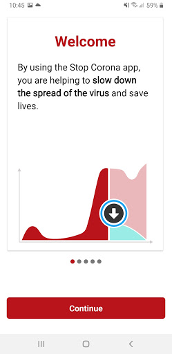
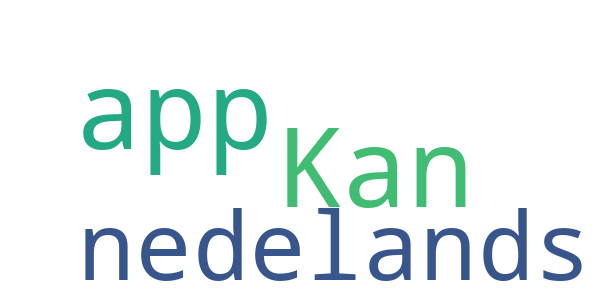
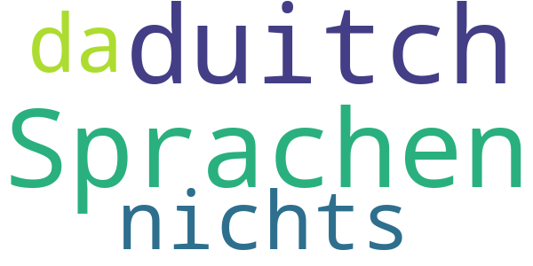

# Stopp Corona
App version ``2.1.0.1179-QA_259``

Analyzed with [covid-apps-observer](http://github.com/covid-apps-observer) project, version ``0.1``

## App overview
| | |
|-------------------------|-------------------------| 
| **Name**&nbsp;&nbsp;&nbsp;&nbsp;&nbsp;&nbsp;&nbsp;&nbsp;&nbsp;&nbsp;&nbsp;&nbsp;&nbsp;&nbsp;&nbsp;&nbsp;&nbsp;&nbsp;&nbsp;&nbsp;&nbsp;&nbsp;&nbsp;&nbsp;&nbsp;&nbsp;&nbsp;&nbsp;&nbsp;&nbsp;&nbsp;&nbsp;&nbsp;&nbsp;&nbsp;&nbsp;&nbsp;&nbsp;&nbsp;&nbsp;  | Stopp Corona |
| **Unique identifier** | at.roteskreuz.stopcorona |
| **Link to Google Play** | [https://play.google.com/store/apps/details?id=at.roteskreuz.stopcorona](https://play.google.com/store/apps/details?id=at.roteskreuz.stopcorona) |
| **Summary**  | De Corona-waarschuwing-app van Oostenrijk |
| **Privacy policy** | [https://www.roteskreuz.at/site/faq-app-stopp-corona/datenschutzinformation-zur-stopp-corona-app/](https://www.roteskreuz.at/site/faq-app-stopp-corona/datenschutzinformation-zur-stopp-corona-app/) |
| **Latest version** | 2.1.0.1179-QA_259 |
| **Last update** | 2021-01-29 15:49:49 |
| **Recent changes** | We´re keeping it up to date for you:  With this update we strengthen our international bonds with other European countries and share our keys with them. You can now send and receive warnings for infections to and from other European tracing apps. We value your data privacy, so all transmission is encrypted and anonymized. Read more about how we value your privacy in our FAQs.   Let´s continue to Stopp Corona together! |
| **Installs**  | 100.000+ |
| **Category** | Medisch |
| **First release** | 25 jun. 2020 |
| **Size**  | 6,2M |
| **Supported Android version**  | 6.0 en hoger |

### Description
> The Austrian Red Cross publishes the “Stopp Corona” app on behalf of the Federal Ministry of Health as the responsible authority of the Austrian Federal Government.
 „Stopp Corona“ helps you to keep track of encounters with friends, family or co-workers and save them anonymously. Should you contract the corona virus all your encounters of the last two days will be informed automatically and anonymously. 
 You too will be notified instantly and anonymously should one of your saved encounters report to have contracted the virus. Helping all of you to take appropriate measures such as.
  
 - Keep a safe distance (1–2 meters) from others
 - Avoid social contacts
 - Self-quarantine as a precaution 
  
 Together we can break the chain of infection. Not only by protecting ourselves, but also by preventing others from being infected. 
  
 Say hello with a digital handshake
  
 It will definitely be a while before we’ll actually shake each others hands again. In the meantime: use “Stopp Corona”s digital handshake. 
 If you and the person you encounter have installed Stopp Corona the app will anonymously save your meeting. Should one of you fall sick with the corona virus the other will receive an instant notification. 
  
  
 Self-check your corona status
  
 How are you feeling today? Just answer the clinically proven questionnaire to check yourself for corona symptoms daily. 
  
 Report suspected infections
  
 Should your symptoms match those of a corona infection, you can choose to inform your encounters. This is extremely important so stop the virus from spreading. Everyone you saved in the last two days will get an anonymous notification. So don’t you worry: your personal data is safe with us. 
  
 If you suspect to have contracted the corona virus, please stay at home and contact your attending physician via telephone. If that is not possible, call the Corona-Hotline 1450. Please do not visit your doctors office or a hospital in person!
  
 Medical confirmation
  
 If you are officially tested for the corona virus and your test comes back positive, please notify your encounters immediately. Of course the notification will also be anonymous. 
  
 This app was developed in cooperation with the UNIQA foundation. 
  
 App concept and implementation was created with the support of Accenture Austria. 
 The Stopp Corona App is based on the Google/Apple Framework. 
  
 Care for you. Care for me. That’s how we protect ourselves. 
 Open Source Software Project: https://github.com/austrianredcross/stopp-corona-android

### User interface
The developers of the app provide the following screenshots in the Google play store.
| | | |
|:-------------------------:|:-------------------------:|:-------------------------:|
 |   |   |   | 
 |   |   |   | 
 |   |  

## Development team
In the following we report the main information provided by the development team in the Google play store.

| | |
|-------------------------|-------------------------|
| **Developer**  | Österreichisches Rotes Kreuz |
| **Website**  | [https://www.roteskreuz.at](https://www.roteskreuz.at) |
| **Email** | service@roteskreuz.at |
| **Physical address**  | [Wiedner Hauptstrasse 32 1040 Wien Österreich](https://www.google.com/maps/search/Wiedner%20Hauptstrasse%2032%201040%20Wien%20Österreich) (Google Maps) |
| **Other developed apps**  | [https://play.google.com/store/apps/developer?id=%C3%96sterreichisches+Rotes+Kreuz](https://play.google.com/store/apps/developer?id=%C3%96sterreichisches+Rotes+Kreuz) |

## Android support

| | |
|-------------------------|-------------------------|
| **Declared target Android version**  | Android10, version 10 (API level 29) |
| **Effective target Android version**  | Android10, version 10 (API level 29) |
| **Minimum supported Android version**  | Marshmallow, version 6.0 (API level 23) |
| **Maximum target Android version**  | - |

The larger the difference between the minimum and maximum supported Android versions, the better. A larger difference means a wider audience. For example, old phones have a very low Android version, so a high minimum supported Android version means that the app cannot be used by users with old phones, thus leading to accessibility problems. 

## Requested permissions

In the following we report the complete list of the permissions requested by the app. 

| **Permission** | **Protection level** | **Description** | 
|-------------------------|-------------------------|-------------------------|
 **android.permission ACCESS_NETWORK_STATE** | Normal | Allows applications to access information about networks. 
 **android.permission BLUETOOTH** | Normal | Allows applications to connect to paired bluetooth devices. 
 **android.permission FOREGROUND_SERVICE** | Normal | Allows a regular application to use Service.startForeground. 
 **android.permission INTERNET** | Normal | Allows applications to open network sockets. 
 **android.permission RECEIVE_BOOT_COMPLETED** | Normal | Allows an application to receive the Intent.ACTION_BOOT_COMPLETED that is broadcast after the system finishes booting. 
 **android.permission REQUEST_IGNORE_BATTERY_OPTIMIZATIONS** | Normal | Permission an application must hold in order to use Settings.ACTION_REQUEST_IGNORE_BATTERY_OPTIMIZATIONS. 
 **android.permission WAKE_LOCK** | Normal | Allows using PowerManager WakeLocks to keep processor from sleeping or screen from dimming. 

## Mentioned servers

| **Server** | **Registrant** | **Registrant country** | **Creation date** | 
|-------------------------|-------------------------|-------------------------|-------------------------|
 | google.com | Google LLC | :us: US | 1997-09-15 04:00:00 |
 | prod-rca-coronaapp-fd.net | Domains By Proxy, LLC | :us: US | 2020-04-20 20:16:19 |

## Security analysis 

Below we report the main security warnings raised by our execution of the [Androwarn](https://github.com/maaaaz/androwarn) security analysis tool.

**Connection interfaces exfiltration**
> - This application reads details about the currently active data network 
> - This application tries to find out if the currently active data network is metered 

**Telephony services abuse**
> - This application makes phone calls 

**Suspicious connection establishment**
> - This application opens a Socket and connects it to the remote address '; port is out of range' on the 'N/A' port  
> - This application opens a Socket and connects it to the remote address 'Lcom/android/tools/r8/GeneratedOutlineSupport;->outline17(Ljava/lang/String;)Ljava/lang/StringBuilder;' on the 'N/A' port  
> - This application opens a Socket and connects it to the remote address 'Ljava/net/Proxy;->type()Ljava/net/Proxy$Type;' on the 'N/A' port  
> - This application opens a Socket and connects it to the remote address 'timeout' on the 'N/A' port  

## User ratings and reviews

Below we provide information about how end users are reacting to the app in terms of ratings and reviews in the Google Play store.

### Ratings

The Stopp Corona app has been installed by more than **100000** times. At this time, **3559** rated the app and its average score is **3.189415**. Below we show the distribution of the ratings across the usual star-based rating of Google Play

:star::star::star::star::star:: 1448

:star::star::star::star:: 337

:star::star::star:: 376

:star::star:: 238

:star:: 1160

### Reviews 

#### 5-star reviews

> Kan de app ook in het nedelands  :date: __2020-08-18 22:41:38__

#### 4-star reviews

No recent reviews available with 4 stars.

#### 3-star reviews

No recent reviews available with 3 stars.

#### 2-star reviews

> Sprachen duitch nichts da  :date: __2020-09-22 12:29:59__

#### 1-star reviews

No recent reviews available with 1 stars.
