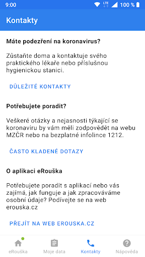

# eRouška – součást chytré karantény
App version ``1.0.440``

Analyzed with [covid-apps-observer](http://github.com/covid-apps-observer) project, version ``0.1``

## App overview
| | |
|-------------------------|-------------------------| 
| **Name**&nbsp;&nbsp;&nbsp;&nbsp;&nbsp;&nbsp;&nbsp;&nbsp;&nbsp;&nbsp;&nbsp;&nbsp;&nbsp;&nbsp;&nbsp;&nbsp;&nbsp;&nbsp;&nbsp;&nbsp;&nbsp;&nbsp;&nbsp;&nbsp;&nbsp;&nbsp;&nbsp;&nbsp;&nbsp;&nbsp;&nbsp;&nbsp;&nbsp;&nbsp;&nbsp;&nbsp;&nbsp;&nbsp;&nbsp;&nbsp;  | eRouška – součást chytré karantény |
| **Unique identifier** | cz.covid19cz.erouska |
| **Link to Google Play** | [https://play.google.com/store/apps/details?id=cz.covid19cz.erouska](https://play.google.com/store/apps/details?id=cz.covid19cz.erouska) |
| **Summary**  | Dankzij eRouche beschermt u uzelf en anderen in uw omgeving |
| **Privacy policy** | [https://erouska.cz/gdpr](https://erouska.cz/gdpr) |
| **Latest version** | 1.0.440 |
| **Last update** | 2020-07-26 10:59:03 |
| **Recent changes** | Odebrání linky 1212 |
| **Installs**  | 100.000+ |
| **Category** | Gezondheid en fitness |
| **First release** | 10 apr. 2020 |
| **Size**  | 4,0M |
| **Supported Android version**  | 5.0 en hoger |

### Description
> Aplikace eRouška si díky Bluetooth pamatuje ostatní eRoušky, které jste potkali. Usnadní tak pracovníkům hygienické stanice dohledávání rizikových kontaktů.
 Přispějte i vy k tomu, aby nakažených koronavirem přibývalo méně.
 <b>Když jste nakaženého potkali:</b>
 Když potkáte někoho, u koho se později prokáže koronavirus, hygienická stanice vás bude moci telefonicky kontaktovat. I když jste spolu třeba jen stáli ve frontě v obchodě.
 <b>Když se nakazíte vy:</b>
 Pokud se u vás koronavirus prokáže, pracovník hygienické stanice  vás požádá o přehled lidí, které jste v posledních dnech potkali. Vy mu jednoduše na jeden klik odešlete anonymní seznam uživatelů eRoušky, se kterými jste byli v rizikovém kontaktu. Včetně těch, které osobně neznáte, jen jste s nimi třeba jeli autobusem. 
 Nikdo se nedozví, že jste je mohl nakazit zrovna vy. Více na webu erouska.cz

### User interface
The developers of the app provide the following screenshots in the Google play store.
| | | |
|:-------------------------:|:-------------------------:|:-------------------------:|
 |   |   |   | 
 |   |   |   | 
 |  

## Development team
In the following we report the main information provided by the development team in the Google play store.

| | |
|-------------------------|-------------------------|
| **Developer**  | Ministerstvo zdravotnictví České republiky |
| **Website**  | [https://erouska.cz](https://erouska.cz) |
| **Email** | info@erouska.cz |
| **Physical address**  | [Palackého náměstí 375/4 128 01 Praha 2 Česká republika](https://www.google.com/maps/search/Palackého%20náměstí%20375/4%20128%2001%20Praha%202%20Česká%20republika) (Google Maps) |
| **Other developed apps**  | [https://play.google.com/store/apps/developer?id=Ministerstvo+zdravotnictv%C3%AD+%C4%8Cesk%C3%A9+republiky](https://play.google.com/store/apps/developer?id=Ministerstvo+zdravotnictv%C3%AD+%C4%8Cesk%C3%A9+republiky) |

## Android support

| | |
|-------------------------|-------------------------|
| **Declared target Android version**  | Android10, version 10 (API level 29) |
| **Effective target Android version**  | Android10, version 10 (API level 29) |
| **Minimum supported Android version**  | Lollipop, version 5.0 (API level 21) |
| **Maximum target Android version**  | - |

The larger the difference between the minimum and maximum supported Android versions, the better. A larger difference means a wider audience. For example, old phones have a very low Android version, so a high minimum supported Android version means that the app cannot be used by users with old phones, thus leading to accessibility problems. 

## Requested permissions

In the following we report the complete list of the permissions requested by the app. 

| **Permission** | **Protection level** | **Description** | 
|-------------------------|-------------------------|-------------------------|
 **android.permission ACCESS_COARSE_LOCATION** | :warning:**Dangerous** | Allows an app to access approximate location. 
 **android.permission ACCESS_FINE_LOCATION** | :warning:**Dangerous** | Allows an app to access precise location. 
 **android.permission ACCESS_NETWORK_STATE** | Normal | Allows applications to access information about networks. 
 **android.permission BLUETOOTH** | Normal | Allows applications to connect to paired bluetooth devices. 
 **android.permission BLUETOOTH_ADMIN** | Normal | Allows applications to discover and pair bluetooth devices. 
 **android.permission FOREGROUND_SERVICE** | Normal | Allows a regular application to use Service.startForeground. 
 **android.permission INTERNET** | Normal | Allows applications to open network sockets. 
 **android.permission RECEIVE_BOOT_COMPLETED** | Normal | Allows an application to receive the Intent.ACTION_BOOT_COMPLETED that is broadcast after the system finishes booting. 
 **android.permission WAKE_LOCK** | Normal | Allows using PowerManager WakeLocks to keep processor from sleeping or screen from dimming. 
 **com.google.android.c2dm.permission RECEIVE** | - | - 

## Mentioned servers

| **Server** | **Registrant** | **Registrant country** | **Creation date** | 
|-------------------------|-------------------------|-------------------------|-------------------------|
 | google.com | Google LLC | :us: US | 1997-09-15 04:00:00 |
 | googleapis.com | Google LLC | :us: US | 2005-01-25 17:52:26 |
 | googleapis.com | Google LLC | :us: US | 2005-01-25 17:52:26 |
 | crashlytics.com | Google LLC | :us: US | 2011-01-21 15:30:40 |

## Security analysis 

Below we report the main security warnings raised by our execution of the [Androwarn](https://github.com/maaaaz/androwarn) security analysis tool.

**Connection interfaces exfiltration**
> - This application reads details about the currently active data network 

**Suspicious connection establishment**
> - This application opens a Socket and connects it to the remote address '' on the 'N/A' port  
> - This application opens a Socket and connects it to the remote address 'Ljava/lang/StringBuilder;->toString()Ljava/lang/String;' on the 'N/A' port  
> - This application opens a Socket and connects it to the remote address 'Ljava/net/Proxy;->type()Ljava/net/Proxy$Type;' on the 'N/A' port  
> - This application opens a Socket and connects it to the remote address 'Network subsystem is unavailable' on the 'N/A' port  
> - This application opens a Socket and connects it to the remote address 'timeout' on the 'N/A' port  

## User ratings and reviews

Below we provide information about how end users are reacting to the app in terms of ratings and reviews in the Google Play store.

### Ratings

The eRouška – součást chytré karantény app has been installed by more than **100000** times. At this time, **1964** rated the app and its average score is **3.6564102**. Below we show the distribution of the ratings across the usual star-based rating of Google Play

:star::star::star::star::star:: 976

:star::star::star::star:: 241

:star::star::star:: 241

:star::star:: 100

:star:: 402

### Reviews 

#### 5-star reviews

No recent reviews available with 5 stars.

#### 4-star reviews

No recent reviews available with 4 stars.

#### 3-star reviews

No recent reviews available with 3 stars.

#### 2-star reviews

No recent reviews available with 2 stars.

#### 1-star reviews

No recent reviews available with 1 stars.
