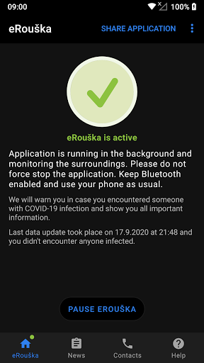

# eRouška - Part of Smart Quarantine
App version ``2.1.604``

Analyzed with [covid-apps-observer](http://github.com/covid-apps-observer) project, version ``0.1``

## App overview
| | |
|-------------------------|-------------------------| 
| **Name**&nbsp;&nbsp;&nbsp;&nbsp;&nbsp;&nbsp;&nbsp;&nbsp;&nbsp;&nbsp;&nbsp;&nbsp;&nbsp;&nbsp;&nbsp;&nbsp;&nbsp;&nbsp;&nbsp;&nbsp;&nbsp;&nbsp;&nbsp;&nbsp;&nbsp;&nbsp;&nbsp;&nbsp;&nbsp;&nbsp;&nbsp;&nbsp;&nbsp;&nbsp;&nbsp;&nbsp;&nbsp;&nbsp;&nbsp;&nbsp;  | eRouška - Part of Smart Quarantine |
| **Unique identifier** | cz.covid19cz.erouska |
| **Link to Google Play** | [https://play.google.com/store/apps/details?id=cz.covid19cz.erouska](https://play.google.com/store/apps/details?id=cz.covid19cz.erouska) |
| **Summary**  | Dankzij eRouška houd je jezelf en anderen in de buurt veilig |
| **Privacy policy** | [https://erouska.cz/gdpr](https://erouska.cz/gdpr) |
| **Latest version** | 2.1.604 |
| **Last update** | 2020-10-15 09:29:04 |
| **Recent changes** | This update brings more reliable notifications about risky contact. You should see more concrete error messages when the app activation or sending data fails. |
| **Installs**  | 500.000+ |
| **Category** | Gezondheid en fitness |
| **First release** | 10 apr. 2020 |
| **Size**  | 5,2M |
| **Supported Android version**  | 6.0 en hoger |

### Description
> Protect yourself, protect others. eRouska remembers other eRouska apps you have met. When a user is infected, he/she can easily and anonymously notify others about the risk of infection.
 eRouska is the official exposure notification app of Czech Republic, developed by the Ministry of Health in collaboration with NAKIT (National Agency for Information and Communication Technology). In the fight against the COVID-19 epidemic, the app aims to notify users, who are at risk of carrying the virus. Based on the history of exposure to other potentially contagious users, the app gives instructions, how to proceed to minimize spread of the epidemic. However, the app is not a medical device and is certainly not a substitute for a doctor.
 The app is based on Bluetooth Low Energy technology, which is designed to be especially energy-efficient, and it doesn’t collect any geolocation data, including GPS data. The app is developed and released in full compliance with Exposure Notification API Policy requirements, fully GDPR compliant and doesn't collect and directly process any personal data - any data that would identify the user or his mobile device, such as their name, address or telephone number. eRouska is able to determine that contact has taken place between two users without knowing who those users are and where the contact occurred.
 The app is a part of Czech Smart Quarantine concept and a valuable tool in the fight against COVID-19 epidemic. Every single user increases its overall effectiveness. It is strongly recommended to install the app and encourage others to do likewise.

### User interface
The developers of the app provide the following screenshots in the Google play store.
| | | |
|:-------------------------:|:-------------------------:|:-------------------------:|
 |   |   |   | 
 |   |   |   | 

## Development team
In the following we report the main information provided by the development team in the Google play store.

| | |
|-------------------------|-------------------------|
| **Developer**  | Ministerstvo zdravotnictví České republiky |
| **Website**  | [https://erouska.cz](https://erouska.cz) |
| **Email** | info@erouska.cz |
| **Physical address**  | [Palackého náměstí 375/4 128 01 Praha 2 Česká republika](https://www.google.com/maps/search/Palackého%20náměstí%20375/4%20128%2001%20Praha%202%20Česká%20republika) (Google Maps) |
| **Other developed apps**  | [https://play.google.com/store/apps/developer?id=6973241785916756870](https://play.google.com/store/apps/developer?id=6973241785916756870) |

## Android support

| | |
|-------------------------|-------------------------|
| **Declared target Android version**  | Android10, version 10 (API level 29) |
| **Effective target Android version**  | Android10, version 10 (API level 29) |
| **Minimum supported Android version**  | Marshmallow, version 6.0 (API level 23) |
| **Maximum target Android version**  | - |

The larger the difference between the minimum and maximum supported Android versions, the better. A larger difference means a wider audience. For example, old phones have a very low Android version, so a high minimum supported Android version means that the app cannot be used by users with old phones, thus leading to accessibility problems. 

## Requested permissions

In the following we report the complete list of the permissions requested by the app. 

| **Permission** | **Protection level** | **Description** | 
|-------------------------|-------------------------|-------------------------|
 **android.permission ACCESS_NETWORK_STATE** | Normal | Allows applications to access information about networks. 
 **android.permission BLUETOOTH** | Normal | Allows applications to connect to paired bluetooth devices. 
 **android.permission FOREGROUND_SERVICE** | Normal | Allows a regular application to use Service.startForeground. 
 **android.permission INTERNET** | Normal | Allows applications to open network sockets. 
 **android.permission RECEIVE_BOOT_COMPLETED** | Normal | Allows an application to receive the Intent.ACTION_BOOT_COMPLETED that is broadcast after the system finishes booting. 
 **android.permission WAKE_LOCK** | Normal | Allows using PowerManager WakeLocks to keep processor from sleeping or screen from dimming. 
 **com.google.android.c2dm.permission RECEIVE** | - | - 
 **com.google.android.finsky.permission BIND_GET_INSTALL_REFERRER_SERVICE** | - | - 

## Mentioned servers

| **Server** | **Registrant** | **Registrant country** | **Creation date** | 
|-------------------------|-------------------------|-------------------------|-------------------------|
 | googlesyndication.com | Google LLC | :us: US | 2003-01-21 06:17:24 |
 | google.com | Google LLC | :us: US | 1997-09-15 04:00:00 |
 | app-measurement.com | Google LLC | :us: US | 2015-06-19 20:13:31 |
 | googleapis.com | Google LLC | :us: US | 2005-01-25 17:52:26 |
 | crashlytics.com | Google LLC | :us: US | 2011-01-21 15:30:40 |
 | googleadservices.com | Google LLC | :us: US | 2003-06-19 16:34:53 |
 | erouska.cz | PATRICK_ZANDL | - | 2020-03-18 17:41:18 |

## Security analysis 

Below we report the main security warnings raised by our execution of the [Androwarn](https://github.com/maaaaz/androwarn) security analysis tool.

**Connection interfaces exfiltration**
> - This application reads details about the currently active data network 
> - This application tries to find out if the currently active data network is metered 

**Suspicious connection establishment**
> - This application opens a Socket and connects it to the remote address ' returned no addresses for  ; port is out of range' on the 'N/A' port  
> - This application opens a Socket and connects it to the remote address '' on the 'N/A' port  
> - This application opens a Socket and connects it to the remote address 'Ljava/net/Proxy;->type()Ljava/net/Proxy$Type;' on the 'N/A' port  
> - This application opens a Socket and connects it to the remote address 'timeout' on the 'N/A' port  

## User ratings and reviews

Below we provide information about how end users are reacting to the app in terms of ratings and reviews in the Google Play store.

### Ratings

The eRouška - Part of Smart Quarantine app has been installed by more than **500000** times. At this time, **4944** rated the app and its average score is **3.728669**. Below we show the distribution of the ratings across the usual star-based rating of Google Play

:star::star::star::star::star:: 2617

:star::star::star::star:: 624

:star::star::star:: 455

:star::star:: 244

:star:: 1004

### Reviews 

#### 5-star reviews

No recent reviews available with 5 stars.

#### 4-star reviews

No recent reviews available with 4 stars.

#### 3-star reviews

No recent reviews available with 3 stars.

#### 2-star reviews

No recent reviews available with 2 stars.

#### 1-star reviews

No recent reviews available with 1 stars.
