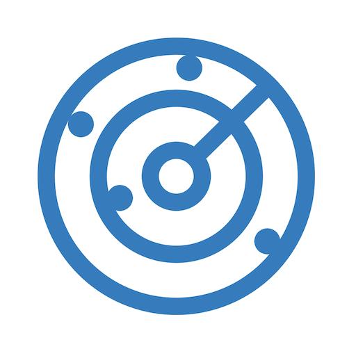
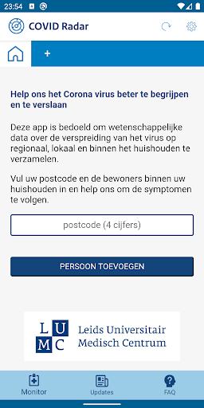
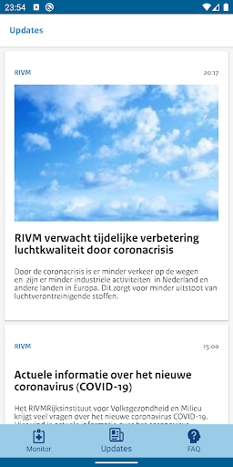
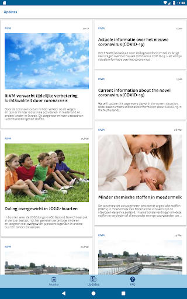
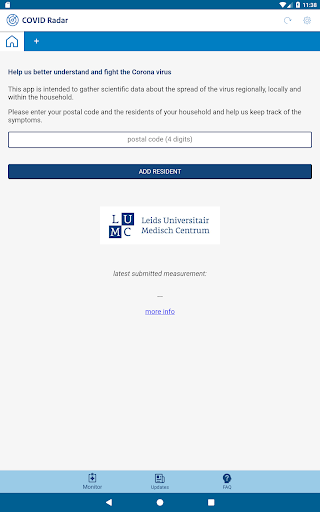
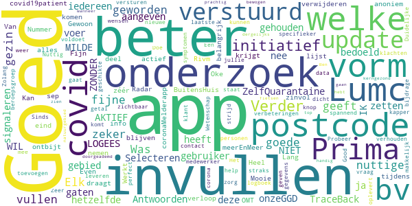
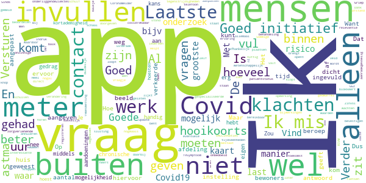
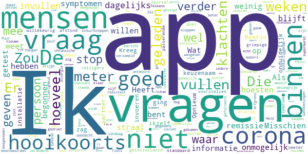
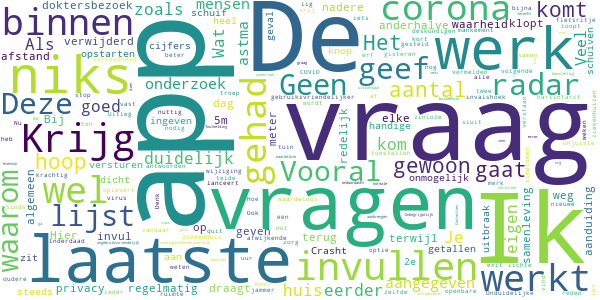

# COVID Radar
App version ``1.1.2``

Analyzed with [covid-apps-observer](http://github.com/covid-apps-observer) project, version ``0.1``

## App overview
| | |
|-------------------------|-------------------------| 
| **Name**&nbsp;&nbsp;&nbsp;&nbsp;&nbsp;&nbsp;&nbsp;&nbsp;&nbsp;&nbsp;&nbsp;&nbsp;&nbsp;&nbsp;&nbsp;&nbsp;&nbsp;&nbsp;&nbsp;&nbsp;&nbsp;&nbsp;&nbsp;&nbsp;&nbsp;&nbsp;&nbsp;&nbsp;&nbsp;&nbsp;&nbsp;&nbsp;&nbsp;&nbsp;&nbsp;&nbsp;&nbsp;&nbsp;&nbsp;&nbsp;  | COVID Radar |
| **Unique identifier** | nl.lumc.covidradar |
| **Link to Google Play** | [https://play.google.com/store/apps/details?id=nl.lumc.covidradar](https://play.google.com/store/apps/details?id=nl.lumc.covidradar) |
| **Summary**  | LUMC verzamelt gegevens voor onderzoek voor het bestrijden van het coronavirus. |
| **Privacy policy** | [https://www.lumc.nl/12367/Deelnemers-wetenschappelijk-onderzoek/](https://www.lumc.nl/12367/Deelnemers-wetenschappelijk-onderzoek/) |
| **Latest version** | 1.1.2 |
| **Last update** | 2020-04-08 18:17:26 |
| **Recent changes** | Kleine verbeteringen naar aanleiding van uw feedback |
| **Installs**  | 50.000+ |
| **Category** | Medisch |
| **First release** | 27 mrt. 2020 |
| **Size**  | 5,5M |
| **Supported Android version**  | 6.0 en hoger |

### Description
> Met deze app verzamelen we gegevens van Nederlanders voor wetenschappelijk onderzoek naar het bestrijden van het coronavirus (COVID-19). We willen beter kunnen gaan voorspellen welke zorgbehoefte er in Nederland straks is: hoeveel corona-patiënten verwachten we waar en wanneer? 
 Dit is een app van het Leids Universitair Medisch Centrum (LUMC). Alle gegevens worden anoniem verwerkt. De geanonimiseerde gegevens worden veilig opgeslagen in Nederland. Lees hierover meer in de disclaimer. 
 In Nederland testen we beperkt of mensen het coronavirus hebben. We testen iemand alleen als hij/zij symptomen heeft en tot een kwetsbare doelgroep behoort. Hierdoor weten we niet precies hoeveel mensen in Nederland besmet zijn met het virus. 
 Door van zoveel mogelijk mensen in Nederland gegevens te verzamelen, kunnen we onderzoeken hoeveel mensen het coronavirus hebben (gehad) en waar zij in Nederland verblijven.
 Met deze gegevens proberen we de toekomstige zorgvraag te voorspellen: hoeveel coronapatiënten verwachten we waar en wanneer? 
 Uw bijdrage aan dit onderzoek is erg belangrijk om de behoefte aan zorg te kunnen voorspellen. 
 Help mee! Samen tegen het coronavirus in Nederland!
 Deze app is een initiatief van het Leids Universitair Medisch Centrum (LUMC), gesteund door het Landelijk Netwerk Acute Zorg (LNAZ).
 Installeer de app en deel regelmatig gegevens over uw fysieke gesteldheid en die van uw huisgenoten voor wetenschappelijk onderzoek. Stimuleer familie, vrienden, kennissen en collega’s om hetzelfde te doen. Samen tegen het coronavirus in Nederland!

### User interface
The developers of the app provide the following screenshots in the Google play store.
| | | |
|:-------------------------:|:-------------------------:|:-------------------------:|
 |   |   |   | 
 |   |   |   | 
 |   |   |   | 
 |  

## Development team
In the following we report the main information provided by the development team in the Google play store.

| | |
|-------------------------|-------------------------|
| **Developer**  | LUMC Leiden |
| **Website**  | [https://www.lumc.nl](https://www.lumc.nl) |
| **Email** | covidradar@lumc.nl |
| **Physical address**  | - |
| **Other developed apps**  | [https://play.google.com/store/apps/developer?id=LUMC+Leiden](https://play.google.com/store/apps/developer?id=LUMC+Leiden) |

## Android support

| | |
|-------------------------|-------------------------|
| **Declared target Android version**  | Android10, version 10 (API level 29) |
| **Effective target Android version**  | Android10, version 10 (API level 29) |
| **Minimum supported Android version**  | Marshmallow, version 6.0 (API level 23) |
| **Maximum target Android version**  | - |

The larger the difference between the minimum and maximum supported Android versions, the better. A larger difference means a wider audience. For example, old phones have a very low Android version, so a high minimum supported Android version means that the app cannot be used by users with old phones, thus leading to accessibility problems. 

## Requested permissions

In the following we report the complete list of the permissions requested by the app. 

| **Permission** | **Protection level** | **Description** | 
|-------------------------|-------------------------|-------------------------|
 **android.permission ACCESS_NETWORK_STATE** | Normal | Allows applications to access information about networks. 
 **android.permission FOREGROUND_SERVICE** | Normal | Allows a regular application to use Service.startForeground. 
 **android.permission INTERNET** | Normal | Allows applications to open network sockets. 
 **android.permission READ_EXTERNAL_STORAGE** | :warning:**Dangerous** | Allows an application to read from external storage. 
 **android.permission READ_PHONE_STATE** | :warning:**Dangerous** | Allows read only access to phone state, including the phone number of the device, current cellular network information, the status of any ongoing calls, and a list of any PhoneAccounts registered on the device. 
 **android.permission RECEIVE_BOOT_COMPLETED** | Normal | Allows an application to receive the Intent.ACTION_BOOT_COMPLETED that is broadcast after the system finishes booting. 
 **android.permission WAKE_LOCK** | Normal | Allows using PowerManager WakeLocks to keep processor from sleeping or screen from dimming. 
 **android.permission WRITE_EXTERNAL_STORAGE** | :warning:**Dangerous** | Allows an application to write to external storage. 
 **com.google.android.c2dm.permission RECEIVE** | - | - 
 **com.google.android.finsky.permission BIND_GET_INSTALL_REFERRER_SERVICE** | - | - 

## Mentioned servers

| **Server** | **Registrant** | **Registrant country** | **Creation date** | 
|-------------------------|-------------------------|-------------------------|-------------------------|
 | nlinzorg.nl | - | - | 2011-12-23 00:00:00 |
 | googlesyndication.com | Google LLC | :us: US | 2003-01-21 06:17:24 |
 | google.com | Google LLC | :us: US | 1997-09-15 04:00:00 |
 | app-measurement.com | Google LLC | :us: US | 2015-06-19 20:13:31 |
 | googleadservices.com | Google LLC | :us: US | 2003-06-19 16:34:53 |
 | adobe.com | Adobe Inc. | :us: US | 1986-11-17 05:00:00 |

## Security analysis 

Below we report the main security warnings raised by our execution of the [Androwarn](https://github.com/maaaaz/androwarn) security analysis tool.

**Connection interfaces exfiltration**
> - This application reads details about the currently active data network 
> - This application tries to find out if the currently active data network is metered 

**Telephony services abuse**
> - This application makes phone calls 

**Suspicious connection establishment**
> - This application opens a Socket and connects it to the remote address '; port is out of range' on the 'N/A' port  
> - This application opens a Socket and connects it to the remote address 'Le/b/a/a/a;->a(Ljava/lang/String;)Ljava/lang/StringBuilder;' on the 'N/A' port  
> - This application opens a Socket and connects it to the remote address 'Ljava/net/Proxy;->type()Ljava/net/Proxy$Type;' on the 'N/A' port  
> - This application opens a Socket and connects it to the remote address 'timeout' on the 'N/A' port  

## User ratings and reviews

Below we provide information about how end users are reacting to the app in terms of ratings and reviews in the Google Play store.

### Ratings

The COVID Radar app has been installed by more than **50000** times. At this time, **178** rated the app and its average score is **3.28**. Below we show the distribution of the ratings across the usual star-based rating of Google Play

:star::star::star::star::star:: 42

:star::star::star::star:: 42

:star::star::star:: 46

:star::star:: 14

:star:: 32

### Reviews 

#### 5-star reviews

> Geweldig idee om Corona mee te kunnen in kaart brengen  :date: __2021-04-07 14:43:18__

> voor Elk gezin zeker bij ZelfQuarantaine en/of VACcinatie: jullie en postcode-gebied kunnen zo nog beter in de gaten worden gehouden door onzeGGD. Antwoorden in welke 1) MILDE-vorm van covid kunnen signaleren 2) VACcin bijwerkingen: zoals Trombose-signalen (tintellen handen en/of voeten en of zwartig worden, vocht vasthouden in kuiten/benen). LOGEES ZONDER-deze-app voer ik in en Wil niet-THUis optie! TraceBack-covid19patient krijgt meerEnMeer vorm. Signaal-checks ook in Luscii(=persoonlijk)  :date: __2021-03-21 08:01:31__

> Was al een fijne app, maar is nu nog beter geworden om in te vullen, geeft ook goede en nuttige updates.👌👍  :date: __2020-12-24 04:41:24__

> Covid Radar Van het Lumc Oke.alles Goed 👍👍😊Prima 👌 Lang blijven nu niet verwijderen  :date: __2020-10-11 08:39:28__

> Gewoon Even invullen tijdens het ontbijt en je draagt bij aan zinvol onderzoek. Werkt prima.  :date: __2020-10-06 17:21:15__

> Kan beter  :date: __2020-10-04 17:54:32__

> Goed  :date: __2020-08-25 19:50:33__

> Fijn om hier aan deel te nemen aan een zéér belangrijk onderzoek.  :date: __2020-06-13 12:04:05__

> Goed veel info over het verloop en anoniem op postcode👍  :date: __2020-06-07 17:01:26__

> Heel goed  :date: __2020-05-23 11:38:51__

#### 4-star reviews

> Vind dat zolang corona nog niet onder controle is ,se radar essentieel blijft  :date: __2021-05-25 19:02:23__

> Bij mogelijk Covid-19Besmetting (bijv. door CoronaMelder app gemeld): Met covid19Radar kan men na een patientstatus-verandering, dit doorgeven. Men zou ook Griep- en Covid19-VACCinnaties-met xxx moeten kunnen registreren, later eventuele bijwerkingen Als men last van HooiKoorts of andere onderliggendeZiektes heeft, kan men wel Zelf beoordelen of iets al-of-niet toch een Covid-19Symptoom is. CovidRadar en CoronaCheck (Luscii OLVG): Incontinentie (via hersensignaal al-of-niet telaat)?  :date: __2021-04-09 10:34:36__

> Goed.  :date: __2021-03-05 01:50:28__

> Goede ervaring, duidelijk  :date: __2021-01-01 14:18:12__

> Vind het een interessante app met wetenschappelijk onderzoek die op deze manier in kaart brengt wie het grootste risico loopt en waar de uitbraak het grootste is . Vind deze manier van onderzoek beter dan de los vaste gedwarrel van tegenstrijdigheden van OMT /RIVM . Ben afhankelijk van behandeling bij een gespecialiseerde GGz instelling dus zit niet te wachten op nogmaals sluiting van een zorgverlenende instelling .  :date: __2020-08-13 11:16:59__

> Zinvol. Helpt ons allemaal  :date: __2020-05-20 12:49:53__

> Het lijkt me nuttig als je een opmerking kunt plaatsen. Ik heb nl hooikoorts en vul dus klachten in die daarbij horen, wat een verkeerde indruk kan geven.  :date: __2020-05-06 21:17:49__

> Goed! Dank hiervoor! Vraagje: bij het aangeven hoeveel tijd iemand buiten het huis is geweest, is de schaal alleen in uren en niet in andere tijdseenheden. Wordt dit in de toekomst nog aangepast of bestaat hiervoor geen relevantie?  :date: __2020-05-01 08:34:30__

> Laatste vraag over hoeveel mensen er te dicht bij kwamen invullen lukr niet altijd daar de versturen balk ervoor zit en een antwoord blokkeert.  :date: __2020-04-26 15:25:04__

> Sommige schuiven zijn nogal aanraakgevoelig, geeft onbedoeld verkeerde waarden. Sinds de laatste update valt de Versturen knop over de laatste schuif heen en is niet meer bereikbaar.  :date: __2020-04-24 21:18:13__

#### 3-star reviews

> Ineens werkt de app niet meer  :date: __2021-03-16 21:50:53__

> Ik mis dat je aan kunt vinken dat je gevaccineerd bent!!!!  :date: __2021-02-10 20:12:11__

> Handmatig afsluiten is knullig.  :date: __2021-01-31 13:56:39__

> Vanaf nu meerdere keren voor ons gezin ingevuld. Zeer lastig met zoon op voorgezet onderwijs die met meer dan 1000 over de gangen lopen. Tevens werkt het met het "schuifsysteem" erg lastig, als je naar de volgende persoon swipt kunnen er zo maar 39 staan die thuis op bezoek zijn gekomen!  :date: __2020-11-15 10:45:41__

> Kleinkinderen jonger dan 12 jaar komen 2 x per week op bezoek. Afstand houden 1 1/2m ondoenlijk. Nauwelijks risico. Kan een vertekend beeld geven.  :date: __2020-08-25 20:49:05__

> Goed idee maar ik mis de vraag :valt u onder de risico groep? Hoesten en keelpijn bv kan ook iets anders dan civid zijn. Long patiënten, allergie bv En met kinderen kunnen we soepeler omgaan. Geen 1,5m afstand bv Dus, de vraag bent u in contact geweest met kinderen buiten het gezin?  :date: __2020-08-15 12:53:41__

> Het lukt na de versoepelingen van de lockdown niet meer om de waarden in te vullen. Hoeveel mensen binnen 1.5 of 5(!) meter zijn gekomen in de supermarkt of in de stad? Geen idee!  :date: __2020-06-25 20:55:45__

> De vraag hoeveel mensen binnen 5 meter kwamen is niet te beantwoorden als je dagelijks een wandeling in het park maakt. 5 of 50? Ik stop ermee  :date: __2020-06-20 20:29:35__

> Meerdere gebruikers schreven het al : de schuifbalken zijn veel te gevoelig waardoor onbedoeld hoge waarden worden doorgegeven. Gebeurt vooral bij scrollen. Bijvoorbeeld 15 bezoekers gehad terwijl dit eigenlijk 0 had moeten zijn. Mijn inziens worden de uitkomsten dus onbetrouwbaar. Kijk het nog weekje aan, anders stop ik.  :date: __2020-04-29 15:13:12__

> Leek een aardige app. Kap ermee want de 5m regel is niet uitvoerbaar  :date: __2020-04-25 19:37:29__

#### 2-star reviews

> Beetje onduidelijk dat "persoon" ikzelf ben en je die geen keuzenaam kan geven. Kreeg na installatie geen vragen over "persoon" tot ik partner ging invoeren en daar vragen zag. Opnieuw geīnstalleerd maar. De vraag over 5meter afstsnd doet wat willekeurig aan waar we het standaard hebben over 1,5. Binnen ov en bij passerende sporters kan ik me wel 3m of 5m vragen voorstellen. Niet bij griepige reizigers of hooikoorts-ers.  :date: __2020-10-07 13:09:32__

> Schuifknoppen zijn nauwelijks goed te zetten, app is niet anders te sluiten dan geforceerd, als men klaar is en verder wil gaan.  :date: __2020-10-04 09:28:20__

> Ik stop er mee. Puur omdat je gewoon bij het dagelijks invullen, nog steeds dagelijks de vraag krijgt of de gegevens nog kloppen en het belangrijk is iedere dag in te vullen  :date: __2020-07-09 20:12:11__

> Ik ben gestopt met invullen omdat het onmogelijk is om aan te geven hoeveel mensen binnen een straal van vijf meter zijn gekomen. De makers van de app hebben kennelijk weinig ervaring met de realiteit van het leven.  :date: __2020-05-26 10:22:15__

> Ik vind het heel goed dat de informatie verzameld wordt en heb tot aan vandaag meegedaan voor mij en ook voor mijn man. Ik stop er nu mee omdat het onmogelijk is in te vullen hoeveel mensen binnen een straal van 5 meter komen.  :date: __2020-05-12 20:57:31__

> App blijft hangen. Als ik na het beantwoorden van de vragen op versturen gedrukt heb, blijft de app aangeven dat er een nieuw bericht is.  :date: __2020-04-25 21:46:39__

> Hele rare nieuwe vraag: hoeveel mensen kwamen binnen 5 meter. Daar weet ik echt het antwoord niet op, die vallen buiten mijn aandacht. Die mensen op de fiets, die passeren, in de supermarkt, aan de overkant van de straat. Die tel ik niet. Zal gauw meer dan 20 zijn  :date: __2020-04-25 08:20:27__

> Achterliggende chronische aandoeningen worden niet meegenomen. Zou 1 alg. vraag kunnen zijn. 2. Zou thuis niet beter veranderd kunnen worden in: binnen uw erfgrens?  :date: __2020-04-08 09:28:40__

> Eens met vorige reviews. Zelf heb ik last van hooikoorts. Telkens bij een niesbui, vol lopen van neus, rillerigheid ga ik bij mezelf te raden of het een bekend allergie symptoom is. Misschien hooikoorts ook meenemen in app en combineren met de polleninformatie.  :date: __2020-04-08 08:40:21__

> Crash loop, dus kan nu niks... En waar blijven die dagelijkse meldingen, heb er pas 1 gezien!  :date: __2020-04-07 08:50:17__

#### 1-star reviews

> Het heeft even geduurd maar dan krijg je ook wat. Invulergernis na maanden voorbij. Hopen dat de Corona ook gauw voorbij is............................................... Oude review: . Geen handige app. Vooral het invullen van getallen met die schuiven. Vooral de laatste schuif, die zit heel dicht tegen de knop versturen aan. Waarom niet gewoon cijfers ingeven? Ik hoop niet dat er een 2e uitbraak komt. Komt die er wel dan hoop ik dat de app gebruiksvriendelijker wordt.  :date: __2020-12-24 19:23:49__

> Geen nut  :date: __2020-12-23 11:38:13__

> Werkt voor geen meter  :date: __2020-10-21 14:16:51__

> Rotzooi, net als de coronamelder  :date: __2020-10-12 11:11:35__

> Een app voor een soort griep😂  :date: __2020-09-11 17:22:30__

> Kan veel beter  :date: __2020-06-20 08:45:51__

> Waardeloze app. Schuiven zitten in de weg  :date: __2020-06-16 23:46:00__

> Slechte app. Instellen van gegevens d.m.v schuifbalkje is niet goed in te stellen, en gaat zomaar van een laag naar hoog getal  :date: __2020-06-10 19:16:10__

> Ik heb de app geïnstalleerd en de vragen beantwoord. Er kwam uit dat ik Covid heb zonder koorts. Ik moet gelijk een arts raadplegen en het huis niet verlaten. Ik heb waarschijnlijk zeker geen Covid maar wel astma en longproblemen. En OSAS. Zo kan je van half Nederland zeggen dat ze Covid hebben  :date: __2020-06-06 13:38:25__

> Deze radar draagt niks bij aan de weg terug naar een samenleving zonder 1.5m. Hier geef ik mijn privacy niet voor op. App verwijderd.  :date: __2020-05-17 10:57:47__

