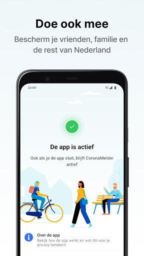
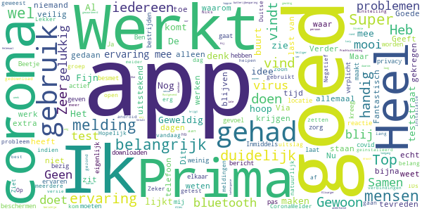
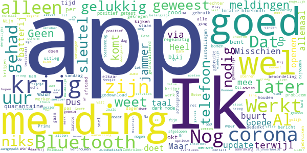
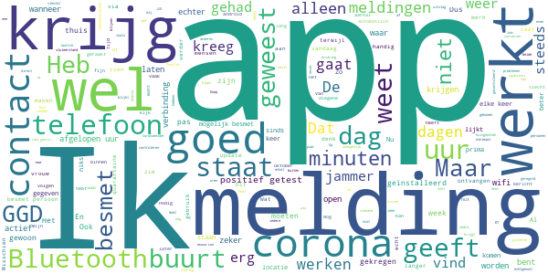
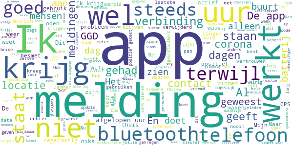

# CoronaMelder
App version ``1.0.4``

Analyzed with [covid-apps-observer](http://github.com/covid-apps-observer) project, version ``0.1``

## App overview
| | |
|-------------------------|-------------------------| 
| **Name**&nbsp;&nbsp;&nbsp;&nbsp;&nbsp;&nbsp;&nbsp;&nbsp;&nbsp;&nbsp;&nbsp;&nbsp;&nbsp;&nbsp;&nbsp;&nbsp;&nbsp;&nbsp;&nbsp;&nbsp;&nbsp;&nbsp;&nbsp;&nbsp;&nbsp;&nbsp;&nbsp;&nbsp;&nbsp;&nbsp;&nbsp;&nbsp;&nbsp;&nbsp;&nbsp;&nbsp;&nbsp;&nbsp;&nbsp;&nbsp;  | CoronaMelder |
| **Unique identifier** | nl.rijksoverheid.en |
| **Link to Google Play** | [https://play.google.com/store/apps/details?id=nl.rijksoverheid.en](https://play.google.com/store/apps/details?id=nl.rijksoverheid.en) |
| **Summary**  | Help de verspreiding van het coronavirus in Nederland te stoppen |
| **Privacy policy** | [https://coronamelder.nl/nl/privacy](https://coronamelder.nl/nl/privacy) |
| **Latest version** | 1.0.4 |
| **Last update** | 2020-10-26 10:36:39 |
| **Recent changes** | Dank je wel voor het gebruiken van CoronaMelder. Je helpt daarmee corona in Nederland te stoppen. Deze versie van CoronaMelder bevat tekstaanpassingen en kleine stabiliteitsverbeteringen. |
| **Installs**  | 1.000.000+ |
| **Category** | Medisch |
| **First release** | 10 aug. 2020 |
| **Size**  | 7,1M |
| **Supported Android version**  | 6.0 en hoger |

### Description
> CoronaMelder is de officiële corona notificatie-app van Nederland, ontwikkeld onder het toezicht van het Ministerie van Volksgezondheid, Welzijn en Sport. De app is een digitaal hulpmiddel bij het bron- en contactonderzoek door de GGD. 
 De app waarschuwt je nadat je in de buurt bent geweest van iemand met corona. Zo kun je jezelf en de mensen in je omgeving beschermen. En kunnen we samen het aantal besmettingen in Nederland zo laag mogelijk houden. Het gebruik van de app is vrijwillig. Niemand mag controleren of jij de app op je telefoon hebt. Maar hoe meer mensen de app gebruiken, hoe beter deze werkt. 
 Bij de ontwikkeling van deze app is rekening gehouden met toegankelijkheid, zie voor meer informatie onze toegankelijkheidsverklaring.
 Hoe werkt de app?
 # Je geeft alleen toegang tot je bluetoothgegevens
 CoronaMelder ziet via bluetooth wanneer je in de buurt bent van andere mensen met de app. De app gebruikt geen persoons- of locatiegegevens. De app weet dus niet wie je bent, waar je was en wie je hebt ontmoet.
 # Je krijgt een melding nadat je extra kans op besmetting hebt gelopen
 De app stuurt een melding als je minstens 15 minuten in de buurt bent geweest van iemand die later corona blijkt te hebben. Deze persoon moet ook de app gebruiken.
 # Je kunt anderen waarschuwen als je zelf besmet blijkt te zijn
 Ben je getest door de GGD en blijk je corona te hebben? Dan kun je samen met de GGD via de app een melding sturen naar de mensen bij wie je in de buurt bent geweest - in de periode dat je besmettelijk was. In deze melding staat alleen wanneer ze in de buurt zijn geweest van een besmet persoon. Niet wie of waar dit was.
 Hoe gaat de app met je gegevens om?
 • Je hoeft geen persoonsgegevens zoals je e-mailadres of naam in te voeren.
 • Als je iemand tegenkomt wisselen jullie telefoons via bluetooth willekeurige codes uit. Zo meet de app de duur en de afstand van het contact. In de codes staat niets over wie jullie zijn en waar jullie zijn geweest. 
 • De codes die je via bluetooth uitwisselt worden alleen op je telefoon bewaard en na 14 dagen verwijderd.
 • Gebruikers van de app zijn niet terug te vinden door de makers van de app, de overheid of andere gebruikers.

### User interface
The developers of the app provide the following screenshots in the Google play store.
| | | |
|:-------------------------:|:-------------------------:|:-------------------------:|
 |   |   |   | 
 |   |   |   | 

## Development team
In the following we report the main information provided by the development team in the Google play store.

| | |
|-------------------------|-------------------------|
| **Developer**  | Rijksoverheid |
| **Website**  | [https://coronamelder.nl/](https://coronamelder.nl/) |
| **Email** | helpdesk@coronamelder.nl |
| **Physical address**  | - |
| **Other developed apps**  | [https://play.google.com/store/apps/developer?id=Rijksoverheid](https://play.google.com/store/apps/developer?id=Rijksoverheid) |

## Android support

| | |
|-------------------------|-------------------------|
| **Declared target Android version**  | Android10, version 10 (API level 29) |
| **Effective target Android version**  | Android10, version 10 (API level 29) |
| **Minimum supported Android version**  | Marshmallow, version 6.0 (API level 23) |
| **Maximum target Android version**  | - |

The larger the difference between the minimum and maximum supported Android versions, the better. A larger difference means a wider audience. For example, old phones have a very low Android version, so a high minimum supported Android version means that the app cannot be used by users with old phones, thus leading to accessibility problems. 

## Requested permissions

In the following we report the complete list of the permissions requested by the app. 

| **Permission** | **Protection level** | **Description** | 
|-------------------------|-------------------------|-------------------------|
 **android.permission ACCESS_NETWORK_STATE** | Normal | Allows applications to access information about networks. 
 **android.permission BLUETOOTH** | Normal | Allows applications to connect to paired bluetooth devices. 
 **android.permission FOREGROUND_SERVICE** | Normal | Allows a regular application to use Service.startForeground. 
 **android.permission INTERNET** | Normal | Allows applications to open network sockets. 
 **android.permission RECEIVE_BOOT_COMPLETED** | Normal | Allows an application to receive the Intent.ACTION_BOOT_COMPLETED that is broadcast after the system finishes booting. 
 **android.permission WAKE_LOCK** | Normal | Allows using PowerManager WakeLocks to keep processor from sleeping or screen from dimming. 

## Mentioned servers

| **Server** | **Registrant** | **Registrant country** | **Creation date** | 
|-------------------------|-------------------------|-------------------------|-------------------------|
 | google.com | Google LLC | :us: US | 1997-09-15 04:00:00 |
 | coronamelder-api.nl | - | - | 2020-07-22 00:00:00 |
 | coronamelder-dist.nl | - | - | 2020-07-20 00:00:00 |

## Security analysis 

Below we report the main security warnings raised by our execution of the [Androwarn](https://github.com/maaaaz/androwarn) security analysis tool.

**Connection interfaces exfiltration**
> - This application reads details about the currently active data network 
> - This application tries to find out if the currently active data network is metered 

**Telephony services abuse**
> - This application makes phone calls 

**Suspicious connection establishment**
> - This application opens a Socket and connects it to the remote address '; port is out of range' on the 'N/A' port  
> - This application opens a Socket and connects it to the remote address 'Lj/b/a/a/a;->F(Ljava/lang/String;)Ljava/lang/StringBuilder;' on the 'N/A' port  
> - This application opens a Socket and connects it to the remote address 'Ljava/net/Proxy;->type()Ljava/net/Proxy$Type;' on the 'N/A' port  
> - This application opens a Socket and connects it to the remote address 'timeout' on the 'N/A' port  

## User ratings and reviews

Below we provide information about how end users are reacting to the app in terms of ratings and reviews in the Google Play store.

### Ratings

The CoronaMelder app has been installed by more than **1000000** times. At this time, **5402** rated the app and its average score is **2.8619528**. Below we show the distribution of the ratings across the usual star-based rating of Google Play

:star::star::star::star::star:: 1592

:star::star::star::star:: 636

:star::star::star:: 582

:star::star:: 618

:star:: 1974

### Reviews 

#### 5-star reviews

> App werkt prima  :date: __2020-10-31 08:34:35__

> Collega en familie  :date: __2020-10-30 18:59:25__

> Ik gebruik hem eigenlijk bijna nooit want ik zit toch bijna altijd binnen maar ik geef het toch 5 sterren omdat de overheid hier veel tijd in heeft gestopt  :date: __2020-10-30 17:41:32__

> Gezondheid allemaal  :date: __2020-10-30 16:22:35__

> makkelijk in gebruik  :date: __2020-10-30 09:10:43__

> Prima app, zou voor 18 miljoen mensen verplicht moeten worden!!!!  :date: __2020-10-29 22:19:23__

> Minder angstig met deze app!!!  :date: __2020-10-29 21:32:24__

> Ja ik vind het goed dat het er is jaap  :date: __2020-10-29 20:35:33__

> Heel goed als gaat dalen heel graag mark rutte kan overgaan Coronapiek coronavirus nederland  :date: __2020-10-29 17:08:39__

> Prima, het maakt het leed iets veilig  :date: __2020-10-29 15:04:46__

#### 4-star reviews

> Als ik in de auto wil kijken op Corona-app dan krijg ik een melding dat Bluetooth verhinderd dat ik op de app kan komen. Moet ik dan Bluetooth in de auto voor mijn telefoon uitschakelen ? Kan toch niet de bedoeling zijn ?  :date: __2020-10-30 20:53:37__

> Nog even wennen  :date: __2020-10-30 13:37:00__

> Heel raar. Mijn man is positief getest, verstuurt met GGD de sleutel. Pas 5 uur later krijg ik de melding dat ik diezelfde dag 😳 in aanraking ben geweest met iemand met corona. Helemaal NIKS over de afgelopen dagen. Andere mensen bij wie hij in de buurt is geweest zoals collega's hebben de melding nog steeds niet gekregen. Zo heeft de app toch geen zin?  :date: __2020-10-30 13:17:33__

> Weet niet of hij werkt want krijg geen meldingen. Dus zal alles goed zijn.  :date: __2020-10-30 09:29:10__

> Deze beoordeling is voor V1.0.4 . Mijn oude beoordeling was voor V1.0.3 en geldt dus niet meer... Uitstekend programma! Vandaar mijn voorlopige beoordeling van 4 sterren!  :date: __2020-10-29 21:57:12__

> app update niet automatisch  :date: __2020-10-29 13:25:43__

> Sinds gebruik al 3x melding dat de app 24 uur geen contacten kon bijhouden, data en Bluetooth staan aan.29-10 update van app waardoor oorzaak van probleem word aangepakt. App werd door batterijsparen verstoord.  :date: __2020-10-29 12:10:51__

> Na een update opende ik de app, iets wat je normaal niet doet zonder aanleiding, en moest ik opnieuw toestemming geven om de app op de achtergrond te mogen laten draaien. Had ik de app niet geopend had ik het nooit gezien. Iets om rekening mee te houden bij instructies naar eindgebruikers.  :date: __2020-10-29 10:38:20__

> Ik heb gelukkig nog niet 1 melding gehad. Dus goed  :date: __2020-10-29 08:52:53__

> Dit is heel hard nodig bij mij in.de buurt zitten ze bij elkaar gaan niet weg dit moet gewoon hard aangepakt worden  :date: __2020-10-29 07:49:04__

#### 3-star reviews

> Ik weet zeker of hij werkt heb nog niets doorgekregen  :date: __2020-10-31 08:37:18__

> Ik hoopte dat ik, zonder problemen, deze app kon laten draaien. Echter heb ik nu al zo'n 3x in korte tijd een foutmelding gekregen, dat de app in de afgelopen 24 uur niet goed werkte. Vreemd... Ik heb niks veranderd in de instellingen of zo...  :date: __2020-10-30 23:54:59__

> Slecht, hij doet niks want er is een fout opgetreden.  :date: __2020-10-30 22:31:47__

> Ik ben positief getest op corona en mijn huisgenoten hebben ook de app maar krijgen geen melding  :date: __2020-10-30 21:07:18__

> Heb de app maar heb het idee dat het geen donder uitmaakt wanneer je de app niet hebt. Als iemand corona heeft maar de app niet heeft wat heeft het dan voor nut. Dus kijk het nog even aan maar denk dat de app snel verdwijnen gaat  :date: __2020-10-30 20:22:13__

> Ik kan geen verbinding meer met mijn auto maken als deze app geïnstalleerd is. Zodra ik de Coronamelder deinstalleer heb ik direct weer verbinding. Verder hoop ik er eigenlijk niet achter te komen of de app werkt 🙂  :date: __2020-10-30 19:02:05__

> Ik heb de app 24/7 actief staan. Maar krijg regelmatig de melding, Door technische problemen heeft de app geen registraties kunnen doen.  :date: __2020-10-30 17:25:30__

> Bij mij in Grave N.B. geeft de melder steeds dat hij niets kan scannen.  :date: __2020-10-30 16:39:59__

> Geef steeds aan dat hij niet heeft kunnen registeren.  :date: __2020-10-30 13:15:35__

> Heb zwaar mijn twijfels of er wel iemand ietds doorgeeft,hier eerst dat gezeik met Pryvacy hier en pryvacy daar,wat het ik schijt daar aan het is godverd...de bedoeling is dat er mensen gered worden...nee we zijn een stront eigenzinnig aso volkje,blazen en de diikke nek uithangen,maar te fier om klachten ivm corona te melden.zo is het well.  :date: __2020-10-30 10:06:25__

#### 2-star reviews

> Zelfs op de dagen dat ik verkouden in huis zat (vrijstaande woning) had ik toch een aantal blootstellings meldingen.... Na wat onderzoek lijken dit checks te zijn van de app. Zeer verwarrend! Tekst in de app aanpassen zou handiger zijn, zodat jullie niet steeds opnieuw deze vraag krijgen.  :date: __2020-10-31 08:14:37__

> Binnen een aantal dagen 3x melding gehad dat wegens een technische storing over de afgelopen 24 uur geen meldingen bijgehouden zijn. Of iets in die context. Melding is zo schnell weg dat je geen kans krijgt om screenshot te maken. Wat heb je aan een app die meer lijkt op een Zwitserse gatenkaas dan continue 24/7 de contacten bijhoudt. Geeft weinig vertrouwen.  :date: __2020-10-30 19:49:14__

> De app meldt dat deze niet goed werkt als batterij optmalisatie aan staat.  :date: __2020-10-30 19:14:17__

> Onduidelijk hoe de code doorgegeven kan worden. Er wordt gezegt dat de GGD belt en dat je de code aan hun telefonisch dan doorgeeft. Werd niet gebeld!! Als je dan toch doorgaat dan lijkt het erop dat dan toch de code is doorgegeven? Graag meer duidelijkheid!!  :date: __2020-10-30 17:52:25__

> Sinds ik deze coronaMelder app gebruik is mijn batterijduur van mijn Samsung S9 drastisch naar beneden gegaan. Ik moet nu gedurende de dag mijn telefoon aan de lader hebben zonder deze intensief gebruikt te hebben, dit was nooit zo en ik ervaar dit dus ook als vervelend. Ik zie in de reviews niemand anders met dit probleem. Misschien dat de ontwikkelaar een idee heeft? Kan er iets verkeerd staan in mijn telefoon? Ik wil de app graag blijven gebruiken, maar zo kan het niet langer.  :date: __2020-10-30 15:34:52__

> Hij zegt iedere keer dat 24 uur geen verbinding was  :date: __2020-10-30 13:38:49__

> Ik heb vragen en mogelijk verbeterpunten voor deze app. Waarom is er geen mogelijkheid gemaakt om dit kenbaar te maken. Bij een review wordt mijn naam en Google profiel weergegeven wat ik in principe niet wil.  :date: __2020-10-30 09:30:00__

> Vraag. Bij het openen van de App komt er af en toe een melding in beeld, die echter binnen een seconde weer verdwijnt. Is ook nergens terug te vinden. Ik kan net iets over "de afgelopen 24 uur...." lezen. Wat is dit? En kan zo'n melding opgeroepen worden op een later moment om na te lezen? Dat is niet echt een duidelijk antwoord. Werkt de App nou wel of niet? Met alle negatieve berichtgeving erbij vandaag zaak om duidelijk te zijn! Nee hoor. Die staan niet aan. Werkt de App nou of niet??!  :date: __2020-10-30 09:22:01__

> Zit vlak bij iemand met corona maar zie geen melding binnenkomen. Is dat niet vreemd?  :date: __2020-10-29 21:58:34__

> Ik heb een melding gekregen dat ik meer dan 15 minuten, binnen 1.5 meter contact heb gehad met iemand die corona heeft. De app vermeld daarbij de datum. Vreemd genoeg ben ik de dag dat ik mogelijk besmet ben geraakt niet eens buitenshuis geweest, en heb deze dag geen contact gehad met andere mensen buiten mijn partner om die geen klachten heeft en ook de corona app niet. Ra ra hoe kan dit? De app werkt naar mijn mening niet goed.  :date: __2020-10-29 19:24:50__

#### 1-star reviews

> Mijn man is afgelopen week positief getest en hebben al een tijdje de app. Echter krijgt niemand in ons gezin een melding dat we in de buurt zijn geweest.  :date: __2020-10-31 08:25:46__

> Pas een melding gekregen dat ik bij iemand in de buurt was met corona waarvan het al 9 dagen geleden was dat ik mogelijk besmet ben geraakt.Dus heb ik 9 dagen gemist van de 10 quarantaine dagen.  :date: __2020-10-31 05:01:43__

> Vanmiddag melding dat ik gisteren 15 min bij iemand in de buurt ben geweest met corona. Kreeg net nogmaals melding dat ik vandaag 15 min bij iemand in de buurt ben geweest met corona. Terwijl ik vandaag niet buiten de deur ben geweest.. betrouwbaarheid????  :date: __2020-10-30 23:30:58__

> Werkt niet. Elke keer als ik de app open krijg ik een melding dat hij niets heeft kunnen meten.  :date: __2020-10-30 23:02:51__

> Elke dag zegt de app dat hij de laatste 24 uur niet gewerkt heeft, wat moet ik hier nu mee?  :date: __2020-10-30 21:13:42__

> Krijg na 15 dagen pas een meding dat ik in quarantaine had moeten blijven. Periode is dus al 5 dagen verstreken.  :date: __2020-10-30 20:50:05__

> Wegens technische storing werkt de app niet  :date: __2020-10-30 20:27:45__

> Ik krijg zowat elke dag een melding van jullie dat gedurende 24 uur geen contact kon worden verkregen en dat ik Wi-Fi en Bluetooth moet aanzetten...die staan echter gewoon aan. Ben het nu zat die meldingen steeds.  :date: __2020-10-30 17:20:19__

> Verwijder deze app maar, als je elke dag of nacht dezelfde z.g. technische melding krijgt (wat ze beter een foutmelding kunnen noemen). De overheid of app-ontwikkelaar weigert antwoord te geven op de vraag, of de app dan nog wel werkt. Alleen het standaard antwoord dat het probleem bekend is en er aan gewerkt word. Ik ben benieuwd of dat hieronder ook weer komt te staan. Aan de reviews te zien, is deze app voor de helft van de gebruikers waardeloos. Jammer, dat deze slechte app is uitgekozen.  :date: __2020-10-30 17:19:14__

> Als 70 plusser heb ik eerlijk gezegd geen idee van de werking hiervan en helaas denk ik dat dit voor veel ouderen het zelfde zal zijn  :date: __2020-10-30 17:09:40__

