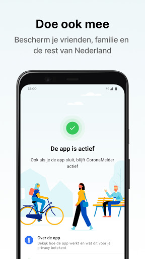

# CoronaMelder
App version ``1.0.5``

Analyzed with [covid-apps-observer](http://github.com/covid-apps-observer) project, version ``0.1``

## App overview
| | |
|-------------------------|-------------------------| 
| **Name**&nbsp;&nbsp;&nbsp;&nbsp;&nbsp;&nbsp;&nbsp;&nbsp;&nbsp;&nbsp;&nbsp;&nbsp;&nbsp;&nbsp;&nbsp;&nbsp;&nbsp;&nbsp;&nbsp;&nbsp;&nbsp;&nbsp;&nbsp;&nbsp;&nbsp;&nbsp;&nbsp;&nbsp;&nbsp;&nbsp;&nbsp;&nbsp;&nbsp;&nbsp;&nbsp;&nbsp;&nbsp;&nbsp;&nbsp;&nbsp;  | CoronaMelder |
| **Unique identifier** | nl.rijksoverheid.en |
| **Link to Google Play** | [https://play.google.com/store/apps/details?id=nl.rijksoverheid.en](https://play.google.com/store/apps/details?id=nl.rijksoverheid.en) |
| **Summary**  | Help de verspreiding van het coronavirus in Nederland te stoppen |
| **Privacy policy** | [https://coronamelder.nl/nl/privacy](https://coronamelder.nl/nl/privacy) |
| **Latest version** | 1.0.5 |
| **Last update** | 2020-11-09 12:10:50 |
| **Recent changes** | Dank je wel voor het gebruiken van CoronaMelder. Je helpt daarmee corona in Nederland te stoppen. Deze versie van CoronaMelder bevat tekstaanpassingen en kleine stabiliteitsverbeteringen. |
| **Installs**  | 1.000.000+ |
| **Category** | Medisch |
| **First release** | 10 aug. 2020 |
| **Size**  | 7,0M |
| **Supported Android version**  | 6.0 en hoger |

### Description
> CoronaMelder is de officiële corona notificatie-app van Nederland, ontwikkeld onder het toezicht van het Ministerie van Volksgezondheid, Welzijn en Sport. De app is een digitaal hulpmiddel bij het bron- en contactonderzoek door de GGD. 
 De app waarschuwt je nadat je in de buurt bent geweest van iemand met corona. Zo kun je jezelf en de mensen in je omgeving beschermen. En kunnen we samen het aantal besmettingen in Nederland zo laag mogelijk houden. Het gebruik van de app is vrijwillig. Niemand mag controleren of jij de app op je telefoon hebt. Maar hoe meer mensen de app gebruiken, hoe beter deze werkt. 
 Bij de ontwikkeling van deze app is rekening gehouden met toegankelijkheid, zie voor meer informatie onze toegankelijkheidsverklaring.
 Hoe werkt de app?
 # Je geeft alleen toegang tot je bluetoothgegevens
 CoronaMelder ziet via bluetooth wanneer je in de buurt bent van andere mensen met de app. De app gebruikt geen persoons- of locatiegegevens. De app weet dus niet wie je bent, waar je was en wie je hebt ontmoet.
 # Je krijgt een melding nadat je extra kans op besmetting hebt gelopen
 De app stuurt een melding als je minstens 15 minuten in de buurt bent geweest van iemand die later corona blijkt te hebben. Deze persoon moet ook de app gebruiken.
 # Je kunt anderen waarschuwen als je zelf besmet blijkt te zijn
 Ben je getest door de GGD en blijk je corona te hebben? Dan kun je samen met de GGD via de app een melding sturen naar de mensen bij wie je in de buurt bent geweest - in de periode dat je besmettelijk was. In deze melding staat alleen wanneer ze in de buurt zijn geweest van een besmet persoon. Niet wie of waar dit was.
 Hoe gaat de app met je gegevens om?
 • Je hoeft geen persoonsgegevens zoals je e-mailadres of naam in te voeren.
 • Als je iemand tegenkomt wisselen jullie telefoons via bluetooth willekeurige codes uit. Zo meet de app de duur en de afstand van het contact. In de codes staat niets over wie jullie zijn en waar jullie zijn geweest. 
 • De codes die je via bluetooth uitwisselt worden alleen op je telefoon bewaard en na 14 dagen verwijderd.
 • Gebruikers van de app zijn niet terug te vinden door de makers van de app, de overheid of andere gebruikers.

### User interface
The developers of the app provide the following screenshots in the Google play store.
| | | |
|:-------------------------:|:-------------------------:|:-------------------------:|
 |   |   |   | 
 |   |   |   | 

## Development team
In the following we report the main information provided by the development team in the Google play store.

| | |
|-------------------------|-------------------------|
| **Developer**  | Rijksoverheid |
| **Website**  | [https://coronamelder.nl/](https://coronamelder.nl/) |
| **Email** | helpdesk@coronamelder.nl |
| **Physical address**  | - |
| **Other developed apps**  | [https://play.google.com/store/apps/developer?id=Rijksoverheid](https://play.google.com/store/apps/developer?id=Rijksoverheid) |

## Android support

| | |
|-------------------------|-------------------------|
| **Declared target Android version**  | - |
| **Effective target Android version**  | - |
| **Minimum supported Android version**  | Marshmallow, version 6.0 (API level 23) |
| **Maximum target Android version**  | - |

The larger the difference between the minimum and maximum supported Android versions, the better. A larger difference means a wider audience. For example, old phones have a very low Android version, so a high minimum supported Android version means that the app cannot be used by users with old phones, thus leading to accessibility problems. 

## Requested permissions

In the following we report the complete list of the permissions requested by the app. 

| **Permission** | **Protection level** | **Description** | 
|-------------------------|-------------------------|-------------------------|
 **android.permission ACCESS_NETWORK_STATE** | Normal | Allows applications to access information about networks. 
 **android.permission BLUETOOTH** | Normal | Allows applications to connect to paired bluetooth devices. 
 **android.permission FOREGROUND_SERVICE** | Normal | Allows a regular application to use Service.startForeground. 
 **android.permission INTERNET** | Normal | Allows applications to open network sockets. 
 **android.permission RECEIVE_BOOT_COMPLETED** | Normal | Allows an application to receive the Intent.ACTION_BOOT_COMPLETED that is broadcast after the system finishes booting. 
 **android.permission REQUEST_IGNORE_BATTERY_OPTIMIZATIONS** | Normal | Permission an application must hold in order to use Settings.ACTION_REQUEST_IGNORE_BATTERY_OPTIMIZATIONS. 
 **android.permission WAKE_LOCK** | Normal | Allows using PowerManager WakeLocks to keep processor from sleeping or screen from dimming. 

## Mentioned servers

| **Server** | **Registrant** | **Registrant country** | **Creation date** | 
|-------------------------|-------------------------|-------------------------|-------------------------|
 | google.com | Google LLC | :us: US | 1997-09-15 04:00:00 |
 | coronamelder-dist.nl | - | - | 2020-07-20 00:00:00 |
 | coronamelder-api.nl | - | - | 2020-07-22 00:00:00 |

## Security analysis 

Below we report the main security warnings raised by our execution of the [Androwarn](https://github.com/maaaaz/androwarn) security analysis tool.

**Connection interfaces exfiltration**
> - This application reads details about the currently active data network 
> - This application tries to find out if the currently active data network is metered 

**Telephony services abuse**
> - This application makes phone calls 

**Suspicious connection establishment**
> - This application opens a Socket and connects it to the remote address '; port is out of range' on the 'N/A' port  
> - This application opens a Socket and connects it to the remote address 'Ljava/net/Proxy;->type()Ljava/net/Proxy$Type;' on the 'N/A' port  
> - This application opens a Socket and connects it to the remote address 'Ll/b/a/a/a;->G(Ljava/lang/String;)Ljava/lang/StringBuilder;' on the 'N/A' port  
> - This application opens a Socket and connects it to the remote address 'timeout' on the 'N/A' port  

## User ratings and reviews

Below we provide information about how end users are reacting to the app in terms of ratings and reviews in the Google Play store.

### Ratings

The CoronaMelder app has been installed by more than **1000000** times. At this time, **5877** rated the app and its average score is **2.95586**. Below we show the distribution of the ratings across the usual star-based rating of Google Play

:star::star::star::star::star:: 1968

:star::star::star::star:: 545

:star::star::star:: 653

:star::star:: 680

:star:: 2031

### Reviews 

#### 5-star reviews

> Deze app heb je eigenlijk niks aan als je begeleid woont in de leiding de test regeld  :date: __2020-11-16 08:33:30__

> Ik had de app geïnstalleerd maar na 3 dagen lang de mededeling dat er door een technisch probleem geen check heeft kunnen plaatsvinden heb ik hem maar weer verwijderd. Op deze manier heeft de app niet zoveel zin en dat vind ik erg jammer! Ik wil m graag gebruiken maar niet zó.... Inmiddels weer geïnstalleerd en nu is het prima!  :date: __2020-11-15 19:16:22__

> Duidelijk en werkt prima. Helaas zeggen veel werkgevers dat je de quarantaine melding kan (moet) negeren omdat RIVM dat zegt. GGD en Rijksoverheid volgen netjes de regels. Dus zeggen werkgevers: wij voeren RIVM beleid. Resultaat: komen werken met corona melder melding  :date: __2020-11-14 09:23:41__

> Opzich wel gave app, alleen wel jammer dat level 4 met die kaasblokken onmogelijk is om te halen. Groetjes aan je moeder  :date: __2020-11-13 12:33:41__

> Geeft mij een rustig gevoel Jammer dat er zoveel mensen negatief Over denken Je doet het niet alleen voor je zelf .maar ook voor je mede mens  :date: __2020-11-13 09:37:29__

> Werkt goed.  :date: __2020-11-13 05:19:07__

> De Corona Melder is een zeer goede App  :date: __2020-11-12 20:36:14__

> Beste, ik ontving een melding dat ik ongeveer twee en een halve week geleden in de buurt van een Corona patiënt was geweest.....en dat ik tot twee dagen vóór dat ik deze melding kreeg thuis in quarantaine had moeten blijven (??). Niet echt een effectiviteit die je hoopt te bereiken. Veel succes verder! Jos Trienekens  :date: __2020-11-12 20:07:22__

> Heel erg goed  :date: __2020-11-12 17:40:20__

> Goed  :date: __2020-11-12 15:09:42__

#### 4-star reviews

> Sinds de laatste update (9/11) werkt de App niet meer. Blijft crashen. Update: De app gedwongen gestopt en weer gestart. Werkt weer 👍🏼  :date: __2020-11-14 12:41:29__

> Goed  :date: __2020-11-13 12:40:24__

> Over de app zelf is weinig te melden. Hij is alleen nuttig als velen hem installeren en is feitelijk niet meer dan een sensor. Feedback over hoeveel gevallen ermee zijn opgespoord zou leuk zijn. "De app gebruikt geen persoons- of locatiegegevens" is ten dele waar. Het verplichte locatiegegevens "aan" komt ook ten goede aan andere app's die het minder nauw nemen.  :date: __2020-11-12 09:08:45__

> Prima toch  :date: __2020-11-11 15:50:24__

> Een bekende is positief getest. En ik ben 5 dgn geleden >15 minuten id buurt geweest. Melding is correct.  :date: __2020-11-11 11:25:40__

> Hoe verander ik de taal van de app?  :date: __2020-11-10 19:01:26__

> Lijkt mij een goede app.  :date: __2020-11-09 19:18:46__

> In de app kan je zien blootstellingschecks En dan zie je van de dag aantal sleutels en dan komt er 1 overheen. Betekent dat dat iemand corona heeft ?  :date: __2020-11-09 08:45:36__

> ik heb al een tijdje geen bericht gehad.ik wilde net de app openen.ging niet valt gelijk weg.  :date: __2020-11-07 11:46:32__

> Werkt fijn  :date: __2020-11-05 21:13:16__

#### 3-star reviews

> Nog geen idee hoe en of het werkt...  :date: __2020-11-16 06:57:51__

> Zo te lezen werk de app van corona niet goed  :date: __2020-11-16 06:41:54__

> Ik kreeg meldingen over in de buurt te zijn geweest bij carona terwijl ik thuis was.Met niemand in de buurt dus snap het niet helemaal hoeveel meter moet er eigenlijk tussen zitten  :date: __2020-11-15 17:27:55__

> De app lijkt nuttig, maar ik kreeg een melding dat ik bij iemand met corona in de buurt was geweest. Die dag ben ik zeker niet 15 minuten bij iemand in de buurt geweest. Het meest waarschijnlijke is dat het contact toch via de muur met onze buren is gekomen. Daar hadden ze wel corona. Beide telefoons lagen dicht bij de muur.  :date: __2020-11-15 13:02:00__

> Slurpt de batterij leeg. Verder werkt het goed.  :date: __2020-11-15 01:37:38__

> Ik ben vrijdagavond gewaarschuwd dat ik besmet zou kunnen zijn, omdat ik woensdag (2 dagen eerder), minstens 15 min bij iemand met Corona in de buurt ben geweest. Wat ik mis in deze app-melding is een tijdsframe, waarbinnen mijn besmettingskwartier viel. Desnoods alleen de aanduiding 's morgens, 's middags of 's avonds, was prettig geweest.  :date: __2020-11-14 20:39:29__

> Geen meldingen meer dat de app geen verbinding kon maken. Maar... bluetooth aan de hele dag en je kan de spaarstand niet aanzetten. Daarmee is je mobiel, zeker als je m al wat langer hebt binnen no time leeg. Daar zou echt iets aan gedaan moeten worden. Dat de spaarstand gewoon aan kan.  :date: __2020-11-14 13:40:59__

> Ondanks het feit dat onze landsgrens met Duitsland de langste is en ze ook daar een app hebben, is er nog steeds geen samenwerking tussen beide apps. De Duitse app heeft al samenwerking met vele landen maar niet de Nederlandse.....  :date: __2020-11-14 11:51:25__

> Dagelijks krijg ik een melding dat de app niet heeft kunnen werken voor 24 uur, terwijl ik hem steeds 's ochtends aanzet en ik Bluetooth steeds aan heb. Ik vraag me af of mijn slaapregistratie-app Sleep-as-Android er iets mee te maken heeft.  :date: __2020-11-13 13:37:45__

> GPS moet aan, maar dat is technisch van aard. Dat wordt ook uitgelegd via een melding wanneer je de GPS uit zet. Verder prima app en helpt mee om lockdowns te voorkomen in de toekomst. Update 10-11-2020: Android heeft de app volledig uitgeschakeld zonder melding. Daarom werkte de app een tijd niet meer. Zelf handmatig app op altijd aan gezet bij batterij-instelling. Kan Google dit niet voorkomen? Zal bij iedereen kunnen gebeuren.  :date: __2020-11-10 11:16:43__

#### 2-star reviews

> Ik kreeg een melding dat ik op een bepaalde datum bij iemand in de buurt bent geweest met corona. Op dit datum ben ik de hele dag alleen thuis geweest dus deze melding klopt niet.  :date: __2020-11-15 14:48:28__

> Ik ga er vanuit als ik de melder aanzet dat hij aan blijft, maar iedere keer al ik hem open blijkt de melder uit te staan.  :date: __2020-11-14 08:25:54__

> Krijg iedere keer een melding dat de app 24 uur niet gewerkt heeft door een technische storing. Is al de derde keer deze week, ik denk dat ik hem maar weer verwijder.  :date: __2020-11-13 19:05:35__

> Ik ben nu achteraf 3x voor langere tijd bij een COVID-19 patient in de buurt geweest maar krijg geen melding via de app.  :date: __2020-11-12 23:04:31__

> Ik heb zojuist de app geopend en zag dat ik een melding had gekregen. Ik stond 15 minuten bij een persoon met corona, maar kreeg dus geen pop-up melding en/of een geluidsmelding. Dan helpt het niet echt en niet duidelijk!  :date: __2020-11-12 18:08:10__

> De app oogt aantrekkelijk en lijkt gebruiksvriendelijk. Helaas schakelt de app voortdurend uit en ben ik er inmiddels goed zat van. Het ondermijnt de gebruiksvriendelijkheid en is op deze manier niet doeltreffend. Jammer hoor. Als je iets doet, doe het dan goed.  :date: __2020-11-12 17:18:01__

> Mijn schoondochter meldde mij eergisteren dat zij corona heeft. Ik heb van haar persoonlijk wel een melding maar de app waarschuwt niet  :date: __2020-11-12 15:01:30__

> Crasht sinds laatste update,bij opstarten sluit de app meteen weer af en krijg ik een foutmelding.  :date: __2020-11-12 10:00:19__

> Mijn app is er al 2 keer mee gestopt.daarna opnieuw geplaatst.Weet niet hoelang hij er uit was. Ik kreeg alleen een melding als ik op de app drukte. Daar stond ...coronamelder is gestopt.  :date: __2020-11-12 09:46:25__

> Onzinnige app. Geeft alleen de geregistreerde meldingen weer. Slaagkans op een ontmoeting nihil.  :date: __2020-11-11 17:23:12__

#### 1-star reviews

> Werkt op mijn telefoon niet. Zou niet matchen met iets anders. Kreeg een mrlding waar ik niets van begreep.  :date: __2020-11-16 09:38:26__

> In ene moet je ook je GPS continue aan hebben anders werkt de app niet... Ik had al moeite met continue Bluetooth aan maar ook je locatie vind ik wel een inbreuk op je privacy. Ik wil dit helemaal niet, waarom is dit in ene verplicht? Continue Bluetooth en Locatie aan zorgt voor accu verbruik. Maar weer deleten deze app, want is zo waardeloos! Het was met Android versie 9 niet verplicht, na de laatste CoronaMelder update echter in ene wel, echt ronduit belachelijk.  :date: __2020-11-16 09:30:15__

> Verschijnt opeens melding , app niet actief , zet gps locatie aan . Nou dikke doei overheden !!!!😷  :date: __2020-11-15 22:25:09__

> Doet het helemaal niet!  :date: __2020-11-15 22:14:01__

> Er wordt niet duidelijk weergegeven waar je wat kunt vinden.  :date: __2020-11-15 19:18:40__

> Het blijft pure rotzooi. Werkt voor geen meter  :date: __2020-11-15 17:06:42__

> Waardeloos, ik zat al een paar dagen in quarantaine omdat ik bij iemand met covid in de buurt geweest was, toen ik de melding pas via de app kreeg. Veel te laat dus. Zelf ondertussen besmet geraakt. Deze app helpt dus niet. Verwijderd.  :date: __2020-11-15 14:42:42__

> Mijn vriend is positief getest op covid-19. Dit is dag 3 van de quarantaine en ik heb nog steeds geen melding gekregen. Schijnveiligheid! Zorg alsjeblieft eerst dat de app goed werkt. Dan hebben we er wat aan.  :date: __2020-11-15 12:40:06__

> Deze app zorgt voor conflicten met mijn betaal app op mij telefoon, ik ga er vanuit dat het gebruik van deze app zorgt voor onveilige bleutooth verbindingen. na verwijdering van deze app werkte mijn betaal app weer normaal. Dit is jammer mede doordat ik in een risicogroep val wat betreft corona  :date: __2020-11-15 10:46:45__

> Sinds een paar weken deed mijn Garmin Forerunner het niet goed meer. Ik moest een paar keer per dag de Bluetooth pincode weer invoeren. Vanalles geprobeerd (telefoon gereset, horloge gereset) maar niets hielp. Totdat ik me realiseerde dat het begonnen was met het installeren van de CoronaMelder app. Dus ik heb de app verwijderd en nu doet mijn horloge het weer. Knap waardeloos dus...  :date: __2020-11-15 08:57:17__

