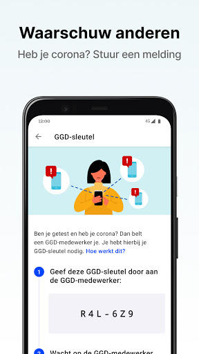
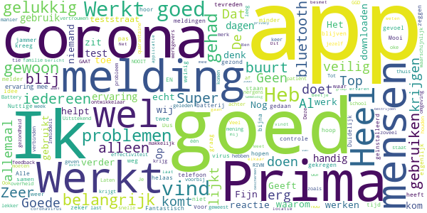
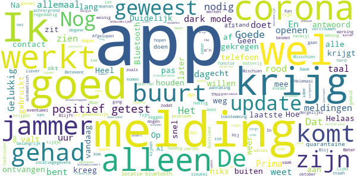
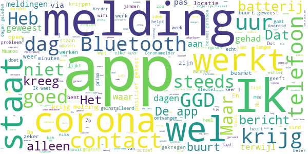
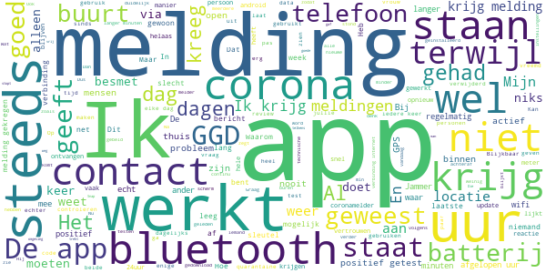
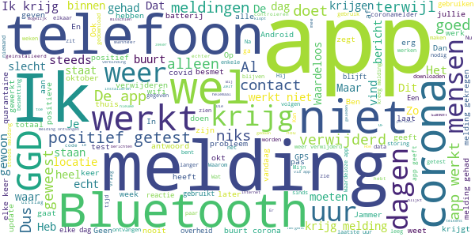

# CoronaMelder
App version ``1.1.0``

Analyzed with [covid-apps-observer](http://github.com/covid-apps-observer) project, version ``0.1``

## App overview
| | |
|-------------------------|-------------------------| 
| **Name**&nbsp;&nbsp;&nbsp;&nbsp;&nbsp;&nbsp;&nbsp;&nbsp;&nbsp;&nbsp;&nbsp;&nbsp;&nbsp;&nbsp;&nbsp;&nbsp;&nbsp;&nbsp;&nbsp;&nbsp;&nbsp;&nbsp;&nbsp;&nbsp;&nbsp;&nbsp;&nbsp;&nbsp;&nbsp;&nbsp;&nbsp;&nbsp;&nbsp;&nbsp;&nbsp;&nbsp;&nbsp;&nbsp;&nbsp;&nbsp;  | CoronaMelder |
| **Unique identifier** | nl.rijksoverheid.en |
| **Link to Google Play** | [https://play.google.com/store/apps/details?id=nl.rijksoverheid.en](https://play.google.com/store/apps/details?id=nl.rijksoverheid.en) |
| **Summary**  | Help de verspreiding van het coronavirus in Nederland te stoppen |
| **Privacy policy** | [https://coronamelder.nl/nl/privacy](https://coronamelder.nl/nl/privacy) |
| **Latest version** | 1.1.0 |
| **Last update** | 2020-11-25 10:02:55 |
| **Recent changes** | Dank je wel voor het gebruiken van CoronaMelder. Je helpt zo de verspreiding van corona in Nederland te stoppen. Deze versie van CoronaMelder werkt ook samen met corona-apps uit andere Europese landen. |
| **Installs**  | 1.000.000+ |
| **Category** | Medisch |
| **First release** | 10 aug. 2020 |
| **Size**  | 7,0M |
| **Supported Android version**  | 6.0 en hoger |

### Description
> CoronaMelder is de officiële corona notificatie-app van Nederland, ontwikkeld onder het toezicht van het Ministerie van Volksgezondheid, Welzijn en Sport. De app is een digitaal hulpmiddel bij het bron- en contactonderzoek door de GGD. 
 De app waarschuwt je nadat je in de buurt bent geweest van iemand met corona. Zo kun je jezelf en de mensen in je omgeving beschermen. En kunnen we samen het aantal besmettingen in Nederland zo laag mogelijk houden. Het gebruik van de app is vrijwillig. Niemand mag controleren of jij de app op je telefoon hebt. Maar hoe meer mensen de app gebruiken, hoe beter deze werkt. 
 Bij de ontwikkeling van deze app is rekening gehouden met toegankelijkheid, zie voor meer informatie onze toegankelijkheidsverklaring.
 Hoe werkt de app?
 # Je geeft alleen toegang tot je bluetoothgegevens
 CoronaMelder ziet via bluetooth wanneer je in de buurt bent van andere mensen met de app. De app gebruikt geen persoons- of locatiegegevens. De app weet dus niet wie je bent, waar je was en wie je hebt ontmoet.
 # Je krijgt een melding nadat je extra kans op besmetting hebt gelopen
 De app stuurt een melding als je minstens 15 minuten in de buurt bent geweest van iemand die later corona blijkt te hebben. Deze persoon moet ook de app gebruiken.
 # Je kunt anderen waarschuwen als je zelf besmet blijkt te zijn
 Ben je getest door de GGD en blijk je corona te hebben? Dan kun je samen met de GGD via de app een melding sturen naar de mensen bij wie je in de buurt bent geweest - in de periode dat je besmettelijk was. In deze melding staat alleen wanneer ze in de buurt zijn geweest van een besmet persoon. Niet wie of waar dit was.
 Hoe gaat de app met je gegevens om?
 • Je hoeft geen persoonsgegevens zoals je e-mailadres of naam in te voeren.
 • Als je iemand tegenkomt wisselen jullie telefoons via bluetooth willekeurige codes uit. Zo meet de app de duur en de afstand van het contact. In de codes staat niets over wie jullie zijn en waar jullie zijn geweest. 
 • De codes die je via bluetooth uitwisselt worden alleen op je telefoon bewaard en na 14 dagen verwijderd.
 • Gebruikers van de app zijn niet terug te vinden door de makers van de app, de overheid of andere gebruikers.

### User interface
The developers of the app provide the following screenshots in the Google play store.
| | | |
|:-------------------------:|:-------------------------:|:-------------------------:|
 |   |   |   | 
 |   |   |   | 

## Development team
In the following we report the main information provided by the development team in the Google play store.

| | |
|-------------------------|-------------------------|
| **Developer**  | Rijksoverheid |
| **Website**  | [https://coronamelder.nl/](https://coronamelder.nl/) |
| **Email** | helpdesk@coronamelder.nl |
| **Physical address**  | - |
| **Other developed apps**  | [https://play.google.com/store/apps/developer?id=Rijksoverheid](https://play.google.com/store/apps/developer?id=Rijksoverheid) |

## Android support

| | |
|-------------------------|-------------------------|
| **Declared target Android version**  | - |
| **Effective target Android version**  | - |
| **Minimum supported Android version**  | Marshmallow, version 6.0 (API level 23) |
| **Maximum target Android version**  | - |

The larger the difference between the minimum and maximum supported Android versions, the better. A larger difference means a wider audience. For example, old phones have a very low Android version, so a high minimum supported Android version means that the app cannot be used by users with old phones, thus leading to accessibility problems. 

## Requested permissions

In the following we report the complete list of the permissions requested by the app. 

| **Permission** | **Protection level** | **Description** | 
|-------------------------|-------------------------|-------------------------|
 **android.permission ACCESS_NETWORK_STATE** | Normal | Allows applications to access information about networks. 
 **android.permission BLUETOOTH** | Normal | Allows applications to connect to paired bluetooth devices. 
 **android.permission FOREGROUND_SERVICE** | Normal | Allows a regular application to use Service.startForeground. 
 **android.permission INTERNET** | Normal | Allows applications to open network sockets. 
 **android.permission RECEIVE_BOOT_COMPLETED** | Normal | Allows an application to receive the Intent.ACTION_BOOT_COMPLETED that is broadcast after the system finishes booting. 
 **android.permission REQUEST_IGNORE_BATTERY_OPTIMIZATIONS** | Normal | Permission an application must hold in order to use Settings.ACTION_REQUEST_IGNORE_BATTERY_OPTIMIZATIONS. 
 **android.permission WAKE_LOCK** | Normal | Allows using PowerManager WakeLocks to keep processor from sleeping or screen from dimming. 

## Mentioned servers

| **Server** | **Registrant** | **Registrant country** | **Creation date** | 
|-------------------------|-------------------------|-------------------------|-------------------------|
 | google.com | Google LLC | :us: US | 1997-09-15 04:00:00 |
 | coronamelder-dist.nl | - | - | 2020-07-20 00:00:00 |
 | coronamelder-api.nl | - | - | 2020-07-22 00:00:00 |

## Security analysis 

Below we report the main security warnings raised by our execution of the [Androwarn](https://github.com/maaaaz/androwarn) security analysis tool.

**Connection interfaces exfiltration**
> - This application reads details about the currently active data network 
> - This application tries to find out if the currently active data network is metered 

**Telephony services abuse**
> - This application makes phone calls 

**Suspicious connection establishment**
> - This application opens a Socket and connects it to the remote address '; port is out of range' on the 'N/A' port  
> - This application opens a Socket and connects it to the remote address 'Ljava/net/Proxy;->type()Ljava/net/Proxy$Type;' on the 'N/A' port  
> - This application opens a Socket and connects it to the remote address 'Ln/b/a/a/a;->G(Ljava/lang/String;)Ljava/lang/StringBuilder;' on the 'N/A' port  
> - This application opens a Socket and connects it to the remote address 'timeout' on the 'N/A' port  

## User ratings and reviews

Below we provide information about how end users are reacting to the app in terms of ratings and reviews in the Google Play store.

### Ratings

The CoronaMelder app has been installed by more than **1000000** times. At this time, **6231** rated the app and its average score is **3.0154798**. Below we show the distribution of the ratings across the usual star-based rating of Google Play

:star::star::star::star::star:: 2171

:star::star::star::star:: 636

:star::star::star:: 588

:star::star:: 791

:star:: 2045

### Reviews 

#### 5-star reviews

> Battery drain, en bevestigd door ontwikkelaar, helaas.  :date: __2020-11-30 09:00:08__

> WIJ HOPEN DAT HET VOOR GOED WEG GAAT. EN NOOIT MEER TERUG KOMT.  :date: __2020-11-29 23:36:09__

> Veiligheid vooŕ iedereen  :date: __2020-11-29 23:18:02__

> Werkt prima zonder valse/gekke meldingen. Geeft een veilig gevoel dat je een seintje krijgt zodat je jezelf in de gaten kan houden. Gebruikt geen data en nauwelijks stroom, allemaal installeren, aanrader! #alleensamentegencorona  :date: __2020-11-29 23:15:36__

> Alles oke  :date: __2020-11-29 20:07:31__

> Ik ben blij en ontspannen met deze App.  :date: __2020-11-29 18:04:48__

> hopen dat abdriid ghet aanjkan  :date: __2020-11-29 14:47:11__

> Mensen dit is mennens Laten we hier van leren. Verkloot het niet .  :date: __2020-11-28 21:42:16__

> 9.00 ser gut  :date: __2020-11-28 20:50:29__

> kut ap.  :date: __2020-11-28 18:18:22__

#### 4-star reviews

> Onduidelijke werking. Hoe weet de app dat ik corona heb gehad...? Dank voor het antwoord. Na antwoord van 2 naar 4 sterren.  :date: __2020-11-30 10:20:21__

> De app werkt goed alleen jammer ik zit maand thuis v.w. me pols kreeg een melding en de dag erop mag ik naar buiten volgens de app en was niet ziek kom alleen buiten voor de hond en boodschappen anders zit ik binnen  :date: __2020-11-29 11:15:09__

> De App ziet er goed uit en werkt vanaf 30 november 2020 samen met enkele andere Europese landen. Helaas nog niet met buurland België. En ondanks dat de winter in aantocht is, werkt de app helaas ook niet in Frankrijk, Zwitserland of Oostenrijk.  :date: __2020-11-28 19:56:47__

> Duidelijk en transparante app ad voorkant. Wel jammer dat je eigen app die ervoor zorgt dat je vele apps hun verbruik op de achtergrond minimaliseert, deze corona app zijn optimale werking in de weg staat zoals ik uit de melding begrijp. Ook zou ik een notificatie willen ontvangen vd updates en willen weten wat er dan geupdate/bijgekomen is zonder zelf de backend in te hoeven duiken.  :date: __2020-11-28 08:24:07__

> Valt wel iets te vaak uit naar mijn mening, maar voor de rest doet hij zijn functie (aldus de app). Het feit dat batterijbesparende stand de app uitschakelt is wel echt vervelend, maar liever een iets te lege telefoon dan een midweekje IC voor je ouders.  :date: __2020-11-27 01:21:22__

> Geen idee wanneer ik een melding krijg, was r zie ik dat aan????  :date: __2020-11-26 12:29:17__

> Afgelopen weekend kreeg ik een melding dat ik mogelijk besmet zou zijn. De aangegeven dag was ik niet uit huis geweest, dus wist zeker dat ik geen contact had gehad. Ik vermoed dat ik op 1,5 mtr van m'n buurman was, die positief getest is, alleen wel met een muur er tussen.  :date: __2020-11-24 16:19:34__

> Het zou fijn zijn dat je kunt zien op welk tijdstip je bij iemand te lang in de buurt bent geweest.  :date: __2020-11-23 22:13:38__

> Prima Ap  :date: __2020-11-21 19:00:20__

> Ik heb nog geen melding ontvangen, kan er dus niet veel over zeggen. Alleen kijk ik af en toe en krijg dan te zien dat de melder actief is.  :date: __2020-11-19 10:31:10__

#### 3-star reviews

> Ik merk niet een dat hij op mijn tel zin maar heb hem wel  :date: __2020-11-29 23:49:19__

> volgens mij reageert de app als volgt: Je telefoon krijgt bericht van een andere telefoon, die vlak bij jouw telefoon in de buurt is geweest. En die telefoon heeft ook weer bericht gekregen, etc etc. Maar waar begint dit dan?????????  :date: __2020-11-29 14:22:44__

> Ik wil graag de taal aanpassen, heb de app eerst in het Nederlands gedownload, maar kan nu niets vinden waar ik de taal aan zou kunnen passen.  :date: __2020-11-29 09:49:31__

> Hoe komt het dat ik regelmatig een bericht krijg dat mijn app de laatste 24 uur niet heeft gewerkt.  :date: __2020-11-28 13:55:22__

> Krijg nu een melding dat ik 2 dageb geleden in aanraking ben geweest met iemand met corona (2oktober)..... jaja is nu 28 november......... dus betrouwbaar ???????????????  :date: __2020-11-28 08:14:53__

> De app is heel duidelijk. Alleen afgelopen zaterdag een melding gehad maar mijn man en ik waren de hele dag thuis. We hebben geen visite gehad, dat hebben we namelijk al 8 maanden niet.  :date: __2020-11-27 23:50:24__

> Een besmet persoon moet nog steeds persoonlijk melden dat positief is. Moet gewoon automatisch door GGD.  :date: __2020-11-27 20:22:45__

> Deze App: alias de CoronaMelder, denkt dat deze op een Smartphone staat.? Corona App staat op een Destop die onder een Buro staat? Destop +17.inch scherm. M.Vr.Gr.🗣️☘️.....🍀🌞🤗😇  :date: __2020-11-25 18:45:23__

> Zag 23/11 bij een tijdstip een 1 bij overeenkomsten staan, maar geen notificatie ontvangen. Corona melder gebeld, volgens medewerker ben ik korter dan 15min. bij besmet persoon in de buurt geweest. GGD gevraagd of ik getest moet worden ivm werk op school. Nee, want ik heb (gelukkig) geen klachten. Gevraagd of ik in quarantaine moest. Doorverwezen naar RIVM. Hoef niet in quarantaine. Misschien handig te vermelden onder FAQ dat een overeenkomst zonder notificatie geen actie behoeft?  :date: __2020-11-23 18:45:13__

> De batterij optimalisatie moet uitgezet worden.die vermelding krijg ik steeds.dan wordt het probleem opgelost.niet dus.elke keer als ik hem aanzet.zie ik die tekst weer.ik heb bij de instellingen gekeken.kan het niet vinden.  :date: __2020-11-23 16:23:04__

#### 2-star reviews

> Snap niet op welke manier er gewaarschuwd wordt. Of moet je elke dag steeds op de app kijken? Die is altijd groen.  :date: __2020-11-29 16:14:09__

> Krijg steeds melding . Corona melder stopt steeds  :date: __2020-11-29 15:25:25__

> App stop telkens ook na het updaten dus heb er niets aan zo  :date: __2020-11-29 14:01:04__

> Ik krijg bijna dagelijks een melding dat de voorbeelden niet 24 uur actief is geweest.  :date: __2020-11-29 09:13:53__

> Ik vraag mij af of het wel werkt. Ben zelf positief getest, maar de ggd-sleutel werkt niet bij de GGD en nadat ik een melding heb verzonden, heeft mijn man geen melding ontvangen. Heel jammer, want je wilt toch helpen bij het voorkomen van spreiding. En ik ben dan ook wel benieuwd of ik zelf wel een melding zou ontvangen als iemand de ggd-sleutel activeert.  :date: __2020-11-28 19:08:20__

> De app werkt maar ik was al 5 dagen in quarantaine toen ik het bericht kreeg.  :date: __2020-11-28 18:22:49__

> Slechte app.  :date: __2020-11-27 19:19:52__

> Ontvang elke dag melding technisch probleem en er is geen helpdesk om probleem te tackelen.  :date: __2020-11-27 12:21:29__

> De app geeft absoluut geen melding. In mijn omgeving corona patiënten waar ik langer dan 15 minuten bij in de buurt ben geweest!!!!! Erg slecht en onbetrouwbaar. Het enige goede is dat je makkelijk een test kan aanvragen maar dat is het enige voordeel.  :date: __2020-11-26 14:01:01__

> De app gaf geen pushbericht of ander duidelijk signaal, zodat ik nu niet weet hoe lang de melding dat ik in contact ben geweest met een besmet persoon er al stond! Het zo snel mogelijk weten lijkt mij nogal van belang.  :date: __2020-11-26 10:38:32__

#### 1-star reviews

> Elke keer als ik de app weer eens check, blijkt ie uit te staan. Terwijl ik hem echt heb ingeschakeld.  :date: __2020-11-30 10:27:22__

> Geen melding gekregen, nadat naaste collega positief getest is en ook in de app gemeld heeft. Ik werd ook positief getest, dit aangegeven in de app. De GGD moet nog bellen... Dus verwijder de app weer.  :date: __2020-11-30 09:56:31__

> Klut  :date: __2020-11-29 21:23:09__

> De app geeft regelmatig aan (tijdelijk) geen verbinding te hebben gehad Sinds 27-11 crashed de app en start niet meer op (samsung a8 / android)  :date: __2020-11-29 18:14:48__

> Ik ben vorige week 3 uur lang bij iemand geweest, op kleine afstand(aan eettafel) maar geen melding ontvangen, 2 dagen na mijn bezoek werd hij positief bevonden en ziek. Beide hebben we de app dus ik verwachtte wel een melding.  :date: __2020-11-29 15:31:19__

> Bluetooth gaat regelmatig uit, wat de reden is weet ik niet  :date: __2020-11-29 02:31:06__

> Waardeloos geval, weer zo'n product van een politieke kneus  :date: __2020-11-29 02:08:47__

> Deze app stoort mijn Bluetooth, wil dan geen nieuwe verbinding meer aan. Ze zien elkaar wel maar ontvang niets meer, app verwijderd en probleem is opgelost, jammer.  :date: __2020-11-28 20:12:45__

> Werk niet  :date: __2020-11-28 15:11:43__

> Na level 80 kom ik helaas niemand meer tegen met corona en krijg derhalve dus nooit een match. Verwijderd en maar overgestapt op Tinder  :date: __2020-11-28 07:02:30__

