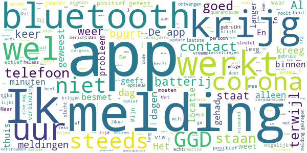

# CoronaMelder
App version ``1.1.1``

Analyzed with [covid-apps-observer](http://github.com/covid-apps-observer) project, version ``0.1``

## App overview
| | |
|-------------------------|-------------------------| 
| **Name**&nbsp;&nbsp;&nbsp;&nbsp;&nbsp;&nbsp;&nbsp;&nbsp;&nbsp;&nbsp;&nbsp;&nbsp;&nbsp;&nbsp;&nbsp;&nbsp;&nbsp;&nbsp;&nbsp;&nbsp;&nbsp;&nbsp;&nbsp;&nbsp;&nbsp;&nbsp;&nbsp;&nbsp;&nbsp;&nbsp;&nbsp;&nbsp;&nbsp;&nbsp;&nbsp;&nbsp;&nbsp;&nbsp;&nbsp;&nbsp;  | CoronaMelder |
| **Unique identifier** | nl.rijksoverheid.en |
| **Link to Google Play** | [https://play.google.com/store/apps/details?id=nl.rijksoverheid.en](https://play.google.com/store/apps/details?id=nl.rijksoverheid.en) |
| **Summary**  | Help de verspreiding van het coronavirus in Nederland te stoppen |
| **Privacy policy** | [https://coronamelder.nl/nl/privacy](https://coronamelder.nl/nl/privacy) |
| **Latest version** | 1.1.1 |
| **Last update** | 2020-11-27 18:04:17 |
| **Recent changes** | Dank je wel voor het gebruiken van CoronaMelder. Je helpt daarmee corona in Nederland te stoppen. Deze versie van CoronaMelder bevat tekstaanpassingen en kleine stabiliteitsverbeteringen. |
| **Installs**  | 1.000.000+ |
| **Category** | Medisch |
| **First release** | 10 aug. 2020 |
| **Size**  | 7,1M |
| **Supported Android version**  | 6.0 en hoger |

### Description
> CoronaMelder is de officiële corona notificatie-app van Nederland, ontwikkeld onder het toezicht van het Ministerie van Volksgezondheid, Welzijn en Sport. De app is een digitaal hulpmiddel bij het bron- en contactonderzoek door de GGD. 
 De app waarschuwt je nadat je in de buurt bent geweest van iemand met corona. Zo kun je jezelf en de mensen in je omgeving beschermen. En kunnen we samen het aantal besmettingen in Nederland zo laag mogelijk houden. Het gebruik van de app is vrijwillig. Niemand mag controleren of jij de app op je telefoon hebt. Maar hoe meer mensen de app gebruiken, hoe beter deze werkt. 
 Bij de ontwikkeling van deze app is rekening gehouden met toegankelijkheid, zie voor meer informatie onze toegankelijkheidsverklaring.
 Hoe werkt de app?
 # Je geeft alleen toegang tot je bluetoothgegevens
 CoronaMelder ziet via bluetooth wanneer je in de buurt bent van andere mensen met de app. De app gebruikt geen persoons- of locatiegegevens. De app weet dus niet wie je bent, waar je was en wie je hebt ontmoet.
 # Je krijgt een melding nadat je extra kans op besmetting hebt gelopen
 De app stuurt een melding als je minstens 15 minuten in de buurt bent geweest van iemand die later corona blijkt te hebben. Deze persoon moet ook de app gebruiken.
 # Je kunt anderen waarschuwen als je zelf besmet blijkt te zijn
 Ben je getest door de GGD en blijk je corona te hebben? Dan kun je samen met de GGD via de app een melding sturen naar de mensen bij wie je in de buurt bent geweest - in de periode dat je besmettelijk was. In deze melding staat alleen wanneer ze in de buurt zijn geweest van een besmet persoon. Niet wie of waar dit was.
 Hoe gaat de app met je gegevens om?
 • Je hoeft geen persoonsgegevens zoals je e-mailadres of naam in te voeren.
 • Als je iemand tegenkomt wisselen jullie telefoons via bluetooth willekeurige codes uit. Zo meet de app de duur en de afstand van het contact. In de codes staat niets over wie jullie zijn en waar jullie zijn geweest. 
 • De codes die je via bluetooth uitwisselt worden alleen op je telefoon bewaard en na 14 dagen verwijderd.
 • Gebruikers van de app zijn niet terug te vinden door de makers van de app, de overheid of andere gebruikers.

### User interface
The developers of the app provide the following screenshots in the Google play store.
| | | |
|:-------------------------:|:-------------------------:|:-------------------------:|
 |   |   |   | 
 |   |   |   | 

## Development team
In the following we report the main information provided by the development team in the Google play store.

| | |
|-------------------------|-------------------------|
| **Developer**  | Rijksoverheid |
| **Website**  | [https://coronamelder.nl/](https://coronamelder.nl/) |
| **Email** | helpdesk@coronamelder.nl |
| **Physical address**  | - |
| **Other developed apps**  | [https://play.google.com/store/apps/developer?id=Rijksoverheid](https://play.google.com/store/apps/developer?id=Rijksoverheid) |

## Android support

| | |
|-------------------------|-------------------------|
| **Declared target Android version**  | - |
| **Effective target Android version**  | - |
| **Minimum supported Android version**  | Marshmallow, version 6.0 (API level 23) |
| **Maximum target Android version**  | - |

The larger the difference between the minimum and maximum supported Android versions, the better. A larger difference means a wider audience. For example, old phones have a very low Android version, so a high minimum supported Android version means that the app cannot be used by users with old phones, thus leading to accessibility problems. 

## Requested permissions

In the following we report the complete list of the permissions requested by the app. 

| **Permission** | **Protection level** | **Description** | 
|-------------------------|-------------------------|-------------------------|
 **android.permission ACCESS_NETWORK_STATE** | Normal | Allows applications to access information about networks. 
 **android.permission BLUETOOTH** | Normal | Allows applications to connect to paired bluetooth devices. 
 **android.permission FOREGROUND_SERVICE** | Normal | Allows a regular application to use Service.startForeground. 
 **android.permission INTERNET** | Normal | Allows applications to open network sockets. 
 **android.permission RECEIVE_BOOT_COMPLETED** | Normal | Allows an application to receive the Intent.ACTION_BOOT_COMPLETED that is broadcast after the system finishes booting. 
 **android.permission REQUEST_IGNORE_BATTERY_OPTIMIZATIONS** | Normal | Permission an application must hold in order to use Settings.ACTION_REQUEST_IGNORE_BATTERY_OPTIMIZATIONS. 
 **android.permission WAKE_LOCK** | Normal | Allows using PowerManager WakeLocks to keep processor from sleeping or screen from dimming. 

## Mentioned servers

| **Server** | **Registrant** | **Registrant country** | **Creation date** | 
|-------------------------|-------------------------|-------------------------|-------------------------|
 | google.com | Google LLC | :us: US | 1997-09-15 04:00:00 |
 | coronamelder-dist.nl | - | - | 2020-07-20 00:00:00 |
 | coronamelder-api.nl | - | - | 2020-07-22 00:00:00 |

## Security analysis 

Below we report the main security warnings raised by our execution of the [Androwarn](https://github.com/maaaaz/androwarn) security analysis tool.

**Connection interfaces exfiltration**
> - This application reads details about the currently active data network 
> - This application tries to find out if the currently active data network is metered 

**Telephony services abuse**
> - This application makes phone calls 

**Suspicious connection establishment**
> - This application opens a Socket and connects it to the remote address '; port is out of range' on the 'N/A' port  
> - This application opens a Socket and connects it to the remote address 'Ljava/net/Proxy;->type()Ljava/net/Proxy$Type;' on the 'N/A' port  
> - This application opens a Socket and connects it to the remote address 'Ln/b/a/a/a;->G(Ljava/lang/String;)Ljava/lang/StringBuilder;' on the 'N/A' port  
> - This application opens a Socket and connects it to the remote address 'timeout' on the 'N/A' port  

## User ratings and reviews

Below we provide information about how end users are reacting to the app in terms of ratings and reviews in the Google Play store.

### Ratings

The CoronaMelder app has been installed by more than **1000000** times. At this time, **6328** rated the app and its average score is **3.0**. Below we show the distribution of the ratings across the usual star-based rating of Google Play

:star::star::star::star::star:: 2142

:star::star::star::star:: 707

:star::star::star:: 601

:star::star:: 765

:star:: 2113

### Reviews 

#### 5-star reviews

> Ik mis wel in de app een link naar de geldende coronamaatregelen.  :date: __2020-12-13 13:55:14__

> Eindelijk net ICT-project van de overheid: goede uitgangspunten (privacy) en kwaliteit van de uitvoering!  :date: __2020-12-12 20:40:04__

> De Corona Melder is een zeer goede App  :date: __2020-12-12 20:33:43__

> Een hele goede app  :date: __2020-12-12 18:24:12__

> Fijne app. Handig dat je een melding krijgt als je bij iemand met corona heb gelopen, het zou heel fijn zijn als meer mensen de app zouden gebruiken.  :date: __2020-12-12 06:13:06__

> Ok  :date: __2020-12-11 21:33:28__

> Nog geen melding ontvangen.  :date: __2020-12-11 09:57:49__

> Het helpt alleen maar anderen en je zelf  :date: __2020-12-10 23:11:45__

> Erg goede app corona melder gaf een melding, ik had me meteen laten testen... wat bleek, ik had een dag daarna corona. Nu niet meer, maar download deze app en houd je aan de maatregelen. Het neemt echt toe ik heb dat gevoeld... Je wordt er echt noet blij van.  :date: __2020-12-10 16:06:29__

> De Update van 5 oktober 2020 laat de coronamelder steeds crashen op mijn mobiel hij doet niks meer chrashed meteen. Na de update van december 2020 werkt ie weer.👍 goed bezig.  :date: __2020-12-09 17:36:13__

#### 4-star reviews

> Goed dat hij er is. Jammer dat je niet ziet hoeveel contacten je hebt gehad, zonder dat daar iemand bij zat die positief is. Nu geen idee of het ding werkt of niet, behalve de status 'de app is actief'.  :date: __2020-12-11 19:07:35__

> Ik kom weinig buiten en ik zie weinig mensen vw gezondheids problemen.  :date: __2020-12-10 10:46:48__

> Ik krijg op 9 dec een melding dat ik op 2 dec mogelijk besmet bent geraakt. Beetje laat,  :date: __2020-12-10 07:35:02__

> Goed  :date: __2020-12-09 22:21:51__

> Ondanks het openen van mij van deze app blijf ik aanhoudend berichten ontvangen deze te openen  :date: __2020-12-09 09:30:07__

> Hoe weet ik zeker dat iemand met Corona dat ook aangeeft in de app?  :date: __2020-12-08 00:20:30__

> Veiligheid  :date: __2020-12-06 14:47:16__

> is goed  :date: __2020-12-05 20:09:08__

> De app werkt goed. Jammer dat niet iedereen die app heeft zo zouden veel meer mensen weten of ze mogelijk besmet zijn geraakt. Als je een melding krijgt dat je mogelijk besmet bent geraakt op een dag, weet je nog NIET wanneer. Zou fijn zijn als ze een exactere tijd kunnen aangeven dat zou véél sneller terug te herleiden zijn. Het is te lang dat je pas na 15 minuten in contact bent geweest met iemand met corona je pas een melding krijgt. Je kan namelijk veel sneller besmet raken dan die 15 min.  :date: __2020-12-05 07:49:57__

> Top  :date: __2020-12-04 06:44:32__

#### 3-star reviews

> De app zecht soms dat hij 24 uur niet kon checken terwijl bleutoorh aan is hoe kan dit  :date: __2020-12-13 12:04:28__

> Regelmatig melding dat er geen verbinding is, ik heb het niet terug kunnen vinden. De andere functies zijn normaal.  :date: __2020-12-13 00:12:21__

> Ik ga mijn gps niet de hele tijd aan laten staan. Raar en contra intuïtief als je meldingen wilt ontvangen dat dit moet. Ik snap niet dat gps hiervoor verplicht wordt om meldingen te krijgen. Geen zin dat Google en andere appbouwers hele tijd weten waar ik ben. Edit: fijn dat dit wordt verholpen bij android 11  :date: __2020-12-12 15:39:45__

> Geeft te vaak aan dat hij de laatste 24 uur niet heeft gecontroleerd door een of andere fout  :date: __2020-12-10 14:28:19__

> kan niet alles lezen, b.  :date: __2020-12-10 14:11:00__

> Update vs melding. Blijkbaar stond er een update klaar van de app waarvan je geen push bericht krijgt of geen aandacht vragende melding. Bij toeval zie ik het. Ik update de app en heb nu een melding dat ik 10 dagen geleden in aanraking ben geweest. Dat is wel vreemd want ik heb die 10 dagen niks gedaan en wel gewerkt. Graag oplossen.  :date: __2020-12-09 22:29:02__

> Helpt niks ik doe alles wat ze vragen en heb nog steeds geen bericht gekregen terwijl ik iedere dag naar buiten ga en langs minimaal 1600 mensen loop.  :date: __2020-12-09 20:32:09__

> Prima app. Op mijn oude telefoon (Huawei P20 lite) kreeg ik een melding/herinnering als de app niet actief was. Op mijn nieuwe telefoon (Samsung Galaxy a51) kreeg ik de melding/herinnering de eerste paar dagen ook, maar daarna niet meer. Ik ben mijn instellingen nagegaan, maar volgens mij staat het allemaal goed. Is er iets veranderd in de app zelf?  :date: __2020-12-08 21:34:05__

> De app zal vast wel werken maar ik ben vorige week positief getest en niemand kon me uitleggen/ helpen hoe ik dit aangeef in de app. Mensen die contact met mij hebben gehad hebben geen melding gekregen en ik heb geen sleutel door hoeven geven aan de GGD ondanks het vermeld te hebben dat ik de app heb en wil activeren. Nogmaals, de app zal vast werken, maar het geregel eromheen is niet op orde.  :date: __2020-12-08 19:24:03__

> Is het mogelijk de actuele corona regels op te nemen in de app zodat je ze makkelijk kan opzoeken?  :date: __2020-12-08 12:52:03__

#### 2-star reviews

> Verstoort heel erg de connectie met andere bluetooth apparatuur!!  :date: __2020-12-13 15:12:05__

> Grootste probleem: GGD vraagt er (vaak) niet naar of je de app hebt bij besmetting. Dan heeft het allemaal geen zin. In mijn kring 5 gerelateerde besmettingen én appgebruikers. Alleen bij mij de app gebruikt, en dat nog omdat ik er zelf over begon tegen de GGD. Toen ging melding oké. Als je hoort dat je ziek bent denk je daar niet gelijk aan. Dit moet beter aan GGD-kant anders heeft dit geen enkele zin..  :date: __2020-12-13 07:49:43__

> Als je huisgenoot besmet is een je krijgt een melding, dan klopt de informatie over het testen niet. Volgens deze info zou je dan kunnen testen en als dat negatief is gaan en staan waar je wilt, zonder quarantaine.  :date: __2020-12-12 09:06:00__

> De gedachte achter de werking vind ik onlogisch, iemand die besmet is blijft binnen dus komt niet met mij in aanraking. Iemand die besmet is en dat niet weet is niet app-geregistreerd dus geen signaal van de app. Alleen bij iemand die corona besmet is, dat weet en geregistreerd is en dan toch tegen de voorschriften in niet thuis blijft daarbij zou pas als je daar een kwartier naast sta de bel kunnen gaan rinkelen. Een zeldzaamheid dus, overigens heb ik hem wel gedownload  :date: __2020-12-12 04:26:45__

> Allereerst is het jammer dat, ondanks de instellingen, de verbinding met bluetooth toch elke keer verbroken wordt. Zelfs na een proefalarm dat alles goed is. Ten tweede is het jammer dat je nergens naartoe kan met de informatie. Ik ben gisteren positief getest en GGD had er niet naar gevraagd. Heb het zelf doorgegeven, maar werd teruggebeld dat ik 0800-1280 moest bellen. Weer terug gestuurd naar de GGD. Flink ziek, hoge koorts en dan in de wachtrij om maar niet aan de beurt te komen. Ik geef op!  :date: __2020-12-10 17:56:37__

> Het is vreemd dat wanneer je een sneltest hebt gedaan (niet via GGD) je niet kunt aangeven dat je corona hebt  :date: __2020-12-09 14:48:03__

> Batterij verbruik sterk toegenomen  :date: __2020-12-08 21:19:37__

> App schakelt telkens uit en komt er een melding dat er 24 uur geen melding mogrlijk was.  :date: __2020-12-08 08:49:48__

> Verder goede app. Alleen zuigd de batterijen de stroom veel sneller leeg.  :date: __2020-12-06 09:04:53__

> Als mijn bluetooth aan staat heb ik geen meldinggeluid meer op mijn telefoon. Dit omdat de bluetooth van mijn telefoon automatisch verbinding zoekt met eerder gekoppelde apparaten. Door het gebruik van locatie en bluetooth is de telefoon eerder leeg dus zet ik thuis locatie en bluetooth uit. Nadeel daarvan is dat je soms vergeet dat weer aan te zetten dus werkt de app niet.  :date: __2020-12-06 08:08:29__

#### 1-star reviews

> constateringen kloppen van geen meter  :date: __2020-12-13 15:55:56__

> Aan de makers...lieve mensen ik heb deze app al zo lang kom overal staat goed aan .heb nog NOOIT een melding gehad ik kom echt overal ook langer dan 20min..hij gaat nooit af of ik krijg meldingen..heel Nederland is volgens het nieuws zwaar besmet.( Flauwekul) sorry maar deze hele app plus beleid is echt voor gedrags verandering en meer niet...deze app is echt boelshit en flauwekul.ik komdoor half Nederland en alles staat goed ingesteld..is nog nooit afgegaan..ik geloof er niet meer in  :date: __2020-12-13 15:22:15__

> 9 gezinnen on de straat carona geen melding gehad ?? Heel vreemd  :date: __2020-12-13 15:22:15__

> Helaas blijkt dat de app maar een aantal dagen per week in de lucht is. Geen waarde dus aan deze app. Is vaker inactief als actief. Heb het dus wederom gedeinstalleerd. Zodra deze app mij het gevoel geeft en bewijst iets nuttig te doen krijgt het misschien waarde om het te gebruiken.  :date: __2020-12-13 15:03:46__

> App stopt stééds. Werkt niet.  :date: __2020-12-13 14:11:45__

> Ik krijg geen melding terwijl ik samenwoon met iemand die positief is getest.  :date: __2020-12-13 13:01:50__

> Waardeloos werkt niet terwijl er wel een besmetting was in mijn. Nabijheid  :date: __2020-12-13 12:42:52__

> Wat een waardeloze app! Woensdag een positieve test gedaan. Uiteindelijk pas op zaterdag gebeld door de GGD. De sleutel uit de app doorgegeven. Een aantal uren daarna op twee andere telefoons in huis de melding ontvangen dat we die dag bij iemand met corona in de buurt zijn geweest. Als dit niet op datum en tijd gemeld wordt (dus eigenlijk al een dag of 5-6 voor de positieve test) wat is dan het nut van deze app???  :date: __2020-12-13 10:28:17__

> zou tweemaal hebben moeten melden mijnsinziens maar heeft zich alleen met het extra ontladen van de batterij bezig gehouden. tip: let goed op jezelf en testen. De app is geen aanrader.  :date: __2020-12-13 06:48:29__

> Totaal nutteloze app. Je weet niet waar en wanneer je in de buurt bent geweest van een positief getest persoon. Daarom weet je ook niet op je voldoende afstand heb bewaard. Al de privacy bescherming zorgt voor meer besmettingen. Schande  :date: __2020-12-12 22:16:24__

