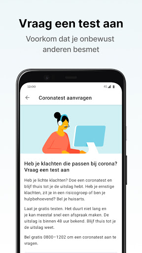

# CoronaMelder
App version ``1.1.1``

Analyzed with [covid-apps-observer](http://github.com/covid-apps-observer) project, version ``0.1``

## App overview
| | |
|-------------------------|-------------------------| 
| **Name**&nbsp;&nbsp;&nbsp;&nbsp;&nbsp;&nbsp;&nbsp;&nbsp;&nbsp;&nbsp;&nbsp;&nbsp;&nbsp;&nbsp;&nbsp;&nbsp;&nbsp;&nbsp;&nbsp;&nbsp;&nbsp;&nbsp;&nbsp;&nbsp;&nbsp;&nbsp;&nbsp;&nbsp;&nbsp;&nbsp;&nbsp;&nbsp;&nbsp;&nbsp;&nbsp;&nbsp;&nbsp;&nbsp;&nbsp;&nbsp;  | CoronaMelder |
| **Unique identifier** | nl.rijksoverheid.en |
| **Link to Google Play** | [https://play.google.com/store/apps/details?id=nl.rijksoverheid.en](https://play.google.com/store/apps/details?id=nl.rijksoverheid.en) |
| **Summary**  | Help de verspreiding van het coronavirus in Nederland te stoppen |
| **Privacy policy** | [https://coronamelder.nl/nl/privacy](https://coronamelder.nl/nl/privacy) |
| **Latest version** | 1.1.1 |
| **Last update** | 2020-11-27 18:04:17 |
| **Recent changes** | Dank je wel voor het gebruiken van CoronaMelder. Je helpt daarmee corona in Nederland te stoppen. Deze versie van CoronaMelder bevat tekstaanpassingen en kleine stabiliteitsverbeteringen. |
| **Installs**  | 1.000.000+ |
| **Category** | Medisch |
| **First release** | 10 aug. 2020 |
| **Size**  | 7,1M |
| **Supported Android version**  | 6.0 en hoger |

### Description
> CoronaMelder is de officiële corona notificatie-app van Nederland, ontwikkeld onder het toezicht van het Ministerie van Volksgezondheid, Welzijn en Sport. De app is een digitaal hulpmiddel bij het bron- en contactonderzoek door de GGD. 
 De app waarschuwt je nadat je in de buurt bent geweest van iemand met corona. Zo kun je jezelf en de mensen in je omgeving beschermen. En kunnen we samen het aantal besmettingen in Nederland zo laag mogelijk houden. Het gebruik van de app is vrijwillig. Niemand mag controleren of jij de app op je telefoon hebt. Maar hoe meer mensen de app gebruiken, hoe beter deze werkt. 
 Bij de ontwikkeling van deze app is rekening gehouden met toegankelijkheid, zie voor meer informatie onze toegankelijkheidsverklaring.
 Hoe werkt de app?
 # Je geeft alleen toegang tot je bluetoothgegevens
 CoronaMelder ziet via bluetooth wanneer je in de buurt bent van andere mensen met de app. De app gebruikt geen persoons- of locatiegegevens. De app weet dus niet wie je bent, waar je was en wie je hebt ontmoet.
 # Je krijgt een melding nadat je extra kans op besmetting hebt gelopen
 De app stuurt een melding als je minstens 15 minuten in de buurt bent geweest van iemand die later corona blijkt te hebben. Deze persoon moet ook de app gebruiken.
 # Je kunt anderen waarschuwen als je zelf besmet blijkt te zijn
 Ben je getest door de GGD en blijk je corona te hebben? Dan kun je samen met de GGD via de app een melding sturen naar de mensen bij wie je in de buurt bent geweest - in de periode dat je besmettelijk was. In deze melding staat alleen wanneer ze in de buurt zijn geweest van een besmet persoon. Niet wie of waar dit was.
 Hoe gaat de app met je gegevens om?
 • Je hoeft geen persoonsgegevens zoals je e-mailadres of naam in te voeren.
 • Als je iemand tegenkomt wisselen jullie telefoons via bluetooth willekeurige codes uit. Zo meet de app de duur en de afstand van het contact. In de codes staat niets over wie jullie zijn en waar jullie zijn geweest. 
 • De codes die je via bluetooth uitwisselt worden alleen op je telefoon bewaard en na 14 dagen verwijderd.
 • Gebruikers van de app zijn niet terug te vinden door de makers van de app, de overheid of andere gebruikers.

### User interface
The developers of the app provide the following screenshots in the Google play store.
| | | |
|:-------------------------:|:-------------------------:|:-------------------------:|
 |   |   |   | 
 |   |   |   | 

## Development team
In the following we report the main information provided by the development team in the Google play store.

| | |
|-------------------------|-------------------------|
| **Developer**  | Rijksoverheid |
| **Website**  | [https://coronamelder.nl/](https://coronamelder.nl/) |
| **Email** | helpdesk@coronamelder.nl |
| **Physical address**  | - |
| **Other developed apps**  | [https://play.google.com/store/apps/developer?id=Rijksoverheid](https://play.google.com/store/apps/developer?id=Rijksoverheid) |

## Android support

| | |
|-------------------------|-------------------------|
| **Declared target Android version**  | - |
| **Effective target Android version**  | - |
| **Minimum supported Android version**  | Marshmallow, version 6.0 (API level 23) |
| **Maximum target Android version**  | - |

The larger the difference between the minimum and maximum supported Android versions, the better. A larger difference means a wider audience. For example, old phones have a very low Android version, so a high minimum supported Android version means that the app cannot be used by users with old phones, thus leading to accessibility problems. 

## Requested permissions

In the following we report the complete list of the permissions requested by the app. 

| **Permission** | **Protection level** | **Description** | 
|-------------------------|-------------------------|-------------------------|
 **android.permission ACCESS_NETWORK_STATE** | Normal | Allows applications to access information about networks. 
 **android.permission BLUETOOTH** | Normal | Allows applications to connect to paired bluetooth devices. 
 **android.permission FOREGROUND_SERVICE** | Normal | Allows a regular application to use Service.startForeground. 
 **android.permission INTERNET** | Normal | Allows applications to open network sockets. 
 **android.permission RECEIVE_BOOT_COMPLETED** | Normal | Allows an application to receive the Intent.ACTION_BOOT_COMPLETED that is broadcast after the system finishes booting. 
 **android.permission REQUEST_IGNORE_BATTERY_OPTIMIZATIONS** | Normal | Permission an application must hold in order to use Settings.ACTION_REQUEST_IGNORE_BATTERY_OPTIMIZATIONS. 
 **android.permission WAKE_LOCK** | Normal | Allows using PowerManager WakeLocks to keep processor from sleeping or screen from dimming. 

## Mentioned servers

| **Server** | **Registrant** | **Registrant country** | **Creation date** | 
|-------------------------|-------------------------|-------------------------|-------------------------|
 | google.com | Google LLC | :us: US | 1997-09-15 04:00:00 |
 | coronamelder-dist.nl | - | - | 2020-07-20 00:00:00 |
 | coronamelder-api.nl | - | - | 2020-07-22 00:00:00 |

## Security analysis 

Below we report the main security warnings raised by our execution of the [Androwarn](https://github.com/maaaaz/androwarn) security analysis tool.

**Connection interfaces exfiltration**
> - This application reads details about the currently active data network 
> - This application tries to find out if the currently active data network is metered 

**Telephony services abuse**
> - This application makes phone calls 

**Suspicious connection establishment**
> - This application opens a Socket and connects it to the remote address '; port is out of range' on the 'N/A' port  
> - This application opens a Socket and connects it to the remote address 'Ljava/net/Proxy;->type()Ljava/net/Proxy$Type;' on the 'N/A' port  
> - This application opens a Socket and connects it to the remote address 'Ln/b/a/a/a;->G(Ljava/lang/String;)Ljava/lang/StringBuilder;' on the 'N/A' port  
> - This application opens a Socket and connects it to the remote address 'timeout' on the 'N/A' port  

## User ratings and reviews

Below we provide information about how end users are reacting to the app in terms of ratings and reviews in the Google Play store.

### Ratings

The CoronaMelder app has been installed by more than **1000000** times. At this time, **6328** rated the app and its average score is **3.0**. Below we show the distribution of the ratings across the usual star-based rating of Google Play

:star::star::star::star::star:: 2142

:star::star::star::star:: 707

:star::star::star:: 601

:star::star:: 765

:star:: 2113

### Reviews 

#### 5-star reviews

> Gewoon downloaden doe gewoon  :date: __2020-12-04 17:48:46__

> Aaldert van der Stouwe  :date: __2020-12-03 22:05:46__

> Kreeg vanmorgen melding dat ik 9dagen!! geleden in contact ben geweest met iemand die corona heeft. Zou volgens de richtlijnen nu nog 1 dag thuis moeten blijven en me laten testen na zo'n lange periode heeft wellicht nu ook niet meer zoveel zin. Waardoor krijg ik de melding zo laat?  :date: __2020-12-03 11:58:19__

> Naar behoren  :date: __2020-12-03 10:47:45__

> Kreeg net een melding van de app was in de buurt van iemand met Corona .de enige die ik weet wie redt heeft gehad is mijn man gelukkig heeft die geen corona.maar vanwaar die bericht nu  :date: __2020-12-03 08:11:14__

> Ik vindt het toppie😊😘i love it. M I C K I M O U S E O K É . D U S J A O F N E E  :date: __2020-12-02 16:10:42__

> Blijven netjes en schoon oa mondkapjes  :date: __2020-12-02 15:37:33__

> Baat het niet, dan schaadt het niet.  :date: __2020-12-02 11:15:14__

> Gelukkig nog geen ervaring maar ben wel blij dat het er is dat is al veel sterren waard. Groetjes Pietje  :date: __2020-12-01 04:39:38__

> Bittere noodzaak ter voorkoming van onnodige besmettingen.  :date: __2020-11-30 16:44:46__

#### 4-star reviews

> De app werkt goed. Jammer dat niet iedereen die app heeft zo zouden veel meer mensen weten of ze mogelijk besmet zijn geraakt. Als je een melding krijgt dat je mogelijk besmet bent geraakt op een dag, weet je nog NIET wanneer. Zou fijn zijn als ze een exactere tijd kunnen aangeven dat zou véél sneller terug te herleiden zijn. Het is te lang dat je pas na 15 minuten in contact bent geweest met iemand met corona je pas een melding krijgt. Je kan namelijk veel sneller besmet raken dan die 15 min.  :date: __2020-12-05 07:49:57__

> Top  :date: __2020-12-04 06:44:32__

> Vandaag pas geopend lijk me goed.  :date: __2020-12-03 21:19:50__

> Bij mogelijk Covid-19Besmetting, ook (advies voor) installeren CovidRadar-app van Lumc, daarmee kan men, bij een patientstatus-verandering, dit doorgeven, in betr app zou men ook VACCinnaties-met xxx moeten kunnen registreren. Als men last van HooiKoorts of andere onderliggendeZiektes heeft, kan men wel Zelf beoordelen of iets al-of-niet toch een Covid-19Symptoom is.  :date: __2020-12-03 04:33:26__

> App: CoronaMelder werkte niet op een \*\*\*\*\*\*\*\*\*\*.😷🚩 in de trein & bussen. tijden de reis. Dan maar de Motor pakken 😷\*\*\*\*\*\*\*\**.NL☠️🤖😎OMG.Den Bosch- Drunen.NL.App:CoronaM.Stagneerde:📲🚩👎.  :date: __2020-12-02 23:04:56__

> HEB net geinstaleerd  :date: __2020-12-01 18:59:13__

> De App ziet er goed uit en werkt nu ook samen met enkele andere Europese landen. Helaas nog niet met buurland België. En ondanks dat de winter in aantocht is, werkt de app helaas ook niet in Frankrijk, Zwitserland of Oostenrijk.  :date: __2020-12-01 08:06:20__

> Top app  :date: __2020-11-30 21:34:08__

> Onduidelijke werking. Hoe weet de app dat ik corona heb gehad...? Dank voor het antwoord. Na antwoord van 2 naar 4 sterren.  :date: __2020-11-30 10:20:21__

> De app werkt goed alleen jammer ik zit maand thuis v.w. me pols kreeg een melding en de dag erop mag ik naar buiten volgens de app en was niet ziek kom alleen buiten voor de hond en boodschappen anders zit ik binnen  :date: __2020-11-29 11:15:09__

#### 3-star reviews

> Bij "instellingen" is het mij volstrekt onduidelijk wat er gebeurt wanneer ik het schuifje op aan zet. Wel of geen wifi of wel geen mobiel gebruik.  :date: __2020-12-04 10:08:34__

> Ik kreeg gisteren een melding dat ik de dag ervoor in de buurt was geweest van een besmet persoon. Vraag me af of dat een valse melding geweest kan zijn. Ik ben die dag alleen in een bibliotheek en supermarkt geweest en heb echt met niemand nauw contact gehad of gesproken. En iedereen droeg mondkapjes. En hoe kan ik die melding krijgen al na 1 dag? Ik denk dat de app in bepaalde situaties zeker kan werken, maar nu vraag ik me af of ik voor niks ga testen of in quarantaine ga.  :date: __2020-12-03 08:29:05__

> Ik heb batterijoptimalisatie en dan heb je niet veel aan de app. Of ik moet dat uitzetten, maar dan loopt de batterij van mijn smartphone snel(ler) leeg. Gek, die app-functionaliteit, want de meeste moderne smartphone heeft batterijoptimalisatie. Ik denk dat ik de app er af haal.  :date: __2020-12-02 23:51:04__

> Eenmaal netjes een melding gekregen, maar daarna niet meer terwijl ik wel voor langere tijd bij iemand in de buurt ben geweest die later besmet leek te zijn. Werkt dus nog niet optimaal.. Reactie op antwoord rijksoverheid ^SD: zeker! Mijn collega's hebben de melding wel gekregen. Slechts ik niet, terwijl ik relatief gezien ook nog het dichtst bij desbetreffend persoon zat.  :date: __2020-12-02 14:00:58__

> App deed het prima, toen het nog niet landelijk dekkend was, kreeg ik iedere week een melding over hoeveel sleutels er verstuurd waren. Sinds de landelijke dekking nooit meer een bericht gehad. De laatste week om de haverklap een bericht dat de app niet goed werkt en gaat afsluiten.  :date: __2020-12-02 08:39:24__

> Niet duidelijk waar ik (na positieve) mij kan laten registreren zodat anderen gewaarschuwd worden.  :date: __2020-11-30 15:21:24__

> Ik merk niet een dat hij op mijn tel zin maar heb hem wel  :date: __2020-11-29 23:49:19__

> volgens mij reageert de app als volgt: Je telefoon krijgt bericht van een andere telefoon, die vlak bij jouw telefoon in de buurt is geweest. En die telefoon heeft ook weer bericht gekregen, etc etc. Maar waar begint dit dan?????????  :date: __2020-11-29 14:22:44__

> Ik wil graag de taal aanpassen, heb de app eerst in het Nederlands gedownload, maar kan nu niets vinden waar ik de taal aan zou kunnen passen.  :date: __2020-11-29 09:49:31__

> Hoe komt het dat ik regelmatig een bericht krijg dat mijn app de laatste 24 uur niet heeft gewerkt.  :date: __2020-11-28 13:55:22__

#### 2-star reviews

> Krijg steeds de melding dat de app 24 uur niet heeft gewerkt terwijl alles aanstaat zoals bluetooth  :date: __2020-12-05 08:30:45__

> Verwijderd. Crasht herhaaldelijk (Galaxy S8+).  :date: __2020-12-04 20:10:55__

> Al even krijg ik een melding over het probleem met mijn "batterij optimalisatie" waardoor de app niet goed zou werken, heb geen flauw idee wat er bedoeld wordt  :date: __2020-12-04 10:26:17__

> Waardeloze app niet compatibel met mijn toestel of sofware is niet up-to-date laat maar Nieuwe telefoon gekocht speciaal voor de voor de voor corona melder zal de rekening opsturen  :date: __2020-12-03 21:18:02__

> Ik wilde inloggen met digid om een test aan te vragen, maar ik kwam niet verder in het programma na het invullen van mijn digid. Ik heb het wel 10 keer geprobeerd en telkens moest ik mijn digid opnieuw invoeren. Toen heb ik maar gebeld.  :date: __2020-12-03 09:32:37__

> App stopt steeds...  :date: __2020-12-02 00:08:05__

> Ik wil de app alleen aanzetten als ik het huis verlaat, maar elke keer krijg ik die melding dat ik mijn GPS/bluetooth aan moet zetten. Ja, dat WEET ik na drieduizend keer wel! Heb al gekeken bij mijn instellingen, maar kan nergens deze herinneringsfunctie uitzetten. Sorry hoor, dan maar helemaal geen app.  :date: __2020-12-01 20:14:43__

> Ik heb het weer verwijderd. Het idee is goed maar de app wil te veel. Ik mag mijn batterij niet sparen, moet steeds met bluetooth rondlopen. Niet prettig,beide zijn energievretend zeker voor iets oudere telefoons.  :date: __2020-12-01 12:32:46__

> Als ik kijk naar de aantal sleutels en overeenkomsten heb ik al 2 keer gezien dat ik een overeenkomst heb gehad. Echter nooit meldingen ontvangen. Kortom werkt de app blijkbaar niet  :date: __2020-11-30 21:39:13__

> Snap niet op welke manier er gewaarschuwd wordt. Of moet je elke dag steeds op de app kijken? Die is altijd groen.  :date: __2020-11-29 16:14:09__

#### 1-star reviews

> de kans dat deze app zegt dat je met iemand in contact bent gekomen en je het ook hebt is \*\*\*\* klein dus ja ze verdienen er eigenlijk alleen maar geld mee😷🤒🥶  :date: __2020-12-05 14:23:31__

> Mijn moeder zit in een zorgtehuis voor mensen met vroege dementie/alzheimer. 2 mensen bleek besmet maar ik kreeg melding. Slechte zaak...  :date: __2020-12-05 09:11:15__

> App is niet betrouwbaar. Ik ben in het zelfde huis geweest voor meerdere uren en diegene is positief getest. Dit is niet aan mij gemeld via de app  :date: __2020-12-05 09:10:56__

> Je hebt er niks aan  :date: __2020-12-05 03:48:29__

> Ik kreeg vandaag een melding dat ik (of iig mijn mobiel) 11 dagen geleden (!) in de buurt ben geweest van iemand met corona. Ik had me vorig weekend (!) moeten laten testen of tot gisteren (!) thuis moeten blijven. Waarom krijg ik die melding pas vandaag?  :date: __2020-12-04 14:23:03__

> ik krijg van het begin al helemaal geen meldingen of iets dergelijks, dus ik ben blijkbaar tot nu toe geen corona geval tegen gekomen.  :date: __2020-12-04 13:25:22__

> Ik kan de App niet openen meer als ik hem open sluit de App meteen weer. Ik heb twee mee gemaakt dat de App afging sinsdien doet de App het niet meer.  :date: __2020-12-04 00:04:09__

> waardeloos  :date: __2020-12-03 20:39:56__

> Begin november ben ik naar het graf van mijn opa en oma geweest. Na 5 dagen kreeg ik een melding dat ik die zondag in aanraking ben geweest met iemand die corona heeft gehad. Schandalig dat het laat wordt aangegeven.  :date: __2020-12-03 19:27:22__

> Blokkeert wearables  :date: __2020-12-03 17:58:54__

