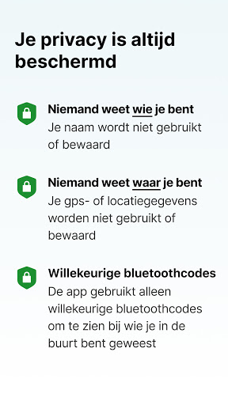
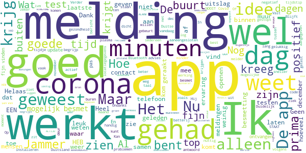
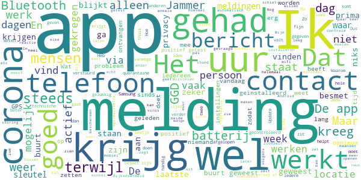
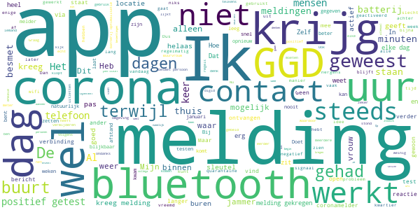

# CoronaMelder
App version ``1.1.2``

Analyzed with [covid-apps-observer](http://github.com/covid-apps-observer) project, version ``0.1``

## App overview
| | |
|-------------------------|-------------------------| 
| **Name**&nbsp;&nbsp;&nbsp;&nbsp;&nbsp;&nbsp;&nbsp;&nbsp;&nbsp;&nbsp;&nbsp;&nbsp;&nbsp;&nbsp;&nbsp;&nbsp;&nbsp;&nbsp;&nbsp;&nbsp;&nbsp;&nbsp;&nbsp;&nbsp;&nbsp;&nbsp;&nbsp;&nbsp;&nbsp;&nbsp;&nbsp;&nbsp;&nbsp;&nbsp;&nbsp;&nbsp;&nbsp;&nbsp;&nbsp;&nbsp;  | CoronaMelder |
| **Unique identifier** | nl.rijksoverheid.en |
| **Link to Google Play** | [https://play.google.com/store/apps/details?id=nl.rijksoverheid.en](https://play.google.com/store/apps/details?id=nl.rijksoverheid.en) |
| **Summary**  | Help de verspreiding van het coronavirus in Nederland te stoppen |
| **Privacy policy** | [https://coronamelder.nl/nl/privacy](https://coronamelder.nl/nl/privacy) |
| **Latest version** | 1.1.2 |
| **Last update** | 2020-12-14 14:51:12 |
| **Recent changes** | Dank je wel voor het gebruiken van CoronaMelder. Je helpt daarmee corona in Nederland te stoppen. Deze versie van CoronaMelder bevat tekstaanpassingen en kleine stabiliteitsverbeteringen. |
| **Installs**  | 1.000.000+ |
| **Category** | Medisch |
| **First release** | 10 aug. 2020 |
| **Size**  | 7,1M |
| **Supported Android version**  | 6.0 en hoger |

### Description
> CoronaMelder is de officiële corona notificatie-app van Nederland, ontwikkeld onder het toezicht van het Ministerie van Volksgezondheid, Welzijn en Sport. De app is een digitaal hulpmiddel bij het bron- en contactonderzoek door de GGD. 
 De app waarschuwt je nadat je in de buurt bent geweest van iemand met corona. Zo kun je jezelf en de mensen in je omgeving beschermen. En kunnen we samen het aantal besmettingen in Nederland zo laag mogelijk houden. Het gebruik van de app is vrijwillig. Niemand mag controleren of jij de app op je telefoon hebt. Maar hoe meer mensen de app gebruiken, hoe beter deze werkt. 
 Bij de ontwikkeling van deze app is rekening gehouden met toegankelijkheid, zie voor meer informatie onze toegankelijkheidsverklaring.
 Hoe werkt de app?
 # Je geeft alleen toegang tot je bluetoothgegevens
 CoronaMelder ziet via bluetooth wanneer je in de buurt bent van andere mensen met de app. De app gebruikt geen persoons- of locatiegegevens. De app weet dus niet wie je bent, waar je was en wie je hebt ontmoet.
 # Je krijgt een melding nadat je extra kans op besmetting hebt gelopen
 De app stuurt een melding als je minstens 15 minuten in de buurt bent geweest van iemand die later corona blijkt te hebben. Deze persoon moet ook de app gebruiken.
 # Je kunt anderen waarschuwen als je zelf besmet blijkt te zijn
 Ben je getest door de GGD en blijk je corona te hebben? Dan kun je samen met de GGD via de app een melding sturen naar de mensen bij wie je in de buurt bent geweest - in de periode dat je besmettelijk was. In deze melding staat alleen wanneer ze in de buurt zijn geweest van een besmet persoon. Niet wie of waar dit was.
 Hoe gaat de app met je gegevens om?
 • Je hoeft geen persoonsgegevens zoals je e-mailadres of naam in te voeren.
 • Als je iemand tegenkomt wisselen jullie telefoons via bluetooth willekeurige codes uit. Zo meet de app de duur en de afstand van het contact. In de codes staat niets over wie jullie zijn en waar jullie zijn geweest. 
 • De codes die je via bluetooth uitwisselt worden alleen op je telefoon bewaard en na 14 dagen verwijderd.
 • Gebruikers van de app zijn niet terug te vinden door de makers van de app, de overheid of andere gebruikers.

### User interface
The developers of the app provide the following screenshots in the Google play store.
| | | |
|:-------------------------:|:-------------------------:|:-------------------------:|
 |   |   |   | 
 |   |   |   | 

## Development team
In the following we report the main information provided by the development team in the Google play store.

| | |
|-------------------------|-------------------------|
| **Developer**  | Rijksoverheid |
| **Website**  | [https://coronamelder.nl/](https://coronamelder.nl/) |
| **Email** | helpdesk@coronamelder.nl |
| **Physical address**  | - |
| **Other developed apps**  | [https://play.google.com/store/apps/developer?id=Rijksoverheid](https://play.google.com/store/apps/developer?id=Rijksoverheid) |

## Android support

| | |
|-------------------------|-------------------------|
| **Declared target Android version**  | - |
| **Effective target Android version**  | - |
| **Minimum supported Android version**  | Marshmallow, version 6.0 (API level 23) |
| **Maximum target Android version**  | - |

The larger the difference between the minimum and maximum supported Android versions, the better. A larger difference means a wider audience. For example, old phones have a very low Android version, so a high minimum supported Android version means that the app cannot be used by users with old phones, thus leading to accessibility problems. 

## Requested permissions

In the following we report the complete list of the permissions requested by the app. 

| **Permission** | **Protection level** | **Description** | 
|-------------------------|-------------------------|-------------------------|
 **android.permission ACCESS_NETWORK_STATE** | Normal | Allows applications to access information about networks. 
 **android.permission BLUETOOTH** | Normal | Allows applications to connect to paired bluetooth devices. 
 **android.permission FOREGROUND_SERVICE** | Normal | Allows a regular application to use Service.startForeground. 
 **android.permission INTERNET** | Normal | Allows applications to open network sockets. 
 **android.permission RECEIVE_BOOT_COMPLETED** | Normal | Allows an application to receive the Intent.ACTION_BOOT_COMPLETED that is broadcast after the system finishes booting. 
 **android.permission REQUEST_IGNORE_BATTERY_OPTIMIZATIONS** | Normal | Permission an application must hold in order to use Settings.ACTION_REQUEST_IGNORE_BATTERY_OPTIMIZATIONS. 
 **android.permission WAKE_LOCK** | Normal | Allows using PowerManager WakeLocks to keep processor from sleeping or screen from dimming. 

## Mentioned servers

| **Server** | **Registrant** | **Registrant country** | **Creation date** | 
|-------------------------|-------------------------|-------------------------|-------------------------|
 | google.com | Google LLC | :us: US | 1997-09-15 04:00:00 |
 | coronamelder-dist.nl | - | - | 2020-07-20 00:00:00 |
 | coronamelder-api.nl | - | - | 2020-07-22 00:00:00 |
 | android.com | Google LLC | :us: US | 1997-06-23 04:00:00 |

## Security analysis 

Below we report the main security warnings raised by our execution of the [Androwarn](https://github.com/maaaaz/androwarn) security analysis tool.

**Connection interfaces exfiltration**
> - This application reads details about the currently active data network 
> - This application tries to find out if the currently active data network is metered 

**Telephony services abuse**
> - This application makes phone calls 

**Suspicious connection establishment**
> - This application opens a Socket and connects it to the remote address '; port is out of range' on the 'N/A' port  
> - This application opens a Socket and connects it to the remote address 'Ljava/net/Proxy;->type()Ljava/net/Proxy$Type;' on the 'N/A' port  
> - This application opens a Socket and connects it to the remote address 'Ln/b/a/a/a;->F(Ljava/lang/String;)Ljava/lang/StringBuilder;' on the 'N/A' port  
> - This application opens a Socket and connects it to the remote address 'timeout' on the 'N/A' port  

## User ratings and reviews

Below we provide information about how end users are reacting to the app in terms of ratings and reviews in the Google Play store.

### Ratings

The CoronaMelder app has been installed by more than **1000000** times. At this time, **6616** rated the app and its average score is **3.0706923**. Below we show the distribution of the ratings across the usual star-based rating of Google Play

:star::star::star::star::star:: 2349

:star::star::star::star:: 779

:star::star::star:: 662

:star::star:: 643

:star:: 2183

### Reviews 

#### 5-star reviews

> Ik heb de broncode kort ingezien: ziet er goed uit :)  :date: __2021-01-22 12:21:56__

> Goed voel me er toch veilig mee dank  :date: __2021-01-22 00:03:55__

> Werkt goed en heeft zijn werk gedaan  :date: __2021-01-21 22:52:09__

> Als medewerker BCO (bron- en contactonderzoek) ben ik helemaal vóór deze app. Dit draagt niet alleen bij aan mijn werkzaamheden maar vooral aan de bestrijding van "het virus". Dus alsjeblieft: download deze app, het is geheel anoniem (alle opgeslagen gegevens zijn anoniem en worden na 14 dagen verwijderd) en daarnaast kan ik meer mensen per dag bereiken voor contactonderzoek omdat ik minder informatie hoef te geven. (kanttekening: advies van de GGD gaat boven wat de app aangeeft!)  :date: __2021-01-21 03:08:07__

> App nu voor de derde keer moeten installeren. Het lijkt in eerste instantie goed te werken, maar na een dag of 2 kan ik de app niet meer openen. Edit: na de tip van de ontwikkelaar werkt de app stabiel. Dank!  :date: __2021-01-20 19:59:56__

> Na opnieuw installeren weer helemaal actief. Kreeg netjes een reactie met oplossing nav mijn eerdere beoordeling. Nog geen melding via de app gekregen, dat is ook fijn ! Stay safe allemaal.  :date: __2021-01-20 15:54:32__

> Waarom is deze app nog steeds niet verplicht voor iedereen. Zo werkt het niet  :date: __2021-01-20 15:42:47__

> Nergens last van vreet geen accu en kan al mijn divices gebruiken hopelijk hebben we hem snel niet meer nodig  :date: __2021-01-19 14:25:01__

> Geweldig  :date: __2021-01-17 14:03:19__

> Goed  :date: __2021-01-17 00:02:20__

#### 4-star reviews

> Nog geen melding gehad gelukkig. Maar meer reclame zou ik fijn vinden want eigenlijk moet iedereen de App downloaden.  :date: __2021-01-22 18:29:47__

> IK WEET HET, WANT IK HtuEB NU EEN APP WAARONDERui STAAT RINGTONE,MAAR HAD HEM ALTIJD AANSTAAN MAAR IK HEB NOOIT EEN ALARM GEKREGEN. (IK WEET DE REGELS).groet uit Leiden😉  :date: __2021-01-22 10:22:30__

> Gisteren mijn eerste melding van de app gehad dat ik de dag ervoor langer dan 15 minuten in contact ben geweest. Die dag niet de deur uit geweest. Achteraf blijkt de bron bij de buren te liggen. Positief dat de registratie goed werkt. Wat minder dat een signaal door de muur tussen 2 woningen ook nog wordt opgepikt. Blijft lastig om met Bluetooth een goede afstand te bepalen.  :date: __2021-01-21 10:07:55__

> Ik heb geen corona dus ik vind het top  :date: __2021-01-18 16:46:49__

> 👍🏻  :date: __2021-01-18 16:05:29__

> Wat een top app!  :date: __2021-01-17 00:19:03__

> Als je eenmaal begrijpt hoe het werkt is het een prima app. Helaas is hij een paar dagen geleden gestopt te checken met de server. Althans, het lijstje met log van de checks met de server is verdwenen.  :date: __2021-01-16 07:25:00__

> Duidelijk  :date: __2021-01-15 12:58:18__

> Ik heb een melding gehad dat ik bij iemand met corona in de buurt ben geweest. Op die dag echter alleen vrijwel uitgesloten dat ik 15 minuten aaneengesloten te dicht bij wie dan ook ben geweest die besmet is. Nu in afwachting van de uitslag van de test binnen uiteraard, maar heb wel vragen hoe exact het algoritme is dat bepaalt of je 15 minuten aaneengesloten op een dag te dicht bij iemand bent geweest...  :date: __2021-01-15 10:23:03__

> Heel goed dat het zo kan mijn dank.  :date: __2021-01-13 12:30:23__

#### 3-star reviews

> matige app, die 15min heeft geen nut, dat moet 1min worden, als ik iemand praat in winkel of opstraat 10min en dr na knuffel geef en uitelkaar zegt de app niets als blijkt dat een van beide n week later besmet blijkt. klopt ma gezien weinig dit doen zou een aanpassing in de app wel es meer effect kunnen gaan geven, dan de 1500 die nu maar gevonden zijn en cijfers nog steeds omhoog gaan. tevens worden mensen dan ook waakzame, mijn app heeft nog nooit wat getoond, bij ja maar ook twijfelend  :date: __2021-01-21 14:00:06__

> Van familieleden die Corona hebben gehad weet ik dat de app prima werkt. (Dit voor iedereen die twijfelt aan de app) Helaas krijg ik zelf steeds de foutmelding dat de app 24 uur niet actief is geweest omdat mijn telefoon een "batterij besparing programma" heeft. Hoe ik de instelling ook aanpas. Hij blijft deze boodschap geven. Ik heb zojuist de app verwijderd en opnieuw geïnstalleerd. Wellicht helpt dat.  :date: __2021-01-21 11:07:20__

> Nog geen enkele melding gehad, op zich gelukkig maar, maar zou het wel fijn vinden af en toe een controle bericht te krijgen zodat ik weet dat die nog wel actief is. (benieuwd of ik ook een bericht terug krijg over baterij besparing) die staat nooi aan bij mij 😂  :date: __2021-01-20 13:48:40__

> Matige app, zou een optie moeten zijn om via GPS te werken, hoezo krijgen mensen niet de optie tot een betere app via de Rijksoverheid? Ik kan zelf wel bepalen wat ik met m'n privacy wil doen, ik vind specifieke informatie belangrijker.  :date: __2021-01-20 07:31:06__

> Theorie lijkt goed, maar ik krijg steeds de melding dat er niet gecontroleerd jan worden. Laatste controle is inmiddels van 22 oktober. Zo schiet het niet op. Het probleem dat er niet gecontroleerd kon worden leek opgelost, maar sinds 1 januari krijg ik telkens weer de melding dat er 24 uur niet gecontroleerd kon worden en dat terwijl de batterijbesparing gewoon uit staat en ik geen instellingen heb veranderd. Een screenshot delen lukt helaas ivm beveiligingsbeleid geblokkeerd.  :date: __2021-01-19 13:28:12__

> Jammer dat er door de ggd als je positief wordt getest niet wordt gevraagd of je de app hebt zodat er melding verstuurd kan worden waarom heb ik de app dan?  :date: __2021-01-18 11:50:01__

> Is er geen ruik en test uit slag en mogelijk heden  :date: __2021-01-17 12:39:49__

> Fijn dat er zo,n op is maar hij heeft bijna constant technische problemen niet echt handig voor een app die mensen moet helpen te beschermen tegen corona dus overheid nog werk aan de winkel  :date: __2021-01-17 06:59:44__

> Deze app heeft het probleem dat hij uitvalt voor 24-uur terwijl ik wel goede verbinding heb niet constant maar wel vaak genoeg om de app weer automatisch te laten starten Deze app is up to date ben zeer streng in het updaten  :date: __2021-01-14 18:55:59__

> Kreeg zojuist een melding dat de app 24 uur lang niet actief was! De app heb ik niet bewust uitgezet. Waarom krijg k dan deze melding pas na 24 uur en niet al na een uur?  :date: __2021-01-13 22:04:22__

#### 2-star reviews

> Ik merk dat achter een VPN verbinding dat ik elke dag een melding krijg dat 24 uur lang geen gegevens uitgewisseld kunnen worden.  :date: __2021-01-22 11:54:39__

> Constant krijg ik een melding dat de app niet actief is terwijl mijn bluetooth gewoon aan staat. Daarnaast moet ik mijn batterij spaarstand uit zetten anders geeft het aan dat de app niet goed functioneert. Je zou denken dat je er zo min mogelijk omkijken naar hebt tot je in contact bent geweest. Graag zo snel mogelijk oplossen.  :date: __2021-01-21 12:31:47__

> Zelf positief getest , doorgeven via GGD met sleutel.. mensen met wie ik contact had die ook de app hebben, hebben geen melding gehad.  :date: __2021-01-21 11:07:58__

> Ik baal erg van de alerts iedere keer bij het uitzetten van GPS of Bluetoothz ik heb dit vaak nodig kan dit helaas niet uitzetten ik verwijder de app dan maar  :date: __2021-01-19 23:11:45__

> Het signaal gaat dwars door muren en plafonds heen. Mijn app werd geactiveerd omdat ik corona had en de halve flat kreeg een melding ondanks dat ik de meeste van die mensen al in geen weken daadwerkelijk tegen gekomen ben. Zelfs mensen twee verdiepingen boven me kregen de melding. Wat een ruk manier om erachter te komen dat mijn Bluetooth beter bereik heeft dan mijn WiFi 🙄  :date: __2021-01-18 17:12:07__

> Geen idee wat deze app toevoegt bij het terugdringen van het coronavirus. Ik kan niet aangeven, dat ik voor zover ik weet niet ben besmet ook al omdat dit soort testen nog niet worden uitgevoerd. Drie sterren is nog te veel.  :date: __2021-01-18 15:43:08__

> Ik hebt de app, maar merkt niks. Doet hij het wel.  :date: __2021-01-18 15:06:53__

> Ik krijg meldingen van mogelijke besmettingen terwijl ik nergens ben geweest die dag. Jammer  :date: __2021-01-18 15:01:09__

> Buurvrouw 15 meter verderop heeft corona (en ook de app). Verder niet bij haar in de buurt geweest. Geen andere mensen met een app hier thuis geweest, en toch krijg ik een melding. Ik dacht dat ook de bluetooth afstandsinformatie verwerkte... blijkbaar niet...  :date: __2021-01-18 10:12:14__

> Nvt  :date: __2021-01-17 14:21:38__

#### 1-star reviews

> Krijg steeds de melding, dat de 24 uur niet heeft kunnen controleren. Mobiele data staat aan.  :date: __2021-01-22 17:58:45__

> Waardeloos hij werkt Niet!!!  :date: __2021-01-22 05:53:18__

> Werkt. Weer niet weer iets wat hugo niet goed kan en als ik mijn blouthoot boks aanzet krijg. Ik contsand een melding nee slechte app  :date: __2021-01-22 00:33:16__

> Drama  :date: __2021-01-21 17:21:13__

> Krijg iedere keer melding :technische problemen werkt app niet: Ga deze ook verwijderen. Zonde van mijn tijd.  :date: __2021-01-21 15:26:27__

> Hij is veel te vaak inactief! Heel slecht!  :date: __2021-01-21 00:35:01__

> Corona gehad (gelukkig hersteld) om sleutel gevraagd, van geen enkele instantie gekregen. Lekker bezig  :date: __2021-01-20 22:56:41__

> Heb twee uur bij iemand met (naar later bleek) corona had. Deze had de app ook. Via contact onderzoek moet ik in quarantaine maar nooit een melding van de app gehad Hallo Rijksoverheid, ja die sleutel is opgevraagd. Beide telefoons hebben vlakblij elkaar gelegen en beiden bluetooth aan Dus ik had echt een melding moeten hebben en die niet gekregen Hallo Rijksoverheid, ik heb het nagevraagd. Dat heeft ze inderdaad gedaan. Haar collega's met wie ze dienst had gehad hebben wel een melding gehad hoorde ik vandaag. Dus het probleem moet in mijn app zitten.  :date: __2021-01-20 21:34:00__

> Al sinds het begin deze app gebruikt. Nog nooit een melding gehad. Is dat nu mazzel of is de app niet effectief omdat de melding niet wordt ingevoerd door al die met corona besmette mensen?  :date: __2021-01-20 14:53:49__

> Werkt niet na behoren kan niet meer zien of ik de buurt ben geweest die carona had kan de bleu toon codes niet. Meer bekijken  :date: __2021-01-20 04:16:42__

