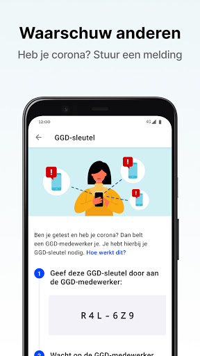
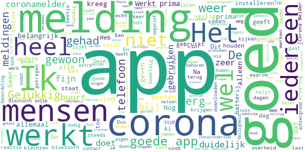
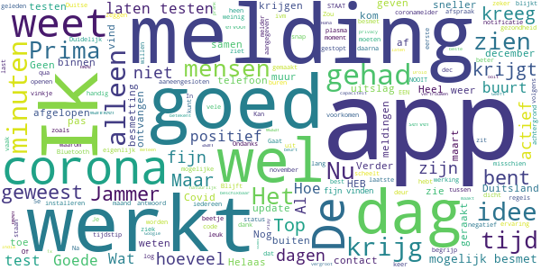
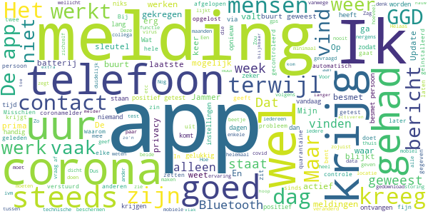
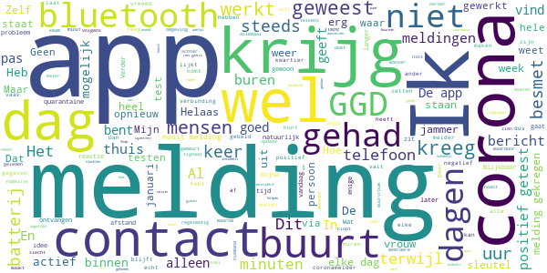
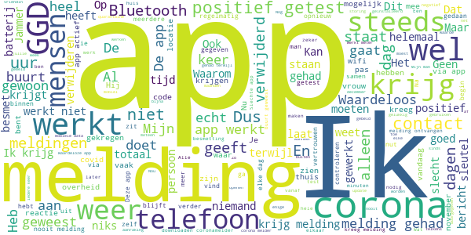

# CoronaMelder
App version ``1.2.3``

Analyzed with [covid-apps-observer](http://github.com/covid-apps-observer) project, version ``0.1``

## App overview
| | |
|-------------------------|-------------------------| 
| **Name**&nbsp;&nbsp;&nbsp;&nbsp;&nbsp;&nbsp;&nbsp;&nbsp;&nbsp;&nbsp;&nbsp;&nbsp;&nbsp;&nbsp;&nbsp;&nbsp;&nbsp;&nbsp;&nbsp;&nbsp;&nbsp;&nbsp;&nbsp;&nbsp;&nbsp;&nbsp;&nbsp;&nbsp;&nbsp;&nbsp;&nbsp;&nbsp;&nbsp;&nbsp;&nbsp;&nbsp;&nbsp;&nbsp;&nbsp;&nbsp;  | CoronaMelder |
| **Unique identifier** | nl.rijksoverheid.en |
| **Link to Google Play** | [https://play.google.com/store/apps/details?id=nl.rijksoverheid.en](https://play.google.com/store/apps/details?id=nl.rijksoverheid.en) |
| **Summary**  | Help de verspreiding van het coronavirus in Nederland te stoppen |
| **Privacy policy** | [https://coronamelder.nl/nl/privacy](https://coronamelder.nl/nl/privacy) |
| **Latest version** | 1.2.3 |
| **Last update** | 2021-02-10 09:22:25 |
| **Recent changes** | Dank je wel voor het gebruiken van CoronaMelder. Je helpt daarmee corona in Nederland te stoppen. Deze update bevat de functie om de app te pauzeren. Pauzeer de app alleen in situaties waarin je telefoon dicht bij telefoons van anderen komt, maar er geen kans op besmetting is. |
| **Installs**  | 1.000.000+ |
| **Category** | Medisch |
| **First release** | 10 aug. 2020 |
| **Size**  | 7,1M |
| **Supported Android version**  | 6.0 en hoger |

### Description
> CoronaMelder is de officiële corona notificatie-app van Nederland, ontwikkeld onder het toezicht van het Ministerie van Volksgezondheid, Welzijn en Sport. De app is een digitaal hulpmiddel bij het bron- en contactonderzoek door de GGD. 
 De app waarschuwt je nadat je in de buurt bent geweest van iemand met corona. Zo kun je jezelf en de mensen in je omgeving beschermen. En kunnen we samen het aantal besmettingen in Nederland zo laag mogelijk houden. Het gebruik van de app is vrijwillig. Niemand mag controleren of jij de app op je telefoon hebt. Maar hoe meer mensen de app gebruiken, hoe beter deze werkt. 
 Bij de ontwikkeling van deze app is rekening gehouden met toegankelijkheid, zie voor meer informatie onze toegankelijkheidsverklaring.
 Hoe werkt de app?
 # Je geeft alleen toegang tot je bluetoothgegevens
 CoronaMelder ziet via bluetooth wanneer je in de buurt bent van andere mensen met de app. De app gebruikt geen persoons- of locatiegegevens. De app weet dus niet wie je bent, waar je was en wie je hebt ontmoet.
 # Je krijgt een melding nadat je extra kans op besmetting hebt gelopen
 De app stuurt een melding als je minstens 15 minuten in de buurt bent geweest van iemand die later corona blijkt te hebben. Deze persoon moet ook de app gebruiken.
 # Je kunt anderen waarschuwen als je zelf besmet blijkt te zijn
 Ben je getest door de GGD en blijk je corona te hebben? Dan kun je samen met de GGD via de app een melding sturen naar de mensen bij wie je in de buurt bent geweest - in de periode dat je besmettelijk was. In deze melding staat alleen wanneer ze in de buurt zijn geweest van een besmet persoon. Niet wie of waar dit was.
 Hoe gaat de app met je gegevens om?
 • Je hoeft geen persoonsgegevens zoals je e-mailadres of naam in te voeren.
 • Als je iemand tegenkomt wisselen jullie telefoons via bluetooth willekeurige codes uit. Zo meet de app de duur en de afstand van het contact. In de codes staat niets over wie jullie zijn en waar jullie zijn geweest. 
 • De codes die je via bluetooth uitwisselt worden alleen op je telefoon bewaard en na 14 dagen verwijderd.
 • Gebruikers van de app zijn niet terug te vinden door de makers van de app, de overheid of andere gebruikers.

### User interface
The developers of the app provide the following screenshots in the Google play store.
| | | |
|:-------------------------:|:-------------------------:|:-------------------------:|
 |   |   |   | 
 |   |   |   | 

## Development team
In the following we report the main information provided by the development team in the Google play store.

| | |
|-------------------------|-------------------------|
| **Developer**  | Rijksoverheid |
| **Website**  | [https://coronamelder.nl/](https://coronamelder.nl/) |
| **Email** | helpdesk@coronamelder.nl |
| **Physical address**  | - |
| **Other developed apps**  | [https://play.google.com/store/apps/developer?id=Rijksoverheid](https://play.google.com/store/apps/developer?id=Rijksoverheid) |

## Android support

| | |
|-------------------------|-------------------------|
| **Declared target Android version**  | - |
| **Effective target Android version**  | - |
| **Minimum supported Android version**  | Marshmallow, version 6.0 (API level 23) |
| **Maximum target Android version**  | - |

The larger the difference between the minimum and maximum supported Android versions, the better. A larger difference means a wider audience. For example, old phones have a very low Android version, so a high minimum supported Android version means that the app cannot be used by users with old phones, thus leading to accessibility problems. 

## Requested permissions

In the following we report the complete list of the permissions requested by the app. 

| **Permission** | **Protection level** | **Description** | 
|-------------------------|-------------------------|-------------------------|
 **android.permission ACCESS_NETWORK_STATE** | Normal | Allows applications to access information about networks. 
 **android.permission BLUETOOTH** | Normal | Allows applications to connect to paired bluetooth devices. 
 **android.permission FOREGROUND_SERVICE** | Normal | Allows a regular application to use Service.startForeground. 
 **android.permission INTERNET** | Normal | Allows applications to open network sockets. 
 **android.permission RECEIVE_BOOT_COMPLETED** | Normal | Allows an application to receive the Intent.ACTION_BOOT_COMPLETED that is broadcast after the system finishes booting. 
 **android.permission REQUEST_IGNORE_BATTERY_OPTIMIZATIONS** | Normal | Permission an application must hold in order to use Settings.ACTION_REQUEST_IGNORE_BATTERY_OPTIMIZATIONS. 
 **android.permission WAKE_LOCK** | Normal | Allows using PowerManager WakeLocks to keep processor from sleeping or screen from dimming. 

## Mentioned servers

| **Server** | **Registrant** | **Registrant country** | **Creation date** | 
|-------------------------|-------------------------|-------------------------|-------------------------|
 | google.com | Google LLC | :us: US | 1997-09-15 04:00:00 |
 | coronamelder-dist.nl | - | - | 2020-07-20 00:00:00 |
 | coronamelder-api.nl | - | - | 2020-07-22 00:00:00 |
 | android.com | Google LLC | :us: US | 1997-06-23 04:00:00 |

## Security analysis 

Below we report the main security warnings raised by our execution of the [Androwarn](https://github.com/maaaaz/androwarn) security analysis tool.

**Connection interfaces exfiltration**
> - This application reads details about the currently active data network 
> - This application tries to find out if the currently active data network is metered 

**Telephony services abuse**
> - This application makes phone calls 

**Suspicious connection establishment**
> - This application opens a Socket and connects it to the remote address '; port is out of range' on the 'N/A' port  
> - This application opens a Socket and connects it to the remote address 'Ljava/net/Proxy;->type()Ljava/net/Proxy$Type;' on the 'N/A' port  
> - This application opens a Socket and connects it to the remote address 'Ln/b/a/a/a;->G(Ljava/lang/String;)Ljava/lang/StringBuilder;' on the 'N/A' port  
> - This application opens a Socket and connects it to the remote address 'timeout' on the 'N/A' port  

## User ratings and reviews

Below we provide information about how end users are reacting to the app in terms of ratings and reviews in the Google Play store.

### Ratings

The CoronaMelder app has been installed by more than **1000000** times. At this time, **7426** rated the app and its average score is **2.9681697**. Below we show the distribution of the ratings across the usual star-based rating of Google Play

:star::star::star::star::star:: 2482

:star::star::star::star:: 827

:star::star::star:: 729

:star::star:: 748

:star:: 2640

### Reviews 

#### 5-star reviews

> Volgens mij wel prima... Nog geen meldingen gehad.  :date: __2021-03-03 12:35:11__

> heel duidelijk oke  :date: __2021-03-01 16:22:57__

> Werkt prima, staat gewoon constant aan sinds de app erop staat. Ook iedere update wordt duidelijk toegelicht. Ik denk dan ook dat alle mensen die 1 ster geven eerst maar eens moeten kijken of alles goed is ingesteld op de eigen telefoon, voor ze de app de volle laag geven.  :date: __2021-02-25 20:46:39__

> App doet het inmiddels beter op mijn telefoon.  :date: __2021-02-25 15:24:53__

> Het lijkt mij goed.  :date: __2021-02-25 12:24:28__

> Ik heb nog geen ervaringen met de app omdat ik nog geen meldingen heb gehad. Gelukkig maar. Maar het lijkt mij heel zinvol dat iedereen gebruik maakt van deze app. Het kan ons allemaal helpen.  :date: __2021-02-24 20:55:03__

> Ik ben dik tevreden met deze CoronaMelder.... Gelukkig tot aan heden geen meldingen gehad.... Het geeft je in ieder heval een stukje gemoedsrust, wetend wanneer wel of niet iemand dicht bij jou besmet is... mijn complimenten....  :date: __2021-02-21 09:40:00__

> App werkt prima, jammer dat veel negatieve reacties komen van mensen die niet weten hoe de app werkt. Men gaat er blijkbaar vanuit dat de app "kan ruiken" als iemand in de buurt besmet is. Zolang iemand die besmet is dit niet deelt in de Corona App, zal niemand die bij hem/haar in de buurt was met de Corona app daar een melding van krijgen. Ik werk zelf in het OV, ik kom met veel mensen in contact en heb pas 1 keer een melding gehad, dus blijkbaar wordt er niet genoeg gedeeld in de Corona App.  :date: __2021-02-21 09:39:49__

> super goede app  :date: __2021-02-20 20:55:24__

> Prima app, nog geen melding gehad gelukkig maar hij checkt op de achtergrond als je deze uitleest via de API via Instellingen in je Android toestel.  :date: __2021-02-19 12:02:52__

#### 4-star reviews

> Ik snap iets niet ik krijg 3 maart een melding dat ik mij moet laten testen omdat ik 1 maart in de beurt ben geweest van iemand met corona heb een afspraak gemaakt voor 5 maart blijkt dat ik me nu de 5e dag of daarna nog een keer moet laten testen waarom maakt men dan niet meteen een afspraak op de 5e dag of daarna dat scheelt toch 1 x testen en vergroot toch de capaciteit en scheelt mij 1x testen  :date: __2021-03-05 11:23:09__

> Haha beste prank ooit  :date: __2021-02-11 12:04:38__

> Geeft soms aan niet actief te zijn geweest de afgelopen dag. Ik weet niet wat dat betekent en hoe dat voorkomen kan worden.  :date: __2021-02-10 14:30:47__

> Prima, maar door Google Play is deze natuurlijk niet te vertrouwen qua privacy. India, Duitsland en de V.S. hebben hun app ook in F-Droid beschikbaar gemaakt. Waarom deze niet?  :date: __2021-02-10 11:47:53__

> Tja app is goed. Heb hem al n hele tijd  :date: __2021-02-06 18:19:23__

> Na vele pogingen via een omweg is het toch 🤞 gelukt om de app opnieuw te installeren  :date: __2021-02-05 12:22:01__

> In de eerste variant kon je zien hoeveel mensen om je heen waren gescanned. Nu zie je dat niet meer. Je hebt maar een vinkje dat de app actief is. Ik vond het eigenlijk heel fijn om te zien hoeveel mensen waren er gecheckt. Hoort het nu zo te zijn, zonder aantal gecheckte mensen maar alleen dat vinkje? Verder heb ik geen last van de app, hij werkt in de achtergrond, je krijgt misschien 1keer per week een notificatie over de status van de app en de batterij loopt niet sneller leeg. Top! 👍  :date: __2021-02-04 08:54:11__

> Vraagje: Gaat de coronamelder aangepast worden op de hogere besmettelijkheid van de Britse coronavariant? Hier heb ik Hugo de Jonge nog niets over horen zeggen in de persconferenties.  :date: __2021-02-02 19:32:52__

> Werk,t goed  :date: __2021-02-01 13:55:25__

> 👍🏻  :date: __2021-01-28 17:28:21__

#### 3-star reviews

> Hoi, heb deze app gedownload om te laten weten aan mijn omgeving dat ik positief getest ben op Covid-19.... Alleen kan ik nergens in de App vinden hoe ik dit moet aangeven.... Alleen hoe je een test kunt aanvragen.... Deze heb ik gehad, is er een manier om het alsnog later in te vullen? Grt Sebastiaan  :date: __2021-03-05 12:05:37__

> Misschien handig om toe te voegen als de telefoon even trilt als het een andere telefoon met coronamelder-app registreert voor bijv. langer dan 5 seconden. Dan weet je dat als je telefoon níet heeft getrild je extra alert moet zijn als je vlak bij iemand bent,die het -blijkbaar- minder nauw neemt met de corona-maatregelen.  :date: __2021-03-05 08:51:50__

> Bij mij in Grave N.B. geeft de melder steeds dat hij niets kan scannen.  :date: __2021-03-04 17:47:30__

> Voor zo'n essentiële app krijg ik erg vaak meldingen dat hij uit is gevallen en de afgelopen 24 uur niet heeft kunnen meten.  :date: __2021-02-28 11:31:17__

> Laatste tijd vaak technische storing en dan werkt de app 24 uur niet. Wat heb je dan aan die app???  :date: __2021-02-28 10:21:30__

> Valt elke dag uit.  :date: __2021-02-26 20:04:18__

> Stopt iedere keer  :date: __2021-02-26 17:11:16__

> Mijn app valt steeds in technische storing. Ik moet steeds opnieuw activeren. (alles ingeschakeld - (mobiele netwerken en bluethooth)) Zojuist afgemeld en opnieuw geïnstalleerd in de hoop dat het nu is opgelost.  :date: __2021-02-25 13:23:23__

> İk kom er achter dat de coronamelder inactief was omdat ik batterij besparng aan had staan. Bijzonder dat dit niet wordt aangegeven door de app. ik zag het omdat ik de app opende. Zou goed zijn dit bekend te maken want wellicht zijn hierdoor meer inactief  :date: __2021-02-25 05:33:58__

> Valt steeds uit, oorzaak wordt niet genoemd  :date: __2021-02-23 23:19:38__

#### 2-star reviews

> Ik vind t heel vreemd. 14 dagen terug blijk ik in contact te zijn geweest met iemand die positief is. 14 dagen later krijg ik bericht van de corona app. Ik heb geen klachten gelukkig. Ik bel de ggd en die zegt als u besmet bent had u dit al na 5 dagen moeten merken. Waarom krijg ik dit bericht dan zo laat? Geen idee zeggen ze. U hoeft zich geen zorgen te maken. Nou ik vind dit best vreemd dus. Wel rade ze aan om me te laten testen. Nou ik ben in de war nu zeg maar.  :date: __2021-03-06 11:01:48__

> gemiddeld een paar keer per week melding dat de app niet heeft gewerkt. kwalijk.  :date: __2021-03-05 22:56:38__

> Batterij loopt met deze app binnen no time leeg. Echt jammer, aan zich werkt de app namelijk goed volgens mij.  :date: __2021-03-03 14:57:32__

> De app heeft het een poosje goed gedaan maar nu moet ik het elke keer weer toestemming geven omdat het niet actief was. Kan er dus niet van op aan. Dit was na de laatste update.  :date: __2021-03-02 16:10:50__

> De app valt vaak uit, ik heb er geen vertrouwen meer in. Dit gebeurt dagelijks, hoezo als ik de batterij van de telefoon oplaad schakelt de app uit? Wat een onzin. Heb de telefoon de hele dag op zak en laad hem in de nacht op dus wat is het probleem?  :date: __2021-02-24 23:35:56__

> Heb een tijd maar krijg. Nooit een melding ondanks dat ik vaak in het ziekenhuis kom en dat zijn de plaatsen waar het heerst.  :date: __2021-02-23 08:37:55__

> Deze app geeft meldingen als je niet fysiek in de buurt bent van iemand met corona. (Door muren heen). Geeft daarom veel onrust ipv veilig gevoel. Ik schakel weer over op gezond verstand.  :date: __2021-02-20 11:00:13__

> Als je VPN op je mobiel hebt aanstaan dan werkt de app niet goed. Het zou handig zijn als dat ergens wordt toegelicht.  :date: __2021-02-20 09:36:48__

> Krijg regelmatig een bericht dat er technische problemen zijn en miet hem dan opnieuw activ5  :date: __2021-02-16 09:36:39__

> Nog nooit melding van gehad dat ik bij mogelijk besmette mensen in de buurt ben geweest. Daarnaast kon ik niets meer met Bluetooth, deze app blokkeert alles... En als blauwtand wel werkte erg instabiel... Bijvoorbeeld smartwach die ik handmatig moet synchroniseren en meldingen op watch komen niet door. App verwijderd en het lijkt weer normaal Bluetooth.  :date: __2021-02-16 00:21:39__

#### 1-star reviews

> Niet downloaden!  :date: __2021-03-06 00:08:07__

> Ik heb corona en zit thuis alleen de app ziet mij niet als positief getest dus hij faalt, heb ook nooit een melding ontvangen,, lijkt me een mislukking  :date: __2021-03-05 20:20:50__

> Zie alleen maar uitleg, maar weet niet welke registraties er zijn geweest. Weet niet wat ik met deze app aanmoet.  :date: __2021-03-05 17:40:11__

> laat maar  :date: __2021-03-05 12:11:56__

> Waardeloos. Krijg regelmatig melding, dat de app 24 uur niet gewerkt heeft??  :date: __2021-03-05 11:57:46__

> Belachelijke app. Ik ben positief getest en geef code aan ggd, maar de ggd heeft geen code terug. "Als je wilt maar het is niet nodig. Dus nutteloze app.  :date: __2021-03-04 12:14:40__

> App doet het niet bij mij. Heeft geen melding doorgegeven aan mij. Mijn man ontving wel een melding over dezelfde situatie.  :date: __2021-03-04 06:49:24__

> Iemand met corona in huis gehad in december. Maar als die mensen hem niet gebruiken heb je er niets aan. Dus wat een flauwekul deze app. Ik heb het gevoel dat weinig mensen hem gebruiken. Aanfluiting dus.  :date: __2021-03-03 14:52:13__

> Hij valt telkens uit en er zijn bijna geen mensen die hem grbruiken  :date: __2021-03-03 12:53:02__

> De enige melding die ik steeds ontvang is dat de app problemen had en 24uur niet gewerkt... Nu net weer 'n melding zit op wifi en met mobiel in de lader. Geen seintje uit de app, maar ben gelukkig via andere kanalen geïnformeerd dat ik in aanraking ben gekomen. App is dus gewoon waardeloos en voegt geen waarde toe. Gezien de reactie van de ontwikkelaars gaat daar niks mee gebeuren. Ik zal 'm verwijderen, blijf gezond!  :date: __2021-03-03 09:47:06__

