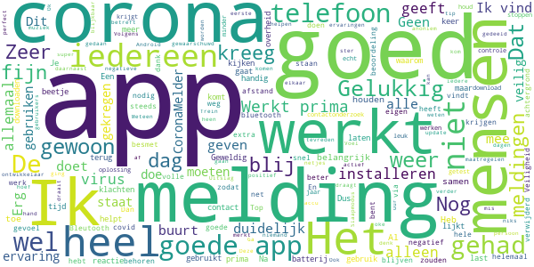

# CoronaMelder
App version ``1.2.4``

Analyzed with [covid-apps-observer](http://github.com/covid-apps-observer) project, version ``0.1``

## App overview
| | |
|-------------------------|-------------------------| 
| **Name**&nbsp;&nbsp;&nbsp;&nbsp;&nbsp;&nbsp;&nbsp;&nbsp;&nbsp;&nbsp;&nbsp;&nbsp;&nbsp;&nbsp;&nbsp;&nbsp;&nbsp;&nbsp;&nbsp;&nbsp;&nbsp;&nbsp;&nbsp;&nbsp;&nbsp;&nbsp;&nbsp;&nbsp;&nbsp;&nbsp;&nbsp;&nbsp;&nbsp;&nbsp;&nbsp;&nbsp;&nbsp;&nbsp;&nbsp;&nbsp;  | CoronaMelder |
| **Unique identifier** | nl.rijksoverheid.en |
| **Link to Google Play** | [https://play.google.com/store/apps/details?id=nl.rijksoverheid.en](https://play.google.com/store/apps/details?id=nl.rijksoverheid.en) |
| **Summary**  | Help de verspreiding van het coronavirus in Nederland te stoppen |
| **Privacy policy** | [https://coronamelder.nl/nl/privacy](https://coronamelder.nl/nl/privacy) |
| **Latest version** | 1.2.4 |
| **Last update** | 2021-03-03 14:07:54 |
| **Recent changes** | Dank je wel voor het gebruiken van CoronaMelder. Je helpt daarmee corona in Nederland te stoppen. Deze update bevat de functie om de app te pauzeren. Pauzeer de app alleen in situaties waarin je telefoon dicht bij telefoons van anderen komt, maar er geen kans op besmetting is. |
| **Installs**  | 1.000.000+ |
| **Category** | Medisch |
| **First release** | 10 aug. 2020 |
| **Size**  | 7,8M |
| **Supported Android version**  | 6.0 en hoger |

### Description
> CoronaMelder is de officiële corona notificatie-app van Nederland, ontwikkeld onder het toezicht van het Ministerie van Volksgezondheid, Welzijn en Sport. De app is een digitaal hulpmiddel bij het bron- en contactonderzoek door de GGD. 
 De app waarschuwt je nadat je in de buurt bent geweest van iemand met corona. Zo kun je jezelf en de mensen in je omgeving beschermen. En kunnen we samen het aantal besmettingen in Nederland zo laag mogelijk houden. Het gebruik van de app is vrijwillig. Niemand mag controleren of jij de app op je telefoon hebt. Maar hoe meer mensen de app gebruiken, hoe beter deze werkt. 
 Bij de ontwikkeling van deze app is rekening gehouden met toegankelijkheid, zie voor meer informatie onze toegankelijkheidsverklaring.
 Hoe werkt de app?
 # Je geeft alleen toegang tot je bluetoothgegevens
 CoronaMelder ziet via bluetooth wanneer je in de buurt bent van andere mensen met de app. De app gebruikt geen persoons- of locatiegegevens. De app weet dus niet wie je bent, waar je was en wie je hebt ontmoet.
 # Je krijgt een melding nadat je extra kans op besmetting hebt gelopen
 De app stuurt een melding als je minstens 15 minuten in de buurt bent geweest van iemand die later corona blijkt te hebben. Deze persoon moet ook de app gebruiken.
 # Je kunt anderen waarschuwen als je zelf besmet blijkt te zijn
 Ben je getest door de GGD en blijk je corona te hebben? Dan kun je samen met de GGD via de app een melding sturen naar de mensen bij wie je in de buurt bent geweest - in de periode dat je besmettelijk was. In deze melding staat alleen wanneer ze in de buurt zijn geweest van een besmet persoon. Niet wie of waar dit was.
 Hoe gaat de app met je gegevens om?
 • Je hoeft geen persoonsgegevens zoals je e-mailadres of naam in te voeren.
 • Als je iemand tegenkomt wisselen jullie telefoons via bluetooth willekeurige codes uit. Zo meet de app de duur en de afstand van het contact. In de codes staat niets over wie jullie zijn en waar jullie zijn geweest. 
 • De codes die je via bluetooth uitwisselt worden alleen op je telefoon bewaard en na 14 dagen verwijderd.
 • Gebruikers van de app zijn niet terug te vinden door de makers van de app, de overheid of andere gebruikers.

### User interface
The developers of the app provide the following screenshots in the Google play store.
| | | |
|:-------------------------:|:-------------------------:|:-------------------------:|
 |   |   |   | 
 |   |   |   | 

## Development team
In the following we report the main information provided by the development team in the Google play store.

| | |
|-------------------------|-------------------------|
| **Developer**  | Rijksoverheid |
| **Website**  | [https://coronamelder.nl/](https://coronamelder.nl/) |
| **Email** | helpdesk@coronamelder.nl |
| **Physical address**  | - |
| **Other developed apps**  | [https://play.google.com/store/apps/developer?id=Rijksoverheid](https://play.google.com/store/apps/developer?id=Rijksoverheid) |

## Android support

| | |
|-------------------------|-------------------------|
| **Declared target Android version**  | - |
| **Effective target Android version**  | - |
| **Minimum supported Android version**  | Marshmallow, version 6.0 (API level 23) |
| **Maximum target Android version**  | - |

The larger the difference between the minimum and maximum supported Android versions, the better. A larger difference means a wider audience. For example, old phones have a very low Android version, so a high minimum supported Android version means that the app cannot be used by users with old phones, thus leading to accessibility problems. 

## Requested permissions

In the following we report the complete list of the permissions requested by the app. 

| **Permission** | **Protection level** | **Description** | 
|-------------------------|-------------------------|-------------------------|
 **android.permission ACCESS_NETWORK_STATE** | Normal | Allows applications to access information about networks. 
 **android.permission BLUETOOTH** | Normal | Allows applications to connect to paired bluetooth devices. 
 **android.permission FOREGROUND_SERVICE** | Normal | Allows a regular application to use Service.startForeground. 
 **android.permission INTERNET** | Normal | Allows applications to open network sockets. 
 **android.permission RECEIVE_BOOT_COMPLETED** | Normal | Allows an application to receive the Intent.ACTION_BOOT_COMPLETED that is broadcast after the system finishes booting. 
 **android.permission REQUEST_IGNORE_BATTERY_OPTIMIZATIONS** | Normal | Permission an application must hold in order to use Settings.ACTION_REQUEST_IGNORE_BATTERY_OPTIMIZATIONS. 
 **android.permission WAKE_LOCK** | Normal | Allows using PowerManager WakeLocks to keep processor from sleeping or screen from dimming. 

## Mentioned servers

| **Server** | **Registrant** | **Registrant country** | **Creation date** | 
|-------------------------|-------------------------|-------------------------|-------------------------|
 | google.com | Google LLC | :us: US | 1997-09-15 04:00:00 |
 | coronamelder-dist.nl | - | - | 2020-07-20 00:00:00 |
 | coronamelder-api.nl | - | - | 2020-07-22 00:00:00 |
 | android.com | Google LLC | :us: US | 1997-06-23 04:00:00 |

## Security analysis 

Below we report the main security warnings raised by our execution of the [Androwarn](https://github.com/maaaaz/androwarn) security analysis tool.

**Connection interfaces exfiltration**
> - This application reads details about the currently active data network 
> - This application tries to find out if the currently active data network is metered 

**Telephony services abuse**
> - This application makes phone calls 

**Suspicious connection establishment**
> - This application opens a Socket and connects it to the remote address '; port is out of range' on the 'N/A' port  
> - This application opens a Socket and connects it to the remote address 'Ljava/net/Proxy;->type()Ljava/net/Proxy$Type;' on the 'N/A' port  
> - This application opens a Socket and connects it to the remote address 'Ln/b/a/a/a;->G(Ljava/lang/String;)Ljava/lang/StringBuilder;' on the 'N/A' port  
> - This application opens a Socket and connects it to the remote address 'timeout' on the 'N/A' port  

## User ratings and reviews

Below we provide information about how end users are reacting to the app in terms of ratings and reviews in the Google Play store.

### Ratings

The CoronaMelder app has been installed by more than **1000000** times. At this time, **7568** rated the app and its average score is **2.9594772**. Below we show the distribution of the ratings across the usual star-based rating of Google Play

:star::star::star::star::star:: 2523

:star::star::star::star:: 801

:star::star::star:: 801

:star::star:: 732

:star:: 2711

### Reviews 

#### 5-star reviews

> Ga zo door.  :date: __2021-03-20 17:27:08__

> Prima hoor deze app.  :date: __2021-03-19 21:43:49__

> Ik had de app geïnstalleerd. Ik had meer dan 15 min staan praten met een bekende in een scootmobiel die minstens op 2 mtr afstand van me stond. het dichtstbij zijnde gebouw was minimaal 15 meter verwijderd. ik had die dag alleen met die persoon gesproken. De volgende dag kreeg ik een melding dat ik (precies op die tijd) langer dan 15 minuten in de nabijheid was geweest die corona had of in die tussentijd had gekregen. Ik heb die persoon gebeld of hij positief was. Dat was hij niet en had zelfs die app niet op zijn telefoon. Sterker nog: hij had zijn telefoon op dat moment niet eens bij zich. Sindsdien ben ik helemaal klaar met die app. Het is wat mij betreft onbetrouwbaar stress aanjagend. Ik heb hem verwijderd en wil hem ook niet meer. Ik doe er verder alles aan om corona vrij te blijven. Dat is betrouwbaarder dan die app.  :date: __2021-03-19 19:00:46__

> Altijd goed gewaarschuwd te worden. Dus slim gedaan.  :date: __2021-03-17 19:46:21__

> Ik vind dat de app het heel goed kan! En er is ook niks aan de hand als er niemand is geweest met Corona dan is het net als of de app er niet is!! Ik vind het een hele goede app wat mij betreft  :date: __2021-03-17 07:44:58__

> Heel goed!! Werkt perfect  :date: __2021-03-13 13:20:41__

> 👌  :date: __2021-03-11 01:37:49__

> Ok  :date: __2021-03-10 21:57:12__

> Werkt prima  :date: __2021-03-09 15:33:00__

> Ik kreeg de melding dat ik contact had gehad met een covid patient. Dat klopte want ik werd zelf ziek.  :date: __2021-03-08 14:01:31__

#### 4-star reviews

> Werkt goed en duidelijk. Miss. is het handig om de beschrijving v pauzeknop nog iets uit te breiden. Tekst is op meerdere manieren te lezen en roept mogelijk vragen op.  :date: __2021-03-18 21:42:59__

> t meeste vanmijn advies, zit nu in CoronaCHECK/Luscii-app. PAUZE-stand= toon ook in Luscii als blauw lampje met kruis erdoor ipv groene. Maak mij betatester of maak een feedback optie (zoals in ZEPP-app). Met CoronaCHECK/Luscii kun jij, na een covid19-besmetting en/of -VACcinatie, eventuele bijwerkingen doorgeven, jij krijgt dan advies. en CoronaCHECK/Luscii kan nog veel meer.  :date: __2021-03-15 02:25:22__

> Prima, maar stop met de maandelijkse meldingen met het rode virusicoon. Schrik me steeds een apennootje...  :date: __2021-03-14 21:04:45__

> Ik heb nog geen meldingen gehad. Maar gelukkig heb ik geen snijbonen van het virus gr. Henk  :date: __2021-03-13 23:40:14__

> Ik snap iets niet ik krijg 3 maart een melding dat ik mij moet laten testen omdat ik 1 maart in de beurt ben geweest van iemand met corona heb een afspraak gemaakt voor 5 maart blijkt dat ik me nu de 5e dag of daarna nog een keer moet laten testen waarom maakt men dan niet meteen een afspraak op de 5e dag of daarna dat scheelt toch 1 x testen en vergroot toch de capaciteit en scheelt mij 1x testen  :date: __2021-03-05 11:23:09__

> Haha beste prank ooit  :date: __2021-02-11 12:04:38__

> Geeft soms aan niet actief te zijn geweest de afgelopen dag. Ik weet niet wat dat betekent en hoe dat voorkomen kan worden.  :date: __2021-02-10 14:30:47__

> Prima, maar door Google Play is deze natuurlijk niet te vertrouwen qua privacy. India, Duitsland en de V.S. hebben hun app ook in F-Droid beschikbaar gemaakt. Waarom deze niet?  :date: __2021-02-10 11:47:53__

> Tja app is goed. Heb hem al n hele tijd  :date: __2021-02-06 18:19:23__

> Na vele pogingen via een omweg is het toch 🤞 gelukt om de app opnieuw te installeren  :date: __2021-02-05 12:22:01__

#### 3-star reviews

> jammer dat niet iedereen de app gebruikt en dat de app geen totalen geeft vh aantal besmettingen per dag zoals in de krant verschijnt de duitse versie doet dit wel vandaar de 3 sterren  :date: __2021-03-21 12:07:57__

> Goed nieuw  :date: __2021-03-19 22:25:09__

> Ik kom nauwelijks buiten en ontvang nauwelijks visite. De app heb ik dus alleen op die momenten aan. Sinds kort krijg ik om de haverklap push berichten om de app aan te zetten. Ronduit irritant, dus de app nu verwijderd. Edit na respons: Elke 12 uur opnieuw de push berichten uitzetten is ook nog steeds r3t3irritant.  :date: __2021-03-19 19:16:27__

> Kreeg pas na 9 dagen een melding van de app dat ik in contact was geweest met iemand met corona. Het meisje die ik aan de telefoon had om een test afspraak te maken zei dat ze dit vaker had gehoort de afgelopen dagen. Puntje van aandacht  :date: __2021-03-17 15:56:46__

> Telkens moet ik mij aan melden Krijg regelmatig melding technisch probleem  :date: __2021-03-17 15:41:09__

> Werkt niet goed als Norton VPN aanstaat.  :date: __2021-03-12 13:14:24__

> Iede ap alleen belde ik handsfree met tomtom in de auto. Maar corona app schakelt Bluetooth tomtom uit  :date: __2021-03-11 14:00:51__

> Geprobeerd te installeren maar nog niet gelukt. Waarom weet ik niet.  :date: __2021-03-10 23:28:01__

> De app heeft mij pas na 5 dagen gewaarschuwd dat wij in contact zijn geweest mat iemand die corona heeft. Wat heeft de app voor zin? Ik kan zelf al meerderen hebben besmet zonder dat ik het wist en daar zij kwetsbare mensen bij. Vandaag getest en hoop morgen al uitslag te krijgen  :date: __2021-03-10 20:18:03__

> Zelfde probleem als mijn voorganger. Man heeft corona. Netjes alles gemeld in de app. Mensen die in zijn omgeving zijn geweest krijgen netjes een app maar ik niet. Geeft niet veel vertrouwen in de app helaas. #update. Lol, ik maak een melding en hoppa. 10 minuten later een melding.  :date: __2021-03-09 19:01:49__

#### 2-star reviews

> Nouik moet bericht krijgen want mijn man is positief getest maar krijg geen melding  :date: __2021-03-19 11:46:07__

> App kan worden gestopt door energie besparing. En dan weet je als gebruiker dus niet dat de app niet meer actief is.... En daardoor niet meer z'n doel bereikt  :date: __2021-03-18 15:19:04__

> Sinds ik de corona melder heb geinstalleerd is mijn smartphone niet meer voorruit te branden en in no time is de accu leeg. App verwijderd en telefoon loopt weer als voorheen, met lange accu duur  :date: __2021-03-18 10:39:31__

> De App kan geen historie van meldingen tonen! En notificaties zijn niet duidelijk, en verdwijnen weer!!  :date: __2021-03-17 13:10:40__

> Mijn partner heeft corona. De rest vh gezin is tot 2x toe negatief getest en in quarantaine geweest. Tijdens de quarantaine blijft de app meldingen sturen dat ik mogelijk besmet ben geraakt in die tijd, terwijl mijn partner geïsoleerd van ons leeft en er dus geen fysiek contact is in die tijd met hem of anderen. Bijzonder  :date: __2021-03-14 11:32:16__

> App valt elke dag 1 of 2 keer uit. Krijg dan weer een melding dat hij al 24 uur niet actief is. Dit begint ondertussen heel vervelend te worden.  :date: __2021-03-11 12:44:03__

> Zelf positief getest echter zie ik het nut er niet van in om pas minimaal 2 dagen later anderen te waarschuwen. Deze mensen kunnen allang het virus hebben verspreid met andere omdat ze zo laat pas melding krijgen. Bovendien heb ik mensen zelf al ingelicht, daar is geen app voor nodig.  :date: __2021-03-11 09:39:39__

> Ik heb corona gehad maar wordt niet vermeld  :date: __2021-03-08 18:39:46__

> Waardeloos  :date: __2021-03-08 15:20:13__

> al 3 x gehad dat ik keek en de App niet actief was wederom weer aangezet??  :date: __2021-03-08 09:33:07__

#### 1-star reviews

> Een giller 🤣 Code ingevoerd in de app, maar mijn corona melder geeft nergens melding van! En dat terwijl we onder 1 dak leven. Voor nu, lekker belangrijk.. Ik weet er van uiteraard, maar stel dat ik buiten mijn gezin om óok in aanraking ben geweest?! Who knows, de app doet niet wat 'ie moet doen 🙈  :date: __2021-03-20 23:03:57__

> Heb een 5 a 6 jaar oude xperia smathphone, die compleet van slag raakt en 'dood' gaat toen ik de app installeerde. Meerdere keren geforceerd moeten herstarten want ik had steeds een paar seconden de tijd om iets te doen voor hij weer dood ging. Gelukt de app te verwijderen en gelukkig dit de telefoon t weer gewoon...  :date: __2021-03-20 11:53:09__

> 👎🏻.👎🏻.👎🏻  :date: __2021-03-20 10:49:26__

> Preuris app.... Overheid wil alleen maar weten waar we zijn!!! Wordt wakker Nederland!!!  :date: __2021-03-20 00:43:44__

> This app does not work but you would expect that from the government. This app doesn't protect you from the dehumanizing effects of lockdown. This app doesn't protect you from the media's distorted perspective of the virus. This app does not protect you from the great reset.  :date: __2021-03-19 10:18:58__

> Ik wil geen Bluetooth aan wanneer ik niet onderweg ben, vooral als ik in een te drukke trein moet zitten. De hele tijd komt er een irritante melding dat iets (dit denk ik) uit staat. Wipe je het weg dab is he er zeker een uur later weer.  :date: __2021-03-19 09:59:38__

> Deze app heeft het probleem dat hij uitvalt voor 24-uur terwijl ik wel goede verbinding heb niet constant maar wel vaak genoeg om de app weer automatisch te laten starten Deze app is up to date ben zeer streng in het updaten Update Updates hebben bovenstaand probleem niet opgelost. Ik heb geen stroombesparing ingesteld nog de app gesnoozed in welke vorm dan ook. Heb deze app verwijderd, en opnieuw geïnstalleerd. Als dit niet helpt gaat die definitief van mijn telefoon.  :date: __2021-03-18 14:08:16__

> Elke dag, soms meermaals lees ik de app is niet actief. Dan actieveer ik de app weer. Ik heb alle telefooninstellingen van mijn telefoon gecontroleerd en kan niets vinden wat dat veroorzaakt.  :date: __2021-03-17 17:43:17__

> App blijft inactief nadat bluetooth is aangezet. Gaat telkens fout  :date: __2021-03-17 10:04:52__

> Nadeel Bluetooth continue aan moet,en ook nav berichten van gebruikers . o.a geen melding 10-3 21 kreeg... een vreemde antwoord kreeg ,namelijk gsm waarschijnlijk in je tas ,jas of broekzak zat " echt lachwekkend, de antwoorden rijksoverheid App meteen eraf...  :date: __2021-03-17 04:16:02__

