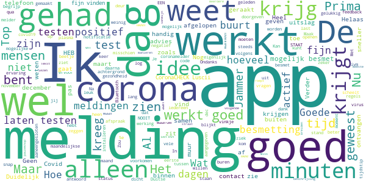
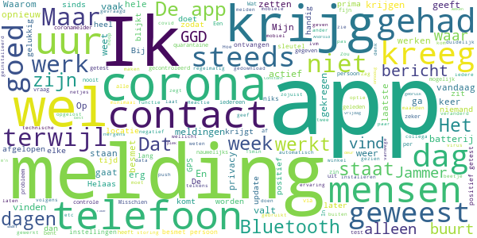
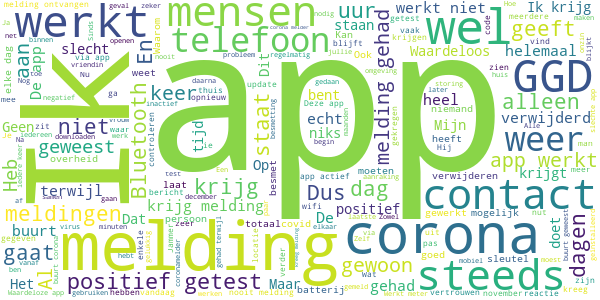

# CoronaMelder
App version ``1.2.4``

Analyzed with [covid-apps-observer](http://github.com/covid-apps-observer) project, version ``0.1``

## App overview
| | |
|-------------------------|-------------------------| 
| **Name**&nbsp;&nbsp;&nbsp;&nbsp;&nbsp;&nbsp;&nbsp;&nbsp;&nbsp;&nbsp;&nbsp;&nbsp;&nbsp;&nbsp;&nbsp;&nbsp;&nbsp;&nbsp;&nbsp;&nbsp;&nbsp;&nbsp;&nbsp;&nbsp;&nbsp;&nbsp;&nbsp;&nbsp;&nbsp;&nbsp;&nbsp;&nbsp;&nbsp;&nbsp;&nbsp;&nbsp;&nbsp;&nbsp;&nbsp;&nbsp;  | CoronaMelder |
| **Unique identifier** | nl.rijksoverheid.en |
| **Link to Google Play** | [https://play.google.com/store/apps/details?id=nl.rijksoverheid.en](https://play.google.com/store/apps/details?id=nl.rijksoverheid.en) |
| **Summary**  | Help de verspreiding van het coronavirus in Nederland te stoppen |
| **Privacy policy** | [https://coronamelder.nl/nl/privacy](https://coronamelder.nl/nl/privacy) |
| **Latest version** | 1.2.4 |
| **Last update** | 2021-03-03 14:07:54 |
| **Recent changes** | Dank je wel voor het gebruiken van CoronaMelder. Je helpt daarmee corona in Nederland te stoppen. Deze update bevat de functie om de app te pauzeren. Pauzeer de app alleen in situaties waarin je telefoon dicht bij telefoons van anderen komt, maar er geen kans op besmetting is. |
| **Installs**  | 1.000.000+ |
| **Category** | Medisch |
| **First release** | 10 aug. 2020 |
| **Size**  | 7,8M |
| **Supported Android version**  | 6.0 en hoger |

### Description
> CoronaMelder is de officiële corona notificatie-app van Nederland, ontwikkeld onder het toezicht van het Ministerie van Volksgezondheid, Welzijn en Sport. De app is een digitaal hulpmiddel bij het bron- en contactonderzoek door de GGD. 
 De app waarschuwt je nadat je in de buurt bent geweest van iemand met corona. Zo kun je jezelf en de mensen in je omgeving beschermen. En kunnen we samen het aantal besmettingen in Nederland zo laag mogelijk houden. Het gebruik van de app is vrijwillig. Niemand mag controleren of jij de app op je telefoon hebt. Maar hoe meer mensen de app gebruiken, hoe beter deze werkt. 
 Bij de ontwikkeling van deze app is rekening gehouden met toegankelijkheid, zie voor meer informatie onze toegankelijkheidsverklaring.
 Hoe werkt de app?
 # Je geeft alleen toegang tot je bluetoothgegevens
 CoronaMelder ziet via bluetooth wanneer je in de buurt bent van andere mensen met de app. De app gebruikt geen persoons- of locatiegegevens. De app weet dus niet wie je bent, waar je was en wie je hebt ontmoet.
 # Je krijgt een melding nadat je extra kans op besmetting hebt gelopen
 De app stuurt een melding als je minstens 15 minuten in de buurt bent geweest van iemand die later corona blijkt te hebben. Deze persoon moet ook de app gebruiken.
 # Je kunt anderen waarschuwen als je zelf besmet blijkt te zijn
 Ben je getest door de GGD en blijk je corona te hebben? Dan kun je samen met de GGD via de app een melding sturen naar de mensen bij wie je in de buurt bent geweest - in de periode dat je besmettelijk was. In deze melding staat alleen wanneer ze in de buurt zijn geweest van een besmet persoon. Niet wie of waar dit was.
 Hoe gaat de app met je gegevens om?
 • Je hoeft geen persoonsgegevens zoals je e-mailadres of naam in te voeren.
 • Als je iemand tegenkomt wisselen jullie telefoons via bluetooth willekeurige codes uit. Zo meet de app de duur en de afstand van het contact. In de codes staat niets over wie jullie zijn en waar jullie zijn geweest. 
 • De codes die je via bluetooth uitwisselt worden alleen op je telefoon bewaard en na 14 dagen verwijderd.
 • Gebruikers van de app zijn niet terug te vinden door de makers van de app, de overheid of andere gebruikers.

### User interface
The developers of the app provide the following screenshots in the Google play store.
| | | |
|:-------------------------:|:-------------------------:|:-------------------------:|
 |   |   |   | 
 |   |   |   | 

## Development team
In the following we report the main information provided by the development team in the Google play store.

| | |
|-------------------------|-------------------------|
| **Developer**  | Rijksoverheid |
| **Website**  | [https://coronamelder.nl/](https://coronamelder.nl/) |
| **Email** | helpdesk@coronamelder.nl |
| **Physical address**  | - |
| **Other developed apps**  | [https://play.google.com/store/apps/developer?id=Rijksoverheid](https://play.google.com/store/apps/developer?id=Rijksoverheid) |

## Android support

| | |
|-------------------------|-------------------------|
| **Declared target Android version**  | - |
| **Effective target Android version**  | - |
| **Minimum supported Android version**  | Marshmallow, version 6.0 (API level 23) |
| **Maximum target Android version**  | - |

The larger the difference between the minimum and maximum supported Android versions, the better. A larger difference means a wider audience. For example, old phones have a very low Android version, so a high minimum supported Android version means that the app cannot be used by users with old phones, thus leading to accessibility problems. 

## Requested permissions

In the following we report the complete list of the permissions requested by the app. 

| **Permission** | **Protection level** | **Description** | 
|-------------------------|-------------------------|-------------------------|
 **android.permission ACCESS_NETWORK_STATE** | Normal | Allows applications to access information about networks. 
 **android.permission BLUETOOTH** | Normal | Allows applications to connect to paired bluetooth devices. 
 **android.permission FOREGROUND_SERVICE** | Normal | Allows a regular application to use Service.startForeground. 
 **android.permission INTERNET** | Normal | Allows applications to open network sockets. 
 **android.permission RECEIVE_BOOT_COMPLETED** | Normal | Allows an application to receive the Intent.ACTION_BOOT_COMPLETED that is broadcast after the system finishes booting. 
 **android.permission REQUEST_IGNORE_BATTERY_OPTIMIZATIONS** | Normal | Permission an application must hold in order to use Settings.ACTION_REQUEST_IGNORE_BATTERY_OPTIMIZATIONS. 
 **android.permission WAKE_LOCK** | Normal | Allows using PowerManager WakeLocks to keep processor from sleeping or screen from dimming. 

## Mentioned servers

| **Server** | **Registrant** | **Registrant country** | **Creation date** | 
|-------------------------|-------------------------|-------------------------|-------------------------|
 | google.com | Google LLC | :us: US | 1997-09-15 04:00:00 |
 | coronamelder-dist.nl | - | - | 2020-07-20 00:00:00 |
 | coronamelder-api.nl | - | - | 2020-07-22 00:00:00 |
 | android.com | Google LLC | :us: US | 1997-06-23 04:00:00 |

## Security analysis 

Below we report the main security warnings raised by our execution of the [Androwarn](https://github.com/maaaaz/androwarn) security analysis tool.

**Connection interfaces exfiltration**
> - This application reads details about the currently active data network 
> - This application tries to find out if the currently active data network is metered 

**Telephony services abuse**
> - This application makes phone calls 

**Suspicious connection establishment**
> - This application opens a Socket and connects it to the remote address '; port is out of range' on the 'N/A' port  
> - This application opens a Socket and connects it to the remote address 'Ljava/net/Proxy;->type()Ljava/net/Proxy$Type;' on the 'N/A' port  
> - This application opens a Socket and connects it to the remote address 'Ln/b/a/a/a;->G(Ljava/lang/String;)Ljava/lang/StringBuilder;' on the 'N/A' port  
> - This application opens a Socket and connects it to the remote address 'timeout' on the 'N/A' port  

## User ratings and reviews

Below we provide information about how end users are reacting to the app in terms of ratings and reviews in the Google Play store.

### Ratings

The CoronaMelder app has been installed by more than **1000000** times. At this time, **7568** rated the app and its average score is **2.9594772**. Below we show the distribution of the ratings across the usual star-based rating of Google Play

:star::star::star::star::star:: 2523

:star::star::star::star:: 801

:star::star::star:: 801

:star::star:: 732

:star:: 2711

### Reviews 

#### 5-star reviews

> Heel goed!! Werkt perfect  :date: __2021-03-13 13:20:41__

> 👌  :date: __2021-03-11 01:37:49__

> Ok  :date: __2021-03-10 21:57:12__

> Werkt prima  :date: __2021-03-09 15:33:00__

> Ik kreeg de melding dat ik contact had gehad met een covid patient. Dat klopte want ik werd zelf ziek.  :date: __2021-03-08 14:01:31__

> Volgens mij wel prima... Nog geen meldingen gehad.  :date: __2021-03-03 12:35:11__

> heel duidelijk oke  :date: __2021-03-01 16:22:57__

> Werkt prima, staat gewoon constant aan sinds de app erop staat. Ook iedere update wordt duidelijk toegelicht. Ik denk dan ook dat alle mensen die 1 ster geven eerst maar eens moeten kijken of alles goed is ingesteld op de eigen telefoon, voor ze de app de volle laag geven.  :date: __2021-02-25 20:46:39__

> App doet het inmiddels beter op mijn telefoon.  :date: __2021-02-25 15:24:53__

> Het lijkt mij goed.  :date: __2021-02-25 12:24:28__

#### 4-star reviews

> Ik heb nog geen meldingen gehad. Maar gelukkig heb ik geen snijbonen van het virus gr. Henk  :date: __2021-03-13 23:40:14__

> Ik snap iets niet ik krijg 3 maart een melding dat ik mij moet laten testen omdat ik 1 maart in de beurt ben geweest van iemand met corona heb een afspraak gemaakt voor 5 maart blijkt dat ik me nu de 5e dag of daarna nog een keer moet laten testen waarom maakt men dan niet meteen een afspraak op de 5e dag of daarna dat scheelt toch 1 x testen en vergroot toch de capaciteit en scheelt mij 1x testen  :date: __2021-03-05 11:23:09__

> Haha beste prank ooit  :date: __2021-02-11 12:04:38__

> Geeft soms aan niet actief te zijn geweest de afgelopen dag. Ik weet niet wat dat betekent en hoe dat voorkomen kan worden.  :date: __2021-02-10 14:30:47__

> Prima, maar door Google Play is deze natuurlijk niet te vertrouwen qua privacy. India, Duitsland en de V.S. hebben hun app ook in F-Droid beschikbaar gemaakt. Waarom deze niet?  :date: __2021-02-10 11:47:53__

> Tja app is goed. Heb hem al n hele tijd  :date: __2021-02-06 18:19:23__

> Na vele pogingen via een omweg is het toch 🤞 gelukt om de app opnieuw te installeren  :date: __2021-02-05 12:22:01__

> In de eerste variant kon je zien hoeveel mensen om je heen waren gescanned. Nu zie je dat niet meer. Je hebt maar een vinkje dat de app actief is. Ik vond het eigenlijk heel fijn om te zien hoeveel mensen waren er gecheckt. Hoort het nu zo te zijn, zonder aantal gecheckte mensen maar alleen dat vinkje? Verder heb ik geen last van de app, hij werkt in de achtergrond, je krijgt misschien 1keer per week een notificatie over de status van de app en de batterij loopt niet sneller leeg. Top! 👍  :date: __2021-02-04 08:54:11__

> Vraagje: Gaat de coronamelder aangepast worden op de hogere besmettelijkheid van de Britse coronavariant? Hier heb ik Hugo de Jonge nog niets over horen zeggen in de persconferenties.  :date: __2021-02-02 19:32:52__

> Werk,t goed  :date: __2021-02-01 13:55:25__

#### 3-star reviews

> Werkt niet goed als Norton VPN aanstaat.  :date: __2021-03-12 13:14:24__

> Iede ap alleen belde ik handsfree met tomtom in de auto. Maar corona app schakelt Bluetooth tomtom uit  :date: __2021-03-11 14:00:51__

> Geprobeerd te installeren maar nog niet gelukt. Waarom weet ik niet.  :date: __2021-03-10 23:28:01__

> De app heeft mij pas na 5 dagen gewaarschuwd dat wij in contact zijn geweest mat iemand die corona heeft. Wat heeft de app voor zin? Ik kan zelf al meerderen hebben besmet zonder dat ik het wist en daar zij kwetsbare mensen bij. Vandaag getest en hoop morgen al uitslag te krijgen  :date: __2021-03-10 20:18:03__

> Zelfde probleem als mijn voorganger. Man heeft corona. Netjes alles gemeld in de app. Mensen die in zijn omgeving zijn geweest krijgen netjes een app maar ik niet. Geeft niet veel vertrouwen in de app helaas. #update. Lol, ik maak een melding en hoppa. 10 minuten later een melding.  :date: __2021-03-09 19:01:49__

> Ja ik heb hem al een tijdje, en dan ???  :date: __2021-03-08 21:54:28__

> Hoi, heb deze app gedownload om te laten weten aan mijn omgeving dat ik positief getest ben op Covid-19.... Alleen kan ik nergens in de App vinden hoe ik dit moet aangeven.... Alleen hoe je een test kunt aanvragen.... Deze heb ik gehad, is er een manier om het alsnog later in te vullen? Grt Sebastiaan  :date: __2021-03-05 12:05:37__

> Misschien handig om toe te voegen als de telefoon even trilt als het een andere telefoon met coronamelder-app registreert voor bijv. langer dan 5 seconden. Dan weet je dat als je telefoon níet heeft getrild je extra alert moet zijn als je vlak bij iemand bent,die het -blijkbaar- minder nauw neemt met de corona-maatregelen.  :date: __2021-03-05 08:51:50__

> Bij mij in Grave N.B. geeft de melder steeds dat hij niets kan scannen.  :date: __2021-03-04 17:47:30__

> Voor zo'n essentiële app krijg ik erg vaak meldingen dat hij uit is gevallen en de afgelopen 24 uur niet heeft kunnen meten.  :date: __2021-02-28 11:31:17__

#### 2-star reviews

> Mijn partner heeft corona. De rest vh gezin is tot 2x toe negatief getest en in quarantaine geweest. Tijdens de quarantaine blijft de app meldingen sturen dat ik mogelijk besmet ben geraakt in die tijd, terwijl mijn partner geïsoleerd van ons leeft en er dus geen fysiek contact is in die tijd met hem of anderen. Bijzonder  :date: __2021-03-14 11:32:16__

> App valt elke dag 1 of 2 keer uit. Krijg dan weer een melding dat hij al 24 uur niet actief is. Dit begint ondertussen heel vervelend te worden.  :date: __2021-03-11 12:44:03__

> Zelf positief getest echter zie ik het nut er niet van in om pas minimaal 2 dagen later anderen te waarschuwen. Deze mensen kunnen allang het virus hebben verspreid met andere omdat ze zo laat pas melding krijgen. Bovendien heb ik mensen zelf al ingelicht, daar is geen app voor nodig.  :date: __2021-03-11 09:39:39__

> Na de laatste update krijg ik elke paar uur de melding dat ik Bluetooth en locatie moet inschakelen. Als ik thuis ben (de meeste dagen) en niemand ontvang dan heb ik deze uit ivm batterij besparen. 1x melding dat het uit staat is voldoende. Ik zet het aan zodra ik weg ga of iemand op bezoek krijg. Kan meldingen niet uitzetten want dan mis ik eventuele melding dat iemand waar ik in de buurt was besmet is. Stop met deze meldingen elke paar uur. Alvast hartelijk bedankt  :date: __2021-03-11 08:02:50__

> Ik heb corona gehad maar wordt niet vermeld  :date: __2021-03-08 18:39:46__

> Waardeloos  :date: __2021-03-08 15:20:13__

> al 3 x gehad dat ik keek en de App niet actief was wederom weer aangezet??  :date: __2021-03-08 09:33:07__

> Ik vind t heel vreemd. 14 dagen terug blijk ik in contact te zijn geweest met iemand die positief is. 14 dagen later krijg ik bericht van de corona app. Ik heb geen klachten gelukkig. Ik bel de ggd en die zegt als u besmet bent had u dit al na 5 dagen moeten merken. Waarom krijg ik dit bericht dan zo laat? Geen idee zeggen ze. U hoeft zich geen zorgen te maken. Nou ik vind dit best vreemd dus. Wel rade ze aan om me te laten testen. Nou ik ben in de war nu zeg maar.  :date: __2021-03-06 11:01:48__

> Batterij loopt met deze app binnen no time leeg. Echt jammer, aan zich werkt de app namelijk goed volgens mij.  :date: __2021-03-03 14:57:32__

> De app valt vaak uit, ik heb er geen vertrouwen meer in. Dit gebeurt dagelijks, hoezo als ik de batterij van de telefoon oplaad schakelt de app uit? Wat een onzin. Heb de telefoon de hele dag op zak en laad hem in de nacht op dus wat is het probleem?  :date: __2021-02-24 23:35:56__

#### 1-star reviews

> 8 positief geteste familieleden in naaste omgeving! Met 3 daarvan nauw contact gehad waaronder moeder van 91 jr. (2x gevaccineerd!!). Geen enkele melding ontvangen via deze app! Ik ben overigens negatief getest.  :date: __2021-03-13 09:12:16__

> Had de app draaien. Dacht ik. Bleek die zichzelf uitgeschakeld te hebben en moest ik nogmaals activeren. Balen, heb ik al die tijd voor niets de app op mijn toestel gehad.  :date: __2021-03-13 05:23:42__

> Wat een slechte app. En dat nog wel van de overheid.  :date: __2021-03-12 22:26:23__

> Een keer in de zoveel tijd (een keer per week denk ik) "doet" de app iets waardoor mijn complete telefoon op tilt slaat.  :date: __2021-03-12 21:26:41__

> Werkt niet. GGd neemt veel te laat contact op voor bron en contact onderzoek en om een melding in de App te plaatsen. Ze nemen binnen enkele dagen contact op..... dat moet toch veel sneller. Als iedereen zolang moet wachten voor er contact word opgenomen, kan ik mij voorstellen dat mensen zich niet aan de regels gaan houden.  :date: __2021-03-12 09:14:32__

> =DHZ-BCO(BronEnContactOnderz (Zelf)Quarantaine:gebruik covidRADAR en/of Luscii-app erbij (= help jouw eigen wijk). statusGEEL(extraVierkant)= totVandaag10dgn THUISquarantaine(o.a. ivbm AdvantQuarantaine)=10dgnVooraf in jouwEigenWoon/WerkBubble geweest. =perspectief Kerst+StKlaas. Mondkapemoji (klein=activeren enNa4uurRoodKruisDoorheen =verzadigd. GGD kan geVACcin-emoji, U bepaalt t tonen! zie ZEPP-app: GedragTAGS , (= 1duidig, databaseTechnish simpel. Ik wil betatester zijn ivbm feedback  :date: __2021-03-11 12:53:17__

> Troep!! Want corona bestaat niet💯  :date: __2021-03-11 10:39:45__

> Valt steeds uit  :date: __2021-03-11 05:18:20__

> Ik vraag me nog steeds af of de app wel werkt. Tot op heden geen enkele onder- bouwing gelezen. Dus is de vraag of de app wel een toegevoegde waarde heeft, zo ja wat zijn dan de resultaten.  :date: __2021-03-10 17:16:01__

> Beperkt tot een aantal regio's. Edit: gebruik van de app is zo beperkt omdat Bluetooth teveel van de batterij vraagt, beter zou het WiFi gebruiken. Dit staat immers bij de meesten aan.  :date: __2021-03-10 17:07:14__

