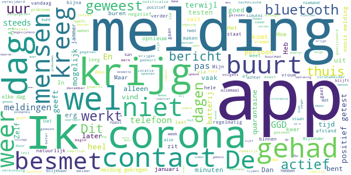
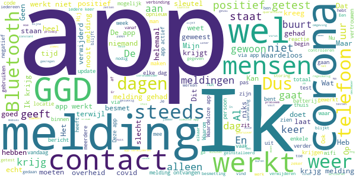

# CoronaMelder
App version ``1.3.0``

Analyzed with [covid-apps-observer](http://github.com/covid-apps-observer) project, version ``0.1``

## App overview
| | |
|-------------------------|-------------------------| 
| **Name**&nbsp;&nbsp;&nbsp;&nbsp;&nbsp;&nbsp;&nbsp;&nbsp;&nbsp;&nbsp;&nbsp;&nbsp;&nbsp;&nbsp;&nbsp;&nbsp;&nbsp;&nbsp;&nbsp;&nbsp;&nbsp;&nbsp;&nbsp;&nbsp;&nbsp;&nbsp;&nbsp;&nbsp;&nbsp;&nbsp;&nbsp;&nbsp;&nbsp;&nbsp;&nbsp;&nbsp;&nbsp;&nbsp;&nbsp;&nbsp;  | CoronaMelder |
| **Unique identifier** | nl.rijksoverheid.en |
| **Link to Google Play** | [https://play.google.com/store/apps/details?id=nl.rijksoverheid.en](https://play.google.com/store/apps/details?id=nl.rijksoverheid.en) |
| **Summary**  | Help de verspreiding van het coronavirus in Nederland te stoppen |
| **Privacy policy** | [https://coronamelder.nl/nl/privacy](https://coronamelder.nl/nl/privacy) |
| **Latest version** | 1.3.0 |
| **Last update** | 2021-03-23 09:28:00 |
| **Recent changes** | Dank je wel voor het gebruiken van CoronaMelder. Je helpt daarmee corona in Nederland te stoppen. Deze update bevat de functie om de app te pauzeren. Pauzeer de app alleen in situaties waarin je telefoon dicht bij telefoons van anderen komt, maar er geen kans op besmetting is. |
| **Installs**  | 1.000.000+ |
| **Category** | Medisch |
| **First release** | 10 aug. 2020 |
| **Size**  | 7,9M |
| **Supported Android version**  | 6.0 en hoger |

### Description
> CoronaMelder is de officiële corona notificatie-app van Nederland, ontwikkeld onder het toezicht van het Ministerie van Volksgezondheid, Welzijn en Sport. De app is een digitaal hulpmiddel bij het bron- en contactonderzoek door de GGD. 
 De app waarschuwt je nadat je in de buurt bent geweest van iemand met corona. Zo kun je jezelf en de mensen in je omgeving beschermen. En kunnen we samen het aantal besmettingen in Nederland zo laag mogelijk houden. Het gebruik van de app is vrijwillig. Niemand mag controleren of jij de app op je telefoon hebt. Maar hoe meer mensen de app gebruiken, hoe beter deze werkt. 
 Bij de ontwikkeling van deze app is rekening gehouden met toegankelijkheid, zie voor meer informatie onze toegankelijkheidsverklaring.
 Hoe werkt de app?
 # Je geeft alleen toegang tot je bluetoothgegevens
 CoronaMelder ziet via bluetooth wanneer je in de buurt bent van andere mensen met de app. De app gebruikt geen persoons- of locatiegegevens. De app weet dus niet wie je bent, waar je was en wie je hebt ontmoet.
 # Je krijgt een melding nadat je extra kans op besmetting hebt gelopen
 De app stuurt een melding als je minstens 15 minuten in de buurt bent geweest van iemand die later corona blijkt te hebben. Deze persoon moet ook de app gebruiken.
 # Je kunt anderen waarschuwen als je zelf besmet blijkt te zijn
 Ben je getest door de GGD en blijk je corona te hebben? Dan kun je samen met de GGD via de app een melding sturen naar de mensen bij wie je in de buurt bent geweest - in de periode dat je besmettelijk was. In deze melding staat alleen wanneer ze in de buurt zijn geweest van een besmet persoon. Niet wie of waar dit was.
 Hoe gaat de app met je gegevens om?
 • Je hoeft geen persoonsgegevens zoals je e-mailadres of naam in te voeren.
 • Als je iemand tegenkomt wisselen jullie telefoons via bluetooth willekeurige codes uit. Zo meet de app de duur en de afstand van het contact. In de codes staat niets over wie jullie zijn en waar jullie zijn geweest. 
 • De codes die je via bluetooth uitwisselt worden alleen op je telefoon bewaard en na 14 dagen verwijderd.
 • Gebruikers van de app zijn niet terug te vinden door de makers van de app, de overheid of andere gebruikers.

### User interface
The developers of the app provide the following screenshots in the Google play store.
| | | |
|:-------------------------:|:-------------------------:|:-------------------------:|
 |   |   |   | 
 |   |   |   | 

## Development team
In the following we report the main information provided by the development team in the Google play store.

| | |
|-------------------------|-------------------------|
| **Developer**  | Rijksoverheid |
| **Website**  | [https://coronamelder.nl/](https://coronamelder.nl/) |
| **Email** | helpdesk@coronamelder.nl |
| **Physical address**  | - |
| **Other developed apps**  | [https://play.google.com/store/apps/developer?id=Rijksoverheid](https://play.google.com/store/apps/developer?id=Rijksoverheid) |

## Android support

| | |
|-------------------------|-------------------------|
| **Declared target Android version**  | - |
| **Effective target Android version**  | - |
| **Minimum supported Android version**  | Marshmallow, version 6.0 (API level 23) |
| **Maximum target Android version**  | - |

The larger the difference between the minimum and maximum supported Android versions, the better. A larger difference means a wider audience. For example, old phones have a very low Android version, so a high minimum supported Android version means that the app cannot be used by users with old phones, thus leading to accessibility problems. 

## Requested permissions

In the following we report the complete list of the permissions requested by the app. 

| **Permission** | **Protection level** | **Description** | 
|-------------------------|-------------------------|-------------------------|
 **android.permission ACCESS_NETWORK_STATE** | Normal | Allows applications to access information about networks. 
 **android.permission BLUETOOTH** | Normal | Allows applications to connect to paired bluetooth devices. 
 **android.permission FOREGROUND_SERVICE** | Normal | Allows a regular application to use Service.startForeground. 
 **android.permission INTERNET** | Normal | Allows applications to open network sockets. 
 **android.permission RECEIVE_BOOT_COMPLETED** | Normal | Allows an application to receive the Intent.ACTION_BOOT_COMPLETED that is broadcast after the system finishes booting. 
 **android.permission REQUEST_IGNORE_BATTERY_OPTIMIZATIONS** | Normal | Permission an application must hold in order to use Settings.ACTION_REQUEST_IGNORE_BATTERY_OPTIMIZATIONS. 
 **android.permission WAKE_LOCK** | Normal | Allows using PowerManager WakeLocks to keep processor from sleeping or screen from dimming. 

## Mentioned servers

| **Server** | **Registrant** | **Registrant country** | **Creation date** | 
|-------------------------|-------------------------|-------------------------|-------------------------|
 | google.com | Google LLC | :us: US | 1997-09-15 04:00:00 |
 | coronamelder-dist.nl | - | - | 2020-07-20 00:00:00 |
 | coronamelder-api.nl | - | - | 2020-07-22 00:00:00 |

## Security analysis 

Below we report the main security warnings raised by our execution of the [Androwarn](https://github.com/maaaaz/androwarn) security analysis tool.

**Connection interfaces exfiltration**
> - This application reads details about the currently active data network 
> - This application tries to find out if the currently active data network is metered 

**Telephony services abuse**
> - This application makes phone calls 

**Suspicious connection establishment**
> - This application opens a Socket and connects it to the remote address '; port is out of range' on the 'N/A' port  
> - This application opens a Socket and connects it to the remote address 'Ljava/net/Proxy;->type()Ljava/net/Proxy$Type;' on the 'N/A' port  
> - This application opens a Socket and connects it to the remote address 'Lm/b/a/a/a;->H(Ljava/lang/String;)Ljava/lang/StringBuilder;' on the 'N/A' port  
> - This application opens a Socket and connects it to the remote address 'timeout' on the 'N/A' port  

**Pim data leakage**
> - This application accesses data stored in the clipboard 

## User ratings and reviews

Below we provide information about how end users are reacting to the app in terms of ratings and reviews in the Google Play store.

### Ratings

The CoronaMelder app has been installed by more than **1000000** times. At this time, **7750** rated the app and its average score is **3.0152285**. Below we show the distribution of the ratings across the usual star-based rating of Google Play

:star::star::star::star::star:: 2725

:star::star::star::star:: 796

:star::star::star:: 816

:star::star:: 698

:star:: 2715

### Reviews 

#### 5-star reviews

> Het is goed dan kunnen we elkaar helpen  :date: __2021-05-07 20:15:13__

> Niet  :date: __2021-05-07 11:19:36__

> Mijn vrouw en ik zijn al 2x gevaccineerd!(en geen bijwerkingen)  :date: __2021-05-06 10:38:13__

> Hoi hoi  :date: __2021-05-05 18:24:01__

> Vanaf begin de CoronaMelder in gebruik en ben er zeer blij mee. Ik heb gelukkig geen meldingen ontvangen. Ik houd mij dan ook erg goed aan de regels en dat zie je dus terug in (geen) meldingen.  :date: __2021-05-04 17:45:25__

> Perfect app. Maar zou eens willen nakijken of er wellicht, na de pauze van Afgelopen 2 dagen, iets niet goed gaat met het gebruik van Bluetooth? Want ik ervaar storingen na update van mijn android op Huawei P20 lite, en in het log komt het woord bluetooth veelvuldig voor en uw app is de enige actieve app die bluetooth vraagt.  :date: __2021-05-02 10:18:18__

> Bravo!!  :date: __2021-05-01 17:23:00__

> Vind erg veel beter waarschuwing ander  :date: __2021-04-30 16:26:26__

> Profeschionees  :date: __2021-04-30 08:37:24__

> hij doet het goed  :date: __2021-04-29 13:10:07__

#### 4-star reviews

> Hoi ik weet niet of hij werk krijg nooit een melding binnen  :date: __2021-05-07 10:17:20__

> Deze app schakelt uit als je mobiel in de vliegtuig stand staat, althans bij mij. Je kan hem apart weer inschakelen maar dat moet je wel weten! Het stond niet bij de vragen, vandaar.  :date: __2021-05-05 20:42:30__

> Op 04-05 precies hetzelfde !! Niets aan de instellingen veranderd, laatste update, blue tooth en locatie staan aan. En toch de melding dat de app de laatste 24 uur niet kan controleren. ????????  :date: __2021-05-04 23:08:15__

> Zeer bevredigend.  :date: __2021-04-28 10:09:33__

> Ben een keer in contact geweest met iemand met corona, ik kreeg geen melding maar die persoon had wel coronamelder. maar verder is het een prima app! Ik raad iedereen aan om deze app te downloaden  :date: __2021-04-27 17:39:48__

> Optioneel.  :date: __2021-04-25 12:59:25__

> Goede ap dat je invormeerd  :date: __2021-04-23 18:04:24__

> Kreeg een melding ,dus laten testen .  :date: __2021-04-16 15:14:51__

> openstaan voor realiteit is moedig 💉🧘‍♂️  :date: __2021-04-16 10:49:39__

> onlangs alert ontvangen dat ik langer als 15 minuten contact heb gehad met iemand die besmet is......die gehele dag echter met NIEMAND (persoonlijk) contact gehad... 》》 mijn buurman kreeg die dag wél zijn uitslag PCR test....onze telefoons dus in elkaars BlueTooth bereik.  :date: __2021-04-15 15:03:13__

#### 3-star reviews

> Het is erg zuipende app, ik gebruiken hem toch nauwelijks  :date: __2021-05-06 15:48:27__

> 6 dagen na contact met iemand die positief is krijg ik PAS een melding. Ook nog met de melding dat ik uit buurt moet bliiven van mensen met zwakke gezondheid. Beetje laat dat je melding dan krijgt.......  :date: __2021-05-04 15:09:56__

> Huis  :date: __2021-05-03 15:07:35__

> Nieuwe review... Krijg nu herhaaldelijk dat er geen verbinding is, terwijl ikzelf wel verbinding heb... waar ligt dat aan ? Mvg Jona Bras  :date: __2021-04-26 14:34:14__

> Google maakt misbruik van de situatie.  :date: __2021-04-26 13:52:14__

> Ik kreeg vorige week een melding dat ik bij iemand in de buurt was geweest die positief getest was. Bleek achteraf dat de besmette persoon gedurende de dag waarop we met elkaar in contact zouden zijn geweest, een verdieping lager dan mij heeft vergadert en ik hem dus totaal niet heb gezien. Het Bluetooth signaal was door het plafond heen gekomen. Als gevolg hiervan in quarantaine gezeten en getest.  :date: __2021-04-26 11:58:53__

> Ik heb nog geen meldingen ontvangen. Dat er bij mij iemand in de buurt besmet is met het virus. Dus ik hoop dat de app werkt...  :date: __2021-04-25 02:21:27__

> Ik krijg een dag later een melding dat ik in de buurt ben geweest van iemand die positief is getest, dat kan en moet sneller.  :date: __2021-04-21 06:53:59__

> Ik heb nu voor de 2e keer een melding gekregen van een besmetting van iemand waarbij ik 15 minuten dichtbij zou zijn geweest. Beide keren onmogelijk omdat ik het huis niet ben uit geweest op die dagen. Heel jammer dat de app deze "valse" meldingen geeft.  :date: __2021-04-17 11:22:22__

> Op zich prima app. Tot nu toe geen valse meldingen gehad zoals anderen hier wel zeggen gehad te hebben. Enige vervelende is dat ik sinds een week of wat elke avond een waarschuwingsmelding krijg dat de app 24 uur niet heeft kunnen controleren door een technisch probleem. Het enige dat ik kan doen, is kiezen voor opnieuw proberen. Daarna gaat de boel weer op groen tot de volgende avond. Dan krijg ik weer die melding. Bij laatste check staat een datum van een dag of 7 geleden. Schiet niet op zo.  :date: __2021-04-15 20:33:25__

#### 2-star reviews

> Valt elke keer uit en moet opnieuw opstarten  :date: __2021-05-08 09:16:12__

> De app al weken geleden geïnstalleerd, maar zo vaak zie ik dat hij niet actief blijkt te zijn. Dan klik ik weer op actief en toch vliegt ie later weer uit. Ik vraag me af of het überhaupt functioneel is om hem erop te hebben als hij het de helft van de tijd niet doet.  :date: __2021-05-06 13:42:01__

> Krijg regelmatig de melding, dat de app. niet ingeschakeld is, heel bijzonder. Er staat vaak een "1" bij app zijn icoontje, echter wat er dan aan de hand is? Je komt er nooit achter, erg irritant, zo'n melding.  :date: __2021-05-05 20:04:23__

> Krijg regelmatig een bericht dat de app niet heeft kunnen controleren.  :date: __2021-05-03 21:19:36__

> Oke mijn dochter kreeg een melding. Thuis quarantaine, testen en daarna negatief weer naar buiten. Nou krijgt ze vandaag weer een melding voor de dag dat ze met mij is wezen testen verder alleen maar thuis zonder visite. Hoe dan???🤷🏼‍♀️ Deze melding kan niet kloppen ze is met niemand in aanraking geweest of het moet de persoon zijn die de test deed.  :date: __2021-05-01 20:21:14__

> I.v.m.reizen heb ik naast deze NL app, ook de corona app van de Franse overheid. Deze laatste app geeft veel meer (actuele) informatie, ook op lokaal niveau. De NL corona app heeft onvoldoende toegevoegde waarde. Gemiste kans!  :date: __2021-05-01 20:10:30__

> Op 21/4 krijg ik een melding mogelijk op 2o/4 contact te hebben gehad met een besmet persoon. Hebme 2x laten testen. Nu 1/5 krijg ik dezelfde melding opnieuw.  :date: __2021-05-01 20:10:05__

> Nog steeds zijn er privacy problemen met de app, heel erg slecht dat het nog steeds niet is opgelost. Heb uiteindelijk besloten om de app te verwijderen ook omdat er geen collega's en andere in mijn buurt de corona melder gebruiken. Hou mij aan de afstand.  :date: __2021-04-28 21:03:13__

> Zojuist een melding gekregen dat ik zondag bij iemand met corona ben geweest. Ik was op de camping en heb niemand gezien. Hoe dan?  :date: __2021-04-28 11:02:44__

> Kreeg op 16 april een bericht dat ik op 17 december in contact was gekomen met een positief persoon... Waardeloos bestaat niet, maar voor de Rijksoverheid komt dit dicht in de buurt.  :date: __2021-04-25 09:34:46__

#### 1-star reviews

> Hij gaat iedere keer uit!  :date: __2021-05-09 12:41:28__

> Verschillende keren ervaren dat hij niet werkt.  :date: __2021-05-09 08:36:24__

> Slecht!!+  :date: __2021-05-08 15:50:30__

> Hij doet het al bijna 2 weken niet meer... Wat een slechte zaak dit. Geeft elke dag de melding dat hij niet werkt en openen kan je hem niet. Nog steeds geen update helaas. Ik verwijder hem weer  :date: __2021-05-07 08:04:20__

> Niet geoptimaliseerd, wil dingen die ik niet il  :date: __2021-05-06 15:25:33__

> Alle dagen moet ik de app opnieuw activeren, vandaag of morgen verwijder ik. Heeft zo geen zin, het principe is mooi maar het moet wel werkem  :date: __2021-05-05 20:05:04__

> De batterij verbruik op de S20 is dramatisch naar een halve dag zit dat al op 9 % zonder melder is dat 50%.  :date: __2021-05-05 12:31:40__

> Hahaha 🤣🤣🤣🏃🏃🙋  :date: __2021-05-05 01:16:58__

> Hoe kan ik de code scan krijgen o. Te tonen dat ik 2x ben ingeënt  :date: __2021-05-04 18:21:38__

> Melding n.a.v. bezoek aan teststraat. Kennelijk is het advies de app uit te zetten als je naar de teststraat gaat. Wellicht een idee om ergens duidelijk te communiceren? Nu moet ik weer een test gaan doen.  :date: __2021-05-02 15:25:43__

