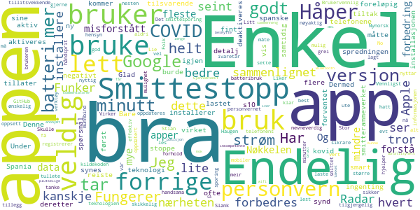
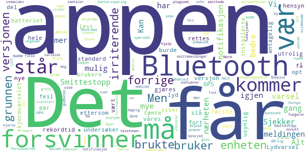
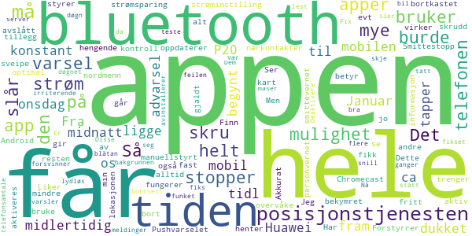
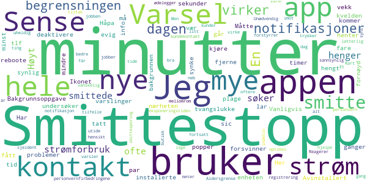

# Smittestopp
App version ``1.0.1``

Analyzed with [covid-apps-observer](http://github.com/covid-apps-observer) project, version ``0.1``

## App overview
| | |
|-------------------------|-------------------------| 
| **Name**&nbsp;&nbsp;&nbsp;&nbsp;&nbsp;&nbsp;&nbsp;&nbsp;&nbsp;&nbsp;&nbsp;&nbsp;&nbsp;&nbsp;&nbsp;&nbsp;&nbsp;&nbsp;&nbsp;&nbsp;&nbsp;&nbsp;&nbsp;&nbsp;&nbsp;&nbsp;&nbsp;&nbsp;&nbsp;&nbsp;&nbsp;&nbsp;&nbsp;&nbsp;&nbsp;&nbsp;&nbsp;&nbsp;&nbsp;&nbsp;  | Smittestopp |
| **Unique identifier** | no.fhi.smittestopp_exposure_notification |
| **Link to Google Play** | [https://play.google.com/store/apps/details?id=no.fhi.smittestopp_exposure_notification](https://play.google.com/store/apps/details?id=no.fhi.smittestopp_exposure_notification) |
| **Summary**  | Last ned Smittestopp, og bli med på å stoppe smittespredningen i Norge. |
| **Privacy policy** | [https://www.fhi.no/om/smittestopp/personvern/](https://www.fhi.no/om/smittestopp/personvern/) |
| **Latest version** | 1.0.1 |
| **Last update** | 2020-12-21 16:49:30 |
| **Recent changes** | Mindre stabilitet-, tekst- og brukervennlighetsforbedringer |
| **Installs**  | 50 000+ |
| **Category** | Sunnhet og trening |
| **First release** | 14. des. 2020 |
| **Size**  | 293M |
| **Supported Android version**  | 6.0 og nyere |

### Description
> Smittestopp er frivillig å bruke, og er et av flere tiltak som kan bidra til å forhindre spredning av koronaviruset. Smittestopp har 16 års aldersgrense.   
 Du får beskjed hvis du har vært i nærheten av en person med covid-19. Du kan gi beskjed til andre brukere av appen hvis du får covid-19. Slik kan vi alle passe bedre på de vi er i nærheten av. 
 Du kan ikke se hvem eller hvor mange smittede du har vært i nærheten av, og de kan ikke se deg. 
 Hvis du gir beskjed om at du er smittet, kan ikke andre se at det er du som gjør det. 
 Appen registrerer ikke data om hvor du er.  
 Takk for at du bidrar til å stoppe spredning av koronavirus. 
 Smittestopp er utviklet av Folkehelseinstituttet i Norge. Les mer om appen på www.helsenorge.no/smittestopp

### User interface
The developers of the app provide the following screenshots in the Google play store.
| | | |
|:-------------------------:|:-------------------------:|:-------------------------:|
 |   |   |   | 

## Development team
In the following we report the main information provided by the development team in the Google play store.

| | |
|-------------------------|-------------------------|
| **Developer**  | Folkehelseinstituttet |
| **Website**  | [https://www.fhi.no](https://www.fhi.no) |
| **Email** | folkehelseinstituttet@fhi.no |
| **Physical address**  | - |
| **Other developed apps**  | [https://play.google.com/store/apps/developer?id=Folkehelseinstituttet](https://play.google.com/store/apps/developer?id=Folkehelseinstituttet) |

## Android support

| | |
|-------------------------|-------------------------|
| **Declared target Android version**  | Android10, version 10 (API level 29) |
| **Effective target Android version**  | Android10, version 10 (API level 29) |
| **Minimum supported Android version**  | Marshmallow, version 6.0 (API level 23) |
| **Maximum target Android version**  | - |

The larger the difference between the minimum and maximum supported Android versions, the better. A larger difference means a wider audience. For example, old phones have a very low Android version, so a high minimum supported Android version means that the app cannot be used by users with old phones, thus leading to accessibility problems. 

## Requested permissions

In the following we report the complete list of the permissions requested by the app. 

| **Permission** | **Protection level** | **Description** | 
|-------------------------|-------------------------|-------------------------|
 **android.permission ACCESS_NETWORK_STATE** | Normal | Allows applications to access information about networks. 
 **android.permission BLUETOOTH** | Normal | Allows applications to connect to paired bluetooth devices. 
 **android.permission FOREGROUND_SERVICE** | Normal | Allows a regular application to use Service.startForeground. 
 **android.permission INTERNET** | Normal | Allows applications to open network sockets. 
 **android.permission READ_APP_BADGE** | - | - 
 **android.permission RECEIVE_BOOT_COMPLETED** | Normal | Allows an application to receive the Intent.ACTION_BOOT_COMPLETED that is broadcast after the system finishes booting. 
 **android.permission WAKE_LOCK** | Normal | Allows using PowerManager WakeLocks to keep processor from sleeping or screen from dimming. 
 **com.anddoes.launcher.permission UPDATE_COUNT** | - | - 
 **com.htc.launcher.permission READ_SETTINGS** | - | - 
 **com.htc.launcher.permission UPDATE_SHORTCUT** | - | - 
 **com.huawei.android.launcher.permission CHANGE_BADGE** | - | - 
 **com.huawei.android.launcher.permission READ_SETTINGS** | - | - 
 **com.huawei.android.launcher.permission WRITE_SETTINGS** | - | - 
 **com.majeur.launcher.permission UPDATE_BADGE** | - | - 
 **com.oppo.launcher.permission READ_SETTINGS** | - | - 
 **com.oppo.launcher.permission WRITE_SETTINGS** | - | - 
 **com.sec.android.provider.badge.permission READ** | - | - 
 **com.sec.android.provider.badge.permission WRITE** | - | - 
 **com.sonyericsson.home.permission BROADCAST_BADGE** | - | - 
 **com.sonymobile.home.permission PROVIDER_INSERT_BADGE** | - | - 
 **me.everything.badger.permission BADGE_COUNT_READ** | - | - 
 **me.everything.badger.permission BADGE_COUNT_WRITE** | - | - 

## Mentioned servers

| **Server** | **Registrant** | **Registrant country** | **Creation date** | 
|-------------------------|-------------------------|-------------------------|-------------------------|
 | google.com | Google LLC | :us: US | 1997-09-15 04:00:00 |
 | microsoft.com | Microsoft Corporation | :us: US | 1991-05-02 04:00:00 |
 | googleapis.com | Google LLC | :us: US | 2005-01-25 17:52:26 |

## Security analysis 

Below we report the main security warnings raised by our execution of the [Androwarn](https://github.com/maaaaz/androwarn) security analysis tool.

**Telephony identifiers leakage**
> - This application reads the ISO country code equivalent of the current registered operator's MCC (Mobile Country Code) 
> - This application reads the numeric name (MCC+MNC) of current registered operator 
> - This application reads the operator name 

**Connection interfaces exfiltration**
> - This application reads details about the currently active data network 
> - This application tries to find out if the currently active data network is metered 

**Code execution**
> - This application loads a native library: 'mono-native' 
> - This application loads a native library: 'monodroid' 
> - This application loads a native library: 'monosgen-2.0' 
> - This application loads a native library: 'xamarin-app' 
> - This application loads a native library: 'xamarin-debug-app-helper' 

## User ratings and reviews

Below we provide information about how end users are reacting to the app in terms of ratings and reviews in the Google Play store.

### Ratings

The Smittestopp app has been installed by more than **50000** times. At this time, **220** rated the app and its average score is **4.3925233**. Below we show the distribution of the ratings across the usual star-based rating of Google Play

:star::star::star::star::star:: 168

:star::star::star::star:: 20

:star::star::star:: 8

:star::star:: 2

:star:: 22

### Reviews 

#### 5-star reviews

> Fungerer helt fint med min s10. Bare synd at ikke flere installerer den på telefonene sine.  :date: __2020-12-28 08:53:54__

> Jeg synes dette er en smart bruk av teknologi for og stoppe spredningen av kovid 19  :date: __2020-12-27 19:03:54__

> Har foreløpig ingenting negativt å si om appen. Glad for at det endelig kom en ny versjon.  :date: __2020-12-26 20:27:06__

> Endelig er det en app som alle kan bruke.  :date: __2020-12-26 19:56:59__

> Denne appen bruker ingen strøm sammenlignet med den forrige!  :date: __2020-12-25 12:27:31__

> Appen ser ut til å være veldig bra, så dette er mer en detalj som kanskje kan forbedres: Jeg lastet først ned Smittestopp og deretter den spanske tilsvarende appen "Radar COVID" siden jeg reiste til Spania. Under installasjonen av Radar COVID virket det som at smitterammeverket til Google/Apple kun tillater 1 aktiv app samtidig slik at Smittestopp da måtte deaktiveres. Dermed kommer Smittestopp ofte opp med spørsmål om den ikke burde aktiveres igjen. Kanskje dette kan forbedres på noe vis? 🙂  :date: __2020-12-25 06:51:30__

> Bra tiltak  :date: __2020-12-24 20:36:47__

> Bruker lite batteri og er lett i bruk.  :date: __2020-12-24 15:04:15__

> Funker som forventet og bruker ikke nevneverdig med batteri.  :date: __2020-12-24 10:19:59__

> Veldig bra app. Litt seint ute (i og med at Google og Apple kom med denne teknologien i vår), men bedre seint enn aldri.  :date: __2020-12-24 00:20:04__

#### 4-star reviews

> Kan dere endre den irriterende skrivefeilen som står i varselet som kommer på toppen av skjermen? Det står "Smittestopp sjekker om du vær i nærheten av..."  :date: __2020-12-27 10:33:55__

> Åpen kildekode. Personvernet ivaretatt på en genial måte. Bravo. Bluetooth-samtaler i bil fungerer dårlig sammen med denne appen.  :date: __2020-12-26 01:03:47__

> Helt greie spørsmål  :date: __2020-12-25 19:21:16__

> Bruker litt mer strøm når det er mange mobiler rundt deg, f. Eks. På shoppingsenter men mye bedre enn den forrige utgaven  :date: __2020-12-24 09:14:50__

> Appen virker grei men på Android kommer den av og til med et varsel øverst som bare forsvinner, det er ikke mulig å lese hva den sier fordi teksten bare forsvinner igjen  :date: __2020-12-22 15:06:29__

> Vi prøver igjen. Appen vil fornye enhetens anonyme kode hvert 15 minutt står det. Kan smittede bli innmeldt i retrospekt og hvor mange kontakter vil innmeldes? Vi vil vite mer om funksjonen.  :date: __2020-12-21 18:51:54__

> Vet ikke ennå om godheten av denne appen.  :date: __2020-12-21 13:24:29__

#### 3-star reviews

> Den funket bra i et døgn. Nå maser den om Bluetooth hele tiden og sier at jeg må skru den på, selv om den har stått på hele tiden. Vær så snill og fiks denne feilen. Er meget irriterende.. avinstallerer appen til dere har fikset det!  :date: __2020-12-28 05:23:50__

> Får varsel flere ganger i døgnet uten at det er noen meldinger. Burde være lydløs bortsett fra når man må teste seg.  :date: __2020-12-24 19:24:38__

> Får varsler av og til fra appen. Disse får jeg ikke lest. Dem bare forsvinner. Fix...  :date: __2020-12-23 19:32:42__

> Deaktivere blåtan i bil ved telefonsamtale.  :date: __2020-12-21 16:02:13__

#### 2-star reviews

> Et bra tiltak, nå med bedre personvern. Men bruker fortsatt latterlig mye strøm og forstyrrer med varsler i tide og utide. Rart at det er så vanskelig å lage en slik app som bare virker.....  :date: __2020-12-24 15:53:06__

> Reagerer litt på begrensningen på 15 minutter, fordi jeg jobber i butikk og der er jeg i kontakt med kunder oftere enn med 15 minutters mellomrom. En kundekontakt på jobben min varer i alt fra 2 til 10 minutter så denne begrensningen er i mitt tilfelle ikke optimal.  :date: __2020-12-21 18:04:56__

#### 1-star reviews

> Får beskjed hvis du har vært i nærheten av en person med karantene problem for covid-19 skal du 'hva. Du kan gi 1 løgn hvis du ikke får covid-19. Slik kan vi ikke ha det. Bedre? Så da er det ikke noe hjelp det er faktisk ganske så ubrukelig. Trenger data og Internett. Det er faktisk ikke noe som er rett. Ja det var Norge 'og Danmark. Ubrukelig info og løgner. 500 ganger 70 er dødelig uansett så FHI er massemordere. Eller? Idiotisk! Trenger ikke noe som dette. Så ubrukelig. Vask hendene.  :date: __2020-12-26 09:26:58__

> Den slår av blåtann i hytt og pine, og så gir den varsel om at blåtann må være på for at dem skal fungere. Jeg har den koblet med blåtann til smartklokke også, så lurer om det skaper problemer for appen at det er andre ting som også bruker blåtann. Ser at andre har samme problem med handsfree/headset påkoblet med blåtann. Dette må fikses.  :date: __2020-12-25 21:29:26__

> Har OnePlus Nord med Android 10 og Freedome VPN. Smittestopp vil ikke virke med Bluetooth aktivert. Må også slå av wifi hjemme da programmet trenger mobildata. Hva gjør jeg med dette?  :date: __2020-12-23 01:11:01__

> Anbefale datatilsynet å ta en ekstra titt på dette her. Bruk av bluetooth kan spores. NEI jeg godtar IKKE at det sendes til Google, Apple osv brudd av personvern er dette. Å bruke bluetooth sørger også for at mobilen din sluker strøm så du er nødt til å ha den i laderen hele tiden. Da du kan spores og avlegger id. Nei hold dere langt unna det er akkurat det samme som den første appen bare dem skjuler sannheten at du kan trackes via bluetooth også. Dette er en SKAM. Misbruk av personvern.  :date: __2020-12-23 00:33:48__

> Etter installasjon av denne bryter Bluetooth-headsettet med jevne mellomrom. Antar det har med scanningen å gjøre. Samsung Note 10+  :date: __2020-12-22 10:06:39__

> Virker ikke uten at posisjon er på.Why????  :date: __2020-12-22 08:37:03__

> Elendig  :date: __2020-12-22 01:19:00__

> Dumt at Bluetooth må være på...  :date: __2020-12-22 00:37:23__

> Uklart om appen virker uten posisjon aktivert etter at den er startet. Gjør den det? Prøvde nå fikk en feilmelding som henviste til 2 lange "dollar"-variabelnavn. Gir en stjerne fordi det ser ut for posisjon må være på på Android.  :date: __2020-12-21 19:28:08__

> Jeg samtykker ikke i at bruksdata sendes til Apple, Google eller andre teknologigiganter. Fjern dette kravet, så skal jeg bruke appen.  :date: __2020-12-21 19:07:25__

