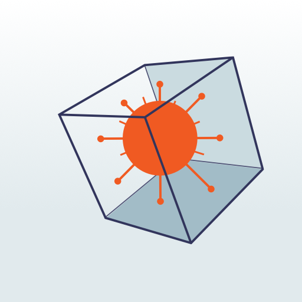
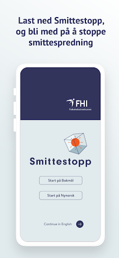
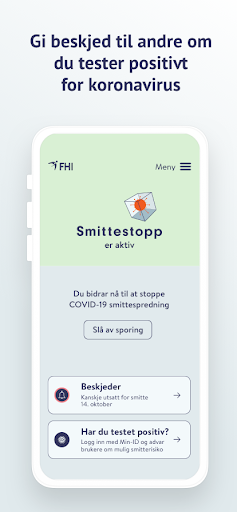
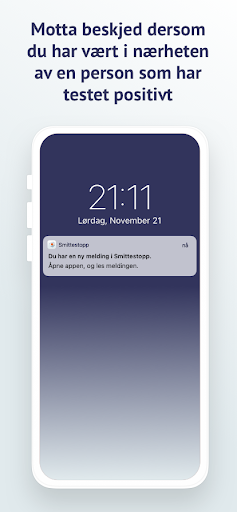
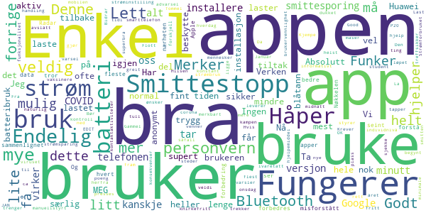
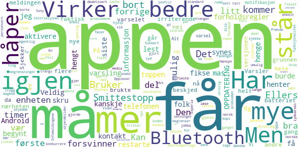
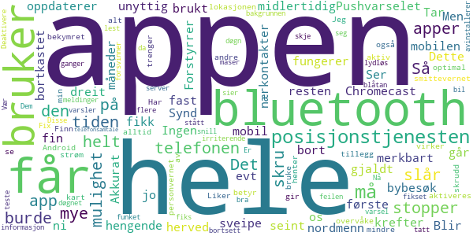
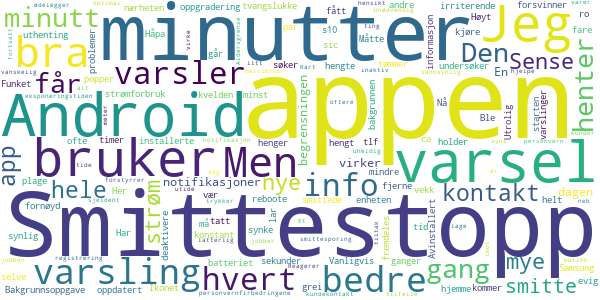
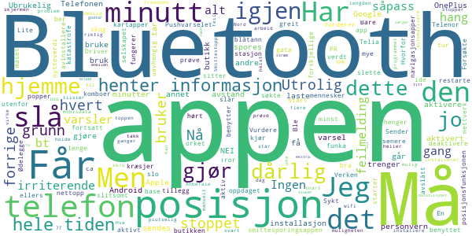

# Smittestopp
App version ``1.0.2``

Analyzed with [covid-apps-observer](http://github.com/covid-apps-observer) project, version ``0.1``

## App overview
| | |
|-------------------------|-------------------------| 
| **Name**&nbsp;&nbsp;&nbsp;&nbsp;&nbsp;&nbsp;&nbsp;&nbsp;&nbsp;&nbsp;&nbsp;&nbsp;&nbsp;&nbsp;&nbsp;&nbsp;&nbsp;&nbsp;&nbsp;&nbsp;&nbsp;&nbsp;&nbsp;&nbsp;&nbsp;&nbsp;&nbsp;&nbsp;&nbsp;&nbsp;&nbsp;&nbsp;&nbsp;&nbsp;&nbsp;&nbsp;&nbsp;&nbsp;&nbsp;&nbsp;  | Smittestopp |
| **Unique identifier** | no.fhi.smittestopp_exposure_notification |
| **Link to Google Play** | [https://play.google.com/store/apps/details?id=no.fhi.smittestopp_exposure_notification](https://play.google.com/store/apps/details?id=no.fhi.smittestopp_exposure_notification) |
| **Summary**  | Last ned Smittestopp, og bli med på å stoppe smittespredningen i Norge. |
| **Privacy policy** | [https://www.fhi.no/om/smittestopp/personvern/](https://www.fhi.no/om/smittestopp/personvern/) |
| **Latest version** | 1.0.2 |
| **Last update** | 2021-01-19 10:52:36 |
| **Recent changes** | Mindre stabilitet-, tekst- og brukervennlighetsforbedringer |
| **Installs**  | 100 000+ |
| **Category** | Sunnhet og trening |
| **First release** | 14. des. 2020 |
| **Size**  | 332M |
| **Supported Android version**  | 6.0 og nyere |

### Description
> Smittestopp er frivillig å bruke, og er et av flere tiltak som kan bidra til å forhindre spredning av koronaviruset. Smittestopp har 16 års aldersgrense.   
 Du får beskjed hvis du har vært i nærheten av en person med covid-19. Du kan gi beskjed til andre brukere av appen hvis du får covid-19. Slik kan vi alle passe bedre på de vi er i nærheten av. 
 Du kan ikke se hvem eller hvor mange smittede du har vært i nærheten av, og de kan ikke se deg. 
 Hvis du gir beskjed om at du er smittet, kan ikke andre se at det er du som gjør det. 
 Appen registrerer ikke data om hvor du er.  
 Takk for at du bidrar til å stoppe spredning av koronavirus. 
 Smittestopp er utviklet av Folkehelseinstituttet i Norge. Les mer om appen på www.helsenorge.no/smittestopp

### User interface
The developers of the app provide the following screenshots in the Google play store.
| | | |
|:-------------------------:|:-------------------------:|:-------------------------:|
 |   |   |   | 

## Development team
In the following we report the main information provided by the development team in the Google play store.

| | |
|-------------------------|-------------------------|
| **Developer**  | Folkehelseinstituttet |
| **Website**  | [https://www.fhi.no](https://www.fhi.no) |
| **Email** | folkehelseinstituttet@fhi.no |
| **Physical address**  | - |
| **Other developed apps**  | [https://play.google.com/store/apps/developer?id=Folkehelseinstituttet](https://play.google.com/store/apps/developer?id=Folkehelseinstituttet) |

## Android support

| | |
|-------------------------|-------------------------|
| **Declared target Android version**  | Android10, version 10 (API level 29) |
| **Effective target Android version**  | Android10, version 10 (API level 29) |
| **Minimum supported Android version**  | Marshmallow, version 6.0 (API level 23) |
| **Maximum target Android version**  | - |

The larger the difference between the minimum and maximum supported Android versions, the better. A larger difference means a wider audience. For example, old phones have a very low Android version, so a high minimum supported Android version means that the app cannot be used by users with old phones, thus leading to accessibility problems. 

## Requested permissions

In the following we report the complete list of the permissions requested by the app. 

| **Permission** | **Protection level** | **Description** | 
|-------------------------|-------------------------|-------------------------|
 **android.permission ACCESS_NETWORK_STATE** | Normal | Allows applications to access information about networks. 
 **android.permission BLUETOOTH** | Normal | Allows applications to connect to paired bluetooth devices. 
 **android.permission FOREGROUND_SERVICE** | Normal | Allows a regular application to use Service.startForeground. 
 **android.permission INTERNET** | Normal | Allows applications to open network sockets. 
 **android.permission READ_APP_BADGE** | - | - 
 **android.permission RECEIVE_BOOT_COMPLETED** | Normal | Allows an application to receive the Intent.ACTION_BOOT_COMPLETED that is broadcast after the system finishes booting. 
 **android.permission WAKE_LOCK** | Normal | Allows using PowerManager WakeLocks to keep processor from sleeping or screen from dimming. 
 **com.anddoes.launcher.permission UPDATE_COUNT** | - | - 
 **com.htc.launcher.permission READ_SETTINGS** | - | - 
 **com.htc.launcher.permission UPDATE_SHORTCUT** | - | - 
 **com.huawei.android.launcher.permission CHANGE_BADGE** | - | - 
 **com.huawei.android.launcher.permission READ_SETTINGS** | - | - 
 **com.huawei.android.launcher.permission WRITE_SETTINGS** | - | - 
 **com.majeur.launcher.permission UPDATE_BADGE** | - | - 
 **com.oppo.launcher.permission READ_SETTINGS** | - | - 
 **com.oppo.launcher.permission WRITE_SETTINGS** | - | - 
 **com.sec.android.provider.badge.permission READ** | - | - 
 **com.sec.android.provider.badge.permission WRITE** | - | - 
 **com.sonyericsson.home.permission BROADCAST_BADGE** | - | - 
 **com.sonymobile.home.permission PROVIDER_INSERT_BADGE** | - | - 
 **me.everything.badger.permission BADGE_COUNT_READ** | - | - 
 **me.everything.badger.permission BADGE_COUNT_WRITE** | - | - 

## Mentioned servers

| **Server** | **Registrant** | **Registrant country** | **Creation date** | 
|-------------------------|-------------------------|-------------------------|-------------------------|
 | google.com | Google LLC | :us: US | 1997-09-15 04:00:00 |
 | microsoft.com | Microsoft Corporation | :us: US | 1991-05-02 04:00:00 |
 | googleapis.com | Google LLC | :us: US | 2005-01-25 17:52:26 |

## Security analysis 

Below we report the main security warnings raised by our execution of the [Androwarn](https://github.com/maaaaz/androwarn) security analysis tool.

**Telephony identifiers leakage**
> - This application reads the ISO country code equivalent of the current registered operator's MCC (Mobile Country Code) 
> - This application reads the numeric name (MCC+MNC) of current registered operator 
> - This application reads the operator name 

**Connection interfaces exfiltration**
> - This application reads details about the currently active data network 
> - This application tries to find out if the currently active data network is metered 

**Code execution**
> - This application loads a native library: 'mono-native' 
> - This application loads a native library: 'monodroid' 
> - This application loads a native library: 'monosgen-2.0' 
> - This application loads a native library: 'xamarin-app' 
> - This application loads a native library: 'xamarin-debug-app-helper' 

## User ratings and reviews

Below we provide information about how end users are reacting to the app in terms of ratings and reviews in the Google Play store.

### Ratings

The Smittestopp app has been installed by more than **100000** times. At this time, **379** rated the app and its average score is **3.5544555**. Below we show the distribution of the ratings across the usual star-based rating of Google Play

:star::star::star::star::star:: 158

:star::star::star::star:: 75

:star::star::star:: 30

:star::star:: 52

:star:: 64

### Reviews 

#### 5-star reviews

> Godt at det er hjelp å få.  :date: __2021-01-23 10:20:10__

> Bra app! La den bruke så mye strøm den bare ønsker, så lenge den hjelper oss i kampen mot corona. Helt naturlig at en slik app bruker noe strøm når den er aktiv på steder hvor det er mange mennesker. Flott tiltak dette!  :date: __2021-01-20 10:23:43__

> Absolutt informativt  :date: __2021-01-19 21:55:15__

> EDIT 17. JAN: Appen er normal igjen og fungerer knirkefritt for denne brukeren. :) Gammel: Fra ca. midnatt onsdag 13. Januar har appen begynt å ligge konstant fram med varsel (tidl. dukket det opp av og til), og jeg får opp advarsel fra mobilen om at den tapper mye strøm (Huawei P20, hele tiden med manuellstyrt strøminstilling for Smittestopp - all strømsparing/kontroll avslått for appen, den styrer fritt).  :date: __2021-01-17 17:46:40__

> Funker, trekker ikke merkbart mye strøm og varsler om Bluetooth ikke er på  :date: __2021-01-13 21:24:10__

> Good  :date: __2021-01-09 00:14:27__

> Kjempe bra app. Ingen som helst tull og den er sikker å trygg å bruke. Den bruker ikke noe særlig batteri, i såfall er det så lite at man ikke merker det, bruker heller ikke noe særlig plass. Vi må få ned smitten nå så de kan vaksinere mest mulig så håper alle kan laste den ned 😉👍 del med venner så flest laster den ned.. vi alle vil ha en litt mer normal hverdag tilbake i løpet av året. 5 ⭐⭐⭐⭐⭐  :date: __2021-01-06 15:22:41__

> Bidrar til smittesporing med absolutt mest minimale konsekvenser for bruker. Bør tas i bruk av alle med smarttelefon👍  :date: __2021-01-05 21:49:03__

> Nå fungerer Smittestopp supert. Krever ingen handling. Last ned og den virker. Merker ingen ting på batteribruk. Alt anonymt, personvern ivaretatt. Håper så mange som mulig lastet ned denne, hvis ikke er det ikke noe poeng. Da vil ikke appen beskytte oss. Denne appen hjelper ikke MEG (individnivå), men OSS. Hvis mange nok laster den ned vil smittesporing bli mere treffsikker og viruset vil presses tilbake.  :date: __2021-01-03 22:23:43__

> Fungerer nå OK. Ta den i bruk! Strømforbruket virker greit.  :date: __2021-01-03 18:23:29__

#### 4-star reviews

> Virker som de har knekt koden. Alle forholdsregler tatt. Men redd det er så mange forholdsregler og begrensninger at det begrenser smittesporinga. Men alle bør ha denne da kan løse problemet og restriksjoner. For korte frister og for rask utvikling gjorde at det var umulig for norske utviklere å levere eller konkurrere, bare mulig å lage en norsk kopi av den danske appen. Den første appen var kanskje bedre egentlig, men problemene fra den første er løst.  :date: __2021-01-23 08:15:08__

> Listen up! Veldig bra jobba med appen synes jeg, dvs jeg synes appen innfrir på de fleste punkter som har vært oppe i media, og det håper jeg folk flest gjør også (burde i alle fall). En liten ting: Kan dere sjekke bluetooth funksjonalitet. Opplever en del mas om å måtte aktivere sporing/må skru på BT osv, selv om jeg har gjort det mange ganger. Sikkert enkelt å fikse, bare å spørre hvis dere trenger litt mer input/hjelp. mvh Vidar Vestnes 🤗  :date: __2021-01-17 18:29:59__

> Enkel i bruk, men føler meg ikke trygg på at den virker etter at den har hengt seg opp i "Smittestopp henter informasjon" Prøvde å restarte telefonen, men det samme skjedde igjen.... OPPDATERING: Appen er fikset, så jeg øker til 4 stjerner 😊  :date: __2021-01-16 11:44:38__

> Mye bedre personvern enn den forrige. Den her kan jeg se poenget med å laste ned, selv om den kommer noe sent.  :date: __2021-01-14 11:04:05__

> Infomeldingene på toppen er for lange setninger slik at man ikke får lest slutten. Ellers bra. Bruker Sony Experia Android. Ta kontakt om skjermbilder trengs.  :date: __2021-01-13 18:30:20__

> Push varsling har begynt å henge seg de siste dagene. Så må inn å deaktivert og aktivere varsling igjen for å få den bort eller restarte tlf. Håper dere får sett på denne feilen. Har Huawei P30 pro. Ellers fornøyd.  :date: __2021-01-13 17:09:27__

> Lydvarsel må gjøres om til opt-in av hensyn til de som ikke får til å slå av lyd som standard på enheten. Det må også rettes et par utrolig irriterende feil i skjermvarselet, nå "Smittestopp undersøker om du vær i nærheten av brukere som har m..." - "vær" skal antagelig være "har vært", del av meldingen er usynlig og hele meldingen forsvinner så fort at det ikke er mulig å få lest den en første gang. Edit 13/1: nå har et skjermvarsel hengt i ti timer...  :date: __2021-01-13 15:54:47__

> "Smittestopp henter informasjon" pushvarslet blit hengende fast. går ikke bort  :date: __2021-01-13 12:30:14__

> Virker som om den har begynt å henge seg litt opp? Iallfall så står disse varslene som før gikk bort etter kort tid, der leeenge nå, flere timer faktisk, og det er prikk på appen som ikke går bort, får ikke vekk varselet heller. Og så har jeg fått beskjed om at den tar en del batteri, hindrer enheten å hvile, står det nå. Og at den bruker 18%av batteriet. Må plutselig lade mye oftere enn i begynnelsen også. På tide med en oppdatering kanskje? Ellers bra app.  :date: __2021-01-13 12:17:53__

> Varsler hele tiden. Siste sync tok mange timer. Har jeg vært i faresonen, ja eller nei? Hvis nei, si det da, og la meg være i fred. Folk slutter å bry seg om varsler når de stadig dukker opp uten at noe har skjedd. Ellers et positivt tiltak. Håper den faktisk fanger opp noe.  :date: __2021-01-13 08:45:21__

#### 3-star reviews

> Tar merkbart mye krefter fra mobilen. Blir herved kun brukt ved bybesøk.  :date: __2021-01-22 00:07:31__

> Appen er fin, men den kom ni måneder for seint. Ingen som bruker den og da er den unyttig. Synd dere dreit dere ut med den første.  :date: __2021-01-17 06:29:04__

> Appen og hele os på mobil stopper opp hvis jeg stopper app og midlertidig slår av bluetooth.  :date: __2021-01-16 11:24:53__

> Ser ut som den ikke oppdaterer evt nærkontakter før man slår av og på telefonen. Pushvarselet blir "hengende" fast og går ikke an å sveipe bort.  :date: __2021-01-13 10:44:51__

> Forstyrrer for Chromecast  :date: __2021-01-10 14:46:27__

> Appen fungerer. Men det er jo bare 1% av nordmenn som bruker den. Så det er helt bortkastet. Dette fikk de ikke til da det gjaldt. Akkurat som resten av smittevernet.  :date: __2021-01-02 23:27:43__

> Liker ikke at posisjonstjenesten i Android må skrus på for at appen skal aktiveres (i tillegg til bluetooth). Det betyr at alle andre apper på telefonen får mulighet til å bruke posisjonstjenesten også. Jeg er bekymret for personvernet når jeg gir alle apper mulighet til å overvåke lokasjonen min. Har alltid posisjonstjenesten skrudd av, med mindre jeg trenger den for å se i et kart e.l.  :date: __2021-01-02 10:14:07__

> Finn app, men den bruker alt for mye strøm selv når man ikke har den aktiv eller Bluetooth på. Så den virker ikke helt optimal på hvordan den henter informasjon i bakgrunnen, om i det hele tatt det burde skje på appen enn server da(?)  :date: __2021-01-02 08:36:13__

> Den funket bra i et døgn. Nå maser den om Bluetooth hele tiden og sier at jeg må skru den på, selv om den har stått på hele tiden. Vær så snill og fiks denne feilen. Er meget irriterende.. avinstallerer appen til dere har fikset det!  :date: __2020-12-28 05:23:50__

> Får varsel flere ganger i døgnet uten at det er noen meldinger. Burde være lydløs bortsett fra når man må teste seg.  :date: __2020-12-24 19:24:38__

#### 2-star reviews

> Funket bra på Samsung s10 med Android 10. Men etter oppgradering til Android 11 hengte varsling seg opp (konstant varsling). Ble noe bedre etter at selve appen ble oppdatert, men varsler fremdeles om uthenting av info hvert andre minutt. Utrolig irriterende!  :date: __2021-01-23 13:32:23__

> Den var grei i starten. Nå får jeg varsel fra Android ca en gang hvert minutt at Smittestopp henter informasjon, selv når jeg holder meg helt i ro hjemme.  :date: __2021-01-20 16:22:17__

> Den tømmer batteriet👎  :date: __2021-01-18 11:56:24__

> Høyt strømforbruk, henger seg ofte opp når den søker etter kontakt med smittede. Bakgrunnsoppgave, må reboote tlf eller tvangslukke app.  :date: __2021-01-13 20:33:17__

> Ikonet går ikke vekk og den henter info til evig tid  :date: __2021-01-13 17:56:01__

> Varsel har hengt seg opp på "Smittestopp undersøker om du vær (sic) i nærheten av bruker..." hele kvelden. Vanligvis popper det opp og forsvinner på et par sekunder, men nå har det vært synlig i varsel noen timer og lar seg ikke fjerne.  :date: __2021-01-12 23:54:44__

> Har fått problemer med min Sense etter at jeg installerte den nye Smittestopp. Måtte deaktivere appen for å kunne synke Sense.  :date: __2021-01-04 19:34:55__

> Bruker for mye strøm på enheten.  :date: __2021-01-04 18:19:41__

> Avinstallert denne fordi den har for mange varslinger. Håpa den skulle kjøre i bakgrunnen uten å plage meg i det hele tatt med mindre det var fare for smitte. Her kommer det notifikasjoner minst 4 ganger om dagen.  :date: __2020-12-29 22:36:31__

> Jeg er fornøyd med personvernfirbedringene, neb noen ting som er uheldig med den nye appen: 1. Jeg er sjeldent under 2 meter fra noen i 15 minutter. Jeg syns eksponeringstiden ødelegger for at denne vil hjelpe med smittesporing. 2. Aldersgrense på 16 år virker imot sin hensikt nå som det ikke er registrering før smitte er sannsynlig. 3. En gang om dagen får jeg notifikasjon at Smittestopp er inaktiv og vil ikke virke før jeg trykker meg inn i appen. 4. Unødvendig notifikasjoner hver dag.  :date: __2020-12-29 17:57:19__

#### 1-star reviews

> Bare kræsjer  :date: __2021-01-23 11:59:37__

> Nå ber appen meg om å slå på posisjonsfunksjonen i tillegg til Bluetooth. Jeg slår på posisjon kun når jeg bruker kartapper/navigasjonsapper, men ellers har jeg den avslått. Den forrige smittesporingsappen ble stoppet nettopp på grunn av at den benyttet posisjon. Hvorfor er det greit nå?  :date: __2021-01-23 09:30:56__

> Henter informasjon ca hvert minutt. Utrolig irriterende. Vurderer å avinstallere den  :date: __2021-01-22 22:50:12__

> Får feilmelding om at appen har stoppet hver gang jeg starter den.  :date: __2021-01-22 21:53:10__

> Sender alt for mye varsler om at den er aktiv  :date: __2021-01-22 07:54:42__

> Ingen nytteverdi så lenge ikke alle bruker den  :date: __2021-01-21 13:39:10__

> Pushvarselet henger.  :date: __2021-01-13 12:57:06__

> Har funka bra siden start, men nå hang den seg opp å søkte hele tiden. Forsøkte deaktivere, slå av bt, restarte telefon..... alt i forskjellige komboer. Men hang fortsatt der og etter at jeg slo av bt maset den i ett kjør om det. Ble såpass slitsomt at jeg ikke orket. Får prøve installasjon senere igjen.  :date: __2021-01-13 02:58:48__

> Driver hele tiden å henter informasjon, den popper opp hver 5.minutt. uavhengig av om eg kun sitter hjemme, på tur i skog eller butikk. Sykt irriterende! Vurdere å slette appen.  :date: __2021-01-12 18:46:42__

> Ingen oppdaget. Verken hjemme, utenfor, i butikken og på gata. Tror ikke denne fungerer...  :date: __2021-01-12 14:51:42__

