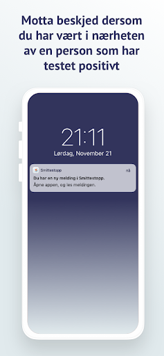
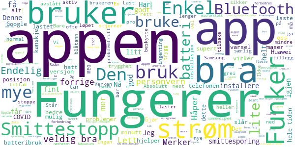
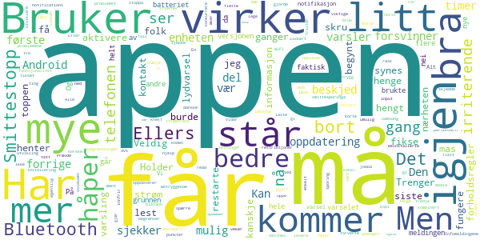
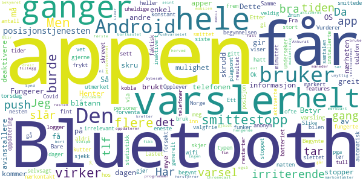
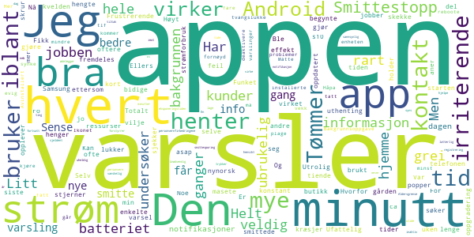
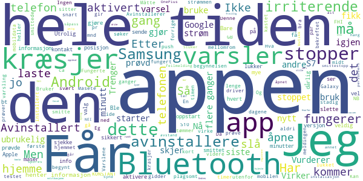

# Smittestopp
App version ``1.0.3``

Analyzed with [covid-apps-observer](http://github.com/covid-apps-observer) project, version ``0.1``

## App overview
| | |
|-------------------------|-------------------------| 
| **Name**&nbsp;&nbsp;&nbsp;&nbsp;&nbsp;&nbsp;&nbsp;&nbsp;&nbsp;&nbsp;&nbsp;&nbsp;&nbsp;&nbsp;&nbsp;&nbsp;&nbsp;&nbsp;&nbsp;&nbsp;&nbsp;&nbsp;&nbsp;&nbsp;&nbsp;&nbsp;&nbsp;&nbsp;&nbsp;&nbsp;&nbsp;&nbsp;&nbsp;&nbsp;&nbsp;&nbsp;&nbsp;&nbsp;&nbsp;&nbsp;  | Smittestopp |
| **Unique identifier** | no.fhi.smittestopp_exposure_notification |
| **Link to Google Play** | [https://play.google.com/store/apps/details?id=no.fhi.smittestopp_exposure_notification](https://play.google.com/store/apps/details?id=no.fhi.smittestopp_exposure_notification) |
| **Summary**  | Last ned Smittestopp, og bli med på å stoppe smittespredningen i Norge. |
| **Privacy policy** | [https://www.fhi.no/om/smittestopp/personvern/](https://www.fhi.no/om/smittestopp/personvern/) |
| **Latest version** | 1.0.3 |
| **Last update** | 2021-01-27 19:35:28 |
| **Recent changes** | Mindre feilrettelse |
| **Installs**  | 100 000+ |
| **Category** | Sunnhet og trening |
| **First release** | 14. des. 2020 |
| **Size**  | 332M |
| **Supported Android version**  | 6.0 og nyere |

### Description
> Smittestopp er frivillig å bruke, og er et av flere tiltak som kan bidra til å forhindre spredning av koronaviruset. Smittestopp har 16 års aldersgrense.   
 Du får beskjed hvis du har vært i nærheten av en person med covid-19. Du kan gi beskjed til andre brukere av appen hvis du får covid-19. Slik kan vi alle passe bedre på de vi er i nærheten av. 
 Du kan ikke se hvem eller hvor mange smittede du har vært i nærheten av, og de kan ikke se deg. 
 Hvis du gir beskjed om at du er smittet, kan ikke andre se at det er du som gjør det. 
 Appen registrerer ikke data om hvor du er.  
 Takk for at du bidrar til å stoppe spredning av koronavirus. 
 Smittestopp er utviklet av Folkehelseinstituttet i Norge. Les mer om appen på www.helsenorge.no/smittestopp

### User interface
The developers of the app provide the following screenshots in the Google play store.
| | | |
|:-------------------------:|:-------------------------:|:-------------------------:|
 |   |   |   | 

## Development team
In the following we report the main information provided by the development team in the Google play store.

| | |
|-------------------------|-------------------------|
| **Developer**  | Folkehelseinstituttet |
| **Website**  | [https://www.fhi.no](https://www.fhi.no) |
| **Email** | folkehelseinstituttet@fhi.no |
| **Physical address**  | - |
| **Other developed apps**  | [https://play.google.com/store/apps/developer?id=Folkehelseinstituttet](https://play.google.com/store/apps/developer?id=Folkehelseinstituttet) |

## Android support

| | |
|-------------------------|-------------------------|
| **Declared target Android version**  | Android10, version 10 (API level 29) |
| **Effective target Android version**  | Android10, version 10 (API level 29) |
| **Minimum supported Android version**  | Marshmallow, version 6.0 (API level 23) |
| **Maximum target Android version**  | - |

The larger the difference between the minimum and maximum supported Android versions, the better. A larger difference means a wider audience. For example, old phones have a very low Android version, so a high minimum supported Android version means that the app cannot be used by users with old phones, thus leading to accessibility problems. 

## Requested permissions

In the following we report the complete list of the permissions requested by the app. 

| **Permission** | **Protection level** | **Description** | 
|-------------------------|-------------------------|-------------------------|
 **android.permission ACCESS_NETWORK_STATE** | Normal | Allows applications to access information about networks. 
 **android.permission BLUETOOTH** | Normal | Allows applications to connect to paired bluetooth devices. 
 **android.permission FOREGROUND_SERVICE** | Normal | Allows a regular application to use Service.startForeground. 
 **android.permission INTERNET** | Normal | Allows applications to open network sockets. 
 **android.permission READ_APP_BADGE** | - | - 
 **android.permission RECEIVE_BOOT_COMPLETED** | Normal | Allows an application to receive the Intent.ACTION_BOOT_COMPLETED that is broadcast after the system finishes booting. 
 **android.permission WAKE_LOCK** | Normal | Allows using PowerManager WakeLocks to keep processor from sleeping or screen from dimming. 
 **com.anddoes.launcher.permission UPDATE_COUNT** | - | - 
 **com.htc.launcher.permission READ_SETTINGS** | - | - 
 **com.htc.launcher.permission UPDATE_SHORTCUT** | - | - 
 **com.huawei.android.launcher.permission CHANGE_BADGE** | - | - 
 **com.huawei.android.launcher.permission READ_SETTINGS** | - | - 
 **com.huawei.android.launcher.permission WRITE_SETTINGS** | - | - 
 **com.majeur.launcher.permission UPDATE_BADGE** | - | - 
 **com.oppo.launcher.permission READ_SETTINGS** | - | - 
 **com.oppo.launcher.permission WRITE_SETTINGS** | - | - 
 **com.sec.android.provider.badge.permission READ** | - | - 
 **com.sec.android.provider.badge.permission WRITE** | - | - 
 **com.sonyericsson.home.permission BROADCAST_BADGE** | - | - 
 **com.sonymobile.home.permission PROVIDER_INSERT_BADGE** | - | - 
 **me.everything.badger.permission BADGE_COUNT_READ** | - | - 
 **me.everything.badger.permission BADGE_COUNT_WRITE** | - | - 

## Mentioned servers

| **Server** | **Registrant** | **Registrant country** | **Creation date** | 
|-------------------------|-------------------------|-------------------------|-------------------------|
 | google.com | Google LLC | :us: US | 1997-09-15 04:00:00 |
 | microsoft.com | Microsoft Corporation | :us: US | 1991-05-02 04:00:00 |
 | googleapis.com | Google LLC | :us: US | 2005-01-25 17:52:26 |

## Security analysis 

Below we report the main security warnings raised by our execution of the [Androwarn](https://github.com/maaaaz/androwarn) security analysis tool.

**Telephony identifiers leakage**
> - This application reads the ISO country code equivalent of the current registered operator's MCC (Mobile Country Code) 
> - This application reads the numeric name (MCC+MNC) of current registered operator 
> - This application reads the operator name 

**Connection interfaces exfiltration**
> - This application reads details about the currently active data network 
> - This application tries to find out if the currently active data network is metered 

**Code execution**
> - This application loads a native library: 'mono-native' 
> - This application loads a native library: 'monodroid' 
> - This application loads a native library: 'monosgen-2.0' 
> - This application loads a native library: 'xamarin-app' 
> - This application loads a native library: 'xamarin-debug-app-helper' 

## User ratings and reviews

Below we provide information about how end users are reacting to the app in terms of ratings and reviews in the Google Play store.

### Ratings

The Smittestopp app has been installed by more than **100000** times. At this time, **495** rated the app and its average score is **3.0754716**. Below we show the distribution of the ratings across the usual star-based rating of Google Play

:star::star::star::star::star:: 202

:star::star::star::star:: 46

:star::star::star:: 32

:star::star:: 18

:star:: 197

### Reviews 

#### 5-star reviews

> Grei app fungere fint!  :date: __2021-02-13 20:51:19__

> Endelig er det en app som alle kan bruke. Men irriterende pling innimellom, hvorfor? Bluetooth tror jeg.  :date: __2021-02-11 12:24:48__

> Merker ikke mer batteribruk. Bra app som vi alle bør installere.  :date: __2021-02-05 10:32:46__

> En god trygghet. Har den i lomma hele tiden. Jobber i butikk og treffer mange i løpet av dagen. Funker veldig bra på min Samsung s 7. Ikke maser den, og ikke drar den mye strøm  :date: __2021-02-04 23:12:41__

> 23.01.21 ga jeg en stjerne, fordi appen ba meg om å slå på posisjonsfunksjonen i tillegg til Bluetooth. Jeg slår på posisjon kun når jeg bruker kartapper/navigasjonsapper, men ellers har jeg den avslått. Den forrige smittesporingsappen ble stoppet nettopp på grunn av at den benyttet posisjon. Nå gir jeg fem stjerner fordi appen ikke ber om posisjon, og fordi den er et meget viktig bidrag for smittesporing.  :date: __2021-02-04 09:34:19__

> Last ned og vær med på "dugnaden" om å stoppe fysaken og få en bedre fremtid. 😃  :date: __2021-02-03 23:07:53__

> God og fornuftig app for å forhindre spredning😀👍  :date: __2021-02-03 19:44:02__

> En trygghet og ha appen .  :date: __2021-02-03 19:25:40__

> Fungerer som en sjarm, har ikke hatt noen problemer med den!  :date: __2021-02-03 19:07:00__

> Fungerer supert etter at den gikk over fra GPS til Bluetooth. Maser litt mye, men det ga seg når jeg skrudde av varslene.  :date: __2021-02-03 18:20:45__

#### 4-star reviews

> Nå virker appen igjen uten å kræsje.  :date: __2021-02-05 19:31:39__

> Bra løsning  :date: __2021-02-03 18:16:39__

> Har Samsung 7s. Etter nokre veker stoppa han kvar gang han blei opna. Reinstallerte tre ganger, kombinert med restart av telefonen. Ved tredje installering, ser appen ut til å fungere.  :date: __2021-01-29 16:10:45__

> Bruker litt strøm, men det må man forvente da den bruker blåtann og WiFi.  :date: __2021-01-28 10:13:48__

> Ser ut til og fungere slik som ment. Ikke merkbart strømtrekk. Litt irriterende er det at det kommer lydvarsel når den oppdaterer.  :date: __2021-01-27 09:12:18__

> Betryggende.  :date: __2021-01-26 21:09:16__

> Virker bra...  :date: __2021-01-26 18:54:43__

> Trenger en oppdatering for Android 11, spammer voldsomt mye notifications om at den sjekker... Holder å gi beskjed om viktige varsler!  :date: __2021-01-24 14:07:17__

> Virker som de har knekt koden. Alle forholdsregler tatt. Men redd det er så mange forholdsregler og begrensninger at det begrenser smittesporinga. Men alle bør ha denne da kan løse problemet og restriksjoner. For korte frister og for rask utvikling gjorde at det var umulig for norske utviklere å levere eller konkurrere, bare mulig å lage en norsk kopi av den danske appen. Den første appen var kanskje bedre egentlig, men problemene fra den første er løst.  :date: __2021-01-23 08:15:08__

> Listen up! Veldig bra jobba med appen synes jeg, dvs jeg synes appen innfrir på de fleste punkter som har vært oppe i media, og det håper jeg folk flest gjør også (burde i alle fall). En liten ting: Kan dere sjekke bluetooth funksjonalitet. Opplever en del mas om å måtte aktivere sporing/må skru på BT osv, selv om jeg har gjort det mange ganger. Sikkert enkelt å fikse, bare å spørre hvis dere trenger litt mer input/hjelp. mvh Vidar Vestnes 🤗  :date: __2021-01-17 18:29:59__

#### 3-star reviews

> Appen er enkel og funker bra, men den har en veldig irriterende push-varsling på Android som jeg ikke får skrudd. Push kommer hver gang "smittestopp undersøker om du har vært i nærheten av smittede personer". Dette er selvsagt irrelevant for meg; men gi meg gjerne push om jeg faktisk har vært i nærheten av noen som har markert seg som smittet!  :date: __2021-02-13 18:08:44__

> Kommer med irriterende varsler mange ganger om dagen. Slike varsler burde være valgfrie. Vurderer å avinstallere pga. det.  :date: __2021-02-12 23:44:26__

> I begynnelsen fungerte den utmerket. Etter siste OS-oppdatering har jeg begynt å få varsel hver eneste gang appen gjør en sjekk, noe som til tider skjer flere ganger i minuttet. Bare mens jeg har skrevet dette har den gitt varsel 3 ganger. Jeg tør ikke deaktivere varsler fra appen i Android heller, i frykt for å ikke få med meg at jeg har hatt nærkontakt av den uheldige typen.  :date: __2021-02-12 17:19:06__

> Fungerer stort sett greit hele tiden, MEN.. virker som at den tar over bluetooth. Opplever dette når bilen min er kobla til telefon. Da kutter den samtalen.  :date: __2021-02-12 16:07:33__

> Ett er noen dager.. slår appen seg automatisk av... dette er ikke helt bra  :date: __2021-02-09 22:29:15__

> Helt greit Men jeg forventa flere features som en enkel statistikk på Covid-19 i Norge generelt.  :date: __2021-02-05 01:03:08__

> Burde brukt wifi, ikke blåtann. Bruker nesten aldri blåtann. Betyr ofte inaktivert smittestopp hos meg og andre...  :date: __2021-02-04 09:51:11__

> Ok  :date: __2021-02-03 16:32:31__

> Henter informasjon og gir varsler x antall ganger om dagen/natten, plagsomt  :date: __2021-02-02 04:46:29__

> Jeg vet ikke om det er kun på min tlf at batteriet konstant viser 100% frem til man restarter den. Begynte da jeg installerte appen 🤔  :date: __2021-01-27 11:58:34__

#### 2-star reviews

> Sjekker utrolig ofte når det er få personer/mobiler i nærheten samtidig som den suger strøm.  :date: __2021-02-12 16:15:45__

> Varsler hele tiden og hver gang jeg åpner en app. Fix dette.Hvis ikke avinstallerer jeg appen  :date: __2021-02-12 14:11:07__

> Har kommet en oppdatering nå som gjør at det kommer opp notifications hele tiden. Sykt irriterende. To ganger mens jeg skrev de linjene over.  :date: __2021-02-10 19:45:41__

> Alt for mange oppdateringer i perioder.  :date: __2021-02-09 00:58:49__

> De siste 2 dagene popper det opp at den henter info 1-2 ganger pr minutt når jeg bruker telefonen til andre ting. Kjempe irriterende. Den fungerte helt fint i starten.  :date: __2021-02-07 01:15:42__

> Den varsler og varsler og varsler om at den henter informasjon... selv om jeg skrur den av på kvelden. Jeg aner ikke om den gjør jobben, men jeg opplever den som masete. Er det med vilje? Kan ikke den bare gjøre jobben sin i bakgrunnen?  :date: __2021-02-05 23:51:56__

> Helt grei app, men bruker en del strøm og popper opp at den undersøker hvert tiende minutt. Noe som til tider er veldig irriterende..  :date: __2021-02-05 19:05:51__

> Tømmer batteriet på kort tid,  :date: __2021-02-04 18:48:15__

> Appen "undersøker" hvert bidige minutt! Ufattelig irriterende!  :date: __2021-02-04 16:45:20__

> For meg som jobber i butikk er denne ubrukelig ettersom jeg er i kontakt med kunder hele tiden. Og enkelte ganger er jeg i kontakt med kunder mer enn 15 min.  :date: __2021-02-03 14:51:37__

#### 1-star reviews

> Appen gir KONSTANT notifikasjoner om at den søker om noen jeg har vært rundt har vært smittet. Hvorfor i huleste lyser den opp mobilen min med ubrukelig info. Vært stille eller si jeg kan ha blitt smittet. Endres ikke dette snart avinstalleres appen.  :date: __2021-02-13 21:45:53__

> Ikke mye å hente her av nyttig informasjon om Covid 19. Så lenge det er frivillig å registrere seg så er det vel ikke mange som gjør dette. Jeg bor midt i Oslo men aldri opplevd at jeg har fått varsel om smitte Varslene kommer midt på natten selv om jeg har vært hjemme i mange timer. Nå avinstallere jeg appen.  :date: __2021-02-12 23:40:16__

> Så jævlig med push-varsler om at den skal sjekke. Eg drite no vel I det når eg ikkje har vært utforbi døra den siste veka omtrent. Fleire ganger i timen. Eg har no byttet til corona warn. Den holder i det minste kjeften!!!  :date: __2021-02-12 22:51:21__

> Nå starter den hele tid. Utvikler svar oss. Den statter hele tiden når jeg starter andre apper. Usikker på om jeg gidder dette. Ble slik for et par dager siden. Hva skjer?  :date: __2021-02-12 13:29:19__

> Ikke  :date: __2021-02-12 09:28:17__

> Om ikke Bluetooth er på så maser den hele tiden at det ikke er aktivert, det orker jeg ikke å høre på  :date: __2021-02-12 07:44:25__

> Var egentlig fornøyd med denne men den har nå begynt å sjekke smitte ca. Annenhvert minutt. Jeg prøvde å slå den av men da fortsatte den bare med å prøve å sjekke om jeg koblet meg til igjen. Jeg prøvde å stoppe den men ingen endring. Så nå vurderer jeg å avinstallere for dette er svært irriterende!  :date: __2021-02-11 07:34:57__

> I begynnelsen var det null stress. Men siste dagene kom det varsel HELE TIDEN. DET gidder vi ikke Høie.. Ble avinstallert.  :date: __2021-02-10 21:30:05__

> Måtte avinstallere, maser/varsler hele tiden  :date: __2021-02-10 19:20:39__

> Appen må reaktiveres flere ganger i døgnet...😟  :date: __2021-02-10 09:04:59__

