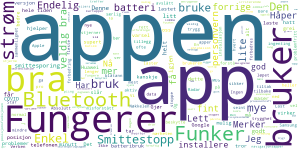
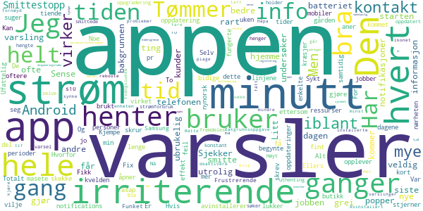

# Smittestopp
App version ``1.0.3``

Analyzed with [covid-apps-observer](http://github.com/covid-apps-observer) project, version ``0.1``

## App overview
| | |
|-------------------------|-------------------------| 
| **Name**&nbsp;&nbsp;&nbsp;&nbsp;&nbsp;&nbsp;&nbsp;&nbsp;&nbsp;&nbsp;&nbsp;&nbsp;&nbsp;&nbsp;&nbsp;&nbsp;&nbsp;&nbsp;&nbsp;&nbsp;&nbsp;&nbsp;&nbsp;&nbsp;&nbsp;&nbsp;&nbsp;&nbsp;&nbsp;&nbsp;&nbsp;&nbsp;&nbsp;&nbsp;&nbsp;&nbsp;&nbsp;&nbsp;&nbsp;&nbsp;  | Smittestopp |
| **Unique identifier** | no.fhi.smittestopp_exposure_notification |
| **Link to Google Play** | [https://play.google.com/store/apps/details?id=no.fhi.smittestopp_exposure_notification](https://play.google.com/store/apps/details?id=no.fhi.smittestopp_exposure_notification) |
| **Summary**  | Last ned Smittestopp, og bli med på å stoppe smittespredningen i Norge. |
| **Privacy policy** | [https://www.fhi.no/om/smittestopp/personvern/](https://www.fhi.no/om/smittestopp/personvern/) |
| **Latest version** | 1.0.3 |
| **Last update** | 2021-01-27 19:35:28 |
| **Recent changes** | Mindre feilrettelse |
| **Installs**  | 100 000+ |
| **Category** | Sunnhet og trening |
| **First release** | 14. des. 2020 |
| **Size**  | 332M |
| **Supported Android version**  | 6.0 og nyere |

### Description
> Smittestopp er frivillig å bruke, og er et av flere tiltak som kan bidra til å forhindre spredning av koronaviruset. Smittestopp har 16 års aldersgrense.   
 Du får beskjed hvis du har vært i nærheten av en person med covid-19. Du kan gi beskjed til andre brukere av appen hvis du får covid-19. Slik kan vi alle passe bedre på de vi er i nærheten av. 
 Du kan ikke se hvem eller hvor mange smittede du har vært i nærheten av, og de kan ikke se deg. 
 Hvis du gir beskjed om at du er smittet, kan ikke andre se at det er du som gjør det. 
 Appen registrerer ikke data om hvor du er.  
 Takk for at du bidrar til å stoppe spredning av koronavirus. 
 Smittestopp er utviklet av Folkehelseinstituttet i Norge. Les mer om appen på www.helsenorge.no/smittestopp

### User interface
The developers of the app provide the following screenshots in the Google play store.
| | | |
|:-------------------------:|:-------------------------:|:-------------------------:|
 |   |   |   | 

## Development team
In the following we report the main information provided by the development team in the Google play store.

| | |
|-------------------------|-------------------------|
| **Developer**  | Folkehelseinstituttet |
| **Website**  | [https://www.fhi.no](https://www.fhi.no) |
| **Email** | folkehelseinstituttet@fhi.no |
| **Physical address**  | - |
| **Other developed apps**  | [https://play.google.com/store/apps/developer?id=Folkehelseinstituttet](https://play.google.com/store/apps/developer?id=Folkehelseinstituttet) |

## Android support

| | |
|-------------------------|-------------------------|
| **Declared target Android version**  | Android10, version 10 (API level 29) |
| **Effective target Android version**  | Android10, version 10 (API level 29) |
| **Minimum supported Android version**  | Marshmallow, version 6.0 (API level 23) |
| **Maximum target Android version**  | - |

The larger the difference between the minimum and maximum supported Android versions, the better. A larger difference means a wider audience. For example, old phones have a very low Android version, so a high minimum supported Android version means that the app cannot be used by users with old phones, thus leading to accessibility problems. 

## Requested permissions

In the following we report the complete list of the permissions requested by the app. 

| **Permission** | **Protection level** | **Description** | 
|-------------------------|-------------------------|-------------------------|
 **android.permission ACCESS_NETWORK_STATE** | Normal | Allows applications to access information about networks. 
 **android.permission BLUETOOTH** | Normal | Allows applications to connect to paired bluetooth devices. 
 **android.permission FOREGROUND_SERVICE** | Normal | Allows a regular application to use Service.startForeground. 
 **android.permission INTERNET** | Normal | Allows applications to open network sockets. 
 **android.permission READ_APP_BADGE** | - | - 
 **android.permission RECEIVE_BOOT_COMPLETED** | Normal | Allows an application to receive the Intent.ACTION_BOOT_COMPLETED that is broadcast after the system finishes booting. 
 **android.permission WAKE_LOCK** | Normal | Allows using PowerManager WakeLocks to keep processor from sleeping or screen from dimming. 
 **com.anddoes.launcher.permission UPDATE_COUNT** | - | - 
 **com.htc.launcher.permission READ_SETTINGS** | - | - 
 **com.htc.launcher.permission UPDATE_SHORTCUT** | - | - 
 **com.huawei.android.launcher.permission CHANGE_BADGE** | - | - 
 **com.huawei.android.launcher.permission READ_SETTINGS** | - | - 
 **com.huawei.android.launcher.permission WRITE_SETTINGS** | - | - 
 **com.majeur.launcher.permission UPDATE_BADGE** | - | - 
 **com.oppo.launcher.permission READ_SETTINGS** | - | - 
 **com.oppo.launcher.permission WRITE_SETTINGS** | - | - 
 **com.sec.android.provider.badge.permission READ** | - | - 
 **com.sec.android.provider.badge.permission WRITE** | - | - 
 **com.sonyericsson.home.permission BROADCAST_BADGE** | - | - 
 **com.sonymobile.home.permission PROVIDER_INSERT_BADGE** | - | - 
 **me.everything.badger.permission BADGE_COUNT_READ** | - | - 
 **me.everything.badger.permission BADGE_COUNT_WRITE** | - | - 

## Mentioned servers

| **Server** | **Registrant** | **Registrant country** | **Creation date** | 
|-------------------------|-------------------------|-------------------------|-------------------------|
 | google.com | Google LLC | :us: US | 1997-09-15 04:00:00 |
 | microsoft.com | Microsoft Corporation | :us: US | 1991-05-02 04:00:00 |
 | googleapis.com | Google LLC | :us: US | 2005-01-25 17:52:26 |

## Security analysis 

Below we report the main security warnings raised by our execution of the [Androwarn](https://github.com/maaaaz/androwarn) security analysis tool.

**Telephony identifiers leakage**
> - This application reads the ISO country code equivalent of the current registered operator's MCC (Mobile Country Code) 
> - This application reads the numeric name (MCC+MNC) of current registered operator 
> - This application reads the operator name 

**Connection interfaces exfiltration**
> - This application reads details about the currently active data network 
> - This application tries to find out if the currently active data network is metered 

**Code execution**
> - This application loads a native library: 'mono-native' 
> - This application loads a native library: 'monodroid' 
> - This application loads a native library: 'monosgen-2.0' 
> - This application loads a native library: 'xamarin-app' 
> - This application loads a native library: 'xamarin-debug-app-helper' 

## User ratings and reviews

Below we provide information about how end users are reacting to the app in terms of ratings and reviews in the Google Play store.

### Ratings

The Smittestopp app has been installed by more than **100000** times. At this time, **495** rated the app and its average score is **3.0754716**. Below we show the distribution of the ratings across the usual star-based rating of Google Play

:star::star::star::star::star:: 202

:star::star::star::star:: 46

:star::star::star:: 32

:star::star:: 18

:star:: 197

### Reviews 

#### 5-star reviews

> Merker ikke mer batteribruk. Bra app som vi alle bør installere.  :date: __2021-02-05 10:32:46__

> En god trygghet. Har den i lomma hele tiden. Jobber i butikk og treffer mange i løpet av dagen. Funker veldig bra på min Samsung s 7. Ikke maser den, og ikke drar den mye strøm  :date: __2021-02-04 23:12:41__

> 23.01.21 ga jeg en stjerne, fordi appen ba meg om å slå på posisjonsfunksjonen i tillegg til Bluetooth. Jeg slår på posisjon kun når jeg bruker kartapper/navigasjonsapper, men ellers har jeg den avslått. Den forrige smittesporingsappen ble stoppet nettopp på grunn av at den benyttet posisjon. Nå gir jeg fem stjerner fordi appen ikke ber om posisjon, og fordi den er et meget viktig bidrag for smittesporing.  :date: __2021-02-04 09:34:19__

> Last ned og vær med på "dugnaden" om å stoppe fysaken og få en bedre fremtid. 😃  :date: __2021-02-03 23:07:53__

> God og fornuftig app for å forhindre spredning😀👍  :date: __2021-02-03 19:44:02__

> En trygghet og ha appen .  :date: __2021-02-03 19:25:40__

> Fungerer som en sjarm, har ikke hatt noen problemer med den!  :date: __2021-02-03 19:07:00__

> Fungerer supert etter at den gikk over fra GPS til Bluetooth. Maser litt mye, men det ga seg når jeg skrudde av varslene.  :date: __2021-02-03 18:20:45__

> Gjør ingenting av seg. Bare ligger der og passer på at jeg kan få og gi innsikt om en smittesituasjon skulle oppstå som kan påvirke andre. Den kunnskapen og muligheten er ikke tung! å bære  :date: __2021-02-02 01:55:05__

> Bra  :date: __2021-01-28 14:49:31__

#### 4-star reviews

> Nå virker appen igjen uten å kræsje.  :date: __2021-02-05 19:31:39__

> Bra løsning  :date: __2021-02-03 18:16:39__

> Har Samsung 7s. Etter nokre veker stoppa han kvar gang han blei opna. Reinstallerte tre ganger, kombinert med restart av telefonen. Ved tredje installering, ser appen ut til å fungere.  :date: __2021-01-29 16:10:45__

> Bruker litt strøm, men det må man forvente da den bruker blåtann og WiFi.  :date: __2021-01-28 10:13:48__

> Ser ut til og fungere slik som ment. Ikke merkbart strømtrekk. Litt irriterende er det at det kommer lydvarsel når den oppdaterer.  :date: __2021-01-27 09:12:18__

> Betryggende.  :date: __2021-01-26 21:09:16__

> Virker bra...  :date: __2021-01-26 18:54:43__

> Trenger en oppdatering for Android 11, spammer voldsomt mye notifications om at den sjekker... Holder å gi beskjed om viktige varsler!  :date: __2021-01-24 14:07:17__

> Virker som de har knekt koden. Alle forholdsregler tatt. Men redd det er så mange forholdsregler og begrensninger at det begrenser smittesporinga. Men alle bør ha denne da kan løse problemet og restriksjoner. For korte frister og for rask utvikling gjorde at det var umulig for norske utviklere å levere eller konkurrere, bare mulig å lage en norsk kopi av den danske appen. Den første appen var kanskje bedre egentlig, men problemene fra den første er løst.  :date: __2021-01-23 08:15:08__

> Listen up! Veldig bra jobba med appen synes jeg, dvs jeg synes appen innfrir på de fleste punkter som har vært oppe i media, og det håper jeg folk flest gjør også (burde i alle fall). En liten ting: Kan dere sjekke bluetooth funksjonalitet. Opplever en del mas om å måtte aktivere sporing/må skru på BT osv, selv om jeg har gjort det mange ganger. Sikkert enkelt å fikse, bare å spørre hvis dere trenger litt mer input/hjelp. mvh Vidar Vestnes 🤗  :date: __2021-01-17 18:29:59__

#### 3-star reviews

> Helt greit Men jeg forventa flere features som en enkel statistikk på Covid-19 i Norge generelt.  :date: __2021-02-05 01:03:08__

> Burde brukt wifi, ikke blåtann. Bruker nesten aldri blåtann. Betyr ofte inaktivert smittestopp hos meg og andre...  :date: __2021-02-04 09:51:11__

> Ok  :date: __2021-02-03 16:32:31__

> Henter informasjon og gir varsler x antall ganger om dagen/natten, plagsomt  :date: __2021-02-02 04:46:29__

> Jeg vet ikke om det er kun på min tlf at batteriet konstant viser 100% frem til man restarter den. Begynte da jeg installerte appen 🤔  :date: __2021-01-27 11:58:34__

> Den virker helt fint!  :date: __2021-01-27 05:23:21__

> Lastet ned da denne skulle være anonym i bruk og kun gå tlf til tlf via Bluetooth. Den aktiverte posisjon med en gang, når man tar av dette virker ikke appen. Da er det tull at den kun bruker Bluetooth.. app slettet etter 2min.  :date: __2021-01-26 12:28:19__

> Fra torsdag 21.1.2022 logger ikke smittestopp seg inn. Får bare smittestopp har stoppet. Har forsøkt med flere Android telefoner. Samme resultat. Har nå avinstallere programmer.  :date: __2021-01-23 19:41:12__

> Tar merkbart mye krefter fra mobilen. Blir herved kun brukt ved bybesøk.  :date: __2021-01-22 00:07:31__

> Appen er fin, men den kom ni måneder for seint. Ingen som bruker den og da er den unyttig. Synd dere dreit dere ut med den første.  :date: __2021-01-17 06:29:04__

#### 2-star reviews

> Den varsler og varsler og varsler om at den henter informasjon... selv om jeg skrur den av på kvelden. Jeg aner ikke om den gjør jobben, men jeg opplever den som masete. Er det med vilje? Kan ikke den bare gjøre jobben sin i bakgrunnen?  :date: __2021-02-05 23:51:56__

> Helt grei app, men bruker en del strøm og popper opp at den undersøker hvert tiende minutt. Noe som til tider er veldig irriterende..  :date: __2021-02-05 19:05:51__

> Tømmer batteriet på kort tid,  :date: __2021-02-04 18:48:15__

> Appen "undersøker" hvert bidige minutt! Ufattelig irriterende!  :date: __2021-02-04 16:45:20__

> For meg som jobber i butikk er denne ubrukelig ettersom jeg er i kontakt med kunder hele tiden. Og enkelte ganger er jeg i kontakt med kunder mer enn 15 min.  :date: __2021-02-03 14:51:37__

> Selv når jeg er hjemme på gården sjekker appen iblant hvert 5 minutt iblant oftere. Litt rart. Ellers bra app. Fikk 5 stjerner før den begynte å skekke veldig mye iblant. Virker litt som en feil.  :date: __2021-02-03 03:16:09__

> Har ingen effekt.  :date: __2021-01-30 19:12:44__

> Hvorfor har dere brukt tid og ressurser på å ha nynorsk i appen?  :date: __2021-01-30 08:16:01__

> Var bra så lenge den virket. Den siste uken kræsjer den og lukker seg. Totalt ubrukelig....  :date: __2021-01-26 18:53:35__

> Tømmer jo telefonen din for strøm asap  :date: __2021-01-26 10:19:47__

#### 1-star reviews

> En app som driver å laster ned skjult innhold er uaktuelt å bruke  :date: __2021-02-06 18:51:51__

> Kommer nesten konstant varsler om at appen søker etter info, selv når app ikke er aktivert. Greit nok når man er utenfor hjemmet, men ganske irriterende og unødvendig når man ikke har forlatt huset på en stund og åpenbart ikke har vært i kontakt med noen siden forrige "søk". Avinstallert inntil videre.  :date: __2021-02-06 11:43:28__

> Bruker veldig mye strøm. Og blir koko av alle varslene. Selv om jeg ikke har flyttet meg en meter ut av hjemmet.  :date: __2021-02-06 07:52:13__

> Jeg fikk en sms fra FHI om å laste ned. Tror ikke denne fungerer... Ingen oppdaget. Verken hjemme, utenfor, i butikken, på kjøpesenter eller på gata. Ser ikke noe poeng ha den på tlf min.  :date: __2021-02-05 22:05:49__

> Vil ikke aktiveres.. Galaxy S10+ og alle kriterier er der for at det skal virke.. Talentløst  :date: __2021-02-05 04:39:06__

> Avinstallerer pga veldig ofte og irriterende notification om at den henter informasjon om smittede.  :date: __2021-02-01 20:27:00__

> Dette må være laget av noen høyt oppe i systemet, for dette her fungerer bare ikke 😅  :date: __2021-01-31 19:07:01__

> Nå fikk mobildata "bein å gå på" 12 GB på en mnd mot normalt 3-4 Gb pr mnd.....  :date: __2021-01-29 18:51:24__

> Etter valg av språk flasher neste side opp ett kort øyeblikk og forsvinner ut i det blå. Får ikke mulighet til videre valg.. NB! Fungerte i starten/tidligere versjoner. BlackBerry Key2, Android versjon 8.1.0 NB! Da ser det endelig ut til at appen fungerer! Etter versjon 1.0.3 datert 27 januar fikk jeg installert OK!  :date: __2021-01-29 18:22:07__

> Appen lukker seg m en gang jeg skal åpne den. Prøvd som flere her å avinstallere og laste på nytt. Samme skjer  :date: __2021-01-28 16:18:33__

