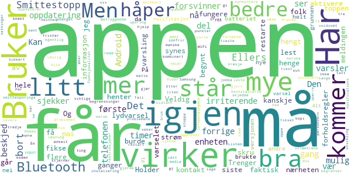

# Smittestopp
App version ``1.0.3``

Analyzed with [covid-apps-observer](http://github.com/covid-apps-observer) project, version ``0.1``

## App overview
| | |
|-------------------------|-------------------------| 
| **Name**&nbsp;&nbsp;&nbsp;&nbsp;&nbsp;&nbsp;&nbsp;&nbsp;&nbsp;&nbsp;&nbsp;&nbsp;&nbsp;&nbsp;&nbsp;&nbsp;&nbsp;&nbsp;&nbsp;&nbsp;&nbsp;&nbsp;&nbsp;&nbsp;&nbsp;&nbsp;&nbsp;&nbsp;&nbsp;&nbsp;&nbsp;&nbsp;&nbsp;&nbsp;&nbsp;&nbsp;&nbsp;&nbsp;&nbsp;&nbsp;  | Smittestopp |
| **Unique identifier** | no.fhi.smittestopp_exposure_notification |
| **Link to Google Play** | [https://play.google.com/store/apps/details?id=no.fhi.smittestopp_exposure_notification](https://play.google.com/store/apps/details?id=no.fhi.smittestopp_exposure_notification) |
| **Summary**  | Last ned Smittestopp, og bli med på å stoppe smittespredningen i Norge. |
| **Privacy policy** | [https://www.fhi.no/om/smittestopp/personvern/](https://www.fhi.no/om/smittestopp/personvern/) |
| **Latest version** | 1.0.3 |
| **Last update** | 2021-01-27 19:35:28 |
| **Recent changes** | Mindre feilrettelse |
| **Installs**  | 100 000+ |
| **Category** | Sunnhet og trening |
| **First release** | 14. des. 2020 |
| **Size**  | 332M |
| **Supported Android version**  | 6.0 og nyere |

### Description
> Smittestopp er frivillig å bruke, og er et av flere tiltak som kan bidra til å forhindre spredning av koronaviruset. Smittestopp har 16 års aldersgrense.   
 Du får beskjed hvis du har vært i nærheten av en person med covid-19. Du kan gi beskjed til andre brukere av appen hvis du får covid-19. Slik kan vi alle passe bedre på de vi er i nærheten av. 
 Du kan ikke se hvem eller hvor mange smittede du har vært i nærheten av, og de kan ikke se deg. 
 Hvis du gir beskjed om at du er smittet, kan ikke andre se at det er du som gjør det. 
 Appen registrerer ikke data om hvor du er.  
 Takk for at du bidrar til å stoppe spredning av koronavirus. 
 Smittestopp er utviklet av Folkehelseinstituttet i Norge. Les mer om appen på www.helsenorge.no/smittestopp

### User interface
The developers of the app provide the following screenshots in the Google play store.
| | | |
|:-------------------------:|:-------------------------:|:-------------------------:|
 |   |   |   | 

## Development team
In the following we report the main information provided by the development team in the Google play store.

| | |
|-------------------------|-------------------------|
| **Developer**  | Folkehelseinstituttet |
| **Website**  | [https://www.fhi.no](https://www.fhi.no) |
| **Email** | folkehelseinstituttet@fhi.no |
| **Physical address**  | - |
| **Other developed apps**  | [https://play.google.com/store/apps/developer?id=Folkehelseinstituttet](https://play.google.com/store/apps/developer?id=Folkehelseinstituttet) |

## Android support

| | |
|-------------------------|-------------------------|
| **Declared target Android version**  | Android10, version 10 (API level 29) |
| **Effective target Android version**  | Android10, version 10 (API level 29) |
| **Minimum supported Android version**  | Marshmallow, version 6.0 (API level 23) |
| **Maximum target Android version**  | - |

The larger the difference between the minimum and maximum supported Android versions, the better. A larger difference means a wider audience. For example, old phones have a very low Android version, so a high minimum supported Android version means that the app cannot be used by users with old phones, thus leading to accessibility problems. 

## Requested permissions

In the following we report the complete list of the permissions requested by the app. 

| **Permission** | **Protection level** | **Description** | 
|-------------------------|-------------------------|-------------------------|
 **android.permission ACCESS_NETWORK_STATE** | Normal | Allows applications to access information about networks. 
 **android.permission BLUETOOTH** | Normal | Allows applications to connect to paired bluetooth devices. 
 **android.permission FOREGROUND_SERVICE** | Normal | Allows a regular application to use Service.startForeground. 
 **android.permission INTERNET** | Normal | Allows applications to open network sockets. 
 **android.permission READ_APP_BADGE** | - | - 
 **android.permission RECEIVE_BOOT_COMPLETED** | Normal | Allows an application to receive the Intent.ACTION_BOOT_COMPLETED that is broadcast after the system finishes booting. 
 **android.permission WAKE_LOCK** | Normal | Allows using PowerManager WakeLocks to keep processor from sleeping or screen from dimming. 
 **com.anddoes.launcher.permission UPDATE_COUNT** | - | - 
 **com.htc.launcher.permission READ_SETTINGS** | - | - 
 **com.htc.launcher.permission UPDATE_SHORTCUT** | - | - 
 **com.huawei.android.launcher.permission CHANGE_BADGE** | - | - 
 **com.huawei.android.launcher.permission READ_SETTINGS** | - | - 
 **com.huawei.android.launcher.permission WRITE_SETTINGS** | - | - 
 **com.majeur.launcher.permission UPDATE_BADGE** | - | - 
 **com.oppo.launcher.permission READ_SETTINGS** | - | - 
 **com.oppo.launcher.permission WRITE_SETTINGS** | - | - 
 **com.sec.android.provider.badge.permission READ** | - | - 
 **com.sec.android.provider.badge.permission WRITE** | - | - 
 **com.sonyericsson.home.permission BROADCAST_BADGE** | - | - 
 **com.sonymobile.home.permission PROVIDER_INSERT_BADGE** | - | - 
 **me.everything.badger.permission BADGE_COUNT_READ** | - | - 
 **me.everything.badger.permission BADGE_COUNT_WRITE** | - | - 

## Mentioned servers

| **Server** | **Registrant** | **Registrant country** | **Creation date** | 
|-------------------------|-------------------------|-------------------------|-------------------------|
 | google.com | Google LLC | :us: US | 1997-09-15 04:00:00 |
 | microsoft.com | Microsoft Corporation | :us: US | 1991-05-02 04:00:00 |
 | googleapis.com | Google LLC | :us: US | 2005-01-25 17:52:26 |

## Security analysis 

Below we report the main security warnings raised by our execution of the [Androwarn](https://github.com/maaaaz/androwarn) security analysis tool.

**Telephony identifiers leakage**
> - This application reads the ISO country code equivalent of the current registered operator's MCC (Mobile Country Code) 
> - This application reads the numeric name (MCC+MNC) of current registered operator 
> - This application reads the operator name 

**Connection interfaces exfiltration**
> - This application reads details about the currently active data network 
> - This application tries to find out if the currently active data network is metered 

**Code execution**
> - This application loads a native library: 'mono-native' 
> - This application loads a native library: 'monodroid' 
> - This application loads a native library: 'monosgen-2.0' 
> - This application loads a native library: 'xamarin-app' 
> - This application loads a native library: 'xamarin-debug-app-helper' 

## User ratings and reviews

Below we provide information about how end users are reacting to the app in terms of ratings and reviews in the Google Play store.

### Ratings

The Smittestopp app has been installed by more than **100000** times. At this time, **495** rated the app and its average score is **3.0754716**. Below we show the distribution of the ratings across the usual star-based rating of Google Play

:star::star::star::star::star:: 202

:star::star::star::star:: 46

:star::star::star:: 32

:star::star:: 18

:star:: 197

### Reviews 

#### 5-star reviews

> Bra  :date: __2021-01-28 14:49:31__

> Den nye versjonen er trygt og grei  :date: __2021-01-27 20:50:03__

> Får rett og slett ikke installert appen. Står bare å hakker.  :date: __2021-01-27 19:47:14__

> Funker topp på Samsung!  :date: __2021-01-27 08:18:27__

> Funker tilsynelatende godt på Pixel 5  :date: __2021-01-27 07:01:52__

> Veldig bra !  :date: __2021-01-26 20:02:39__

> Bra.  :date: __2021-01-26 19:03:43__

> Gjør det den skal uten problemer.  :date: __2021-01-26 18:57:01__

> Betryggende app.  :date: __2021-01-26 18:07:16__

> Funker Huawei mate 20 pro  :date: __2021-01-26 17:39:33__

#### 4-star reviews

> Har Samsung 7s. Etter nokre veker stoppa han kvar gang han blei opna. Reinstallerte tre ganger, kombinert med restart av telefonen. Ved tredje installering, ser appen ut til å fungere.  :date: __2021-01-29 16:10:45__

> Bruker litt strøm, men det må man forvente da den bruker blåtann og WiFi.  :date: __2021-01-28 10:13:48__

> Ser ut til og fungere slik som ment. Ikke merkbart strømtrekk. Litt irriterende er det at det kommer lydvarsel når den oppdaterer.  :date: __2021-01-27 09:12:18__

> Betryggende.  :date: __2021-01-26 21:09:16__

> Virker bra...  :date: __2021-01-26 18:54:43__

> Trenger en oppdatering for Android 11, spammer voldsomt mye notifications om at den sjekker... Holder å gi beskjed om viktige varsler!  :date: __2021-01-24 14:07:17__

> Virker som de har knekt koden. Alle forholdsregler tatt. Men redd det er så mange forholdsregler og begrensninger at det begrenser smittesporinga. Men alle bør ha denne da kan løse problemet og restriksjoner. For korte frister og for rask utvikling gjorde at det var umulig for norske utviklere å levere eller konkurrere, bare mulig å lage en norsk kopi av den danske appen. Den første appen var kanskje bedre egentlig, men problemene fra den første er løst.  :date: __2021-01-23 08:15:08__

> Listen up! Veldig bra jobba med appen synes jeg, dvs jeg synes appen innfrir på de fleste punkter som har vært oppe i media, og det håper jeg folk flest gjør også (burde i alle fall). En liten ting: Kan dere sjekke bluetooth funksjonalitet. Opplever en del mas om å måtte aktivere sporing/må skru på BT osv, selv om jeg har gjort det mange ganger. Sikkert enkelt å fikse, bare å spørre hvis dere trenger litt mer input/hjelp. mvh Vidar Vestnes 🤗  :date: __2021-01-17 18:29:59__

> Enkel i bruk, men føler meg ikke trygg på at den virker etter at den har hengt seg opp i "Smittestopp henter informasjon" Prøvde å restarte telefonen, men det samme skjedde igjen.... OPPDATERING: Appen er fikset, så jeg øker til 4 stjerner 😊  :date: __2021-01-16 11:44:38__

> Mye bedre personvern enn den forrige. Den her kan jeg se poenget med å laste ned, selv om den kommer noe sent.  :date: __2021-01-14 11:04:05__

#### 3-star reviews

> Jeg vet ikke om det er kun på min tlf at batteriet konstant viser 100% frem til man restarter den. Begynte da jeg installerte appen 🤔  :date: __2021-01-27 11:58:34__

> Den virker helt fint!  :date: __2021-01-27 05:23:21__

> Lastet ned da denne skulle være anonym i bruk og kun gå tlf til tlf via Bluetooth. Den aktiverte posisjon med en gang, når man tar av dette virker ikke appen. Da er det tull at den kun bruker Bluetooth.. app slettet etter 2min.  :date: __2021-01-26 12:28:19__

> Fra torsdag 21.1.2022 logger ikke smittestopp seg inn. Får bare smittestopp har stoppet. Har forsøkt med flere Android telefoner. Samme resultat. Har nå avinstallere programmer.  :date: __2021-01-23 19:41:12__

> Tar merkbart mye krefter fra mobilen. Blir herved kun brukt ved bybesøk.  :date: __2021-01-22 00:07:31__

> Appen er fin, men den kom ni måneder for seint. Ingen som bruker den og da er den unyttig. Synd dere dreit dere ut med den første.  :date: __2021-01-17 06:29:04__

> Appen og hele os på mobil stopper opp hvis jeg stopper app og midlertidig slår av bluetooth.  :date: __2021-01-16 11:24:53__

> Ser ut som den ikke oppdaterer evt nærkontakter før man slår av og på telefonen. Pushvarselet blir "hengende" fast og går ikke an å sveipe bort.  :date: __2021-01-13 10:44:51__

> Forstyrrer for Chromecast  :date: __2021-01-10 14:46:27__

> Appen fungerer. Men det er jo bare 1% av nordmenn som bruker den. Så det er helt bortkastet. Dette fikk de ikke til da det gjaldt. Akkurat som resten av smittevernet.  :date: __2021-01-02 23:27:43__

#### 2-star reviews

> Var bra så lenge den virket. Den siste uken kræsjer den og lukker seg. Totalt ubrukelig....  :date: __2021-01-26 18:53:35__

> Tømmer jo telefonen din for strøm asap  :date: __2021-01-26 10:19:47__

> Frustrerende.  :date: __2021-01-24 22:27:28__

> Funket bra på Samsung s10 med Android 10. Men etter oppgradering til Android 11 hengte varsling seg opp (konstant varsling). Ble noe bedre etter at selve appen ble oppdatert, men varsler fremdeles om uthenting av info hvert andre minutt. Utrolig irriterende!  :date: __2021-01-23 13:32:23__

> Den var grei i starten. Nå får jeg varsel fra Android ca en gang hvert minutt at Smittestopp henter informasjon, selv når jeg holder meg helt i ro hjemme.  :date: __2021-01-20 16:22:17__

> Den tømmer batteriet👎  :date: __2021-01-18 11:56:24__

> Høyt strømforbruk, henger seg ofte opp når den søker etter kontakt med smittede. Bakgrunnsoppgave, må reboote tlf eller tvangslukke app.  :date: __2021-01-13 20:33:17__

> Ikonet går ikke vekk og den henter info til evig tid  :date: __2021-01-13 17:56:01__

> Har fått problemer med min Sense etter at jeg installerte den nye Smittestopp. Måtte deaktivere appen for å kunne synke Sense.  :date: __2021-01-04 19:34:55__

> Bruker for mye strøm på enheten.  :date: __2021-01-04 18:19:41__

#### 1-star reviews

> Nå fikk mobildata "bein å gå på" 12 GB på en mnd mot normalt 3-4 Gb pr mnd.....  :date: __2021-01-29 18:51:24__

> Etter valg av språk flasher neste side opp ett kort øyeblikk og forsvinner ut i det blå. Får ikke mulighet til videre valg.. NB! Fungerte i starten/tidligere versjoner. BlackBerry Key2, Android versjon 8.1.0 NB! Da ser det endelig ut til at appen fungerer! Etter versjon 1.0.3 datert 27 januar fikk jeg installert OK!  :date: __2021-01-29 18:22:07__

> Appen stopper hver gang jeg prøver å åpne den. Jeg har avinstallert og startet på nytt. Hjelper ikke. Har også slått telefonen helt av og startet opp igjen. Men appen virker fortsatt ikke.  :date: __2021-01-29 11:04:25__

> Appen lukker seg m en gang jeg skal åpne den. Prøvd som flere her å avinstallere og laste på nytt. Samme skjer  :date: __2021-01-28 16:18:33__

> Kan man slå av den irriterende meldingen når den sjekker om man har hatt kontakt med smittede? Vurderer å slå av alle notificayions fra appen, men er redd for å gå glipp av viktige meldinger...  :date: __2021-01-28 15:49:44__

> Får ikke brukt den. Den stopper hele tiden.  :date: __2021-01-28 13:54:32__

> Denne appen kræsjer på Samsung S7 , Fix dette eller kom med en vaksine til meg NÅ  :date: __2021-01-27 16:40:49__

> Stopper gjentatte ganger  :date: __2021-01-27 15:08:17__

> Lar seg ikke starte på S7  :date: __2021-01-27 14:40:06__

> Appen krasjer ved oppstart  :date: __2021-01-27 09:46:39__

