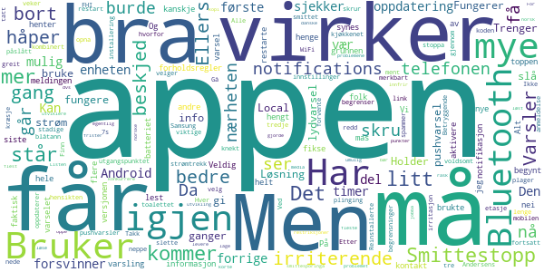
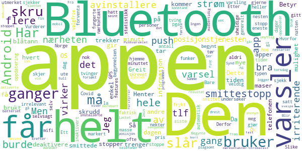
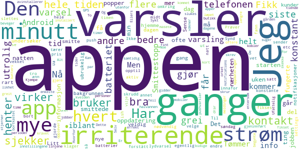
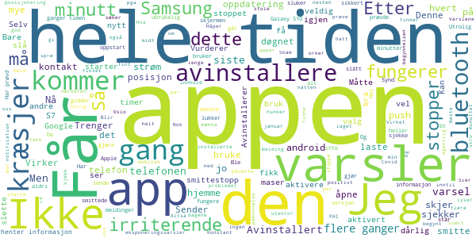

# Smittestopp
App version ``2.2.1``

Analyzed with [covid-apps-observer](http://github.com/covid-apps-observer) project, version ``0.1``

## App overview
| | |
|-------------------------|-------------------------| 
| **Name**&nbsp;&nbsp;&nbsp;&nbsp;&nbsp;&nbsp;&nbsp;&nbsp;&nbsp;&nbsp;&nbsp;&nbsp;&nbsp;&nbsp;&nbsp;&nbsp;&nbsp;&nbsp;&nbsp;&nbsp;&nbsp;&nbsp;&nbsp;&nbsp;&nbsp;&nbsp;&nbsp;&nbsp;&nbsp;&nbsp;&nbsp;&nbsp;&nbsp;&nbsp;&nbsp;&nbsp;&nbsp;&nbsp;&nbsp;&nbsp;  | Smittestopp |
| **Unique identifier** | no.fhi.smittestopp_exposure_notification |
| **Link to Google Play** | [https://play.google.com/store/apps/details?id=no.fhi.smittestopp_exposure_notification](https://play.google.com/store/apps/details?id=no.fhi.smittestopp_exposure_notification) |
| **Summary**  | Last ned Smittestopp, og bli med på å stoppe smittespredningen i Norge. |
| **Privacy policy** | [https://www.fhi.no/om/smittestopp/personvern/](https://www.fhi.no/om/smittestopp/personvern/) |
| **Latest version** | 2.2.1 |
| **Last update** | 2021-03-26 19:15:12 |
| **Recent changes** | - Lagt til totale tall som en del av nøkkeltall - Mindre feilrettinger og tilgjengelighetsforbedringer |
| **Installs**  | 100 000+ |
| **Category** | Sunnhet og trening |
| **First release** | 14. des. 2020 |
| **Size**  | 334M |
| **Supported Android version**  | 6.0 og nyere |

### Description
> Smittestopp er frivillig å bruke, og er et av flere tiltak som kan bidra til å forhindre spredning av koronaviruset. Smittestopp har 16 års aldersgrense.   
 Du får beskjed hvis du har vært i nærheten av en person med covid-19. Du kan gi beskjed til andre brukere av appen hvis du får covid-19. Slik kan vi alle passe bedre på de vi er i nærheten av. 
 Du kan ikke se hvem eller hvor mange smittede du har vært i nærheten av, og de kan ikke se deg. 
 Hvis du gir beskjed om at du er smittet, kan ikke andre se at det er du som gjør det. 
 Appen registrerer ikke data om hvor du er.  
 Takk for at du bidrar til å stoppe spredning av koronavirus. 
 Smittestopp er utviklet av Folkehelseinstituttet i Norge. Les mer om appen på www.helsenorge.no/smittestopp

### User interface
The developers of the app provide the following screenshots in the Google play store.
| | | |
|:-------------------------:|:-------------------------:|:-------------------------:|
 |   |   |   | 

## Development team
In the following we report the main information provided by the development team in the Google play store.

| | |
|-------------------------|-------------------------|
| **Developer**  | Folkehelseinstituttet |
| **Website**  | [https://www.fhi.no](https://www.fhi.no) |
| **Email** | folkehelseinstituttet@fhi.no |
| **Physical address**  | - |
| **Other developed apps**  | [https://play.google.com/store/apps/developer?id=Folkehelseinstituttet](https://play.google.com/store/apps/developer?id=Folkehelseinstituttet) |

## Android support

| | |
|-------------------------|-------------------------|
| **Declared target Android version**  | Android10, version 10 (API level 29) |
| **Effective target Android version**  | Android10, version 10 (API level 29) |
| **Minimum supported Android version**  | Marshmallow, version 6.0 (API level 23) |
| **Maximum target Android version**  | - |

The larger the difference between the minimum and maximum supported Android versions, the better. A larger difference means a wider audience. For example, old phones have a very low Android version, so a high minimum supported Android version means that the app cannot be used by users with old phones, thus leading to accessibility problems. 

## Requested permissions

In the following we report the complete list of the permissions requested by the app. 

| **Permission** | **Protection level** | **Description** | 
|-------------------------|-------------------------|-------------------------|
 **android.permission ACCESS_NETWORK_STATE** | Normal | Allows applications to access information about networks. 
 **android.permission BLUETOOTH** | Normal | Allows applications to connect to paired bluetooth devices. 
 **android.permission FOREGROUND_SERVICE** | Normal | Allows a regular application to use Service.startForeground. 
 **android.permission INTERNET** | Normal | Allows applications to open network sockets. 
 **android.permission READ_APP_BADGE** | - | - 
 **android.permission RECEIVE_BOOT_COMPLETED** | Normal | Allows an application to receive the Intent.ACTION_BOOT_COMPLETED that is broadcast after the system finishes booting. 
 **android.permission WAKE_LOCK** | Normal | Allows using PowerManager WakeLocks to keep processor from sleeping or screen from dimming. 
 **com.anddoes.launcher.permission UPDATE_COUNT** | - | - 
 **com.htc.launcher.permission READ_SETTINGS** | - | - 
 **com.htc.launcher.permission UPDATE_SHORTCUT** | - | - 
 **com.huawei.android.launcher.permission CHANGE_BADGE** | - | - 
 **com.huawei.android.launcher.permission READ_SETTINGS** | - | - 
 **com.huawei.android.launcher.permission WRITE_SETTINGS** | - | - 
 **com.majeur.launcher.permission UPDATE_BADGE** | - | - 
 **com.oppo.launcher.permission READ_SETTINGS** | - | - 
 **com.oppo.launcher.permission WRITE_SETTINGS** | - | - 
 **com.sec.android.provider.badge.permission READ** | - | - 
 **com.sec.android.provider.badge.permission WRITE** | - | - 
 **com.sonyericsson.home.permission BROADCAST_BADGE** | - | - 
 **com.sonymobile.home.permission PROVIDER_INSERT_BADGE** | - | - 
 **me.everything.badger.permission BADGE_COUNT_READ** | - | - 
 **me.everything.badger.permission BADGE_COUNT_WRITE** | - | - 

## Mentioned servers

| **Server** | **Registrant** | **Registrant country** | **Creation date** | 
|-------------------------|-------------------------|-------------------------|-------------------------|
 | google.com | Google LLC | :us: US | 1997-09-15 04:00:00 |
 | microsoft.com | Microsoft Corporation | :us: US | 1991-05-02 04:00:00 |
 | googleapis.com | Google LLC | :us: US | 2005-01-25 17:52:26 |

## Security analysis 

Below we report the main security warnings raised by our execution of the [Androwarn](https://github.com/maaaaz/androwarn) security analysis tool.

**Telephony identifiers leakage**
> - This application reads the ISO country code equivalent of the current registered operator's MCC (Mobile Country Code) 
> - This application reads the numeric name (MCC+MNC) of current registered operator 
> - This application reads the operator name 

**Connection interfaces exfiltration**
> - This application reads details about the currently active data network 
> - This application tries to find out if the currently active data network is metered 

**Code execution**
> - This application loads a native library: 'mono-native' 
> - This application loads a native library: 'monodroid' 
> - This application loads a native library: 'monosgen-2.0' 
> - This application loads a native library: 'xamarin-app' 
> - This application loads a native library: 'xamarin-debug-app-helper' 

## User ratings and reviews

Below we provide information about how end users are reacting to the app in terms of ratings and reviews in the Google Play store.

### Ratings

The Smittestopp app has been installed by more than **100000** times. At this time, **723** rated the app and its average score is **3.495238**. Below we show the distribution of the ratings across the usual star-based rating of Google Play

:star::star::star::star::star:: 345

:star::star::star::star:: 82

:star::star::star:: 55

:star::star:: 69

:star:: 172

### Reviews 

#### 5-star reviews

> Veldig bra, håper alle bruker dette.  :date: __2021-03-30 20:59:17__

> Fungerer flott. Kjekt med oppdatert statistikk direkte i appen.  :date: __2021-03-25 15:55:01__

> Fingerer problemfritt, ingen tap i batteritid og veldig få varsler om sjekk av hvor mange enheter den har vært i kontakt med.  :date: __2021-03-23 12:48:10__

> ALLE MÅ HA DENNE!!!  :date: __2021-03-19 11:18:04__

> Fungerer helt fint.  :date: __2021-03-16 11:25:38__

> Nødvendig i disse dager  :date: __2021-03-15 16:51:26__

> Fungerer problemfritt, tapper ikke mye strøm fra telefonen. Kjekt å ha:-)  :date: __2021-03-14 08:02:45__

> Virker være grei.  :date: __2021-03-03 10:01:52__

> Fungerer problemfritt. Ser det er mange som klager om hyppige varslinger, men jeg får ikke mere enn kanskje to pr. døgn, og de er så anonyme at jeg ikke legger merke til dem. Ser ikke noen endringer i batteribruken heller. (Har samsung S7)  :date: __2021-03-01 22:23:57__

> Smittesporing som ivaretar personvern på en utmerket måte! Det lagres minimalt med informasjon om meg som bruker, og det som lagres er kryptert og lagret distribuert. Genialt! Denne appen beviser at det går an å lage god og funksjonell teknologi uten at det går utover personvernet.  :date: __2021-02-27 10:57:12__

#### 4-star reviews

> Bra  :date: __2021-03-29 13:34:40__

> Men irriterende plinging, Bluetooth hvorfor? Hver gang jeg går til kjøkkenet eller ned 1 etasje til toalettet. Løsning: slå av pushvarsel. (Takk til S. Andersens anmeldelse nede) Men hvorfor ikke bruke denne appen til å gi info gjennom en link til FHI o.l.  :date: __2021-03-17 09:28:51__

> Fungerer greit så lenge man skrur av pushvarsel. Gå til innstillinger på mobilen og velg "Varsler". Finn Smittestopp-appen og skru av "Local notifications". Da plager den ikke deg med stadige pushvarsler, men du vil fortsatt få beskjed om du har vært i nærheten av noen som er smittet. "Local notifications" burde i utgangspunktet ikke vært påslått siden mange velger å slette appen i irritasjon. Det kan da neppe være hensikten?  :date: __2021-02-24 23:31:28__

> Nå virker appen igjen uten å kræsje.  :date: __2021-02-05 19:31:39__

> Bra løsning  :date: __2021-02-03 18:16:39__

> Har Samsung 7s. Etter nokre veker stoppa han kvar gang han blei opna. Reinstallerte tre ganger, kombinert med restart av telefonen. Ved tredje installering, ser appen ut til å fungere.  :date: __2021-01-29 16:10:45__

> Bruker litt strøm, men det må man forvente da den bruker blåtann og WiFi.  :date: __2021-01-28 10:13:48__

> Ser ut til og fungere slik som ment. Ikke merkbart strømtrekk. Litt irriterende er det at det kommer lydvarsel når den oppdaterer.  :date: __2021-01-27 09:12:18__

> Betryggende.  :date: __2021-01-26 21:09:16__

> Virker bra...  :date: __2021-01-26 18:54:43__

#### 3-star reviews

> Hvorfor slår den seg av av seg selv?  :date: __2021-03-25 15:23:25__

> Appen nekter å la seg skru av, selv om jeg tvinger den til å stoppe med "tving stopp". Den maser om at jeg må skru på GPS og Bluetooth hvert 5. minutt og trekker masse strøm. Greit nok at jeg har den på når jeg er ute, men når jeg er hjemme trenger jeg ikke at den trekker strøm. Derfor avinstalleres den.  :date: __2021-03-11 18:10:47__

> Har satt pris på appen helt til i dag, nå sjekker den hvert 2. minutt om jeg har vært i nærheten av smittede! 🤷🏼‍♀️  :date: __2021-02-17 21:51:10__

> Appen er enkel og funker bra, men den har en veldig irriterende push-varsling på Android som jeg ikke får skrudd. Push kommer hver gang "smittestopp undersøker om du har vært i nærheten av smittede personer". Dette er selvsagt irrelevant for meg; men gi meg gjerne push om jeg faktisk har vært i nærheten av noen som har markert seg som smittet!  :date: __2021-02-13 18:08:44__

> Kommer med irriterende varsler mange ganger om dagen. Slike varsler burde være valgfrie. Vurderer å avinstallere pga. det.  :date: __2021-02-12 23:44:26__

> I begynnelsen fungerte den utmerket. Etter siste OS-oppdatering har jeg begynt å få varsel hver eneste gang appen gjør en sjekk, noe som til tider skjer flere ganger i minuttet. Bare mens jeg har skrevet dette har den gitt varsel 3 ganger. Jeg tør ikke deaktivere varsler fra appen i Android heller, i frykt for å ikke få med meg at jeg har hatt nærkontakt av den uheldige typen.  :date: __2021-02-12 17:19:06__

> Ett er noen dager.. slår appen seg automatisk av... dette er ikke helt bra  :date: __2021-02-09 22:29:15__

> Helt greit Men jeg forventa flere features som en enkel statistikk på Covid-19 i Norge generelt.  :date: __2021-02-05 01:03:08__

> Burde brukt wifi, ikke blåtann. Bruker nesten aldri blåtann. Betyr ofte inaktivert smittestopp hos meg og andre...  :date: __2021-02-04 09:51:11__

> Ok  :date: __2021-02-03 16:32:31__

#### 2-star reviews

> Har ingen tro på denne app  :date: __2021-04-02 17:32:26__

> Prøver den ut,så får jeg se.  :date: __2021-03-17 04:48:58__

> Siste oppdatering gjorde at jeg fikk push-varsler hele tiden, dag som natt(flere ganger i min). Da disse ikke går ann å velge bort og tærer på batterier så slettes appen 😔. Synd egentlig.  :date: __2021-02-24 08:11:59__

> Appen i seg selv er grei, men er det nødvendig med varsel flere ganger i timen? Jeg vet at appen er aktiv, og jeg kunne forstått ett varsel i uken, men opptil flere varsler midt på natten?  :date: __2021-02-24 04:18:33__

> Appen er bedre nå. Jeg hadde satt pris på å kunne skrudd av lydvarsel (fann ikke noe jeg kunne endre på i settings etc) da det ikke er innafor å bli vekket av appen på en søndag omkring 07-ish.  :date: __2021-02-23 10:28:12__

> Ikke så mye å si om appen annet enn at konstante varsler om at appen sjekker om det er noen i nærheten er utrolig irriterende.  :date: __2021-02-22 08:13:12__

> 1. Til dere som klager over at den konstant sender varsler: dette kan fikses i innstillingene på telefonen, i likhet med alle andre apper. 2. Appen fungerte greit før GPS-kravet ble gjeninnført. Nå slukes batteriet opp i løpet av et par timer, og gjør appen bortkastet om man beveger seg utenfor i mer en halvannen time.  :date: __2021-02-21 15:18:02__

> Det er konstant varsling på at den sjekker om jeg har vært i kontakt med smittede. Dette må dere få fikset eller så gidder jeg ikke og avinstallerer appen.  :date: __2021-02-17 20:24:46__

> Fikk så mye pushvarsler at jeg ikke orket å ha den installert lengre. Det virker også som den drar en del batteri på at den kobler seg inn og ut hele tiden  :date: __2021-02-17 13:25:20__

> Appen kommer med meldinger om natten, og jeg våkner.  :date: __2021-02-16 11:37:11__

#### 1-star reviews

> Funker den egentlig???  :date: __2021-04-09 19:45:12__

> Ikke veldig bra eg har hatt appen og ikke blitt påpekt at, en som også har appen har gjort at eg måtte i karantene før smittesporing ringte. Så eg gikk flere timer uten å vite at en hadde vært smitte om, ikke denne personen kontakta oss. Så denne appen er ikke å stole på.  :date: __2021-04-06 22:22:05__

> Kan ikke legge inn positivt resultat. Selv uker etter positiv test. Så smittestopp brukes visst ikke til å stoppe smitte.  :date: __2021-04-06 06:20:28__

> Nok ett bevis på korona-svindelen. Sjekk verdensbørsen, der ligger fakta. Skam dere. Neste generasjoner blir barnløse. Sjekk innhold og hvem som står bak dette. Skremmende!  :date: __2021-03-26 07:46:36__

> Noe CDC I USA har i sin app, er at brukerne av appen kan gi tilbake meldinger om vaksinen, bivirkninger osv. Skulle likt en sånn app eller at dette kommer til denne også. Jeg fikk en sms fra FHI om å laste ned. Tror ikke denne fungerer... Ingen oppdaget. Verken hjemme, utenfor, i butikken, på kjøpesenter eller på gata. Ser ikke noe poeng ha den på tlf min.  :date: __2021-03-24 22:43:12__

> Har slått av alle varsler for denne appen(trenger ikke varsles når jeg er hjemme i egen bopel).Da kommer det opp på engelsk,unabel to check for exposures.Why???? Maser appen noe mer nå etter at allt er slått av,avinnstalleres denne.  :date: __2021-03-24 08:59:17__

> Denne appen fungerer ikke.  :date: __2021-03-17 06:12:39__

> Ikke bra app. Kan forbedres.  :date: __2021-03-13 18:14:46__

> Før ikke smittestopp app til å starte.  :date: __2021-03-11 09:43:27__

> Smitteinfo er ikke oppdatert siden 28.02. Hva skjer?  :date: __2021-03-07 12:25:24__

