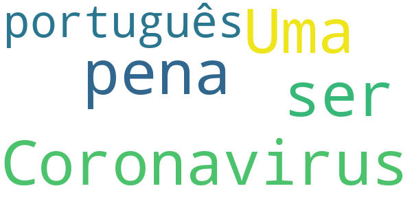
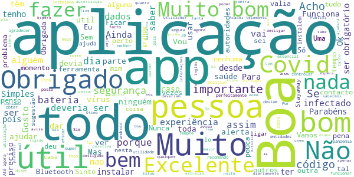
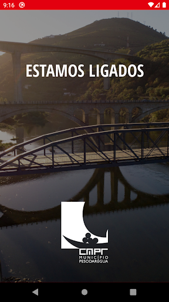
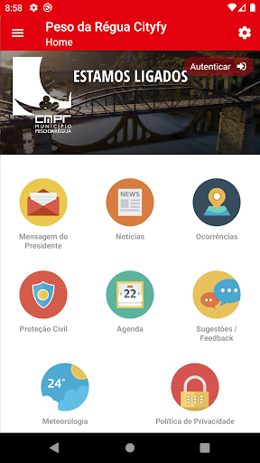
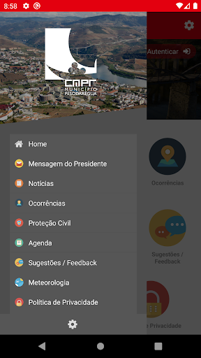
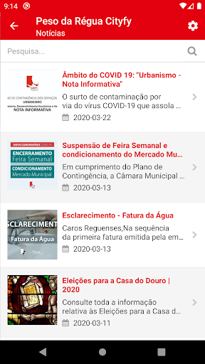
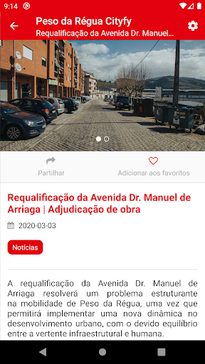
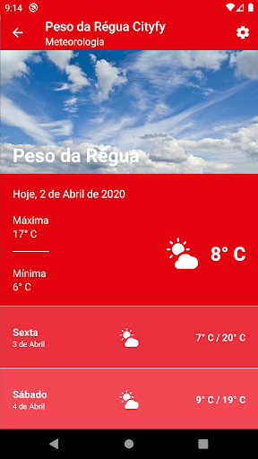

# COVID-related Android apps in Portugal

Author: `Ivano Malavolta` (ivanomalavolta@gmail.com)

Created at: `2020/11/23`

Report generated by the [covid-apps-observer](http://github.com/covid-apps-observer) project, version 0.1

# Table of contents 

- [Background](#background)
    * [Data sources and analyses](#data-sources-and-analyses)
        * [App metadata](#app-metadata)
        * [Requested permissions](#requested-permissions)
        * [Mentioned servers](#mentioned_servers)
        * [Security analysis](#security_analysis)
        * [User ratings and reviews](#user-ratings-and-reviews)
    * [Disclaimer](#disclaimer)
- [WHO Info](#who-info)
- [MySNS](#mysns)
- [OpenWHO: Conhecimento para Emergências em Saúde](#openwho-conhecimento-para-emergências-em-saúde)
- [STAYAWAY COVID](#stayaway-covid)
- [Peso da Régua Cityfy](#peso-da-régua-cityfy)

- [Credits](#credits)

# How to read this report

This report has been generated by the [covid-apps-observer](http://github.com/covid-apps-observer) project. The project automatically analyzes the apps by extracting information which is already publicly available either on the web or in the apps binary files. 

Our analysis covers the following apps:
| | |
|-------------------------|-------------------------| 
|  | WHO Info
|  | MySNS
|  | OpenWHO: Conhecimento para Emergências em Saúde
|  | STAYAWAY COVID
|  | Peso da Régua Cityfy

The details of our analysis are presented in the remainder of this report.

For independent verification, the raw data and the source code of the project is publicly available in its GitHub repository [http://github.com/covid-apps-observer](http://github.com/covid-apps-observer) and its source code has been thoroughly commented in order to provide all the details about how the information provided in this report has been extracted. 

Any feedback, questions, and improvements about the project are very welcome, feel free to create an issue or pull request directly in its GitHub repository: [http://github.com/covid-apps-observer](http://github.com/covid-apps-observer).

## Data sources and analyses

The analysis of each app is structured around five main dimensions: 
* App metadata  
* Requested permissions
* Mentioned servers
* Androwarn analysis
* User ratings and reviews

In the following we describe the data sources and analysis performed for each dimension.

### App metadata

App metadata includes an overview of the main information about the app (for example, its name, releases, privacy policy, etc.), contact information of the development team, and the various Android versions supported by the app. This information is extracted from two main data sources:
* _Google Play store_: we automatically mined the web page of the Google Play store showing the basic information about the app and we parsed it in order to extract information about the app and development team 
* _Android Manifest file_: in our analysis we decompiled the binary file of the app (it is similar to a Zip archive but it contains the code of the app instead of normal files) and we extracted information about the supported Android versions, as it has been listed by its development team.

The extracted app metadata feeds the _App overview_, _Development team_, and _Android support_ sections of this report.
We make use of the [google-play-scraper](https://github.com/JoMingyu/google-play-scraper) tool for extracting the raw data related to this dimension of the project.

### Requested permissions

The Android operating system has a permission model which allows users to grant access to potentially privacy-related information. Every Android app has to explictly declare the permissions it needs to properly function in the Android Manifest file.  

In this report we also show the protection level of each permission, which is a key information for understanding how the requested permissions related to the user's privacy. We carefully analyzed the [official Android documentation (v. 29)](https://developer.android.com/reference/android/Manifest.permission), and it resulted that a permission requested by an Android app can belong to the following protection levels:
* **Dangerous**: higher-risk permissions that would give a requesting app access to private user data or control over the device that can negatively impact the user. Because this type of permission introduces potential risk, the system usually does not automatically grant it to the requesting app. For example, any dangerous permissions requested by an app may be displayed to the user and require confirmation before proceeding.
* **Normal**: this is the default and most common level in Android; normal permissions are lower-risk and give access to isolated app-level features, with minimal risk to other apps, the system, or the user. 
* **Signature**: permissions granted only if the requesting app is signed with the same certificate as the app that declared the permission
* **Appop**: old permission level, a reminiscence of the App Ops tool that Google introduced in Android 4.3.
* **Development**: optional permissions which can be granted to development-oriented apps.
* **Privileged**: permissions who give higher power to mobile apps w.r.t. other apps, such as binding to incoming calls, interacting via bluetooth with other devices without user interaction, etc.
* **Preinstalled**: reserved only for preinstalled apps
* **Installer**: allow the holder to start the permission usage screen for an app
* **RetailDemo**: permissions related to devices used in demonstrations in shops.
* **Pre23**: permissions automatically granted to apps targeting devices running pre-6.0 Android.
* **Upcoming**: permissions which will be released in the next version of the Android platform. 
* **Deprecated**: permissions belonging to old releases of the Android platform, they should not be used by developers since they will not be supported in the near future.
* **Not for use by third-party applications**: permissions which can be requested only by apps developed by Google.
* **Undefined**: this protection level is not documented by Google.

The permissions dimension of this project is based on the [Androguard](https://github.com/androguard/androguard) static analysis tool.

### Mentioned servers

We decompiled each app in order to look for all possible mentions of remote URLs. The mentioned URLs can refer to remote servers the the app is using for either sending or receiving information, web addresses for directing the user to an information website, and so on. 

:warning: It is important to note that this analysis is not meant to be complete and it is very prone to obfuscation. The servers reported here are simply _mentioned_ somewhere in the code of the app and are meant to just give an indication about the "hooks" of the app towards external resources. For example, for an Android app it is normal to contact Google services in order to send/receive push notifications, or to contact the servers of analytics services for having real-time diagnostics about crashes of the app or bugs.

This part of the analysis is based on the [Androguard](https://github.com/androguard/androguard) static analysis tool for identfying the raw URLs mentioned in the app; then, the information about each mentioned server is collected by performing a _whois_ lookup on the first-level domain present in the URL.

### Security analysis

This dimension is based on the [Androwarn](https://github.com/maaaaz/androwarn) structural and data flow analysis of Android bytecode. Androwarn is developed by the University of Lyon/INSA (France) and it has been used in several academic studies. According to its documentation, Androwarn targets the following categories of potential security issues:
* **Telephony identifiers exfiltration**: IMEI, IMSI, MCC, MNC, LAC, CID, operator's name, etc.
* **Device settings exfiltration**: software version, usage statistics, system settings, logs, etc.
* **Geolocation information leakage**: GPS/WiFi geolocation, etc.
* **Connection interfaces information exfiltration**: WiFi credentials, Bluetooth MAC adress, etc.
* **Telephony services abuse**: premium SMS sending, phone call composition, etc.
* **Audio/video flow interception**: call recording, video capture, etc.
* **Remote connection establishment**: socket open call, Bluetooth pairing, APN settings edit, etc.
* **PIM data leakage**: contacts, calendar, SMS, mails, clipboard, etc.
* **External memory operations**: file access on SD card, etc.
* **PIM data modification**: add/delete contacts, calendar events, etc.
* **Arbitrary code execution**: native code using JNI, UNIX command, privilege escalation, etc.
* **Denial of Service**: event notification deactivation, file deletion, process killing, virtual keyboard disable, terminal shutdown/reboot, etc.

Note: We do not consider this data point in the current version of our analyzers since it is too verbose for our purposes.

:warning: It is important to note that Androwarn is a static analysis tool, and as such it performs a variety of heuristics and approximations in its analyses. Said that, the results shown in this report are meant to provide an indication of _potential_ security issues and should be by no means treated as complete and correct.   

### User ratings and reviews

For this dimension we turn again to the web interface of the Google Play store. Firstly, we automatically mine summary statistics about user ratings from the web page of the app under analysis; then, we automatically download the newest 1000 reviews of the app under analysis. For each level of rating (5 stars, 4 stars, , etc., 1 star) we show:
- a word cloud presenting the main terms used by end users in their reviews in the Google Play store
- the last 10 reviews provided by app users in the Google Play store. 

This purposefully simple analysis is meant to help both future users and the development team of the app in understanding what are the main positive and negative points of the app under analysis.

We make use of the [google-play-scraper](https://github.com/JoMingyu/google-play-scraper) tool for extracting the raw data related to this dimension of the project.

## Disclaimer 

This report has been produced independently of any parties and its only objective is to help anybody in better understanding how COVID-related apps work in practice (and compare to each other). The results of this report are limited to the specific version of the software used for running the analyses and on the various heuristics implemented in there. In other words, the results of the analyzers may differ depending on the time and modalities in which they are executed. We do not guarantee that the results of the analyses and the corresponding contents of this report are fully complete or correct. The analysis software is licensed under the [MIT License](https://github.com/iivanoo/covid-apps-observer/blob/master/LICENSE).

# WHO Info
App version ``3.1.1``

Analyzed with [covid-apps-observer](http://github.com/covid-apps-observer) project, version ``0.1``

## App overview
| | |
|-------------------------|-------------------------| 
| **Name**&nbsp;&nbsp;&nbsp;&nbsp;&nbsp;&nbsp;&nbsp;&nbsp;&nbsp;&nbsp;&nbsp;&nbsp;&nbsp;&nbsp;&nbsp;&nbsp;&nbsp;&nbsp;&nbsp;&nbsp;&nbsp;&nbsp;&nbsp;&nbsp;&nbsp;&nbsp;&nbsp;&nbsp;&nbsp;&nbsp;&nbsp;&nbsp;&nbsp;&nbsp;&nbsp;&nbsp;&nbsp;&nbsp;&nbsp;&nbsp;  | WHO Info |
| **Unique identifier** | org.who.infoapp |
| **Link to Google Play** | [https://play.google.com/store/apps/details?id=org.who.infoapp](https://play.google.com/store/apps/details?id=org.who.infoapp) |
| **Summary**  | O aplicativo oficial de informações da Organização Mundial da Saúde. |
| **Privacy policy** | [https://www.who.int/about/who-we-are/privacy-policy](https://www.who.int/about/who-we-are/privacy-policy) |
| **Latest version** | 3.1.1 |
| **Last update** | 2020-10-30 13:25:32 |
| **Recent changes** | This release addresses an issue related to Covid-19 case numbers reported to WHO. |
| **Installs**  | 100.000+ |
| **Category** | Notícias e revistas |
| **First release** | 13 de abr. de 2020 |
| **Size**  | 11M |
| **Supported Android version**  | 4.2 ou superior |

### Description
> Have the latest health information at your fingertips with the official World Health Organization Information App. This app displays the latest news, events, features and breaking updates on outbreaks. 
  
 WHO works worldwide to promote health, keep the world safe, and serve the vulnerable. 
 Our goal is to ensure that a billion more people have universal health coverage, to protect a billion more people from health emergencies, and provide a further billion people with better health and well-being.

### User interface
The developers of the app provide the following screenshots in the Google play store.
| | | |
|:-------------------------:|:-------------------------:|:-------------------------:|
 |   |   |   | 
 |   |   |   | 
 |   |   |   | 
 |   |   |   | 
 |   |   |   | 
 |   |   |   | 
 |   |   |   | 
 |   |   |   | 

## Development team
In the following we report the main information provided by the development team in the Google play store.

| | |
|-------------------------|-------------------------|
| **Developer**  | World Health Organization |
| **Website**  | [https://www.who.int/](https://www.who.int/) |
| **Email** | dcx@who.int |
| **Physical address**  | [Avenu Appia 20 1211 Geneva Switzerland](https://www.google.com/maps/search/Avenu%20Appia%2020%201211%20Geneva%20Switzerland) (Google Maps) |
| **Other developed apps**  | [https://play.google.com/store/apps/developer?id=World+Health+Organization](https://play.google.com/store/apps/developer?id=World+Health+Organization) |

## Android support

| | |
|-------------------------|-------------------------|
| **Declared target Android version**  | - |
| **Effective target Android version**  | - |
| **Minimum supported Android version**  | Jelly Bean, version 4.2.x (API level 17) |
| **Maximum target Android version**  | - |

The larger the difference between the minimum and maximum supported Android versions, the better. A larger difference means a wider audience. For example, old phones have a very low Android version, so a high minimum supported Android version means that the app cannot be used by users with old phones, thus leading to accessibility problems. 

## Requested permissions

In the following we report the complete list of the permissions requested by the app. 

| **Permission** | **Protection level** | **Description** | 
|-------------------------|-------------------------|-------------------------|
 **android.permission ACCESS_NETWORK_STATE** | Normal | Allows applications to access information about networks. 
 **android.permission INTERNET** | Normal | Allows applications to open network sockets. 
 **android.permission READ_CALENDAR** | :warning:**Dangerous** | Allows an application to read the user's calendar data. 
 **android.permission READ_EXTERNAL_STORAGE** | :warning:**Dangerous** | Allows an application to read from external storage. 
 **android.permission WAKE_LOCK** | Normal | Allows using PowerManager WakeLocks to keep processor from sleeping or screen from dimming. 
 **android.permission WRITE_CALENDAR** | :warning:**Dangerous** | Allows an application to write the user's calendar data. 
 **android.permission WRITE_EXTERNAL_STORAGE** | :warning:**Dangerous** | Allows an application to write to external storage. 
 **com.google.android.c2dm.permission RECEIVE** | - | - 
 **com.google.android.finsky.permission BIND_GET_INSTALL_REFERRER_SERVICE** | - | - 

## Mentioned servers

| **Server** | **Registrant** | **Registrant country** | **Creation date** | 
|-------------------------|-------------------------|-------------------------|-------------------------|
 | adobe.com | Adobe Inc. | :us: US | 1986-11-17 05:00:00 |
 | googlesyndication.com | Google LLC | :us: US | 2003-01-21 06:17:24 |
 | google.com | Google LLC | :us: US | 1997-09-15 04:00:00 |
 | app-measurement.com | Google LLC | :us: US | 2015-06-19 20:13:31 |
 | googleapis.com | Google LLC | :us: US | 2005-01-25 17:52:26 |
 | googleadservices.com | Google LLC | :us: US | 2003-06-19 16:34:53 |

## Security analysis 

Below we report the main security warnings raised by our execution of the [Androwarn](https://github.com/maaaaz/androwarn) security analysis tool.

**Connection interfaces exfiltration**
> - This application reads details about the currently active data network 
> - This application tries to find out if the currently active data network is metered 

**Suspicious connection establishment**
> - This application opens a Socket and connects it to the remote address 'Lfi/iki/elonen/NanoHTTPD$ResponseException;' on the 'N/A' port  
> - This application opens a Socket and connects it to the remote address 'NanoHttpd Shutdown' on the 'N/A' port  

**Code execution**
> - This application loads a native library: 'NativeScript' 
> - This application executes a UNIX command containing this argument: '2' 

## User ratings and reviews

Below we provide information about how end users are reacting to the app in terms of ratings and reviews in the Google Play store.

### Ratings

The WHO Info app has been installed by more than **100000** times. At this time, **1023** rated the app and its average score is **3.6470587**. Below we show the distribution of the ratings across the usual star-based rating of Google Play

:star::star::star::star::star:: 562

:star::star::star::star:: 90

:star::star::star:: 70

:star::star:: 50

:star:: 251

### Reviews 

#### 5-star reviews

> Gostava de ter este pograma ensina me.  :date: __2020-09-18 20:17:25__

> É melhor aplicativo.  :date: __2020-05-28 19:51:54__

> NICE  :date: __2020-05-26 16:25:12__

> Para melhor informacoes  :date: __2020-05-10 16:31:41__

#### 4-star reviews

> Nao consigo olhar a do Paraná e não consigo traduzir para o Português  :date: __2020-06-14 14:18:24__

#### 3-star reviews

> Em português  :date: __2020-07-01 10:18:15__

#### 2-star reviews

No recent reviews available with 2 stars.

#### 1-star reviews

> Colocam outra linguas tambem  :date: __2020-11-12 06:36:18__

> Vão se fude com esse app e sua nova ordem mundial ORGANIZAÇÃO MUNDIAL DA FARSA  :date: __2020-10-16 00:51:53__

> Inglês, Sr Ministro ??????.?  :date: __2020-09-01 11:01:09__

> Na próxima encarnação vou aprender inglês, depois volto a instalar a APP. Desinstalei, inútil para mim.  :date: __2020-08-05 17:04:59__

> Ruim  :date: __2020-07-29 23:21:44__

# MySNS
App version ``1.5.0``

Analyzed with [covid-apps-observer](http://github.com/covid-apps-observer) project, version ``0.1``

## App overview
| | |
|-------------------------|-------------------------| 
| **Name**&nbsp;&nbsp;&nbsp;&nbsp;&nbsp;&nbsp;&nbsp;&nbsp;&nbsp;&nbsp;&nbsp;&nbsp;&nbsp;&nbsp;&nbsp;&nbsp;&nbsp;&nbsp;&nbsp;&nbsp;&nbsp;&nbsp;&nbsp;&nbsp;&nbsp;&nbsp;&nbsp;&nbsp;&nbsp;&nbsp;&nbsp;&nbsp;&nbsp;&nbsp;&nbsp;&nbsp;&nbsp;&nbsp;&nbsp;&nbsp;  | MySNS |
| **Unique identifier** | pt.min_saude.spms.mysns |
| **Link to Google Play** | [https://play.google.com/store/apps/details?id=pt.min_saude.spms.mysns](https://play.google.com/store/apps/details?id=pt.min_saude.spms.mysns) |
| **Summary**  | Aplicação oficial do Serviço Nacional de Saúde com informação para o cidadão. |
| **Privacy policy** | [https://www.sns.gov.pt/home/notas-legais-portal-sns-2/](https://www.sns.gov.pt/home/notas-legais-portal-sns-2/) |
| **Latest version** | 1.5.0 |
| **Last update** | 2018-09-15 14:49:27 |
| **Recent changes** | - Saiba onde marcar as suas consultas de Saúde Oral! - Melhorias gráficas; - Melhorias gerais de usabilidade da aplicação. |
| **Installs**  | 100.000+ |
| **Category** | Saúde e fitness |
| **First release** | 14 de set. de 2016 |
| **Size**  | 6,5M |
| **Supported Android version**  | 4.4 ou superior |

### Description
> Numa perspetiva de aumentar a proximidade junto do utente e a transparência dos serviços prestados foi desenvolvido o novo Portal do SNS. A App MySNS é uma aplicação oficial do Serviço Nacional de Saúde e é a ligação móvel a este portal e aos serviços digitais da saúde.
 O MySNS é uma ferramenta que permite consultar notícias do Serviço Nacional de Saúde, consultar informação de saúde, disponibilizar uma lista e mapa instituições de saúde (Hospitais, Cuidados de Saúde Primários e Farmácias), avaliação da qualidade e satisfação do SNS pelos cidadão, e consulta de informação da Linha Saúde 24, além disso irá receber notificações tais como alertas de calor, etc, associadas à sua localização.

### User interface
The developers of the app provide the following screenshots in the Google play store.
| | | |
|:-------------------------:|:-------------------------:|:-------------------------:|
 |   |   |   | 
 |  

## Development team
In the following we report the main information provided by the development team in the Google play store.

| | |
|-------------------------|-------------------------|
| **Developer**  | SPMS - Serviços Partilhados do Ministério da Saúde |
| **Website**  | [https://sns.gov.pt](https://sns.gov.pt) |
| **Email** | atendimento@sns24.gov.pt |
| **Physical address**  | - |
| **Other developed apps**  | [https://play.google.com/store/apps/developer?id=SPMS+-+Servi%C3%A7os+Partilhados+do+Minist%C3%A9rio+da+Sa%C3%BAde](https://play.google.com/store/apps/developer?id=SPMS+-+Servi%C3%A7os+Partilhados+do+Minist%C3%A9rio+da+Sa%C3%BAde) |

## Android support

| | |
|-------------------------|-------------------------|
| **Declared target Android version**  | Nougat, version 7.1 (API level 25) |
| **Effective target Android version**  | Nougat, version 7.1 (API level 25) |
| **Minimum supported Android version**  | Jelly Bean, version 4.2.x (API level 17) |
| **Maximum target Android version**  | - |

The larger the difference between the minimum and maximum supported Android versions, the better. A larger difference means a wider audience. For example, old phones have a very low Android version, so a high minimum supported Android version means that the app cannot be used by users with old phones, thus leading to accessibility problems. 

## Requested permissions

In the following we report the complete list of the permissions requested by the app. 

| **Permission** | **Protection level** | **Description** | 
|-------------------------|-------------------------|-------------------------|
 **android.permission ACCESS_COARSE_LOCATION** | :warning:**Dangerous** | Allows an app to access approximate location. 
 **android.permission ACCESS_FINE_LOCATION** | :warning:**Dangerous** | Allows an app to access precise location. 
 **android.permission ACCESS_NETWORK_STATE** | Normal | Allows applications to access information about networks. 
 **android.permission ACCESS_WIFI_STATE** | Normal | Allows applications to access information about Wi-Fi networks. 
 **android.permission INTERNET** | Normal | Allows applications to open network sockets. 
 **android.permission READ_APP_BADGE** | - | - 
 **android.permission REQUEST_INSTALL_PACKAGES** | Signature | Allows an application to request installing packages. 
 **android.permission VIBRATE** | Normal | Allows access to the vibrator. 
 **android.permission WAKE_LOCK** | Normal | Allows using PowerManager WakeLocks to keep processor from sleeping or screen from dimming. 
 **android.permission WRITE_EXTERNAL_STORAGE** | :warning:**Dangerous** | Allows an application to write to external storage. 
 **com.anddoes.launcher.permission UPDATE_COUNT** | - | - 
 **com.google.android.c2dm.permission RECEIVE** | - | - 
 **com.htc.launcher.permission READ_SETTINGS** | - | - 
 **com.htc.launcher.permission UPDATE_SHORTCUT** | - | - 
 **com.huawei.android.launcher.permission CHANGE_BADGE** | - | - 
 **com.huawei.android.launcher.permission READ_SETTINGS** | - | - 
 **com.huawei.android.launcher.permission WRITE_SETTINGS** | - | - 
 **com.majeur.launcher.permission UPDATE_BADGE** | - | - 
 **com.oppo.launcher.permission READ_SETTINGS** | - | - 
 **com.oppo.launcher.permission WRITE_SETTINGS** | - | - 
 **com.sec.android.provider.badge.permission READ** | - | - 
 **com.sec.android.provider.badge.permission WRITE** | - | - 
 **com.sonyericsson.home.permission BROADCAST_BADGE** | - | - 
 **com.sonymobile.home.permission PROVIDER_INSERT_BADGE** | - | - 
 **pt.min_saude.spms.mysns.permission C2D_MESSAGE** | - | - 
 **pt.min_saude.spms.mysns.permission PushHandlerActivity** | - | - 

## Mentioned servers

| **Server** | **Registrant** | **Registrant country** | **Creation date** | 
|-------------------------|-------------------------|-------------------------|-------------------------|
 | googlesyndication.com | Google LLC | :us: US | 2003-01-21 06:17:24 |
 | google.com | Google LLC | :us: US | 1997-09-15 04:00:00 |
 | hockeyapp.net | Microsoft Corporation | :us: US | 2011-01-23 18:46:43 |
 | gstatic.com | Google LLC | :us: US | 2008-02-11 15:31:25 |
 | here.com | HERE Global B.V. | :netherlands: NL | 1995-06-11 04:00:00 |
 | googleapis.com | Google LLC | :us: US | 2005-01-25 17:52:26 |

## Security analysis 

Below we report the main security warnings raised by our execution of the [Androwarn](https://github.com/maaaaz/androwarn) security analysis tool.

**Telephony identifiers leakage**
> - This application reads the ISO country code equivalent of the current registered operator's MCC (Mobile Country Code) 
> - This application reads the MCC+MNC of the provider of the SIM 
> - This application reads the constant indicating the state of the device SIM card 
> - This application reads the device phone type value 
> - This application reads the numeric name (MCC+MNC) of current registered operator 

**Location lookup**
> - This application reads location information from all available providers (WiFi, GPS etc.) 

**Connection interfaces exfiltration**
> - This application reads details about the currently active data network 
> - This application tries to find out if the currently active data network is metered 

**Telephony services abuse**
> - This application makes phone calls 

**Suspicious connection establishment**
> - This application opens a Socket and connects it to the remote address '10' on the 'N/A' port  
> - This application opens a Socket and connects it to the remote address '3' on the 'N/A' port  
> - This application opens a Socket and connects it to the remote address 'Ljava/net/Proxy;->type()Ljava/net/Proxy$Type;' on the 'N/A' port  
> - This application opens a Socket and connects it to the remote address 'timeout' on the 'N/A' port  

**Pim data leakage**
> - This application accesses the MMS list 
> - This application accesses the SMS list 
> - This application accesses data stored in the clipboard 

**Code execution**
> - This application loads a native library 
> - This application loads a native library: 'Ljava/lang/System;->mapLibraryName(Ljava/lang/String;)Ljava/lang/String;' 
> - This application loads a native library: 'chromium_android_linker' 
> - This application loads a native library: 'chromium_android_linker.cr' 
> - This application loads a native library: 'sqlc-native-driver' 
> - This application executes a UNIX command containing this argument: '7' 
> - This application executes a UNIX command containing this argument: 'getprop ro.product.cpu.abi' 

## User ratings and reviews

Below we provide information about how end users are reacting to the app in terms of ratings and reviews in the Google Play store.

### Ratings

The MySNS app has been installed by more than **100000** times. At this time, **1117** rated the app and its average score is **3.2272727**. Below we show the distribution of the ratings across the usual star-based rating of Google Play

:star::star::star::star::star:: 416

:star::star::star::star:: 152

:star::star::star:: 142

:star::star:: 81

:star:: 324

### Reviews 

#### 5-star reviews

> Nunca pensei que há tantos ignorantes no meu País. É aterrador, pior que o coronavírus.  :date: __2020-11-18 08:13:42__

> Gosto  :date: __2020-11-05 19:26:51__

> Bom  :date: __2020-10-16 10:11:36__

> Fantástica app!  :date: __2020-10-10 22:21:19__

> Menos má  :date: __2020-09-29 06:30:15__

> Funciona muito bem!  :date: __2020-09-27 00:32:55__

> MUITO ÚTIL ! OBRIGADO  :date: __2020-09-11 10:57:40__

> Perfeito  :date: __2020-09-09 02:55:00__

> Bom  :date: __2020-09-04 21:37:00__

> Obrigados  :date: __2020-09-04 09:20:05__

#### 4-star reviews

> Boa experiência.  :date: __2020-11-12 09:59:38__

> Mais ou menos  :date: __2020-11-07 22:46:32__

> Bom  :date: __2020-10-31 20:49:08__

> Fiz a instalação, acedi através da chave móvel digital e funcionou à primeira.  :date: __2020-08-05 21:42:20__

> Agora que já consegui entrar com a ChaveMovelDigital (que não tinha activa) já funciona!!!!  :date: __2020-07-16 12:20:38__

> Mysns paro  :date: __2020-04-15 17:46:57__

> Fixe  :date: __2020-04-05 13:41:52__

> Em teste, darei mais se ficar satisfeito  :date: __2020-03-24 18:41:21__

> A algumas vezes complica e é demorado  :date: __2019-11-28 13:33:33__

> Receita de medicamentos  :date: __2019-09-17 12:33:44__

#### 3-star reviews

> APP pouco útil da forma q está estruturada. Para aceder à área de cidadão remete para o browser o q torna ridícula a utilização da APP. Uma nora.. Dentro da área de cidadão a informação não aparece completa.. há informação em falta... Exemplo infecção covid e acesso a área de registo de sintomas. Acesso a baixas incompleto... Etc  :date: __2020-11-21 17:35:55__

> Deixou de funcionar. Agora que é mais necessário naõ funciona.  :date: __2020-11-18 14:35:10__

> Há muito a melhorar nesta app!!!  :date: __2020-10-05 19:42:00__

> A app stayaway Covid-19, tem algum problema em ser instalada? Muito obrigada.  :date: __2020-09-01 11:17:30__

> Difícil, é nem sempre conseguimos atendimento  :date: __2020-08-05 13:09:26__

> Pouca dificuldade a, aceder !  :date: __2020-06-26 20:16:31__

> A informação do movimento de banhistas,deveria ser actualizada mais frequentemente, particularmente até ao meio dia e depois das 4 da tarde. E mais divulgada nos meios comunicação.  :date: __2020-06-21 08:13:06__

> Dificuldade em perceber e aceder às receitas digitais  :date: __2020-04-22 15:28:21__

> Pratico!  :date: __2020-03-24 14:20:35__

> Aplicação que podia ser útil mas complexa e com muitas funcionalidades que não funcionam ou bloqueiam O sistema de autenticação, recorrendo à cmd, é complicada. Em certas situações, a segurança é ainda garantida pela necessidade de introdução de um código alfanumérico dificil de decifrar já que não passam de garatujos. Desde que este código passou a ser exigido, deixei de conseguir aceder aos dados pessoais, já que a aplicação bloqueia. Segurança sim mas sem prejuízo do utente.  :date: __2020-02-07 12:47:06__

#### 2-star reviews

> A aplicação direciona sempre para o browser para fazer o login, por isso torna-se inútil instalar.  :date: __2020-11-04 14:58:20__

> Muito complicado. Para aceder à minha conta do banco é bem mais fácil e seguro na mesma.  :date: __2020-08-30 12:46:29__

> Diz que a APP foi desenhada para Android 5 e "Crasha". Não passa daqui. Não consigo fazer mais nada.  :date: __2020-08-29 00:01:45__

> Pouco intuitiva, nada funcional como app para Android.  :date: __2020-08-28 21:49:31__

> Elaborada para uma versão mais antiga  :date: __2020-07-02 08:58:12__

> Muito complicada para acessar da muitas voltas, ao paciente !!!  :date: __2020-05-11 00:17:22__

> Parece ser uma aplicação muito útil. Infelizmente é dificílimo introduzir doenças antigas na secção "os meus registos". Não aceita ainda muitas doenças amplamente reconhecidas.  :date: __2020-04-22 08:10:15__

> É na verdade um conjunto organizado de links para a internet com as informações primárias de cada campo e algumas notícias.  :date: __2020-04-15 21:38:28__

> A ideia é muito boa, mas a aplicação não funciona. Quero ver as minhas receitas electrónicas e não é possível.  :date: __2020-04-15 13:03:54__

> Não me serviu para nada.  :date: __2020-03-18 11:13:55__

#### 1-star reviews

> Gostaria de saber o porquê da aplicação deixar de funcionar no Samsung A 50, a onde funcionava muito bem É agora só funciona em telemóveis mais antigos. Espero resposta. Obrigado  :date: __2020-11-09 19:06:30__

> Isto é gozar com quem paga e está doente!  :date: __2020-11-06 12:52:25__

> A aplicação deixou de funcionar. Gostava que resolvessem o problema. Obrigado. Há 2 anos que não fazem actualizações da aplicação. Por isso esta aplicação não serve pra nada. É uma vergonha.  :date: __2020-11-05 12:43:58__

> Ridículo e vergonhoso  :date: __2020-11-02 20:48:01__

> Isto é uma vergonha! Agora com o covid mandam receitas sem papel e como antes não havia usado a aplicação, até pensei que seria fácil. Mas qual não é o meu espanto que tenho de inserir inúmeros códigos para obter o código digital que tanto por SMS como por e-mail obtenho a seguinte resposta: Não é válido. Por CC teria de me dirigir a uma loja do cidadão para o obter. Então tirava a receita em papel e não era necessário tal deslocação. Já que as receitas sem papel são para minimizar deslocações.  :date: __2020-10-28 18:17:00__

> "MySNS parou". Tal nota sempre existiu porque o App não vale nada. E o desinstalei, esperando que melhore. O registo não se consegue. E a Chave Móvel Digital, difícil de obter, para quê? Se o cartão de cidadão tem o nr de utente, não seria bastante para identificar o utente, com uma password? Ademais, o utente quer marcar suas consutas, evitando as filas no centro de saúde, e em alguns casos, pedir suas receitas e recebê-las via App. A simplicidade é o segredo do sucesso.  :date: __2020-10-26 04:06:47__

> Não funciona. Remete para o portal. Logo não serve para nada.  :date: __2020-10-22 11:53:50__

> Este nojo nem login deixa fazer. Vergonha de ser português  :date: __2020-10-10 20:55:33__

> Muito complicado (ou impossível) encontrar o que se pretende. Isto mais parece um labirinto.  :date: __2020-10-03 23:34:36__

> Aplicação obsoleta! Não faz sentido ser redireccionado para o browser cada vez que quero fazer login na app, e tenho de colocar códigos inúmeras vezes! A última actualização é de 2018, estamos quase em 2021! Isto é uma app de campanha publicitária do Ministério da Saúde. Quando início a app devia de aparecer o meu perfil e não notícias do Ministério. Má utilização dos dinheiros públicos!  :date: __2020-10-03 13:05:55__

# OpenWHO: Conhecimento para Emergências em Saúde
App version ``3.6``

Analyzed with [covid-apps-observer](http://github.com/covid-apps-observer) project, version ``0.1``

## App overview
| | |
|-------------------------|-------------------------| 
| **Name**&nbsp;&nbsp;&nbsp;&nbsp;&nbsp;&nbsp;&nbsp;&nbsp;&nbsp;&nbsp;&nbsp;&nbsp;&nbsp;&nbsp;&nbsp;&nbsp;&nbsp;&nbsp;&nbsp;&nbsp;&nbsp;&nbsp;&nbsp;&nbsp;&nbsp;&nbsp;&nbsp;&nbsp;&nbsp;&nbsp;&nbsp;&nbsp;&nbsp;&nbsp;&nbsp;&nbsp;&nbsp;&nbsp;&nbsp;&nbsp;  | OpenWHO: Conhecimento para Emergências em Saúde |
| **Unique identifier** | de.xikolo.openwho |
| **Link to Google Play** | [https://play.google.com/store/apps/details?id=de.xikolo.openwho](https://play.google.com/store/apps/details?id=de.xikolo.openwho) |
| **Summary**  | Conhecimento para Emergências em Saúde |
| **Privacy policy** | [https://openwho.org/pages/privacy](https://openwho.org/pages/privacy) |
| **Latest version** | 3.6 |
| **Last update** | 2020-10-08 13:10:39 |
| **Recent changes** | - Bug fixes and performance improvements |
| **Installs**  | 1.000.000+ |
| **Category** | Educação |
| **First release** | 17 de mai. de 2017 |
| **Size**  | 18M |
| **Supported Android version**  | 5.0 ou superior |

### Description
> A OpenWHO é a plataforma interativa de transferência de conhecimento da Organização Mundial de Saúde (OMS) que oferece cursos online para melhorar a resposta a emergências em saúde. A OpenWHO permite que a Organização e os seus principais parceiros transfiram conhecimento capaz de salvar vidas às equipas de resposta na linha da frente.
 Com a OpenWHO, terá a flexibilidade de aprender ao seu próprio ritmo. Assista a curtas palestras em vídeo e teste o seu conhecimento através de autotestes quando e onde quiser. O fórum do curso e o espaço de colaboração permite-lhe comunicar com outros participantes e especialistas em todo o mundo.
 Concebido sobretudo para profissionais de saúde, equipas de resposta na linha da frente e decisores, a app é também uma fonte de informação para aqueles afetados por surtos de doenças e emergências em saúde, ou para aqueles com interesse geral no trabalho da OMS em emergências em saúde. 
 A aplicação possui 6 canais: 
 - canal Epidemias aborda a gestão de doenças infeciosas e fornece informação científica capaz de salvar vidas.
 - canal Pronto para responder ajuda a  preparar o pessoal que se encontra em formação para trabalhar em surtos de doenças e emergências sanitárias.
 - canal Social foca-se nas intervenções com base nas ciências sociais e ajuda na comunicação com comunidades afetadas.  
 - canal Preparação para Pandemias reúne cursos sobre vários aspetos da preparação, incluindo vigilância, medidas de saúde pública e comunicação de risco durante uma pandemia. 
 - canal COVID-19 fornece recursos de aprendizagem nas 6 línguas oficiais da OMS (árabe, chinês, espanhol, francês, inglês e russo) para profissionais de saúde, decisores e o público em geral sobre o surto da doença do coronavírus (COVID-19). 
 - canal de COVID-19 Idiomas Nacionais fornece os mesmos recursos de aprendizagem que o canal COVID-19, mas em idiomas nacionais, tais como Indonésio, Japonês e Português. 
 Os cursos da OpenWHO estão disponíveis em diversas línguas, incluindo as 6 línguas oficiais da OMS. 
 Faça o download da app e junte-se à comunidade da OpenWHO.
 Esta app é desenvolvida em cooperação entre o Instituto Hasso Plattner e a OMS. O conteúdo de aprendizagem é fornecido exclusivamente pela OMS.

### User interface
The developers of the app provide the following screenshots in the Google play store.
| | | |
|:-------------------------:|:-------------------------:|:-------------------------:|
 |   |   |   | 
 |   |   |   | 

## Development team
In the following we report the main information provided by the development team in the Google play store.

| | |
|-------------------------|-------------------------|
| **Developer**  | HPI Knowledge Engineering Team |
| **Website**  | [https://openwho.org/](https://openwho.org/) |
| **Email** | openwho-support@hpi.de |
| **Physical address**  | [Prof.-Dr.-Helmert-Str.2-3 14482 Potsdam](https://www.google.com/maps/search/Prof.-Dr.-Helmert-Str.2-3%2014482%20Potsdam) (Google Maps) |
| **Other developed apps**  | [https://play.google.com/store/apps/developer?id=7185448023325736337](https://play.google.com/store/apps/developer?id=7185448023325736337) |

## Android support

| | |
|-------------------------|-------------------------|
| **Declared target Android version**  | - |
| **Effective target Android version**  | - |
| **Minimum supported Android version**  | Lollipop, version 5.0 (API level 21) |
| **Maximum target Android version**  | - |

The larger the difference between the minimum and maximum supported Android versions, the better. A larger difference means a wider audience. For example, old phones have a very low Android version, so a high minimum supported Android version means that the app cannot be used by users with old phones, thus leading to accessibility problems. 

## Requested permissions

In the following we report the complete list of the permissions requested by the app. 

| **Permission** | **Protection level** | **Description** | 
|-------------------------|-------------------------|-------------------------|
 **android.permission ACCESS_NETWORK_STATE** | Normal | Allows applications to access information about networks. 
 **android.permission ACCESS_WIFI_STATE** | Normal | Allows applications to access information about Wi-Fi networks. 
 **android.permission DOWNLOAD_WITHOUT_NOTIFICATION** | - | - 
 **android.permission FOREGROUND_SERVICE** | Normal | Allows a regular application to use Service.startForeground. 
 **android.permission INTERNET** | Normal | Allows applications to open network sockets. 
 **android.permission RECEIVE_BOOT_COMPLETED** | Normal | Allows an application to receive the Intent.ACTION_BOOT_COMPLETED that is broadcast after the system finishes booting. 
 **android.permission WAKE_LOCK** | Normal | Allows using PowerManager WakeLocks to keep processor from sleeping or screen from dimming. 
 **android.permission WRITE_EXTERNAL_STORAGE** | :warning:**Dangerous** | Allows an application to write to external storage. 
 **com.google.android.c2dm.permission RECEIVE** | - | - 
 **com.google.android.finsky.permission BIND_GET_INSTALL_REFERRER_SERVICE** | - | - 

## Mentioned servers

| **Server** | **Registrant** | **Registrant country** | **Creation date** | 
|-------------------------|-------------------------|-------------------------|-------------------------|
 | googlesyndication.com | Google LLC | :us: US | 2003-01-21 06:17:24 |
 | google.com | Google LLC | :us: US | 1997-09-15 04:00:00 |
 | apple.com | Apple Inc. | :us: US | 1987-02-19 05:00:00 |
 | aomedia.org | Contact Privacy Inc. Customer 1243324949 | :canada: CA | 2015-08-24 14:07:31 |
 | dashif.org | VTM Group | :us: US | 2012-04-27 13:02:46 |
 | app-measurement.com | Google LLC | :us: US | 2015-06-19 20:13:31 |
 | w3.org | W3C | :us: US | 1994-07-06 04:00:00 |
 | googleapis.com | Google LLC | :us: US | 2005-01-25 17:52:26 |
 | psdev.de | - | - | - |
 | xmlpull.org | WhoisGuard, Inc. | PA | 2001-11-26 20:33:08 |
 | someurl.com | WhoisGuard, Inc. | PA | 2000-02-08 15:50:35 |
 | crashlytics.com | Google LLC | :us: US | 2011-01-21 15:30:40 |
 | apache.org | The Apache Software Foundation | :us: US | 1995-04-11 04:00:00 |
 | opensource.org | Open Source Initiative | :us: US | 1998-02-11 05:00:00 |
 | creativecommons.org | Creative Commons Corporation | :canada: CA | 2001-01-15 16:51:44 |
 | eclipse.org | Eclipse.org Foundation, Inc. | :canada: CA | 1997-04-14 04:00:00 |
 | gnu.org | Free Software Foundation | :us: US | 1995-11-24 05:00:00 |
 | mozilla.org | Mozilla Corporation | :us: US | 1998-01-24 05:00:00 |
 | googleadservices.com | Google LLC | :us: US | 2003-06-19 16:34:53 |

## Security analysis 

Below we report the main security warnings raised by our execution of the [Androwarn](https://github.com/maaaaz/androwarn) security analysis tool.

**Telephony identifiers leakage**
> - This application reads the ISO country code equivalent of the current registered operator's MCC (Mobile Country Code) 

**Connection interfaces exfiltration**
> - This application reads details about the currently active data network 
> - This application tries to find out if the currently active data network is metered 

**Suspicious connection establishment**
> - This application opens a Socket and connects it to the remote address ' returned no addresses for  ; port is out of range' on the 'N/A' port  
> - This application opens a Socket and connects it to the remote address '' on the 'N/A' port  
> - This application opens a Socket and connects it to the remote address 'Ljava/lang/StringBuilder;->toString()Ljava/lang/String;' on the 'N/A' port  
> - This application opens a Socket and connects it to the remote address 'Ljava/net/Proxy;->type()Ljava/net/Proxy$Type;' on the 'N/A' port  
> - This application opens a Socket and connects it to the remote address 'timeout' on the 'N/A' port  

**Code execution**
> - This application loads a native library 

## User ratings and reviews

Below we provide information about how end users are reacting to the app in terms of ratings and reviews in the Google Play store.

### Ratings

The OpenWHO: Conhecimento para Emergências em Saúde app has been installed by more than **1000000** times. At this time, **3293** rated the app and its average score is **4.2636366**. Below we show the distribution of the ratings across the usual star-based rating of Google Play

:star::star::star::star::star:: 2297

:star::star::star::star:: 359

:star::star::star:: 169

:star::star:: 149

:star:: 319

### Reviews 

#### 5-star reviews

> Ótimo!  :date: __2020-08-18 16:10:09__

> Ajuda a saude de todos gostei😏😏  :date: __2020-05-16 21:46:48__

> Aprendam a falar e a escrever INGLÊS. É mais útil que Funk!  :date: __2020-05-03 15:00:54__

> Boa  :date: __2020-04-06 08:22:43__

> Só em engles ruim  :date: __2020-03-17 03:56:56__

#### 4-star reviews

> Coronavirus  :date: __2020-05-27 13:53:07__

> Uma pena não ser em português.  :date: __2018-01-18 01:21:10__

#### 3-star reviews

> Caro amigo Pedro Paiva nem não todos tem a oportunidades de aprender outras línguas, e mesmo concordando que aprender inglês e muito melhor que esse estilo de música a ONU Organizações das Nações Unidades deveria ter App oficial em outros idiomas!  :date: __2020-05-19 02:36:13__

#### 2-star reviews

No recent reviews available with 2 stars.

#### 1-star reviews

> boloceia aplicativo  :date: __2020-10-31 16:14:42__

> Como uma Organização mundial não dispor mais idiomas?  :date: __2020-04-09 17:28:57__

> Isso è um lixo tente melhorar  :date: __2020-04-02 09:30:07__

# STAYAWAY COVID
App version ``1.0.6``

Analyzed with [covid-apps-observer](http://github.com/covid-apps-observer) project, version ``0.1``

## App overview
| | |
|-------------------------|-------------------------| 
| **Name**&nbsp;&nbsp;&nbsp;&nbsp;&nbsp;&nbsp;&nbsp;&nbsp;&nbsp;&nbsp;&nbsp;&nbsp;&nbsp;&nbsp;&nbsp;&nbsp;&nbsp;&nbsp;&nbsp;&nbsp;&nbsp;&nbsp;&nbsp;&nbsp;&nbsp;&nbsp;&nbsp;&nbsp;&nbsp;&nbsp;&nbsp;&nbsp;&nbsp;&nbsp;&nbsp;&nbsp;&nbsp;&nbsp;&nbsp;&nbsp;  | STAYAWAY COVID |
| **Unique identifier** | fct.inesctec.stayaway |
| **Link to Google Play** | [https://play.google.com/store/apps/details?id=fct.inesctec.stayaway](https://play.google.com/store/apps/details?id=fct.inesctec.stayaway) |
| **Summary**  | A aplicação oficial de notificação de exposição à COVID-19 em Portugal. |
| **Privacy policy** | [https://stayawaycovid.pt/politica-de-privacidade](https://stayawaycovid.pt/politica-de-privacidade) |
| **Latest version** | 1.0.6 |
| **Last update** | 2020-11-04 11:55:08 |
| **Recent changes** | - Corrigidas as tarefas que correm em segundo plano - Corrigida a submissão de código - Adicionado o botão de contacto da equipa de suporte - Adicionado o botão de partilha - Redesenhada a página de definições - Adicionado ecrã de localização ao onboarding - Adicionada funcionalidade ao pressionar continuamente o botão da home - Corrigida a barra de navegação no Android 8 - Correções de bugs - Correções errors |
| **Installs**  | 1.000.000+ |
| **Category** | Saúde e fitness |
| **First release** | 13 de ago. de 2020 |
| **Size**  | 58M |
| **Supported Android version**  | 6.0 ou superior |

### Description
> STAYAWAY COVID é a aplicação oficial de notificação de exposição à COVID-19 em Portugal. É uma aplicação para telemóveis que tem como objetivo auxiliar o país no rastreio da COVID-19. A aplicação permite, de forma simples e segura, que cada um de nós seja informado sobre exposições de risco à doença, através da monitorização de contactos recentes. A aplicação é de utilização voluntária e gratuita e, em momento algum, tem acesso à sua identidade ou dados pessoais.
 Uma vez instalada a aplicação, o telemóvel anuncia a sua presença a todos os dispositivos próximos usando identificadores aleatórios que não revelam identidades pessoais. A informação partilhada entre dispositivos permite à STAYAWAY COVID saber de que telemóveis esteve perto, quão perto e por quanto tempo. A Organização Mundial de Saúde sugere que, contactos a menos de 2 metros e por mais de 15 minutos com alguém portador de COVID-19 sejam considerados com elevado risco de contágio.
 1. Ausência de registo de elevado risco de contágio
 Não registando contactos de proximidade com elevado risco de contágio com alguém a quem foi diagnosticada COVID-19, a aplicação informa-nos exatamente disso com a data da última avaliação.
 2. Alerta de elevado risco de contágio
 Se alguém de quem estivemos perigosamente próximo nos últimos 14 dias for diagnosticado com COVID-19 e informar o sistema STAYAWAY COVID, a aplicação alerta-nos de imediato do risco sugerindo que nos isolemos e contactemos a Linha SNS 24 (808 24 24 24).
 3. Após diagnóstico de COVID-19
 No caso de contrairmos COVID-19, com o diagnóstico receberemos um código numérico que nos permitirá, anonimamente e através da aplicação, informar o sistema STAYAWAY COVID. É este ato que permite ao sistema alertar segura e atempadamente todos aqueles que podemos ter contagiado, mesmo antes de terem tido qualquer sintoma. Não é nunca revelada a ninguém a identidade de ninguém.
 A aplicação STAYAWAY COVID foi desenvolvida pelo INESC TEC, ISPUP, Keyruptive e Ubirider para a DGS / Ministério da Saúde.

### User interface
The developers of the app provide the following screenshots in the Google play store.
| | | |
|:-------------------------:|:-------------------------:|:-------------------------:|
 |   |   |   | 
 |   |  

## Development team
In the following we report the main information provided by the development team in the Google play store.

| | |
|-------------------------|-------------------------|
| **Developer**  | FCT FCCN |
| **Website**  | [https://stayawaycovid.pt/](https://stayawaycovid.pt/) |
| **Email** | stayaway@inesctec.pt |
| **Physical address**  | - |
| **Other developed apps**  | [https://play.google.com/store/apps/developer?id=FCT+FCCN](https://play.google.com/store/apps/developer?id=FCT+FCCN) |

## Android support

| | |
|-------------------------|-------------------------|
| **Declared target Android version**  | - |
| **Effective target Android version**  | - |
| **Minimum supported Android version**  | Marshmallow, version 6.0 (API level 23) |
| **Maximum target Android version**  | - |

The larger the difference between the minimum and maximum supported Android versions, the better. A larger difference means a wider audience. For example, old phones have a very low Android version, so a high minimum supported Android version means that the app cannot be used by users with old phones, thus leading to accessibility problems. 

## Requested permissions

In the following we report the complete list of the permissions requested by the app. 

| **Permission** | **Protection level** | **Description** | 
|-------------------------|-------------------------|-------------------------|
 **android.permission ACCESS_NETWORK_STATE** | Normal | Allows applications to access information about networks. 
 **android.permission BLUETOOTH** | Normal | Allows applications to connect to paired bluetooth devices. 
 **android.permission FOREGROUND_SERVICE** | Normal | Allows a regular application to use Service.startForeground. 
 **android.permission INTERNET** | Normal | Allows applications to open network sockets. 
 **android.permission RECEIVE_BOOT_COMPLETED** | Normal | Allows an application to receive the Intent.ACTION_BOOT_COMPLETED that is broadcast after the system finishes booting. 
 **android.permission REQUEST_IGNORE_BATTERY_OPTIMIZATIONS** | Normal | Permission an application must hold in order to use Settings.ACTION_REQUEST_IGNORE_BATTERY_OPTIMIZATIONS. 
 **android.permission WAKE_LOCK** | Normal | Allows using PowerManager WakeLocks to keep processor from sleeping or screen from dimming. 

## Mentioned servers

| **Server** | **Registrant** | **Registrant country** | **Creation date** | 
|-------------------------|-------------------------|-------------------------|-------------------------|
 | android.com | Google LLC | :us: US | 1997-06-23 04:00:00 |
 | google.com | Google LLC | :us: US | 1997-09-15 04:00:00 |
 | ietf.org | IETF Trust | :us: US | 1995-03-11 05:00:00 |

## Security analysis 

Below we report the main security warnings raised by our execution of the [Androwarn](https://github.com/maaaaz/androwarn) security analysis tool.

**Connection interfaces exfiltration**
> - This application reads details about the currently active data network 
> - This application tries to find out if the currently active data network is metered 

**Suspicious connection establishment**
> - This application opens a Socket and connects it to the remote address '' on the 'N/A' port  
> - This application opens a Socket and connects it to the remote address 'Ljava/lang/StringBuilder;->toString()Ljava/lang/String;' on the ': connect, resolve' port  
> - This application opens a Socket and connects it to the remote address 'Ljava/lang/StringBuilder;->toString()Ljava/lang/String;' on the 'N/A' port  
> - This application opens a Socket and connects it to the remote address 'Ljava/net/Proxy;->type()Ljava/net/Proxy$Type;' on the 'N/A' port  
> - This application opens a Socket and connects it to the remote address 'timeout' on the 'N/A' port  

**Pim data leakage**
> - This application accesses data stored in the clipboard 

**Code execution**
> - This application loads a native library 
> - This application executes a UNIX command 

## User ratings and reviews

Below we provide information about how end users are reacting to the app in terms of ratings and reviews in the Google Play store.

### Ratings

The STAYAWAY COVID app has been installed by more than **1000000** times. At this time, **7057** rated the app and its average score is **3.8016827**. Below we show the distribution of the ratings across the usual star-based rating of Google Play

:star::star::star::star::star:: 3436

:star::star::star::star:: 1340

:star::star::star:: 780

:star::star:: 449

:star:: 1052

### Reviews 

#### 5-star reviews

> Difícil instalar  :date: __2020-11-22 20:41:11__

> Desde que instalei a aplicaçâo tenho seguido sempre as regras e com o Android sempre ligado...De quando em quando vejo a aplicaçâo se tudo se encontra bem e até ao dia de hoje ainda nada de anormal aconteçeu porque tambem se deve dever aos sitios onde vou e andar sempre prevenido.  :date: __2020-11-22 03:51:43__

> De momento não tive nenhuma experiência relacionada com o covid 19 mas se vier a ter sem dúvida que esta aplicação é uma mais valia para todos nós.  :date: __2020-11-21 19:13:03__

> Para os atrasados mentais: Não e uma aplicação desenvolvida por Portugal e ajuda porem ninguém espera que um pais inteiro usa a aplicação  :date: __2020-11-21 13:37:57__

> Não vejo utilidade nesta aplicação.  :date: __2020-11-21 11:59:08__

> Acho ótimo  :date: __2020-11-21 11:29:29__

> Sinto me mais protegido  :date: __2020-11-21 09:58:23__

> Eu tinha uma outra aplicação no telemóvel com o mesmo nome e achava que me estava a prevenir contra o covid quando vi na televisão que a aplicação não era a mesma que fora autorizada por Portugal, tinha aquela aplicação desde que esta saiu  :date: __2020-11-20 21:41:29__

> Esperamos por o empenho de todos os cidadãos para resolver este drama. Só tenho a agradecer.  :date: __2020-11-20 17:11:00__

> Voces são ums génios voces inventaram uma medida de literalmente saber se tenho covid-19 ou não repito vocês sao os maiores  :date: __2020-11-20 14:44:42__

#### 4-star reviews

> Necessária.  :date: __2020-11-22 19:25:42__

> Util se utilizada por um grande número de pessoas  :date: __2020-11-22 17:24:10__

> Tenho informação que app está com problems de resto tudo bem  :date: __2020-11-22 14:47:22__

> Ótimo  :date: __2020-11-22 13:19:49__

> Util  :date: __2020-11-21 19:50:10__

> Não atualiza desde que foi instalada....  :date: __2020-11-20 07:53:12__

> Boa  :date: __2020-11-18 23:53:09__

> Não serve para grande coisa.  :date: __2020-11-17 14:57:57__

> Eu só não gosto desta aplicação só por causa de uma coisa é preciso ter Bluetooth e GPS para que pronto principalmente o Bluetooth  :date: __2020-11-15 23:58:57__

> Ok  :date: __2020-11-15 22:42:32__

#### 3-star reviews

> Quando entramos no app pela primeira vez, devia pedir n° utente de saúde, e os médicos fazerem isso pelo computador, antes de darem o código, a pessoa pode receber o código e não usar. Cor vermelha infectados, cor verde não infectados, cor branca não fez o teste e cor azul fez o teste, mas está a espera do resultado. E quem está a reclamar de gastar muita bateria, normal porque têm de ter o Bluetooth e a localização ativos. Gostava saber como vocês vão fazer com os idosos que não usam smartphone  :date: __2020-11-22 23:58:24__

> Nenhuma experiência. Nunca me avisou de qualquer caso...  :date: __2020-11-22 23:12:54__

> Podem adicionar uma função que nos diga se estamos num concelho com restrições mais severas, regras de circulação e o grau de risco? É que assim a app faria mais sentido.  :date: __2020-11-21 21:32:12__

> Normal  :date: __2020-11-21 19:36:19__

> a app é simples, mas poderiam adicionar a opção de desativar o rastreiro e Bluetooth, por exemplo no bedtime mode ou quando detecte que esta conectado à WiFi de casa. Não faz sentido ter o bluetooth ligado a gastar bateria nesses casos... Adicionem pelo menos uma opção para programar a ativação/desativação  :date: __2020-11-21 14:03:45__

> Pouco útil  :date: __2020-11-20 12:45:06__

> Eu acho que este aplicativo é simples demais para a gravidade desta pandemia, podiam imformar os utilizadores deste aplicatico o numero de casos de mortes, infetados e recuperados. Podiam adicionar um mapa com as zonas mais e menos infetadas, mas pelo menos a intenção deste aplicativo é boa, meus parabêns para a D.G.S #VaiFicarTudoBem  :date: __2020-11-20 01:07:26__

> Mas o que é isto não entendo ?  :date: __2020-11-19 20:42:15__

> Eu acho a app fixe e tudo, mas acho que deveria haver mais detalhes sobre o contágio, por exemplo, quando ele aconteceu.  :date: __2020-11-16 20:19:45__

> Nunca foi utilizada  :date: __2020-11-16 12:15:00__

#### 2-star reviews

> Não serve pra nada.  :date: __2020-11-19 11:11:27__

> Uma aplicação como esta torna-se eficaz quando é universal. Assumir que todos os Portugueses têm telemóveis recentes é um erro básico de dimensão alarmante. Já agora, porquê o estrangeirismo? A aplicação é internacional? A aplicação foi desenvolvida num outro país? Espera, se calhar para além de termos telemóveis recentes também já assumimos o inglês enquanto língua materna...  :date: __2020-11-19 07:42:27__

> De vez em quando autoinactiva-se para pedir permissões, quando na minha opinião, devia estar constantemente activa. Poderia ter outras informações úteis no âmbito governamental no que respeita à COVID e não estar apenas confinado à DGS!  :date: __2020-11-19 00:36:44__

> Quase não gasta bateria com o Bluetooth ligado e localização, mas quem não quer gastar bateria é só desligar quando está em em casa de forma segura, sem gente a entrar e sair ou ir à porta  :date: __2020-11-19 00:06:30__

> É uma boa ideia, mas acaba por ser inútil  :date: __2020-11-18 21:34:19__

> Como está é inútil, se quem está infectado não a usa e os que usam não recebem os códigos. Além disso obriga a ter permanentemente o gps e Bluetooth ligados mesmo quando nos encontramos na nossa habitação, está constantemente a incomodar o utilizador com notificações.  :date: __2020-11-18 17:36:52__

> Isto não vale um euro  :date: __2020-11-18 12:58:28__

> Aplicação está sempre a dar mensagem de que não está a trabalhar correctamente pois não tem acesso a localização. Abrindo a aplicação parece estar a funcionar correctamente. Contudo, está sempre a dar essa notificação.  :date: __2020-11-18 01:18:33__

> Ou instalei mal a app ou então aqui na Boavista Porto não há felizmente COVID19  :date: __2020-11-16 17:09:52__

> Pouco prático.  :date: __2020-11-13 23:28:37__

#### 1-star reviews

> Stay away costa 😁  :date: __2020-11-22 20:21:06__

> Não funciona estive positivo coloquei o código e minha esposa mesmo ao meu lado durante dias e a APP nunca deu nenh sinal  :date: __2020-11-22 19:55:41__

> Lixo que ocupa a internet  :date: __2020-11-22 17:36:03__

> lixo  :date: __2020-11-22 17:29:38__

> Vou desativar, pois o número de códigos gerados, não justifica a sua utilização. Nunca recebi uma notificação, apesar de já ter estado próxima de caso positivo, que nunca recebeu código. Assim não vale a pena...  :date: __2020-11-22 16:54:16__

> Instalei e usei, mas já a desinstalei! A APP até poderá ser muito boa, mas deixa de ter utilidade se não inserirem todos os casos positivos. Portanto, nota Zero.  :date: __2020-11-22 11:17:34__

> Sem utilidade, pois só serve para alguém ganhar dinheiro com o download, alguém que ganhou muito dinheiro com a criação do software, pois todos sabemos que o Bluetooth têm um raio de acção extremamente limitado. Todos os dias lemos relatos de doentes e ex-doentes que nunca receberam o código, estão em casa e app não alerta outras pessoas (com a app activa), temos uma ministra do PS que não usa a app.  :date: __2020-11-22 04:39:18__

> App completamente inútil  :date: __2020-11-22 01:38:37__

> É uma treta completa, uma vergonha deste país, pois eu fiz o download e não aparece nada, pois a aplicação pede o Bluetooth ativo e a localização, mas é treta  :date: __2020-11-22 01:36:31__

> Eu, sinceramente, não acho que o aplicativo mude alguma coisa. Pois, além do código expirar em 24 horas, coisa que eu não acho correto, a pessoa que testou positivo, pode muito bem simplesmente não por o código. Ou seja, o aplicativo não muda nada.  :date: __2020-11-21 20:40:48__

# Peso da Régua Cityfy
App version ``1.1``

Analyzed with [covid-apps-observer](http://github.com/covid-apps-observer) project, version ``0.1``

## App overview
| | |
|-------------------------|-------------------------| 
| **Name**&nbsp;&nbsp;&nbsp;&nbsp;&nbsp;&nbsp;&nbsp;&nbsp;&nbsp;&nbsp;&nbsp;&nbsp;&nbsp;&nbsp;&nbsp;&nbsp;&nbsp;&nbsp;&nbsp;&nbsp;&nbsp;&nbsp;&nbsp;&nbsp;&nbsp;&nbsp;&nbsp;&nbsp;&nbsp;&nbsp;&nbsp;&nbsp;&nbsp;&nbsp;&nbsp;&nbsp;&nbsp;&nbsp;&nbsp;&nbsp;  | Peso da Régua Cityfy |
| **Unique identifier** | pt.cmpesoregua.app |
| **Link to Google Play** | [https://play.google.com/store/apps/details?id=pt.cmpesoregua.app](https://play.google.com/store/apps/details?id=pt.cmpesoregua.app) |
| **Summary**  | Peso da Régua Cityfy: uma nova forma de comunicar com os nossos munícipes |
| **Privacy policy** | [http://app.cm-pesoregua.pt/pages/364](http://app.cm-pesoregua.pt/pages/364) |
| **Latest version** | 1.1 |
| **Last update** | 2020-04-06 10:08:17 |
| **Recent changes** | Melhorias de interface. |
| **Installs**  | 100+ |
| **Category** | Turismo e local |
| **First release** | 13 de ago. de 2019 |
| **Size**  | 36M |
| **Supported Android version**  | 4.1 ou superior |

### Description
> Bem-vindo à aplicação Peso da Régua Cityfy do Município do Peso da Régua. 
 Uma nova forma de comunicar com os nossos munícipes e com quem nos visita.
 Nesta aplicação poderá ser informado de alertas municipais e governamentais, acompanhar notícias do concelho, consultar a agenda de eventos, ligar-se à app Visit Peso da Régua, comunicar ocorrências, entre outras.
 Queremos ligar-nos a si!

### User interface
The developers of the app provide the following screenshots in the Google play store.
| | | |
|:-------------------------:|:-------------------------:|:-------------------------:|
 |   |   |   | 
 |   |   |   | 

## Development team
In the following we report the main information provided by the development team in the Google play store.

| | |
|-------------------------|-------------------------|
| **Developer**  | Município Peso da Régua |
| **Website**  | [https://www.cm-pesoregua.pt/](https://www.cm-pesoregua.pt/) |
| **Email** | cmregua@cmpr.pt |
| **Physical address**  | - |
| **Other developed apps**  | [https://play.google.com/store/apps/developer?id=Munic%C3%ADpio+Peso+da+R%C3%A9gua](https://play.google.com/store/apps/developer?id=Munic%C3%ADpio+Peso+da+R%C3%A9gua) |

## Android support

| | |
|-------------------------|-------------------------|
| **Declared target Android version**  | Pie, version 9 (API level 28) |
| **Effective target Android version**  | Pie, version 9 (API level 28) |
| **Minimum supported Android version**  | Jelly Bean, version 4.1.x (API level 16) |
| **Maximum target Android version**  | - |

The larger the difference between the minimum and maximum supported Android versions, the better. A larger difference means a wider audience. For example, old phones have a very low Android version, so a high minimum supported Android version means that the app cannot be used by users with old phones, thus leading to accessibility problems. 

## Requested permissions

In the following we report the complete list of the permissions requested by the app. 

| **Permission** | **Protection level** | **Description** | 
|-------------------------|-------------------------|-------------------------|
 **android.permission ACCESS_COARSE_LOCATION** | :warning:**Dangerous** | Allows an app to access approximate location. 
 **android.permission ACCESS_FINE_LOCATION** | :warning:**Dangerous** | Allows an app to access precise location. 
 **android.permission ACCESS_NETWORK_STATE** | Normal | Allows applications to access information about networks. 
 **android.permission BLUETOOTH** | Normal | Allows applications to connect to paired bluetooth devices. 
 **android.permission BLUETOOTH_ADMIN** | Normal | Allows applications to discover and pair bluetooth devices. 
 **android.permission CAMERA** | :warning:**Dangerous** | Required to be able to access the camera device. 
 **android.permission INTERNET** | Normal | Allows applications to open network sockets. 
 **android.permission READ_CONTACTS** | :warning:**Dangerous** | Allows an application to read the user's contacts data. 
 **android.permission READ_PROFILE** | - | - 
 **android.permission RECEIVE_BOOT_COMPLETED** | Normal | Allows an application to receive the Intent.ACTION_BOOT_COMPLETED that is broadcast after the system finishes booting. 
 **android.permission SYSTEM_ALERT_WINDOW** | Signature - preinstalled - appop - pre23 - development | Allows an app to create windows using the type WindowManager.LayoutParams.TYPE_APPLICATION_OVERLAY, shown on top of all other apps. 
 **android.permission VIBRATE** | Normal | Allows access to the vibrator. 
 **android.permission WAKE_LOCK** | Normal | Allows using PowerManager WakeLocks to keep processor from sleeping or screen from dimming. 
 **android.permission WRITE_CONTACTS** | :warning:**Dangerous** | Allows an application to write the user's contacts data. 
 **android.permission WRITE_EXTERNAL_STORAGE** | :warning:**Dangerous** | Allows an application to write to external storage. 
 **com.anddoes.launcher.permission UPDATE_COUNT** | - | - 
 **com.google.android.c2dm.permission RECEIVE** | - | - 
 **com.google.android.finsky.permission BIND_GET_INSTALL_REFERRER_SERVICE** | - | - 
 **com.htc.launcher.permission READ_SETTINGS** | - | - 
 **com.htc.launcher.permission UPDATE_SHORTCUT** | - | - 
 **com.huawei.android.launcher.permission CHANGE_BADGE** | - | - 
 **com.huawei.android.launcher.permission READ_SETTINGS** | - | - 
 **com.huawei.android.launcher.permission WRITE_SETTINGS** | - | - 
 **com.majeur.launcher.permission UPDATE_BADGE** | - | - 
 **com.sec.android.provider.badge.permission READ** | - | - 
 **com.sec.android.provider.badge.permission WRITE** | - | - 
 **com.sonyericsson.home.permission BROADCAST_BADGE** | - | - 
 **com.sonymobile.home.permission PROVIDER_INSERT_BADGE** | - | - 

## Mentioned servers

| **Server** | **Registrant** | **Registrant country** | **Creation date** | 
|-------------------------|-------------------------|-------------------------|-------------------------|
 | android.com | Google LLC | :us: US | 1997-06-23 04:00:00 |
 | googlesyndication.com | Google LLC | :us: US | 2003-01-21 06:17:24 |
 | google.com | Google LLC | :us: US | 1997-09-15 04:00:00 |
 | app-measurement.com | Google LLC | :us: US | 2015-06-19 20:13:31 |
 | altbeacon.org | Radius Networks | :us: US | 2014-07-16 13:30:59 |
 | facebook.com | Facebook, Inc. | :us: US | 1997-03-29 05:00:00 |
 | pinterest.com | DNStination Inc. | :us: US | 2009-11-26 19:21:23 |
 | twitter.com | Twitter, Inc. | :us: US | 2000-01-21 16:28:17 |
 | googleapis.com | Google LLC | :us: US | 2005-01-25 17:52:26 |
 | googleadservices.com | Google LLC | :us: US | 2003-06-19 16:34:53 |

## Security analysis 

Below we report the main security warnings raised by our execution of the [Androwarn](https://github.com/maaaaz/androwarn) security analysis tool.

**Telephony identifiers leakage**
> - This application reads the numeric name (MCC+MNC) of current registered operator 
> - This application reads the operator name 
> - This application reads the phone number string for line 1, for example, the MSISDN for a GSM phone 

**Location lookup**
> - This application reads location information from all available providers (WiFi, GPS etc.) 

**Connection interfaces exfiltration**
> - This application reads details about the currently active data network 
> - This application tries to find out if the currently active data network is metered 

**Suspicious connection establishment**
> - This application opens a Socket and connects it to the remote address '' on the 'N/A' port  
> - This application opens a Socket and connects it to the remote address 'Ljava/lang/StringBuilder;->toString()Ljava/lang/String;' on the ': connect, resolve' port  
> - This application opens a Socket and connects it to the remote address 'Ljava/lang/StringBuilder;->toString()Ljava/lang/String;' on the 'N/A' port  
> - This application opens a Socket and connects it to the remote address 'Ljava/net/Proxy;->type()Ljava/net/Proxy$Type;' on the 'N/A' port  
> - This application opens a Socket and connects it to the remote address 'timeout' on the 'N/A' port  

**Pim data leakage**
> - This application accesses the downloads folder 
> - This application accesses data stored in the clipboard 

**Code execution**
> - This application loads a native library 
> - This application executes a UNIX command containing this argument: '2' 

## User ratings and reviews

Below we provide information about how end users are reacting to the app in terms of ratings and reviews in the Google Play store.

### Ratings

The Peso da Régua Cityfy app has been installed by more than **100** times. At this time, **-** rated the app and its average score is **0.0**. Below we show the distribution of the ratings across the usual star-based rating of Google Play

:star::star::star::star::star:: 0

:star::star::star::star:: 0

:star::star::star:: 0

:star::star:: 0

:star:: 0

### Reviews 

#### 5-star reviews

No recent reviews available with 5 stars.

#### 4-star reviews

No recent reviews available with 4 stars.

#### 3-star reviews

No recent reviews available with 3 stars.

#### 2-star reviews

No recent reviews available with 2 stars.

#### 1-star reviews

> Começou bem mas... estragou-se. Não se consegue ampliar os relatórios diários relativos ao covid o que impossibilita que se consiga ler... Pouca informação de real interesse para a região. App desinteressante e pouco cativante  :date: __2020-06-08 20:56:17__

# Credits

This project makes use of the following main third-party projects:
* Androguard: [https://github.com/androguard/androguard](https://github.com/androguard/androguard)
* Androwarn: [https://github.com/maaaaz/androwarn](https://github.com/maaaaz/androwarn)
* google_play_scraper: [https://github.com/JoMingyu/google-play-scraper](https://github.com/JoMingyu/google-play-scraper)
* whois: [https://github.com/DannyCork/python-whois](https://github.com/DannyCork/python-whois)
* BeautifulSoup: [https://www.crummy.com/software/BeautifulSoup](https://www.crummy.com/software/BeautifulSoup)

Other open-source projects used in this project include: 

- androguard==3.3.5
- appnope==0.1.0
- asn1crypto==1.3.0
- backcall==0.1.0
- beautifulsoup4==4.9.0
- bs4==0.0.1
- certifi==2020.4.5.1
- cffi==1.14.0
- chardet==3.0.4
- click==7.1.2
- colorama==0.4.3
- cryptography==2.9.2
- cycler==0.10.0
- decorator==4.4.2
- future==0.18.2
- google-play-scraper==0.1.1
- idna==2.9
- ipython==7.13.0
- ipython-genutils==0.2.0
- jedi==0.17.0
- Jinja2==2.11.2
- joblib==0.14.1
- kiwisolver==1.2.0
- lxml==4.5.0
- MarkupSafe==1.1.1
- matplotlib==3.2.1
- networkx==2.4
- nltk==3.5
- numpy==1.18.3
- parso==0.7.0
- pexpect==4.8.0
- pickleshare==0.7.5
- Pillow==7.1.2
- play-scraper==0.6.0
- prompt-toolkit==3.0.5
- ptyprocess==0.6.0
- pycountry==19.8.18
- pycparser==2.20
- pydot==1.4.1
- Pygments==2.6.1
- pyOpenSSL==19.1.0
- pyparsing==2.4.7
- python-dateutil==2.8.1
- regex==2020.4.4
- requests==2.23.0
- requests-futures==1.0.0
- six==1.14.0
- soupsieve==2.0
- tld==0.12.1
- tqdm==4.45.0
- traitlets==4.3.3
- urllib3==1.25.9
- wcwidth==0.1.9
- wordcloud==1.7.0

