# COVID-related Android apps in Portugal

Author: `Ivano Malavolta` (ivanomalavolta@gmail.com)

Created at: `2021/3/21`

Report generated by the [covid-apps-observer](http://github.com/covid-apps-observer) project, version 0.1

# Table of contents 

- [Background](#background)
    * [Data sources and analyses](#data-sources-and-analyses)
        * [App metadata](#app-metadata)
        * [Requested permissions](#requested-permissions)
        * [Mentioned servers](#mentioned_servers)
        * [Security analysis](#security_analysis)
        * [User ratings and reviews](#user-ratings-and-reviews)
    * [Disclaimer](#disclaimer)
- [WHO Info](#who-info)
- [MySNS](#mysns)
- [OpenWHO: Conhecimento para Emergências em Saúde](#openwho-conhecimento-para-emergências-em-saúde)
- [STAYAWAY COVID](#stayaway-covid)
- [Peso da Régua Cityfy](#peso-da-régua-cityfy)

- [Credits](#credits)

# How to read this report

This report has been generated by the [covid-apps-observer](http://github.com/covid-apps-observer) project. The project automatically analyzes the apps by extracting information which is already publicly available either on the web or in the apps binary files. 

Our analysis covers the following apps:
| | |
|-------------------------|-------------------------| 
|  | WHO Info
|  | MySNS
|  | OpenWHO: Conhecimento para Emergências em Saúde
|  | STAYAWAY COVID
|  | Peso da Régua Cityfy

The details of our analysis are presented in the remainder of this report.

For independent verification, the raw data and the source code of the project is publicly available in its GitHub repository [http://github.com/covid-apps-observer](http://github.com/covid-apps-observer) and its source code has been thoroughly commented in order to provide all the details about how the information provided in this report has been extracted. 

Any feedback, questions, and improvements about the project are very welcome, feel free to create an issue or pull request directly in its GitHub repository: [http://github.com/covid-apps-observer](http://github.com/covid-apps-observer).

## Data sources and analyses

The analysis of each app is structured around five main dimensions: 
* App metadata  
* Requested permissions
* Mentioned servers
* Androwarn analysis
* User ratings and reviews

In the following we describe the data sources and analysis performed for each dimension.

### App metadata

App metadata includes an overview of the main information about the app (for example, its name, releases, privacy policy, etc.), contact information of the development team, and the various Android versions supported by the app. This information is extracted from two main data sources:
* _Google Play store_: we automatically mined the web page of the Google Play store showing the basic information about the app and we parsed it in order to extract information about the app and development team 
* _Android Manifest file_: in our analysis we decompiled the binary file of the app (it is similar to a Zip archive but it contains the code of the app instead of normal files) and we extracted information about the supported Android versions, as it has been listed by its development team.

The extracted app metadata feeds the _App overview_, _Development team_, and _Android support_ sections of this report.
We make use of the [google-play-scraper](https://github.com/JoMingyu/google-play-scraper) tool for extracting the raw data related to this dimension of the project.

### Requested permissions

The Android operating system has a permission model which allows users to grant access to potentially privacy-related information. Every Android app has to explictly declare the permissions it needs to properly function in the Android Manifest file.  

In this report we also show the protection level of each permission, which is a key information for understanding how the requested permissions related to the user's privacy. We carefully analyzed the [official Android documentation (v. 29)](https://developer.android.com/reference/android/Manifest.permission), and it resulted that a permission requested by an Android app can belong to the following protection levels:
* **Dangerous**: higher-risk permissions that would give a requesting app access to private user data or control over the device that can negatively impact the user. Because this type of permission introduces potential risk, the system usually does not automatically grant it to the requesting app. For example, any dangerous permissions requested by an app may be displayed to the user and require confirmation before proceeding.
* **Normal**: this is the default and most common level in Android; normal permissions are lower-risk and give access to isolated app-level features, with minimal risk to other apps, the system, or the user. 
* **Signature**: permissions granted only if the requesting app is signed with the same certificate as the app that declared the permission
* **Appop**: old permission level, a reminiscence of the App Ops tool that Google introduced in Android 4.3.
* **Development**: optional permissions which can be granted to development-oriented apps.
* **Privileged**: permissions who give higher power to mobile apps w.r.t. other apps, such as binding to incoming calls, interacting via bluetooth with other devices without user interaction, etc.
* **Preinstalled**: reserved only for preinstalled apps
* **Installer**: allow the holder to start the permission usage screen for an app
* **RetailDemo**: permissions related to devices used in demonstrations in shops.
* **Pre23**: permissions automatically granted to apps targeting devices running pre-6.0 Android.
* **Upcoming**: permissions which will be released in the next version of the Android platform. 
* **Deprecated**: permissions belonging to old releases of the Android platform, they should not be used by developers since they will not be supported in the near future.
* **Not for use by third-party applications**: permissions which can be requested only by apps developed by Google.
* **Undefined**: this protection level is not documented by Google.

The permissions dimension of this project is based on the [Androguard](https://github.com/androguard/androguard) static analysis tool.

### Mentioned servers

We decompiled each app in order to look for all possible mentions of remote URLs. The mentioned URLs can refer to remote servers the the app is using for either sending or receiving information, web addresses for directing the user to an information website, and so on. 

:warning: It is important to note that this analysis is not meant to be complete and it is very prone to obfuscation. The servers reported here are simply _mentioned_ somewhere in the code of the app and are meant to just give an indication about the "hooks" of the app towards external resources. For example, for an Android app it is normal to contact Google services in order to send/receive push notifications, or to contact the servers of analytics services for having real-time diagnostics about crashes of the app or bugs.

This part of the analysis is based on the [Androguard](https://github.com/androguard/androguard) static analysis tool for identfying the raw URLs mentioned in the app; then, the information about each mentioned server is collected by performing a _whois_ lookup on the first-level domain present in the URL.

### Security analysis

This dimension is based on the [Androwarn](https://github.com/maaaaz/androwarn) structural and data flow analysis of Android bytecode. Androwarn is developed by the University of Lyon/INSA (France) and it has been used in several academic studies. According to its documentation, Androwarn targets the following categories of potential security issues:
* **Telephony identifiers exfiltration**: IMEI, IMSI, MCC, MNC, LAC, CID, operator's name, etc.
* **Device settings exfiltration**: software version, usage statistics, system settings, logs, etc.
* **Geolocation information leakage**: GPS/WiFi geolocation, etc.
* **Connection interfaces information exfiltration**: WiFi credentials, Bluetooth MAC adress, etc.
* **Telephony services abuse**: premium SMS sending, phone call composition, etc.
* **Audio/video flow interception**: call recording, video capture, etc.
* **Remote connection establishment**: socket open call, Bluetooth pairing, APN settings edit, etc.
* **PIM data leakage**: contacts, calendar, SMS, mails, clipboard, etc.
* **External memory operations**: file access on SD card, etc.
* **PIM data modification**: add/delete contacts, calendar events, etc.
* **Arbitrary code execution**: native code using JNI, UNIX command, privilege escalation, etc.
* **Denial of Service**: event notification deactivation, file deletion, process killing, virtual keyboard disable, terminal shutdown/reboot, etc.

Note: We do not consider this data point in the current version of our analyzers since it is too verbose for our purposes.

:warning: It is important to note that Androwarn is a static analysis tool, and as such it performs a variety of heuristics and approximations in its analyses. Said that, the results shown in this report are meant to provide an indication of _potential_ security issues and should be by no means treated as complete and correct.   

### User ratings and reviews

For this dimension we turn again to the web interface of the Google Play store. Firstly, we automatically mine summary statistics about user ratings from the web page of the app under analysis; then, we automatically download the newest 1000 reviews of the app under analysis. For each level of rating (5 stars, 4 stars, , etc., 1 star) we show:
- a word cloud presenting the main terms used by end users in their reviews in the Google Play store
- the last 10 reviews provided by app users in the Google Play store. 

This purposefully simple analysis is meant to help both future users and the development team of the app in understanding what are the main positive and negative points of the app under analysis.

We make use of the [google-play-scraper](https://github.com/JoMingyu/google-play-scraper) tool for extracting the raw data related to this dimension of the project.

## Disclaimer 

This report has been produced independently of any parties and its only objective is to help anybody in better understanding how COVID-related apps work in practice (and compare to each other). The results of this report are limited to the specific version of the software used for running the analyses and on the various heuristics implemented in there. In other words, the results of the analyzers may differ depending on the time and modalities in which they are executed. We do not guarantee that the results of the analyses and the corresponding contents of this report are fully complete or correct. The analysis software is licensed under the [MIT License](https://github.com/iivanoo/covid-apps-observer/blob/master/LICENSE).

# WHO Info
App version ``4.1.0``

Analyzed with [covid-apps-observer](http://github.com/covid-apps-observer) project, version ``0.1``

## App overview
| | |
|-------------------------|-------------------------| 
| **Name**&nbsp;&nbsp;&nbsp;&nbsp;&nbsp;&nbsp;&nbsp;&nbsp;&nbsp;&nbsp;&nbsp;&nbsp;&nbsp;&nbsp;&nbsp;&nbsp;&nbsp;&nbsp;&nbsp;&nbsp;&nbsp;&nbsp;&nbsp;&nbsp;&nbsp;&nbsp;&nbsp;&nbsp;&nbsp;&nbsp;&nbsp;&nbsp;&nbsp;&nbsp;&nbsp;&nbsp;&nbsp;&nbsp;&nbsp;&nbsp;  | WHO Info |
| **Unique identifier** | org.who.infoapp |
| **Link to Google Play** | [https://play.google.com/store/apps/details?id=org.who.infoapp](https://play.google.com/store/apps/details?id=org.who.infoapp) |
| **Summary**  | O aplicativo oficial de informações da Organização Mundial da Saúde. |
| **Privacy policy** | [https://www.who.int/about/who-we-are/privacy-policy](https://www.who.int/about/who-we-are/privacy-policy) |
| **Latest version** | 4.1.0 |
| **Last update** | 2021-01-14 10:10:28 |
| **Recent changes** | This release introduces &quot;Health Topics&quot;. &quot;Health Topics&quot; provide additional information about favourite health topics. |
| **Installs**  | 500.000+ |
| **Category** | Notícias e revistas |
| **First release** | 13 de abr. de 2020 |
| **Size**  | 12M |
| **Supported Android version**  | 4.2 ou superior |

### Description
> Have the latest health information at your fingertips with the official World Health Organization Information App. This app displays the latest news, events, features and breaking updates on outbreaks. 
  
 WHO works worldwide to promote health, keep the world safe, and serve the vulnerable. 
 Our goal is to ensure that a billion more people have universal health coverage, to protect a billion more people from health emergencies, and provide a further billion people with better health and well-being.

### User interface
The developers of the app provide the following screenshots in the Google play store.
| | | |
|:-------------------------:|:-------------------------:|:-------------------------:|
 |   |   |   | 
 |   |   |   | 
 | 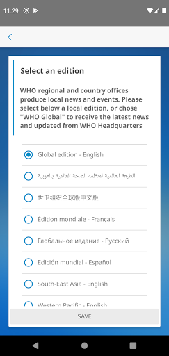  |   |   | 
 |   |   |   | 
 |   |   |   | 
 |   |   | 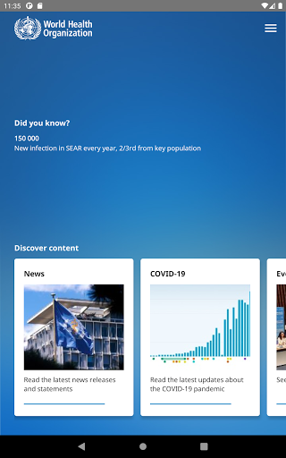  | 
 |   |   |   | 
 | 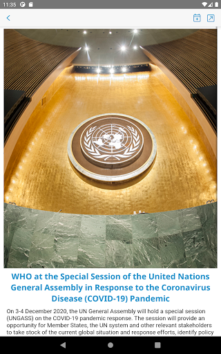  |   |   | 

## Development team
In the following we report the main information provided by the development team in the Google play store.

| | |
|-------------------------|-------------------------|
| **Developer**  | World Health Organization |
| **Website**  | [https://www.who.int/](https://www.who.int/) |
| **Email** | dcx@who.int |
| **Physical address**  | [Avenu Appia 20 1211 Geneva Switzerland](https://www.google.com/maps/search/Avenu%20Appia%2020%201211%20Geneva%20Switzerland) (Google Maps) |
| **Other developed apps**  | [https://play.google.com/store/apps/developer?id=World+Health+Organization](https://play.google.com/store/apps/developer?id=World+Health+Organization) |

## Android support

| | |
|-------------------------|-------------------------|
| **Declared target Android version**  | - |
| **Effective target Android version**  | - |
| **Minimum supported Android version**  | Jelly Bean, version 4.2.x (API level 17) |
| **Maximum target Android version**  | - |

The larger the difference between the minimum and maximum supported Android versions, the better. A larger difference means a wider audience. For example, old phones have a very low Android version, so a high minimum supported Android version means that the app cannot be used by users with old phones, thus leading to accessibility problems. 

## Requested permissions

In the following we report the complete list of the permissions requested by the app. 

| **Permission** | **Protection level** | **Description** | 
|-------------------------|-------------------------|-------------------------|
 **android.permission ACCESS_NETWORK_STATE** | Normal | Allows applications to access information about networks. 
 **android.permission INTERNET** | Normal | Allows applications to open network sockets. 
 **android.permission READ_CALENDAR** | :warning:**Dangerous** | Allows an application to read the user's calendar data. 
 **android.permission READ_EXTERNAL_STORAGE** | :warning:**Dangerous** | Allows an application to read from external storage. 
 **android.permission WAKE_LOCK** | Normal | Allows using PowerManager WakeLocks to keep processor from sleeping or screen from dimming. 
 **android.permission WRITE_CALENDAR** | :warning:**Dangerous** | Allows an application to write the user's calendar data. 
 **android.permission WRITE_EXTERNAL_STORAGE** | :warning:**Dangerous** | Allows an application to write to external storage. 
 **com.google.android.c2dm.permission RECEIVE** | - | - 
 **com.google.android.finsky.permission BIND_GET_INSTALL_REFERRER_SERVICE** | - | - 

## Mentioned servers

| **Server** | **Registrant** | **Registrant country** | **Creation date** | 
|-------------------------|-------------------------|-------------------------|-------------------------|
 | adobe.com | Adobe Inc. | :us: US | 1986-11-17 05:00:00 |
 | googlesyndication.com | Google LLC | :us: US | 2003-01-21 06:17:24 |
 | google.com | Google LLC | :us: US | 1997-09-15 04:00:00 |
 | app-measurement.com | Google LLC | :us: US | 2015-06-19 20:13:31 |
 | googleapis.com | Google LLC | :us: US | 2005-01-25 17:52:26 |
 | googleadservices.com | Google LLC | :us: US | 2003-06-19 16:34:53 |

## Security analysis 

Below we report the main security warnings raised by our execution of the [Androwarn](https://github.com/maaaaz/androwarn) security analysis tool.

**Connection interfaces exfiltration**
> - This application reads details about the currently active data network 
> - This application tries to find out if the currently active data network is metered 

**Suspicious connection establishment**
> - This application opens a Socket and connects it to the remote address 'Lfi/iki/elonen/NanoHTTPD$ResponseException;' on the 'N/A' port  
> - This application opens a Socket and connects it to the remote address 'NanoHttpd Shutdown' on the 'N/A' port  

**Code execution**
> - This application loads a native library: 'NativeScript' 
> - This application executes a UNIX command containing this argument: '2' 

## User ratings and reviews

Below we provide information about how end users are reacting to the app in terms of ratings and reviews in the Google Play store.

### Ratings

The WHO Info app has been installed by more than **500000** times. At this time, **1114** rated the app and its average score is **4.108108**. Below we show the distribution of the ratings across the usual star-based rating of Google Play

:star::star::star::star::star:: 754

:star::star::star::star:: 90

:star::star::star:: 60

:star::star:: 60

:star:: 150

### Reviews 

#### 5-star reviews

> Gostava de ter este pograma ensina me.  :date: __2020-09-18 20:17:25__

> É melhor aplicativo.  :date: __2020-05-28 19:51:54__

> NICE  :date: __2020-05-26 16:25:12__

> Para melhor informacoes  :date: __2020-05-10 16:31:41__

#### 4-star reviews

> Nao consigo olhar a do Paraná e não consigo traduzir para o Português  :date: __2020-06-14 14:18:24__

#### 3-star reviews

> Em português  :date: __2020-07-01 10:18:15__

#### 2-star reviews

No recent reviews available with 2 stars.

#### 1-star reviews

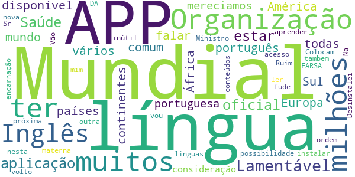

> Lamentável!!! A aplicação oficial da Organização Mundial da Saúde não estar disponível em todas as línguas do mundo, eu como português e muitos milhões em países em vários continentes como Europa, África, América do Sul, que temos em comum falar a língua portuguesa, somos muitos milhões e mereciamos mais consideração e ter a possibilidade de ler e ter acesso aos conteúdos nesta APP , na nossa língua materna.  :date: __2021-02-21 11:29:25__

> Colocam outra linguas tambem  :date: __2020-11-12 06:36:18__

> Vão se fude com esse app e sua nova ordem mundial ORGANIZAÇÃO MUNDIAL DA FARSA  :date: __2020-10-16 00:51:53__

> Inglês, Sr Ministro ??????.?  :date: __2020-09-01 11:01:09__

> Na próxima encarnação vou aprender inglês, depois volto a instalar a APP. Desinstalei, inútil para mim.  :date: __2020-08-05 17:04:59__

> Ruim  :date: __2020-07-29 23:21:44__

# MySNS
App version ``1.5.0``

Analyzed with [covid-apps-observer](http://github.com/covid-apps-observer) project, version ``0.1``

## App overview
| | |
|-------------------------|-------------------------| 
| **Name**&nbsp;&nbsp;&nbsp;&nbsp;&nbsp;&nbsp;&nbsp;&nbsp;&nbsp;&nbsp;&nbsp;&nbsp;&nbsp;&nbsp;&nbsp;&nbsp;&nbsp;&nbsp;&nbsp;&nbsp;&nbsp;&nbsp;&nbsp;&nbsp;&nbsp;&nbsp;&nbsp;&nbsp;&nbsp;&nbsp;&nbsp;&nbsp;&nbsp;&nbsp;&nbsp;&nbsp;&nbsp;&nbsp;&nbsp;&nbsp;  | MySNS |
| **Unique identifier** | pt.min_saude.spms.mysns |
| **Link to Google Play** | [https://play.google.com/store/apps/details?id=pt.min_saude.spms.mysns](https://play.google.com/store/apps/details?id=pt.min_saude.spms.mysns) |
| **Summary**  | Aplicação oficial do Serviço Nacional de Saúde com informação para o cidadão. |
| **Privacy policy** | [https://www.sns.gov.pt/home/notas-legais-portal-sns-2/](https://www.sns.gov.pt/home/notas-legais-portal-sns-2/) |
| **Latest version** | 1.5.0 |
| **Last update** | 2018-09-15 14:49:27 |
| **Recent changes** | - Saiba onde marcar as suas consultas de Saúde Oral! - Melhorias gráficas; - Melhorias gerais de usabilidade da aplicação. |
| **Installs**  | 100.000+ |
| **Category** | Saúde e fitness |
| **First release** | 14 de set. de 2016 |
| **Size**  | 6,5M |
| **Supported Android version**  | 4.4 ou superior |

### Description
> Numa perspetiva de aumentar a proximidade junto do utente e a transparência dos serviços prestados foi desenvolvido o novo Portal do SNS. A App MySNS é uma aplicação oficial do Serviço Nacional de Saúde e é a ligação móvel a este portal e aos serviços digitais da saúde.
 O MySNS é uma ferramenta que permite consultar notícias do Serviço Nacional de Saúde, consultar informação de saúde, disponibilizar uma lista e mapa instituições de saúde (Hospitais, Cuidados de Saúde Primários e Farmácias), avaliação da qualidade e satisfação do SNS pelos cidadão, e consulta de informação da Linha Saúde 24, além disso irá receber notificações tais como alertas de calor, etc, associadas à sua localização.

### User interface
The developers of the app provide the following screenshots in the Google play store.
| | | |
|:-------------------------:|:-------------------------:|:-------------------------:|
 | 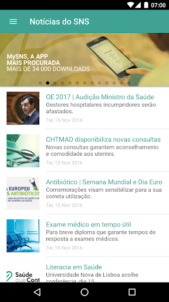  | 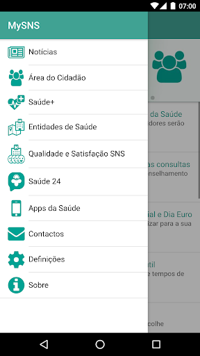  |   | 
 | 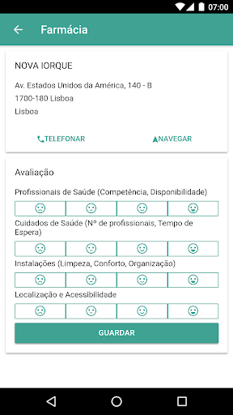 

## Development team
In the following we report the main information provided by the development team in the Google play store.

| | |
|-------------------------|-------------------------|
| **Developer**  | SPMS - Serviços Partilhados do Ministério da Saúde |
| **Website**  | [https://sns.gov.pt](https://sns.gov.pt) |
| **Email** | atendimento@sns24.gov.pt |
| **Physical address**  | - |
| **Other developed apps**  | [https://play.google.com/store/apps/developer?id=SPMS+-+Servi%C3%A7os+Partilhados+do+Minist%C3%A9rio+da+Sa%C3%BAde](https://play.google.com/store/apps/developer?id=SPMS+-+Servi%C3%A7os+Partilhados+do+Minist%C3%A9rio+da+Sa%C3%BAde) |

## Android support

| | |
|-------------------------|-------------------------|
| **Declared target Android version**  | Nougat, version 7.1 (API level 25) |
| **Effective target Android version**  | Nougat, version 7.1 (API level 25) |
| **Minimum supported Android version**  | Jelly Bean, version 4.2.x (API level 17) |
| **Maximum target Android version**  | - |

The larger the difference between the minimum and maximum supported Android versions, the better. A larger difference means a wider audience. For example, old phones have a very low Android version, so a high minimum supported Android version means that the app cannot be used by users with old phones, thus leading to accessibility problems. 

## Requested permissions

In the following we report the complete list of the permissions requested by the app. 

| **Permission** | **Protection level** | **Description** | 
|-------------------------|-------------------------|-------------------------|
 **android.permission ACCESS_COARSE_LOCATION** | :warning:**Dangerous** | Allows an app to access approximate location. 
 **android.permission ACCESS_FINE_LOCATION** | :warning:**Dangerous** | Allows an app to access precise location. 
 **android.permission ACCESS_NETWORK_STATE** | Normal | Allows applications to access information about networks. 
 **android.permission ACCESS_WIFI_STATE** | Normal | Allows applications to access information about Wi-Fi networks. 
 **android.permission INTERNET** | Normal | Allows applications to open network sockets. 
 **android.permission READ_APP_BADGE** | - | - 
 **android.permission REQUEST_INSTALL_PACKAGES** | Signature | Allows an application to request installing packages. 
 **android.permission VIBRATE** | Normal | Allows access to the vibrator. 
 **android.permission WAKE_LOCK** | Normal | Allows using PowerManager WakeLocks to keep processor from sleeping or screen from dimming. 
 **android.permission WRITE_EXTERNAL_STORAGE** | :warning:**Dangerous** | Allows an application to write to external storage. 
 **com.anddoes.launcher.permission UPDATE_COUNT** | - | - 
 **com.google.android.c2dm.permission RECEIVE** | - | - 
 **com.htc.launcher.permission READ_SETTINGS** | - | - 
 **com.htc.launcher.permission UPDATE_SHORTCUT** | - | - 
 **com.huawei.android.launcher.permission CHANGE_BADGE** | - | - 
 **com.huawei.android.launcher.permission READ_SETTINGS** | - | - 
 **com.huawei.android.launcher.permission WRITE_SETTINGS** | - | - 
 **com.majeur.launcher.permission UPDATE_BADGE** | - | - 
 **com.oppo.launcher.permission READ_SETTINGS** | - | - 
 **com.oppo.launcher.permission WRITE_SETTINGS** | - | - 
 **com.sec.android.provider.badge.permission READ** | - | - 
 **com.sec.android.provider.badge.permission WRITE** | - | - 
 **com.sonyericsson.home.permission BROADCAST_BADGE** | - | - 
 **com.sonymobile.home.permission PROVIDER_INSERT_BADGE** | - | - 
 **pt.min_saude.spms.mysns.permission C2D_MESSAGE** | - | - 
 **pt.min_saude.spms.mysns.permission PushHandlerActivity** | - | - 

## Mentioned servers

| **Server** | **Registrant** | **Registrant country** | **Creation date** | 
|-------------------------|-------------------------|-------------------------|-------------------------|
 | googlesyndication.com | Google LLC | :us: US | 2003-01-21 06:17:24 |
 | google.com | Google LLC | :us: US | 1997-09-15 04:00:00 |
 | hockeyapp.net | Microsoft Corporation | :us: US | 2011-01-23 18:46:43 |
 | gstatic.com | Google LLC | :us: US | 2008-02-11 15:31:25 |
 | here.com | HERE Global B.V. | :netherlands: NL | 1995-06-11 04:00:00 |
 | googleapis.com | Google LLC | :us: US | 2005-01-25 17:52:26 |

## Security analysis 

Below we report the main security warnings raised by our execution of the [Androwarn](https://github.com/maaaaz/androwarn) security analysis tool.

**Telephony identifiers leakage**
> - This application reads the ISO country code equivalent of the current registered operator's MCC (Mobile Country Code) 
> - This application reads the MCC+MNC of the provider of the SIM 
> - This application reads the constant indicating the state of the device SIM card 
> - This application reads the device phone type value 
> - This application reads the numeric name (MCC+MNC) of current registered operator 

**Location lookup**
> - This application reads location information from all available providers (WiFi, GPS etc.) 

**Connection interfaces exfiltration**
> - This application reads details about the currently active data network 
> - This application tries to find out if the currently active data network is metered 

**Telephony services abuse**
> - This application makes phone calls 

**Suspicious connection establishment**
> - This application opens a Socket and connects it to the remote address '10' on the 'N/A' port  
> - This application opens a Socket and connects it to the remote address '3' on the 'N/A' port  
> - This application opens a Socket and connects it to the remote address 'Ljava/net/Proxy;->type()Ljava/net/Proxy$Type;' on the 'N/A' port  
> - This application opens a Socket and connects it to the remote address 'timeout' on the 'N/A' port  

**Pim data leakage**
> - This application accesses the MMS list 
> - This application accesses the SMS list 
> - This application accesses data stored in the clipboard 

**Code execution**
> - This application loads a native library 
> - This application loads a native library: 'Ljava/lang/System;->mapLibraryName(Ljava/lang/String;)Ljava/lang/String;' 
> - This application loads a native library: 'chromium_android_linker' 
> - This application loads a native library: 'chromium_android_linker.cr' 
> - This application loads a native library: 'sqlc-native-driver' 
> - This application executes a UNIX command containing this argument: '7' 
> - This application executes a UNIX command containing this argument: 'getprop ro.product.cpu.abi' 

## User ratings and reviews

Below we provide information about how end users are reacting to the app in terms of ratings and reviews in the Google Play store.

### Ratings

The MySNS app has been installed by more than **100000** times. At this time, **1117** rated the app and its average score is **3.2272727**. Below we show the distribution of the ratings across the usual star-based rating of Google Play

:star::star::star::star::star:: 416

:star::star::star::star:: 152

:star::star::star:: 142

:star::star:: 81

:star:: 324

### Reviews 

#### 5-star reviews

> Bom.  :date: __2021-03-15 19:40:57__

> Fundamental. Mas o utente poderia carregar mais dados, eg, os das vacinações antigas.  :date: __2021-03-14 16:57:25__

> Top  :date: __2021-02-22 22:33:34__

> Muito útil. OBRIGADO  :date: __2021-02-21 10:56:18__

> Muito util  :date: __2021-02-05 18:48:15__

> Opcional  :date: __2021-02-02 17:13:25__

> Muito prático e eficiente. Resume o histórico clinico  :date: __2021-01-29 11:51:00__

> Muito bom  :date: __2021-01-27 17:41:06__

> Bom.  :date: __2021-01-21 23:47:44__

> Impecavel  :date: __2020-11-24 18:59:55__

#### 4-star reviews

> Nenhuma  :date: __2021-03-18 11:03:27__

> Boa  :date: __2021-02-04 12:01:31__

> A APP não corre com Android 10. como posso fazer para poder utilizar no meu tlm?  :date: __2021-01-26 07:57:32__

> Boa, muito boa  :date: __2021-01-06 10:55:27__

> Confusa  :date: __2020-12-14 15:54:31__

> Razoável  :date: __2020-12-08 11:57:07__

> Boa experiência.  :date: __2020-11-12 09:59:38__

> Mais ou menos  :date: __2020-11-07 22:46:32__

> Bom  :date: __2020-10-31 20:49:08__

> Fiz a instalação, acedi através da chave móvel digital e funcionou à primeira.  :date: __2020-08-05 21:42:20__

#### 3-star reviews

> Como consigo extrair a minha receita em papel ?  :date: __2021-01-15 17:35:08__

> Necessita conter mais informação sobre o Utente, não está atualizado de acordo com os movimentos do Utente, faltam consultas, resultados e comunicação com o SNS. Tenho atestado de incapacidade Multiusos e não consta essa informação?!  :date: __2021-01-09 10:38:47__

> Bom  :date: __2020-12-05 20:20:44__

> APP pouco útil da forma q está estruturada. Para aceder à área de cidadão remete para o browser o q torna ridícula a utilização da APP. Uma nora.. Dentro da área de cidadão a informação não aparece completa.. há informação em falta... Exemplo infecção covid e acesso a área de registo de sintomas. Acesso a baixas incompleto... Etc  :date: __2020-11-21 17:35:55__

> Há muito a melhorar nesta app!!!  :date: __2020-10-05 19:42:00__

> A app stayaway Covid-19, tem algum problema em ser instalada? Muito obrigada.  :date: __2020-09-01 11:17:30__

> Difícil, é nem sempre conseguimos atendimento  :date: __2020-08-05 13:09:26__

> Pouca dificuldade a, aceder !  :date: __2020-06-26 20:16:31__

> A informação do movimento de banhistas,deveria ser actualizada mais frequentemente, particularmente até ao meio dia e depois das 4 da tarde. E mais divulgada nos meios comunicação.  :date: __2020-06-21 08:13:06__

> Dificuldade em perceber e aceder às receitas digitais  :date: __2020-04-22 15:28:21__

#### 2-star reviews

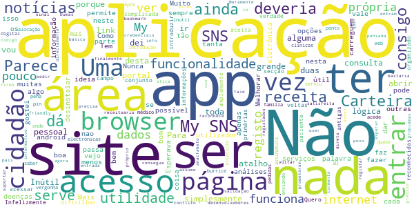

> Está sempre a parar de funcionar. Era bom actualizar esta app.  :date: __2021-03-12 12:33:48__

> Nao abre no android 10. Para quango atualizacao?  :date: __2021-02-01 17:52:50__

> Não está a trabalhar direito  :date: __2021-01-30 18:06:04__

> Está aplicação nem abre diz que há um problema qual?  :date: __2021-01-28 15:29:49__

> Não abre, quer dizer abrir até abre, mas não aparece nada.  :date: __2021-01-20 15:59:14__

> A aplicação direciona sempre para o browser para fazer o login, por isso torna-se inútil instalar.  :date: __2020-11-04 14:58:20__

> Muito complicado. Para aceder à minha conta do banco é bem mais fácil e seguro na mesma.  :date: __2020-08-30 12:46:29__

> Diz que a APP foi desenhada para Android 5 e "Crasha". Não passa daqui. Não consigo fazer mais nada.  :date: __2020-08-29 00:01:45__

> Pouco intuitiva, nada funcional como app para Android.  :date: __2020-08-28 21:49:31__

> Elaborada para uma versão mais antiga  :date: __2020-07-02 08:58:12__

#### 1-star reviews

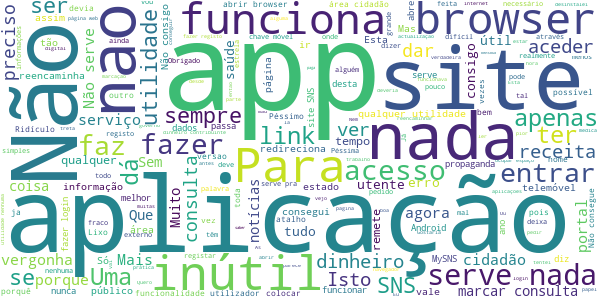

> Leva uma estrela porque nao da para levar zero. Uma pena que a app nao funciona de maneira nenhuma. Algo que poderia ser bastante util simplesmente nao serve para nada.  :date: __2021-03-18 11:36:05__

> Por enquanto, uma app de notícias e pouco mais.  :date: __2021-03-17 14:27:24__

> Zero! Não vale a pena instalar....  :date: __2021-03-15 09:45:56__

> Simplesmente não funciona  :date: __2021-03-12 10:30:59__

> Horrível  :date: __2021-03-11 13:39:39__

> Não atualizada. O meu Android; diz q é para versões mais antigas  :date: __2021-03-07 14:13:25__

> Última atualização em 2018?  :date: __2021-03-04 23:50:37__

> Porque não funciona neste telemóvel???  :date: __2021-03-04 00:58:01__

> Naõ faz atualizaçaõ.  :date: __2021-02-25 11:00:27__

> Não funciona em telemóveis com Android 10  :date: __2021-02-15 21:53:37__

# OpenWHO: Conhecimento para Emergências em Saúde
App version ``3.7``

Analyzed with [covid-apps-observer](http://github.com/covid-apps-observer) project, version ``0.1``

## App overview
| | |
|-------------------------|-------------------------| 
| **Name**&nbsp;&nbsp;&nbsp;&nbsp;&nbsp;&nbsp;&nbsp;&nbsp;&nbsp;&nbsp;&nbsp;&nbsp;&nbsp;&nbsp;&nbsp;&nbsp;&nbsp;&nbsp;&nbsp;&nbsp;&nbsp;&nbsp;&nbsp;&nbsp;&nbsp;&nbsp;&nbsp;&nbsp;&nbsp;&nbsp;&nbsp;&nbsp;&nbsp;&nbsp;&nbsp;&nbsp;&nbsp;&nbsp;&nbsp;&nbsp;  | OpenWHO: Conhecimento para Emergências em Saúde |
| **Unique identifier** | de.xikolo.openwho |
| **Link to Google Play** | [https://play.google.com/store/apps/details?id=de.xikolo.openwho](https://play.google.com/store/apps/details?id=de.xikolo.openwho) |
| **Summary**  | Conhecimento para Emergências em Saúde |
| **Privacy policy** | [https://openwho.org/pages/privacy](https://openwho.org/pages/privacy) |
| **Latest version** | 3.7 |
| **Last update** | 2020-11-23 13:57:15 |
| **Recent changes** | - Bug fixes and performance improvements |
| **Installs**  | 1.000.000+ |
| **Category** | Educação |
| **First release** | 17 de mai. de 2017 |
| **Size**  | 18M |
| **Supported Android version**  | 5.0 ou superior |

### Description
> A OpenWHO é a plataforma interativa de transferência de conhecimento da Organização Mundial de Saúde (OMS) que oferece cursos online para melhorar a resposta a emergências em saúde. A OpenWHO permite que a Organização e os seus principais parceiros transfiram conhecimento capaz de salvar vidas às equipas de resposta na linha da frente.
 Com a OpenWHO, terá a flexibilidade de aprender ao seu próprio ritmo. Assista a curtas palestras em vídeo e teste o seu conhecimento através de autotestes quando e onde quiser. O fórum do curso e o espaço de colaboração permite-lhe comunicar com outros participantes e especialistas em todo o mundo.
 Concebido sobretudo para profissionais de saúde, equipas de resposta na linha da frente e decisores, a app é também uma fonte de informação para aqueles afetados por surtos de doenças e emergências em saúde, ou para aqueles com interesse geral no trabalho da OMS em emergências em saúde. 
 A aplicação possui 6 canais: 
 - canal Epidemias aborda a gestão de doenças infeciosas e fornece informação científica capaz de salvar vidas.
 - canal Pronto para responder ajuda a  preparar o pessoal que se encontra em formação para trabalhar em surtos de doenças e emergências sanitárias.
 - canal Social foca-se nas intervenções com base nas ciências sociais e ajuda na comunicação com comunidades afetadas.  
 - canal Preparação para Pandemias reúne cursos sobre vários aspetos da preparação, incluindo vigilância, medidas de saúde pública e comunicação de risco durante uma pandemia. 
 - canal COVID-19 fornece recursos de aprendizagem nas 6 línguas oficiais da OMS (árabe, chinês, espanhol, francês, inglês e russo) para profissionais de saúde, decisores e o público em geral sobre o surto da doença do coronavírus (COVID-19). 
 - canal de COVID-19 Idiomas Nacionais fornece os mesmos recursos de aprendizagem que o canal COVID-19, mas em idiomas nacionais, tais como Indonésio, Japonês e Português. 
 Os cursos da OpenWHO estão disponíveis em diversas línguas, incluindo as 6 línguas oficiais da OMS. 
 Faça o download da app e junte-se à comunidade da OpenWHO.
 Esta app é desenvolvida em cooperação entre o Instituto Hasso Plattner e a OMS. O conteúdo de aprendizagem é fornecido exclusivamente pela OMS.

### User interface
The developers of the app provide the following screenshots in the Google play store.
| | | |
|:-------------------------:|:-------------------------:|:-------------------------:|
 |   |   |   | 
 |   |   |   | 

## Development team
In the following we report the main information provided by the development team in the Google play store.

| | |
|-------------------------|-------------------------|
| **Developer**  | HPI Knowledge Engineering Team |
| **Website**  | [https://openwho.org/](https://openwho.org/) |
| **Email** | openwho-support@hpi.de |
| **Physical address**  | [Prof.-Dr.-Helmert-Str.2-3 14482 Potsdam](https://www.google.com/maps/search/Prof.-Dr.-Helmert-Str.2-3%2014482%20Potsdam) (Google Maps) |
| **Other developed apps**  | [https://play.google.com/store/apps/developer?id=7185448023325736337](https://play.google.com/store/apps/developer?id=7185448023325736337) |

## Android support

| | |
|-------------------------|-------------------------|
| **Declared target Android version**  | - |
| **Effective target Android version**  | - |
| **Minimum supported Android version**  | Lollipop, version 5.0 (API level 21) |
| **Maximum target Android version**  | - |

The larger the difference between the minimum and maximum supported Android versions, the better. A larger difference means a wider audience. For example, old phones have a very low Android version, so a high minimum supported Android version means that the app cannot be used by users with old phones, thus leading to accessibility problems. 

## Requested permissions

In the following we report the complete list of the permissions requested by the app. 

| **Permission** | **Protection level** | **Description** | 
|-------------------------|-------------------------|-------------------------|
 **android.permission ACCESS_NETWORK_STATE** | Normal | Allows applications to access information about networks. 
 **android.permission ACCESS_WIFI_STATE** | Normal | Allows applications to access information about Wi-Fi networks. 
 **android.permission DOWNLOAD_WITHOUT_NOTIFICATION** | - | - 
 **android.permission FOREGROUND_SERVICE** | Normal | Allows a regular application to use Service.startForeground. 
 **android.permission INTERNET** | Normal | Allows applications to open network sockets. 
 **android.permission RECEIVE_BOOT_COMPLETED** | Normal | Allows an application to receive the Intent.ACTION_BOOT_COMPLETED that is broadcast after the system finishes booting. 
 **android.permission WAKE_LOCK** | Normal | Allows using PowerManager WakeLocks to keep processor from sleeping or screen from dimming. 
 **android.permission WRITE_EXTERNAL_STORAGE** | :warning:**Dangerous** | Allows an application to write to external storage. 
 **com.google.android.c2dm.permission RECEIVE** | - | - 
 **com.google.android.finsky.permission BIND_GET_INSTALL_REFERRER_SERVICE** | - | - 

## Mentioned servers

| **Server** | **Registrant** | **Registrant country** | **Creation date** | 
|-------------------------|-------------------------|-------------------------|-------------------------|
 | googlesyndication.com | Google LLC | :us: US | 2003-01-21 06:17:24 |
 | google.com | Google LLC | :us: US | 1997-09-15 04:00:00 |
 | apple.com | Apple Inc. | :us: US | 1987-02-19 05:00:00 |
 | aomedia.org | Contact Privacy Inc. Customer 1243324949 | :canada: CA | 2015-08-24 14:07:31 |
 | dashif.org | VTM Group | :us: US | 2012-04-27 13:02:46 |
 | app-measurement.com | Google LLC | :us: US | 2015-06-19 20:13:31 |
 | w3.org | W3C | :us: US | 1994-07-06 04:00:00 |
 | googleapis.com | Google LLC | :us: US | 2005-01-25 17:52:26 |
 | psdev.de | - | - | - |
 | xmlpull.org | WhoisGuard, Inc. | PA | 2001-11-26 20:33:08 |
 | crashlytics.com | Google LLC | :us: US | 2011-01-21 15:30:40 |
 | apache.org | The Apache Software Foundation | :us: US | 1995-04-11 04:00:00 |
 | opensource.org | Open Source Initiative | :us: US | 1998-02-11 05:00:00 |
 | creativecommons.org | Creative Commons Corporation | :canada: CA | 2001-01-15 16:51:44 |
 | eclipse.org | Eclipse.org Foundation, Inc. | :canada: CA | 1997-04-14 04:00:00 |
 | gnu.org | Free Software Foundation | :us: US | 1995-11-24 05:00:00 |
 | mozilla.org | Mozilla Corporation | :us: US | 1998-01-24 05:00:00 |
 | googleadservices.com | Google LLC | :us: US | 2003-06-19 16:34:53 |

## Security analysis 

Below we report the main security warnings raised by our execution of the [Androwarn](https://github.com/maaaaz/androwarn) security analysis tool.

**Telephony identifiers leakage**
> - This application reads the ISO country code equivalent of the current registered operator's MCC (Mobile Country Code) 
> - This application reads the MCC+MNC of the provider of the SIM 

**Connection interfaces exfiltration**
> - This application reads details about the currently active data network 
> - This application tries to find out if the currently active data network is metered 

**Suspicious connection establishment**
> - This application opens a Socket and connects it to the remote address ' returned no addresses for  ; port is out of range' on the 'N/A' port  
> - This application opens a Socket and connects it to the remote address '' on the 'N/A' port  
> - This application opens a Socket and connects it to the remote address 'Ljava/lang/StringBuilder;->toString()Ljava/lang/String;' on the 'N/A' port  
> - This application opens a Socket and connects it to the remote address 'Ljava/net/Proxy;->type()Ljava/net/Proxy$Type;' on the 'N/A' port  
> - This application opens a Socket and connects it to the remote address 'timeout' on the 'N/A' port  

**Code execution**
> - This application loads a native library 

## User ratings and reviews

Below we provide information about how end users are reacting to the app in terms of ratings and reviews in the Google Play store.

### Ratings

The OpenWHO: Conhecimento para Emergências em Saúde app has been installed by more than **1000000** times. At this time, **3403** rated the app and its average score is **4.2647057**. Below we show the distribution of the ratings across the usual star-based rating of Google Play

:star::star::star::star::star:: 2403

:star::star::star::star:: 370

:star::star::star:: 130

:star::star:: 130

:star:: 370

### Reviews 

#### 5-star reviews

> Ótimo!  :date: __2020-08-18 16:10:09__

> Ajuda a saude de todos gostei😏😏  :date: __2020-05-16 21:46:48__

> Aprendam a falar e a escrever INGLÊS. É mais útil que Funk!  :date: __2020-05-03 15:00:54__

> Boa  :date: __2020-04-06 08:22:43__

> Só em engles ruim  :date: __2020-03-17 03:56:56__

#### 4-star reviews

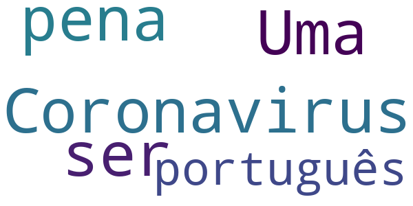

> Coronavirus  :date: __2020-05-27 13:53:07__

> Uma pena não ser em português.  :date: __2018-01-18 01:21:10__

#### 3-star reviews

> Caro amigo Pedro Paiva nem não todos tem a oportunidades de aprender outras línguas, e mesmo concordando que aprender inglês e muito melhor que esse estilo de música a ONU Organizações das Nações Unidades deveria ter App oficial em outros idiomas!  :date: __2020-05-19 02:36:13__

#### 2-star reviews

No recent reviews available with 2 stars.

#### 1-star reviews

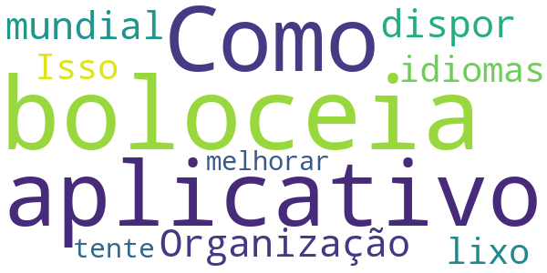

> boloceia aplicativo  :date: __2020-10-31 16:14:42__

> Como uma Organização mundial não dispor mais idiomas?  :date: __2020-04-09 17:28:57__

> Isso è um lixo tente melhorar  :date: __2020-04-02 09:30:07__

# STAYAWAY COVID
App version ``1.1.3``

Analyzed with [covid-apps-observer](http://github.com/covid-apps-observer) project, version ``0.1``

## App overview
| | |
|-------------------------|-------------------------| 
| **Name**&nbsp;&nbsp;&nbsp;&nbsp;&nbsp;&nbsp;&nbsp;&nbsp;&nbsp;&nbsp;&nbsp;&nbsp;&nbsp;&nbsp;&nbsp;&nbsp;&nbsp;&nbsp;&nbsp;&nbsp;&nbsp;&nbsp;&nbsp;&nbsp;&nbsp;&nbsp;&nbsp;&nbsp;&nbsp;&nbsp;&nbsp;&nbsp;&nbsp;&nbsp;&nbsp;&nbsp;&nbsp;&nbsp;&nbsp;&nbsp;  | STAYAWAY COVID |
| **Unique identifier** | fct.inesctec.stayaway |
| **Link to Google Play** | [https://play.google.com/store/apps/details?id=fct.inesctec.stayaway](https://play.google.com/store/apps/details?id=fct.inesctec.stayaway) |
| **Summary**  | A aplicação oficial de notificação de exposição à COVID-19 em Portugal. |
| **Privacy policy** | [https://stayawaycovid.pt/politica-de-privacidade](https://stayawaycovid.pt/politica-de-privacidade) |
| **Latest version** | 1.1.3 |
| **Last update** | 2021-02-01 20:58:28 |
| **Recent changes** | - Correções no mecanismo de sincronização - Correção de erros - Correção de bugs |
| **Installs**  | 1.000.000+ |
| **Category** | Saúde e fitness |
| **First release** | 13 de ago. de 2020 |
| **Size**  | 58M |
| **Supported Android version**  | 6.0 ou superior |

### Description
> STAYAWAY COVID é a aplicação oficial de notificação de exposição à COVID-19 em Portugal. É uma aplicação para telemóveis que tem como objetivo auxiliar o país no rastreio da COVID-19. A aplicação permite, de forma simples e segura, que cada um de nós seja informado sobre exposições de risco à doença, através da monitorização de contactos recentes. A aplicação é de utilização voluntária e gratuita e, em momento algum, tem acesso à sua identidade ou dados pessoais.
 Uma vez instalada a aplicação, o telemóvel anuncia a sua presença a todos os dispositivos próximos usando identificadores aleatórios que não revelam identidades pessoais. A informação partilhada entre dispositivos permite à STAYAWAY COVID saber de que telemóveis esteve perto, quão perto e por quanto tempo. A Organização Mundial de Saúde sugere que, contactos a menos de 2 metros e por mais de 15 minutos com alguém portador de COVID-19 sejam considerados com elevado risco de contágio.
 1. Ausência de registo de elevado risco de contágio
 Não registando contactos de proximidade com elevado risco de contágio com alguém a quem foi diagnosticada COVID-19, a aplicação informa-nos exatamente disso com a data da última avaliação.
 2. Alerta de elevado risco de contágio
 Se alguém de quem estivemos perigosamente próximo nos últimos 14 dias for diagnosticado com COVID-19 e informar o sistema STAYAWAY COVID, a aplicação alerta-nos de imediato do risco sugerindo que nos isolemos e contactemos a Linha SNS 24 (808 24 24 24).
 3. Após diagnóstico de COVID-19
 No caso de contrairmos COVID-19, com o diagnóstico receberemos um código numérico que nos permitirá, anonimamente e através da aplicação, informar o sistema STAYAWAY COVID. É este ato que permite ao sistema alertar segura e atempadamente todos aqueles que podemos ter contagiado, mesmo antes de terem tido qualquer sintoma. Não é nunca revelada a ninguém a identidade de ninguém.
 A aplicação STAYAWAY COVID foi desenvolvida pelo INESC TEC, ISPUP, Keyruptive e Ubirider para a DGS / Ministério da Saúde.

### User interface
The developers of the app provide the following screenshots in the Google play store.
| | | |
|:-------------------------:|:-------------------------:|:-------------------------:|
 |   | 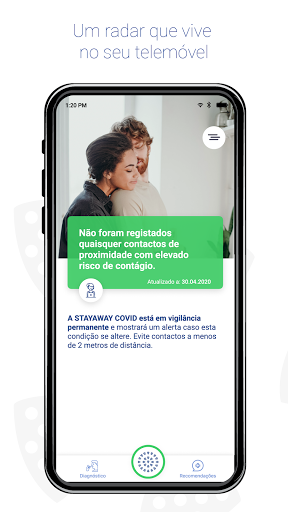  |   | 
 | 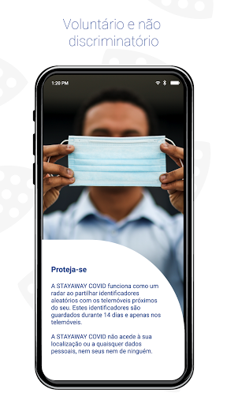  |  

## Development team
In the following we report the main information provided by the development team in the Google play store.

| | |
|-------------------------|-------------------------|
| **Developer**  | FCT FCCN |
| **Website**  | [https://stayawaycovid.pt/](https://stayawaycovid.pt/) |
| **Email** | stayaway@inesctec.pt |
| **Physical address**  | - |
| **Other developed apps**  | [https://play.google.com/store/apps/developer?id=FCT+FCCN](https://play.google.com/store/apps/developer?id=FCT+FCCN) |

## Android support

| | |
|-------------------------|-------------------------|
| **Declared target Android version**  | - |
| **Effective target Android version**  | - |
| **Minimum supported Android version**  | Marshmallow, version 6.0 (API level 23) |
| **Maximum target Android version**  | - |

The larger the difference between the minimum and maximum supported Android versions, the better. A larger difference means a wider audience. For example, old phones have a very low Android version, so a high minimum supported Android version means that the app cannot be used by users with old phones, thus leading to accessibility problems. 

## Requested permissions

In the following we report the complete list of the permissions requested by the app. 

| **Permission** | **Protection level** | **Description** | 
|-------------------------|-------------------------|-------------------------|
 **android.permission ACCESS_NETWORK_STATE** | Normal | Allows applications to access information about networks. 
 **android.permission BLUETOOTH** | Normal | Allows applications to connect to paired bluetooth devices. 
 **android.permission FOREGROUND_SERVICE** | Normal | Allows a regular application to use Service.startForeground. 
 **android.permission INTERNET** | Normal | Allows applications to open network sockets. 
 **android.permission RECEIVE_BOOT_COMPLETED** | Normal | Allows an application to receive the Intent.ACTION_BOOT_COMPLETED that is broadcast after the system finishes booting. 
 **android.permission REQUEST_IGNORE_BATTERY_OPTIMIZATIONS** | Normal | Permission an application must hold in order to use Settings.ACTION_REQUEST_IGNORE_BATTERY_OPTIMIZATIONS. 
 **android.permission WAKE_LOCK** | Normal | Allows using PowerManager WakeLocks to keep processor from sleeping or screen from dimming. 

## Mentioned servers

| **Server** | **Registrant** | **Registrant country** | **Creation date** | 
|-------------------------|-------------------------|-------------------------|-------------------------|
 | android.com | Google LLC | :us: US | 1997-06-23 04:00:00 |
 | google.com | Google LLC | :us: US | 1997-09-15 04:00:00 |
 | ietf.org | IETF Trust | :us: US | 1995-03-11 05:00:00 |

## Security analysis 

Below we report the main security warnings raised by our execution of the [Androwarn](https://github.com/maaaaz/androwarn) security analysis tool.

**Connection interfaces exfiltration**
> - This application reads details about the currently active data network 
> - This application tries to find out if the currently active data network is metered 

**Suspicious connection establishment**
> - This application opens a Socket and connects it to the remote address '' on the 'N/A' port  
> - This application opens a Socket and connects it to the remote address 'Ljava/lang/StringBuilder;->toString()Ljava/lang/String;' on the ': connect, resolve' port  
> - This application opens a Socket and connects it to the remote address 'Ljava/lang/StringBuilder;->toString()Ljava/lang/String;' on the 'N/A' port  
> - This application opens a Socket and connects it to the remote address 'Ljava/net/Proxy;->type()Ljava/net/Proxy$Type;' on the 'N/A' port  
> - This application opens a Socket and connects it to the remote address 'timeout' on the 'N/A' port  

**Pim data leakage**
> - This application accesses data stored in the clipboard 

**Code execution**
> - This application loads a native library 
> - This application executes a UNIX command 

## User ratings and reviews

Below we provide information about how end users are reacting to the app in terms of ratings and reviews in the Google Play store.

### Ratings

The STAYAWAY COVID app has been installed by more than **1000000** times. At this time, **8879** rated the app and its average score is **2.7328918**. Below we show the distribution of the ratings across the usual star-based rating of Google Play

:star::star::star::star::star:: 2892

:star::star::star::star:: 813

:star::star::star:: 401

:star::star:: 578

:star:: 4195

### Reviews 

#### 5-star reviews

> Penso que é uma app útil e de ajuda a nos protegermos de situações de perigo e contágio  :date: __2021-03-17 00:59:45__

> Eu adorei a App stayaway covid  :date: __2021-03-11 21:16:23__

> 🌏🌏🌎🌍🌍  :date: __2021-03-11 11:47:15__

> Gostei muito de poder instalar esta app sobre a exposição á Covid - 19 e posso garantir a sua total fiabilidade!  :date: __2021-03-05 09:59:01__

> Muito importante p a imunidade de grupo e ver wurm sao os assintomaticos. Muit boa app. Parabens  :date: __2021-03-03 14:18:11__

> O 😯😯😯😯😯😯🙎🙎🙎🙎 .  :date: __2021-02-24 23:19:49__

> Muito bom  :date: __2021-02-23 23:23:24__

> Vamos testar.  :date: __2021-02-22 00:43:21__

> Muito útil está aplicação.  :date: __2021-02-19 14:23:21__

> Bom  :date: __2021-02-18 20:21:03__

#### 4-star reviews

> Boa  :date: __2021-02-25 21:57:08__

> Penso que poderia ser um pouco diferente, tal como detectar mesmo o covid , parabéns pela app.  :date: __2021-02-10 10:39:34__

> Tenho a dizer que não compreendo a razão de recomendar está aplicacao...pois infelizmente tenho várias pessoas que conheço que apanharam o maldito vírus....e nunca recebi qualquer notificação....portanto há qualquer coisa mal escalarecida na transparência dos dados...quem é o responsável. Doente ou médico...nao sei...mas alguém está a falhar....e ainda por cima está aplicacao foi tão recomendada pelo antonio costa...conclusao...mais uma areia atirada aos olhos daqueles que sofrem diariamente.  :date: __2021-02-05 16:03:20__

> Boa  :date: __2021-02-04 15:18:41__

> Tenho a aplicação, mas se passar por alguém que não tenha, e estiver infectado não resulta  :date: __2021-02-04 11:55:03__

> A app é boa em geral, mas não excelente. Só não entendo como é que têm gente BURRA a reclamar de ter de usar a localização e o Bluetooth para a app funcionar. É preciso fazer um desenho a explicar que o telemóvel n advinha se estiveram perto de alguém infectado. Ignorantes.  :date: __2021-02-04 03:00:15__

> Instalei agora ainda não tenho opinião. Obrigado.  :date: __2021-01-28 15:47:35__

> Oportunamente direi  :date: __2021-01-23 01:42:01__

> Sem o registo dos códigos para cada doente infetado, esta aplicação deixou de ter utilidade... No entanto reconheço o grande esforço que houve em desenvolver está aplicação.  :date: __2021-01-21 02:11:52__

> bom dia, tenho a app, instalada ha algum tempo, hoje nao abria, desliguei o telefone voltei a ligar, aparece a ultima avaliação de risco foi ontem e não passa para hoje. Desinstalei e voltei a instalar a app, e agora não passa da parte do consentimento. Ha algum problema hoje com a aplicação? O meu telefone é um Samsung S8+  :date: __2021-01-13 12:46:52__

#### 3-star reviews

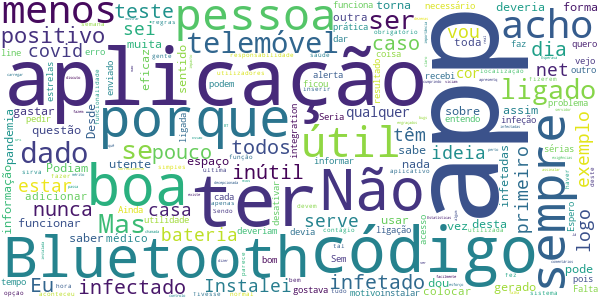

> Boa ideia, mas para funcionar a 100% temos de ter GPS e BT sempre ligados, e existe uma coisa chamada bateria que viciam facilmente depois de algum tempo  :date: __2021-03-19 03:07:52__

> Não discuto o mérito desta app. Mas o que gostava era de saber qual o impacto que ela já teve no controlo da pandemia. Estatísticas sérias sobre a sua real utilidade.  :date: __2021-02-25 08:59:25__

> Desde há semanas que está a mostrar erro de acesso ao servidor: falha a carregar dados de infeção.  :date: __2021-02-20 18:05:03__

> Não entendo porque motivo me serve a aplicação  :date: __2021-02-19 12:55:52__

> Para mim nao não funciona  :date: __2021-02-16 08:28:57__

> Estão sempre a pedir para eu ter a ligada mas não tenho pois se estou m casa para quê ter sempre ligada?....  :date: __2021-02-12 03:17:19__

> Já estive perto de dezenas de pessoas infectadas, e mesmo cumprindo as exigências da APP nunca recebi um alerta. Têm de dar importância à aplicação, todos deveriam ter a APP instalada e todos deveriam assinalar quando positivos, senão é inútil!  :date: __2021-02-09 09:36:14__

> Mais ou menos  :date: __2021-02-07 20:35:21__

> Acho mal k a APP tenha k ter sempre NET para atualizar a APP.  :date: __2021-01-27 16:46:27__

> Misses European countries app integration like the Spanish app which has a integration between each other. How can I monitor my app if I study abroad? There should be just one EU app for all  :date: __2021-01-17 14:22:59__

#### 2-star reviews

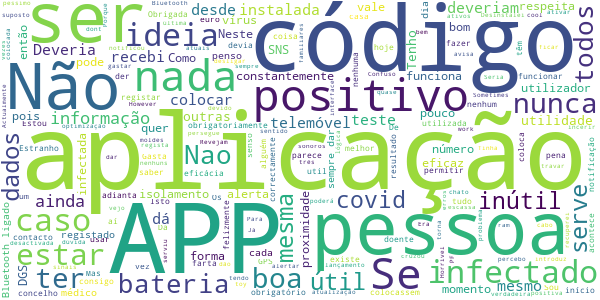

> Dei 2 estrelas porque a ideia é boa, mas é inútil quando quem está infectado só coloca o código se quiser logo não vai funcionar na prática, tenho a app desde do fim do mês de Agosto de 2020 e na prática nunca evitou aquilo que aconteceu em Janeiro 2021. Na pior altura não deu qualquer sinal no entanto soube que tive com pessoas que ficaram infectadas. O uso de GSM e código automático no sistema de saúde do número de telefone do infectado era o mais eficaz a meu ver.  :date: __2021-03-21 16:04:46__

> Nada de especial. Estive em contato com covid positivo e não alertou  :date: __2021-03-18 08:53:37__

> Não cheguei a perceber o que se trata  :date: __2021-03-11 15:26:03__

> O código não é fornecido automaticamente por nenhuma entidade, portanto quem fica doente tem que se lembrar de o pedir nas 2/3 vezes em que fala com alguém. Um bocado inútil, assim.  :date: __2021-03-02 01:39:09__

> Aplicação inútil quando se é das poucas pessoas a utilizá-la... falta de conhecimento sobre o funcionamento da aplicação faz com que as pessoas não a utilizem, porque sentem "a sua privacidade a ser invadida". Apesar de os seus dados estarem a ser partilhados noutras aplicações. A única crítica que tenho a cerca da aplicação é que devia ter uma aba onde mostrasse as restrições actuais o que se pode e o que não se pode fazer.  :date: __2021-02-12 14:24:11__

> Deveria ser a entidade que confirma que a pessoa está infectada a adicionar essa informação à aplicação (automaticamente) e não os utilizadores! Deste modo a aplicação nunca terá benefícios práticos!!!  :date: __2021-02-10 22:18:45__

> Muito ruim  :date: __2021-02-08 21:29:30__

> Nada de especial!  :date: __2021-02-07 15:39:19__

> Nao serve p nada  :date: __2021-02-06 00:55:26__

> Tinha a aplicação instalada desde o início. Desde a última atualização que por três vezes me avisa para ativar Bluetooth e GPS, mesmo tendo os mesmos ativos. Nunca me notificou de nada. Nao vejo verdadeira utilidade na aplicação nos moldes atuais e com estes erros sem sentido. Desinstalei.  :date: __2021-01-30 23:16:52__

#### 1-star reviews

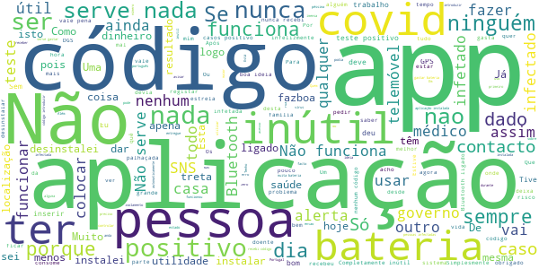

> E muito má está App não está boa porque ela está sempre a pedir a localização. E está a dar cabo da minha bateria por isso o meu voto é 👇🏼 *NÃO*  :date: __2021-03-19 22:16:33__

> Deveria ser o SNS a controlar os dados e por no Sistema  :date: __2021-03-19 22:04:09__

> Não consigo actualizar! Diz q está desatualizado  :date: __2021-03-17 17:03:50__

> Inútil  :date: __2021-03-17 00:19:52__

> Excelente aplicação por parte dos developers. Parabéns. Mas por parte do governo um grande grande grande flop  :date: __2021-03-15 21:10:27__

> Booo  :date: __2021-03-15 13:49:02__

> Nao serve de nada.  :date: __2021-03-15 02:40:16__

> Se a pessoa infectada não colocar o código não serve de nada esta aplicação  :date: __2021-03-14 02:12:51__

> Ninguém declara q esteve infetado. Essa declaracao deveria ser automática.  :date: __2021-03-13 14:45:50__

> As pessoas nao partilham os resultados, po isso nao vale a pena.  :date: __2021-03-12 21:50:35__

# Peso da Régua Cityfy
App version ``1.1``

Analyzed with [covid-apps-observer](http://github.com/covid-apps-observer) project, version ``0.1``

## App overview
| | |
|-------------------------|-------------------------| 
| **Name**&nbsp;&nbsp;&nbsp;&nbsp;&nbsp;&nbsp;&nbsp;&nbsp;&nbsp;&nbsp;&nbsp;&nbsp;&nbsp;&nbsp;&nbsp;&nbsp;&nbsp;&nbsp;&nbsp;&nbsp;&nbsp;&nbsp;&nbsp;&nbsp;&nbsp;&nbsp;&nbsp;&nbsp;&nbsp;&nbsp;&nbsp;&nbsp;&nbsp;&nbsp;&nbsp;&nbsp;&nbsp;&nbsp;&nbsp;&nbsp;  | Peso da Régua Cityfy |
| **Unique identifier** | pt.cmpesoregua.app |
| **Link to Google Play** | [https://play.google.com/store/apps/details?id=pt.cmpesoregua.app](https://play.google.com/store/apps/details?id=pt.cmpesoregua.app) |
| **Summary**  | Peso da Régua Cityfy: uma nova forma de comunicar com os nossos munícipes |
| **Privacy policy** | [http://app.cm-pesoregua.pt/pages/364](http://app.cm-pesoregua.pt/pages/364) |
| **Latest version** | 1.1 |
| **Last update** | 2020-04-06 10:08:17 |
| **Recent changes** | Melhorias de interface. |
| **Installs**  | 100+ |
| **Category** | Turismo e local |
| **First release** | 13 de ago. de 2019 |
| **Size**  | 36M |
| **Supported Android version**  | 4.1 ou superior |

### Description
> Bem-vindo à aplicação Peso da Régua Cityfy do Município do Peso da Régua. 
 Uma nova forma de comunicar com os nossos munícipes e com quem nos visita.
 Nesta aplicação poderá ser informado de alertas municipais e governamentais, acompanhar notícias do concelho, consultar a agenda de eventos, ligar-se à app Visit Peso da Régua, comunicar ocorrências, entre outras.
 Queremos ligar-nos a si!

### User interface
The developers of the app provide the following screenshots in the Google play store.
| | | |
|:-------------------------:|:-------------------------:|:-------------------------:|
 | 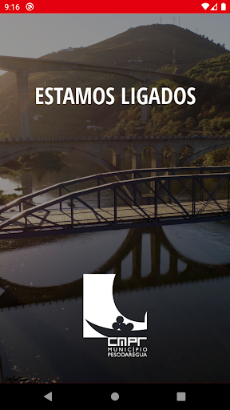  | 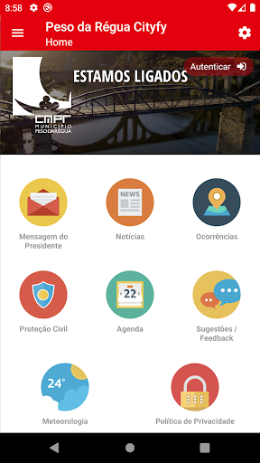  | 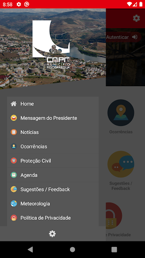  | 
 | 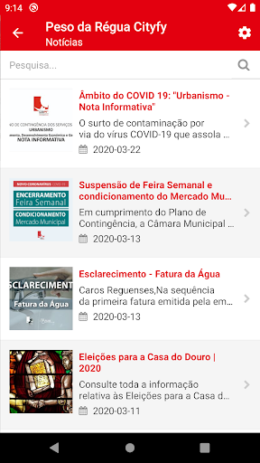  | 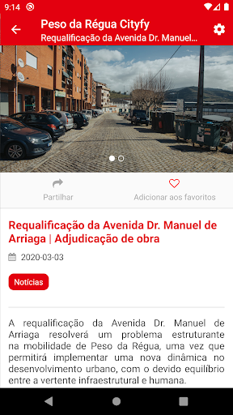  | 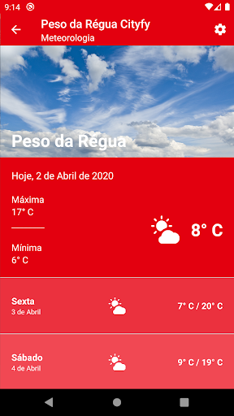  | 

## Development team
In the following we report the main information provided by the development team in the Google play store.

| | |
|-------------------------|-------------------------|
| **Developer**  | Município Peso da Régua |
| **Website**  | [https://www.cm-pesoregua.pt/](https://www.cm-pesoregua.pt/) |
| **Email** | cmregua@cmpr.pt |
| **Physical address**  | - |
| **Other developed apps**  | [https://play.google.com/store/apps/developer?id=Munic%C3%ADpio+Peso+da+R%C3%A9gua](https://play.google.com/store/apps/developer?id=Munic%C3%ADpio+Peso+da+R%C3%A9gua) |

## Android support

| | |
|-------------------------|-------------------------|
| **Declared target Android version**  | Pie, version 9 (API level 28) |
| **Effective target Android version**  | Pie, version 9 (API level 28) |
| **Minimum supported Android version**  | Jelly Bean, version 4.1.x (API level 16) |
| **Maximum target Android version**  | - |

The larger the difference between the minimum and maximum supported Android versions, the better. A larger difference means a wider audience. For example, old phones have a very low Android version, so a high minimum supported Android version means that the app cannot be used by users with old phones, thus leading to accessibility problems. 

## Requested permissions

In the following we report the complete list of the permissions requested by the app. 

| **Permission** | **Protection level** | **Description** | 
|-------------------------|-------------------------|-------------------------|
 **android.permission ACCESS_COARSE_LOCATION** | :warning:**Dangerous** | Allows an app to access approximate location. 
 **android.permission ACCESS_FINE_LOCATION** | :warning:**Dangerous** | Allows an app to access precise location. 
 **android.permission ACCESS_NETWORK_STATE** | Normal | Allows applications to access information about networks. 
 **android.permission BLUETOOTH** | Normal | Allows applications to connect to paired bluetooth devices. 
 **android.permission BLUETOOTH_ADMIN** | Normal | Allows applications to discover and pair bluetooth devices. 
 **android.permission CAMERA** | :warning:**Dangerous** | Required to be able to access the camera device. 
 **android.permission INTERNET** | Normal | Allows applications to open network sockets. 
 **android.permission READ_CONTACTS** | :warning:**Dangerous** | Allows an application to read the user's contacts data. 
 **android.permission READ_PROFILE** | - | - 
 **android.permission RECEIVE_BOOT_COMPLETED** | Normal | Allows an application to receive the Intent.ACTION_BOOT_COMPLETED that is broadcast after the system finishes booting. 
 **android.permission SYSTEM_ALERT_WINDOW** | Signature - preinstalled - appop - pre23 - development | Allows an app to create windows using the type WindowManager.LayoutParams.TYPE_APPLICATION_OVERLAY, shown on top of all other apps. 
 **android.permission VIBRATE** | Normal | Allows access to the vibrator. 
 **android.permission WAKE_LOCK** | Normal | Allows using PowerManager WakeLocks to keep processor from sleeping or screen from dimming. 
 **android.permission WRITE_CONTACTS** | :warning:**Dangerous** | Allows an application to write the user's contacts data. 
 **android.permission WRITE_EXTERNAL_STORAGE** | :warning:**Dangerous** | Allows an application to write to external storage. 
 **com.anddoes.launcher.permission UPDATE_COUNT** | - | - 
 **com.google.android.c2dm.permission RECEIVE** | - | - 
 **com.google.android.finsky.permission BIND_GET_INSTALL_REFERRER_SERVICE** | - | - 
 **com.htc.launcher.permission READ_SETTINGS** | - | - 
 **com.htc.launcher.permission UPDATE_SHORTCUT** | - | - 
 **com.huawei.android.launcher.permission CHANGE_BADGE** | - | - 
 **com.huawei.android.launcher.permission READ_SETTINGS** | - | - 
 **com.huawei.android.launcher.permission WRITE_SETTINGS** | - | - 
 **com.majeur.launcher.permission UPDATE_BADGE** | - | - 
 **com.sec.android.provider.badge.permission READ** | - | - 
 **com.sec.android.provider.badge.permission WRITE** | - | - 
 **com.sonyericsson.home.permission BROADCAST_BADGE** | - | - 
 **com.sonymobile.home.permission PROVIDER_INSERT_BADGE** | - | - 

## Mentioned servers

| **Server** | **Registrant** | **Registrant country** | **Creation date** | 
|-------------------------|-------------------------|-------------------------|-------------------------|
 | android.com | Google LLC | :us: US | 1997-06-23 04:00:00 |
 | googlesyndication.com | Google LLC | :us: US | 2003-01-21 06:17:24 |
 | google.com | Google LLC | :us: US | 1997-09-15 04:00:00 |
 | app-measurement.com | Google LLC | :us: US | 2015-06-19 20:13:31 |
 | altbeacon.org | Radius Networks | :us: US | 2014-07-16 13:30:59 |
 | facebook.com | Facebook, Inc. | :us: US | 1997-03-29 05:00:00 |
 | pinterest.com | DNStination Inc. | :us: US | 2009-11-26 19:21:23 |
 | twitter.com | Twitter, Inc. | :us: US | 2000-01-21 16:28:17 |
 | googleapis.com | Google LLC | :us: US | 2005-01-25 17:52:26 |
 | googleadservices.com | Google LLC | :us: US | 2003-06-19 16:34:53 |

## Security analysis 

Below we report the main security warnings raised by our execution of the [Androwarn](https://github.com/maaaaz/androwarn) security analysis tool.

**Telephony identifiers leakage**
> - This application reads the numeric name (MCC+MNC) of current registered operator 
> - This application reads the operator name 
> - This application reads the phone number string for line 1, for example, the MSISDN for a GSM phone 

**Location lookup**
> - This application reads location information from all available providers (WiFi, GPS etc.) 

**Connection interfaces exfiltration**
> - This application reads details about the currently active data network 
> - This application tries to find out if the currently active data network is metered 

**Suspicious connection establishment**
> - This application opens a Socket and connects it to the remote address '' on the 'N/A' port  
> - This application opens a Socket and connects it to the remote address 'Ljava/lang/StringBuilder;->toString()Ljava/lang/String;' on the ': connect, resolve' port  
> - This application opens a Socket and connects it to the remote address 'Ljava/lang/StringBuilder;->toString()Ljava/lang/String;' on the 'N/A' port  
> - This application opens a Socket and connects it to the remote address 'Ljava/net/Proxy;->type()Ljava/net/Proxy$Type;' on the 'N/A' port  
> - This application opens a Socket and connects it to the remote address 'timeout' on the 'N/A' port  

**Pim data leakage**
> - This application accesses the downloads folder 
> - This application accesses data stored in the clipboard 

**Code execution**
> - This application loads a native library 
> - This application executes a UNIX command containing this argument: '2' 

## User ratings and reviews

Below we provide information about how end users are reacting to the app in terms of ratings and reviews in the Google Play store.

### Ratings

The Peso da Régua Cityfy app has been installed by more than **100** times. At this time, **-** rated the app and its average score is **0.0**. Below we show the distribution of the ratings across the usual star-based rating of Google Play

:star::star::star::star::star:: 0

:star::star::star::star:: 0

:star::star::star:: 0

:star::star:: 0

:star:: 0

### Reviews 

#### 5-star reviews

No recent reviews available with 5 stars.

#### 4-star reviews

No recent reviews available with 4 stars.

#### 3-star reviews

No recent reviews available with 3 stars.

#### 2-star reviews

No recent reviews available with 2 stars.

#### 1-star reviews

> Começou bem mas... estragou-se. Não se consegue ampliar os relatórios diários relativos ao covid o que impossibilita que se consiga ler... Pouca informação de real interesse para a região. App desinteressante e pouco cativante  :date: __2020-06-08 20:56:17__

# Credits

This project makes use of the following main third-party projects:
* Androguard: [https://github.com/androguard/androguard](https://github.com/androguard/androguard)
* Androwarn: [https://github.com/maaaaz/androwarn](https://github.com/maaaaz/androwarn)
* google_play_scraper: [https://github.com/JoMingyu/google-play-scraper](https://github.com/JoMingyu/google-play-scraper)
* whois: [https://github.com/DannyCork/python-whois](https://github.com/DannyCork/python-whois)
* BeautifulSoup: [https://www.crummy.com/software/BeautifulSoup](https://www.crummy.com/software/BeautifulSoup)

Other open-source projects used in this project include: 

- androguard==3.3.5
- appnope==0.1.0
- asn1crypto==1.3.0
- backcall==0.1.0
- beautifulsoup4==4.9.0
- bs4==0.0.1
- certifi==2020.4.5.1
- cffi==1.14.0
- chardet==3.0.4
- click==7.1.2
- colorama==0.4.3
- cryptography==2.9.2
- cycler==0.10.0
- decorator==4.4.2
- future==0.18.2
- google-play-scraper==0.1.1
- idna==2.9
- ipython==7.13.0
- ipython-genutils==0.2.0
- jedi==0.17.0
- Jinja2==2.11.2
- joblib==0.14.1
- kiwisolver==1.2.0
- lxml==4.5.0
- MarkupSafe==1.1.1
- matplotlib==3.2.1
- networkx==2.4
- nltk==3.5
- numpy==1.18.3
- parso==0.7.0
- pexpect==4.8.0
- pickleshare==0.7.5
- Pillow==7.1.2
- play-scraper==0.6.0
- prompt-toolkit==3.0.5
- ptyprocess==0.6.0
- pycountry==19.8.18
- pycparser==2.20
- pydot==1.4.1
- Pygments==2.6.1
- pyOpenSSL==19.1.0
- pyparsing==2.4.7
- python-dateutil==2.8.1
- regex==2020.4.4
- requests==2.23.0
- requests-futures==1.0.0
- six==1.14.0
- soupsieve==2.0
- tld==0.12.1
- tqdm==4.45.0
- traitlets==4.3.3
- urllib3==1.25.9
- wcwidth==0.1.9
- wordcloud==1.7.0

