# COVID-related Android apps in Portugal

Author: `Ivano Malavolta` (ivanomalavolta@gmail.com)

Created at: `2021/7/23`

Report generated by the [covid-apps-observer](http://github.com/covid-apps-observer) project, version 0.1

# Table of contents 

- [Background](#background)
    * [Data sources and analyses](#data-sources-and-analyses)
        * [App metadata](#app-metadata)
        * [Requested permissions](#requested-permissions)
        * [Mentioned servers](#mentioned_servers)
        * [Security analysis](#security_analysis)
        * [User ratings and reviews](#user-ratings-and-reviews)
    * [Disclaimer](#disclaimer)
- [WHO Info](#who-info)
- [MySNS](#mysns)
- [OpenWHO: Conhecimento para Emergências em Saúde](#openwho-conhecimento-para-emergências-em-saúde)
- [STAYAWAY COVID](#stayaway-covid)
- [Peso da Régua Cityfy](#peso-da-régua-cityfy)
- [Passe Covid](#passe-covid)

- [Credits](#credits)

# How to read this report

This report has been generated by the [covid-apps-observer](http://github.com/covid-apps-observer) project. The project automatically analyzes the apps by extracting information which is already publicly available either on the web or in the apps binary files. 

Our analysis covers the following apps:
| | |
|-------------------------|-------------------------| 
|  | WHO Info
|  | MySNS
|  | OpenWHO: Conhecimento para Emergências em Saúde
|  | STAYAWAY COVID
|  | Peso da Régua Cityfy
|  | Passe Covid

The details of our analysis are presented in the remainder of this report.

For independent verification, the raw data and the source code of the project is publicly available in its GitHub repository [http://github.com/covid-apps-observer](http://github.com/covid-apps-observer) and its source code has been thoroughly commented in order to provide all the details about how the information provided in this report has been extracted. 

Any feedback, questions, and improvements about the project are very welcome, feel free to create an issue or pull request directly in its GitHub repository: [http://github.com/covid-apps-observer](http://github.com/covid-apps-observer).

## Data sources and analyses

The analysis of each app is structured around five main dimensions: 
* App metadata  
* Requested permissions
* Mentioned servers
* Androwarn analysis
* User ratings and reviews

In the following we describe the data sources and analysis performed for each dimension.

### App metadata

App metadata includes an overview of the main information about the app (for example, its name, releases, privacy policy, etc.), contact information of the development team, and the various Android versions supported by the app. This information is extracted from two main data sources:
* _Google Play store_: we automatically mined the web page of the Google Play store showing the basic information about the app and we parsed it in order to extract information about the app and development team 
* _Android Manifest file_: in our analysis we decompiled the binary file of the app (it is similar to a Zip archive but it contains the code of the app instead of normal files) and we extracted information about the supported Android versions, as it has been listed by its development team.

The extracted app metadata feeds the _App overview_, _Development team_, and _Android support_ sections of this report.
We make use of the [google-play-scraper](https://github.com/JoMingyu/google-play-scraper) tool for extracting the raw data related to this dimension of the project.

### Requested permissions

The Android operating system has a permission model which allows users to grant access to potentially privacy-related information. Every Android app has to explictly declare the permissions it needs to properly function in the Android Manifest file.  

In this report we also show the protection level of each permission, which is a key information for understanding how the requested permissions related to the user's privacy. We carefully analyzed the [official Android documentation (v. 29)](https://developer.android.com/reference/android/Manifest.permission), and it resulted that a permission requested by an Android app can belong to the following protection levels:
* **Dangerous**: higher-risk permissions that would give a requesting app access to private user data or control over the device that can negatively impact the user. Because this type of permission introduces potential risk, the system usually does not automatically grant it to the requesting app. For example, any dangerous permissions requested by an app may be displayed to the user and require confirmation before proceeding.
* **Normal**: this is the default and most common level in Android; normal permissions are lower-risk and give access to isolated app-level features, with minimal risk to other apps, the system, or the user. 
* **Signature**: permissions granted only if the requesting app is signed with the same certificate as the app that declared the permission
* **Appop**: old permission level, a reminiscence of the App Ops tool that Google introduced in Android 4.3.
* **Development**: optional permissions which can be granted to development-oriented apps.
* **Privileged**: permissions who give higher power to mobile apps w.r.t. other apps, such as binding to incoming calls, interacting via bluetooth with other devices without user interaction, etc.
* **Preinstalled**: reserved only for preinstalled apps
* **Installer**: allow the holder to start the permission usage screen for an app
* **RetailDemo**: permissions related to devices used in demonstrations in shops.
* **Pre23**: permissions automatically granted to apps targeting devices running pre-6.0 Android.
* **Upcoming**: permissions which will be released in the next version of the Android platform. 
* **Deprecated**: permissions belonging to old releases of the Android platform, they should not be used by developers since they will not be supported in the near future.
* **Not for use by third-party applications**: permissions which can be requested only by apps developed by Google.
* **Undefined**: this protection level is not documented by Google.

The permissions dimension of this project is based on the [Androguard](https://github.com/androguard/androguard) static analysis tool.

### Mentioned servers

We decompiled each app in order to look for all possible mentions of remote URLs. The mentioned URLs can refer to remote servers the the app is using for either sending or receiving information, web addresses for directing the user to an information website, and so on. 

:warning: It is important to note that this analysis is not meant to be complete and it is very prone to obfuscation. The servers reported here are simply _mentioned_ somewhere in the code of the app and are meant to just give an indication about the "hooks" of the app towards external resources. For example, for an Android app it is normal to contact Google services in order to send/receive push notifications, or to contact the servers of analytics services for having real-time diagnostics about crashes of the app or bugs.

This part of the analysis is based on the [Androguard](https://github.com/androguard/androguard) static analysis tool for identfying the raw URLs mentioned in the app; then, the information about each mentioned server is collected by performing a _whois_ lookup on the first-level domain present in the URL.

### Security analysis

This dimension is based on the [Androwarn](https://github.com/maaaaz/androwarn) structural and data flow analysis of Android bytecode. Androwarn is developed by the University of Lyon/INSA (France) and it has been used in several academic studies. According to its documentation, Androwarn targets the following categories of potential security issues:
* **Telephony identifiers exfiltration**: IMEI, IMSI, MCC, MNC, LAC, CID, operator's name, etc.
* **Device settings exfiltration**: software version, usage statistics, system settings, logs, etc.
* **Geolocation information leakage**: GPS/WiFi geolocation, etc.
* **Connection interfaces information exfiltration**: WiFi credentials, Bluetooth MAC adress, etc.
* **Telephony services abuse**: premium SMS sending, phone call composition, etc.
* **Audio/video flow interception**: call recording, video capture, etc.
* **Remote connection establishment**: socket open call, Bluetooth pairing, APN settings edit, etc.
* **PIM data leakage**: contacts, calendar, SMS, mails, clipboard, etc.
* **External memory operations**: file access on SD card, etc.
* **PIM data modification**: add/delete contacts, calendar events, etc.
* **Arbitrary code execution**: native code using JNI, UNIX command, privilege escalation, etc.
* **Denial of Service**: event notification deactivation, file deletion, process killing, virtual keyboard disable, terminal shutdown/reboot, etc.

Note: We do not consider this data point in the current version of our analyzers since it is too verbose for our purposes.

:warning: It is important to note that Androwarn is a static analysis tool, and as such it performs a variety of heuristics and approximations in its analyses. Said that, the results shown in this report are meant to provide an indication of _potential_ security issues and should be by no means treated as complete and correct.   

### User ratings and reviews

For this dimension we turn again to the web interface of the Google Play store. Firstly, we automatically mine summary statistics about user ratings from the web page of the app under analysis; then, we automatically download the newest 1000 reviews of the app under analysis. For each level of rating (5 stars, 4 stars, , etc., 1 star) we show:
- a word cloud presenting the main terms used by end users in their reviews in the Google Play store
- the last 10 reviews provided by app users in the Google Play store. 

This purposefully simple analysis is meant to help both future users and the development team of the app in understanding what are the main positive and negative points of the app under analysis.

We make use of the [google-play-scraper](https://github.com/JoMingyu/google-play-scraper) tool for extracting the raw data related to this dimension of the project.

## Disclaimer 

This report has been produced independently of any parties and its only objective is to help anybody in better understanding how COVID-related apps work in practice (and compare to each other). The results of this report are limited to the specific version of the software used for running the analyses and on the various heuristics implemented in there. In other words, the results of the analyzers may differ depending on the time and modalities in which they are executed. We do not guarantee that the results of the analyses and the corresponding contents of this report are fully complete or correct. The analysis software is licensed under the [MIT License](https://github.com/iivanoo/covid-apps-observer/blob/master/LICENSE).

# WHO Info
App version ``4.1.0``

Analyzed with [covid-apps-observer](http://github.com/covid-apps-observer) project, version ``0.1``

## App overview
| | |
|-------------------------|-------------------------| 
| **Name**&nbsp;&nbsp;&nbsp;&nbsp;&nbsp;&nbsp;&nbsp;&nbsp;&nbsp;&nbsp;&nbsp;&nbsp;&nbsp;&nbsp;&nbsp;&nbsp;&nbsp;&nbsp;&nbsp;&nbsp;&nbsp;&nbsp;&nbsp;&nbsp;&nbsp;&nbsp;&nbsp;&nbsp;&nbsp;&nbsp;&nbsp;&nbsp;&nbsp;&nbsp;&nbsp;&nbsp;&nbsp;&nbsp;&nbsp;&nbsp;  | WHO Info |
| **Unique identifier** | org.who.infoapp |
| **Link to Google Play** | [https://play.google.com/store/apps/details?id=org.who.infoapp](https://play.google.com/store/apps/details?id=org.who.infoapp) |
| **Summary**  | O aplicativo oficial de informações da Organização Mundial da Saúde. |
| **Privacy policy** | [https://www.who.int/about/who-we-are/privacy-policy](https://www.who.int/about/who-we-are/privacy-policy) |
| **Latest version** | 4.1.0 |
| **Last update** | 2021-01-14 10:10:28 |
| **Recent changes** | This release introduces &quot;Health Topics&quot;. &quot;Health Topics&quot; provide additional information about favourite health topics. |
| **Installs**  | 500.000+ |
| **Category** | Notícias e revistas |
| **First release** | 13 de abr. de 2020 |
| **Size**  | 12M |
| **Supported Android version**  | 4.2 ou superior |

### Description
> Have the latest health information at your fingertips with the official World Health Organization Information App. This app displays the latest news, events, features and breaking updates on outbreaks. 
  
 WHO works worldwide to promote health, keep the world safe, and serve the vulnerable. 
 Our goal is to ensure that a billion more people have universal health coverage, to protect a billion more people from health emergencies, and provide a further billion people with better health and well-being.

### User interface
The developers of the app provide the following screenshots in the Google play store.
| | | |
|:-------------------------:|:-------------------------:|:-------------------------:|
 |   |   |   | 
 |   |   |   | 
 |   |   |   | 
 |   |   |   | 
 |   |   |   | 
 |   |   |   | 
 |   |   |   | 
 |   |   |   | 

## Development team
In the following we report the main information provided by the development team in the Google play store.

| | |
|-------------------------|-------------------------|
| **Developer**  | World Health Organization |
| **Website**  | [https://www.who.int/](https://www.who.int/) |
| **Email** | dcx@who.int |
| **Physical address**  | [Avenu Appia 20 1211 Geneva Switzerland](https://www.google.com/maps/search/Avenu%20Appia%2020%201211%20Geneva%20Switzerland) (Google Maps) |
| **Other developed apps**  | [https://play.google.com/store/apps/developer?id=World+Health+Organization](https://play.google.com/store/apps/developer?id=World+Health+Organization) |

## Android support

| | |
|-------------------------|-------------------------|
| **Declared target Android version**  | - |
| **Effective target Android version**  | - |
| **Minimum supported Android version**  | Jelly Bean, version 4.2.x (API level 17) |
| **Maximum target Android version**  | - |

The larger the difference between the minimum and maximum supported Android versions, the better. A larger difference means a wider audience. For example, old phones have a very low Android version, so a high minimum supported Android version means that the app cannot be used by users with old phones, thus leading to accessibility problems. 

## Requested permissions

In the following we report the complete list of the permissions requested by the app. 

| **Permission** | **Protection level** | **Description** | 
|-------------------------|-------------------------|-------------------------|
 **android.permission ACCESS_NETWORK_STATE** | Normal | Allows applications to access information about networks. 
 **android.permission INTERNET** | Normal | Allows applications to open network sockets. 
 **android.permission READ_CALENDAR** | :warning:**Dangerous** | Allows an application to read the user's calendar data. 
 **android.permission READ_EXTERNAL_STORAGE** | :warning:**Dangerous** | Allows an application to read from external storage. 
 **android.permission WAKE_LOCK** | Normal | Allows using PowerManager WakeLocks to keep processor from sleeping or screen from dimming. 
 **android.permission WRITE_CALENDAR** | :warning:**Dangerous** | Allows an application to write the user's calendar data. 
 **android.permission WRITE_EXTERNAL_STORAGE** | :warning:**Dangerous** | Allows an application to write to external storage. 
 **com.google.android.c2dm.permission RECEIVE** | - | - 
 **com.google.android.finsky.permission BIND_GET_INSTALL_REFERRER_SERVICE** | - | - 

## Mentioned servers

| **Server** | **Registrant** | **Registrant country** | **Creation date** | 
|-------------------------|-------------------------|-------------------------|-------------------------|
 | adobe.com | Adobe Inc. | :us: US | 1986-11-17 05:00:00 |
 | googlesyndication.com | Google LLC | :us: US | 2003-01-21 06:17:24 |
 | google.com | Google LLC | :us: US | 1997-09-15 04:00:00 |
 | app-measurement.com | Google LLC | :us: US | 2015-06-19 20:13:31 |
 | googleapis.com | Google LLC | :us: US | 2005-01-25 17:52:26 |
 | googleadservices.com | Google LLC | :us: US | 2003-06-19 16:34:53 |

## Security analysis 

Below we report the main security warnings raised by our execution of the [Androwarn](https://github.com/maaaaz/androwarn) security analysis tool.

**Connection interfaces exfiltration**
> - This application reads details about the currently active data network 
> - This application tries to find out if the currently active data network is metered 

**Suspicious connection establishment**
> - This application opens a Socket and connects it to the remote address 'Lfi/iki/elonen/NanoHTTPD$ResponseException;' on the 'N/A' port  
> - This application opens a Socket and connects it to the remote address 'NanoHttpd Shutdown' on the 'N/A' port  

**Code execution**
> - This application loads a native library: 'NativeScript' 
> - This application executes a UNIX command containing this argument: '2' 

## User ratings and reviews

Below we provide information about how end users are reacting to the app in terms of ratings and reviews in the Google Play store.

### Ratings

The WHO Info app has been installed by more than **500000** times. At this time, **1114** rated the app and its average score is **4.108108**. Below we show the distribution of the ratings across the usual star-based rating of Google Play

:star::star::star::star::star:: 754

:star::star::star::star:: 90

:star::star::star:: 60

:star::star:: 60

:star:: 150

### Reviews 

#### 5-star reviews

> Gostava de ter este pograma ensina me.  :date: __2020-09-18 20:17:25__

> É melhor aplicativo.  :date: __2020-05-28 19:51:54__

> NICE  :date: __2020-05-26 16:25:12__

> Para melhor informacoes  :date: __2020-05-10 16:31:41__

#### 4-star reviews

> Nao consigo olhar a do Paraná e não consigo traduzir para o Português  :date: __2020-06-14 14:18:24__

#### 3-star reviews

> Em português  :date: __2020-07-01 10:18:15__

#### 2-star reviews

No recent reviews available with 2 stars.

#### 1-star reviews

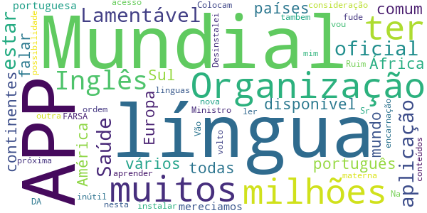

> Lamentável!!! A aplicação oficial da Organização Mundial da Saúde não estar disponível em todas as línguas do mundo, eu como português e muitos milhões em países em vários continentes como Europa, África, América do Sul, que temos em comum falar a língua portuguesa, somos muitos milhões e mereciamos mais consideração e ter a possibilidade de ler e ter acesso aos conteúdos nesta APP , na nossa língua materna.  :date: __2021-02-21 11:29:25__

> Colocam outra linguas tambem  :date: __2020-11-12 06:36:18__

> Vão se fude com esse app e sua nova ordem mundial ORGANIZAÇÃO MUNDIAL DA FARSA  :date: __2020-10-16 00:51:53__

> Inglês, Sr Ministro ??????.?  :date: __2020-09-01 11:01:09__

> Na próxima encarnação vou aprender inglês, depois volto a instalar a APP. Desinstalei, inútil para mim.  :date: __2020-08-05 17:04:59__

> Ruim  :date: __2020-07-29 23:21:44__

# MySNS
App version ``1.7.0``

Analyzed with [covid-apps-observer](http://github.com/covid-apps-observer) project, version ``0.1``

## App overview
| | |
|-------------------------|-------------------------| 
| **Name**&nbsp;&nbsp;&nbsp;&nbsp;&nbsp;&nbsp;&nbsp;&nbsp;&nbsp;&nbsp;&nbsp;&nbsp;&nbsp;&nbsp;&nbsp;&nbsp;&nbsp;&nbsp;&nbsp;&nbsp;&nbsp;&nbsp;&nbsp;&nbsp;&nbsp;&nbsp;&nbsp;&nbsp;&nbsp;&nbsp;&nbsp;&nbsp;&nbsp;&nbsp;&nbsp;&nbsp;&nbsp;&nbsp;&nbsp;&nbsp;  | MySNS |
| **Unique identifier** | pt.min_saude.spms.mysns |
| **Link to Google Play** | [https://play.google.com/store/apps/details?id=pt.min_saude.spms.mysns](https://play.google.com/store/apps/details?id=pt.min_saude.spms.mysns) |
| **Summary**  | Aplicação oficial do Serviço Nacional de Saúde com informação para o cidadão. |
| **Privacy policy** | [https://www.sns.gov.pt/home/notas-legais-portal-sns-2/](https://www.sns.gov.pt/home/notas-legais-portal-sns-2/) |
| **Latest version** | 1.7.0 |
| **Last update** | 2021-06-02 18:59:30 |
| **Recent changes** | - Saiba onde marcar as suas consultas de Saúde Oral! - Melhorias gráficas; - Melhorias gerais de usabilidade da aplicação; - Algumas correcções; |
| **Installs**  | 100.000+ |
| **Category** | Saúde e fitness |
| **First release** | 14 de set. de 2016 |
| **Size**  | 8,2M |
| **Supported Android version**  | 6.0 ou superior |

### Description
> Numa perspetiva de aumentar a proximidade junto do utente e a transparência dos serviços prestados foi desenvolvido o novo Portal do SNS. A App MySNS é uma aplicação oficial do Serviço Nacional de Saúde e é a ligação móvel a este portal e aos serviços digitais da saúde.
 O MySNS é uma ferramenta que permite consultar notícias do Serviço Nacional de Saúde, consultar informação de saúde, disponibilizar uma lista e mapa instituições de saúde (Hospitais, Cuidados de Saúde Primários e Farmácias), avaliação da qualidade e satisfação do SNS pelos cidadão, e consulta de informação da Linha Saúde 24, além disso irá receber notificações tais como alertas de calor, etc, associadas à sua localização.

### User interface
The developers of the app provide the following screenshots in the Google play store.
| | | |
|:-------------------------:|:-------------------------:|:-------------------------:|
 |   |   | 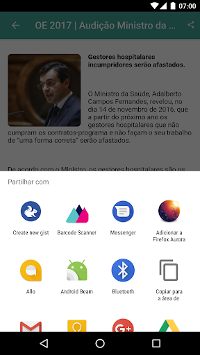  | 
 |  

## Development team
In the following we report the main information provided by the development team in the Google play store.

| | |
|-------------------------|-------------------------|
| **Developer**  | SPMS - Serviços Partilhados do Ministério da Saúde |
| **Website**  | [https://sns.gov.pt](https://sns.gov.pt) |
| **Email** | atendimento@sns24.gov.pt |
| **Physical address**  | - |
| **Other developed apps**  | [https://play.google.com/store/apps/developer?id=SPMS+-+Servi%C3%A7os+Partilhados+do+Minist%C3%A9rio+da+Sa%C3%BAde](https://play.google.com/store/apps/developer?id=SPMS+-+Servi%C3%A7os+Partilhados+do+Minist%C3%A9rio+da+Sa%C3%BAde) |

## Android support

| | |
|-------------------------|-------------------------|
| **Declared target Android version**  | Lollipop, version 5.1 (API level 22) |
| **Effective target Android version**  | Lollipop, version 5.1 (API level 22) |
| **Minimum supported Android version**  | KitKat, version 4.4 - 4.4.4 (API level 19) |
| **Maximum target Android version**  | - |

The larger the difference between the minimum and maximum supported Android versions, the better. A larger difference means a wider audience. For example, old phones have a very low Android version, so a high minimum supported Android version means that the app cannot be used by users with old phones, thus leading to accessibility problems. 

## Requested permissions

In the following we report the complete list of the permissions requested by the app. 

| **Permission** | **Protection level** | **Description** | 
|-------------------------|-------------------------|-------------------------|
 **android.permission ACCESS_COARSE_LOCATION** | :warning:**Dangerous** | Allows an app to access approximate location. 
 **android.permission ACCESS_FINE_LOCATION** | :warning:**Dangerous** | Allows an app to access precise location. 
 **android.permission ACCESS_NETWORK_STATE** | Normal | Allows applications to access information about networks. 
 **android.permission INTERNET** | Normal | Allows applications to open network sockets. 
 **android.permission READ_APP_BADGE** | - | - 
 **android.permission REQUEST_INSTALL_PACKAGES** | Signature | Allows an application to request installing packages. 
 **android.permission VIBRATE** | Normal | Allows access to the vibrator. 
 **android.permission WAKE_LOCK** | Normal | Allows using PowerManager WakeLocks to keep processor from sleeping or screen from dimming. 
 **android.permission WRITE_EXTERNAL_STORAGE** | :warning:**Dangerous** | Allows an application to write to external storage. 
 **com.anddoes.launcher.permission UPDATE_COUNT** | - | - 
 **com.google.android.c2dm.permission RECEIVE** | - | - 
 **com.htc.launcher.permission READ_SETTINGS** | - | - 
 **com.htc.launcher.permission UPDATE_SHORTCUT** | - | - 
 **com.huawei.android.launcher.permission CHANGE_BADGE** | - | - 
 **com.huawei.android.launcher.permission READ_SETTINGS** | - | - 
 **com.huawei.android.launcher.permission WRITE_SETTINGS** | - | - 
 **com.majeur.launcher.permission UPDATE_BADGE** | - | - 
 **com.oppo.launcher.permission READ_SETTINGS** | - | - 
 **com.oppo.launcher.permission WRITE_SETTINGS** | - | - 
 **com.sec.android.provider.badge.permission READ** | - | - 
 **com.sec.android.provider.badge.permission WRITE** | - | - 
 **com.sonyericsson.home.permission BROADCAST_BADGE** | - | - 
 **com.sonymobile.home.permission PROVIDER_INSERT_BADGE** | - | - 
 **pt.min_saude.spms.mysns.permission C2D_MESSAGE** | - | - 
 **pt.min_saude.spms.mysns.permission PushHandlerActivity** | - | - 

## Mentioned servers

| **Server** | **Registrant** | **Registrant country** | **Creation date** | 
|-------------------------|-------------------------|-------------------------|-------------------------|
 | google.com | Google LLC | :us: US | 1997-09-15 04:00:00 |
 | hockeyapp.net | Microsoft Corporation | :us: US | 2011-01-23 18:46:43 |
 | gstatic.com | Google LLC | :us: US | 2008-02-11 15:31:25 |
 | whatsapp.com | WhatsApp LLC | :us: US | 2008-09-04 12:39:12 |
 | here.com | HERE Global B.V. | :netherlands: NL | 1995-06-11 04:00:00 |
 | googleapis.com | Google LLC | :us: US | 2005-01-25 17:52:26 |

## Security analysis 

Below we report the main security warnings raised by our execution of the [Androwarn](https://github.com/maaaaz/androwarn) security analysis tool.

**Telephony identifiers leakage**
> - This application reads the device phone type value 

**Connection interfaces exfiltration**
> - This application reads details about the currently active data network 
> - This application tries to find out if the currently active data network is metered 

**Telephony services abuse**
> - This application makes phone calls 

**Suspicious connection establishment**
> - This application opens a Socket and connects it to the remote address '10' on the 'N/A' port  
> - This application opens a Socket and connects it to the remote address '3' on the 'N/A' port  
> - This application opens a Socket and connects it to the remote address 'Ljava/net/Proxy;->type()Ljava/net/Proxy$Type;' on the 'N/A' port  
> - This application opens a Socket and connects it to the remote address 'timeout' on the 'N/A' port  

**Code execution**
> - This application loads a native library: 'sqlc-native-driver' 
> - This application loads a native library: 'tbxml' 
> - This application executes a UNIX command containing this argument: '7' 

## User ratings and reviews

Below we provide information about how end users are reacting to the app in terms of ratings and reviews in the Google Play store.

### Ratings

The MySNS app has been installed by more than **100000** times. At this time, **1760** rated the app and its average score is **3.0568182**. Below we show the distribution of the ratings across the usual star-based rating of Google Play

:star::star::star::star::star:: 660

:star::star::star::star:: 220

:star::star::star:: 110

:star::star:: 100

:star:: 670

### Reviews 

#### 5-star reviews

> Gostava de activar o certificado como ja levei as vacinas O  :date: __2021-07-12 17:36:14__

> Tudo ok ! Até conta as vacinas que já tomou antes!  :date: __2021-07-12 17:25:29__

> Tenho pouca experiência, mas estou a gostar e vai-me útil  :date: __2021-07-12 16:47:06__

> Estou satisfeito  :date: __2021-07-10 15:06:18__

> Muito bom  :date: __2021-07-08 22:40:04__

> Ok.  :date: __2021-07-07 14:42:14__

> Boa ambiente na app  :date: __2021-07-02 19:30:43__

> Excelente  :date: __2021-07-01 18:02:48__

> Lenta na sua abertura, e de pouca utilidade. Não serve para consultar nada a não ser o número da saúde 24. Certamente o nome não corresponde à app. O que esperava era inserir o meu número de utente e ter acesso à informação médica pessoal.  :date: __2021-06-30 12:53:01__

> Funciona bem e é bastante útil .  :date: __2021-06-28 21:17:51__

#### 4-star reviews

> SNS24  :date: __2021-07-06 19:54:43__

> Muito completa e rápida.  :date: __2021-07-04 15:22:16__

> Bom  :date: __2021-06-24 17:20:04__

> Bom  :date: __2021-04-01 12:35:51__

> Nenhuma  :date: __2021-03-18 11:03:27__

> Boa  :date: __2021-02-04 12:01:31__

> A APP não corre com Android 10. como posso fazer para poder utilizar no meu tlm?  :date: __2021-01-26 07:57:32__

> Boa, muito boa  :date: __2021-01-06 10:55:27__

> Confusa  :date: __2020-12-14 15:54:31__

> Razoável  :date: __2020-12-08 11:57:07__

#### 3-star reviews

> Opcional  :date: __2021-07-21 22:12:07__

> Ainda tenho muitas dúvidas...  :date: __2021-07-19 22:39:37__

> O programa falha muitas vezes a leitura da impressão digital o que é necessário para mostrar o certificado covid etc.  :date: __2021-07-12 22:13:25__

> Caros informáticos... pessoalmente gostava mais da APP antiga ou seja a anterior a esta. Possivelmente esta seja mais rápida, mais técnica, não sei, só sei que a antiga a meu ver era mais intuitiva. Convém dizer que faz o que é pretendido mas estruturalmente acho a outra melhor, mais simples. Terei que me adaptar lógico mas é a minha opinião em relação á alteração. Cumprimentos P.S- o cartão ADSE não aparece? Algum defeito na APP?! É possível resolver a questão do cartão ADSE?  :date: __2021-06-30 22:43:22__

> Quero saber o boletim de vacinas do meu filho que não tem número de telemóvel ainda. Não consigo. Não aceita o meu número nem o da mãe, porque já estão registados. Não aceita 0000 porque não é possível. E agora?  :date: __2021-06-27 16:01:05__

> Ajustes necessários! A app é feia visualmente e praticamente. Não encontrei forma de iniciar secção na app. As apps MySNS Carteira e MySNS Tempos pode muito bem ser integrado a app MySNS o que faria uma maior simplicidade e unifornidade. Enfim certas apps do governo podiam ser mais simples, uniformes e fáceis de usar, ou seja, TODAS AS APPS RELACIONADAS AO SNS NO RAIO DE UMA APP SÓ, É ASSIM TÃO DIFÍCIL DE IMAGINAR???  :date: __2021-06-26 04:09:10__

> Nao consigo fazer certeficado Europeu de vacinas  :date: __2021-06-24 21:26:03__

> Muito útil  :date: __2021-05-09 16:54:25__

> Ao tentar utilizar pela primeira vez deu mensagem: mysns falhou  :date: __2021-04-23 13:39:55__

> Parece-me que tudo o que é possível fazer nesta app é também possível fazer através do site do SNS. Não vejo vantagem da app em relação ao site. Aliás, algumas das "funções" da app funcionam por reencaminhamento para o site.  :date: __2021-04-16 21:41:18__

#### 2-star reviews

> É prática mas não funciona a 100% numas funciona ,noutras não,e para se obter o certificado digital da covid 19 está diferente dos outros países da união europeia, não aparece com o símbolo da união europeia.  :date: __2021-07-15 18:16:40__

> Levei a 2a dose da vacina, Pfizer a 31 de maio de 2021. (Há 37 dias) Desde o dia 14 de junho, que tento obter Certificado Digital de Vacinação. Após introduzir dados solicitados,(data nascimento e número de Utente) ao Submeter, aparece a mensagem Aplicacional: "os dados não são válidos ou ainda não é possível obter o certificado"  :date: __2021-07-08 23:03:02__

> Não entendo a alteração. A mySnsCarteira funcionava sem ser necessário validar tudo vezes sem conta, agora está escondida lá no meio e falta informação. Não gosto.  :date: __2021-06-29 18:57:52__

> Instalei a app para ter acesso as minhas receitas e fiquei perdido...  :date: __2021-06-23 13:09:00__

> Depois de instalar a aplicação e de uma enorme perda de tempo não consigo aceder à receita médica qual é a utilidade desta aplicação  :date: __2021-06-13 22:47:50__

> Funcionou durante algum tempo mudei de telefone e inexplicavelmente deixou de funcionar. Enquanto Funcionou reparei que era muito complicada e pouco amigável para o utilizador no entanto com maior ou menor dificuldade sempre servia. Agora não consigo utilizar.  :date: __2021-05-18 23:11:57__

> Sinceramente não compreendo que esta APP não seja compatível com o SO Android mais recente. Há vontade de acompanhar a evolução o que facilita a vida a toda a gente. Mas ela não estando em conformidade vou desinstalá-la.  :date: __2021-05-08 21:34:07__

> Não existe opção de acesso pelo facto de o SNS não estar atualizado relativamente ao software a utilizar.  :date: __2021-05-03 16:02:37__

> Funciona muito mal e não tem os registos das minhas doenças crónicas  :date: __2021-04-12 16:19:02__

> Está sempre a parar de funcionar. Era bom actualizar esta app.  :date: __2021-03-12 12:33:48__

#### 1-star reviews

> Não percebo. Que aconteceu às receitas? Como saber quantas caixas são? Pela repetição do medicamento? Aparece o número de embalagens? Onde? E já não se recebem as receitas por email? Não percebo. A app foi alterada? Parece diferente. Antes não tinha estas dúvidas.  :date: __2021-07-19 23:31:20__

> Darei melhor classificação quando a aplicação me permitir entrar(fazer logg um) aparentemente não podemos mudar de número de telemóvel, diz que o meu número está errado, quando inclusive para a vacinação covid19 é este número que consta para o meu número de utente, tenho sido contactado por este número...!!!  :date: __2021-07-19 11:31:32__

> Funciona mas para chegar até á data de nascimento é um massacre e mais não digo...  :date: __2021-07-17 21:34:32__

> Completamente inutil  :date: __2021-07-16 11:17:32__

> Sinceramente não consigo perceber a utilidade desta aplicação....  :date: __2021-07-14 23:12:10__

> Ao apagarem a APP Mysns carteira pioraram a aplicação SNS24. Na parte dos acessos à APP no tlm e muito pior nas receitas. E a falha de não se saber (as farmácias sabem) quantas embalagens já foi aviadas e o prazo de validade não foi resolvida. Melhorem não estraguem...  :date: __2021-07-13 19:56:53__

> Puro lixo...  :date: __2021-07-11 23:38:12__

> Horrível  :date: __2021-07-10 11:33:57__

> Para que fazer uma app se apenas o que faz e nos redireccionar para o website? Inútil, complicada, sem design...  :date: __2021-07-08 22:15:13__

> Fraquinha, N S  :date: __2021-07-08 21:16:43__

# OpenWHO: Conhecimento para Emergências em Saúde
App version ``3.7``

Analyzed with [covid-apps-observer](http://github.com/covid-apps-observer) project, version ``0.1``

## App overview
| | |
|-------------------------|-------------------------| 
| **Name**&nbsp;&nbsp;&nbsp;&nbsp;&nbsp;&nbsp;&nbsp;&nbsp;&nbsp;&nbsp;&nbsp;&nbsp;&nbsp;&nbsp;&nbsp;&nbsp;&nbsp;&nbsp;&nbsp;&nbsp;&nbsp;&nbsp;&nbsp;&nbsp;&nbsp;&nbsp;&nbsp;&nbsp;&nbsp;&nbsp;&nbsp;&nbsp;&nbsp;&nbsp;&nbsp;&nbsp;&nbsp;&nbsp;&nbsp;&nbsp;  | OpenWHO: Conhecimento para Emergências em Saúde |
| **Unique identifier** | de.xikolo.openwho |
| **Link to Google Play** | [https://play.google.com/store/apps/details?id=de.xikolo.openwho](https://play.google.com/store/apps/details?id=de.xikolo.openwho) |
| **Summary**  | Conhecimento para Emergências em Saúde |
| **Privacy policy** | [https://openwho.org/pages/privacy](https://openwho.org/pages/privacy) |
| **Latest version** | 3.7 |
| **Last update** | 2020-11-23 13:57:15 |
| **Recent changes** | - Bug fixes and performance improvements |
| **Installs**  | 1.000.000+ |
| **Category** | Educação |
| **First release** | 17 de mai. de 2017 |
| **Size**  | 18M |
| **Supported Android version**  | 5.0 ou superior |

### Description
> A OpenWHO é a plataforma interativa de transferência de conhecimento da Organização Mundial de Saúde (OMS) que oferece cursos online para melhorar a resposta a emergências em saúde. A OpenWHO permite que a Organização e os seus principais parceiros transfiram conhecimento capaz de salvar vidas às equipas de resposta na linha da frente.
 Com a OpenWHO, terá a flexibilidade de aprender ao seu próprio ritmo. Assista a curtas palestras em vídeo e teste o seu conhecimento através de autotestes quando e onde quiser. O fórum do curso e o espaço de colaboração permite-lhe comunicar com outros participantes e especialistas em todo o mundo.
 Concebido sobretudo para profissionais de saúde, equipas de resposta na linha da frente e decisores, a app é também uma fonte de informação para aqueles afetados por surtos de doenças e emergências em saúde, ou para aqueles com interesse geral no trabalho da OMS em emergências em saúde. 
 A aplicação possui 6 canais: 
 - canal Epidemias aborda a gestão de doenças infeciosas e fornece informação científica capaz de salvar vidas.
 - canal Pronto para responder ajuda a  preparar o pessoal que se encontra em formação para trabalhar em surtos de doenças e emergências sanitárias.
 - canal Social foca-se nas intervenções com base nas ciências sociais e ajuda na comunicação com comunidades afetadas.  
 - canal Preparação para Pandemias reúne cursos sobre vários aspetos da preparação, incluindo vigilância, medidas de saúde pública e comunicação de risco durante uma pandemia. 
 - canal COVID-19 fornece recursos de aprendizagem nas 6 línguas oficiais da OMS (árabe, chinês, espanhol, francês, inglês e russo) para profissionais de saúde, decisores e o público em geral sobre o surto da doença do coronavírus (COVID-19). 
 - canal de COVID-19 Idiomas Nacionais fornece os mesmos recursos de aprendizagem que o canal COVID-19, mas em idiomas nacionais, tais como Indonésio, Japonês e Português. 
 Os cursos da OpenWHO estão disponíveis em diversas línguas, incluindo as 6 línguas oficiais da OMS. 
 Faça o download da app e junte-se à comunidade da OpenWHO.
 Esta app é desenvolvida em cooperação entre o Instituto Hasso Plattner e a OMS. O conteúdo de aprendizagem é fornecido exclusivamente pela OMS.

### User interface
The developers of the app provide the following screenshots in the Google play store.
| | | |
|:-------------------------:|:-------------------------:|:-------------------------:|
 |   |   |   | 
 |   | 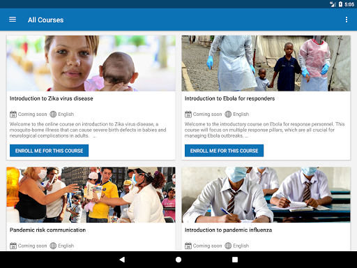  |   | 

## Development team
In the following we report the main information provided by the development team in the Google play store.

| | |
|-------------------------|-------------------------|
| **Developer**  | HPI Knowledge Engineering Team |
| **Website**  | [https://openwho.org/](https://openwho.org/) |
| **Email** | openwho-support@hpi.de |
| **Physical address**  | [Prof.-Dr.-Helmert-Str.2-3 14482 Potsdam](https://www.google.com/maps/search/Prof.-Dr.-Helmert-Str.2-3%2014482%20Potsdam) (Google Maps) |
| **Other developed apps**  | [https://play.google.com/store/apps/developer?id=7185448023325736337](https://play.google.com/store/apps/developer?id=7185448023325736337) |

## Android support

| | |
|-------------------------|-------------------------|
| **Declared target Android version**  | - |
| **Effective target Android version**  | - |
| **Minimum supported Android version**  | Lollipop, version 5.0 (API level 21) |
| **Maximum target Android version**  | - |

The larger the difference between the minimum and maximum supported Android versions, the better. A larger difference means a wider audience. For example, old phones have a very low Android version, so a high minimum supported Android version means that the app cannot be used by users with old phones, thus leading to accessibility problems. 

## Requested permissions

In the following we report the complete list of the permissions requested by the app. 

| **Permission** | **Protection level** | **Description** | 
|-------------------------|-------------------------|-------------------------|
 **android.permission ACCESS_NETWORK_STATE** | Normal | Allows applications to access information about networks. 
 **android.permission ACCESS_WIFI_STATE** | Normal | Allows applications to access information about Wi-Fi networks. 
 **android.permission DOWNLOAD_WITHOUT_NOTIFICATION** | - | - 
 **android.permission FOREGROUND_SERVICE** | Normal | Allows a regular application to use Service.startForeground. 
 **android.permission INTERNET** | Normal | Allows applications to open network sockets. 
 **android.permission RECEIVE_BOOT_COMPLETED** | Normal | Allows an application to receive the Intent.ACTION_BOOT_COMPLETED that is broadcast after the system finishes booting. 
 **android.permission WAKE_LOCK** | Normal | Allows using PowerManager WakeLocks to keep processor from sleeping or screen from dimming. 
 **android.permission WRITE_EXTERNAL_STORAGE** | :warning:**Dangerous** | Allows an application to write to external storage. 
 **com.google.android.c2dm.permission RECEIVE** | - | - 
 **com.google.android.finsky.permission BIND_GET_INSTALL_REFERRER_SERVICE** | - | - 

## Mentioned servers

| **Server** | **Registrant** | **Registrant country** | **Creation date** | 
|-------------------------|-------------------------|-------------------------|-------------------------|
 | googlesyndication.com | Google LLC | :us: US | 2003-01-21 06:17:24 |
 | google.com | Google LLC | :us: US | 1997-09-15 04:00:00 |
 | apple.com | Apple Inc. | :us: US | 1987-02-19 05:00:00 |
 | aomedia.org | Contact Privacy Inc. Customer 1243324949 | :canada: CA | 2015-08-24 14:07:31 |
 | dashif.org | VTM Group | :us: US | 2012-04-27 13:02:46 |
 | app-measurement.com | Google LLC | :us: US | 2015-06-19 20:13:31 |
 | w3.org | W3C | :us: US | 1994-07-06 04:00:00 |
 | googleapis.com | Google LLC | :us: US | 2005-01-25 17:52:26 |
 | psdev.de | - | - | - |
 | xmlpull.org | WhoisGuard, Inc. | PA | 2001-11-26 20:33:08 |
 | crashlytics.com | Google LLC | :us: US | 2011-01-21 15:30:40 |
 | apache.org | The Apache Software Foundation | :us: US | 1995-04-11 04:00:00 |
 | opensource.org | Open Source Initiative | :us: US | 1998-02-11 05:00:00 |
 | creativecommons.org | Creative Commons Corporation | :canada: CA | 2001-01-15 16:51:44 |
 | eclipse.org | Eclipse.org Foundation, Inc. | :canada: CA | 1997-04-14 04:00:00 |
 | gnu.org | Free Software Foundation | :us: US | 1995-11-24 05:00:00 |
 | mozilla.org | Mozilla Corporation | :us: US | 1998-01-24 05:00:00 |
 | googleadservices.com | Google LLC | :us: US | 2003-06-19 16:34:53 |

## Security analysis 

Below we report the main security warnings raised by our execution of the [Androwarn](https://github.com/maaaaz/androwarn) security analysis tool.

**Telephony identifiers leakage**
> - This application reads the ISO country code equivalent of the current registered operator's MCC (Mobile Country Code) 
> - This application reads the MCC+MNC of the provider of the SIM 

**Connection interfaces exfiltration**
> - This application reads details about the currently active data network 
> - This application tries to find out if the currently active data network is metered 

**Suspicious connection establishment**
> - This application opens a Socket and connects it to the remote address ' returned no addresses for  ; port is out of range' on the 'N/A' port  
> - This application opens a Socket and connects it to the remote address '' on the 'N/A' port  
> - This application opens a Socket and connects it to the remote address 'Ljava/lang/StringBuilder;->toString()Ljava/lang/String;' on the 'N/A' port  
> - This application opens a Socket and connects it to the remote address 'Ljava/net/Proxy;->type()Ljava/net/Proxy$Type;' on the 'N/A' port  
> - This application opens a Socket and connects it to the remote address 'timeout' on the 'N/A' port  

**Code execution**
> - This application loads a native library 

## User ratings and reviews

Below we provide information about how end users are reacting to the app in terms of ratings and reviews in the Google Play store.

### Ratings

The OpenWHO: Conhecimento para Emergências em Saúde app has been installed by more than **1000000** times. At this time, **3403** rated the app and its average score is **4.2647057**. Below we show the distribution of the ratings across the usual star-based rating of Google Play

:star::star::star::star::star:: 2403

:star::star::star::star:: 370

:star::star::star:: 130

:star::star:: 130

:star:: 370

### Reviews 

#### 5-star reviews

> Ótimo!  :date: __2020-08-18 16:10:09__

> Ajuda a saude de todos gostei😏😏  :date: __2020-05-16 21:46:48__

> Aprendam a falar e a escrever INGLÊS. É mais útil que Funk!  :date: __2020-05-03 15:00:54__

> Boa  :date: __2020-04-06 08:22:43__

> Só em engles ruim  :date: __2020-03-17 03:56:56__

#### 4-star reviews

> Coronavirus  :date: __2020-05-27 13:53:07__

> Uma pena não ser em português.  :date: __2018-01-18 01:21:10__

#### 3-star reviews

> Caro amigo Pedro Paiva nem não todos tem a oportunidades de aprender outras línguas, e mesmo concordando que aprender inglês e muito melhor que esse estilo de música a ONU Organizações das Nações Unidades deveria ter App oficial em outros idiomas!  :date: __2020-05-19 02:36:13__

#### 2-star reviews

No recent reviews available with 2 stars.

#### 1-star reviews

> boloceia aplicativo  :date: __2020-10-31 16:14:42__

> Como uma Organização mundial não dispor mais idiomas?  :date: __2020-04-09 17:28:57__

> Isso è um lixo tente melhorar  :date: __2020-04-02 09:30:07__

# STAYAWAY COVID
App version ``1.1.4``

Analyzed with [covid-apps-observer](http://github.com/covid-apps-observer) project, version ``0.1``

## App overview
| | |
|-------------------------|-------------------------| 
| **Name**&nbsp;&nbsp;&nbsp;&nbsp;&nbsp;&nbsp;&nbsp;&nbsp;&nbsp;&nbsp;&nbsp;&nbsp;&nbsp;&nbsp;&nbsp;&nbsp;&nbsp;&nbsp;&nbsp;&nbsp;&nbsp;&nbsp;&nbsp;&nbsp;&nbsp;&nbsp;&nbsp;&nbsp;&nbsp;&nbsp;&nbsp;&nbsp;&nbsp;&nbsp;&nbsp;&nbsp;&nbsp;&nbsp;&nbsp;&nbsp;  | STAYAWAY COVID |
| **Unique identifier** | fct.inesctec.stayaway |
| **Link to Google Play** | [https://play.google.com/store/apps/details?id=fct.inesctec.stayaway](https://play.google.com/store/apps/details?id=fct.inesctec.stayaway) |
| **Summary**  | A aplicação oficial de notificação de exposição à COVID-19 em Portugal. |
| **Privacy policy** | [https://stayawaycovid.pt/politica-de-privacidade](https://stayawaycovid.pt/politica-de-privacidade) |
| **Latest version** | 1.1.4 |
| **Last update** | 2021-07-05 19:45:45 |
| **Recent changes** | - Atualização de certificado - Correção de erros - Correção de bugs |
| **Installs**  | 1.000.000+ |
| **Category** | Saúde e fitness |
| **First release** | 13 de ago. de 2020 |
| **Size**  | 58M |
| **Supported Android version**  | 6.0 ou superior |

### Description
> STAYAWAY COVID é a aplicação oficial de notificação de exposição à COVID-19 em Portugal. É uma aplicação para telemóveis que tem como objetivo auxiliar o país no rastreio da COVID-19. A aplicação permite, de forma simples e segura, que cada um de nós seja informado sobre exposições de risco à doença, através da monitorização de contactos recentes. A aplicação é de utilização voluntária e gratuita e, em momento algum, tem acesso à sua identidade ou dados pessoais.
 Uma vez instalada a aplicação, o telemóvel anuncia a sua presença a todos os dispositivos próximos usando identificadores aleatórios que não revelam identidades pessoais. A informação partilhada entre dispositivos permite à STAYAWAY COVID saber de que telemóveis esteve perto, quão perto e por quanto tempo. A Organização Mundial de Saúde sugere que, contactos a menos de 2 metros e por mais de 15 minutos com alguém portador de COVID-19 sejam considerados com elevado risco de contágio.
 1. Ausência de registo de elevado risco de contágio
 Não registando contactos de proximidade com elevado risco de contágio com alguém a quem foi diagnosticada COVID-19, a aplicação informa-nos exatamente disso com a data da última avaliação.
 2. Alerta de elevado risco de contágio
 Se alguém de quem estivemos perigosamente próximo nos últimos 14 dias for diagnosticado com COVID-19 e informar o sistema STAYAWAY COVID, a aplicação alerta-nos de imediato do risco sugerindo que nos isolemos e contactemos a Linha SNS 24 (808 24 24 24).
 3. Após diagnóstico de COVID-19
 No caso de contrairmos COVID-19, com o diagnóstico receberemos um código numérico que nos permitirá, anonimamente e através da aplicação, informar o sistema STAYAWAY COVID. É este ato que permite ao sistema alertar segura e atempadamente todos aqueles que podemos ter contagiado, mesmo antes de terem tido qualquer sintoma. Não é nunca revelada a ninguém a identidade de ninguém.
 A aplicação STAYAWAY COVID foi desenvolvida pelo INESC TEC, ISPUP, Keyruptive e Ubirider para a DGS / Ministério da Saúde.

### User interface
The developers of the app provide the following screenshots in the Google play store.
| | | |
|:-------------------------:|:-------------------------:|:-------------------------:|
 |   |   |   | 
 |   |  

## Development team
In the following we report the main information provided by the development team in the Google play store.

| | |
|-------------------------|-------------------------|
| **Developer**  | FCT FCCN |
| **Website**  | [https://stayawaycovid.pt/](https://stayawaycovid.pt/) |
| **Email** | stayaway@inesctec.pt |
| **Physical address**  | - |
| **Other developed apps**  | [https://play.google.com/store/apps/developer?id=FCT+FCCN](https://play.google.com/store/apps/developer?id=FCT+FCCN) |

## Android support

| | |
|-------------------------|-------------------------|
| **Declared target Android version**  | - |
| **Effective target Android version**  | - |
| **Minimum supported Android version**  | Marshmallow, version 6.0 (API level 23) |
| **Maximum target Android version**  | - |

The larger the difference between the minimum and maximum supported Android versions, the better. A larger difference means a wider audience. For example, old phones have a very low Android version, so a high minimum supported Android version means that the app cannot be used by users with old phones, thus leading to accessibility problems. 

## Requested permissions

In the following we report the complete list of the permissions requested by the app. 

| **Permission** | **Protection level** | **Description** | 
|-------------------------|-------------------------|-------------------------|
 **android.permission ACCESS_NETWORK_STATE** | Normal | Allows applications to access information about networks. 
 **android.permission BLUETOOTH** | Normal | Allows applications to connect to paired bluetooth devices. 
 **android.permission FOREGROUND_SERVICE** | Normal | Allows a regular application to use Service.startForeground. 
 **android.permission INTERNET** | Normal | Allows applications to open network sockets. 
 **android.permission RECEIVE_BOOT_COMPLETED** | Normal | Allows an application to receive the Intent.ACTION_BOOT_COMPLETED that is broadcast after the system finishes booting. 
 **android.permission REQUEST_IGNORE_BATTERY_OPTIMIZATIONS** | Normal | Permission an application must hold in order to use Settings.ACTION_REQUEST_IGNORE_BATTERY_OPTIMIZATIONS. 
 **android.permission WAKE_LOCK** | Normal | Allows using PowerManager WakeLocks to keep processor from sleeping or screen from dimming. 

## Mentioned servers

| **Server** | **Registrant** | **Registrant country** | **Creation date** | 
|-------------------------|-------------------------|-------------------------|-------------------------|
 | android.com | Google LLC | :us: US | 1997-06-23 04:00:00 |
 | google.com | Google LLC | :us: US | 1997-09-15 04:00:00 |
 | ietf.org | IETF Trust | :us: US | 1995-03-11 05:00:00 |

## Security analysis 

Below we report the main security warnings raised by our execution of the [Androwarn](https://github.com/maaaaz/androwarn) security analysis tool.

**Connection interfaces exfiltration**
> - This application reads details about the currently active data network 
> - This application tries to find out if the currently active data network is metered 

**Suspicious connection establishment**
> - This application opens a Socket and connects it to the remote address '' on the 'N/A' port  
> - This application opens a Socket and connects it to the remote address 'Ljava/lang/StringBuilder;->toString()Ljava/lang/String;' on the ': connect, resolve' port  
> - This application opens a Socket and connects it to the remote address 'Ljava/lang/StringBuilder;->toString()Ljava/lang/String;' on the 'N/A' port  
> - This application opens a Socket and connects it to the remote address 'Ljava/net/Proxy;->type()Ljava/net/Proxy$Type;' on the 'N/A' port  
> - This application opens a Socket and connects it to the remote address 'timeout' on the 'N/A' port  

**Pim data leakage**
> - This application accesses data stored in the clipboard 

**Code execution**
> - This application loads a native library 
> - This application executes a UNIX command 

## User ratings and reviews

Below we provide information about how end users are reacting to the app in terms of ratings and reviews in the Google Play store.

### Ratings

The STAYAWAY COVID app has been installed by more than **1000000** times. At this time, **9735** rated the app and its average score is **2.5967414**. Below we show the distribution of the ratings across the usual star-based rating of Google Play

:star::star::star::star::star:: 3004

:star::star::star::star:: 654

:star::star::star:: 555

:star::star:: 456

:star:: 5066

### Reviews 

#### 5-star reviews

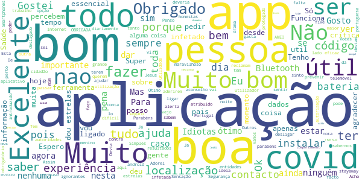

> so para falar aos ignorantes que nao percebem o porquê de precisar de localização e Internet ( sem Internet é a mesma coisa que nao ter saldo , não pode fazer chamadas) , sem localização o telemóvel não tem como saber se está perto ou não de uma pessoa com covid, e para os que dizem que nunca deu alerta nenhum sintam se sortudos de ate hoje ainda não terem tido contacto com uma pessoa infetada , para acabar a aplicação nao advinha quem está infetado , tem de ser o mesmo infetado a informar.  :date: __2021-07-16 01:23:16__

> Excelente  :date: __2021-07-15 10:46:33__

> Para estar mais conforto  :date: __2021-07-14 08:46:36__

> Gosto de ver quase todos os dias  :date: __2021-07-13 15:34:47__

> App inútil. Quantas pessoas é que já foram infetadas e que foram honestas a ponto de incerirem o código que fora atribuído?  :date: __2021-07-12 19:11:21__

> 🇵🇹  :date: __2021-07-12 09:34:00__

> Importante  :date: __2021-07-07 17:58:41__

> Não tenho certezas absolutas mas faço experiência, obrigado  :date: __2021-07-06 20:00:27__

> Devia ter funcionado...  :date: __2021-07-06 15:25:05__

> Esteja sempre protegido.  :date: __2021-07-01 22:02:37__

#### 4-star reviews

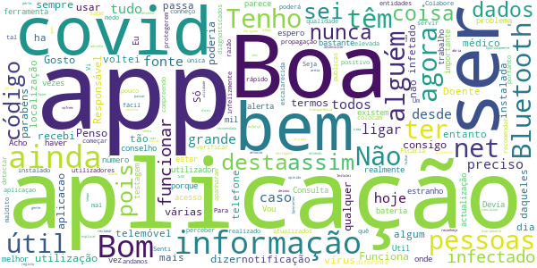

> Para já não sei estou a começar.  :date: __2021-07-01 13:22:55__

> A APP é boa mas como a APP sabe que temos covid ?  :date: __2021-05-28 23:02:05__

> Gosto desta aplicaçao. Funciona bem e assim andamos sempre atualizados.  :date: __2021-04-29 15:05:31__

> Boa  :date: __2021-04-22 23:42:13__

> Senti que foi realizado muito rápido.Ficaria instalado?Vi verificar  :date: __2021-04-13 01:20:55__

> Um App de elevada qualidade e de fácil utilização. A única informação que poderá servir os utilizadores a protegerem-se da Covid-19 em termos de propagação. Seja Responsável! Colabore com as entidades públicas.  :date: __2021-04-10 22:36:04__

> Ainda não consigo perceber como os diagnosticados positivo não colocam o código na App. Têm medo do quê?  :date: __2021-04-01 22:10:31__

> Bom  :date: __2021-03-23 01:31:54__

> Boa  :date: __2021-02-25 21:57:08__

> Penso que poderia ser um pouco diferente, tal como detectar mesmo o covid , parabéns pela app.  :date: __2021-02-10 10:39:34__

#### 3-star reviews

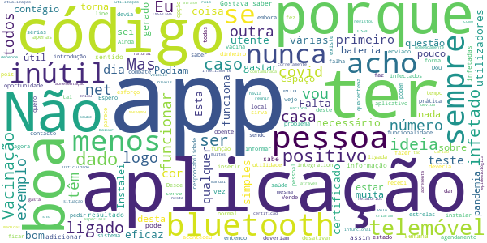

> Dificuldade em baixar  :date: __2021-07-22 09:20:19__

> Gostava de saber porque raio o estado gasta recursos e dinheiro, quando as coisas são tão simples. Esta aplicação nunca teve a utilização devida por várias falhas nomeadamente a manual introdução dos códigos, mas havia agora uma oportunidade de a por a funcionar sendo ela o veículo para a apresentação do certificado de vacinação, mas não criaram mais uma app inútil e infuncional e uma outra que embora seja para outra coisa também apresenta o certificado. Esta era a App natural para o certificad  :date: __2021-07-08 09:38:18__

> Não acho eficaz porque estive em contacto com muitos doentes com covid e não registou  :date: __2021-06-17 21:56:00__

> Pelo esforço de quem a criou... Infelizmente a introdução e atualização dos dados ou não existe ou tem atraso de várias semanas  :date: __2021-06-15 20:34:42__

> A ideia é boa, mas não funciona corretamente, depende muito dos utilizadores  :date: __2021-06-13 00:54:03__

> Não tenho como ficar a saber se é mesmo necessário mas é muito bom á tempos soube que que uma pessoa estava contaminada através da aplicação  :date: __2021-06-02 21:16:52__

> Falta reunir nesta mesma app, mais dados como: número utente sns e cartão europeu de saúde, relatórios da situação epidemiológica nacional e local, medidas especiais por niveis de combate por local, números nacionais de doses de vacinas administradas, agendamento pessoal da vacinação, agendamento e resultados de testes de despistagem, períodos de quarentena, número de dias imune após Contágio ou Vacinação, Declaraçao Pessoal de Recusa de Vacinação, Certificado Digital Verde de Vacinação  :date: __2021-05-27 01:56:51__

> Esperava mais comentários engraçados 😔  :date: __2021-04-27 01:08:27__

> Nao tenho nada a dizer  :date: __2021-04-15 12:08:27__

> A app não esta a funcionar correctamente podem ver o que se passa  :date: __2021-04-13 13:11:29__

#### 2-star reviews

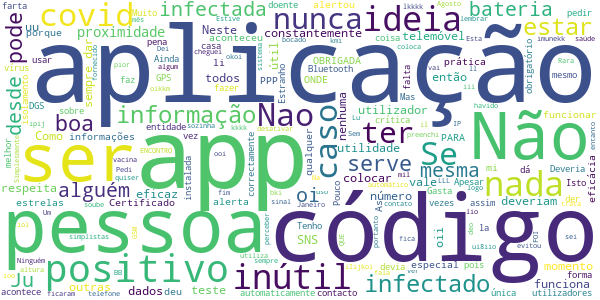

> Ninguém utiliza  :date: __2021-07-22 10:57:20__

> Pedi o Certificado de vacina e preenchi os dados... PARA ONDE FOI O CERTIFICADO QUE NAO ENCONTRO...OBRIGADA  :date: __2021-07-16 19:37:46__

> Não sei para que serve ter esse app, nunca me deu algum alerta ou informação que tenha havido alguém nas proximidades com covid.  :date: __2021-07-04 17:56:16__

> Oi k ll l oi Lu ipij o oii iIijkoi li lio oi i foi um kmi uu LLL ui8iio uu Ju mi i deo kkkk iol oii Ju i il bki Ju oii BB ioo Ju PPP oi i lkkkk um iii okoi u uu imunekk PPP oikkm mil mi i IP ooi  :date: __2021-05-28 19:18:44__

> Esta aplicação está sempre a desativar sozinha  :date: __2021-05-03 10:26:46__

> Sem eficácia. Simplesmente não funciona. As informações são muito simplistas.  :date: __2021-04-21 19:03:27__

> Inútil  :date: __2021-04-06 13:39:53__

> Rara  :date: __2021-03-29 07:40:11__

> Dei 2 estrelas porque a ideia é boa, mas é inútil quando quem está infectado só coloca o código se quiser logo não vai funcionar na prática, tenho a app desde do fim do mês de Agosto de 2020 e na prática nunca evitou aquilo que aconteceu em Janeiro 2021. Na pior altura não deu qualquer sinal no entanto soube que tive com pessoas que ficaram infectadas. O uso de GSM e código automático no sistema de saúde do número de telefone do infectado era o mais eficaz a meu ver.  :date: __2021-03-21 16:04:46__

> Nada de especial. Estive em contato com covid positivo e não alertou  :date: __2021-03-18 08:53:37__

#### 1-star reviews

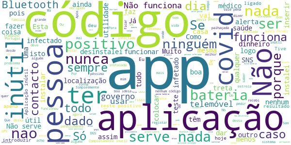

> Horrível  :date: __2021-07-21 11:08:36__

> Apareceu me que teve em contacto com um caso positivo ainda bem que era só o telemóvel e não eu  :date: __2021-07-19 18:31:51__

> Vamos ver se os governantes se responsabilizam pelo quantia absurda gasta nesta app inútil  :date: __2021-07-18 20:04:01__

> Desnecessário totalmente  :date: __2021-07-15 12:52:46__

> Desinstalei porque a app realmente não tem utilidade. Acho incrível que com uma pontuação de 2.6 na Play Stores, quem criou esta APP, não se preocupe em fazer chegar a opinião dos utilizadores, aos patrocinadores da mesma para tentarem perceber o que podem mudar. App criada e logo abandonada! Só para preencher espaço e dizerem que disponibilizam esta nulidade...  :date: __2021-07-15 01:49:08__

> Se toda a gente do país tivesse está aplicação, e se os dados fossem mais rápidos, pois só 24h depois de a pessoa apanhar covid é que aparece o aviso. Isso torna a aplicação praticamente inútil. Eu ainda acho estúpido as pessoas que dão boas notas a está aplicação, dizerem que o problema é estar com a localização ativada, e que se fosse outras redes sociais não iria importar. Que ignorância e comparações idiotas 😒  :date: __2021-07-10 22:28:28__

> Sem utilidade nenhuma. Um engodo validado pelo governo. Nunca está bem, requer o uso completo de todos os recursos de um smartphone, drenando energia, sem que funcione ou traga algo. Uma aplicação que requer a honestidade e boa vontade dos outros usuários. Quem teve ou tem covid ainda tem muito receio de dizer que teve. Quem tem, fica em isolamento, por isso para detectar teria de estar a infringir esse isolamento. E se já está a infringir, de certeza que não tem vontade em por na aplicação  :date: __2021-07-10 16:20:40__

> Inutil  :date: __2021-07-10 13:32:46__

> Não funciona  :date: __2021-07-09 18:43:55__

> Esta aplicação é INÚTIL. Se permitisse o tratamento do certificado digital, possivelmente mereceria 2*. Vou desinstalar esta inutilidade que tem valor zero.  :date: __2021-07-09 11:24:37__

# Peso da Régua Cityfy
App version ``1.1``

Analyzed with [covid-apps-observer](http://github.com/covid-apps-observer) project, version ``0.1``

## App overview
| | |
|-------------------------|-------------------------| 
| **Name**&nbsp;&nbsp;&nbsp;&nbsp;&nbsp;&nbsp;&nbsp;&nbsp;&nbsp;&nbsp;&nbsp;&nbsp;&nbsp;&nbsp;&nbsp;&nbsp;&nbsp;&nbsp;&nbsp;&nbsp;&nbsp;&nbsp;&nbsp;&nbsp;&nbsp;&nbsp;&nbsp;&nbsp;&nbsp;&nbsp;&nbsp;&nbsp;&nbsp;&nbsp;&nbsp;&nbsp;&nbsp;&nbsp;&nbsp;&nbsp;  | Peso da Régua Cityfy |
| **Unique identifier** | pt.cmpesoregua.app |
| **Link to Google Play** | [https://play.google.com/store/apps/details?id=pt.cmpesoregua.app](https://play.google.com/store/apps/details?id=pt.cmpesoregua.app) |
| **Summary**  | Peso da Régua Cityfy: uma nova forma de comunicar com os nossos munícipes |
| **Privacy policy** | [http://app.cm-pesoregua.pt/pages/364](http://app.cm-pesoregua.pt/pages/364) |
| **Latest version** | 1.1 |
| **Last update** | 2020-04-06 10:08:17 |
| **Recent changes** | Melhorias de interface. |
| **Installs**  | 100+ |
| **Category** | Turismo e local |
| **First release** | 13 de ago. de 2019 |
| **Size**  | 36M |
| **Supported Android version**  | 4.1 ou superior |

### Description
> Bem-vindo à aplicação Peso da Régua Cityfy do Município do Peso da Régua. 
 Uma nova forma de comunicar com os nossos munícipes e com quem nos visita.
 Nesta aplicação poderá ser informado de alertas municipais e governamentais, acompanhar notícias do concelho, consultar a agenda de eventos, ligar-se à app Visit Peso da Régua, comunicar ocorrências, entre outras.
 Queremos ligar-nos a si!

### User interface
The developers of the app provide the following screenshots in the Google play store.
| | | |
|:-------------------------:|:-------------------------:|:-------------------------:|
 |   |   |   | 
 |   |   |   | 

## Development team
In the following we report the main information provided by the development team in the Google play store.

| | |
|-------------------------|-------------------------|
| **Developer**  | Município Peso da Régua |
| **Website**  | [https://www.cm-pesoregua.pt/](https://www.cm-pesoregua.pt/) |
| **Email** | cmregua@cmpr.pt |
| **Physical address**  | - |
| **Other developed apps**  | [https://play.google.com/store/apps/developer?id=Munic%C3%ADpio+Peso+da+R%C3%A9gua](https://play.google.com/store/apps/developer?id=Munic%C3%ADpio+Peso+da+R%C3%A9gua) |

## Android support

| | |
|-------------------------|-------------------------|
| **Declared target Android version**  | Pie, version 9 (API level 28) |
| **Effective target Android version**  | Pie, version 9 (API level 28) |
| **Minimum supported Android version**  | Jelly Bean, version 4.1.x (API level 16) |
| **Maximum target Android version**  | - |

The larger the difference between the minimum and maximum supported Android versions, the better. A larger difference means a wider audience. For example, old phones have a very low Android version, so a high minimum supported Android version means that the app cannot be used by users with old phones, thus leading to accessibility problems. 

## Requested permissions

In the following we report the complete list of the permissions requested by the app. 

| **Permission** | **Protection level** | **Description** | 
|-------------------------|-------------------------|-------------------------|
 **android.permission ACCESS_COARSE_LOCATION** | :warning:**Dangerous** | Allows an app to access approximate location. 
 **android.permission ACCESS_FINE_LOCATION** | :warning:**Dangerous** | Allows an app to access precise location. 
 **android.permission ACCESS_NETWORK_STATE** | Normal | Allows applications to access information about networks. 
 **android.permission BLUETOOTH** | Normal | Allows applications to connect to paired bluetooth devices. 
 **android.permission BLUETOOTH_ADMIN** | Normal | Allows applications to discover and pair bluetooth devices. 
 **android.permission CAMERA** | :warning:**Dangerous** | Required to be able to access the camera device. 
 **android.permission INTERNET** | Normal | Allows applications to open network sockets. 
 **android.permission READ_CONTACTS** | :warning:**Dangerous** | Allows an application to read the user's contacts data. 
 **android.permission READ_PROFILE** | - | - 
 **android.permission RECEIVE_BOOT_COMPLETED** | Normal | Allows an application to receive the Intent.ACTION_BOOT_COMPLETED that is broadcast after the system finishes booting. 
 **android.permission SYSTEM_ALERT_WINDOW** | Signature - preinstalled - appop - pre23 - development | Allows an app to create windows using the type WindowManager.LayoutParams.TYPE_APPLICATION_OVERLAY, shown on top of all other apps. 
 **android.permission VIBRATE** | Normal | Allows access to the vibrator. 
 **android.permission WAKE_LOCK** | Normal | Allows using PowerManager WakeLocks to keep processor from sleeping or screen from dimming. 
 **android.permission WRITE_CONTACTS** | :warning:**Dangerous** | Allows an application to write the user's contacts data. 
 **android.permission WRITE_EXTERNAL_STORAGE** | :warning:**Dangerous** | Allows an application to write to external storage. 
 **com.anddoes.launcher.permission UPDATE_COUNT** | - | - 
 **com.google.android.c2dm.permission RECEIVE** | - | - 
 **com.google.android.finsky.permission BIND_GET_INSTALL_REFERRER_SERVICE** | - | - 
 **com.htc.launcher.permission READ_SETTINGS** | - | - 
 **com.htc.launcher.permission UPDATE_SHORTCUT** | - | - 
 **com.huawei.android.launcher.permission CHANGE_BADGE** | - | - 
 **com.huawei.android.launcher.permission READ_SETTINGS** | - | - 
 **com.huawei.android.launcher.permission WRITE_SETTINGS** | - | - 
 **com.majeur.launcher.permission UPDATE_BADGE** | - | - 
 **com.sec.android.provider.badge.permission READ** | - | - 
 **com.sec.android.provider.badge.permission WRITE** | - | - 
 **com.sonyericsson.home.permission BROADCAST_BADGE** | - | - 
 **com.sonymobile.home.permission PROVIDER_INSERT_BADGE** | - | - 

## Mentioned servers

| **Server** | **Registrant** | **Registrant country** | **Creation date** | 
|-------------------------|-------------------------|-------------------------|-------------------------|
 | android.com | Google LLC | :us: US | 1997-06-23 04:00:00 |
 | googlesyndication.com | Google LLC | :us: US | 2003-01-21 06:17:24 |
 | google.com | Google LLC | :us: US | 1997-09-15 04:00:00 |
 | app-measurement.com | Google LLC | :us: US | 2015-06-19 20:13:31 |
 | altbeacon.org | Radius Networks | :us: US | 2014-07-16 13:30:59 |
 | facebook.com | Facebook, Inc. | :us: US | 1997-03-29 05:00:00 |
 | pinterest.com | DNStination Inc. | :us: US | 2009-11-26 19:21:23 |
 | twitter.com | Twitter, Inc. | :us: US | 2000-01-21 16:28:17 |
 | googleapis.com | Google LLC | :us: US | 2005-01-25 17:52:26 |
 | googleadservices.com | Google LLC | :us: US | 2003-06-19 16:34:53 |

## Security analysis 

Below we report the main security warnings raised by our execution of the [Androwarn](https://github.com/maaaaz/androwarn) security analysis tool.

**Telephony identifiers leakage**
> - This application reads the numeric name (MCC+MNC) of current registered operator 
> - This application reads the operator name 
> - This application reads the phone number string for line 1, for example, the MSISDN for a GSM phone 

**Location lookup**
> - This application reads location information from all available providers (WiFi, GPS etc.) 

**Connection interfaces exfiltration**
> - This application reads details about the currently active data network 
> - This application tries to find out if the currently active data network is metered 

**Suspicious connection establishment**
> - This application opens a Socket and connects it to the remote address '' on the 'N/A' port  
> - This application opens a Socket and connects it to the remote address 'Ljava/lang/StringBuilder;->toString()Ljava/lang/String;' on the ': connect, resolve' port  
> - This application opens a Socket and connects it to the remote address 'Ljava/lang/StringBuilder;->toString()Ljava/lang/String;' on the 'N/A' port  
> - This application opens a Socket and connects it to the remote address 'Ljava/net/Proxy;->type()Ljava/net/Proxy$Type;' on the 'N/A' port  
> - This application opens a Socket and connects it to the remote address 'timeout' on the 'N/A' port  

**Pim data leakage**
> - This application accesses the downloads folder 
> - This application accesses data stored in the clipboard 

**Code execution**
> - This application loads a native library 
> - This application executes a UNIX command containing this argument: '2' 

## User ratings and reviews

Below we provide information about how end users are reacting to the app in terms of ratings and reviews in the Google Play store.

### Ratings

The Peso da Régua Cityfy app has been installed by more than **100** times. At this time, **-** rated the app and its average score is **0.0**. Below we show the distribution of the ratings across the usual star-based rating of Google Play

:star::star::star::star::star:: 0

:star::star::star::star:: 0

:star::star::star:: 0

:star::star:: 0

:star:: 0

### Reviews 

#### 5-star reviews

No recent reviews available with 5 stars.

#### 4-star reviews

No recent reviews available with 4 stars.

#### 3-star reviews

No recent reviews available with 3 stars.

#### 2-star reviews

No recent reviews available with 2 stars.

#### 1-star reviews

> Doutrinação política  :date: __2021-07-07 22:36:33__

> Começou bem mas... estragou-se. Não se consegue ampliar os relatórios diários relativos ao covid o que impossibilita que se consiga ler... Pouca informação de real interesse para a região. App desinteressante e pouco cativante  :date: __2020-06-08 20:56:17__

# Passe Covid
App version ``1.3``

Analyzed with [covid-apps-observer](http://github.com/covid-apps-observer) project, version ``0.1``

## App overview
| | |
|-------------------------|-------------------------| 
| **Name**&nbsp;&nbsp;&nbsp;&nbsp;&nbsp;&nbsp;&nbsp;&nbsp;&nbsp;&nbsp;&nbsp;&nbsp;&nbsp;&nbsp;&nbsp;&nbsp;&nbsp;&nbsp;&nbsp;&nbsp;&nbsp;&nbsp;&nbsp;&nbsp;&nbsp;&nbsp;&nbsp;&nbsp;&nbsp;&nbsp;&nbsp;&nbsp;&nbsp;&nbsp;&nbsp;&nbsp;&nbsp;&nbsp;&nbsp;&nbsp;  | Passe Covid |
| **Unique identifier** | pt.incm.eudcc.app.lite |
| **Link to Google Play** | [https://play.google.com/store/apps/details?id=pt.incm.eudcc.app.lite](https://play.google.com/store/apps/details?id=pt.incm.eudcc.app.lite) |
| **Summary**  | Aplicação oficial portuguesa para validação do Certificado Digital COVID da UE |
| **Privacy policy** | [https://incm.pt/portal/externo/incm/Termos_condicoes_PasseCovid.pdf](https://incm.pt/portal/externo/incm/Termos_condicoes_PasseCovid.pdf) |
| **Latest version** | 1.3 |
| **Last update** | 2021-07-20 18:45:46 |
| **Recent changes** | - Correções de erros - Melhoria na leitura de certificados emitidos na Suíça |
| **Installs**  | 100.000+ |
| **Category** | Turismo e local |
| **First release** | 29 de jun. de 2021 |
| **Size**  | 40M |
| **Supported Android version**  | 8.0 ou superior |

### Description
> A Passe Covid pode ser descarregada e utilizada por todos, nomeadamente transportadoras aéreas, organizadores de eventos culturais, corporativos, desportivos e familiares (como casamentos e batizados), para que possamos ter de volta a normalidade dos dias e a nossa liberdade, com toda a segurança.
 Pode ser utilizada pelas entidades que precisem de validar Certificados Digitais Covid da UE, emitidos por todos os Estados-Membros da União Europeia, na Islândia, no Liechtenstein, na Noruega e na Suíça.
 A aplicação valida a autenticidade do Certificado Digital Covid da UE e o cumprimento dos critérios de validação portugueses definidos pela DGS (Decreto-Lei nº 54-A/2021).
 Como usar?
 Aponte a câmara do telemóvel para leitura do código QR do Certificado apresentado. O certificado pode ser apresentado em papel ou em formato digital. A aplicação irá verificar automaticamente o certificado.
 Um resultado com sinal verde, significa que o certificado foi validado com sucesso.
 Um resultado com sinal vermelho, significa que o certificado não é válido (a validação inclui a verificação da autenticidade do certificado e o cumprimento das regras de saúde do país).
 Esta aplicação não garante a segurança do portador do Certificado Digital COVID em relação ao COVID-19, nem a sua identidade, servindo somente para validar a autenticidade do certificado.
 A apresentação do Certificado Digital COVID não serve como forma de identificação do portador, carecendo sempre da apresentação de um documento de identificação oficial válido e legitimo
 Proteção de Dados
 A aplicação não guarda qualquer tipo de dados.
 Mais informações: https://ec.europa.eu/info/live-work-travel-eu/coronavirus-response/safe-covid-19-vaccines-europeans/eu-digital-covid-certificate_pt

### User interface
The developers of the app provide the following screenshots in the Google play store.
| | | |
|:-------------------------:|:-------------------------:|:-------------------------:|
 |   | 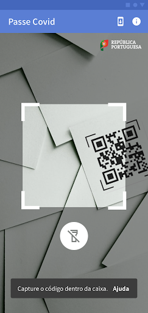  |   | 
 |   |   |   | 
 |   |   |   | 
 | 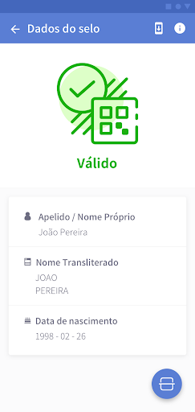  | 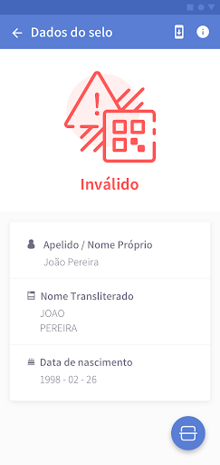  |   | 
 |   |   |   | 
 |   |   |   | 
 |   |   | 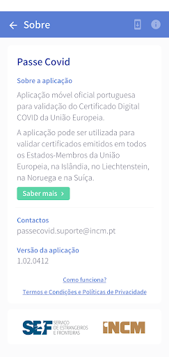  | 

## Development team
In the following we report the main information provided by the development team in the Google play store.

| | |
|-------------------------|-------------------------|
| **Developer**  | Imprensa Nacional - Casa da Moeda S.A. |
| **Website**  | - |
| **Email** | passecovid.suporte@incm.pt |
| **Physical address**  | [Casa da Moeda Avenida António José de Almeida 1000-042 Lisboa Portugal](https://www.google.com/maps/search/Casa%20da%20Moeda%20Avenida%20António%20José%20de%20Almeida%201000-042%20Lisboa%20Portugal) (Google Maps) |
| **Other developed apps**  | [https://play.google.com/store/apps/developer?id=7850779897537985724](https://play.google.com/store/apps/developer?id=7850779897537985724) |

## Android support

| | |
|-------------------------|-------------------------|
| **Declared target Android version**  | - |
| **Effective target Android version**  | - |
| **Minimum supported Android version**  | Oreo, version 8.0.0 (API level 26) |
| **Maximum target Android version**  | - |

The larger the difference between the minimum and maximum supported Android versions, the better. A larger difference means a wider audience. For example, old phones have a very low Android version, so a high minimum supported Android version means that the app cannot be used by users with old phones, thus leading to accessibility problems. 

## Requested permissions

In the following we report the complete list of the permissions requested by the app. 

| **Permission** | **Protection level** | **Description** | 
|-------------------------|-------------------------|-------------------------|
 **android.permission ACCESS_NETWORK_STATE** | Normal | Allows applications to access information about networks. 
 **android.permission CAMERA** | :warning:**Dangerous** | Required to be able to access the camera device. 
 **android.permission FLASHLIGHT** | - | - 
 **android.permission INTERNET** | Normal | Allows applications to open network sockets. 

## Mentioned servers

| **Server** | **Registrant** | **Registrant country** | **Creation date** | 
|-------------------------|-------------------------|-------------------------|-------------------------|
 | google.com | Google LLC | :us: US | 1997-09-15 04:00:00 |
 | googleapis.com | Google LLC | :us: US | 2005-01-25 17:52:26 |
 | apache.org | The Apache Software Foundation | :us: US | 1995-04-11 04:00:00 |
 | w3.org | W3C | :us: US | 1994-07-06 04:00:00 |
 | xml.org | OASIS Open | :us: US | 1997-02-03 05:00:00 |

## Security analysis 

Below we report the main security warnings raised by our execution of the [Androwarn](https://github.com/maaaaz/androwarn) security analysis tool.

**Telephony identifiers leakage**
> - This application reads the MCC+MNC of the provider of the SIM 

**Connection interfaces exfiltration**
> - This application reads details about the currently active data network 
> - This application tries to find out if the currently active data network is metered 

**Suspicious connection establishment**
> - This application opens a Socket and connects it to the remote address '0' on the 'connect, resolve' port  
> - This application opens a Socket and connects it to the remote address '1' on the 'N/A' port  
> - This application opens a Socket and connects it to the remote address '2' on the 'N/A' port  
> - This application opens a Socket and connects it to the remote address '3' on the 'N/A' port  
> - This application opens a Socket and connects it to the remote address 'Ljava/net/Proxy;->type()Ljava/net/Proxy$Type;' on the 'N/A' port  
> - This application opens a Socket and connects it to the remote address 'Read timed out' on the 'N/A' port  
> - This application opens a Socket and connects it to the remote address 'timeout' on the 'N/A' port  

**Pim data leakage**
> - This application accesses data stored in the clipboard 

**Code execution**
> - This application loads a native library: 'barhopper_v2' 

## User ratings and reviews

Below we provide information about how end users are reacting to the app in terms of ratings and reviews in the Google Play store.

### Ratings

The Passe Covid app has been installed by more than **100000** times. At this time, **642** rated the app and its average score is **2.3235295**. Below we show the distribution of the ratings across the usual star-based rating of Google Play

:star::star::star::star::star:: 132

:star::star::star::star:: 63

:star::star::star:: 50

:star::star:: 31

:star:: 366

### Reviews 

#### 5-star reviews

> A funcionar na plenitude. Lê logo à primeira. É claro que devemos ter em atenção o brilho pois isso condiciona qq aplicação  :date: __2021-07-23 11:16:54__

> Muir bom  :date: __2021-07-22 23:55:00__

> Estava com problemas com certificados emitidos na Suiça, mas desde o último Update funciona direito. Obrigado pela correção.  :date: __2021-07-22 07:27:57__

> Intuitiva e não tive problemas. Os problemas reportados nos comentários são do código qr, pelo que poderiam ponderar alternativas caso o código não funcione com algumas pessoas, como um link com submissão de um código pessoal mostrado no certificado.  :date: __2021-07-21 00:46:22__

> Lê perfeitamente em papel, simples e rápido.  :date: __2021-07-20 23:52:13__

> Com esta nova actualização. Funciona. Muito bem.  :date: __2021-07-20 14:01:19__

> Não lê o código. Tenho um Redmi Note 9 Pro.  :date: __2021-07-20 12:12:33__

> muito util  :date: __2021-07-19 21:37:11__

> Funciona  :date: __2021-07-18 20:12:38__

> Com a última atualização 1.2.1 já funciona bem. Obrigado  :date: __2021-07-16 17:03:03__

#### 4-star reviews

> Inseri o QRCODE DO CERTIfICADO e validou o meu certificado. Mas vejo que a funçao desta App e apenas validar o certificado.Deveria a meu ver ficar registado o respetivo certificado para quando fosse necessario poder apresentar. . Seria optimo que fosse acrescentado essa funçao pk se for so pra validar , ao fazer o download no site do SNS ele ja e validado.Enfim!Ideias!  :date: __2021-07-23 10:18:36__

> A leitura do QrCode é muito lenta  :date: __2021-07-22 15:15:25__

> Emite o certificado e da primeira vez que verifiquei com esta app o certifcado deu verde mas agora passado uns dias está a dar um erro a dizer que o selo expirado e dá vermelho. Tenho as duas tomas da vacina.  :date: __2021-07-21 12:52:04__

> Finalmente resolveram o problema e a aplicação já funciona. Já não era sem tempo  :date: __2021-07-18 23:47:25__

> Funciona em parte (versão 1.2.1). Lê o QR Code presente no ficheiro PDF do certificado caso este esteja num tamanho relativamente grande, ou seja, bastante ampliado num ecrã de smartphone por exemplo. Penso que num tablet ou pc não haja problema. No entanto, não funciona a leitura do código se este estiver impresso. Penso que possa depender da qualidade da impressão, mas também pode ser resultado da aplicação estar apenas preparada para ler um QR Code em formato digital perfeitamente alinhado.  :date: __2021-07-18 15:56:17__

> Com esta última atualização, já funciona, tenho Poco X3 NFC, Android 11.  :date: __2021-07-17 11:45:54__

> Funciona bem. Nas informações deveria indicar a vacina.  :date: __2021-07-16 18:59:46__

> Já lê os códigos quer em papel quer digital, sendo no entanto necessário premir o botão da lanterna que foi adicionado à app nesta atualização.  :date: __2021-07-16 10:37:05__

> Cumpre o que promete.  :date: __2021-07-13 06:38:16__

> Funciona. Embora a actualização inicial do dicionário podia ser mais explícita, causou me um bocado confusão. Dava msg para "estar ligado à internet", que estava, mas não actualizava. Tive de ir carregar no ícone.  :date: __2021-07-12 19:47:18__

#### 3-star reviews

> Após a última atualização não mais abriu diz falha da aplicação, até esta atualização funcionou sempre bem.  :date: __2021-07-22 17:31:21__

> Bons dias. Obti o certificado há cerca de 2 semanas. O programa ao ler QR refere "selo expirado". O calendário vacinal está completo (2 tomas), mas de fato a 2a dose foi há mais de 6 meses. Há que corrigir urgentemente está falha!!!  :date: __2021-07-22 13:43:04__

> Não lê certificado impresso!  :date: __2021-07-21 14:37:49__

> Aplicação não faz leitura de certificados estrangeiros, apresenta a leitura como emissor desconhecido.  :date: __2021-07-19 16:09:01__

> Trabalho num hotel e ontem durante dois check-in's não consegui utilizar a aplicação para validar os certificados digitais de clientes da Suíça. Tentei com o telemóvel do trabalho e o meu próprio telemóvel, mas nenhum deles validou os certificados. No entanto, um dos clientes sugeriu instalar a App no próprio telemóvel (registado na Suíça) e a App no telemóvel do cliente já validou o certificado. Será que existe algum problema com a aplicação em Portugal para validar certificados da Suíça?  :date: __2021-07-19 15:57:09__

> Muitas falhas  :date: __2021-07-19 12:13:04__

> Não funciona. Não lê o código. Depois de vários emails trocados com os programadores nada mudou. Continua a não funcionar. Update 1.2.1 feito, continua sem funcionar. Ainda 100% inútil. Finalmente hoje, 16/07/2021, começou a funcionar. Foram 2 semanas frustrantes com emails para a frente e para trás. Tudo podia ter sido evitado se a aplicação tivesse sido bem testada.  :date: __2021-07-16 19:22:09__

> Já consegui que lê-se o QRCode mas apenas no formato digital em papel continua a não ler.  :date: __2021-07-16 16:11:14__

> Funciona, mas a leitura do QR tem de ser melhorada. Demora muito a ler, o QR tem de estar tipo 100% alinhado com a caixa desenhada. Um bocadinho fora e ele não lê. Para usar para pessoas mais leigas no dia a dia, esse processo tem de ser melhorado.  :date: __2021-07-16 15:25:39__

> Não funciona. Não tira foto. ( Na versão 1.1) . Instalou a versão 1.1 apesar de existir versão mais recente. O botão atualização da aplicação não funciona . Só é possível atualizar através da Google play . A versão 1.2.1 já verifica o qrcode.  :date: __2021-07-16 12:04:00__

#### 2-star reviews

> Não lê o QRCode. Para ter a certeza que não era do meu telemóvel instalei a App da Suíça e leu sempre: portanto não há dúvidas, é erro desta app. Para além disso, aquela tem a função de importar pdf o que acho importante.  :date: __2021-07-23 15:30:18__

> Não está a funcionar...  :date: __2021-07-23 12:06:43__

> Inadmissível a APP dar resultados diferentes para Android e Apple..  :date: __2021-07-20 20:34:34__

> Porquê android 7 não baixa está APP . Todo o mundo tem direito  :date: __2021-07-19 09:30:52__

> Com a última atualização deixou de funcionar. Já desinstalei e instalei novamente, sem que tenha sortido efeito.  :date: __2021-07-17 10:17:10__

> Não carrega o qrcode  :date: __2021-07-15 10:12:51__

> Boa noite. Em sistema Android não faz leitura do código QR. Da erro.  :date: __2021-07-15 03:27:36__

> Nao estou a conseguir verificar o certificado emitido pela Suíça, podem ajudar-me?  :date: __2021-07-15 00:27:56__

> Funciona no meu tablet (ipad) e no telemóvel da minha mulher (galaxy A71). Não funciona no meu telemóvel (oneplus 7 pro).  :date: __2021-07-14 17:46:43__

> Diz para ligar a Internet eactualizar o dicionário, mas não dá, como solucionar? Já instalei várias vezes?  :date: __2021-07-14 11:04:14__

#### 1-star reviews

> Tal e qual como começou o nazismo  :date: __2021-07-23 15:27:51__

> Não funcionou  :date: __2021-07-23 15:25:00__

> Mais uma vez os programadores informáticos estatais falham .É o habitual dos serviços do nosso Estado. Vou tentar uma app de outro país se for possível...😅☹  :date: __2021-07-23 14:58:48__

> Não funciona mais.  :date: __2021-07-23 13:28:29__

> Só lê os certificados se estiverem no ecrã no computador. No papel não lê. Aplicação muito má até ao momento. Espero que consigam rectificar isso.  :date: __2021-07-23 12:50:23__

> Não funciona.  :date: __2021-07-23 10:15:51__

> Após muitas tentativas e muito tempo (vários minutos) a tentar ler o código, não funciona. A app não lê o código. Com outras apps QRCode a leitura é imediata, logo é problema nesta app. É lamentável.  :date: __2021-07-23 08:38:50__

> Não lê o código  :date: __2021-07-22 18:44:59__

> Não dá nada, devem ser os mesmos da aplicação stayaway covid  :date: __2021-07-22 17:30:13__

> Não funciona  :date: __2021-07-22 16:11:28__

# Credits

This project makes use of the following main third-party projects:
* Androguard: [https://github.com/androguard/androguard](https://github.com/androguard/androguard)
* Androwarn: [https://github.com/maaaaz/androwarn](https://github.com/maaaaz/androwarn)
* google_play_scraper: [https://github.com/JoMingyu/google-play-scraper](https://github.com/JoMingyu/google-play-scraper)
* whois: [https://github.com/DannyCork/python-whois](https://github.com/DannyCork/python-whois)
* BeautifulSoup: [https://www.crummy.com/software/BeautifulSoup](https://www.crummy.com/software/BeautifulSoup)

Other open-source projects used in this project include: 

- androguard==3.3.5
- appnope==0.1.0
- asn1crypto==1.3.0
- backcall==0.1.0
- beautifulsoup4==4.9.0
- bs4==0.0.1
- certifi==2020.4.5.1
- cffi==1.14.0
- chardet==3.0.4
- click==7.1.2
- colorama==0.4.3
- cryptography==2.9.2
- cycler==0.10.0
- decorator==4.4.2
- future==0.18.2
- google-play-scraper==0.1.1
- idna==2.9
- ipython==7.13.0
- ipython-genutils==0.2.0
- jedi==0.17.0
- Jinja2==2.11.2
- joblib==0.14.1
- kiwisolver==1.2.0
- lxml==4.5.0
- MarkupSafe==1.1.1
- matplotlib==3.2.1
- networkx==2.4
- nltk==3.5
- numpy==1.18.3
- parso==0.7.0
- pexpect==4.8.0
- pickleshare==0.7.5
- Pillow==7.1.2
- play-scraper==0.6.0
- prompt-toolkit==3.0.5
- ptyprocess==0.6.0
- pycountry==19.8.18
- pycparser==2.20
- pydot==1.4.1
- Pygments==2.6.1
- pyOpenSSL==19.1.0
- pyparsing==2.4.7
- python-dateutil==2.8.1
- regex==2020.4.4
- requests==2.23.0
- requests-futures==1.0.0
- six==1.14.0
- soupsieve==2.0
- tld==0.12.1
- tqdm==4.45.0
- traitlets==4.3.3
- urllib3==1.25.9
- wcwidth==0.1.9
- wordcloud==1.7.0

