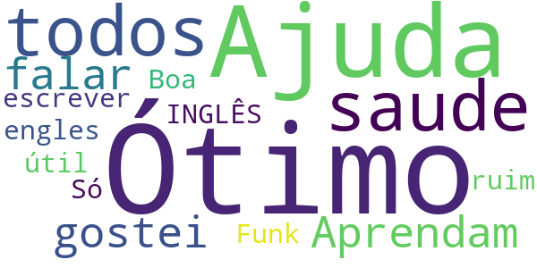
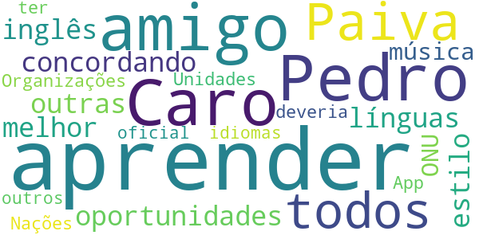
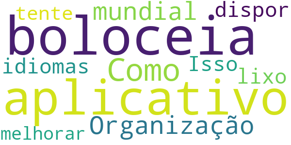

# OpenWHO: Conhecimento para Emergências em Saúde
App version ``3.7``

Analyzed with [covid-apps-observer](http://github.com/covid-apps-observer) project, version ``0.1``

## App overview
| | |
|-------------------------|-------------------------| 
| **Name**&nbsp;&nbsp;&nbsp;&nbsp;&nbsp;&nbsp;&nbsp;&nbsp;&nbsp;&nbsp;&nbsp;&nbsp;&nbsp;&nbsp;&nbsp;&nbsp;&nbsp;&nbsp;&nbsp;&nbsp;&nbsp;&nbsp;&nbsp;&nbsp;&nbsp;&nbsp;&nbsp;&nbsp;&nbsp;&nbsp;&nbsp;&nbsp;&nbsp;&nbsp;&nbsp;&nbsp;&nbsp;&nbsp;&nbsp;&nbsp;  | OpenWHO: Conhecimento para Emergências em Saúde |
| **Unique identifier** | de.xikolo.openwho |
| **Link to Google Play** | [https://play.google.com/store/apps/details?id=de.xikolo.openwho](https://play.google.com/store/apps/details?id=de.xikolo.openwho) |
| **Summary**  | Conhecimento para Emergências em Saúde |
| **Privacy policy** | [https://openwho.org/pages/privacy](https://openwho.org/pages/privacy) |
| **Latest version** | 3.7 |
| **Last update** | 2020-11-23 13:57:15 |
| **Recent changes** | - Bug fixes and performance improvements |
| **Installs**  | 1.000.000+ |
| **Category** | Educação |
| **First release** | 17 de mai. de 2017 |
| **Size**  | 18M |
| **Supported Android version**  | 5.0 ou superior |

### Description
> A OpenWHO é a plataforma interativa de transferência de conhecimento da Organização Mundial de Saúde (OMS) que oferece cursos online para melhorar a resposta a emergências em saúde. A OpenWHO permite que a Organização e os seus principais parceiros transfiram conhecimento capaz de salvar vidas às equipas de resposta na linha da frente.
 Com a OpenWHO, terá a flexibilidade de aprender ao seu próprio ritmo. Assista a curtas palestras em vídeo e teste o seu conhecimento através de autotestes quando e onde quiser. O fórum do curso e o espaço de colaboração permite-lhe comunicar com outros participantes e especialistas em todo o mundo.
 Concebido sobretudo para profissionais de saúde, equipas de resposta na linha da frente e decisores, a app é também uma fonte de informação para aqueles afetados por surtos de doenças e emergências em saúde, ou para aqueles com interesse geral no trabalho da OMS em emergências em saúde. 
 A aplicação possui 6 canais: 
 - canal Epidemias aborda a gestão de doenças infeciosas e fornece informação científica capaz de salvar vidas.
 - canal Pronto para responder ajuda a  preparar o pessoal que se encontra em formação para trabalhar em surtos de doenças e emergências sanitárias.
 - canal Social foca-se nas intervenções com base nas ciências sociais e ajuda na comunicação com comunidades afetadas.  
 - canal Preparação para Pandemias reúne cursos sobre vários aspetos da preparação, incluindo vigilância, medidas de saúde pública e comunicação de risco durante uma pandemia. 
 - canal COVID-19 fornece recursos de aprendizagem nas 6 línguas oficiais da OMS (árabe, chinês, espanhol, francês, inglês e russo) para profissionais de saúde, decisores e o público em geral sobre o surto da doença do coronavírus (COVID-19). 
 - canal de COVID-19 Idiomas Nacionais fornece os mesmos recursos de aprendizagem que o canal COVID-19, mas em idiomas nacionais, tais como Indonésio, Japonês e Português. 
 Os cursos da OpenWHO estão disponíveis em diversas línguas, incluindo as 6 línguas oficiais da OMS. 
 Faça o download da app e junte-se à comunidade da OpenWHO.
 Esta app é desenvolvida em cooperação entre o Instituto Hasso Plattner e a OMS. O conteúdo de aprendizagem é fornecido exclusivamente pela OMS.

### User interface
The developers of the app provide the following screenshots in the Google play store.
| | | |
|:-------------------------:|:-------------------------:|:-------------------------:|
 |   |   |   | 
 |   |   |   | 

## Development team
In the following we report the main information provided by the development team in the Google play store.

| | |
|-------------------------|-------------------------|
| **Developer**  | HPI Knowledge Engineering Team |
| **Website**  | [https://openwho.org/](https://openwho.org/) |
| **Email** | openwho-support@hpi.de |
| **Physical address**  | [Prof.-Dr.-Helmert-Str.2-3 14482 Potsdam](https://www.google.com/maps/search/Prof.-Dr.-Helmert-Str.2-3%2014482%20Potsdam) (Google Maps) |
| **Other developed apps**  | [https://play.google.com/store/apps/developer?id=7185448023325736337](https://play.google.com/store/apps/developer?id=7185448023325736337) |

## Android support

| | |
|-------------------------|-------------------------|
| **Declared target Android version**  | - |
| **Effective target Android version**  | - |
| **Minimum supported Android version**  | Lollipop, version 5.0 (API level 21) |
| **Maximum target Android version**  | - |

The larger the difference between the minimum and maximum supported Android versions, the better. A larger difference means a wider audience. For example, old phones have a very low Android version, so a high minimum supported Android version means that the app cannot be used by users with old phones, thus leading to accessibility problems. 

## Requested permissions

In the following we report the complete list of the permissions requested by the app. 

| **Permission** | **Protection level** | **Description** | 
|-------------------------|-------------------------|-------------------------|
 **android.permission ACCESS_NETWORK_STATE** | Normal | Allows applications to access information about networks. 
 **android.permission ACCESS_WIFI_STATE** | Normal | Allows applications to access information about Wi-Fi networks. 
 **android.permission DOWNLOAD_WITHOUT_NOTIFICATION** | - | - 
 **android.permission FOREGROUND_SERVICE** | Normal | Allows a regular application to use Service.startForeground. 
 **android.permission INTERNET** | Normal | Allows applications to open network sockets. 
 **android.permission RECEIVE_BOOT_COMPLETED** | Normal | Allows an application to receive the Intent.ACTION_BOOT_COMPLETED that is broadcast after the system finishes booting. 
 **android.permission WAKE_LOCK** | Normal | Allows using PowerManager WakeLocks to keep processor from sleeping or screen from dimming. 
 **android.permission WRITE_EXTERNAL_STORAGE** | :warning:**Dangerous** | Allows an application to write to external storage. 
 **com.google.android.c2dm.permission RECEIVE** | - | - 
 **com.google.android.finsky.permission BIND_GET_INSTALL_REFERRER_SERVICE** | - | - 

## Mentioned servers

| **Server** | **Registrant** | **Registrant country** | **Creation date** | 
|-------------------------|-------------------------|-------------------------|-------------------------|
 | googlesyndication.com | Google LLC | :us: US | 2003-01-21 06:17:24 |
 | google.com | Google LLC | :us: US | 1997-09-15 04:00:00 |
 | apple.com | Apple Inc. | :us: US | 1987-02-19 05:00:00 |
 | aomedia.org | Contact Privacy Inc. Customer 1243324949 | :canada: CA | 2015-08-24 14:07:31 |
 | dashif.org | VTM Group | :us: US | 2012-04-27 13:02:46 |
 | app-measurement.com | Google LLC | :us: US | 2015-06-19 20:13:31 |
 | w3.org | W3C | :us: US | 1994-07-06 04:00:00 |
 | googleapis.com | Google LLC | :us: US | 2005-01-25 17:52:26 |
 | psdev.de | - | - | - |
 | xmlpull.org | WhoisGuard, Inc. | PA | 2001-11-26 20:33:08 |
 | crashlytics.com | Google LLC | :us: US | 2011-01-21 15:30:40 |
 | apache.org | The Apache Software Foundation | :us: US | 1995-04-11 04:00:00 |
 | opensource.org | Open Source Initiative | :us: US | 1998-02-11 05:00:00 |
 | creativecommons.org | Creative Commons Corporation | :canada: CA | 2001-01-15 16:51:44 |
 | eclipse.org | Eclipse.org Foundation, Inc. | :canada: CA | 1997-04-14 04:00:00 |
 | gnu.org | Free Software Foundation | :us: US | 1995-11-24 05:00:00 |
 | mozilla.org | Mozilla Corporation | :us: US | 1998-01-24 05:00:00 |
 | googleadservices.com | Google LLC | :us: US | 2003-06-19 16:34:53 |

## Security analysis 

Below we report the main security warnings raised by our execution of the [Androwarn](https://github.com/maaaaz/androwarn) security analysis tool.

**Telephony identifiers leakage**
> - This application reads the ISO country code equivalent of the current registered operator's MCC (Mobile Country Code) 
> - This application reads the MCC+MNC of the provider of the SIM 

**Connection interfaces exfiltration**
> - This application reads details about the currently active data network 
> - This application tries to find out if the currently active data network is metered 

**Suspicious connection establishment**
> - This application opens a Socket and connects it to the remote address ' returned no addresses for  ; port is out of range' on the 'N/A' port  
> - This application opens a Socket and connects it to the remote address '' on the 'N/A' port  
> - This application opens a Socket and connects it to the remote address 'Ljava/lang/StringBuilder;->toString()Ljava/lang/String;' on the 'N/A' port  
> - This application opens a Socket and connects it to the remote address 'Ljava/net/Proxy;->type()Ljava/net/Proxy$Type;' on the 'N/A' port  
> - This application opens a Socket and connects it to the remote address 'timeout' on the 'N/A' port  

**Code execution**
> - This application loads a native library 

## User ratings and reviews

Below we provide information about how end users are reacting to the app in terms of ratings and reviews in the Google Play store.

### Ratings

The OpenWHO: Conhecimento para Emergências em Saúde app has been installed by more than **1000000** times. At this time, **3403** rated the app and its average score is **4.2647057**. Below we show the distribution of the ratings across the usual star-based rating of Google Play

:star::star::star::star::star:: 2403

:star::star::star::star:: 370

:star::star::star:: 130

:star::star:: 130

:star:: 370

### Reviews 

#### 5-star reviews

> Ótimo!  :date: __2020-08-18 16:10:09__

> Ajuda a saude de todos gostei😏😏  :date: __2020-05-16 21:46:48__

> Aprendam a falar e a escrever INGLÊS. É mais útil que Funk!  :date: __2020-05-03 15:00:54__

> Boa  :date: __2020-04-06 08:22:43__

> Só em engles ruim  :date: __2020-03-17 03:56:56__

#### 4-star reviews

> Coronavirus  :date: __2020-05-27 13:53:07__

> Uma pena não ser em português.  :date: __2018-01-18 01:21:10__

#### 3-star reviews

> Caro amigo Pedro Paiva nem não todos tem a oportunidades de aprender outras línguas, e mesmo concordando que aprender inglês e muito melhor que esse estilo de música a ONU Organizações das Nações Unidades deveria ter App oficial em outros idiomas!  :date: __2020-05-19 02:36:13__

#### 2-star reviews

No recent reviews available with 2 stars.

#### 1-star reviews

> boloceia aplicativo  :date: __2020-10-31 16:14:42__

> Como uma Organização mundial não dispor mais idiomas?  :date: __2020-04-09 17:28:57__

> Isso è um lixo tente melhorar  :date: __2020-04-02 09:30:07__

