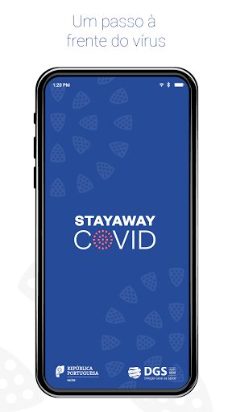
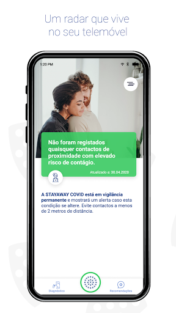
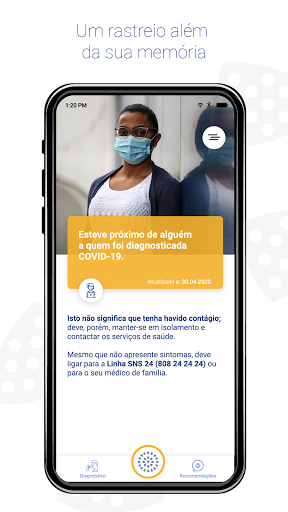
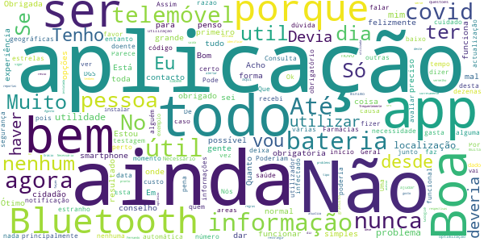
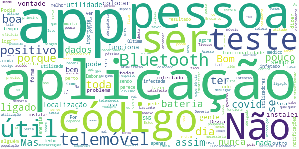
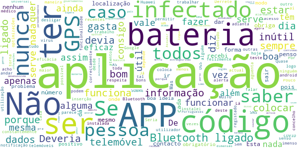
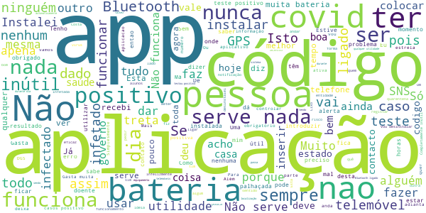

# STAYAWAY COVID
App version ``1.0.6``

Analyzed with [covid-apps-observer](http://github.com/covid-apps-observer) project, version ``0.1``

## App overview
| | |
|-------------------------|-------------------------| 
| **Name**&nbsp;&nbsp;&nbsp;&nbsp;&nbsp;&nbsp;&nbsp;&nbsp;&nbsp;&nbsp;&nbsp;&nbsp;&nbsp;&nbsp;&nbsp;&nbsp;&nbsp;&nbsp;&nbsp;&nbsp;&nbsp;&nbsp;&nbsp;&nbsp;&nbsp;&nbsp;&nbsp;&nbsp;&nbsp;&nbsp;&nbsp;&nbsp;&nbsp;&nbsp;&nbsp;&nbsp;&nbsp;&nbsp;&nbsp;&nbsp;  | STAYAWAY COVID |
| **Unique identifier** | fct.inesctec.stayaway |
| **Link to Google Play** | [https://play.google.com/store/apps/details?id=fct.inesctec.stayaway](https://play.google.com/store/apps/details?id=fct.inesctec.stayaway) |
| **Summary**  | A aplicação oficial de notificação de exposição à COVID-19 em Portugal. |
| **Privacy policy** | [https://stayawaycovid.pt/politica-de-privacidade](https://stayawaycovid.pt/politica-de-privacidade) |
| **Latest version** | 1.0.6 |
| **Last update** | 2020-11-04 11:55:08 |
| **Recent changes** | - Corrigidas as tarefas que correm em segundo plano - Corrigida a submissão de código - Adicionado o botão de contacto da equipa de suporte - Adicionado o botão de partilha - Redesenhada a página de definições - Adicionado ecrã de localização ao onboarding - Adicionada funcionalidade ao pressionar continuamente o botão da home - Corrigida a barra de navegação no Android 8 - Correções de bugs - Correções errors |
| **Installs**  | 1.000.000+ |
| **Category** | Saúde e fitness |
| **First release** | 13 de ago. de 2020 |
| **Size**  | 58M |
| **Supported Android version**  | 6.0 ou superior |

### Description
> STAYAWAY COVID é a aplicação oficial de notificação de exposição à COVID-19 em Portugal. É uma aplicação para telemóveis que tem como objetivo auxiliar o país no rastreio da COVID-19. A aplicação permite, de forma simples e segura, que cada um de nós seja informado sobre exposições de risco à doença, através da monitorização de contactos recentes. A aplicação é de utilização voluntária e gratuita e, em momento algum, tem acesso à sua identidade ou dados pessoais.
 Uma vez instalada a aplicação, o telemóvel anuncia a sua presença a todos os dispositivos próximos usando identificadores aleatórios que não revelam identidades pessoais. A informação partilhada entre dispositivos permite à STAYAWAY COVID saber de que telemóveis esteve perto, quão perto e por quanto tempo. A Organização Mundial de Saúde sugere que, contactos a menos de 2 metros e por mais de 15 minutos com alguém portador de COVID-19 sejam considerados com elevado risco de contágio.
 1. Ausência de registo de elevado risco de contágio
 Não registando contactos de proximidade com elevado risco de contágio com alguém a quem foi diagnosticada COVID-19, a aplicação informa-nos exatamente disso com a data da última avaliação.
 2. Alerta de elevado risco de contágio
 Se alguém de quem estivemos perigosamente próximo nos últimos 14 dias for diagnosticado com COVID-19 e informar o sistema STAYAWAY COVID, a aplicação alerta-nos de imediato do risco sugerindo que nos isolemos e contactemos a Linha SNS 24 (808 24 24 24).
 3. Após diagnóstico de COVID-19
 No caso de contrairmos COVID-19, com o diagnóstico receberemos um código numérico que nos permitirá, anonimamente e através da aplicação, informar o sistema STAYAWAY COVID. É este ato que permite ao sistema alertar segura e atempadamente todos aqueles que podemos ter contagiado, mesmo antes de terem tido qualquer sintoma. Não é nunca revelada a ninguém a identidade de ninguém.
 A aplicação STAYAWAY COVID foi desenvolvida pelo INESC TEC, ISPUP, Keyruptive e Ubirider para a DGS / Ministério da Saúde.

### User interface
The developers of the app provide the following screenshots in the Google play store.
| | | |
|:-------------------------:|:-------------------------:|:-------------------------:|
 |   |   |   | 
 |   |  

## Development team
In the following we report the main information provided by the development team in the Google play store.

| | |
|-------------------------|-------------------------|
| **Developer**  | FCT FCCN |
| **Website**  | [https://stayawaycovid.pt/](https://stayawaycovid.pt/) |
| **Email** | stayaway@inesctec.pt |
| **Physical address**  | - |
| **Other developed apps**  | [https://play.google.com/store/apps/developer?id=FCT+FCCN](https://play.google.com/store/apps/developer?id=FCT+FCCN) |

## Android support

| | |
|-------------------------|-------------------------|
| **Declared target Android version**  | - |
| **Effective target Android version**  | - |
| **Minimum supported Android version**  | Marshmallow, version 6.0 (API level 23) |
| **Maximum target Android version**  | - |

The larger the difference between the minimum and maximum supported Android versions, the better. A larger difference means a wider audience. For example, old phones have a very low Android version, so a high minimum supported Android version means that the app cannot be used by users with old phones, thus leading to accessibility problems. 

## Requested permissions

In the following we report the complete list of the permissions requested by the app. 

| **Permission** | **Protection level** | **Description** | 
|-------------------------|-------------------------|-------------------------|
 **android.permission ACCESS_NETWORK_STATE** | Normal | Allows applications to access information about networks. 
 **android.permission BLUETOOTH** | Normal | Allows applications to connect to paired bluetooth devices. 
 **android.permission FOREGROUND_SERVICE** | Normal | Allows a regular application to use Service.startForeground. 
 **android.permission INTERNET** | Normal | Allows applications to open network sockets. 
 **android.permission RECEIVE_BOOT_COMPLETED** | Normal | Allows an application to receive the Intent.ACTION_BOOT_COMPLETED that is broadcast after the system finishes booting. 
 **android.permission REQUEST_IGNORE_BATTERY_OPTIMIZATIONS** | Normal | Permission an application must hold in order to use Settings.ACTION_REQUEST_IGNORE_BATTERY_OPTIMIZATIONS. 
 **android.permission WAKE_LOCK** | Normal | Allows using PowerManager WakeLocks to keep processor from sleeping or screen from dimming. 

## Mentioned servers

| **Server** | **Registrant** | **Registrant country** | **Creation date** | 
|-------------------------|-------------------------|-------------------------|-------------------------|
 | android.com | Google LLC | :us: US | 1997-06-23 04:00:00 |
 | google.com | Google LLC | :us: US | 1997-09-15 04:00:00 |
 | ietf.org | IETF Trust | :us: US | 1995-03-11 05:00:00 |

## Security analysis 

Below we report the main security warnings raised by our execution of the [Androwarn](https://github.com/maaaaz/androwarn) security analysis tool.

**Connection interfaces exfiltration**
> - This application reads details about the currently active data network 
> - This application tries to find out if the currently active data network is metered 

**Suspicious connection establishment**
> - This application opens a Socket and connects it to the remote address '' on the 'N/A' port  
> - This application opens a Socket and connects it to the remote address 'Ljava/lang/StringBuilder;->toString()Ljava/lang/String;' on the ': connect, resolve' port  
> - This application opens a Socket and connects it to the remote address 'Ljava/lang/StringBuilder;->toString()Ljava/lang/String;' on the 'N/A' port  
> - This application opens a Socket and connects it to the remote address 'Ljava/net/Proxy;->type()Ljava/net/Proxy$Type;' on the 'N/A' port  
> - This application opens a Socket and connects it to the remote address 'timeout' on the 'N/A' port  

**Pim data leakage**
> - This application accesses data stored in the clipboard 

**Code execution**
> - This application loads a native library 
> - This application executes a UNIX command 

## User ratings and reviews

Below we provide information about how end users are reacting to the app in terms of ratings and reviews in the Google Play store.

### Ratings

The STAYAWAY COVID app has been installed by more than **1000000** times. At this time, **7057** rated the app and its average score is **3.8016827**. Below we show the distribution of the ratings across the usual star-based rating of Google Play

:star::star::star::star::star:: 3436

:star::star::star::star:: 1340

:star::star::star:: 780

:star::star:: 449

:star:: 1052

### Reviews 

#### 5-star reviews

> Ok  :date: __2020-12-28 13:49:21__

> Muito útil  :date: __2020-12-27 21:01:07__

> Muito bom👍  :date: __2020-12-27 19:23:01__

> É uma pena as pessoas não aderirem mais. A app funciona bem noutros países nos quais há maior responsabilidade e adesão por parte das pessoas.  :date: __2020-12-25 18:40:33__

> Assistente operacional  :date: __2020-12-21 02:26:19__

> Ótimo  :date: __2020-12-20 10:22:53__

> muito loco  :date: __2020-12-20 04:45:49__

> Não percebo muito bem didso  :date: __2020-12-19 17:55:29__

> Olá bom dia  :date: __2020-12-19 10:01:18__

> MUITO ÚTIL 💪 🇵🇹 Falta uma opção, para ligar e desligar-se automático (noite por exemplo), alertando o utilizador para ligar e desligar gps/Bluetooth. Dar hipótese ao utilizador, de sentir que controla alguma coisa! Sugestão E que tal um relatório diário dos contactos feitos pela aplicação? Envolver as pessoas nesta luta, que é de todos! Deixá-las sentir que não é apenas uma app, correndo em fundo, 'vigiando', gastando recursos! 'Gamificar' envolve/atrai pessoas. Vamos juntos! Stay away Covid  :date: __2020-12-18 23:09:22__

#### 4-star reviews

> Bom saber  :date: __2020-12-27 14:05:23__

> Tb  :date: __2020-12-26 17:33:03__

> Bom  :date: __2020-12-21 19:27:46__

> Vou indigar para desenvolvimento dr agumas ferramentas para o meu trabalho  :date: __2020-12-20 18:55:20__

> Boa  :date: __2020-12-20 14:50:10__

> Fantástico  :date: __2020-12-17 21:02:48__

> Uma boa aplicação  :date: __2020-12-16 11:44:43__

> Podia ter mais acesso a dados sobre o covid 19 da geolocalizacao onde nos encontramos no momento em termos de % virus nesse local.  :date: __2020-12-14 16:08:11__

> Ótima oportunidade.  :date: __2020-12-11 00:36:09__

> E bom haver para que tudo corra bem  :date: __2020-12-08 21:50:18__

#### 3-star reviews

> Não é lá MT seguro  :date: __2020-12-24 10:23:01__

> É uma boa iniciativa  :date: __2020-12-24 00:11:20__

> Sem expiencias  :date: __2020-12-15 23:39:34__

> Falta agora criar um campo onde define se a pessoa já tomou a vacina ou não  :date: __2020-12-14 18:35:43__

> Está app não deveria de ocupar espaço eu não consigo instalar pk não tenho espaço no tlm  :date: __2020-12-10 12:11:44__

> A ideia é boa, mas ter que usar o Bluetooth e desativar funcionalidades básicas do telemóvel, que nem ligação direta devia ter, confesso que é um pouco bizarro. Podiam melhorar a ferramenta.  :date: __2020-12-09 12:47:26__

> Depender da net, se não estiver num espaço com Wi-Fi grátis tenho de gastar os meus dados. A aplicação está sempre a lembrar que tenho de ligar a aplicação mesmo quando estou em casa, que faz consumir muita energia ao telemóvel  :date: __2020-12-07 23:57:24__

> Ainda não sei o que está a passar  :date: __2020-12-06 20:07:59__

> Razoável app  :date: __2020-12-05 19:08:58__

> Que adianta ter a aplicação se não ter net no telemóvel eu por ex não tenho net na rua por isso não sei qual é o benefício  :date: __2020-12-03 20:23:10__

#### 2-star reviews

> Pouco util, a informação é escassa e existe o problema da informação ter de ser colocada pelo utilizador e não por uma instituição de saude.  :date: __2020-12-28 11:30:06__

> Gasta demasiado energia do telemóvel  :date: __2020-12-25 15:25:05__

> Isto nao alerta porqie eu tive au pé de uma pessoa com viros e não me alertou  :date: __2020-12-25 13:21:01__

> Estou a acabar o isolamento. (10 dias) Obrigatório depois de dar positivo, e o cod. Ainda nao chegou , para colocar na aplicação. Serviços nao estão sintonizados.  :date: __2020-12-22 14:44:57__

> A aplicação é uma ideia excelente, mas só teria real utilidade se todos fizessem o teste, pois há muitos casos prováveis de covid, alguns até assintomáticos, que nem fizeram teste, e podem ser portadores, como aconteceu a um conhecido. Assim, posso ter contacto na mesma com utilizadores da app que não sabem o que têm. Uma melhoria seria um aviso de proximidade de pessoas com sintomas (o que já implicaria outras coisas, claro). Obrigada.  :date: __2020-12-22 08:47:27__

> Obrigada tudo normal 😃  :date: __2020-12-22 01:32:40__

> Inútil...Neste momento há 70 000 casos positivos. Os casos positivos teriam de estar na base de dados para que tivesse eficácia. Depois há questões técnicas, mas que pelo menos fosse eficaz já seria útil.  :date: __2020-12-18 10:47:55__

> Quase não gasta bateria com o Bluetooth ligado e localização, mas quem não quer gastar bateria é só desligar quando está em em casa de forma segura, sem gente a entrar e sair ou ir à porta  :date: __2020-12-17 22:10:06__

> Não compreendo! Se uma pessoa der positivo, não deverá estar em isolamento ou tratamento em Unidade Hospitalar adequada? Como se pode então obter resultados nesta App. O código só e válido por 24 horas? Então e depois desse período de tempo, o que se pode fazer? A instalação não é obrigatória, ou é? Julgo que não. Obrigados.  :date: __2020-12-12 15:33:35__

> Não vale de nada.....  :date: __2020-12-03 20:05:22__

#### 1-star reviews

> É uma autêntica farsa, considerar uma gripe diferente, mas praticamente ao nível da gripe comum como um grande perigo para a humanidade enquanto actualmente quase ninguém morre de SARS-CoV2, pode-se contar menos de uma dúzia de mortes diárias por SARS-COV2 embora o governo português tenha escondido factos verdadeiros e transmite ao povo medo sob a forma de mentiras. Este resultado deve-se ao facto do povo ter votado em Sociopatas, Psicopatas e Assassinos para desfraldar todos os Valores da Nação  :date: __2020-12-28 08:47:55__

> Não funciona, por várias vezes estive em contacto com positivos várias horas, e não alertou nada  :date: __2020-12-28 00:08:37__

> Após teste positivo de covid constatei que a app não serve para nada! É absurdo que não seja tirado partido da tecnologia para enfrentar a pandemia. No momento inicial divulguei bastante a aplicação, mas agora estou completamente decepcionado. Foi uma boa iniciativa! É realmente uma stayaway app!  :date: __2020-12-26 16:53:31__

> Experiência muito a desejar, consome imensa bateria. Minha esposa e eu tivemos covid, nós os dois instalamos a aplicação e mesmo assim não mostrou que havia risco. Já vi que é treta... Querem ter acesso a nossa localização e monitoramento, mais não cumprem o papel de avisar. Nós deixa a pensar quais são os reais motivos por traz dessa quebra de privacidade.  :date: __2020-12-26 02:32:05__

> É inútil. Ninguém recebe códigos, logo não os carrega. Assim, ninguém vai receber os avisos. Dinheiro jogado fora. Lamentável, mas inútil. Depois de meses instalada, desinstalei.  :date: __2020-12-25 23:09:02__

> Manter ligado o bluetooth e localização 24 horas por dia. Quem vai pagar a eletricidade? Em vez do governo baixar aumenta o IVA. É uma boa ideia para uma aplicação, e ajudaria a ultrapassar este vírus, *mas* as condições não são as melhores para tal. Tirando a ideia de recolha de informação privada.  :date: __2020-12-25 21:09:39__

> Uma autentica palhaçada  :date: __2020-12-25 16:54:06__

> Só serve para gastar bateria. De resto é um rastreador.  :date: __2020-12-25 13:25:58__

> Não funciona no Huawei P smart 2021 não ativa o rastreio. Se tentar instalar na appgalery na nova nem aparece a antiga versão manda desinstalar a nova versão da app gallery acho que a STAYAWAY COVID não ajuda em nada se ninguém a atualizar...  :date: __2020-12-25 13:12:16__

> App muito má n serve para nada  :date: __2020-12-24 23:36:30__

