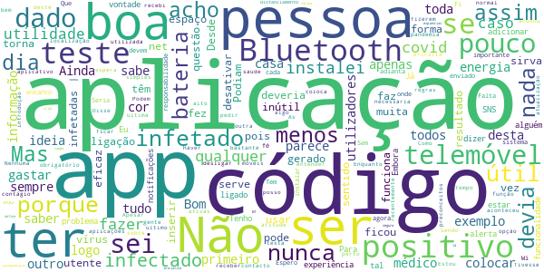

# STAYAWAY COVID
App version ``1.0.6``

Analyzed with [covid-apps-observer](http://github.com/covid-apps-observer) project, version ``0.1``

## App overview
| | |
|-------------------------|-------------------------| 
| **Name**&nbsp;&nbsp;&nbsp;&nbsp;&nbsp;&nbsp;&nbsp;&nbsp;&nbsp;&nbsp;&nbsp;&nbsp;&nbsp;&nbsp;&nbsp;&nbsp;&nbsp;&nbsp;&nbsp;&nbsp;&nbsp;&nbsp;&nbsp;&nbsp;&nbsp;&nbsp;&nbsp;&nbsp;&nbsp;&nbsp;&nbsp;&nbsp;&nbsp;&nbsp;&nbsp;&nbsp;&nbsp;&nbsp;&nbsp;&nbsp;  | STAYAWAY COVID |
| **Unique identifier** | fct.inesctec.stayaway |
| **Link to Google Play** | [https://play.google.com/store/apps/details?id=fct.inesctec.stayaway](https://play.google.com/store/apps/details?id=fct.inesctec.stayaway) |
| **Summary**  | A aplicação oficial de notificação de exposição à COVID-19 em Portugal. |
| **Privacy policy** | [https://stayawaycovid.pt/politica-de-privacidade](https://stayawaycovid.pt/politica-de-privacidade) |
| **Latest version** | 1.0.6 |
| **Last update** | 2020-11-04 11:55:08 |
| **Recent changes** | - Corrigidas as tarefas que correm em segundo plano - Corrigida a submissão de código - Adicionado o botão de contacto da equipa de suporte - Adicionado o botão de partilha - Redesenhada a página de definições - Adicionado ecrã de localização ao onboarding - Adicionada funcionalidade ao pressionar continuamente o botão da home - Corrigida a barra de navegação no Android 8 - Correções de bugs - Correções errors |
| **Installs**  | 1.000.000+ |
| **Category** | Saúde e fitness |
| **First release** | 13 de ago. de 2020 |
| **Size**  | 58M |
| **Supported Android version**  | 6.0 ou superior |

### Description
> STAYAWAY COVID é a aplicação oficial de notificação de exposição à COVID-19 em Portugal. É uma aplicação para telemóveis que tem como objetivo auxiliar o país no rastreio da COVID-19. A aplicação permite, de forma simples e segura, que cada um de nós seja informado sobre exposições de risco à doença, através da monitorização de contactos recentes. A aplicação é de utilização voluntária e gratuita e, em momento algum, tem acesso à sua identidade ou dados pessoais.
 Uma vez instalada a aplicação, o telemóvel anuncia a sua presença a todos os dispositivos próximos usando identificadores aleatórios que não revelam identidades pessoais. A informação partilhada entre dispositivos permite à STAYAWAY COVID saber de que telemóveis esteve perto, quão perto e por quanto tempo. A Organização Mundial de Saúde sugere que, contactos a menos de 2 metros e por mais de 15 minutos com alguém portador de COVID-19 sejam considerados com elevado risco de contágio.
 1. Ausência de registo de elevado risco de contágio
 Não registando contactos de proximidade com elevado risco de contágio com alguém a quem foi diagnosticada COVID-19, a aplicação informa-nos exatamente disso com a data da última avaliação.
 2. Alerta de elevado risco de contágio
 Se alguém de quem estivemos perigosamente próximo nos últimos 14 dias for diagnosticado com COVID-19 e informar o sistema STAYAWAY COVID, a aplicação alerta-nos de imediato do risco sugerindo que nos isolemos e contactemos a Linha SNS 24 (808 24 24 24).
 3. Após diagnóstico de COVID-19
 No caso de contrairmos COVID-19, com o diagnóstico receberemos um código numérico que nos permitirá, anonimamente e através da aplicação, informar o sistema STAYAWAY COVID. É este ato que permite ao sistema alertar segura e atempadamente todos aqueles que podemos ter contagiado, mesmo antes de terem tido qualquer sintoma. Não é nunca revelada a ninguém a identidade de ninguém.
 A aplicação STAYAWAY COVID foi desenvolvida pelo INESC TEC, ISPUP, Keyruptive e Ubirider para a DGS / Ministério da Saúde.

### User interface
The developers of the app provide the following screenshots in the Google play store.
| | | |
|:-------------------------:|:-------------------------:|:-------------------------:|
 |   |   |   | 
 |   |  

## Development team
In the following we report the main information provided by the development team in the Google play store.

| | |
|-------------------------|-------------------------|
| **Developer**  | FCT FCCN |
| **Website**  | [https://stayawaycovid.pt/](https://stayawaycovid.pt/) |
| **Email** | stayaway@inesctec.pt |
| **Physical address**  | - |
| **Other developed apps**  | [https://play.google.com/store/apps/developer?id=FCT+FCCN](https://play.google.com/store/apps/developer?id=FCT+FCCN) |

## Android support

| | |
|-------------------------|-------------------------|
| **Declared target Android version**  | - |
| **Effective target Android version**  | - |
| **Minimum supported Android version**  | Marshmallow, version 6.0 (API level 23) |
| **Maximum target Android version**  | - |

The larger the difference between the minimum and maximum supported Android versions, the better. A larger difference means a wider audience. For example, old phones have a very low Android version, so a high minimum supported Android version means that the app cannot be used by users with old phones, thus leading to accessibility problems. 

## Requested permissions

In the following we report the complete list of the permissions requested by the app. 

| **Permission** | **Protection level** | **Description** | 
|-------------------------|-------------------------|-------------------------|
 **android.permission ACCESS_NETWORK_STATE** | Normal | Allows applications to access information about networks. 
 **android.permission BLUETOOTH** | Normal | Allows applications to connect to paired bluetooth devices. 
 **android.permission FOREGROUND_SERVICE** | Normal | Allows a regular application to use Service.startForeground. 
 **android.permission INTERNET** | Normal | Allows applications to open network sockets. 
 **android.permission RECEIVE_BOOT_COMPLETED** | Normal | Allows an application to receive the Intent.ACTION_BOOT_COMPLETED that is broadcast after the system finishes booting. 
 **android.permission REQUEST_IGNORE_BATTERY_OPTIMIZATIONS** | Normal | Permission an application must hold in order to use Settings.ACTION_REQUEST_IGNORE_BATTERY_OPTIMIZATIONS. 
 **android.permission WAKE_LOCK** | Normal | Allows using PowerManager WakeLocks to keep processor from sleeping or screen from dimming. 

## Mentioned servers

| **Server** | **Registrant** | **Registrant country** | **Creation date** | 
|-------------------------|-------------------------|-------------------------|-------------------------|
 | android.com | Google LLC | :us: US | 1997-06-23 04:00:00 |
 | google.com | Google LLC | :us: US | 1997-09-15 04:00:00 |
 | ietf.org | IETF Trust | :us: US | 1995-03-11 05:00:00 |

## Security analysis 

Below we report the main security warnings raised by our execution of the [Androwarn](https://github.com/maaaaz/androwarn) security analysis tool.

**Connection interfaces exfiltration**
> - This application reads details about the currently active data network 
> - This application tries to find out if the currently active data network is metered 

**Suspicious connection establishment**
> - This application opens a Socket and connects it to the remote address '' on the 'N/A' port  
> - This application opens a Socket and connects it to the remote address 'Ljava/lang/StringBuilder;->toString()Ljava/lang/String;' on the ': connect, resolve' port  
> - This application opens a Socket and connects it to the remote address 'Ljava/lang/StringBuilder;->toString()Ljava/lang/String;' on the 'N/A' port  
> - This application opens a Socket and connects it to the remote address 'Ljava/net/Proxy;->type()Ljava/net/Proxy$Type;' on the 'N/A' port  
> - This application opens a Socket and connects it to the remote address 'timeout' on the 'N/A' port  

**Pim data leakage**
> - This application accesses data stored in the clipboard 

**Code execution**
> - This application loads a native library 
> - This application executes a UNIX command 

## User ratings and reviews

Below we provide information about how end users are reacting to the app in terms of ratings and reviews in the Google Play store.

### Ratings

The STAYAWAY COVID app has been installed by more than **1000000** times. At this time, **7057** rated the app and its average score is **3.8016827**. Below we show the distribution of the ratings across the usual star-based rating of Google Play

:star::star::star::star::star:: 3436

:star::star::star::star:: 1340

:star::star::star:: 780

:star::star:: 449

:star:: 1052

### Reviews 

#### 5-star reviews

> Todos os resultados deviam ser obrigatoriamente introduzidos pelos hospitais ou centros de testes  :date: __2020-11-15 23:52:03__

> E mais uma etiqueta de protecao Bem haja.  :date: __2020-11-15 21:00:24__

> E um aplicativo muito util .  :date: __2020-11-15 20:13:52__

> Aplicação que deveria ser obrigatória e não facultativa.  :date: __2020-11-15 15:01:47__

> Muito bom  :date: __2020-11-15 14:56:41__

> Acho ótimo  :date: __2020-11-15 14:33:00__

> Devemos prevenir.  :date: __2020-11-15 11:26:06__

> A única crítica que tenho a fazer a esta aplicação é que o código atribuído à pessoa com Covid positivo deveria ser introduzido pelas entidades competentes em vez do visado, pois este pode não o fazer por achar que vai ser identificado e os outros utilizadores da aplicação podem estar em contacto de proximidade sem o saber.  :date: __2020-11-14 23:03:24__

> Obrigado por a informação  :date: __2020-11-14 22:23:23__

> Desde o início ligado e apoiando um melhor controlo sobre a epidemia. Boa experiência.  :date: __2020-11-14 20:22:48__

#### 4-star reviews

> Eu só não gosto desta aplicação só por causa de uma coisa é preciso ter Bluetooth e GPS para que pronto principalmente o Bluetooth  :date: __2020-11-15 23:58:57__

> Ok  :date: __2020-11-15 22:42:32__

> Orror  :date: __2020-11-15 18:36:32__

> Pode e deve idenificar oc conselhos a vermelho. Bem como alertar a entrada e saida deste tipo de areas geográficas. Pode tembem reportas as regras em vigor na s respectivas areas geográficas. Fernando Grácio.  :date: __2020-11-15 12:33:08__

> Acho estranho que a APP frequentemente diz "a APP não está a funcionar corretamente" e vou ver e ela está a funcionar. Não optimizo a bateria para não restringir o acesso da APP.  :date: __2020-11-15 00:05:09__

> Desde de Agosto que tenho a aplicação, só tenho pena que outras não o façam. Assim é complicado e os casos aumentando sem falar daqueles que nos deixam . Por favor não tenham receio se o vosso telemóvel tem capacidade, aplique. Podemos salvar e ser salvos. Rita Jorge A.  :date: __2020-11-14 21:37:12__

> Não sei se funciona bem, porque ainda não tive, felizmente, nenhum contacto com alguém com covid 19. Penso que todos os cidadãos conscientes deviam utilizar. Devia haver compatibilidade com as app dos outros países.  :date: __2020-11-14 15:58:40__

> Muito boa e útil a aplicação  :date: __2020-11-14 07:22:09__

> Razoável.  :date: __2020-11-13 23:50:01__

> Devia ser obrigatória e imediata para todos os infetados  :date: __2020-11-13 21:45:24__

#### 3-star reviews

> Nunca foi utilizada  :date: __2020-11-16 12:15:00__

> Não percebo como pode ser útil... Testei positivo a covid 19 e nunca recebi o tal código. Nem eu, nem o meu companheiro que também testou positivo. A app tem as suas vantagens mas se o que aconteceu comigo, acontecer com muita gente, não me parece que sirva o seu propósito.  :date: __2020-11-14 00:41:14__

> Pretendo mais segurança. Espero q ela o faça sem restringir a minha liberdade  :date: __2020-11-13 16:48:30__

> A aplicação já funciona. Embora o seu alcance e eficácia dependa apenas da vontade dos utilizadores.  :date: __2020-11-13 16:17:02__

> Instalei a aplicação logo no primeiro dia, e sempre achei que seria uma boa solução para reduzir o contágio. Mas começo a ficar com sérias dúvidas, porque existem várias pessoas com teste positivo (casos que conheço) que não receberam até ao momento qualquer código para colocar na aplicação... Sendo assim como pode a aplicação funcionar.  :date: __2020-11-13 12:30:32__

> Esta APP é uma espécie de radar de aproximidade por bluetooth, mas preciso é obrigar os cidadãos a instalar esta funcionalidade para podermos combater esta pandemia de uma vez por todas.  :date: __2020-11-13 06:17:34__

> Descarreguei a app logo na 1a. semana, mas acho que é um flop, porque pressupõe que os infetados têm a atitude cívica de se assinalarem (não é o mesmo que "identificarem") como tal. Aliás, se tivessem esse civismo nem sairiam de quarentena e, por conseguinte, a app nem seria necessária.  :date: __2020-11-12 22:47:44__

> Não sei se tem a hutilidade que dizem acho 10% útil  :date: __2020-11-12 21:46:48__

> Não sendo obrigados a colocar os códigos, de pouco serve.  :date: __2020-11-12 21:01:48__

> Não serve de muito se quem recebe o teste não o insere na aplicação...  :date: __2020-11-12 19:29:58__

#### 2-star reviews

> Pouco prático.  :date: __2020-11-13 23:28:37__

> O código para inserção na aplicação nunca deveria ser introduzido pelo utilizador, mas pelo SNS, associando-o ao contacto móvel.  :date: __2020-11-13 12:28:20__

> Portugal com cada vez mais casos eu ando por zonas complicadas no que respeita aos níveis transmissão e nunca apareceu qualquer informação de proximidade ao vírus...estranho  :date: __2020-11-13 10:26:25__

> Basica  :date: __2020-11-13 08:13:15__

> Não tenho  :date: __2020-11-13 01:54:35__

> Não estou satisfeita c/ a aplicação... continuo a usá-la p/ avaliar melhor se vale a pena mesmo!!!!  :date: __2020-11-12 23:02:40__

> Aplicação irrelevante.  :date: __2020-11-12 22:09:00__

> Se as pessoas não introduzirem os códigos, não serve para nada!!!  :date: __2020-11-12 22:01:04__

> Gosto deste aplicativo mas não concordo o Bluetooth ligado durante o dia.  :date: __2020-11-12 21:02:44__

> Se a pessoa contaminada não tiver internet ligada não terei a informação pretendida logo não serve de nada  :date: __2020-11-12 14:23:43__

#### 1-star reviews

> Só serve para gastar bateria. Desisto!  :date: __2020-11-15 15:39:23__

> Nao é fidedigna, depende de registo de teste posutivo Deveria ser a DGS a inserir dados e manter ativa informacao.  :date: __2020-11-15 09:46:27__

> Se tivesse via messagem era melhor! :)  :date: __2020-11-14 19:10:15__

> Se todos contribuirmos com tudo o que é recomemdado será bom para nós e para os outros . Até porque a maior homenagem que possamos fazer a todos os profissionais de saúde é evitar subcarregalos. Por isso ínstalei a app e espero contríbuir para 1 Portugal melhor  :date: __2020-11-14 17:35:50__

> A divulgação dos infetados tem de ser central e não por iniciativa do doente...  :date: __2020-11-14 16:33:20__

> Nada eficaz  :date: __2020-11-14 14:36:06__

> Não serve para nada  :date: __2020-11-14 12:50:16__

> Tenho uma pessoa com um teste positivo na minha casa. Em primeiro lugar, tivemos de ser nós a pedir o código para registramos os dados na aplicação do seu Tlm. E a informação, que surge no meu tlm, é de que até ao momento eu não estive em contacto com ninguém de risco elevado!!! Apenas vivemos na mesma casa...  :date: __2020-11-14 10:40:04__

> A introdução do registo de infetado deveria ser garantido pelo SNS e nao pelo infetado de modo a potenciar o uso da app para o fim a que se destina. Com meia duzia de infetados registados a app não serve de nada...  :date: __2020-11-14 09:12:27__

> Muito ruin  :date: __2020-11-13 20:55:28__

